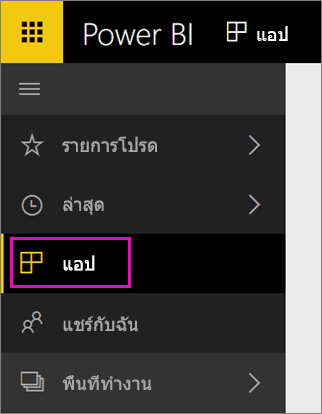

เมื่อการนำเข้าเสร็จสมบูรณ์ แอปใหม่จะปรากฏขึ้นบนหน้าแอปWhen the import is complete, the new app will appear on the Apps page.

1. เลือก**แอป**ในบานหน้าต่างนำทางด้านซ้าย > เลือกแอปSelect **Apps** in the left navigation pane > select the app.
   
     
2. คุณสามารถถามคำถามโดยการพิมพ์ในกล่องถามตอบ หรือคลิกที่ไทล์เพื่อเปิดรายงานพื้นฐานYou can ask a question by typing in the Q&A box, or click a tile to open the underlying report. 

