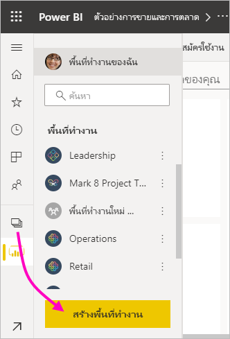
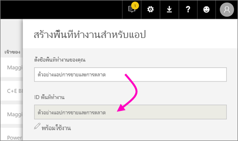
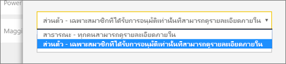
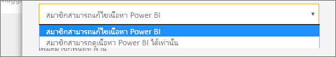
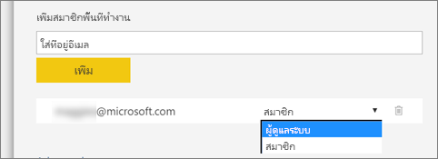

1. เริ่มต้นโดยการสร้างพื้นที่ทำงานStart by creating the workspace. เลือก **พื้นที่ทำงาน** > **สร้างพื้นที่ทำงาน**Select **Workspaces** > **Create workspace**. 
   
     
   
    ที่นี่คุณจะสามารถใส่เนื้อหาที่คุณและเพื่อนร่วมงานของคุณทำงานร่วมกันHere you'll put the content that you and your colleagues collaborate on.

2. ในแบนเนอร์ **คุณกำลังสร้างพื้นที่ทำงานที่อัปเกรดแล้ว** คลิก**แปลงกลับเป็นแบบคลาสสิก**In the **You're creating an upgraded workspace** banner, click **Revert to classic**. 

    

3. ตั้งชื่อพื้นที่ทำงานGive the workspace a name. ถ้าชื่อ **ID พื้นที่ทำงาน**ที่ตรงกันไม่สามารถใช้ได้ แก้ไขให้ ID ใหม่มีค่าไม่ซ้ำกันIf the corresponding **Workspace ID** isn't available, edit it to come up with a unique ID.
   
     แอปจะมีชื่อเดียวกันThe app will have the same name.
   
     

3. คุณมีสองสามตัวเลือกที่จะตั้งค่าYou have a few options to set. ถ้าคุณเลือก**สาธารณะ** ทุกคนในองค์กรคุณสามารถดูสิ่งที่อยู่ในพื้นที่ทำงานได้If you choose **Public**, anyone in your organization can see what’s in the workspace. **ส่วนตัว** หมายถึงมีเพียงสมาชิกเท่าของพื้นที่ทำงานเท่านั้นที่สามารถเห็นเนื้อหาได้**Private** means only members of the workspace can see its contents.
   
     
   
    คุณไม่สามารถเปลี่ยนการตั้งค่า สาธารณะ/ส่วนตัว ได้หลังจากคุณสร้างกลุ่มแล้วYou can't change the Public/Private setting after you've created the group.

4. คุณยังสามารถเลือกว่าสมาชิกสามารถเข้าถึงแบบ**แก้ไข**ได้หรือ**ดูเท่านั้น**You can also choose if members can **edit** or have **view-only** access.
   
     
   
     แค่เพิ่มบุคคลลงในพื้นที่ทำงานเพื่อให้พวกเขาสามารถแก้ไขเนื้อหาได้Only add people to the workspace so they can edit the content. ถ้าพวกเขาแค่ดูเนื้อหาเท่านั้น ไม่ต้องเพิ่มลงในพื้นที่ทำงานIf they're only going to view the content, don't add them to the workspace. คุณสามารถเพิ่มพวกเขาเมื่อคุณเผยแพร่แอปYou can include them when you publish the app.

5. ใส่ที่อยู่อีเมลของบุคคลที่คุณต้องการให้เข้าถึงพื้นที่ทำงาน และเลือก**เพิ่ม**Add email addresses of people you want to have access to the workspace, and select **Add**. คุณไม่สามารถเพิ่มนามแฝงของกลุ่ม เพิ่มได้แค่บุคคลอย่างเดียวYou can’t add group aliases, just individuals.

6. ตัดสินใจว่า แต่ละคนเป็นสมาชิกหรือผู้ดูแลระบบDecide whether each person is a member or an admin.
   
     
   
    ผู้ดูแลระบบสามารถแก้ไขพื้นที่ทำงาน รวมถึงการเพิ่มสมาชิกคนอื่น ๆAdmins can edit the workspace itself, including adding other members. สมาชิกสามารถแก้ไขเนื้อหาในพื้นที่ทำงาน นอกจากว่าพวกเขามีสิทธิ์เข้าถึงแบบดูเท่านั้นMembers can edit the content in the workspace, unless they have view-only access. ทั้งผู้ดูแลระบบและสมาชิกสามารถเผยแพร่แอปBoth admins and members can publish the app.

7. เลือก **บันทึก**Select **Save**.

Power BI จะสร้างพื้นที่ทำงาน และเปิดพื้นที่ทำงานนั้นPower BI creates the workspace and opens it. ซึ่งจะปรากฏขึ้นในรายการของพื้นที่ทำงานที่คุณเป็นสมาชิกIt appears in the list of workspaces you’re a member of. เนื่องจากคุณเป็นผู้ดูแลระบบ คุณสามารถเลือก**ตัวเลือกเพิ่มเติม** (...) เพื่อกลับมา และทำการเปลี่ยนแปลง เพิ่มสมาชิกใหม่ หรือเปลี่ยนแปลงสิทธิ์ของพวกเขาได้Because you’re an admin, you can select **More options** (...) to go back and make changes to it, adding new members or changing their permissions.

