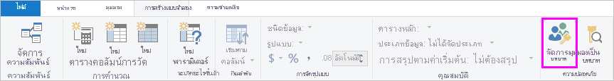
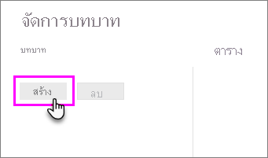
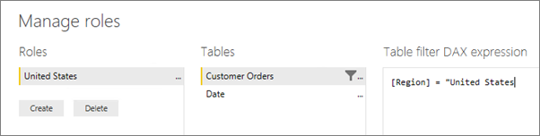
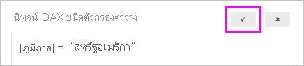

## <a name="define-roles-and-rules-in-power-bi-desktop"></a><span data-ttu-id="53b39-101">กำหนดบทบาทและกฎใน Power BI Desktop</span><span class="sxs-lookup"><span data-stu-id="53b39-101">Define roles and rules in Power BI Desktop</span></span>
<span data-ttu-id="53b39-102">คุณสามารถกำหนดบทบาทและกฎภายใน Power BI Desktop</span><span class="sxs-lookup"><span data-stu-id="53b39-102">You can define roles and rules within Power BI Desktop.</span></span> <span data-ttu-id="53b39-103">เมื่อคุณเผยแพร่ไปยัง Power BI ระบบจะเผยแพร่ไปยังคำจำกัดความบทบาทด้วยเช่นกัน</span><span class="sxs-lookup"><span data-stu-id="53b39-103">When you publish to Power BI, it also publishes the role definitions.</span></span>

<span data-ttu-id="53b39-104">เมื่อต้องการกำหนดบทบาทความปลอดภัย กรุณาทำตามขั้นตอนเหล่านี้</span><span class="sxs-lookup"><span data-stu-id="53b39-104">To define security roles, follow these steps.</span></span>

1. <span data-ttu-id="53b39-105">นำเข้าข้อมูลลงในรายงาน Power BI Desktop ของคุณหรือกำหนดค่าการเชื่อมต่อ DirectQuery</span><span class="sxs-lookup"><span data-stu-id="53b39-105">Import data into your Power BI Desktop report, or configure a DirectQuery connection.</span></span>
   
   > [!NOTE]
   > <span data-ttu-id="53b39-106">คุณไม่สามารถกำหนดบทบาทภายใน Power BI Desktop สำหรับข้อมูล Analysis Services แบบ live connection</span><span class="sxs-lookup"><span data-stu-id="53b39-106">You can't define roles within Power BI Desktop for Analysis Services live connections.</span></span> <span data-ttu-id="53b39-107">คุณต้องดำเนินการดังกล่าวภายในแบบจำลอง Analysis Services</span><span class="sxs-lookup"><span data-stu-id="53b39-107">You need to do that within the Analysis Services model.</span></span>
   > 
   > 
2. <span data-ttu-id="53b39-108">จากแท็บ**การวางรูปแบบ** ให้เลือก**จัดการบทบาท**</span><span class="sxs-lookup"><span data-stu-id="53b39-108">From the **Modeling** tab, select **Manage Roles**.</span></span>
   
   
3. <span data-ttu-id="53b39-110">จากหน้าต่าง **จัดการบทบาท** เลือก **สร้าง**</span><span class="sxs-lookup"><span data-stu-id="53b39-110">From the **Manage roles** window, select **Create**.</span></span>
   
   
4. <span data-ttu-id="53b39-112">ภายใต้ **บทบาท** ระบุชื่อสำหรับบทบาทดังกล่าว</span><span class="sxs-lookup"><span data-stu-id="53b39-112">Under **Roles**, provide a name for the role.</span></span> 
5. <span data-ttu-id="53b39-113">ภายใต้ **ตาราง** เลือกตารางที่คุณต้องการนำกฎ DAX ไปใช้</span><span class="sxs-lookup"><span data-stu-id="53b39-113">Under **Tables**, select the table to which you want to apply a DAX rule.</span></span>
6. <span data-ttu-id="53b39-114">ในกล่อง **นิพจน์ DAX ตัวกรองตาราง** ป้อนนิพจน์ DAX</span><span class="sxs-lookup"><span data-stu-id="53b39-114">In the **Table filter DAX expression** box, enter the DAX expressions.</span></span> <span data-ttu-id="53b39-115">นิพจน์นี้จะแสดงค่าจริงหรือเท็จ</span><span class="sxs-lookup"><span data-stu-id="53b39-115">This expression returns a value of true or false.</span></span> <span data-ttu-id="53b39-116">ตัวอย่างเช่น: ```[Entity ID] = “Value”```</span><span class="sxs-lookup"><span data-stu-id="53b39-116">For example: ```[Entity ID] = “Value”```.</span></span>
      
   

   > [!NOTE]
   > <span data-ttu-id="53b39-118">คุณสามารถใช้*username()* ภายในนิพจน์นี้ได้</span><span class="sxs-lookup"><span data-stu-id="53b39-118">You can use *username()* within this expression.</span></span> <span data-ttu-id="53b39-119">โปรดทราบว่า*username()* จะมีรูปแบบของ*DOMAIN\username*ภายใน Power BI Desktop</span><span class="sxs-lookup"><span data-stu-id="53b39-119">Be aware that *username()* has the format of *DOMAIN\username* within Power BI Desktop.</span></span> <span data-ttu-id="53b39-120">ภายในบริการ Power BI และเซิร์ฟเวอร์รายงาน Power BI นั้นอยู่ในรูปแบบของชื่อผู้ใช้หลัก (UPN) ของผู้ใช้</span><span class="sxs-lookup"><span data-stu-id="53b39-120">Within the Power BI service and Power BI Report Server, it's in the format of the user's User Principal Name (UPN).</span></span> <span data-ttu-id="53b39-121">อีกวิธีหนึ่งคือคุณสามารถใช้ *userprincipalname()* ซึ่งจะส่งกลับผู้ใช้ในรูปแบบของชื่อหลักเสมอ *ชื่อผู้ใช้\@contoso.com*</span><span class="sxs-lookup"><span data-stu-id="53b39-121">Alternatively, you can use *userprincipalname()*, which always returns the user in the format of their user principal name, *username\@contoso.com*.</span></span>
   > 
   > 

7. <span data-ttu-id="53b39-122">หลังจากสร้างนิพจน์ DAX แล้ว ให้เลือกเครื่องหมายถูกเหนือกล่องนิพจน์เพื่อตรวจสอบความถูกต้องของนิพจน์ดังกล่าว</span><span class="sxs-lookup"><span data-stu-id="53b39-122">After you've created the DAX expression, select the checkmark above the expression box to validate the expression.</span></span>
      
   
   
   > [!NOTE]
   > <span data-ttu-id="53b39-124">ในช่องนิพจน์นี้ คุณจะต้องใช้จุลภาคเพื่อคั่นการ์กิวเมนต์ฟังก์ชั่น DAX แม้ว่าคุณจะใช้ตำแหน่งที่ตั้งที่ปกติจะใช้เครื่องหมายอัฒภาค (เช่น ฝรั่งเศสหรือเยอรมัน)</span><span class="sxs-lookup"><span data-stu-id="53b39-124">In this expression box, you use commas to separate DAX function arguments even if you're using a locale that normally uses semicolon separators (e.g. French or German).</span></span> 
   >
   >
   
8. <span data-ttu-id="53b39-125">เลือก**บันทึก**</span><span class="sxs-lookup"><span data-stu-id="53b39-125">Select **Save**.</span></span>

<span data-ttu-id="53b39-126">คุณไม่สามารถกำหนดผู้ใช้ให้กับบทบาทภายใน Power BI Desktop</span><span class="sxs-lookup"><span data-stu-id="53b39-126">You can't assign users to a role within Power BI Desktop.</span></span> <span data-ttu-id="53b39-127">คุณกำหนดในบริการ Power BI</span><span class="sxs-lookup"><span data-stu-id="53b39-127">You assign them in the Power BI service.</span></span> <span data-ttu-id="53b39-128">คุณสามารถเปิดใช้งานความปลอดภัยแบบไดนามิกภายใน Power BI Desktop ด้วยการใช้ฟังก์ชัน DAX*username()* หรือ*userprincipalname()* และกำหนดค่าความสัมพันธ์ที่เหมาะสม</span><span class="sxs-lookup"><span data-stu-id="53b39-128">You can enable dynamic security within Power BI Desktop by making use of the *username()* or *userprincipalname()* DAX functions and having the proper relationships configured.</span></span> 

