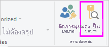
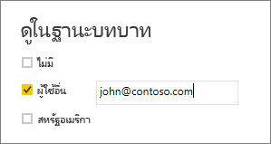

## ตรวจสอบบทบาทภายใน Power BI DesktopValidate the roles within Power BI Desktop
คุณสามารถทดสอบผลลัพธ์ของบทบาทภายใน Power BI Desktop ได้หลังจากที่คุณสร้างบทบาทของตัวเองแล้วAfter you've created your roles, test the results of the roles within Power BI Desktop.

1. จากแท็บ **การวางรูปแบบ** เลือก **ดูในฐานะบทบาท**From the **Modeling** tab, select **View as Roles**. 

    

    หน้าต่าง **ดูในฐานะบทบาท** จะปรากฏขึ้นเมื่อคุณมองเห็นบทบาทที่สร้างThe **View as roles** window appears, where you see the roles you've created.

    

3. เลือกบทบาทที่คุณสร้าง จากนั้นเลือก **ตกลง** เพื่อนำไปใช้กับบทบาทดังกล่าวSelect a role you created, and then select **OK** to apply that role. 

   รายงานจะแสดงข้อมูลที่เกี่ยวข้องกับบทบาทนั้นThe report renders the data relevant for that role.

4. นอกจากนี้คุณยังสามารถเลือก **ผู้ใช้อื่น** และใส่ผู้ใช้ที่กำหนดYou can also select **Other user** and supply a given user. 

    

   การใส่ชื่อผู้ใช้หลัก (UPN) เป็นสิ่งบริการ Power BI และเซิร์ฟเวอร์รายงาน Power BI จะใช้เป็นสิ่งที่ดีที่สุดIt's best to supply the User Principal Name (UPN) as that's what the Power BI service and Power BI Report Server use.

   ภายใน Power BI Desktop **ผู้ใช้อื่น** จะแสดงผลลัพธ์ที่แตกต่างกันในกรณีที่คุณใช้การรักษาความปลอดภัยแบบไดนามิก โดยยึดตามนิพจน์ DAX ของคุณWithin Power BI Desktop, **Other user** displays different results only if you're using dynamic security based on your DAX expressions. 

5. เลือก**ตกลง**Select **OK**. 

   รายงานจะแสดงผลตามสิ่งที่ผู้ใช้นั้นสามารถมองเห็นได้The report renders based on what that user can see.

