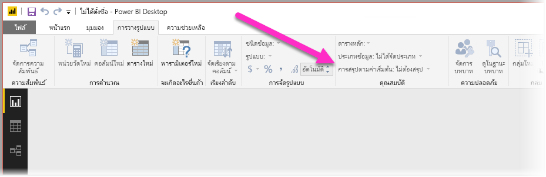
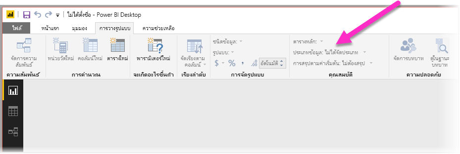
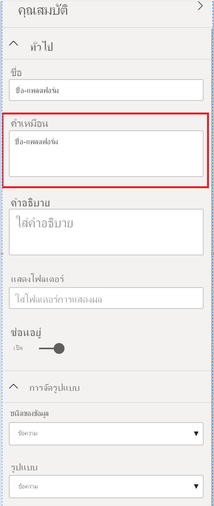

# แนวทางปฏิบัติที่ดีที่สุดในการเพิ่มประสิทธิภาพการถาม - ตอบใน Power BIBest practices to optimize Q&A in Power BI
การใช้วลีทั่วไปและภาษาที่เป็นธรรมชาติในการถามคำถามเกี่ยวกับข้อมูลของคุณเป็นการดำเนินการที่มีประสิทธิภาพUsing common phrases and natural language to ask questions of your data is powerful. และจะยิ่งมีประสิทธิภาพมากยิ่งขึ้นเมื่อได้รับคำตอบเกี่ยวกับข้อมูล ซึ่งเป็นสิ่งที่การถาม - ตอบใน Power BI ทำได้Even more powerful is when your data answers, which is what Q&A in Power BI does.

เมื่อต้องการเปิดใช้งานถาม-ตอบเพื่อแปลคอลเลกชันขนาดใหญ่ของคำถามซึ่งสามารถตอบสนองได้ ถาม-ตอบต้องตั้งสมมติฐานเกี่ยวกับแบบจำลองTo enable Q&A to successfully interpret the large collection of questions it's capable of responding to, Q&A must make assumptions about the model. ถ้าโครงสร้างของแบบจำลองของคุณไม่ตรงตามสมมติฐานเหล่านี้อย่างน้อยหนึ่งข้อ คุณต้องปรับเปลี่ยนแบบจำลองของคุณIf the structure of your model doesn't meet one or more of these assumptions, you need to adjust your model. การปรับแบบจำลองสำหรับถาม-ตอบ คือ การเพิ่มประสิทธิภาพที่ดีที่สุดที่เหมือนกับที่ใช้สำหรับแบบจำลองใด ๆ ใน Power BI ไม่ว่าคุณจะใช้ถาม-ตอบหรือไม่Those adjustments for Q&A are the same best-practice optimizations for any model in Power BI, regardless whether you use Q&A.

ในส่วนต่อไปนี้ เราจะอธิบายวิธีการปรับแบบจำลองของคุณเพื่อให้ทำงานได้ดีกับการถาม-ตอบใน Power BIIn the following sections, we describe how to adjust your model so it works well with Q&A in Power BI.

## การปรับแต่งอัตโนมัติที่การถาม - ตอบทำได้Automatic adjustments that Q&A makes

### ตารางหน่วยวัดMeasure tables

ในเวอร์ชันก่อนหน้าของการถาม - ตอบ ตารางหน่วยวัดจะทำให้การถาม - ตอบสับสนเนื่องจากตารางต้นแบบถูกยกเลิกการเชื่อมต่อIn previous versions of Q&A, measure tables would confuse Q&A as the underlying table was disconnected. การถาม - ตอบสามารถทำงานกับตารางหน่วยวัดได้เป็นอย่างดีในขณะนี้Q&A works just fine with measure tables now.

### ชื่อตารางที่ขัดแย้งกับชื่อคอลัมน์Table names conflicting with column names

ในเวอร์ชันก่อนหน้าของการถาม - ตอบ ถ้าตารางและคอลัมน์มีชื่อเดียวกัน ตารางจะใช้การกำหนดลักษณะIn previous versions of Q&A, if a table and column had the same name, the table would take preference. ปัญหานี้ได้รับการแก้ไขแล้ว ดังนั้นคุณไม่จำเป็นต้องแก้ไขปัญหานี้ในแบบจำลองของคุณอีกต่อไปThis issue has been addressed, so you don't have to fix this issue in your models anymore.

## ขั้นตอนแบบกำหนดเองเพื่อปรับปรุงการถาม - ตอบ Manual steps to improve Q&A

### ใช้เครื่องมือการถามตอบใหม่เพื่อแก้ไขคำถามของคุณUse the new Q&A tooling to fix your questions

ด้วยเครื่องมือการถามและตอบ คุณสามารถสอนศัพท์ทางธุรกิจหลักของคุณให้กับการถาม - ตอบ และแก้ไขคำถามที่ผู้ใช้ปลายทางถามWith the Q&A tooling, you can teach your core business terms to Q&A and fix questions your end users ask. บางครั้งคำถามบางอย่างยังไม่สามารถแก้ไขได้เนื่องจากข้อมูลมีรูปแบบที่ไม่ถูกต้องหรือไม่มีข้อมูลSometimes, some questions still can't be addressed because the data is shaped incorrectly or data is missing. ในกรณีนี้ ให้อ่านส่วนอื่น ๆ ด้านล่างเพื่อช่วยให้คุณในการปรับให้เหมาะสมIn this case, read the other sections below to help you optimize. อ่านเพิ่มเติมเกี่ยวกับ[เครื่องมือการถามตอบ](q-and-a-tooling-intro.md)Read more about [Q&A tooling](q-and-a-tooling-intro.md).

## เพิ่มความสัมพันธ์ที่หายไปAdd missing relationships

ถ้าแบบจำลองของคุณไม่มีความสัมพันธ์ระหว่างตาราง ทั้งรายงาน Power BI และการถาม - ตอบจะไม่สามารถแปลวิธีการรวมตารางเหล่านั้น.If your model is missing relationships between tables, neither Power BI reports nor Q&A can interpret how to join those tables. ความสัมพันธ์เป็นหลักสำคัญของแบบจำลองที่ดีRelationships are the cornerstone of a good model. ตัวอย่างเช่น คุณไม่สามารถสอบถามสำหรับ "ยอดขายรวมสำหรับลูกค้า Seattle" ถ้าไม่มีความสัมพันธ์ระหว่างตาราง *คำสั่ง* และตาราง *ลูกค้า*For example, you can't ask for the “total sales for Seattle customers” if the relationship between the *orders* table and the *customers* table is missing. รูปต่อไปนี้แสดงแบบจำลองที่จำเป็นต้องใช้งาน และแบบจำลองที่พร้อมสำหรับการถาม - ตอบThe following images show a model that needs work, and a model that is ready for Q&A. 

**ต้องการงาน****Needs work**

ในรูปแรก จะไม่มีความสัมพันธ์ระหว่างตารางลูกค้า ยอดขาย และผลิตภัณฑ์In the first image, there are no relationships between the Customers, Sales, and Products tables.

**พร้อมสำหรับการถาม-ตอบ****Ready for Q&A**

ในรูปแรก มีการกำหนดความสัมพันธ์ระหว่างตารางต่าง ๆIn the first image, relationships are defined between the tables.

## เปลี่ยนชื่อตารางและคอลัมน์Rename tables and columns

ตัวเลือกของตารางและคอลัมน์ที่มีความสำคัญสำหรับถาม-ตอบThe choice of tables and columns is important for Q&A. ตัวอย่างเช่น สมมติว่า คุณมีตารางชื่อ *สรุปลูกค้า* ที่ประกอบด้วยรายชื่อลูกค้าของคุณFor example, say you have a table named *CustomerSummary* that contains a list of your customers. คุณอาจต้องถามคำถามเช่น "แสดงสรุปรายชื่อลูกค้าในชิคาโก" แทน "แสดงลูกค้าในชิคาโก"You would need to ask questions like “List the customer summaries in Chicago” rather than “List the customers in Chicago”. 

แม้ว่าการถาม - ตอบจะสามารถทำการแบ่งคำพื้นฐานและตรวจหาพหูพจน์บางอย่าง แต่การถาม - ตอบจะสมมติว่าชื่อตารางและคอลัมน์ของคุณแสดงเนื้อหาได้อย่างถูกต้องWhile Q&A can do some basic word breaking and detecting plurals, Q&A assumes that your table and column names accurately reflect their content.

พิจารณาตัวอย่างอื่นConsider another example. สมมติว่า คุณมีตารางชื่อ *จำนวนพนักงาน* ที่ประกอบด้วยชื่อ และนามสกุลและหมายเลขประจำตัวของพนักงานImagine you have a table named *Headcount* that contains first and last names and employee numbers. คุณมีอีกตารางหนึ่งที่ชื่อว่า *พนักงาน* ที่ประกอบด้วยหมายเลขพนักงาน หมายเลขระบุตัวงาน และวันที่เริ่มต้นYou have another table named *Employees* that contains employee numbers, job numbers, and start dates. บุคคลที่คุณคุ้นชินกับแบบจำลองอาจเข้าใจโครงสร้างนี้People familiar with the model might understand this structure. บางคนที่ถาม "นับจำนวนพนักงาน" จะได้รับการนับจำนวนแถวจากตาราง "พนักงาน"Someone else who asks “count the employees” is going to get a count of the rows from the “Employees” table. ผลลัพธ์นี้อาจจะได้เป็นไปตามที่พวกเขาคิด เนื่องจากเป็นการนับจำนวนงานทุกงานที่พนักงานทุกคนเคยทำThis result is probably not what they had in mind, because it’s a count of every job every employee has ever had. การเปลี่ยนชื่อตารางเหล่านั้นเพื่อให้สอดคล้องกับสิ่งที่ปรกอบอยู่ในตารางจะช่วยให้เข้าใจง่ายขึ้นIt would be better to rename those tables to truly reflect what they contain.

**ต้องการงาน****Needs work**

ชื่อตารางเช่น *StoreInfo* และ *รายการผลิตภัณฑ์* ที่จำเป็นต้องใช้งานTable names like *StoreInfo* and *Product List* need work.

**พร้อมสำหรับการถาม-ตอบ****Ready for Q&A**

ตารางที่ชื่อว่า *ร้านค้า* และ *ผลิตภัณฑ์* จะทำงานได้ดียิ่งขึ้นTables named *Store* and *Products* work better.

## แก้ไขชนิดข้อมูลที่ไม่ถูกต้องFix incorrect data types

ข้อมูลนำเข้าสามารถมีชนิดข้อมูลที่ไม่ถูกต้องได้Imported data can have incorrect data types. โดยเฉพาะในคอลัมน์ *วัน* และ *เลข* ที่จะได้รับการนำเข้าเป็น *สตริง* จะไม่สามารถแปลโดยถาม-ตอบให้เป็นเป็นวันและตัวเลขIn particular, *date* and *number* columns that are imported as *strings* aren't interpreted by Q&A as dates and numbers. ควรตรวจสอบให้แน่ใจว่า คุณเลือกชนิดข้อมูลที่ถูกต้องในแบบจำลอง Power BI ของคุณMake sure you select the correct data type in your Power BI model.

## ทำเครื่องหมายคอลัมน์ปีและตัวระบุว่า “ไม่สรุป”Mark year and identifier columns as Don't Summarize

Power BI จะรวมคอลัมน์ที่เป็นตัวเลขโดยค่าเริ่มต้น ดังนั้นคำถามเช่น "ยอดขายรวมตามปี" อาจทำให้ยอดขายรวมทั้งหมดรวมไปกับยอดรวมทั้งหมดของปีPower BI aggressively aggregates numeric columns by default, so questions like “total sales by year” can sometimes result in a grand total of sales alongside a grand total of years. ถ้าคุณมีคอลัมน์เฉพาะที่คุณไม่ต้องการให้ Power BI แสดงลักษณะการทำงานนี้ ให้ตั้งค่าคุณสมบัติ **สรุปตามค่าเริ่มค้น** ในคอลัมน์ เป็น **ไม่สรุป**If you have specific columns where you don't want Power BI to exhibit this behavior, set the **Default Summarization** property on the column to **Don’t Summarize**. โปรดระวังคอลัมน์ **ปี** **เดือน** **วัน** และ **ID** เนื่องจากคอลัมน์เหล่านั้นเป็นปัญหาที่พบบ่อยที่สุดBe mindful of **year**, **month**, **day**, and **ID** columns, as those columns are the most frequent problems. คอลัมน์อื่น ๆ ที่ไม่ควรหาผลรวม เช่น *อายุ* อาจยังได้รับประโยชน์จากการตั้งค่า **สรุปตามค่าเริ่มต้น** ให้เป็น **ไม่สรุป** หรือ **ค่าเฉลี่ย**Other columns that aren’t sensible to sum, such as *age*, could also benefit from setting **Default Summarization** to **Don’t Summarize** or to **Average**. คุณจะพบการตั้งค่านี้ในแท็บ **โมเดล**You'll find this setting in the **Modeling** tab.

## เลือกประเภทข้อมูลสำหรับแต่ละคอลัมน์วันที่และภูมิศาสตร์Choose a Data Category for each date and geography column

**ประเภทข้อมูล** ให้ความรู้เชิงความหมายเพิ่มเติมเกี่ยวกับเนื้อหาของคอลัมน์ที่นอกเหนือจากชนิดข้อมูลThe **Data Category** provides additional semantic knowledge about the content of a column beyond its data type. ตัวอย่างเช่น คุณสามารถทำเครื่องหมายคอลัมน์จำนวนเต็มเป็นรหัสไปรษณีย ์คอลัมน์สตริงเป็นเมือง ประเทศ/ภูมิภาค และอื่น ๆFor example, you can mark an integer column as a zip code, a string column as a City, Country/Region, and so on. การถาม - ตอบจะใช้ข้อมูลนี้ในสองวิธีที่สำคัญ: สำหรับเลือกการแสดงภาพและความอคติทางภาษาQ&A uses this information in two important ways: For visualization selection and for language biases.

ขั้นแรก ถาม-ตอบใช้ข้อมูล **ประเภทข้อมูล** เพื่อช่วยเลือกชนิดของการแสดงวิชวลที่จะนำไปใช้First, Q&A uses the **Data Category** information to help make choices about what kind of visual display to use. ตัวอย่างเช่น คอลัมน์ที่มีวันที่หรือเวลา **ประเภทข้อมูล** เป็นตัวเลือกที่ดีสำหรับแกนแนวนอนของแผนภูมิเส้นหรือแกนเคลื่อนไหวของแผนภูมิฟองFor example, it recognizes that columns with date or time **Data Categories** are typically a good choice for the horizontal axis of a line chart or the play axis of a bubble chart. และสมมติว่าผลลัพธ์ที่ประกอบด้วยคอลัมน์ที่มี **หมวดหมู่ข้อมูล** ทางภูมิศาสตร์อาจดูดีบนแผนที่And it assumes that results containing columns with geographical **Data Categories** may look good on a map.

ขั้นตอนที่สอง ถาม-ตอบจะสร้างการคาดเดาทางการศึกษาเกี่ยวกับวิธีการที่ผู้ใช้มีแนวโน้มจะพูดเกี่ยวกับคอมลัมน์วันที่และภูมิศาสตร์ เพื่อช่วยให้เข้าใจบางชนิดของคำถามSecond, Q&A makes some educated guesses about how users are likely to talk about date and geography columns, to help it understand certain types of questions. ตัวอย่างเช่น "เมื่อ" ใน "John Smith ได้รับการว่าจ้างเมื่อใด"For example, the “when” in “When was John Smith hired?” เกือบจะแมปกับคอลัมน์วันที่ และ "สีน้ำตาล" ใน "นับลูกค้าในสีน้ำตาล" มีแนวโน้มจะเป็นเมืองกว่าสีผมis almost certain to map to a date column, and the “Brown” in “Count customers in Brown” is more likely to be a city than a hair color.

## เลือก “เรียงลำดับตามคอลัมน์” สำหรับคอลัมน์ที่เกี่ยวข้องChoose a Sort By Column for relevant columns

คุณสมบัติ **เรียงลำดับตามคอลัมน์** อนุญาตให้เรียงลำดับในหนึ่งคอลัมน์เพื่อเรียงลำดับคอลัมน์อื่นแทนโดยอัตโนมัติThe **Sort By Column** property allows sorting in one column to automatically sort a different column instead. ตัวอย่างเช่น เมื่อคุณถาม "เรียงลำดับการลูกค้าตามขนาดเสื้อ" คุณอาจต้องการให้คอลัมน์ “ขนาดเสื้อ” ของคุณเรียงลำดับตามหมายเลขขนาดพื้นฐาน (XS, S, M, L, XL) แทนที่จะเป็นเรียงตามตัวอักษร (L, M, S, XL, XS)For example, when you ask “sort customers by shirt size”, you probably want your Shirt Size column to sort by the underlying size number (XS, S, M, L, XL) rather than alphabetically (L, M, S, XL, XS).

## ลดความซ้ำซ้อนของแบบจำลองของคุณNormalize your model

มั่นใจได้ว่าเราไม่ได้กำลังแนะนำให้คุณจำเป็นต้องปรับรูปร่างแบบจำลองของคุณทั้งหมดRest assured that we’re not suggesting you need to reshape your entire model. อย่างไรก็ตามด้วยโครงสร้างบางอย่างทำให้การถามตอบไม่สามารถรับมือกับทุกอย่างได้However, certain structures are so difficult that Q&A doesn't handle them well. ถ้าคุณดำเนินการบางอย่างเกี่ยวกับการลดความซ้ำซ้อนของโครงสร้างแบบจำลอง การใช้งานของรายงาน Power BI จะเพิ่มขึ้นอย่างมาก เช่นเดียวกับความถูกต้องของผลการถาม-ตอบIf you perform some basic normalization of the structure of your model, the usability of Power BI reports increases significantly, along with the accuracy of Q&A results.

ปฏิบัติตามข้อกำหนดทั่วไปนี้: แต่ละ "สิ่ง" ที่ไม่ซ้ำกันที่ผู้ใช้พูดถึงควรจะแสดงโดยวัตถุแบบจำลองเดียว (ตารางหรือคอลัมน์)Follow this general rule: Each unique “thing” the user talks about should be represented by exactly one model object (table or column). ดังนั้น ถ้าผู้ใช้ของคุณพูดเกี่ยวกับลูกค้า ควรมีหนึ่งวัตถุ *ลูกค้า*So, if your users talk about customers, there should be one *customer* object. และถ้าผู้ใช้ของคุณพูดเกี่ยวกับการขาย ควรมีหนึ่งวัตถุ *การขาย*And, if your users talk about sales, there should be one *sales* object. ฟังดูง่าย ใช่หรือไม่Sounds simple, doesn't it? อาจจะง่าย ขึ้นอยู่กับรูปร่างของข้อมูลที่คุณกำลังเริ่มต้นด้วยDepending on the shape of the data you’re starting with, it can be. มีความสามารถในการจัดรูปร่างข้อมูลหลากหลาบที่พร้อมใช้งานใน **ตัวแก้ไขคิวรี** ถ้าคุณต้องการใช้ ในขณะที่การแปลงขอ้มูลโดยตรงมากขึ้นมากมายสามารถเกิดขึ้นเพียงแค่ใช้การคำนวณในแบบจำลอง Power BIThere are rich data shaping capabilities available in **Query Editor** if you need them, while many of the more straightforward transformations can happen simply using calculations in the Power BI model.

ส่วนต่อไปนี้ประกอบด้วยการแปลงข้อมูลทั่วไปบางอย่างที่คุณอาจจำเป็นต้องดำเนินการThe following sections contain some common transformations you might need to perform.

### สร้างตารางใหม่สำหรับเอนทิตีแบบหลายคอลัมน์Create new tables for multi-column entities

ถ้าคุณมีหลายคอลัมน์ที่ทำหน้าที่เป็นหน่วยที่แตกต่างกันเพียงหน่วยเดียวภายในตารางที่ใหญ่กว่า ควรมีการแยกคอลัมน์เหล่านั้นลงในตารางของตัวมันเองIf you have multiple columns that act as a single distinct unit within a larger table, those columns should be split out into their own table. ตัวอย่าง สมมติว่าคุณมีคอลัมน์ ชื่อผู้ติดต่อ เรื่องที่ติดต่อ และ เบอร์โทรติดต่อเป็นตารางใน *บริษัท* ของคุณFor example, say you have a Contact Name, Contact Title, and Contact Phone column within your *Companies* table. การออกแบบที่ดีจะต้องแยกตาราง *รายชื่อที่ติดต่อ* ให้ประกอบไปด้วย ชื่อ เรื่องที่ติดต่อ เบอร์โทรศัพท์และลิงก์กลับไปยังตารางของ *บริษัท* ได้A better design would be to have a separate *Contacts* table to contain the Name, Title, and Phone, and a link back to the *Companies* table. ซึ่งจะทำให้การถามคำถามเกี่ยวกับรายชื่อผู้ติดต่อของคำถามเกี่ยวกับบริษัทที่พวกเขาเป็นผู้ติดต่อง่ายขึ้นอย่างมาก และช่วยปรับปรุงความยืดหยุ่นการแสดงผลThat makes it easier to ask questions about contacts independently of questions about companies for which they are the contact, and improves display flexibility.

**ต้องการงาน****Needs work**

**พร้อมสำหรับการถาม-ตอบ****Ready for Q&A**

### Pivot เพื่อกำจัดกระเป๋าคุณสมบัติPivot to eliminate property bags

ถ้าคุณมี *กระเป๋าคุณสมบัติ* ในแบบจำลองของคุณ ควรมีการปรับโครงสร้างใหม่เพื่อให้มีคอลัมน์เดียวสำหรับแต่ละคุณสมบัติIf you have *property bags* in your model, they should be restructured to have a single column per property. แม้ว่ากระเป๋าคุณสมบัติจะสะดวกสำหรับการจัดการตัวเลขขนาดใหญ่ของคุณสมบัติ แต่จะยุ่งยากจากตัวเลขของข้อจำกัดทั่วไปที่ทั้งรายงาน Power BI หรือถาม-ตอบไม่ได้รับการออกแบบมาเพื่อแก้ไขปัญหาชั่วคราวProperty bags, while convenient for managing large numbers of properties, suffer from a number of inherent limitations that neither Power BI reports nor Q&A are designed to work around.

ตัวอย่างเช่น พิจารณาตาราง *CustomerDemographics* ที่มีคอลัมน์ CustomerID คุณสมบัติ และค่า โดยที่แต่ละแถวแสดงคุณสมบัติที่แตกต่างกันของลูกค้า (ตัวอย่างเช่น อายุ สถานะการสมรส เมือง และอื่น ๆ)For example, consider a *CustomerDemographics* table with CustomerID, Property, and Value columns, where each row represents a different property of the customer (for example, age, marital status, city, and so on). โดยการโอเวอร์โหลดความหมายของคอลัมน์ค่าที่ยึดตามเนื้อหาของคอลัมน์คุณสมบัติ จะทำให้การถาม-ตอบไม่สามารถแปลคิวรีส่วนใหญ่ที่อ้างอิงถึงได้By overloading the meaning of the Value column based on the content of the Property column, it becomes impossible for Q&A to interpret most queries that reference it. คำถามง่าย ๆ เช่น "แสดงอายุของลูกค้าแต่ละราย" อาจมีการใช้งาน เนื่องจากไม่สามารถแปลเป็น "แสดงลูกค้าและลูกค้าข้อมูลประชากรของลูกค้าที่คุณสมบัติเป็นอายุ"A simple question such as “show the age of each customer” might happen to work, since it could be interpreted as “show the customers and customer demographics where property is age”. อย่างไรก็ตาม โครงสร้างของแบบจำลองไม่สนับสนุนคำถามที่ซับซ้อนมากขึ้นเล็กน้อยเช่น "อายุเฉลี่ยของลูกค้าในชิคาโก"However, the structure of the model simply doesn’t support slightly more complex questions like “average age of customers in Chicago.” ในขณะที่ผู้ใช้ที่เขียนรายงาน Power BI โดยตรงสามารถค้นหาวิธีที่ฉลาดในการรับข้อมูลที่พวกเขาต้องการ ถาม-ตอบสามารถทำได้เฉพาะเมื่อแต่ละคอลัมน์มีเฉพาะความหมายเดียวเท่านั้นWhile users who directly author Power BI reports can sometimes find clever ways to get the data they are looking for, Q&A only works when each column has only a single meaning.

**ต้องการงาน****Needs work**

**พร้อมสำหรับการถาม-ตอบ****Ready for Q&A**

### รวมเพื่อกำจัดการแบ่งพาร์ติชันUnion to eliminate partitioning

ถ้าคุณแบ่งพาร์ติชันข้อมูลของคุณในหลายตาราง หรือมีค่าแบบ Pivot ในหลายคอลัมน์ การดำเนินการทั่วไปจำนวนหนึ่งจะเป็นเรื่องยาก หรือไม่สามารถใช้ได้สำหรับผู้ใช้ของคุณIf you've partitioned your data across multiple tables, or have pivoted values across multiple columns, a number of common operations are difficult or impossible for your users to achieve. ก่อนอื่นพิจารณาการแบ่งพาร์ทิชันตารางทั่วไปคือ ตาราง *ยอดขาย2000-2010* และตาราง *Sales2011-2020*Consider first a typical table partitioning: a *Sales2000-2010* table and a *Sales2011-2020* table. ถ้ารายงานที่สำคัญทั้งหมดของคุณมีการจำกัดให้กับทศวรรษที่กำหนด คุณอาจสามารถปล่อยไว้แบบนี้สำหรับรายงาน Power BIIf all of your important reports are restricted to a specific decade, you could probably leave it this way for Power BI reports. อย่างไรก็ตาม ความยืดหยุ่นของถาม-ตอบจะทำให้ผู้ใช้ของคุณสามารถคาดเดาคำตอบของคำถามได้เช่น "ยอดขายรวมตามปี"However, the flexibility of Q&A leads your users to expect answers to questions like “total sales by year.” หากคุณต้องการเปิดใช้งานคิวรี คุณต้องรวมข้อมูลลงในตารางแบบจำลอง Power BI เดียวFor this query to work, you need to union the data into a single Power BI model table.

ในทำนองเดียวกัน พิจารณาคอลัมน์ค่า Pivot ทั่วไป: ตาราง *จองทัวร์* ที่ประกอบด้วยคอลัมน์ผู้เขียน สมุด เมืองที่1 เมืองที่2 และ เมื่องที่3Similarly, consider a typical pivoted value column: a *BookTour* table containing Author, Book, City1, City2, and City3 columns. ด้วยโครงสร้างเช่นนี้ทำให้ไม่สามารถแม้แต่ไม่สามารถแปลคำถามง่าย ๆ เช่น "นับหนังสือตามเมือง" ให้ถูกต้องWith a structure like this, even simple questions like “count books by city” cannot be interpreted correctly. เพื่อให้คิวรีนี้ทำงาน สร้างตาราง *จองทัวร์ในเมือง* แบบแยก ซึ่งรวมค่าเมืองไว้ในคอลัมน์เดียวFor this query to work, create a separate *BookTourCities* table, which unions the city values into a single column.

**ต้องการงาน****Needs work**

**พร้อมสำหรับการถาม-ตอบ****Ready for Q&A**

### แยกคอลัมน์ที่จัดรูปแบบSplit formatted columns

ถ้าแหล่งข้อมูลที่คุณกำลังนำเข้าข้อมูลของคุณประกอบด้วยคอลัมน์ที่จัดรูปแบบ รายงาน Power BI (และการถาม-ตอบ) จะไม่สามารถเข้าถึงภายในคอลัมน์เพื่อแยกวิเคราะห์เนื้อหาIf the source from which you're importing your data contains formatted columns, Power BI reports (and Q&A) don't reach inside the column to parse its contents. ตัวอย่างเช่น ถ้าคุณมีคอลัมน์ **ที่อยู่แบบเต็ม** ที่ประกอบด้วยเมือง และประเทศ คุณควรแยกที่อยู่ดังกล่าวลงในคอลัมน์ที่อยู่ เมือง และประเทศเพื่อให้ผู้ใช้ของคุณสามารถถามคิวรีแต่ละที่อยู่ได้So if you have, for example, a **Full Address** column that contains the address, city, and country, you should also split it into Address, City, and Country columns so your users can query against them individually.

**ต้องการงาน****Needs work**

**พร้อมสำหรับการถาม-ตอบ****Ready for Q&A**

ในทำนองเดียวกัน ถ้าคุณมีคอลัมน์ชื่อเต็มของบุคคล ให้เพิ่มคอลัมน์ **ชื่อ** และ **นามสกุล** ในกรณีที่บุคคลต้องการถามคำถามโดยใช้ชื่อบางส่วนSimilarly, if you have any full name columns for a person, add **First Name** and **Last Name** columns, just in case someone wants to ask questions using partial names. 

### สร้างตารางใหม่สำหรับคอลัมน์หลายค่าCreate new tables for multi-value columns

ในสถานการณ์เดียวกัน ถ้าแหล่งข้อมูลที่คุณกำลังนำเข้าข้อมูลของคุณประกอบด้วยคอลัมน์แบบหลายค่า รายงาน Power BI (และการถาม-ตอบ) จะไม่สามารถเข้าถึงภายในคอลัมน์เพื่อแยกวิเคราะห์เนื้อหาAlso a similar situation, if the source from which you're importing your data contains multi-value columns, Power BI reports (and Q&A) can't reach inside the column to parse out the contents. ตัวอย่างเช่น ถ้าคุณมีคอลัมน์ผู้แต่งที่ประกอบด้วยชื่อของผู้แต่งเพลงหลายราย คุณควรแยกคอลัมน์ดังกล่าวลงในหลายแถวในตาราง *ผู้แต่ง* แยกSo, if you have, for example, a Composer column that contains the names of multiple composers for a song, you should split it into multiple rows in a separate *Composers* table.

**ต้องการงาน****Needs work**

**พร้อมสำหรับการถาม-ตอบ****Ready for Q&A**

### เพิ่มข้อมูลซ้ำซ้อนหรือข้อมูลกลุ่มเพื่อกำจัดความสัมพันธ์ที่ไม่ได้ใช้งานDenormalize to eliminate inactive relationships

ข้อยกเว้นหนึ่งข้อของกฎ "การลดความซ้ำซ้อนดีกว่า" จะเกิดขึ้นเมื่อมีมากกว่าหนึ่งเส้นทางในการรับจากตารางหนึ่งไปอีกตารางหนึ่งThe one exception to the “normalization is better” rule occurs when there is more than one path to get from one table to another. ตัวอย่างเช่น ถ้าคุณมีตาราง *เที่ยวบิน* ที่มีทั้งคอลัมน์รหัสเมืองต้นทาง และ รหัสเมืองปลายทาง ซึ่งแต่ละคอลัมน์เกี่ยวข้องกับตาราง *เมือง*For example, say you have a *Flights* table with both SourceCityID and DestinationCityID columns, each of which are related to the *Cities* table. หนึ่งในความสัมพันธ์เหล่านั้นจะต้องได้รับการทำเครื่องหมายเป็นไม่ได้ใช้งานOne of those relationships has to be marked as inactive. เนื่องจากถาม-ตอบสามารถใช้ความสัมพันธ์ที่ใช้งานได้ คุณจะไม่สามารถถามคำถามเกี่ยวกับต้นทางหรือปลายทางได้ทั้งนี้ขึ้นอยู่กับที่คุณเลือกSince Q&A can only use active relationships, you can't ask questions about either source or destination, depending on which you chose. หากคุณเพิ่มข้อมูลซ้ำซ้อนหรือข้อมูลกลุ่มในคอลัมน์ชื่อเมืองใน *ตารางเที่ยวบิน* คุณจะสามารถถามคำถาม เช่น "แสดงเที่ยวบินวันพรุ่งนี้กับเมืองต้นทางคือซีแอตเทิลและเมืองปลายทางคือซานฟรานซิสโก"If you instead denormalize the city name columns into the *Flights* table, you can ask questions like: “list the flights for tomorrow with a source city of Seattle and a destination city of San Francisco.”

**ต้องการงาน****Needs work**

**พร้อมสำหรับการถาม-ตอบ****Ready for Q&A**

### เพิ่มคำพ้องลงในตารางและคอลัมน์Add synonyms to tables and columns

ขั้นตอนนี้นำไปใช้กับถาม-ตอบโดยเฉพาะ (และไม่นำไปใช้กับรายงาน Power BI โดยทั่วไป)This step applies specifically to Q&A (and not to Power BI reports in general). ผู้ใช้มักจะมีหลายเงื่อนไขที่พวกเขาใช้เพื่ออ้างอิงถึงสิ่งเดียวกัน เช่น ยอดขายรวม ยอดขายสุทธิ ยอดขายสุทธิรวมUsers often have a variety of terms they use to refer to the same thing, such as total sales, net sales, total net sales. คุณสามารถเพิ่มคำพ้องเหล่านี้ลงในตารางและคอลัมน์ในแบบจำลอง Power BI ได้You can add these synonyms to tables and columns in the Power BI model. 

ขั้นตอนนี้จะมีความสำคัญThis step can be important. แม้ว่าจะมีชื่อตารางและชื่อคอลัมน์ที่ตรงไปตรงมา ผู้ใช้การถาม-ตอบจะถามคำถามโดยใช้คำศัพท์แรกที่พวกเขาเห็นEven with straightforward table and column names, users of Q&A ask questions using the vocabulary that first comes to them. และไม่มีการเลือกจากรายการของคอลัมน์ที่กำหนดไว้ล่วงหน้าThey're not choosing from a predefined list of columns. ยิ่งคำพ้องที่คุณเพิ่มเข้ามามีความสมเหตุสมผลมาก ประสบการณ์ของผู้ใช้กับรายงานของคุณก็ดียิ่งขึ้นเช่นกันThe more sensible synonyms you add, the better your users' experience is with your report. เมื่อต้องการเพิ่มคำพ้องใน Power BI Desktop ให้ไปยังมุมมองแบบจำลอง ให้เลือกแท็บการสร้างแบบจำลอง แล้วเลือกเขตข้อมูลหรือตารางTo add synonyms, in Power BI Desktop go to Model view, select the Modeling tab, and select a field or table. บานหน้าต่างคุณสมบัติจะแสดงกล่อง **คำพ้อง** ที่คุณสามารถเพิ่มคำพ้องได้The Properties pane shows the **Synonyms** box, where you can add synonyms.

 โปรดระมัดระวังเมื่อมีการเพิ่มคำพ้องBe careful when adding synonyms. การเพิ่มคำพ้องที่เหมือนกันในคอลัมน์หรือตารางมากกว่าหนึ่งรายการจะทำให้เกิดความกำกวมAdding the same synonym to more than one column or table introduces ambiguity. การถาม-ตอบจะใช้บริบทที่เป็นไปได้ในการเลือกระหว่างคำพ้องที่กำกวม แต่ไม่ใช่ว่าคำถามทั้งหมดจะมีบริบทเพียงพอQ&A uses context where possible to choose between ambiguous synonyms, but not all questions have sufficient context. ตัวอย่างเช่น เมื่อผู้ใช้ของคุณถาม "นับจำนวนลูกค้า" ถ้าคุณมีสามรายการที่มีคำพ้องคำว่า "ลูกค้า" ในโมเดลของคุณ ลูกค้าอาจไม่ได้รับคำตอบที่ต้องการFor example, when your user asks “count the customers”, if you have three things with the synonym “customer” in your model, the users might not get the answer they're looking for. ในกรณีเหล่านี้ โปรดตรวจสอบให้แน่ใจว่าคำพ้องหลักไม่ซ้ำกัน เนื่องจากเป็นคำที่ใช้ในการกล่าวซ้ำIn these cases, make sure the primary synonym is unique, as that's what is used in the restatement. และยังสามารถแจ้งเตือนผู้ใช้เกี่ยวกับความกำกวมได้ (ตัวอย่างเช่น การกล่าวซ่ำของ "แสดงจำนวนบันทึกลูกค้าที่เก็บถาวร") พูดเป็นนัยว่าพวกเขาอาจต้องตั้งคำถามให้แตกต่างกันIt can alert the user to the ambiguity (for example, a restatement of “show the number of archived customer records”), hinting they might want to ask it differently.

## ขั้นตอนถัดไปNext steps

[ข้อมูลเบื้องต้นเกี่ยวกับการถามตอบของ Power BIIntro to Power BI Q&A](q-and-a-intro.md)
