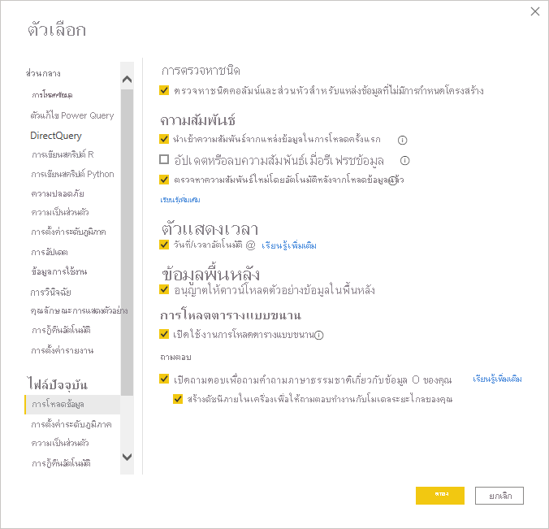

# ใช้ภาษาธรรมชาติกับ import, live connect และ direct query

คุณลักษณะ Q&A ใน Power BI ช่วยให้คุณรับคำตอบจากข้อมูลของคุณได้อย่างรวดเร็วโดยใช้ภาษาธรรมชาติเพื่อถามคำถามเกี่ยวกับข้อมูลนั้น บทความนี้อธิบายถึงวิธีการใช้การจัดทำดัชนีและการแคชเพื่อปรับปรุงประสิทธิภาพสำหรับการกำหนดค่าที่รองรับแต่ละรายการ

## Q&A รองรับแหล่งข้อมูลใดบ้าง

การกำหนดค่าต่อไปนี้รองรับ Q&A :

- โหมดการนำเข้า
- โหมด Live connect - การใช้ SQL Server Analysis Services ภายในองค์กร, Azure Analysis Services หรือชุดข้อมูล Power BI
- Direct Query – Azure Synapse, Azure SQL และ SQL Server 2019 แม้ว่าแหล่งข้อมูลอื่นอาจทำงานได้ในโหมด Direct Query แต่เราไม่ได้สนับสนุนแหล่งข้อมูลเหล่านี้อย่างเป็นทางการ

ตามค่าเริ่มต้น Q&A จะเปิดใช้งานภายในรายงานถ้าคุณใช้วิชวล Q&A พร้อมท์จะปรากฏขึ้นถ้าคุณกำลังใช้ Direct Query หรือ Live connect คุณสามารถเปิด/ปิดความสามารถภาษาธรรมชาติสำหรับรายงานได้อย่างชัดเจนโดยเข้าไปในตัวเลือก

สำหรับข้อมูลเพิ่มเติม โปรดดูที่ [ข้อจำกัดของ Power BI Q&A](q-and-a-limitations.md)

## การจัดทำดัชนีทำงานร่วมกับ Q&A อย่างไร

เมื่อคุณเปิดใช้งาน Q&A ดัชนีจะถูกสร้างขึ้นเพื่อให้คำติชมแบบเรียลไทม์แก่ผู้ใช้อย่างรวดเร็วและช่วยตีความคำถามของผู้ใช้ ดัชนีอาจใช้เวลาสักครู่ในการสร้างและจะมีองค์ประกอบและข้อจำกัดดังต่อไปนี้

- ชื่อคอลัมน์และตารางทั้งหมดจะถูกแทรกลงในดัชนี เว้นแต่จะถูกปิดอย่างชัดเจนจากภายในเครื่องมือ Q&A
- ค่าข้อความทั้งหมดที่น้อยกว่า 100 อักขระจะถูกจัดทำดัชนี ค่าข้อความที่มากกว่า 100 อักขระจะไม่ถูกจัดทำดัชนี 
- Q&A จะเก็บค่าที่ไม่ซ้ำกันสูงสุด 5 ล้านค่าในดัชนี หากคุณมีค่าเกินเกณฑ์นี้ ดัชนีจะไม่เก็บค่าที่เป็นไปได้ทั้งหมดซึ่งอาจลดความแม่นยำของผลลัพธ์ที่คุณได้รับจาก Q&A
- หากเกิดข้อผิดพลาดระหว่างการจัดทำดัชนี ดัชนีจะยังคงอยู่ในสถานะบางส่วนและจะถูกสร้างขึ้นใหม่ในการรีเฟรชครั้งถัดไป ตามที่อธิบายไว้ในส่วนถัดไป

## มีการรีเฟรชและแคชดัชนีบ่อยแค่ไหน

ใน Power BI Desktop ดัชนีจะถูกสร้างขึ้นในเวลาที่คุณใช้ Q&A ไอคอนเล็ก ๆ จะปรากฏขึ้นเพื่อแจ้งให้คุณทราบว่ากำลังมีการสร้างดัชนี ในช่วงเวลานี้ อาจใช้เวลาโหลดวิชวล Q&A รวมถึงคำแนะนำสักครู่

ในบริการ Power BI ดัชนีจะถูกสร้างขึ้นใหม่เมื่อเผยแพร่/เผยแพร่ใหม่และรีเฟรช ดัชนี Q&A ไม่ได้ถูกสร้างขึ้นโดยอัตโนมัติเสมอไป และบางครั้งจะขึ้นอยู่กับเกณฑ์ตามความต้องการเพื่อปรับการรีเฟรชชุดข้อมูลให้เหมาะสม สำหรับ Direct Query เราจะจัดทำดัชนีข้อมูลไม่เกินวันละครั้งเพื่อลดผลกระทบต่อแหล่งที่มาของ Direct Query

## ขั้นตอนถัดไป

คุณสามารถผสานรวมภาษาธรรมชาติในรายงานของคุณได้หลายวิธี สำหรับข้อมูลเพิ่มเติม โปรดดูบทความเหล่านี้:

* [วิชวลระบบถามตอบ](../visuals/power-bi-visualization-q-and-a.md)
* [แนวทางปฏิบัติที่ดีที่สุดของระบบถามตอบ](q-and-a-best-practices.md)
