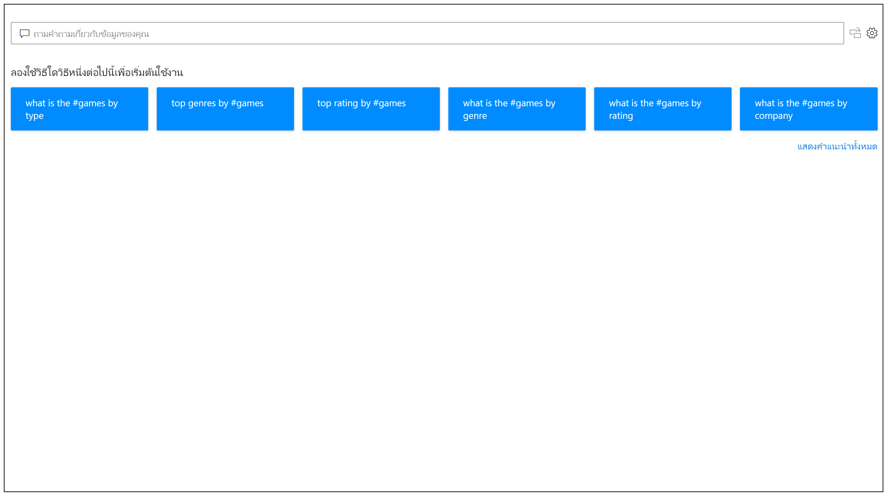
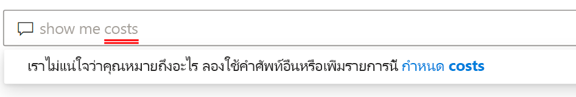
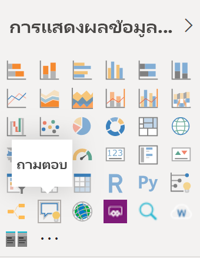
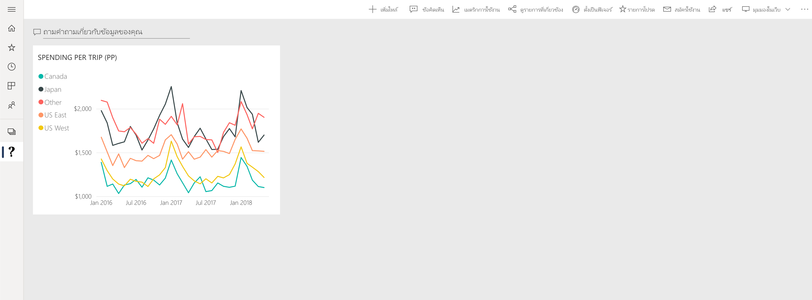

# ข้อมูลเบื้องต้นเกี่ยวกับระบบถามตอบของ Power BIIntro to Power BI Q&A

บางครั้งวิธีที่เร็วที่สุดในการให้ได้คำตอบจากข้อมูลของคุณคือการค้นหาข้อมูลของคุณโดยใช้ภาษาธรรมชาติSometimes the fastest way to get an answer from your data is to perform a search over your data using natural language. คุณลักษณะระบบถามตอบใน Power BI ช่วยให้คุณสามารถสำรวจข้อมูลของคุณด้วยคำพูดของคุณเองโดยใช้ภาษาธรรมชาติThe Q&A feature in Power BI lets you explore your data in your own words using natural language. ระบบถามตอบเป็นระบบแบบโต้ตอบ แถมยังสนุกด้วยQ&A is interactive, even fun. บ่อยครั้งที่คำถามหนึ่งนำไปสู่อีกคำถามหนึ่งเนื่องจากการแสดงข้อมูลด้วยภาพแสดงให้เห็นเส้นทางที่น่าสนใจในการติดตามOften, one question leads to others as the visualizations reveal interesting paths to pursue. การถามคำถามเป็นเพียงการเริ่มต้นAsking the question is just the beginning. สำรวจข้อมูลของคุณ เพื่อปรับแต่งหรือขยายคำถามของคุณ ค้นพบข้อมูลใหม่ หรือให้ความสำคัญกับรายละเอียดและซูมออกเพื่อให้ได้มุมมองที่กว้างขึ้นTravel through your data, refining or expanding your question, uncovering new information, zeroing in on details, or zooming out for a broader view. ประสบการณ์การใช้งานเป็นแบบโต้ตอบและรวดเร็วโดยใช้การจัดเก็บในหน่วยความจำThe experience is interactive and fast, powered by an in-memory storage. 

ระบบถามตอบของ Power BI เป็นระบบฟรีและพร้อมใช้งานสำหรับผู้ใช้ทุกคนPower BI Q&A is free and available to all users. ใน Power BI Desktop ผู้ออกแบบรายงานสามารถใช้ระบบถามตอบ เพื่อสำรวจข้อมูลและสร้างการแสดงผลข้อมูลด้วยภาพIn Power BI Desktop, report designers can use Q&A to explore data and create visualizations. ในบริการของ Power BI ทุกคนสามารถสำรวจข้อมูลของพวกเขาได้ด้วยระบบถามตอบIn the Power BI service, everyone can explore their data with Q&A. แอปมือถือของเรารองรับ Q&A ด้วย ซึ่งมาพร้อมกับผู้ช่วย Q&A เสมือนใน iOS และวิชวล Q&A บนอุปกรณ์ AndroidOur mobile apps support Q&A too, with the Q&A virtual assistant in iOS and the Q&A visual on Android devices. ถ้าคุณมีสิทธิ์ในการแก้ไขแดชบอร์ดหรือรายงาน คุณยังสามารถปักหมุดผลลัพธ์ของระบบถามตอบได้อีกด้วยIf you have permission to edit a dashboard or report, you can also pin your Q&A results.

## วิธีการใช้ระบบถามตอบHow to use Q&A

ถึงแม้ว่าคุณยังไม่เริ่มพิมพ์ ถามตอบจะแสดงหน้าจอใหม่ ด้วยคำแนะนำเพื่อช่วยคุณสร้างคำถามของคุณEven before you start typing, Q&A displays a new screen with suggestions to help you form your question. เริ่มจากคำถามที่แนะนำหนึ่งคำถามหรือไม่ก็พิมพ์คำถามของคุณเองStart either from one of the suggested questions or type your own questions. ระบบถามตอบรองรับคำถามที่หลากหลาย รวมถึงแต่ไม่จำกัดเพียง:Q&A supports a wide range of questions, including but not limited to:

- **ถามคำถามที่เป็นธรรมชาติ** ยอดขายใดมีรายได้สูงสุด?**Ask natural questions** Which sales has the highest revenue?
- **ใช้การกรองวันที่ที่เกี่ยวข้อง** แสดงยอดขายของฉันในปีที่แล้ว**Use relative date filtering** Show me sales in the last year
- **ส่งกลับเฉพาะผลิตภัณฑ์ยอดนิยม N รายการ** ผลิตภัณฑ์ 10 อันดับแรกตามยอดขาย**Return only the top N** Top 10 products by sales
- **ระบุตัวกรอง** แสดงยอดขายในสหรัฐอเมริกา**Provide a filter** Show me sales in the USA
- **ระบุเงื่อนไขที่ซับซ้อน** แสดงยอดขายที่หมวดหมู่ผลิตภัณฑ์คือหมวดหมู่ 1 หรือหมวดหมู่ 2**Provide complex conditions** Show me sales where product category is Category 1 or Category 2
- **ส่งกลับวิชวลที่เฉพาะเจาะจง** แสดงยอดขายตามผลิตภัณฑ์เป็นแผนภูมิวงกลม**Return a specific visual** Show me sales by product as pie chart
- **ใช้การรวมที่ซับซ้อน** แสดงมัธยฐานของยอดขายตามผลิตภัณฑ์**Use complex aggregations** Show me median sales by product
- **เรียงลำดับผลลัพธ์** แสดงรายชื่อประเทศที่มียอดขายสูงสุด 10 ประเทศโดยเรียงตามรหัสประเทศ**Sort results** Show me top 10 countries by sales ordered by country code
- **เปรียบเทียบข้อมูล** แสดงวันที่ตามยอดขายทั้งหมดเทียบกับต้นทุนทั้งหมด**Compare data** Show me date by total sales vs total cost
- **ดูแนวโน้ม** แสดงยอดขายเมื่อเวลาผ่านไป**View trends** Show me sales over time

### เติมข้อความอัตโนมัติAutocomplete

ในขณะที่คุณพิมพ์คำถามของคุณ ระบบถามตอบของ Power BI จะแสดงคำแนะนำที่เกี่ยวข้องและตามบริบทเพื่อช่วยให้คุณทำงานได้อย่างรวดเร็วด้วยภาษาธรรมชาติAs you type your question, Power BI Q&A shows relevant and contextual suggestions to help you quickly become productive with natural language. ขณะที่คุณพิมพ์ คุณจะได้รับผลป้อนกลับและผลลัพธ์ทันทีAs you type, you get immediate feedback and results. การใช้งานจะคล้ายกับการพิมพ์ในเครื่องมือค้นหาThe experience is similar to typing in a search engine.

### ขีดเส้นใต้สีแดง/สีน้ำเงิน/สีส้มRed/Blue/Orange underlines

ระบบถามตอบจะแสดงคำพร้อมขีดเส้นใต้เพื่อช่วยให้คุณเห็นว่าคำใดที่ระบบเข้าใจหรือไม่รู้จักQ&A shows words with underlines to help you see which words the system understood or didn't recognize. ขีดเส้นใต้สีน้ำเงินทึบแสดงว่าระบบได้จับคู่คำกับเขตข้อมูลหรือค่าในแบบจำลองข้อมูลเรียบร้อยแล้วA solid blue underline indicates that the system successfully matched the word to a field or value in the data-model. ตัวอย่างด้านล่างแสดงว่าระบบถามตอบรู้จักคำว่า *ยอดขายใน EU*The example below shows that Q&A recognized the word *EU Sales*.

 การขีดเส้นใต้สีส้มจะแสดงว่าคำดังกล่าว/เหล่านั้นจะถูกจัดประเภทเป็น *ความมั่นใจต่ำ*An orange underline indicates the word/words is categorized as *low confidence*. ถ้าคุณพิมพ์คำที่คลุมเครือหรือไม่ชัดเจน เขตข้อมูลจะถูกขีดเส้นใต้เป็นสีส้มIf you type a vague or ambiguous word, the field is underlined in orange. ตัวอย่างอาจเป็นคำว่า 'ยอดขาย'An example could be the word 'Sales'. อาจมีหลายเขตข้อมูลที่มีคำว่า 'ยอดขาย' ดังนั้นระบบจะใช้ขีดเส้นใต้สีส้มเพื่อพร้อมท์ให้คุณเลือกเขตข้อมูลที่คุณหมายถึงMultiple fields could contain the word 'Sales', so the system uses a orange underline to prompt you to choose the field you meant. อีกตัวอย่างหนึ่งของปัญหาประเภทความมั่นใจต่ำ อาจเกิดขึ้นได้ถ้าคุณพิมพ์คำว่า 'พื้นที่' แต่คอลัมน์ที่จับคู่ด้วยคือ 'ภูมิภาค'Another example of low confidence could be if you type the word 'area', but the column it matches is 'region'. คำถามและคำตอบของ Power BI จะจดจำคำที่มีความหมายเหมือนกัน ด้วยความร่วมมือกับ Bing และ Office และการตีความการเปลี่ยนชื่อจากภายในรายงานเพื่อใช้เป็นคำแนะนำที่เป็นไปได้Power BI Q&A recognizes words that mean the same thing, thanks to the integration with Bing and Office and also interpreting renames from within a report as potential suggestions. ระบบคำถามและคำตอบจะขีดเส้นใต้คำเป็นสีส้มเพื่อให้คุณรู้ว่าไม่ใช่การจับคู่โดยตรงQ&A underlines the word in orange so you know it's not a direct match.

เส้นใต้สีแดงหมายถึงระบบคำถามและคำตอบไม่รู้จักคำดังกล่าวเลยA red underline means Q&A didn't recognize the word at all. คุณอาจพบปัญหานี้ได้จากการใช้คำเฉพาะโดเมนที่ไม่เคยกล่าวถึงในที่ใดเลยบนข้อมูล หรือมีการตั้งชื่อเขตข้อมูลไม่ถูกต้องYou could encounter this issue by using a domain-specific term that isn't mentioned anywhere in the data, or the data fields are incorrectly named. ตัวอย่างเช่น การใช้คำว่า 'ต้นทุน' แต่ทว่าคำนี้ไม่เคยปรากฎอยู่ในที่ใดเลยบนข้อมูลAn example could be using the word 'Costs' though the word doesn't exist anywhere in the data. คำดังกล่าวนั้นอยู่ในพจนานุกรมภาษาอังกฤษ แต่รับคำถามและคำตอบจะทำเครื่องหมายคำนี้ด้วยการขีดเส้นใต้สีแดงเพื่อแสดงว่าไม่พบคำนี้ในข้อมูลThe word is in the English dictionary, but Q&A will mark this term with a red underline to indicate it didn't find this term with respect to the data.

> [!NOTE]
> คุณสามารถปรับแต่งสีของเส้นใต้เป็นสีน้ำเงิน/สีแดง/สีส้มได้ในบานหน้าต่าง **การจัดรูปแบบวิชวล** ของระบบคำถามและคำตอบYou can customize the blue/red/orange underline colors in the Q&A **Visual formatting** pane. นอกจากนี้ บทความ [การใช้เครื่องมือถามตอบ](q-and-a-tooling-teach-q-and-a.md) ยังอธิบายถึง *การสอนระบบถามตอบ* ซึ่งคุณใช้เพื่อกำหนดคำศัพท์ที่ระบบถามตอบไม่รู้จักAlso, the [Q&A tooling](q-and-a-tooling-teach-q-and-a.md) article explains *Teach Q&A*, which you use to define terms Q&A didn't recognize.

### ผลลัพธ์ของการแสดงผลข้อมูลด้วยภาพVisualization results

ในขณะที่คุณพิมพ์คำถามของคุณ ระบบถามตอบจะพยายามตีความและแสดงคำตอบทันทีAs you type your question, Q&A tries to instantly interpret and visualize the answer. เนื่องจากเป็นส่วนหนึ่งของการอัปเดตล่าสุด ตอนนี้ระบบถามตอบจะพยายามตีความคำถามและลงจุดเขตข้อมูลไปยังแกนที่ถูกต้องโดยอัตโนมัติAs part of the latest updates, Q&A now tries to interpret the question and plot the fields automatically to the correct axis. ตัวอย่างเช่น ถ้าคุณพิมพ์ 'ยอดขายตามปี' ระบบถามตอบจะตรวจจับว่าปีนั้นเป็นเขตข้อมูลวันที่ และจะจัดลำดับความสำคัญให้เขตข้อมูลนี้อยู่ในแกน X เสมอFor example, if you type 'Sales by year', Q&A detects that year is a date field and always prioritizes placing this field on the X axis. ถ้าคุณต้องการเปลี่ยนชนิดการแสดงผลข้อมูลด้วยภาพ ให้พิมพ์ 'เป็น *ชนิดแผนภูมิ*' หลังคำถามIf you want to change the visualization type, type 'as *chart type*' after the question. ในขณะนี้ ระบบถามตอบรองรับการแสดงผลข้อมูลด้วยภาพชนิดต่าง ๆ ดังต่อไปนี้:Q&A currently supports these types of visualizations:

- แผนภูมิเส้นLine chart
- แผนภูมิแท่งBar chart
- เมทริกซ์Matrix
- ตารางTable
- การ์ดCard
- พื้นที่Area
- Pie chartPie chart
- แผนภูมิกระจาย/ฟองScatter/Bubble chart
 

## เพิ่มระบบถามตอบไปยังรายงานAdd Q&A to a report

คุณสามารถเพิ่มระบบถามตอบไปยังรายงานใน Power BI Desktop หรือบริการของ Power BI ด้วยวิธีที่ต่างกันสองวิธี:You can add Q&A to a report in Power BI Desktop or the Power BI service in two different ways:

- เพิ่มวิชวลระบบถามตอบAdd a Q&A visual.
- เพิ่มปุ่มถามตอบAdd a Q&A button.

เมื่อต้องการเพิ่มวิชวลระบบถามตอบไปยังรายงาน ให้เลือกไอคอน **ถามตอบ** ใหม่ จากนั้นเลือกวิชวลระบบถามตอบใหม่ในบานหน้าต่างการแสดงผลข้อมูลด้วยภาพTo add the Q&A visual to a report, select the new **Q&A** icon the select the new Q&A visual in the Visualization pane. อีกวิธีหนึ่งคือดับเบิลคลิกที่ใดก็ได้บนพื้นที่รายงานเพื่อแทรกวิชวลระบบถามตอบAlternatively, double-click anywhere on the report canvas to insert the Q&A visual.

หากต้องการเพิ่มปุ่ม ให้เลือก **ปุ่ม** > **ถามตอบ** บนริบบอน **หน้าหลัก** ซึ่งคุณสามารถปรับแต่งรูปภาพปุ่มถามตอบได้อย่างสมบูรณ์To add a button, on the **Home** ribbon, select **Buttons** > **Q&A** You can completely customize the Q&A button image.

> [!NOTE]
> เมื่อคุณเริ่มต้นระบบถามตอบจากปุ่ม ระบบจะยังคงใช้ระบบถามตอบ แบบเก่าอยู่When you start Q&A from the button, it still uses the old Q&A. Power BI ในเวอร์ชันที่เผยแพร่ออกมาทีหลังจะเปลี่ยนแปลงไปแล้วSubsequent releases of Power BI will change that.

## ใช้ระบบถามตอบสำหรับแดชบอร์ดUse Q&A for dashboards

ตามค่าเริ่มต้น คุณสามารถใช้งานระบบถามตอบได้จากด้านบนของแดชบอร์ดBy default, Q&A is available at the top of dashboards. หากต้องการใช้ระบบถามตอบ ให้พิมพ์ในกล่อง **ถามคำถามกับข้อมูลของคุณ**To use Q&A, type in the **Ask a question on your data** box.

## ขั้นตอนถัดไปNext steps

คุณสามารถผสานรวมภาษาธรรมชาติในรายงานของคุณได้หลายวิธีYou can integrate natural language in your reports in a variety of ways. สำหรับข้อมูลเพิ่มเติม โปรดดูบทความเหล่านี้:For more information, see these articles:

* [วิชวลระบบถามตอบQ&A visual](../visuals/power-bi-visualization-q-and-a.md)
* [แนวทางปฏิบัติที่ดีที่สุดของระบบถามตอบQ&A best practices](q-and-a-best-practices.md)
