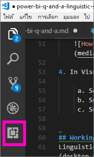

# <a name="edit-qa-linguistic-schema-and-add-phrasings-in-power-bi-desktop"></a><span data-ttu-id="ec6ea-103">แก้ไขรูปแบบภาษาและเพิ่มการใช้ถ้อยคำของ Q&A ใน Power BI Desktop</span><span class="sxs-lookup"><span data-stu-id="ec6ea-103">Edit Q&A linguistic schema and add phrasings in Power BI Desktop</span></span> 
<span data-ttu-id="ec6ea-104">การใช้วลีทั่วไปและภาษาที่เป็นธรรมชาติในการถามคำถามเกี่ยวกับข้อมูลของคุณเป็นการดำเนินการที่มีประสิทธิภาพ</span><span class="sxs-lookup"><span data-stu-id="ec6ea-104">Using common phrases and natural language to ask questions of your data is powerful.</span></span> <span data-ttu-id="ec6ea-105">มีประสิทธิภาพยิ่งขึ้นหากข้อมูลของคุณสามารถตอบคำถามได้</span><span class="sxs-lookup"><span data-stu-id="ec6ea-105">Even more powerful is when your data answers.</span></span> <span data-ttu-id="ec6ea-106">เมื่อคุณถามคำถามในส่วนถามตอบของ Power BI ส่วนถามตอบจะพยายามอย่างมากที่สุดเพื่อตอบคำถามให้ถูกต้อง</span><span class="sxs-lookup"><span data-stu-id="ec6ea-106">When you ask Power BI Q&A a question, it makes a best effort to answer correctly.</span></span> <span data-ttu-id="ec6ea-107">แต่คุณสามารถปรับปรุงการโต้ตอบของส่วนถามตอบได้ดียิ่งขึ้น คุณก็จะสามารถปรับปรุงคำตอบได้</span><span class="sxs-lookup"><span data-stu-id="ec6ea-107">But for even better Q&A interactions, you can improve the answers.</span></span> <span data-ttu-id="ec6ea-108">วิธีหนึ่งคือโดยการแก้ไขรูปแบบภาษา</span><span class="sxs-lookup"><span data-stu-id="ec6ea-108">One way is by editing the linguistic schema.</span></span> 

<span data-ttu-id="ec6ea-109">ทั้งหมดเริ่มต้นจากข้อมูลองค์กรของคุณ</span><span class="sxs-lookup"><span data-stu-id="ec6ea-109">It all starts with your enterprise data.</span></span>  <span data-ttu-id="ec6ea-110">หากมีแบบจำลองข้อมูลที่ดี ผู้ใช้ก็จะสามารถรับคำตอบที่มีคุณภาพได้ง่ายขึ้น</span><span class="sxs-lookup"><span data-stu-id="ec6ea-110">The better the data model, the easier it will be for users to get quality answers.</span></span> <span data-ttu-id="ec6ea-111">วิธีหนึ่งในการปรับปรุงแบบจำลองเพื่อการเพิ่มรูปแบบภาษาที่กำหนดและแบ่งหมวดหมู่คำศัพท์และความสัมพันธ์ระหว่างตารางและชื่อคอลัมน์ในชุดข้อมูลของคุณ</span><span class="sxs-lookup"><span data-stu-id="ec6ea-111">One way to improve the model is to add a linguistic schema that defines and categorizes terminology and relationships between table and column names in your dataset.</span></span> <span data-ttu-id="ec6ea-112">Power BI Desktop เป็นที่ที่คุณสามารถจัดการรูปแบบภาษาของคุณได้</span><span class="sxs-lookup"><span data-stu-id="ec6ea-112">Power BI Desktop is where you manage your linguistic schemas.</span></span> 

<span data-ttu-id="ec6ea-113">ส่วนถามตอบมีอยู่สองด้าน</span><span class="sxs-lookup"><span data-stu-id="ec6ea-113">There are two sides to Q&A.</span></span>  <span data-ttu-id="ec6ea-114">ด้านแรกคือการเตรียมการ หรือ *การสร้างแบบจำลอง*</span><span class="sxs-lookup"><span data-stu-id="ec6ea-114">The first side is the preparation, or *modeling*.</span></span>  <span data-ttu-id="ec6ea-115">ด้านที่สองคือการถามคำถามและการสำรวจข้อมูล หรือ *การใช้งาน*</span><span class="sxs-lookup"><span data-stu-id="ec6ea-115">The second side is asking questions and exploring the data, or *consuming*.</span></span> <span data-ttu-id="ec6ea-116">ในบางบริษัท พนักงานที่มีหน้าที่เป็น *ผู้สร้างแบบจำลองข้อมูล* หรือผู้ดูแลระบบ IT อาจเป็นผู้รวบรวมชุดข้อมูล สร้างแบบจำลองข้อมูล และเผยแพร่ชุดข้อมูลไปยัง Power BI</span><span class="sxs-lookup"><span data-stu-id="ec6ea-116">In some companies, employees known as *data modelers* or IT admins may be the ones to assemble the datasets, create the data models, and publish the datasets to Power BI.</span></span>  <span data-ttu-id="ec6ea-117">พนักงานชุดอื่นอาจเป็นผู้ “ใช้งาน” ข้อมูลออนไลน์</span><span class="sxs-lookup"><span data-stu-id="ec6ea-117">A different set of employees would be the ones to "consume" the data online.</span></span>  <span data-ttu-id="ec6ea-118">ในบริษัทอื่น บทบาทเหล่านี้อาจรวมอยู่ด้วยกัน</span><span class="sxs-lookup"><span data-stu-id="ec6ea-118">In other companies, these roles may be combined.</span></span> 

<span data-ttu-id="ec6ea-119">บทความนี้มีไว้สำหรับผู้สร้างแบบจำลองข้อมูล ซึ่งเป็นบุคคลที่ปรับชุดข้อมูลให้เหมาะสมที่สุดเพื่อให้ได้ผลลัพธ์ส่วนถามตอบที่เป็นไปได้ดีที่สุด</span><span class="sxs-lookup"><span data-stu-id="ec6ea-119">This article is for the data modelers, the people who optimize datasets to provide the best possible Q&A results.</span></span> 

## <a name="what-is-a-linguistic-schema"></a><span data-ttu-id="ec6ea-120">รูปแบบภาษาคืออะไร</span><span class="sxs-lookup"><span data-stu-id="ec6ea-120">What is a linguistic schema?</span></span>
<span data-ttu-id="ec6ea-121">รูปแบบภาษาจะอธิบายคำและวลีที่ส่วนถามตอบใช้ทำความเข้าใจวัตถุภายในชุดข้อมูล รวมถึง ชนิดของคำ คำพ้องความหมาย และการใช้ถ้อยคำที่เชื่อมโยงกับชุดข้อมูลนั้น</span><span class="sxs-lookup"><span data-stu-id="ec6ea-121">A linguistic schema describes terms and phrases that Q&A should understand for objects within a dataset, including parts of speech, synonyms, and phrasings that relate to that dataset.</span></span> <span data-ttu-id="ec6ea-122">เมื่อคุณนำเข้าหรือเชื่อมต่อกับชุดข้อมูล Power BI จะสร้างรูปแบบภาษาตามโครงสร้างของชุดข้อมูล</span><span class="sxs-lookup"><span data-stu-id="ec6ea-122">When you import or connect to a dataset, Power BI creates a linguistic schema based on the structure of the dataset.</span></span> <span data-ttu-id="ec6ea-123">เมื่อคุณถามคำถามในส่วนถามตอบ ส่วนถามตอบจะค้นหาคำที่ตรงกันและความสัมพันธ์ในข้อมูลเพื่อระบุวัตถุประสงต์ของคำถามของคุณ</span><span class="sxs-lookup"><span data-stu-id="ec6ea-123">When you ask Q&A a question, it looks for matches and relationships in the data to figure out the intention of your question.</span></span> <span data-ttu-id="ec6ea-124">ตัวอย่างเช่น จะค้นหาคำนาม คำกริยา คำคุณศัพท์ การใช้ถ้อยคำ และองค์ประกอบอื่นๆ</span><span class="sxs-lookup"><span data-stu-id="ec6ea-124">For example, it looks for nouns, verbs, adjectives, phrasings, and other elements.</span></span> <span data-ttu-id="ec6ea-125">และจะค้นหาความสัมพันธ์ เช่น คอลัมน์ที่เป็นกรรมของคำกริยา</span><span class="sxs-lookup"><span data-stu-id="ec6ea-125">And it looks for relationships, such as which columns are objects of a verb.</span></span> 

<span data-ttu-id="ec6ea-126">คุณอาจคุ้นเคยกับชนิดของคำ (หากไม่ ให้ดูด้านล่าง) แต่การใช้ *ถ้อยคำ* อาจเป็นคำใหม่</span><span class="sxs-lookup"><span data-stu-id="ec6ea-126">You're probably familiar with parts of speech (if not, see below), but *phrasings* may be a new term.</span></span>  <span data-ttu-id="ec6ea-127">การใช้ถ้อยคำคือวิธีที่คุณพูดคุย (หรือ *เลือกใช้ถ้อยคำ*) เกี่ยวกับความสัมพันธ์ระหว่างสิ่งต่างๆ</span><span class="sxs-lookup"><span data-stu-id="ec6ea-127">A phrasing is how you talk about (or *phrase*) the relationships between things.</span></span> <span data-ttu-id="ec6ea-128">ตัวอย่างเช่น เมื่อต้องการอธิบายความสัมพันธ์ระหว่างลูกค้าและผลิตภัณฑ์ คุณอาจพูดว่า “ลูกค้าซื้อผลิตภัณฑ์”</span><span class="sxs-lookup"><span data-stu-id="ec6ea-128">For example, to describe the relationship between customers and products, you might say “customers buy products”.</span></span> <span data-ttu-id="ec6ea-129">หรือ เมื่อต้องการอธิบายความสัมพันธ์ระหว่างลูกค้าและอายุ คุณอาจพูดว่า “อายุเป็นตัวบ่งชี้ว่าลูกค้าแก่แค่ไหน”</span><span class="sxs-lookup"><span data-stu-id="ec6ea-129">Or to describe the relationship between customers and ages, you might say “ages indicate how old customers are”.</span></span> <span data-ttu-id="ec6ea-130">หรือ เมื่อต้องการอธิบายความสัมพันธ์ระหว่างลูกค้าและหมายเลขโทรศัพท์ คุณอาจพูดว่า “ลูกค้ามีหมายเลขโทรศัพท์”</span><span class="sxs-lookup"><span data-stu-id="ec6ea-130">Or to describe the relationship between customers and phone numbers, you might simply say “customers have phone numbers”.</span></span>

<span data-ttu-id="ec6ea-131">การใช้ถ้อยคำเหล่านี้มีหลากหลายรูปแบบ</span><span class="sxs-lookup"><span data-stu-id="ec6ea-131">These phrasings come in a variety of shapes and sizes.</span></span> <span data-ttu-id="ec6ea-132">การใช้ถ้อยคำบางอย่างจะสอดคล้องกับความสัมพันธ์ในแบบจำลองข้อมูลโดยตรง</span><span class="sxs-lookup"><span data-stu-id="ec6ea-132">Some correspond directly with relationships in the data model.</span></span> <span data-ttu-id="ec6ea-133">การใช้ถ้อยคำบางอย่างจะเชื่อมโยงคอลัมน์กับตารางของคอลัมน์นั้น</span><span class="sxs-lookup"><span data-stu-id="ec6ea-133">Some relate columns with their containing tables.</span></span> <span data-ttu-id="ec6ea-134">การใช้ถ้อยคำอื่นๆ จะเชื่อมโยงตารางและคอลัมน์หลายรายการเข้าด้วยกันในความสัมพันธ์ที่ซับซ้อน</span><span class="sxs-lookup"><span data-stu-id="ec6ea-134">Others relate multiple tables and columns together in complex relationships.</span></span> <span data-ttu-id="ec6ea-135">ในทุกกรณี การใช้ถ้อยคำจะอธิบายความสัมพันธ์ของสิ่งต่างๆ โดยใช้คำในชีวิตประจำวัน</span><span class="sxs-lookup"><span data-stu-id="ec6ea-135">In all cases, they describe how things are related using everyday terms.</span></span>

<span data-ttu-id="ec6ea-136">รูปแบบภาษาจะถูกบันทึกเป็นรูปแบบ .yaml</span><span class="sxs-lookup"><span data-stu-id="ec6ea-136">Linguistic schemas are saved in a .yaml format.</span></span> <span data-ttu-id="ec6ea-137">รูปแบบนี้จะคล้ายกับรูปแบบ JSON ที่ได้รับความนิยม แต่มีไวยากรณ์ที่ยืดหยุ่นและอ่านได้ง่ายกว่า</span><span class="sxs-lookup"><span data-stu-id="ec6ea-137">This format is related to the popular JSON format but provides a more flexible and easier-to-read syntax.</span></span> <span data-ttu-id="ec6ea-138">สามารถแก้ไข ส่งออก และนำเข้ารูปแบบภาษาไปยัง Power BI Desktop ได้</span><span class="sxs-lookup"><span data-stu-id="ec6ea-138">Linguistic schemas can be edited, exported, and imported into Power BI Desktop.</span></span>

## <a name="prerequisites"></a><span data-ttu-id="ec6ea-139">ข้อกำหนดเบื้องต้น</span><span class="sxs-lookup"><span data-stu-id="ec6ea-139">Prerequisites</span></span>

- <span data-ttu-id="ec6ea-140">ถ้าคุณยังไม่ได้อ่านบทความเกี่ยวกับ[การปรับปรุงแบบจำลองข้อมูลสำหรับส่วนถามตอบ](q-and-a-best-practices.md) คุณอาจต้องการอ่านบทความนั้นก่อน</span><span class="sxs-lookup"><span data-stu-id="ec6ea-140">If you haven't already read the article on [improving your data model for Q&A](q-and-a-best-practices.md), you may want to read that article first.</span></span> <span data-ttu-id="ec6ea-141">บทความดังกล่าวมีเคล็ดลับมากมายสำหรับการออกแบบและการปรับปรุงแบบจำลองข้อมูลของคุณและส่วนสำคัญของการเพิ่มคำพ้องความหมาย</span><span class="sxs-lookup"><span data-stu-id="ec6ea-141">It includes numerous tips for designing and improving your data model and an important section on adding synonyms.</span></span>  
- <span data-ttu-id="ec6ea-142">ดาวน์โหลดตัวอย่าง[ไฟล์.yaml และ.pbix](https://go.microsoft.com/fwlink/?linkid=871858)</span><span class="sxs-lookup"><span data-stu-id="ec6ea-142">Download sample [.yaml and .pbix files](https://go.microsoft.com/fwlink/?linkid=871858).</span></span>   
- <span data-ttu-id="ec6ea-143">ติดตั้งตัวแก้ไขไฟล์ .yaml</span><span class="sxs-lookup"><span data-stu-id="ec6ea-143">Install a .yaml file editor.</span></span> <span data-ttu-id="ec6ea-144">เราขอแนะนำให้ใช้ [Visual Studio Code](https://code.visualstudio.com/)</span><span class="sxs-lookup"><span data-stu-id="ec6ea-144">We recommend [Visual Studio Code](https://code.visualstudio.com/).</span></span>

### <a name="set-up-an-editor-for-yaml-files"></a><span data-ttu-id="ec6ea-145">ตั้งค่าตัวแก้ไขสำหรับไฟล์ .yaml</span><span class="sxs-lookup"><span data-stu-id="ec6ea-145">Set up an editor for .yaml files</span></span>
<span data-ttu-id="ec6ea-146">เราขอแนะนำให้ใช้ Visual Studio Code ในการแก้ไขไฟล์ .yaml ของรูปแบบภาษา</span><span class="sxs-lookup"><span data-stu-id="ec6ea-146">We recommend using Visual Studio Code to edit linguistic schema .yaml files.</span></span> <span data-ttu-id="ec6ea-147">Visual Studio Code มีการสนับสนุนรูปแบบใหม่สำหรับไฟล์ .yaml และสามารถขยายการทำงานเพื่อตรวจสอบรูปแบบภาษาของ Power BI โดยเฉพาะ</span><span class="sxs-lookup"><span data-stu-id="ec6ea-147">Visual Studio Code includes out-of-the-box support for .yaml files and can be extended to specifically validate the Power BI linguistic schema format.</span></span>
1. <span data-ttu-id="ec6ea-148">ติดตั้ง [Visual Studio Code](https://code.visualstudio.com/)</span><span class="sxs-lookup"><span data-stu-id="ec6ea-148">Install [Visual Studio Code](https://code.visualstudio.com/).</span></span>    

2. <span data-ttu-id="ec6ea-149">เลือกรูปแบบภาษาตัวอย่างที่คุณบันทึกไว้ก่อนหน้านี้: [ไฟล์ .yaml](https://go.microsoft.com/fwlink/?linkid=871858) (SummerOlympics.lsdl.yaml)</span><span class="sxs-lookup"><span data-stu-id="ec6ea-149">Select the sample linguistic schema that you saved earlier: [.yaml file](https://go.microsoft.com/fwlink/?linkid=871858) (SummerOlympics.lsdl.yaml).</span></span>    
4. <span data-ttu-id="ec6ea-150">เลือก **Visual Studio Code** และ **ใช้แอปนี้ในการเปิดไฟล์ .yaml เสมอ**</span><span class="sxs-lookup"><span data-stu-id="ec6ea-150">Select **Visual Studio Code** and **Always use this app to open .yaml files**.</span></span>

    

4. <span data-ttu-id="ec6ea-152">ใน Visual Studio Code ให้ติดตั้งส่วนขาย YAML Support by Red Hat</span><span class="sxs-lookup"><span data-stu-id="ec6ea-152">In Visual Studio Code, install the YAML Support by Red Hat extension.</span></span>    
    <span data-ttu-id="ec6ea-153">a.</span><span class="sxs-lookup"><span data-stu-id="ec6ea-153">a.</span></span> <span data-ttu-id="ec6ea-154">เลือกแท็บ **ส่วนขยาย** (แท็บซ้ายสุด) หรือกด CTRL+SHIFT+X</span><span class="sxs-lookup"><span data-stu-id="ec6ea-154">Select the **Extensions** tab (last one on the left) or CTRL+SHIFT+X.</span></span>    
    <span data-ttu-id="ec6ea-155">  </span><span class="sxs-lookup"><span data-stu-id="ec6ea-155">  </span></span>  
    <span data-ttu-id="ec6ea-156">b.</span><span class="sxs-lookup"><span data-stu-id="ec6ea-156">b.</span></span> <span data-ttu-id="ec6ea-157">ค้นหา “yaml” และเลือก **YAML Support by Red Hat** ในรายการ</span><span class="sxs-lookup"><span data-stu-id="ec6ea-157">Search for "yaml" and select **YAML Support by Red Hat** in the list.</span></span>    
    <span data-ttu-id="ec6ea-158">c.</span><span class="sxs-lookup"><span data-stu-id="ec6ea-158">c.</span></span> <span data-ttu-id="ec6ea-159">เลือก **ติดตั้ง > โหลดใหม่**</span><span class="sxs-lookup"><span data-stu-id="ec6ea-159">Select **Install > Reload**.</span></span>


## <a name="working-with-linguistic-schemas"></a><span data-ttu-id="ec6ea-160">การทำงานกับรูปแบบภาษา</span><span class="sxs-lookup"><span data-stu-id="ec6ea-160">Working with linguistic schemas</span></span>

<span data-ttu-id="ec6ea-161">มีสองวิธีในการทำงานกับรูปแบบภาษา</span><span class="sxs-lookup"><span data-stu-id="ec6ea-161">There are two ways to work with linguistic schemas.</span></span> <span data-ttu-id="ec6ea-162">วิธีหนึ่งคือการแก้ไข นำเข้า และส่งออกไฟล์ .yaml จากริบบิ้นใน Power BI Desktop</span><span class="sxs-lookup"><span data-stu-id="ec6ea-162">One way is to edit, import, and export the .yaml from the ribbon in Power BI Desktop.</span></span> <span data-ttu-id="ec6ea-163">วิธีดังกล่าวกล่าวถึงในบทความ [ประสบการณ์การใช้เครื่องมือถามตอบของ Power BI](q-and-a-tooling-intro.md)</span><span class="sxs-lookup"><span data-stu-id="ec6ea-163">That way is covered in the Power BI [Q&A Tooling experience](q-and-a-tooling-intro.md) article.</span></span> <span data-ttu-id="ec6ea-164">คุณไม่จำเป็นต้องเปิดไฟล์ .yaml เพื่อปรับปรุงส่วนถามตอบ</span><span class="sxs-lookup"><span data-stu-id="ec6ea-164">You don't have to open the .yaml file in order to improve Q&A.</span></span> 

<span data-ttu-id="ec6ea-165">วิธีอื่นในการแก้ไขรูปแบบภาษาคือการส่งออกและแก้ไขไฟล์ .yaml โดยตรง</span><span class="sxs-lookup"><span data-stu-id="ec6ea-165">The other way to edit a linguistic schema is to export and edit the .yaml file directly.</span></span>  <span data-ttu-id="ec6ea-166">เมื่อคุณแก้ไขรูปแบบภาษาของไฟล์ .yaml คุณต้องแท็กคอลัมน์ในตารางเป็นองค์ประกอบไวยากรณ์ต่างๆ และกำหนดคำที่เพื่อนร่วมงานอาจใช้ในการเขียนวลีคำถาม</span><span class="sxs-lookup"><span data-stu-id="ec6ea-166">When you edit a linguistic schema .yaml file, you tag columns in the table as different grammatical elements, and define words that a colleague might use to phrase a question.</span></span> <span data-ttu-id="ec6ea-167">เช่น คุณระบุคอลัมน์ที่เป็นประธานและกรรมของคำกริยา</span><span class="sxs-lookup"><span data-stu-id="ec6ea-167">For instance, you state the columns that are the subject and the object of the verb.</span></span> <span data-ttu-id="ec6ea-168">คุณเพิ่มคำอื่นที่เพื่อนร่วมงานสามารถใช้เพื่ออ้างถึงตาราง คอลัมน์ และหน่วยวัดในแบบจำลองของคุณ</span><span class="sxs-lookup"><span data-stu-id="ec6ea-168">You add alternative words that colleagues can use to refer to tables, columns, and measures in your model.</span></span> 


<span data-ttu-id="ec6ea-170">ก่อนที่คุณจะแก้ไขรูปแบบ คุณต้องเปิด (ส่งออก) จาก Power BI Desktop</span><span class="sxs-lookup"><span data-stu-id="ec6ea-170">Before you can edit a linguistic schema, you must open (export) it from Power BI Desktop.</span></span> <span data-ttu-id="ec6ea-171">บันทึกไฟล์ .yaml กลับไปยังตำแหน่งที่ดั้งเดิม จะถือว่าเป็นการนำเข้า</span><span class="sxs-lookup"><span data-stu-id="ec6ea-171">Saving the .yaml file back to the same location is considered importing.</span></span>  <span data-ttu-id="ec6ea-172">แต่คุณยังสามารถนำเข้าไฟล์ .yaml อื่นแทนได้</span><span class="sxs-lookup"><span data-stu-id="ec6ea-172">But you can also import other .yaml files instead.</span></span>  <span data-ttu-id="ec6ea-173">ตัวอย่างเช่น ถ้าคุณมีชุดข้อมูลที่คล้ายกันและคุณเพิ่มชนิดของคำไปจำนวนมากแล้ว ให้ระบุความสัมพันธ์ การสร้างการใช้ถ้อยคำ และการสร้างคำพ้องความหมาย คุณสามารถใช้ไฟล์ .yaml นั้นในไฟล์ Power BI Desktop อื่น</span><span class="sxs-lookup"><span data-stu-id="ec6ea-173">If, for instance, you have a similar dataset and you've already put in a lot of work adding parts of speech, identifying relationships, creating phrasings, and creating synonyms, you can use that .yaml file in a different Power BI Desktop file.</span></span> 

<span data-ttu-id="ec6ea-174">ส่วนถามตอบจะใช้ข้อมูลทั้งหมดร่วมกับการปรับปรุงต่างๆ ที่คุณทำเพื่อให้คำตอบ การทำงานให้เสร็จโดยอัตโนมัติ และการสรุปคำถามที่ที่ดียิ่งขึ้น</span><span class="sxs-lookup"><span data-stu-id="ec6ea-174">Q&A uses all this information together with any enhancements that you make to provide a better answer, auto completion, and summary of the questions.</span></span>

## <a name="edit-a-linguistic-schema"></a><span data-ttu-id="ec6ea-175">แก้ไขรูปแบบภาษา</span><span class="sxs-lookup"><span data-stu-id="ec6ea-175">Edit a linguistic schema</span></span>
<span data-ttu-id="ec6ea-176">เมื่อคุณส่งออกรูปแบบภาษาของคุณจาก Power BI Desktop เนื้อหาส่วนใหญ่ในไฟล์จะถูกสร้างขึ้นโดยโปรแกรมส่วนถามตอบ</span><span class="sxs-lookup"><span data-stu-id="ec6ea-176">When you first export your linguistic schema from Power BI Desktop, most or all of the content in the file is automatically generated by the Q&A engine.</span></span> <span data-ttu-id="ec6ea-177">สิ่งเหล่านี้ใช้ในการสร้างเอนทิตี คำ (คำพ้อง) ความสัมพันธ์ และการเขียนวลีจะถูกระบุด้วย **สถานะ: แท็ก** ที่สร้างขึ้น</span><span class="sxs-lookup"><span data-stu-id="ec6ea-177">These generated entities, words (synonyms), relationships, and phrasings are designated with a **State: Generated** tag.</span></span> <span data-ttu-id="ec6ea-178">โดยส่วนใหญ่จะรวมอยู่ในไฟล์เพื่อจุดประสงค์ในการให้ข้อมูล แต่อาจเป็นจุดเริ่มต้นที่มีประโยชน์สำหรับการเปลี่ยนแปลงของคุณเอง</span><span class="sxs-lookup"><span data-stu-id="ec6ea-178">They're included in the file mostly for informational purposes but can be a useful starting point for your own changes.</span></span> 

> [!NOTE]
> <span data-ttu-id="ec6ea-179">ตัวอย่างไฟล์ .yaml ที่รวมอยู่ในบทช่วยสอนนี้ไม่มีแท็ก **State:Generated** หรือ **State:Deleted** เนื่องจากมีการจัดทำขึ้นเป็นพิเศษสำหรับบทช่วยสอนนี้</span><span class="sxs-lookup"><span data-stu-id="ec6ea-179">The sample .yaml file included with this tutorial doesn't contain **State:Generated** or **State:Deleted** tags since it was prepared specifically for this tutorial.</span></span> <span data-ttu-id="ec6ea-180">เมื่อต้องการดูแท็กเหล่านี้ ให้เปิดไฟล์ .pbix ที่ยังไม่ได้แก้ไขในมุมมองความสัมพันธ์และส่งออกรูปแบบภาษา</span><span class="sxs-lookup"><span data-stu-id="ec6ea-180">To see these tags, open an unedited .pbix file in Relationship view and export the linguistic schema.</span></span>


<span data-ttu-id="ec6ea-182">เมื่อคุณนำเข้าไฟล์รูปแบบภาษาของคุณกลับไปยัง Power BI Desktop สิ่งใดก็ตามที่มีการทำเครื่องหมาย **สถานะ:**  ที่สร้างขึ้นจะถูกละเว้นและจะถูกสร้างใหม่ในภายหลัง</span><span class="sxs-lookup"><span data-stu-id="ec6ea-182">When you import your linguistic schema file back into Power BI Desktop, anything that is marked **State: Generated** is ignored, and later regenerated.</span></span> <span data-ttu-id="ec6ea-183">ดังนั้นถ้าคุณต้องการเปลี่ยนแปลงเนื้อหาบางอย่างให้ลบสถานะ **ที่สอดคล้องกัน: ถูกสร้าง** ด้วยเช่นกัน</span><span class="sxs-lookup"><span data-stu-id="ec6ea-183">Thus, if you’d like to change some generated content, remove the corresponding **State: Generated** tag as well.</span></span> <span data-ttu-id="ec6ea-184">ในทำนองเดียวกัน ถ้าคุณต้องการเอาเนื้อหาที่สร้างขึ้นบางอย่างออก คุณจะต้องเปลี่ยนสถานะ **: ถูกสร้าง** ให้เป็น **สถานะ: ลบ** แล้ว เพื่อเนื้อหาดังกล่าวไม่ถูกสร้างขึ้นใหม่เมื่อคุณนำไฟล์เข้าไปในรูปแบบภาษาของคุณ</span><span class="sxs-lookup"><span data-stu-id="ec6ea-184">Similarly, if you want to remove some generated content, change the **State: Generated** tag to **State: Deleted** so that it isn't regenerated when you import your linguistic schema file.</span></span>

### <a name="export-then-import-a-yaml-file"></a><span data-ttu-id="ec6ea-185">ส่งออกจากนั้นนำเข้าไฟล์ .yaml</span><span class="sxs-lookup"><span data-stu-id="ec6ea-185">Export, then import a .yaml file</span></span>

1. <span data-ttu-id="ec6ea-186">เปิดชุดข้อมูลในมุมมองแบบจำลองใน Power BI Desktop</span><span class="sxs-lookup"><span data-stu-id="ec6ea-186">Open the dataset in Model view in Power BI Desktop.</span></span> 
2. <span data-ttu-id="ec6ea-187">บนแท็บ **การสร้างแบบจำลอง** ให้เลือก **รูปแบบภาษา** > **ส่งออกรูปแบบภาษา**</span><span class="sxs-lookup"><span data-stu-id="ec6ea-187">On the **Modeling** tab, select **Linguistic Schema** > **Export linguistic schema**.</span></span>
3. <span data-ttu-id="ec6ea-188">บันทึกไว้</span><span class="sxs-lookup"><span data-stu-id="ec6ea-188">Save it.</span></span> <span data-ttu-id="ec6ea-189">ชื่อไฟล์ลงท้ายด้วย .lsdl.yaml</span><span class="sxs-lookup"><span data-stu-id="ec6ea-189">The file name ends with .lsdl.yaml.</span></span>
4. <span data-ttu-id="ec6ea-190">เลือกใน Visual Code หรือตัวแก้ไขอื่น</span><span class="sxs-lookup"><span data-stu-id="ec6ea-190">Open it in Visual Code or another editor.</span></span>
4. <span data-ttu-id="ec6ea-191">ในมุมมองแบบจำลองใน Power BI Desktop บนแท็บ **การสร้างแบบจำลอง** เลือก **รูปแบบภาษา** > **นำเข้ารูปแบบภาษา**</span><span class="sxs-lookup"><span data-stu-id="ec6ea-191">In Model view in Power BI Desktop, on the **Modeling** tab, select **Linguistic Schema** > **Import linguistic schema**.</span></span> 
6. <span data-ttu-id="ec6ea-192">นำทางไปยังตำแหน่งที่ตั้งที่คุณบันทึกไฟล์ .yaml ที่แก้ไขแล้ว และเลือก</span><span class="sxs-lookup"><span data-stu-id="ec6ea-192">Navigate to the location where you saved the edited .yaml file and select it.</span></span> <span data-ttu-id="ec6ea-193">ข้อความแสดงความสำเร็จจะแจ้งให้คุณทราบว่านำเข้าไฟล์ .yaml ของรูปแบบภาษาเรียบร้อยแล้ว</span><span class="sxs-lookup"><span data-stu-id="ec6ea-193">A Success message lets you know that the linguistic schema .yaml file was successfully imported.</span></span>

    

## <a name="phrasings-in-the-linguistic-schema"></a><span data-ttu-id="ec6ea-195">การใช้ถ้อยคำในรูปแบบภาษา</span><span class="sxs-lookup"><span data-stu-id="ec6ea-195">Phrasings in the linguistic schema</span></span>
<span data-ttu-id="ec6ea-196">หรือการใช้ถ้อยคำคือวิธีที่คุณพูดคุย (หรือ “เลือกใช้ถ้อยคำ”) เกี่ยวกับความสัมพันธ์ระหว่างสิ่งต่างๆ</span><span class="sxs-lookup"><span data-stu-id="ec6ea-196">Again, a phrasing is how you talk about (or “phrase”) the relationships between things.</span></span> <span data-ttu-id="ec6ea-197">ตัวอย่างเช่น เมื่อต้องการอธิบายความสัมพันธ์ระหว่างลูกค้าและผลิตภัณฑ์ คุณอาจพูดว่า “ลูกค้าซื้อผลิตภัณฑ์”</span><span class="sxs-lookup"><span data-stu-id="ec6ea-197">For example, to describe the relationship between customers and products, you might say “customers buy products”.</span></span>

## <a name="where-do-phrasings-come-from"></a><span data-ttu-id="ec6ea-198">การใช้ถ้อยคำมาจากไหน</span><span class="sxs-lookup"><span data-stu-id="ec6ea-198">Where do phrasings come from?</span></span>
<span data-ttu-id="ec6ea-199">Power BI จะเพิ่มการใช้ถ้อยคำง่ายๆ จำนวนมากไปยังรูปแบบภาษาโดยอัตโนมัติ ตามโครงสร้างของแบบจำลองและการคาดเดาบางส่วนตามชื่อคอลัมน์</span><span class="sxs-lookup"><span data-stu-id="ec6ea-199">Power BI adds many simple phrasings to the linguistic schema automatically, based on the structure of the model and some guesses based on column names.</span></span> <span data-ttu-id="ec6ea-200">ตัวอย่างเช่น:</span><span class="sxs-lookup"><span data-stu-id="ec6ea-200">For example:</span></span>
- <span data-ttu-id="ec6ea-201">คอลัมน์ส่วนใหญ่เชื่อมโยงกับตารางด้วยการใช้ถ้อยคำง่ายๆ เช่น “ผลิตภัณฑ์มีคำอธิบาย”</span><span class="sxs-lookup"><span data-stu-id="ec6ea-201">Most columns relate to their containing table with a simple phrasing, like “products have descriptions”.</span></span>
- <span data-ttu-id="ec6ea-202">ความสัมพันธ์แบบจำลองจะทำให้เกิดการใช้ถ้อยคำเริ่มต้นสำหรับความสัมพันธ์ทั้งสองทิศทาง เช่น “คำสั่งซื้อมีผลิตภัณฑ์” และ “ผลิตภัณฑ์มีคำสั่งซื้อ”</span><span class="sxs-lookup"><span data-stu-id="ec6ea-202">Model relationships result in default phrasings for both directions of the relationship, like “orders have products” and “products have orders”.</span></span>
- <span data-ttu-id="ec6ea-203">ความสัมพันธ์แบบจำลองบางอย่างสามารถรับการใช้ถ้อยคำเริ่มต้นที่มีความซับซ้อนมากขึ้นตามชื่อคอลัมน์ เช่น “คำสั่งซื้อได้รับการจัดส่งไปยังเมือง”</span><span class="sxs-lookup"><span data-stu-id="ec6ea-203">Some model relationships can, based on their column names, get a more complex default phrasing like “orders are shipped to cities”.</span></span>

<span data-ttu-id="ec6ea-204">ผู้ใช้ของคุณสามารถพูดคุยเกี่ยวกับสิ่งต่างๆ มากมายที่ส่วนถามตอบไม่สามารถคาดเดาได้</span><span class="sxs-lookup"><span data-stu-id="ec6ea-204">Your users talk about things in plenty of ways that Q&A can’t guess, however.</span></span> <span data-ttu-id="ec6ea-205">ดังนั้นคุณอาจต้องการเพิ่มการใช้ถ้อยคำของคุณด้วยตนเอง</span><span class="sxs-lookup"><span data-stu-id="ec6ea-205">Therefore, you may want to add your own phrasings manually.</span></span>

## <a name="why-add-phrasings"></a><span data-ttu-id="ec6ea-206">เหตุใดจึงต้องเพิ่มการใช้ถ้อยคำ</span><span class="sxs-lookup"><span data-stu-id="ec6ea-206">Why add phrasings?</span></span>
<span data-ttu-id="ec6ea-207">เหตุผลข้อแรกของการเพิ่มการใช้ถ้อยคำคือเพื่อกำหนดคำศัพท์ใหม่</span><span class="sxs-lookup"><span data-stu-id="ec6ea-207">The first reason for adding a phrasing is to define a new term.</span></span> <span data-ttu-id="ec6ea-208">ตัวอย่างเช่น ถ้าคุณต้องการถามว่า “แสดงรายการลูกค้าที่แก่ที่สุด” คุณก็ต้องสอนส่วนถามตอบให้รู้จักความหมายของคำว่า “แก่” เสียก่อน</span><span class="sxs-lookup"><span data-stu-id="ec6ea-208">For example, if you want to be able to ask “list the oldest customers”, you must first teach Q&A what you mean by “old”.</span></span> <span data-ttu-id="ec6ea-209">คุณอาจทำเช่นนั้นได้โดยการเพิ่มการใช้ถ้อยคำ เช่น “อายุเป็นตัวบ่งชี้ว่าลูกค้าแก่มากแค่ไหน”</span><span class="sxs-lookup"><span data-stu-id="ec6ea-209">You would do so by adding a phrasing like “ages indicate how old customers are”.</span></span>

<span data-ttu-id="ec6ea-210">เหตุผลข้อสองของการเพิ่มการใช้ถ้อยคำคือเพื่อแก้ไขข้อความกำกวม</span><span class="sxs-lookup"><span data-stu-id="ec6ea-210">The second reason for adding a phrasing is to resolve ambiguity.</span></span> <span data-ttu-id="ec6ea-211">การค้นหาคำพื้นฐานอาจแสดงผลลัพธ์มากมายเมื่อคำมีความหมายมากกว่าหนึ่งความหมาย</span><span class="sxs-lookup"><span data-stu-id="ec6ea-211">Basic keyword search only goes so far when words have more than one meaning.</span></span> <span data-ttu-id="ec6ea-212">ตัวอย่างเช่น “เที่ยวบินไปชิคาโก” มีความหมายที่แตกต่างจาก “เที่ยวบินจากชิคาโก”</span><span class="sxs-lookup"><span data-stu-id="ec6ea-212">For example, “flights to Chicago” isn't the same as “flights from Chicago”.</span></span> <span data-ttu-id="ec6ea-213">แต่ Q&A จะไม่ทราบว่าคุณหมายถึงอะไร เว้นแต่ว่าคุณจะเพิ่มการใช้ถ้อยคำ “เที่ยวบินจากเมืองที่ออกเดินทาง” และ “เที่ยวบินไปยังเมืองปลายทาง”</span><span class="sxs-lookup"><span data-stu-id="ec6ea-213">But Q&A won’t know which one you mean unless you add the phrasings “flights are from departure cities” and “flights are to arrival cities”.</span></span> <span data-ttu-id="ec6ea-214">ในทางเดียวกัน Q&A จะสามารถเข้าใจความแตกต่างระหว่าง “รถที่ John ขายให้ Mary” และ “รถที่ John ซื้อจาก Mary” ได้เมื่อคุณเพิ่มการใช้ถ้อยคำ “ลูกค้าซื้อรถจากพนักงาน” และ “พนักงานขายรถให้ลูกค้า”</span><span class="sxs-lookup"><span data-stu-id="ec6ea-214">Similarly, Q&A will only understand the distinction between “cars that John sold to Mary” and “cars that John bought from Mary” after you add the phrasings “customers buy cars from employees” and “employees sell customers cars”.</span></span>

<span data-ttu-id="ec6ea-215">เหตุผลข้อสุดท้ายของการเพิ่มการใช้ถ้อยคำคือเพื่อปรับปรุงการกล่าวซ้ำ</span><span class="sxs-lookup"><span data-stu-id="ec6ea-215">The final reason for adding a phrasing is to improve restatements.</span></span> <span data-ttu-id="ec6ea-216">แทนที่ Q&A จะตอบกลับคุณว่า “แสดงลูกค้าและผลิตภัณฑ์ของพวกเขา” อาจจะชัดเจนกว่าถ้าพูดว่า “แสดงลูกค้าและผลิตภัณฑ์ที่พวกเขาซื้อ” หรือ “แสดงลูกค้าและผลิตภัณฑ์ที่พวกเขาให้คำวิจารณ์” โดยขึ้นอยู่กับว่าส่วนถามตอบเข้าใจคำถามอย่างไร</span><span class="sxs-lookup"><span data-stu-id="ec6ea-216">Rather than Q&A echoing back to you “Show the customers and their products”, it would be clearer if it said “Show the customers and the products they bought” or “Show the customers and the products they reviewed”, depending on how it understood the question.</span></span> <span data-ttu-id="ec6ea-217">การเพิ่มการใช้ถ้อยคำแบบกำหนดเองจะทำให้การกล่าวซ้ำมีความขัดเจนมากขึ้นและไม่กำกวม</span><span class="sxs-lookup"><span data-stu-id="ec6ea-217">Adding custom phrasings allows restatements to be more explicit and unambiguous.</span></span>


## <a name="kinds-of-phrasings"></a><span data-ttu-id="ec6ea-218">ชนิดของการใช้ถ้อยคำ</span><span class="sxs-lookup"><span data-stu-id="ec6ea-218">Kinds of phrasings</span></span>
<span data-ttu-id="ec6ea-219">เมื่อต้องการทำความเข้าใจการใช้ถ้อยคำชนิดต่างๆ ก่อนอื่น คุณต้องจำคู่คำศัพท์ไวยากรณ์ขั้นพื้นฐานให้ได้:</span><span class="sxs-lookup"><span data-stu-id="ec6ea-219">To understand the different types of phrasings, you’re first going to need to remember a couple of basic grammar terms:</span></span>
- <span data-ttu-id="ec6ea-220">*คำนาม* คือบุคคล สถานที่ หรือสิ่งของ</span><span class="sxs-lookup"><span data-stu-id="ec6ea-220">A *noun* is a person, place, or thing.</span></span> 
    <span data-ttu-id="ec6ea-221">ตัวอย่าง: รถ, วัยรุ่น, Marty, flux capacitor</span><span class="sxs-lookup"><span data-stu-id="ec6ea-221">Examples: car, teenager, Marty, flux capacitor</span></span>
- <span data-ttu-id="ec6ea-222">*คำกริยา* คือการกระทำหรือสภาวะความเป็นอยู่</span><span class="sxs-lookup"><span data-stu-id="ec6ea-222">A *verb* is an action or state of being.</span></span> 
    <span data-ttu-id="ec6ea-223">ตัวอย่าง: ฟัก, ปะทุ, กลืนกิน, ดีดตัว</span><span class="sxs-lookup"><span data-stu-id="ec6ea-223">Examples: hatch, burst, devour, eject</span></span>
- <span data-ttu-id="ec6ea-224">*คำคุณศัพท์* คือคำอธิบายลักษณะของคำถาม</span><span class="sxs-lookup"><span data-stu-id="ec6ea-224">An *adjective* is a descriptive word that modifies a noun.</span></span> 
    <span data-ttu-id="ec6ea-225">ตัวอย่าง: ทรงพลัง, มหัศจรรย์, สีทองคำ, ถูกขโมย</span><span class="sxs-lookup"><span data-stu-id="ec6ea-225">Examples: powerful, magical, golden, stolen</span></span>
- <span data-ttu-id="ec6ea-226">*คำบุพบท* คือคำที่ใช้นำหน้าคำนามเพื่อเชื่อมโยงกับคำนาม คำกริยา หรือคำคุณศัพท์ก่อนหน้า ตัวอย่าง: ของ, สำหรับ, ใกล้, จาก</span><span class="sxs-lookup"><span data-stu-id="ec6ea-226">A *preposition* is a word used before a noun to relate it to a previous noun, verb, or adjective   Examples: of, for, near, from</span></span>
-  <span data-ttu-id="ec6ea-227">*คุณลักษณะ* คือคุณภาพหรือคุณสมบัติของบางอย่าง</span><span class="sxs-lookup"><span data-stu-id="ec6ea-227">An *attribute* is a quality or feature of something.</span></span>
-  <span data-ttu-id="ec6ea-228">*ชื่อ* คือคำหรือกลุ่มคำที่หมายถึงบุคคล สัตว์ สถานที่ หรือสิ่งของ</span><span class="sxs-lookup"><span data-stu-id="ec6ea-228">A *name* is a word or set of words by which a person, animal, place, or thing is known or referred to.</span></span>   


### <a name="attribute-phrasings"></a><span data-ttu-id="ec6ea-229">การเลือกใช้คุณลักษณะ</span><span class="sxs-lookup"><span data-stu-id="ec6ea-229">Attribute phrasings</span></span>
<span data-ttu-id="ec6ea-230">การเลือกใช้คุณลักษณะคือคนงานของส่วนถามตอบ ที่จะทำงานเมื่อมีสิ่งหนึ่งทำหน้าที่เป็นคุณลักษณะของอีกสิ่งหนึ่ง</span><span class="sxs-lookup"><span data-stu-id="ec6ea-230">Attribute phrasings are the workhorse of Q&A, used when one thing is acting as an attribute of another thing.</span></span> <span data-ttu-id="ec6ea-231">ซึ่งเรียบง่ายและตรงไปตรงมา และดำเนินงานที่ยากเป็นส่วนใหญ่เมื่อคุณยังไม่ได้กำหนดการใช้ถ้อยคำที่ละเอียดและชัดเจนมากขึ้น</span><span class="sxs-lookup"><span data-stu-id="ec6ea-231">They’re simple and straightforward, and perform most of the heavy lifting when you haven't defined a subtler, more detailed phrasing.</span></span> <span data-ttu-id="ec6ea-232">การใช้ถ้อยคำแอตทริบิวต์จะอธิบายโดยใช้คำกริยาพื้นฐาน "มี" ("ผลิตภัณฑ์มีหมวดหมู่" และ "ประเทศเจ้าภาพมีเมืองเจ้าภาพ")</span><span class="sxs-lookup"><span data-stu-id="ec6ea-232">Attribute phrasings are described using the basic verb “have” (“products have categories” and "host countries have host cities").</span></span> <span data-ttu-id="ec6ea-233">ซึ่งจะช่วยให้สามารถมีคำบุพบทในคำถามได้โดยอัตโนมัติ เช่น "ของ" และ "สำหรับ" ("หมวดหมู่ของผลิตภัณฑ์" "คำสั่งซื้อสำหรับผลิตภัณฑ์") และการแสดงความเป็นเจ้าของ ("คำสั่งซื้อของ John")</span><span class="sxs-lookup"><span data-stu-id="ec6ea-233">They also automatically allow questions with the prepositions “of” and “for” (“categories of products”, “orders for products”) and possessive (“John’s orders”).</span></span> <span data-ttu-id="ec6ea-234">การเขียนวลีแอตทริบิวต์จะใช้ในคำถามประเภทเหล่านี้:</span><span class="sxs-lookup"><span data-stu-id="ec6ea-234">Attribute phrasings are used in these kinds of questions:</span></span>

- <span data-ttu-id="ec6ea-235">ลูกค้าคนใดมีคำสั่งซื้อ</span><span class="sxs-lookup"><span data-stu-id="ec6ea-235">Which customers have orders?</span></span>
- <span data-ttu-id="ec6ea-236">แสดงรายชื่อเมืองเจ้าภาพตามประเทศตามลำดับตัวอักษร</span><span class="sxs-lookup"><span data-stu-id="ec6ea-236">List host cities by country ascending</span></span>
- <span data-ttu-id="ec6ea-237">แสดงคำสั่งซื้อที่มีชาอินเดีย</span><span class="sxs-lookup"><span data-stu-id="ec6ea-237">Show orders that have chai</span></span>
- <span data-ttu-id="ec6ea-238">แสดงรายชื่อลูกค้าที่มีคำสั่งซื้อ</span><span class="sxs-lookup"><span data-stu-id="ec6ea-238">List customers with orders</span></span>
- <span data-ttu-id="ec6ea-239">ผลิตภัณฑ์แต่ละอย่างอยู่ในหมวดหมู่ใด</span><span class="sxs-lookup"><span data-stu-id="ec6ea-239">What is the category of each product?</span></span>
- <span data-ttu-id="ec6ea-240">นับจำนวนคำสั่งซื้อของ Robert King</span><span class="sxs-lookup"><span data-stu-id="ec6ea-240">Count Robert King's orders</span></span>    

<span data-ttu-id="ec6ea-241">Power BI จะสร้างการใช้ถ้อยคำแอตทริบิวต์จำนวนมากที่จำเป็นในแบบจำลองของคุณโดยขึ้นอยู่กับการจำกัดความของตาราง/คอลัมน์และความสัมพันธ์กับแบบจำลอง</span><span class="sxs-lookup"><span data-stu-id="ec6ea-241">Power BI generates the overwhelming majority of attribute phrasings needed in your model, based on table/column containment and model relationships.</span></span> <span data-ttu-id="ec6ea-242">โดยทั่วไปแล้ว คุณไม่จำเป็นต้องสร้างด้วยตนเอง</span><span class="sxs-lookup"><span data-stu-id="ec6ea-242">Typically, you don’t need to create them yourself.</span></span>
<span data-ttu-id="ec6ea-243">นี่คือตัวอย่างลักษณะการใช้ถ้อยคำของแอตทริบิวต์ภายในรูปแบบภาษา:</span><span class="sxs-lookup"><span data-stu-id="ec6ea-243">Here's an example of how an attribute phrasing looks inside the linguistic schema:</span></span>

```json
product_has_category:
  Binding: {Table: Products}
  Phrasings:
  - Attribute: {Subject: product, Object: product.category}
```
 
### <a name="name-phrasings"></a><span data-ttu-id="ec6ea-244">การเลือกใช้ชื่อ</span><span class="sxs-lookup"><span data-stu-id="ec6ea-244">Name Phrasings</span></span>
<span data-ttu-id="ec6ea-245">การเลือกใช้ชื่อจะมีประโยชน์ ถ้าแบบจำลองข้อมูลของคุณมีตารางที่มีวัตถุที่มีชื่อ เช่น ชื่อนักกีฬาและชื่อลูกค้า</span><span class="sxs-lookup"><span data-stu-id="ec6ea-245">Name phrasings are helpful if your data model has a table that contains named objects such as athlete names and customer names.</span></span> <span data-ttu-id="ec6ea-246">ตัวอย่างเช่น การเขียน “ชื่อผลิตภัณฑ์คือชื่อของผลิตภัณฑ์” มีความสำคัญเพื่อให้สามารถใช้ชื่อผลิตภัณฑ์ในคำถามได้</span><span class="sxs-lookup"><span data-stu-id="ec6ea-246">For example, a “product names are names of products” phrasing is essential for being able to use product names in questions.</span></span> <span data-ttu-id="ec6ea-247">การเขียนวลีชื่อช่วยให้ "ชื่อ" เป็นคำกริยา (เช่น "รายการลูกค้าที่มีชื่อว่า John Smith")</span><span class="sxs-lookup"><span data-stu-id="ec6ea-247">Name phrasing also enables “named” as a verb (for example, “List customers named John Smith”).</span></span> <span data-ttu-id="ec6ea-248">อย่างไรก็ตาม เป็นสิ่งสำคัญที่สุดเมื่อใช้ร่วมกับการใช้ถ้อยคำอื่นๆ เพื่อให้สามารถใช้ค่าชื่อในการอ้างอิงแถวตารางได้</span><span class="sxs-lookup"><span data-stu-id="ec6ea-248">However, it's most important when used in combination with other phrasings, to allow a name value to be used to refer to a particular table row.</span></span> <span data-ttu-id="ec6ea-249">ตัวอย่างเช่น ใน “ลูกค้าที่ซื้อชาอินเดีย” Q&A จะสามารถบอกได้ว่าค่า “ชาอินเดีย” หมายถึงแถวของตารางผลิตภัณฑ์ แทนที่จะเป็นเพียงค่าในคอลัมน์ชื่อผลิตภัณฑ์</span><span class="sxs-lookup"><span data-stu-id="ec6ea-249">For example, in “Customers that bought chai”, Q&A can tell the value “chai” refers to the whole row of the product table, rather than just a value in the product name column.</span></span> <span data-ttu-id="ec6ea-250">การเขียนวลีชื่อจะใช้ในคำถามประเภทเหล่านี้:</span><span class="sxs-lookup"><span data-stu-id="ec6ea-250">Name phrasings are used in these kinds of questions:</span></span>    
- <span data-ttu-id="ec6ea-251">พนักงานคนใดที่มีชื่อว่า Robert King</span><span class="sxs-lookup"><span data-stu-id="ec6ea-251">Which employees are named Robert King</span></span>
- <span data-ttu-id="ec6ea-252">ใครมีชื่อว่า Ernst Handel</span><span class="sxs-lookup"><span data-stu-id="ec6ea-252">Who is named Ernst Handel</span></span>
- <span data-ttu-id="ec6ea-253">กีฬาของ Fernand De Montigny</span><span class="sxs-lookup"><span data-stu-id="ec6ea-253">Fernand De Montigny's sports</span></span>
- <span data-ttu-id="ec6ea-254">จำนวนนักกีฬาที่มีชื่อว่า Mary</span><span class="sxs-lookup"><span data-stu-id="ec6ea-254">Count of athletes named Mary</span></span>
- <span data-ttu-id="ec6ea-255">Robert King ซื้ออะไรบ้าง</span><span class="sxs-lookup"><span data-stu-id="ec6ea-255">What did Robert King buy?</span></span>

<span data-ttu-id="ec6ea-256">สมมติว่าคุณใช้ข้อตกลงในการตั้งชื่อที่สมเหตุสมผลสำหรับคอลัมน์ชื่อในแบบจำลองของคุณ (เช่น "Name" หรือ "ProductName" แทน "PrdNm"), Power BI จะสร้างการเขียนวลีชื่อส่วนมากที่จำเป็นในโมเดลของคุณโดยอัตโนมัติดังนั้นคุณจึงมักไม่จำเป็นต้องสร้างด้วยตนเอง</span><span class="sxs-lookup"><span data-stu-id="ec6ea-256">Assuming you used a sensible naming convention for name columns in your model (for example, “Name” or “ProductName” rather than “PrdNm”), Power BI generates most of the name phrasings needed in your model automatically, so you usually don’t need to create them yourself.</span></span>

<span data-ttu-id="ec6ea-257">นี่คือตัวอย่างของลักษณะของการเขียนวลีชื่อภายในรูปแบบภาษา:</span><span class="sxs-lookup"><span data-stu-id="ec6ea-257">Here's an example of how a name phrasing looks inside of the linguistic schema:</span></span>

```json
employee_has_name:
  Binding: {Table: Employees}
  Phrasings:
  - Name:
      Subject: employee
      Name: employee.name
```

 
### <a name="adjective-phrasings"></a><span data-ttu-id="ec6ea-258">การเลือกใช้คำคุณศัพท์</span><span class="sxs-lookup"><span data-stu-id="ec6ea-258">Adjective phrasings</span></span>
<span data-ttu-id="ec6ea-259">การเลือกใช้คำคุณศัพท์ระบุคำคุณศัพท์ใหม่ที่ใช้อธิบายสิ่งต่างๆ ในแบบจำลองของคุณ</span><span class="sxs-lookup"><span data-stu-id="ec6ea-259">Adjective phrasings define new adjectives used describe things in your model.</span></span> <span data-ttu-id="ec6ea-260">ตัวอย่างเช่น จำเป็นต้องใช้การเขียน “ลูกค้าที่มีความสุขคือลูกค้าที่ให้คะแนนมากกว่า > 6” ในการถามคำถาม เช่น “แสดงรายชื่อลูกค้าที่มีความสุขใน Des Moines”</span><span class="sxs-lookup"><span data-stu-id="ec6ea-260">For example, “happy customers are customers where rating > 6” phrasing is needed to ask questions like “list the happy customers in Des Moines”.</span></span> <span data-ttu-id="ec6ea-261">มีการเลือกใช้คำคุณศัพท์หลายรูปแบบ สำหรับใช้ในสถานการณ์ต่างๆ</span><span class="sxs-lookup"><span data-stu-id="ec6ea-261">There are several forms of adjective phrasings, for use in different situations.</span></span>

<span data-ttu-id="ec6ea-262">*การเลือกใช้คำคุณศัพท์อย่างง่าย* จะกำหนดคำคุณศัพท์ใหม่ตามเงื่อนไข เช่น “ผลิตภัณฑ์ที่หยุดจำหน่ายคือผลิตภัณฑ์ที่มีสถานะ = D”</span><span class="sxs-lookup"><span data-stu-id="ec6ea-262">*Simple adjective phrasings* define a new adjective based on a condition, such as “discontinued products are products where status = D”.</span></span> <span data-ttu-id="ec6ea-263">การเขียนวลีคำคุณศัพท์อย่างง่ายจะใช้ในคำถามประเภทเหล่านี้:</span><span class="sxs-lookup"><span data-stu-id="ec6ea-263">Simple adjective phrasings are used in these kinds of questions:</span></span>
- <span data-ttu-id="ec6ea-264">ผลิตภัณฑ์ใดบ้างที่หยุดจำหน่าย</span><span class="sxs-lookup"><span data-stu-id="ec6ea-264">Which products are discontinued?</span></span>
- <span data-ttu-id="ec6ea-265">แสดงรายชื่อผลิตภัณฑ์ที่หยุดจำหน่าย</span><span class="sxs-lookup"><span data-stu-id="ec6ea-265">List the discontinued products</span></span>
- <span data-ttu-id="ec6ea-266">แสดงรายการเหรียญทอง</span><span class="sxs-lookup"><span data-stu-id="ec6ea-266">List the gold medalists</span></span>
- <span data-ttu-id="ec6ea-267">ผลิตภัณฑ์ที่ยังไม่มีสินค้าพร้อมส่ง</span><span class="sxs-lookup"><span data-stu-id="ec6ea-267">Products that are backordered</span></span>

<span data-ttu-id="ec6ea-268">นี่คือตัวอย่างของลักษณะการเขียนวลีคำคุณศัพท์อย่างง่ายภายในรูปแบบภาษา:</span><span class="sxs-lookup"><span data-stu-id="ec6ea-268">Here's an example of how a simple adjective phrasing looks inside of the linguistic schema:</span></span>

<span data-ttu-id="ec6ea-269">product_is_discontinued:</span><span class="sxs-lookup"><span data-stu-id="ec6ea-269">product_is_discontinued:</span></span>

```json
Binding: {Table: Products}
  Conditions:
  - Target: product.discontinued
    Operator: Equals
    Value: true
  Phrasings:
  - Adjective:
      Subject: product
      Adjectives: [discontinued]
```

<span data-ttu-id="ec6ea-270">*การเลือกใช้คำคุณศัพท์หน่วยวัด* จะกำหนดคำคุณศัพท์ใหม่ตามค่าตัวเลขที่ระบุการขยายของคำคุณศัพท์ที่นำไปใช้ เช่น “ความยาวเป็นตัวระบุความยาวของแม่น้ำ” และ “ประเทศ/ภูมิภาคขนาดเล็กมีพื้นที่เล็ก”</span><span class="sxs-lookup"><span data-stu-id="ec6ea-270">*Measurement adjective phrasings* define a new adjective based on a numeric value that indicates the extent to which the adjective applies, such as “lengths indicate how long rivers are” and "small country/regions have small land areas".</span></span> <span data-ttu-id="ec6ea-271">การเขียนวลีคำคุณศัพท์สำหรับการวัดจะใช้ในคำถามประเภทเหล่านี้:</span><span class="sxs-lookup"><span data-stu-id="ec6ea-271">Measurement adjective phrasings are used in these kinds of questions:</span></span>
- <span data-ttu-id="ec6ea-272">แสดงรายชื่อแม่น้ำที่ยาว</span><span class="sxs-lookup"><span data-stu-id="ec6ea-272">List the long rivers</span></span>
- <span data-ttu-id="ec6ea-273">แม่น้ำสายใดยาวที่สุด</span><span class="sxs-lookup"><span data-stu-id="ec6ea-273">Which rivers are the longest?</span></span>
- <span data-ttu-id="ec6ea-274">แสดงรายชื่อประเทศ/ภูมิภาคขนาดเล็กที่สุดที่ชนะเหรียญทองในกีฬาบาสเก็ตบอล</span><span class="sxs-lookup"><span data-stu-id="ec6ea-274">List the smallest country/regions that won gold in basketball</span></span>
- <span data-ttu-id="ec6ea-275">Rio Grande มีความยาวเท่าใด</span><span class="sxs-lookup"><span data-stu-id="ec6ea-275">How long is the Rio Grande?</span></span>

<span data-ttu-id="ec6ea-276">นี่คือตัวอย่างของลักษณะการเขียนวลีคำคุณศัพท์หน่วยวัดภายในรูปแบบภาษา:</span><span class="sxs-lookup"><span data-stu-id="ec6ea-276">Here's an example of how a measurement adjective phrasing looks inside of the linguistic schema:</span></span>

<span data-ttu-id="ec6ea-277">river_has_length:</span><span class="sxs-lookup"><span data-stu-id="ec6ea-277">river_has_length:</span></span>

 ```json
Binding: {Table: Rivers}
  Phrasings:
  - Adjective:
      Subject: river
      Adjectives: [long]
      Antonyms: [short]
      Measurement: river.length
```

<span data-ttu-id="ec6ea-278">*การเลือกใช้คำคุณศัพท์แบบไดนามิก* จะกำหนดกลุ่มคำคุณศัพท์ใหม่ตามค่าในคอลัมน์ในแบบจำลอง เช่น "สีอธิบายผลิตภัณฑ์" และ "กิจกรรมมีเพศของกิจกรรม"</span><span class="sxs-lookup"><span data-stu-id="ec6ea-278">*Dynamic adjective phrasings* define a set of new adjectives based on values in a column in the model, such as “colors describe products” and "events have event genders".</span></span> <span data-ttu-id="ec6ea-279">การเขียนวลีคำคุณศัพท์แบบไดนามิกจะใช้ในคำถามประเภทเหล่านี้:</span><span class="sxs-lookup"><span data-stu-id="ec6ea-279">Dynamic adjective phrasings are used in these kinds of questions:</span></span>
- <span data-ttu-id="ec6ea-280">แสดงรายชื่อผลิตภัณฑ์สีแดง</span><span class="sxs-lookup"><span data-stu-id="ec6ea-280">List the red products</span></span>
- <span data-ttu-id="ec6ea-281">ผลิตภัณฑ์ใดบ้างมีสีเขียว</span><span class="sxs-lookup"><span data-stu-id="ec6ea-281">Which products are green?</span></span>
- <span data-ttu-id="ec6ea-282">แสดงกิจกรรมการเล่นสกีสำหรับผู้หญิง</span><span class="sxs-lookup"><span data-stu-id="ec6ea-282">Show skating events for females</span></span>
- <span data-ttu-id="ec6ea-283">นับจำนวนปัญหาที่ดำเนินการอยู่</span><span class="sxs-lookup"><span data-stu-id="ec6ea-283">Count issues that are active</span></span>

<span data-ttu-id="ec6ea-284">นี่คือตัวอย่างของลักษณะการเขียนวลีคำคุณศัพท์แบบไดนามิกภายในรูปแบบภาษา:</span><span class="sxs-lookup"><span data-stu-id="ec6ea-284">Here's an example of how a dynamic adjective phrasing looks inside the linguistic schema:</span></span>

<span data-ttu-id="ec6ea-285">product_has_color:</span><span class="sxs-lookup"><span data-stu-id="ec6ea-285">product_has_color:</span></span>
```json
Binding: {Table: Products}
  Phrasings:
  - DynamicAdjective:
      Subject: product
      Adjective: product.color
```

 
### <a name="noun-phrasings"></a><span data-ttu-id="ec6ea-286">การเลือกใช้คำนาม</span><span class="sxs-lookup"><span data-stu-id="ec6ea-286">Noun phrasings</span></span>
<span data-ttu-id="ec6ea-287">การเลือกใช้คำนามจะกำหนดคำนามใหม่ที่อธิบายชุดย่อยของสิ่งต่างๆ ในแบบจำลองของคุณ</span><span class="sxs-lookup"><span data-stu-id="ec6ea-287">Noun phrasings define new nouns that describe subsets of things in your model.</span></span> <span data-ttu-id="ec6ea-288">มักจะรวมถึงหน่วยวัดหรือเงื่อนไขเฉพาะของแบบจำลองบางชนิด</span><span class="sxs-lookup"><span data-stu-id="ec6ea-288">They often include some type of model-specific measurement or condition.</span></span> <span data-ttu-id="ec6ea-289">ตัวอย่างเช่น สำหรับแบบจำลองโอลิมปิก เราอาจต้องการเพิ่มการใช้ถ้อยคำที่แยกแชมเปี้ยนจากผู้ได้รับเหรียญรางวัล กีฬาลูกบอลจากกีฬาทางน้ำ ประเภททีมกับประเภทเดี่ยว ระดับอายุของนักกีฬา (ระดับวัยรุ่น ระดับผู้ใหญ่ ระดับอาวุโส) เป็นต้น สำหรับฐานข้อมูลภาพยนตร์ของคุณ เราอาจต้องการเพิ่มการเขียนวลีคำนาม “ความล้มเหลวคือภาพยนตร์ที่มีกำไรสุทธิ < 0” เพื่อให้เราสามารถถามคำถาม เช่น “จำนวนความล้มเหลวตามปี”</span><span class="sxs-lookup"><span data-stu-id="ec6ea-289">For example, for our Olympics model we might want to add phrasings that distinguish champions from medalists, ball sports from water sports, teams versus individuals, age categories of athletes (teens, adults, seniors), etc. For our movie database, we might want to add noun phrasings for “flops are movies where net profit < 0” so that we can ask questions like “count the flops by year”.</span></span> <span data-ttu-id="ec6ea-290">มีการเลือกใช้คำนามสองรูปแบบ สำหรับใช้ในสถานการณ์ต่างๆ</span><span class="sxs-lookup"><span data-stu-id="ec6ea-290">There are two forms of noun phrasings, for use in different situations.</span></span>

<span data-ttu-id="ec6ea-291">*การเลือกใช้คำนามอย่างง่าย* จะกำหนดคำนามใหม่ตามเงื่อนไข เช่น “ผู้รับเหมาคือพนักงานที่ทำงานแบบเต็มเวลา = false” และ “แชมเปี้ยนคือนักกีฬาที่ได้รับเหรียญรางวัลจำนวน > 5”</span><span class="sxs-lookup"><span data-stu-id="ec6ea-291">*Simple noun phrasings* define a new noun based on a condition, such as “contractors are employees where full time = false” and "champion is athlete where count of medals >5".</span></span> <span data-ttu-id="ec6ea-292">การเขียนวลีคำนามอย่างง่ายจะใช้ในคำถามประเภทเหล่านี้:</span><span class="sxs-lookup"><span data-stu-id="ec6ea-292">Simple noun phrasings are used in these kinds of questions:</span></span>

- <span data-ttu-id="ec6ea-293">พนักงานคนใดเป็นผู้รับเหมา</span><span class="sxs-lookup"><span data-stu-id="ec6ea-293">Which employees are contractors?</span></span>
- <span data-ttu-id="ec6ea-294">นับจำนวนผู้ติดต่อใน Portland</span><span class="sxs-lookup"><span data-stu-id="ec6ea-294">Count the contractors in Portland</span></span>
- <span data-ttu-id="ec6ea-295">มีแชมเปี้ยนกี่คนในปี 2016</span><span class="sxs-lookup"><span data-stu-id="ec6ea-295">How many champions in 2016</span></span>

<span data-ttu-id="ec6ea-296">นี่คือตัวอย่างของลักษณะการเลือกใช้คำนามอย่างง่ายภายในรูปแบบภาษา:</span><span class="sxs-lookup"><span data-stu-id="ec6ea-296">Here's an example of how a simple noun phrasing looks inside of the linguistic schema:</span></span>

<span data-ttu-id="ec6ea-297">employee_is_contractor:</span><span class="sxs-lookup"><span data-stu-id="ec6ea-297">employee_is_contractor:</span></span>

```json
Binding: {Table: Employees}
  Conditions:
  - Target: employee.full_time
    Operator: Equals
    Value: false
  Phrasings:
  - Noun:
      Subject: employee
      Nouns: [contractor]
```

<span data-ttu-id="ec6ea-298">*การเลือกใช้คำนามแบบไดนามิก* จะกำหนดชุดคำนามใหม่ตามค่าในคอลัมน์ในแบบจำลอง เช่น “งานกำหนดชุดย่อยของพนักงาน”</span><span class="sxs-lookup"><span data-stu-id="ec6ea-298">*Dynamic noun phrasings* define a set of new nouns based on values in a column in the model, such as “jobs define subsets of employees”.</span></span> <span data-ttu-id="ec6ea-299">การเขียนวลีคำนามแบบไดนามิกจะใช้ในคำถามประเภทเหล่านี้:</span><span class="sxs-lookup"><span data-stu-id="ec6ea-299">Dynamic noun phrasings are used in these kinds of questions:</span></span>

- <span data-ttu-id="ec6ea-300">รายชื่อเจ้าหน้าที่การเงินในชิคาโก</span><span class="sxs-lookup"><span data-stu-id="ec6ea-300">List the cashiers in Chicago</span></span>
- <span data-ttu-id="ec6ea-301">พนักงานคนใดเป็นพนักงานชงกาแฟ</span><span class="sxs-lookup"><span data-stu-id="ec6ea-301">Which employees are baristas?</span></span>
- <span data-ttu-id="ec6ea-302">รายชื่อกรรมการในปี 1992</span><span class="sxs-lookup"><span data-stu-id="ec6ea-302">List the referees in 1992</span></span>

<span data-ttu-id="ec6ea-303">นี่คือตัวอย่างของลักษณะการเขียนวลีคำนามแบบไดนามิกภายในรูปแบบภาษา: พนักงานมีงาน:</span><span class="sxs-lookup"><span data-stu-id="ec6ea-303">Here's an example of how a dynamic noun phrasing looks inside of the linguistic schema: employee_has_job:</span></span>

 ```json
Binding: {Table: Employees}
  Phrasings:
  - DynamicNoun:
      Subject: employee
      Noun: employee.job
```

### <a name="preposition-phrasings"></a><span data-ttu-id="ec6ea-304">การเลือกใช้คำบุพบท</span><span class="sxs-lookup"><span data-stu-id="ec6ea-304">Preposition phrasings</span></span>
<span data-ttu-id="ec6ea-305">การเลือกใช้คำบุพบทจะใช้ในการอธิบายความสัมพันธ์ระหว่างสิ่งต่างๆ ในแบบจำลองของคุณกับคำบุพบท</span><span class="sxs-lookup"><span data-stu-id="ec6ea-305">Preposition phrasings are used to describe how things in your model are related via prepositions.</span></span> <span data-ttu-id="ec6ea-306">ตัวอย่างเช่น การเขียน “เมืองอยู่ในประเทศ” จะปรับปรุงความเข้าใจของคำถาม เช่น “จำนวนเมืองในวอชิงตัน”</span><span class="sxs-lookup"><span data-stu-id="ec6ea-306">For example, a “cities are in countries” phrasing improves understanding of questions like “count the cities in Washington”.</span></span> <span data-ttu-id="ec6ea-307">การเลือกใช้คำบุพบทบางอย่างจะถูกสร้างโดยอัตโนมัติเมื่อคอลัมน์ได้รับการระบุเป็นเอนทิตีภูมิศาสตร์</span><span class="sxs-lookup"><span data-stu-id="ec6ea-307">Some preposition phrasings are created automatically when a column is recognized as a geographical entity.</span></span> <span data-ttu-id="ec6ea-308">การเขียนวลีคำคุณศัพท์จะใช้ในคำถามประเภทเหล่านี้:</span><span class="sxs-lookup"><span data-stu-id="ec6ea-308">Preposition phrasings are used in these kinds of questions:</span></span>

- <span data-ttu-id="ec6ea-309">นับจำนวนลูกค้าในนิวยอร์ก</span><span class="sxs-lookup"><span data-stu-id="ec6ea-309">Count the customers in New York</span></span>
- <span data-ttu-id="ec6ea-310">แสดงรายชื่อหนังสือเกี่ยวกับภาษาศาสตร์</span><span class="sxs-lookup"><span data-stu-id="ec6ea-310">List the books about linguistics</span></span>
- <span data-ttu-id="ec6ea-311">Robert King อาศัยอยู่ในเมืองใด</span><span class="sxs-lookup"><span data-stu-id="ec6ea-311">Which city is Robert King in?</span></span>
- <span data-ttu-id="ec6ea-312">Stephen Pinker เขียนหนังสือกี่เล่ม</span><span class="sxs-lookup"><span data-stu-id="ec6ea-312">How many books are by Stephen Pinker?</span></span>
 
<span data-ttu-id="ec6ea-313">นี่คือตัวอย่างของลักษณะการเขียนวลีคำบุพบทแบบไดนามิกภายในรูปแบบภาษา: ลูกค้าอยู่ในเมือง:</span><span class="sxs-lookup"><span data-stu-id="ec6ea-313">Here's an example of how a preposition phrasing looks inside of the linguistic schema: customers_are_in_cities:</span></span>

 ```json
Binding: {Table: Customers}
  Phrasings:
  - Preposition:
      Subject: customer
      Prepositions: [in]
      Object: customer.city
```

 
### <a name="verb-phrasings"></a><span data-ttu-id="ec6ea-314">การเลือกใช้คำกริยา</span><span class="sxs-lookup"><span data-stu-id="ec6ea-314">Verb phrasings</span></span>
<span data-ttu-id="ec6ea-315">การเลือกใช้คำกริยาจะใช้ในการอธิบายความสัมพันธ์ระหว่างสิ่งต่างๆ ในแบบจำลองของคุณกับคำกริยา</span><span class="sxs-lookup"><span data-stu-id="ec6ea-315">Verb phrasings are used to describe how things in your model are related via verbs.</span></span> <span data-ttu-id="ec6ea-316">ตัวอย่างเช่น การเขียน “ลูกค้าซื้อผลิตภัณฑ์” จะปรับปรุงความเข้าใจของคำถาม เช่น “ใครซื้อชีส”</span><span class="sxs-lookup"><span data-stu-id="ec6ea-316">For example, a “customers buy products” phrasing improves understanding of questions like “who bought cheese?”</span></span> <span data-ttu-id="ec6ea-317">และ “John ซื้ออะไรบ้าง”</span><span class="sxs-lookup"><span data-stu-id="ec6ea-317">and “what did John buy?”</span></span> <span data-ttu-id="ec6ea-318">การเลือกใช้คำกริยามีความยืดหยุ่นมากกว่าการใช้ถ้อยคำชนิดอื่นๆ และมักจะเชื่อมโยงสิ่งต่างๆ มากกว่าสองสิ่งกับสิ่งอื่น เช่น ใน “พนักงานขายผลิตภัณฑ์ให้ลูกค้า”</span><span class="sxs-lookup"><span data-stu-id="ec6ea-318">Verb phrasings are the most flexible of all of the types of phrasings, often relating more than two things to each other, such as in “employees sell customers products”.</span></span> <span data-ttu-id="ec6ea-319">การเขียนวลีคำกริยาท์จะใช้ในคำถามประเภทเหล่านี้:</span><span class="sxs-lookup"><span data-stu-id="ec6ea-319">Verb phrasings are used in these kinds of questions:</span></span>

- <span data-ttu-id="ec6ea-320">ใครขายอะไรให้ใคร</span><span class="sxs-lookup"><span data-stu-id="ec6ea-320">Who sold what to whom?</span></span>
- <span data-ttu-id="ec6ea-321">พนักงานคนใดขายชาอินเดียให้ John</span><span class="sxs-lookup"><span data-stu-id="ec6ea-321">Which employee sold chai to John?</span></span>
- <span data-ttu-id="ec6ea-322">Mary ขายชาอินเดียให้ลูกค้ากี่คน</span><span class="sxs-lookup"><span data-stu-id="ec6ea-322">How many customers were sold chai by Mary?</span></span>
- <span data-ttu-id="ec6ea-323">แสดงรายชื่อผลิตภัณฑ์ที่ Mary ขายให้ John</span><span class="sxs-lookup"><span data-stu-id="ec6ea-323">List the products that Mary sold to John.</span></span>
- <span data-ttu-id="ec6ea-324">ผลิตภัณฑ์ที่หยุดจำหน่ายใดที่พนักงานในบอสตันขายให้ลูกค้าในชิคาโก</span><span class="sxs-lookup"><span data-stu-id="ec6ea-324">Which discontinued products were sold to Chicago customers by Boston employees?</span></span>

<span data-ttu-id="ec6ea-325">การเลือกใช้คำกริยายังมีวลีคำบุพบท ดังนั้นจึงเพิ่มความยืดหยุ่น เช่น ใน “นักกีฬาชนะเหรียญทองจากการแข่งขัน” หรือ “ลูกค้าได้รับเงินคืนสำหรับผลิตภัณฑ์”</span><span class="sxs-lookup"><span data-stu-id="ec6ea-325">Verb phrasings can also contain prepositional phrases, thereby adding to their flexibility, such as in “athletes win medals at competitions” or “customers are given refunds for products”.</span></span> <span data-ttu-id="ec6ea-326">การเขียนวลีคำกริยาที่มีวลีคำบุพบทจะใช้ในคำถามประเภทเหล่านี้:</span><span class="sxs-lookup"><span data-stu-id="ec6ea-326">Verb phrasings with prepositional phrases are used in these kinds of questions:</span></span>

- <span data-ttu-id="ec6ea-327">มีแชมเปี้ยนกี่คนได้รับเหรียญทองที่ Visa Championships</span><span class="sxs-lookup"><span data-stu-id="ec6ea-327">How many athletes won a gold medal at the Visa Championships?</span></span>
- <span data-ttu-id="ec6ea-328">ลูกค้าคนใดได้รับเงินคืนสำหรับชีส</span><span class="sxs-lookup"><span data-stu-id="ec6ea-328">Which customers were given a refund for cheese?</span></span>
- <span data-ttu-id="ec6ea-329">การแข่งขันใดที่ Danell Leyva ชนะเหรียญทองแดง</span><span class="sxs-lookup"><span data-stu-id="ec6ea-329">At which competition did Danell Leyva win a bronze medal?</span></span>

<span data-ttu-id="ec6ea-330">การเลือกใช้คำกริยาบางอย่างจะถูกสร้างโดยอัตโนมัติเมื่อคอลัมน์ได้รับการระบุว่ามีทั้งคำกริยาและคำบุพบท</span><span class="sxs-lookup"><span data-stu-id="ec6ea-330">Some verb phrasings are created automatically when a column is recognized as containing both a verb and a preposition.</span></span>

<span data-ttu-id="ec6ea-331">นี่คือตัวอย่างของลักษณะการเขียนวลีคำกริยาแบบไดนามิกภายในรูปแบบภาษา: ลูกค้าซื้อผลิตภัณฑ์จากพนักงานขาย:</span><span class="sxs-lookup"><span data-stu-id="ec6ea-331">Here's an example of how a verb phrasing looks inside of the linguistic schema: customers_buy_products_from_salespeople:</span></span>

```json
Binding: {Table: Orders}
  Phrasings:
  - Verb:
      Subject: customer
      Verbs: [buy, purchase]
      Object: product
      PrepositionalPhrases:
      - Prepositions: [from]
        Object: salesperson
```

### <a name="relationships-with-multiple-phrasings"></a><span data-ttu-id="ec6ea-332">ความสัมพันธ์กับการใช้ถ้อยคำหลายรายการ</span><span class="sxs-lookup"><span data-stu-id="ec6ea-332">Relationships with multiple phrasings</span></span>
<span data-ttu-id="ec6ea-333">บ่อยครั้ง หนึ่งความสัมพันธ์สามารถอธิบายได้มากกว่าหนึ่งวิธี</span><span class="sxs-lookup"><span data-stu-id="ec6ea-333">Frequently, a single relationship can be described in more than one way.</span></span> <span data-ttu-id="ec6ea-334">ในกรณีนี้ หนึ่งความสัมพันธ์สามารถมีการใช้ถ้อยคำมากกว่าหนึ่งรายการ</span><span class="sxs-lookup"><span data-stu-id="ec6ea-334">In this case, a single relationship can have more than one phrasing.</span></span> <span data-ttu-id="ec6ea-335">เป็นเรื่องปกติที่ความสัมพันธ์ระหว่างเอนทิตีตารางและเอนทิตีคอลัมน์จะมีทั้งการเขียนวลีแอตทริบิวต์และการเขียนวลีชนิดอื่น</span><span class="sxs-lookup"><span data-stu-id="ec6ea-335">It's common for the relationship between a table entity and a column entity to have both an attribute phrasing and another phrasing.</span></span> <span data-ttu-id="ec6ea-336">ตัวอย่างเช่น ในความสัมพันธ์ระหว่างลูกค้าและชื่อลูกค้า คุณจะต้องการทั้งการเลือกใช้คุณลักษณะ (เช่น “ลูกค้ามีชื่อ”) และการเลือกใช้ชื่อ (เช่น “ชื่อลูกค้าคือชื่อของลูกค้า”) ดังนั้น คุณจึงสามารถถามได้ทั้งสองบริษัท</span><span class="sxs-lookup"><span data-stu-id="ec6ea-336">For example, in the relationship between customer and customer name, you will want both an attribute phrasing (for example, “customers have names”) and a name phrasing (for example, “customer names are the names of customers”) so you can ask both types of questions.</span></span>

<span data-ttu-id="ec6ea-337">นี่คือตัวอย่างของลักษณะความสัมพันธ์ที่มีการเขียนวลีสองรายการภายในรูปแบบภาษา: ลูกค้ามีชื่อ:</span><span class="sxs-lookup"><span data-stu-id="ec6ea-337">Here's an example of how a relationship with two phrasings looks inside of the linguistic schema: customer_has_name:</span></span>

  ```json
Binding: {Table: Customers}
  Phrasings:
    - Attribute: {Subject: customer, Object: customer.name}
    - Name:
        Subject: customer
        Object: customer.name
```

<span data-ttu-id="ec6ea-338">อีกทางเลือกหนึ่งคือการเพิ่มการใช้ถ้อยคำอื่น “พนักงานขายผลิตภัณฑ์ให้ลูกค้า” ไปยังความสัมพันธ์ “ลูกค้าซื้อผลิตภัณฑ์จากพนักงาน”</span><span class="sxs-lookup"><span data-stu-id="ec6ea-338">Another example would be adding the alternate phrasing “employees sell customers products” to the “customers buy products from employees” relationship.</span></span> <span data-ttu-id="ec6ea-339">โปรดทราบว่าคุณไม่จำเป็นต้องเพิ่มตัวแปร เช่น “พนักงานขายผลิตภัณฑ์ให้ *ลูกค้า*” หรือ “ผลิตภัณฑ์ถูกขายให้ลูกค้าโดย *พนักงาน*” เนื่องจากตัวแปร “โดย” และ “ให้” ของประธานและกรรมรองจะถูกอนุมานโดยส่วนถามตอบโดยอัตโนมัติ</span><span class="sxs-lookup"><span data-stu-id="ec6ea-339">Note that you don't need to add variations like “employees sell products *to customers*” or “products are sold to customers *by employees*”, since the “by” and “to” variations of the subject and indirect object are inferred automatically by Q&A.</span></span>

## <a name="considerations-and-troubleshooting"></a><span data-ttu-id="ec6ea-340">ข้อควรพิจารณาและการแก้ไขปัญหา</span><span class="sxs-lookup"><span data-stu-id="ec6ea-340">Considerations and troubleshooting</span></span>
<span data-ttu-id="ec6ea-341">ถ้าคุณเปลี่ยนแปลงไฟล์ .lsdl.yaml ที่ไม่สอดคล้องกับรูปแบบภาษา คุณจะเห็นเส้นหยักการตรวจสอบเพื่อระบุว่ามีปัญหา:</span><span class="sxs-lookup"><span data-stu-id="ec6ea-341">If you make a change to a .lsdl.yaml file that does not conform to the linguistic schema format, you now see validation squiggles to indicate issues:</span></span> 


<span data-ttu-id="ec6ea-343">มีคำถามเพิ่มเติมหรือไม่</span><span class="sxs-lookup"><span data-stu-id="ec6ea-343">More questions?</span></span> [<span data-ttu-id="ec6ea-344">ลองไปที่ชุมชน Power BI</span><span class="sxs-lookup"><span data-stu-id="ec6ea-344">Try the Power BI Community</span></span>](https://community.powerbi.com/)
