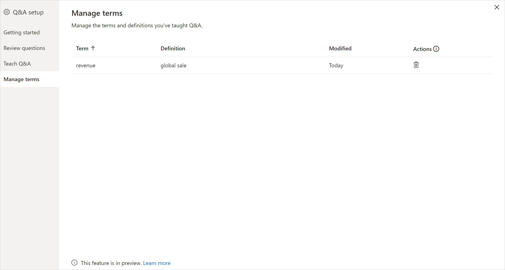

# แนะนำการใช้เครื่องมือระบบถามตอบ เพื่อสอนระบบถามของ Power BI (ตัวอย่าง)Intro to Q&A tooling to train Power BI Q&A (preview)

คุณสามารถปรับปรุงประสบการณ์การใช้งานภาษาธรรมชาติสำหรับผู้ใช้ของคุณได้ด้วย *การใช้เครื่องมือ* ถามตอบของ Power BIWith Power BI Q&A *tooling*, you can improve the natural language experience for your users. ในฐานะผู้ออกแบบหรือผู้ดูแลระบบ คุณโต้ตอบกับกลไกจัดการภาษาธรรมชาติและทำการปรับปรุงให้ดีขึ้นในสามส่วน:As a designer or administrator, you interact with the natural language engine and make improvements in three areas: 

- ตรวจสอบคำถามที่ผู้ใช้ของคุณถามเข้ามาReview questions your users have asked.
- สอนระบบถามตอบเพื่อให้เข้าใจคำถามTeach Q&A to understand questions.
- จัดการคำศัพท์ที่คุณได้สอนระบบถามตอบManage terms you've taught Q&A.

นอกเหนือจากความสามารถในการใช้เครื่องมือเฉพาะเหล่านี้แล้ว แท็บ **การสร้างแบบจำลอง** ใน Power BI Desktop ยังมีตัวเลือกเพิ่มเติมอีก:In addition to these dedicated tooling capabilities, the **Modeling** tab in Power BI Desktop offers more options:  

- คำเหมือนSynonyms
- ป้ายชื่อแถวRow labels
- ซ่อนจากระบบถามตอบHide from Q&A
- การกำหนดค่าของรูปแบบภาษา (ขั้นสูง)Configuring of the linguistic schema (advanced)

## เริ่มต้นด้วยการใช้เครื่องมือถามตอบGet started with Q&A tooling

การใช้เครื่องมือถามตอบมีอยู่ใน Power BI Desktop เท่านั้น และขณะนี้รองรับเฉพาะโหมดการนำเข้าเท่านั้นQ&A tooling is only available in Power BI Desktop, and currently only supports import mode.

1. เปิด Power BI Desktop และใช้ระบบถามตอบเพื่อสร้างวิชวลOpen Power BI Desktop and use Q&A to create a visual. 
2. ให้เลือกไอคอนรูปเฟืองจากมุมของวิชวลFrom the corner of the visual, select the gear icon. 

    

    หน้าเริ่มต้นใช้งานจะเปิดขึ้นThe Getting started page opens.  

    

### คำเหมือนของเขตข้อมูลField Synonyms

เลือก **คำเหมือนของเขตข้อมูล** เพื่อดูตารางและคอลัมน์ทั้งหมดที่เป็นของโมเดลSelect **Field Synonyms** to see all the tables and columns that belong to the model. มุมมองนี้ช่วยให้คุณสามารถเพิ่มชื่อสำรองให้ตรงกับคอลัมน์เพื่อช่วยให้ผู้ใช้ทำงานได้ง่ายยิ่งขึ้นThis view allows you to add alternative names to match the columns to help users. คุณยังสามารถเลือกว่าจะซ่อนคอลัมน์หรือตารางจากคำถามและคำตอบหรือไม่ได้อีกด้วยYou can also choose whether or not a column or table should be hidden from Q&A.

คลิกที่ตารางใดตารางหนึ่งเพื่อขยายและคุณจะเห็นกล่องโต้ตอบที่คล้ายกับที่แสดงด้านล่างนี้Click on one of the tables to expand and you will see a dialog similar to the one below.

กล่องโต้ตอบจะแสดงคอลัมน์และตารางทั้งหมด รวมถึงคำและคำพ้องที่เกี่ยวข้องซึ่งผู้ใช้สามารถใช้ได้เมื่อถามคำถามต่อชุดข้อมูลThe dialog will show all the columns and tables and their respective terms/synonyms that users can use when asking questions against the dataset. คุณสามารถดูคำทั้งหมดในที่เดียวได้อย่างรวดเร็ว และยังเพิ่มหรือลบคำออกจากหลาย ๆ คอลัมน์ได้You can quickly see all the terms in one place and also add or remove terms for multiple columns. 

- เพิ่มคำ - หากคุณมีเขตข้อมูลที่มีชื่อว่า ยอดขาย คุณสามารถเพิ่มคำว่า รายได้ เพื่อให้ผู้ใช้สามารถใช้คำดังกล่าวแทนที่จะต้องใช้คำว่า ยอดขาย ได้Add terms - If you have a field called sales, you may decide to add a term called revenue so a user can use this word instead of being required to use the word sales. คลิกเครื่องหมายบวกเพื่อเพิ่มคำใหม่อย่างรวดเร็วClick the add sign to quickly add a new term

- รวมในคำถามและคำตอบ - ตัวเลือกนี้ใช้เมื่อไม่ต้องการแสดงคอลัมน์หรือตารางไว้ในคำถามและคำตอบ ซึ่งระบบจะไม่แสดงคอลัมน์หรือตารางและผลลัพธ์ของคอลัมน์ที่เลือกInclude in Q&A - This option allows a column or table to be omitted from Q&A meaning it will not be shown nor a result can be displayed with this column. กรณีที่คุณอาจไม่ต้องการรวมคอลัมน์ไว้ในผลการแสดงคือเมื่อต้องจัดการกับวันที่A circumstance where you may decide to not include a column is when dealing with dates. ถ้ามีเขตข้อมูลวันที่ หรือ Foreign keys เป็นจำนวนมาก คุณอาจต้องการลบข้อมูลทั้งหมดยกเว้นเขตข้อมูลวันที่เพื่อเก็บคอลัมน์วันที่ที่ถูกต้องไว้ใช้เมื่อผู้ใช้ถามคำถามที่เกี่ยวข้องกับวันที่If there are numerous date fields, or foreign keys, you may decide to remove all but one of the date fields so the correct date column is picked when a user asks a date related question.

- คำที่แนะนำ - คำถามและคำตอบจะแนะนำคำที่ได้รับจากโปรแกรมการแนะนำของเราเพื่อช่วยคุณเพิ่มคำ/คำเหมือนได้อย่างรวดเร็วSuggested Terms - Q&A will also recommend suggested terms retrieved from our suggestions engine to help you quickly add terms/synonyms. ถ้าไม่มีการเพิ่มคำแนะนำเหล่านั้น ระบบจะยังคงทำงานอยู่แต่จะแสดงเส้นประสีส้มให้ผู้ใช้ทราบเพื่อแสดงว่าระบบคำถามและคำตอบคิดว่ามีคำตอบแต่ไม่แน่ใจIf the suggestions are not added, They will still function but will give the user an orange dotted line indicating Q&A thinks it has an answer but is not sure. ถ้าคำเหมือนที่แนะนำถูกต้อง ให้คลิกที่ไอคอน + เพื่อให้ระบบสามารถใช้คำดังกล่าวเป็นคำเหมือนได้If the suggested synonym is correct, click the + icon so it can be used as a synonym. ถ้าคำแนะนำไม่ถูกต้อง ให้คลิก x เพื่อลบคำดังแล่าวและสั่งให้ระบบไม่ใช้เป็นคำ/เหมือนและจะไม่ทำงานภายในระบบคำถามและคำตอบif the suggestion is incorrect, then click the x which will remove the term and ensure it will not be used as a term/synonym and will not function inside Q&A. การแนะนำคำนั้นสนับสนุนโดยพจนานุกรม Office และบางส่วนยังมาจากการเปลี่ยนชื่อที่พบภายในรายงานด้วยThe suggestions are powered by Office Dictionary and also come from renames found inside a report

### ตรวจสอบคำถามReview questions

เลือก **ตรวจสอบคำถาม** เพื่อดูรายการของชุดข้อมูลที่ใช้ในบริการ Power BI สำหรับผู้เช่าของคุณSelect **Review questions** to see a list of datasets being used in the Power BI service for your tenant. หน้า **ตรวจสอบคำถาม** ยังแสดงเจ้าของชุดข้อมูล พื้นที่ทำงาน และวันที่รีเฟรชครั้งล่าสุดThe **Review questions** page also displays the dataset owner, workspace, and last refreshed date. จากที่นี่คุณสามารถเลือกชุดข้อมูล และดูว่าคำถามใดที่ผู้ใช้ถามFrom here you can select a dataset and see what questions users have been asking. ข้อมูลยังแสดงให้เห็นถึงคำที่ไม่รู้จักอีกด้วยThe data also shows words that were not recognized. ข้อมูลทั้งหมดที่แสดงที่นี่เป็นช่วง 28 วันที่ผ่านมาAll data shown here is for the last 28 days.

### สอนเกี่ยวกับการ "ถามตอบ"Teach Q&A

ส่วน **การสอนระบบถามตอบ** ช่วยให้คุณสามารถสอนระบบถามตอบให้รู้จำคำศัพท์ได้The **Teach Q&A** section allows you to train Q&A to recognize words. ให้พิมพ์คำถามที่ประกอบด้วยคำศัพท์หนึ่งคำหรือหลายคำที่ระบบถามตอบยังไม่รู้จักTo begin, type a question that contains a word or words that Q&A doesn't recognize. ระบบถามตอบจะพร้อมท์ให้คุณทราบสำหรับคำจำกัดความของคำศัพท์นั้นQ&A prompts you for the definition of that term. ให้ป้อนตัวกรองหรือชื่อเขตข้อมูลที่สอดคล้องกับคำที่แสดงEnter either a filter or a field name that corresponds to what that word represents. จากนั้นระบบถามตอบจะแปลคำถามเดิมซ้ำอีกครั้งQ&A then reinterprets the original question. ถ้าคุณพอใจกับผลลัพธ์ คุณสามารถบันทึกการป้อนข้อมูลของคุณได้If you're happy with the results, you can save your input. หากต้องการเรียนรู้เพิ่มเติม โปรดดู [การสอนระบบถามตอบ](q-and-a-tooling-teach-q-and-a.md)To learn more, see [Teach Q&A](q-and-a-tooling-teach-q-and-a.md)

### จัดการคำศัพท์Manage terms

สิ่งใดก็ตามที่คุณบันทึกจากส่วนการสอนระบบถามตอบจะปรากฏที่นี่ ดังนั้นคุณสามารถตรวจสอบหรือลบคำศัพท์ที่คุณกำหนดไว้ได้Anything you've saved from the Teach Q&A section shows up here, so you can review or delete terms you've defined. ในปัจจุบันคุณยังไม่สามารถแก้ไขคำจำกัดความที่มีอยู่ได้ ดังนั้นหากต้องการกำหนดคำศัพท์ใหม่ คุณต้องลบและสร้างคำศัพท์นั้นขึ้นใหม่อีกครั้งCurrently you can't edit an existing definition, so to redefine a term you must delete and recreate that term.

### แนะนำคำถามSuggest questions

> [!NOTE]
> ระบบจะแสดงคำถามที่แนะนำสำหรับอินสแตนซ์ทั้งหมดของวิชวลระบบคำถามและคำตอบThe suggested questions will show up for all instances of the Q&A visual. ไม่สามารถสร้างชุดการแนะนำแบบแยกสำหรับวิชวลระบบคำถามและคำตอบแต่ละรายการได้It isn't possible to create a separate set of suggestions for each Q&A visual.
> 
> 

โดยไม่ต้องทำการตั้งค่าใด ๆ วิชวลการถามตอบจะแนะนำคำถามหลายคำถามเพื่อเริ่มต้นWithout doing any setup, the Q&A visual will suggest several questions to get started with. คำถามเหล่านี้จะถูกสร้างขึ้นโดยอัตโนมัติตามรูปแบบข้อมูลของคุณThese questions are automatically generated based on your data model. ใน **แนะนำคำถาม** คุณสามารถเขียนทับคำถามที่สร้างขึ้นโดยอัตโนมัติด้วยคำถามของคุณเองได้In **Suggest questions**, you can overwrite the auto-generated questions with your own questions.

หากต้องการเริ่มต้น ให้พิมพ์คำถามที่คุณต้องการเพิ่มลงในกล่องข้อความTo start, type the question you want to add in the text box. ในส่วนการแสดงตัวอย่าง คุณจะเห็นว่าผลลัพธ์มีลักษณะอย่างไรในวิชวลการถามตอบIn the preview section, you see what the result will look like in the Q&A visual. 

:::image type="content" source="media/q-and-a-tooling-intro/power-bi-qna-suggest-questions.png" alt-text="แนะนำคำถามสำหรับการถามตอบ":::
 
เลือกปุ่ม **เพิ่ม** เพื่อเพิ่มคำถามนี้ไปยัง **คำถามที่แนะนำของคุณ**Select the **Add** button to add this question to **Your suggested questions**. คำถามเพิ่มเติมทุกข้อจะเพิ่มไปยังส่วนท้ายของรายการนี้Every additional question is added to the end of this list. คำถามจะปรากฏในวิชวลการถามตอบเหมือนกับลำดับที่ปรากฏในรายการนี้The questions will show up in the Q&A visual in the same order as they do in this list. 

:::image type="content" source="media/q-and-a-tooling-intro/power-bi-qna-save-suggest-questions.png" alt-text="บันทึกคำถามที่แนะนำ":::
 
ตรวจสอบให้แน่ใจว่าคุณได้เลือก **บันทึก** เพื่อแสดงรายการคำถามที่แนะนำของคุณในวิชวลการถามตอบMake sure to select **Save** to show your list of suggested questions in the Q&A visual. 

## การตั้งค่าอื่น ๆ ของระบบถามตอบOther Q&A settings

### ตั้งค่าป้ายชื่อแถวSet a row label

ป้ายชื่อแถวช่วยให้คุณสามารถกำหนดว่าคอลัมน์ (หรือ *เขตข้อมูล*) ใดระบุตัวตนแถวเดียวในตารางได้ดีที่สุดA row label allows you to define which column (or *field*) best identifies a single row in a table. ตัวอย่างเช่น สำหรับตารางที่เรียกว่า 'ลูกค้า' ป้ายชื่อแถวมักจะเป็น ' ชื่อที่แสดง'For example, for a table called 'Customer', the row label is usually 'Display Name'. การจัดให้มีเมตาดาต้าเพิ่มเติมนี้ช่วยให้ระบบถามตอบสามารถลงจุดข้อมูลวิชวลที่เป็นประโยชน์มากขึ้นเมื่อผู้ใช้พิมพ์ใน 'แสดงยอดขายตามลูกค้า'Providing this extra metadata allows Q&A to plot a more helpful visual when users type in 'Show me sales by customer'. แทนที่จะใช้ข้อมูล 'ลูกค้า' แสดงในตาราง ก็สามารถใช้ 'ชื่อที่แสดง' แทน และแสดงเป็นแผนภูมิแท่งที่แสดงยอดขายของลูกค้าแต่ละรายInstead of treating 'customer' as a table, it can instead use 'Display Name' and display a bar chart showing each customer's sales. คุณสามารถตั้งค่ามุมมองการสร้างแบบจำลองของป้ายชื่อแถวได้เท่านั้นYou can only set the row label Modeling view. 

1. ให้เลือกมุมมองการสร้างแบบจำลองใน Power BI DesktopIn Power BI Desktop, select Modeling view.

2. เลือกตารางเพื่อแสดงบานหน้าต่าง **คุณสมบัติ**Select a table to display the **Properties** pane.

3. ในกล่อง **ป้ายชื่อแถว** ให้เลือกเขตข้อมูลIn the **Row label** box, select a field.

## กำหนดค่าของรูปแบบภาษา (ขั้นสูง)Configure the linguistic schema (advanced)

ใน Power BI คุณสามารถสอนและปรับปรุงประสิทธิภาพกลไกจัดการภาษาธรรมชาติภายในระบบถามตอบ รวมถึงการเปลี่ยนแปลง การให้คะแนน และการถ่วงน้ำหนักของผลลัพธ์ภาษาธรรมชาติพื้นฐานIn Power BI, you can completely train and enhance the natural language engine inside Q&A, including changing the scoring and weighting of the underlying natural language results. หากต้องการเรียนรู้วิธีการ โปรดดู [แก้ไขรูปแบบภาษาและเพิ่มการใช้ถ้อยคำของระบบถามตอบ](q-and-a-tooling-advanced.md)To learn how, see [Edit Q&A linguistic schema and add phrasings](q-and-a-tooling-advanced.md).

## ขั้นตอนถัดไปNext steps

มีแนวปฏิบัติที่ดีที่สุดหลายประการสำหรับการพัฒนากลไกจัดการภาษาธรรมชาติThere are a number of best practices for improving the natural language engine. สำหรับข้อมูลเพิ่มเติม โปรดดูที่ [แนวทางปฏิบัติที่ดีที่สุดสำหรับการถามตอบ](q-and-a-best-practices.md)For more information, [Q&A best practices](q-and-a-best-practices.md).
