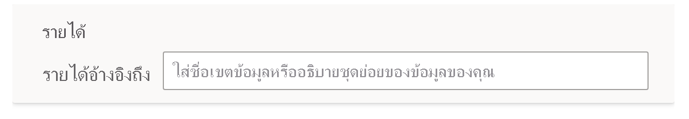
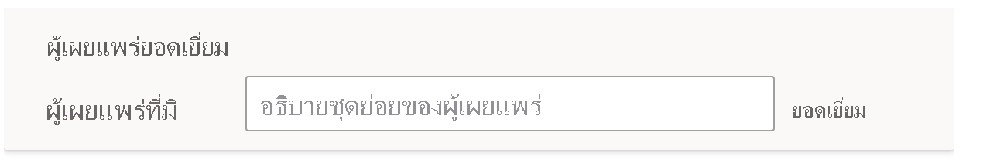

# การสอนระบบถามตอบเพื่อให้เข้าใจคำถามและคำศัพท์ในระบบถามตอบของ Power BITeach Q&A to understand questions and terms in Power BI Q&A

ในส่วน **การสอนระบบถามตอบ** ของการตั้งค่าระบบถามตอบ คุณสามารถสอนให้ระบบถามตอบเข้าใจคำถามและคำศัพท์ภาษาธรรมชาติที่ยังไม่รู้จักIn the **Teach Q&A** section of Q&A setup, you train Q&A to understand natural-language questions and terms it hasn't recognized. หากต้องการเริ่มต้น ให้คุณส่งคำถามที่ประกอบด้วยคำเดี่ยวหรือหลายคำที่ระบบถามตอบยังไม่รู้จักTo begin, you submit a question that contains a word or words that Q&A didn't recognize. จากนั้นระบบถามตอบจะพร้อมท์ให้คุณกำหนดคำศัพท์นั้นQ&A then prompts you to define that term. คุณป้อนตัวกรองหรือชื่อเขตข้อมูลที่สอดคล้องกับคำที่แสดงYou enter either a filter or a field name that corresponds to what that word represents. จากนั้นระบบถามตอบจะแปลคำถามเดิมซ้ำอีกครั้งQ&A then reinterprets the original question. ถ้าคุณพอใจกับผลลัพธ์ ให้คุณบันทึกข้อมูลเหล่านั้นIf you're happy with the results, you save them.

> [!NOTE]
> ฟังก์ชันการสอนระบบถามตอบจะรองรับโหมดการนำเข้าเท่านั้นThe Teach Q&A functionality only supports import mode. นอกจากนี้ยังไม่รองรับการเชื่อมต่อไปยังแหล่งข้อมูลภายในองค์กรหรือ Azure Analysis ServicesIt also doesn't yet support connecting to an on-premises or Azure Analysis Services data source. ข้อจำกัดนี้ควรถูกลบออกจาก Power BI ในรุ่นที่ออกมาภายหลังThis limitation should be removed in subsequent releases of Power BI.

## เริ่มต้นสอนระบบถามตอบStart to teach Q&A

1. ใน Power BI Desktop บนแถบริบบอน **การสร้างแบบจำลอง** ให้เลือก **การตั้งค่าระบบถามตอบ** > **การสอนระบบถามตอบ**In Power BI Desktop, on the **Modeling** ribbon, select **Q&A Setup** > **Teach Q&A**.

    

2. พิมพ์ประโยคด้วยคำที่ระบบถามตอบไม่เข้าใจ และเลือก **ส่ง**Type a sentence with a term Q&A doesn't recognize and select **Submit**.

3. เลือกคำที่ขีดเส้นใต้สีแดงSelect the red-underlined word. 

    ระบบถามตอบจะนำเสนอข้อเสนอแนะและพร้อมท์ให้คุณป้อนคำจำกัดความที่ถูกต้องของคำศัพท์Q&A offers suggestions and prompts you to provide the correct definition of the term. 
    
3. ภายใต้ **กำหนดคำศัพท์ที่ระบบถามตอบไม่เข้าใจ** ให้ระบุคำจำกัดความUnder **Define the terms Q&A didn't understand**, provide a definition.

    

4. เลือก **บันทึก** เพื่อแสดงตัวอย่างวิชวลที่อัปเดตแล้วSelect **Save** to preview the updated visual.

5. ป้อนคำถามถัดไป หรือเลือก **X** เพื่อปิดหน้าต่างEnter the next question, or select the **X** to close.

ผู้ใช้รายงานของคุณจะไม่เห็นการเปลี่ยนแปลงนี้จนกว่าคุณจะเผยแพร่รายงานกลับไปที่บริการYour report consumers won't see this change until you publish the report back to the service.

## กำหนดคำนามและคำคุณศัพท์Define nouns and adjectives

คุณสามารถสอนระบบถามตอบได้ด้วยคำศัพท์สองชนิดได้แก่:You can teach Q&A two types of terms:

- คำนามNouns
- คำคุณศัพท์Adjectives

### กำหนดคำพ้องความหมายที่เป็นคำนามDefine a noun synonym

เมื่อทำงานกับข้อมูล คุณมักจะมีชื่อของเขตข้อมูลที่สามารถอ้างอิงกับชื่อสำรองได้When working with data, you often may have names of fields that could be referred to with alternative names. ตัวอย่างอาจเป็น 'ยอดขาย'An example could be 'Sales'. คำหรือวลีจำนวนมากสามารถอ้างอิงไปยังยอดขาย เช่น 'รายได้'Numerous words or phrases could refer to sales, such as 'revenue'. ถ้าตั้งชื่อคอลัมน์ว่า 'ยอดขาย' และผู้ใช้รายงานพิมพ์คำว่า 'รายได้' ดังนั้นระบบถามตอบอาจไม่สามารถเลือกคอลัมน์ที่ถูกต้องเพื่อตอบคำถามได้อย่างเหมาะสมIf a column is named 'Sales', and report consumers type 'revenue', Q&A may fail to pick the correct column to answer the question appropriately. ในกรณีนี้ คุณต้องการบอกระบบถามตอบว่า 'ยอดขาย' และ 'รายได้' อ้างอิงถึงสิ่งเดียวกันIn that case, you want to tell Q&A that 'Sales' and 'Revenue' refer to the same thing.

ระบบถามตอบจะตรวจจับโดยอัตโนมัติเมื่อคำที่ไม่รู้จักเป็นคำนามโดยใช้ความรู้จาก Microsoft OfficeQ&A automatically detects when an unrecognized word is a noun using knowledge from Microsoft Office. ถ้าระบบถามตอบตรวจพบคำนาม ระบบจะพร้อมท์คุณในวิธีต่อไปนี้:If Q&A detects a noun, it prompts you in the following way:

- <your term> **อ้างอิงไปยัง**<your term> **refers to** 

คุณกรอกคำศัพท์จากข้อมูลของคุณลงในกล่องYou fill in the box with the term from your data.

หากคุณให้สิ่งอื่นที่ไม่ใช่เขตข้อมูลจากแบบจำลองข้อมูล คุณอาจได้รับผลลัพธ์ที่ไม่พึงประสงค์If you provide something other than a field from the data model, you may get undesirable results.

### กำหนดเงื่อนไขของตัวกรองคำคุณศัพท์Define an adjective filter condition

บางครั้งคุณอาจต้องการกำหนดคำศัพท์ที่ทำหน้าที่เป็นเงื่อนไขในข้อมูลพื้นฐานSometimes you may want to define terms that act as a condition on the underlying data. ตัวอย่างอาจเป็น 'ผู้เผยแพร่ที่ยอดเยี่ยม'An example could be 'Awesome Publishers'. 'ที่ยอดเยี่ยม' อาจเป็นเงื่อนไขที่เลือกเฉพาะผู้เผยแพร่ที่มีการเผยแพร่ผลิตภัณฑ์จำนวน X รายการเท่านั้น'Awesome' could be a condition that only selects publishers that have published X number of products. ระบบถามตอบจะพยายามตรวจหาคำคุณศัพท์ ด้วยการแสดงพร้อมท์ที่แตกต่างกัน:Q&A tries to detect adjectives, showing a different prompt:

- <field name> **ที่มี**<field name> **that have**  

คุณจะระบุเงื่อนไขลงในกล่องYou fill in the box with the condition.

ตัวอย่างเงื่อนไขบางอย่างที่คุณสามารถกำหนดได้คือ:Some example conditions that you can define are:

- ประเทศซึ่งก็คือสหรัฐอเมริกาCountry which is USA
- ประเทศซึ่งไม่ใช่สหรัฐอเมริกาCountry which is not USA
- ผลิตภัณฑ์ > 100Products > 100
- ผลิตภัณฑ์มากกว่า 100Products greater than 100
- ผลิตภัณฑ์ = 100Products = 100
- ผลิตภัณฑ์เท่ากับ 100Products is 100
- ผลิตภัณฑ์ < 100Products < 100
- ผลิตภัณฑ์น้อยกว่า 100Products smaller than 100

ในตัวอย่างเหล่านี้ 'ผลิตภัณฑ์' อาจเป็นชื่อคอลัมน์หรือหน่วยวัดIn these examples, 'Products' could be either a column name or a measure. 

คุณยังสามารถระบุการรวมในนิพจน์การถามตอบได้You can also specify an aggregation in the Q&A expression itself. ตัวอย่างเช่น หาก 'ผลิตภัณฑ์ยอดนิยม' เป็นผลิตภัณฑ์ที่มียอดขาย 100 หน่วย คุณสามารถกำหนดผลิตภัณฑ์ที่มี 'ผลรวมของหน่วยที่ขายได้ > 100' เป็นผลิตภัณฑ์ยอดนิยมFor example, if ‘popular products’ are products with at least 100 units sold, you can define products with ‘sum of units sold > 100’ as popular.  

:::image type="content" source="media/q-and-a-tooling-teach-q-and-a/power-bi-qna-popular-products.png" alt-text="กำหนด 'ผลิตภัณฑ์ยอดนิยม '":::

คุณสามารถกำหนดได้เพียงเงื่อนไขเดียวเฉพาะในการใช้เครื่องมือYou can only define a single condition in tooling. หากต้องการกำหนดเงื่อนไขที่ซับซ้อนมากขึ้น ให้ใช้ DAX เพื่อสร้างคอลัมน์หรือการวัดจากการคำนวณ จากนั้นใช้ส่วนการใช้เครื่องมือเพื่อสร้างเงื่อนไขเดียวสำหรับคอลัมน์หรือการวัดนั้นTo define more complex conditions, use DAX to create a calculated column or measure, and then use the tooling section to create a single condition for that column or measure.

## จัดการคำศัพท์Manage terms

หลังจากที่คุณให้คำจำกัดความแล้ว คุณสามารถกลับไปดูการแก้ไขทั้งหมดที่คุณทำและแก้ไขหรือลบได้After you've provided definitions, you can go back to see all the fixes you made and edit or delete them. 

1. ใน **การตั้งค่าระบบถามตอบ** ให้ไปที่ส่วน **จัดการคำศัพท์**In **Q&A setup**, go to the **Manage terms** section.

2. ลบคำศัพท์ใดก็ตามที่คุณไม่ต้องการอีกต่อไปDelete any terms you no longer want. ในขณะนี้ คุณไม่สามารถแก้ไขคำศัพท์ได้Currently you can't edit terms. หากต้องการกำหนดคำศัพท์ใหม่ ให้ลบคำศัพท์และกำหนดใหม่To redefine a term, delete the term and define it.

    

## ขั้นตอนถัดไปNext steps

มีแนวปฏิบัติที่ดีที่สุดหลายประการสำหรับการพัฒนากลไกจัดการภาษาธรรมชาติThere are a number of best practices for improving the natural language engine. สำหรับข้อมูลเพิ่มเติม โปรดดูที่ [แนวทางปฏิบัติที่ดีที่สุดสำหรับการถามตอบ](q-and-a-best-practices.md)For more information, [Q&A best practices](q-and-a-best-practices.md).
