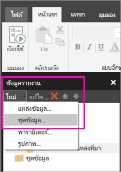
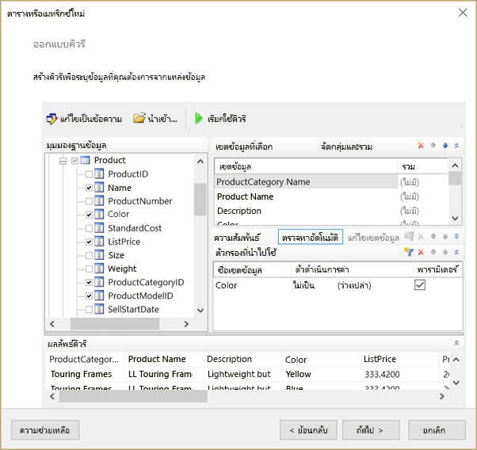
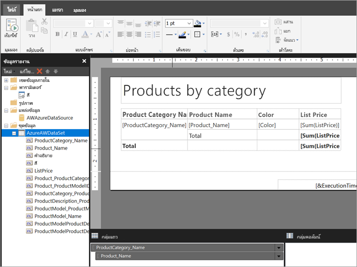

# สร้างชุดข้อมูลแบบฝังตัวสำหรับรายงานแบบแบ่งหน้าในบริการของ Power BICreate an embedded dataset for a paginated report in the Power BI service

[!INCLUDE [applies-to](../includes/applies-to.md)] [!INCLUDE [yes-service](../includes/yes-service.md)] [!INCLUDE [yes-paginated](../includes/yes-paginated.md)] [!INCLUDE [yes-premium](../includes/yes-premium.md)] [!INCLUDE [no-desktop](../includes/no-desktop.md)][!INCLUDE [applies-to](../includes/applies-to.md)] [!INCLUDE [yes-service](../includes/yes-service.md)] [!INCLUDE [yes-paginated](../includes/yes-paginated.md)] [!INCLUDE [yes-premium](../includes/yes-premium.md)] [!INCLUDE [no-desktop](../includes/no-desktop.md)] 

ในบทความนี้ คุณจะได้เรียนรู้วิธีการสร้างชุดข้อมูลแบบฝังตัว โดยอ้างอิงจากแหล่งข้อมูลแบบฝังตัว สำหรับรายงานแบบแบ่งหน้าในบริการของ Power BIIn this article, you learn how to create an embedded dataset, based on an embedded data source, for a paginated report in the Power BI service. ชุดข้อมูลแบบฝังตัวนั้นอยู่ในรายงานแบบแบ่งหน้าแต่ละอัน สำหรับใช้ในรายงานนั้นๆEmbedded datasets are contained in a single paginated report, for use in that report. ในตอนนี้ รายงานแบบแบ่งหน้าที่เผยแพร่ไปยังบริการของ Power BI ต้องใช้ชุดข้อมูลแบบฝังตัวและแหล่งข้อมูลแบบฝังตัวCurrently, paginated reports published to the Power BI service need embedded datasets and embedded data sources. คุณอาจสร้างแหล่งข้อมูลแบบฝังตัวและชุดข้อมูลได้ในตัวสร้างรายงาน Power BI ขณะที่คุณสร้างรายงานYou create the embedded data source and dataset in Power BI Report Builder, while you're creating your report. 

ก่อนที่คุณจะสร้างชุดข้อมูลได้ คุณต้องสร้างแหล่งข้อมูลก่อนBefore you can create the dataset, you need to create a data source. โปรดดู [แหล่งข้อมูลแบบฝังตัวสำหรับรายงานแบบแบ่งหน้า](paginated-reports-embedded-data-source.md) ในบริการของ Power BI เพื่อเรียนรู้วิธีSee [Embedded data sources for paginated reports](paginated-reports-embedded-data-source.md) in the Power BI service to learn how.
  
## สร้างชุดข้อมูลแบบฝังตัวCreate an embedded dataset
  
1. ที่แผงข้อมูลรายงานในตัวสร้างรายงาน Power BI ให้คุณเลือก **ชุดข้อมูล** > **ใหม่**In the Report Data pane in Power BI Report Builder, select **New** > **Dataset**.

1. ในแท็บ **คิวรี** ของกล่องโต้ตอบ **คุณสมบัติชุดข้อมูล** ให้คุณตั้งชื่อให้ชุดข้อมูลIn the **Query** tab of the **Dataset Properties** dialog box, give the dataset a name. แหล่งข้อมูลแบบฝังตัวอยู่ในกล่อง **แหล่งข้อมูล** อยู่แล้ว หรือคุณอาจเลือก **ใหม่** เพื่อสร้างแหล่งข้อมูลแบบฝังตัวอื่นได้The embedded data source is already in the **Data source** box, or you can select **New** to create a different embedded data source.
 
     

3. ที่ใต้ **ชนิดคิวรี** ให้คุณเลือกชนิดคำสั่งหรือคิวรีที่จะใช้กับชุดข้อมูลUnder **Query type** , select the type of command or query to use for the dataset. 
    - **ข้อความ** จะเรียกใช้คิวรีให้ดึงข้อมูลจากฐานข้อมูล**Text** runs a query to retrieve data from the database. ซึ่งเป็นค่าเริ่มต้นและใช้กับคิวรีส่วนมากIt's the default and is used for most queries. พิมพ์คิวรีหรือนำเข้าคิวรีที่มีอยู่ก่อนโดยการเลือก **นำเข้า**Type a query or import a pre-existing query by selecting **Import**. เลือก **ตัวออกแบบคิวรี** เพื่อสร้างคิวรีโดยใช้กราฟิกTo build the query graphically, select **Query Designer**. ถ้าคุณใช้ตัวออกแบบคิวรีเพื่อสร้างคิวรี ข้อความของคิวรีนั้นจะปรากฏในกล่องนี้If you use the query designer to build a query, the text of the query will appear in this box. เลือกปุ่ม **นิพจน์** ( **fx** ) เพื่อใช้นิพจน์ในการสร้างคิวรีแบบไดนามิกSelect the **Expression** ( **fx** ) button to use an expression to dynamically generate the query. 
    - **ตาราง** จะเลือกเขตข้อมูลทั้งหมดภายในตาราง**Table** selects all the fields within a table. ใส่ชื่อของตารางที่คุณต้องการใช้เป็นชุดข้อมูลEnter the name of the table that you want to use as a dataset.
    - **Stored Procedure** จะเรียกใช้ขั้นตอนที่เก็บไว้จากชื่อ**Stored Procedure** runs a stored procedure by name.

4. ในตัวออกแบบคิวรี คุณจะเห็นและได้โต้ตอบกับตารางและเขตข้อมูลในชุดข้อมูล รวมถึงนำเข้าคิวรีหรือแก้ไขในรูปแบบข้อความIn the Query Designer, you can see and interact with the tables and fields in the dataset, import a query, or edit as text. คุณยังสามารถเพิ่มตัวกรองและพารามิเตอร์ได้ที่นี่You can also add filters and parameters here. 

    

5. ในตัวออกแบบคิวรี ให้คุณเลือก **เรียกใช้คิวรี** เพื่อทดสอบ จากนั้นเลือก **ตกลง**In the Query Designer, select **Run Query** to test it, then select **OK**.

1. กลับไปดูที่กล่องโต้ตอบคุณสมบัติชุดข้อมูล ในกล่อง **การหมดเวลา (เป็นวินาที)** ให้คุณพิมพ์จำนวนวินาทีก่อนที่คิวรีจะหมดเวลา ค่าเริ่มต้นคือ 30 วินาทีBack in the Dataset Properties dialog box, in the **Time out (in seconds)** box, type the number of seconds until the query times out. The default is 30 seconds. ค่าสำหรับ **การหมดเวลา** ต้องว่างเปล่าหรือมากกว่าศูนย์The value for **Time out** must be empty or greater than zero. ถ้าค่าว่างเปล่า คิวรีจะไม่หมดเวลาIf it is empty, the query does not time out.

7.  คุณสามารถตั้งค่าคุณสมบัติอื่นๆ สำหรับชุดข้อมูลได้ที่แท็บอื่น:You can set other properties for the dataset on the other tabs:
    - สร้างเขตข้อมูลที่คำนวณที่แท็บ **เขตข้อมูล**Create calculated fields on the **Fields** tab.
    - ตั้งค่าตัวเลือกขั้นสูงที่แท็บ **ตัวเลือก**Set advanced options on the **Options** tab.
    - เพิ่มหรืออัปเดต **ตัวกรอง** และ **พารามิเตอร์** ที่แท็บที่เกี่ยวข้องAdd or update **Filters** and **Parameters** on their respective tabs.

8. เลือก **ตกลง**Select **OK**
 
   รายงานจะเปิดขึ้นในมุมมองการออกแบบรายงานThe report opens in Report Design View. แหล่งข้อมูล ชุดข้อมูล และคอลเลกชันเขตข้อมูลของชุดข้อมูลจะปรากฏในแผงข้อมูลรายงาน และคุณสามารถออกแบบรายงานแบบแบ่งหน้าต่อได้The data source, dataset, and dataset field collection appear in the Report Data pane, and you can continue designing your paginated report.  

     
 
## ขั้นตอนถัดไปNext steps 

- [รายงานแบบแบ่งหน้าใน Power BI Premium คืออะไรWhat are paginated reports in Power BI Premium?](paginated-reports-report-builder-power-bi.md)  
- [บทช่วยสอน: สร้างรายงานแบบแบ่งหน้าและอัปโหลดไปยังบริการของ Power BITutorial: Create a paginated report and upload it to the Power BI service](paginated-reports-quickstart-aw.md)
- [เผยแพร่รายงานแบบแบ่งหน้าไปยังบริการของ Power BIPublish a paginated report to the Power BI service](paginated-reports-save-to-power-bi-service.md)

