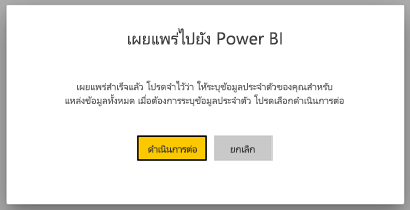
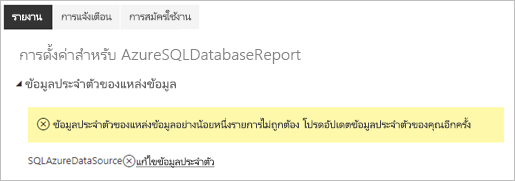
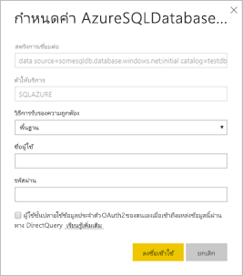

# แหล่งข้อมูลที่ได้รับการสนับสนุนสำหรับรายงานที่มีการแบ่งหน้าของ Power BI

[!INCLUDE [applies-to](../includes/applies-to.md)] [!INCLUDE [yes-service](../includes/yes-service.md)] [!INCLUDE [yes-paginated](../includes/yes-paginated.md)] [!INCLUDE [yes-premium](../includes/yes-premium.md)] [!INCLUDE [no-desktop](../includes/no-desktop.md)] 

บทความนี้จะขยายความแหล่งข้อมูลที่ได้รับการสนับสนุนสำหรับรายงานที่มีการแบ่งหน้าในบริการของ Power BI และวิธีการเชื่อมต่อกับแหล่งข้อมูล Azure SQL Database แหล่งข้อมูลบางส่วนได้รับการสนับสนุนในแบบดั้งเดิม คุณสามารถเชื่อมต่อกับผู้อื่นได้โดยวิธีการของเกตเวย์ข้อมูล

## แหล่งข้อมูลที่ได้รับการสนับสนุนในแบบดั้งเดิม

รายงานที่มีการแบ่งหน้าจะสนับสนุนรายการแหล่งข้อมูลต่อไปนี้ในแบบดั้งเดิม:

| แหล่งข้อมูล | การรับรองความถูกต้อง | บันทึกย่อ |
| --- | --- | --- |
| ฐานข้อมูล Azure SQL  คลังข้อมูล Azure SQL | ลงชื่อเข้าระบบครั้งเดียว (SSO) เบื้องต้น, OAuth2 | คุณสามารถใช้ Enterprise Gateway กับ Azure SQL Database ได้ อย่างไรก็ตาม คุณไม่สามารถใช้ SSO หรือ oAuth2 เพื่อรับรองความถูกต้องในสถานการณ์เหล่านั้นได้   |
| อินสแตนซ์ที่จัดการแล้วของ Azure SQL | พื้นฐาน | ผ่านตำแหน่งข้อมูลสาธารณะหรือส่วนตัว (ตำแหน่งข้อมูลส่วนตัวจำเป็นต้องได้รับการกำหนดเส้นทางผ่านเกตเวย์ขององค์กร)  |
| Azure Analysis Services | SSO, OAuth2 | ต้องปิดการใช้งานไฟร์วอลล์ AAS หรือกำหนดค่าเพื่ออนุญาตช่วง IP ทั้งหมดในเขต BlackForest ข้อกำหนดนี้ใช้กับเขต BlackForest เท่านั้น  ไม่รองรับ SSO จากผู้เช่าภายนอก |
| ชุดข้อมูล Power BI | SSO | ชุดข้อมูล Power BI แบบพรีเมียมและแบบไม่พรีเมี่ยม ต้องมีสิทธิ์ในการอ่าน สนับสนุนเฉพาะชุดข้อมูลจากโหมดการนำเข้าและ Power BI DirectQuery เท่านั้น |
| ชุดข้อมูล Power BI แบบพรีเมียม (XMLA) | SSO | ระบบนี้ไม่รองรับการใช้ชุดข้อมูล Power BI ้เป็นแหล่งข้อมูลสำหรับรายงานแบบแบ่งหน้าที่ฝังอยู่ในกรณีที่เป็น “ข้อมูลของแอปเอง”  เพื่อให้แน่ใจว่าการเชื่อมต่อที่เหมาะสมในตัวสร้างรายงาน Power BI ตรวจสอบให้แน่ใจว่าไม่ **ได้ใช้ข้อมูลประจำ** ตัวที่เลือกเมื่อตั้งค่าแหล่งข้อมูลของคุณ เข้าถึงผ่านการเป็นสมาชิกกลุ่มความปลอดภัยของ XMLA เกียรติคุณที่ตั้งค่าที่พื้นที่ทำงานหรือแอป ผู้ใช้ที่มีบทบาทผู้สนับสนุนอย่างน้อย [ในพื้นที่ทำงาน](../collaborate-share/service-new-workspaces.md#roles-in-the-new-workspaces) สามารถแสดงรายงานจนด้วยชุดข้อมูล Power BI Premium ได้ ผู้ใช้อื่นต้อง [สร้างสิทธิ์ใน](../connect-data/service-datasets-build-permissions.md)ชุดข้อมูลพื้นฐาน    |
| ป้อนข้อมูล | N/A | ข้อมูลถูกฝังไว้ในรายงาน |
| Dataverse | SSO, OAuth2 | ไม่สามารถใช้เกตเวย์เป็นการรับรองความถูกต้องแบบหลายปัจจัย (MFA) ไม่ได้รับการสนับสนุน

ยกเว้นสำหรับ Azure SQL Database แหล่งข้อมูลทั้งหมดจะพร้อมใช้งานหลังจากที่คุณอัปโหลดรายงานไปยังบริการของ Power BI แหล่งข้อมูลสามารถข้ามการใช้การลงชื่อเข้าระบบครั้งเดียว (SSO) ได้ตามความเหมาะสม สำหรับ Azure Analysis Services คุณสามารถเปลี่ยนชนิดการรับรองความถูกต้องเป็น OAuth2 ได้ อย่างไรก็ตามเมื่อมีการเปลี่ยนแปลงประเภทการรับรองความถูกต้องสำหรับแหล่งข้อมูลที่กำหนดเป็น OAuth2 จะไม่สามารถแปลงกลับกลับไปใช้ SSO ได้  นอกจากนี้ การเปลี่ยนแปลงนี้ใช้กับรายงานทั้งหมดที่ใช้แหล่งข้อมูลนั้นๆ ในพื้นที่ทำงานทั้งหมดสำหรับผู้เช่าที่กำหนด  การรักษาความปลอดภัยระดับแถวในรายงานแบบแบ่งหน้าจะไม่ทำงานเว้นแต่ว่าผู้ใช้เลือก SSO เป็นประเภทการรับรองความถูกต้อง

สำหรับแหล่งข้อมูล Azure SQL Database คุณจำเป็นต้องใส่ข้อมูลเพิ่มเติมตามที่อธิบายไว้ในส่วน [การรับรองความถูกต้องของ Azure SQL Database](#azure-sql-database-authentication)

## แหล่งข้อมูลอื่นๆ

นอกเหนือจากแหล่งข้อมูลที่ได้รับการสนับสนุนในแบบดั้งเดิมแล้ว แหล่งข้อมูลต่อไปนี้สามารถเข้าถึงได้ผ่านทาง[เกตเวย์องค์กร Power BI](../connect-data/service-gateway-onprem.md) อีกด้วย:

- SQL Server
- SQL Server Analysis Services
- Oracle
- Teradata

สำหรับรายงานที่มีการแบ่งหน้า, Azure Analysis Services ไม่สามารถเข้าถึงผ่านทางเกตเวย์องค์กร Power BI ได้ในขณะนี้

## การรับรองความถูกต้องของ Azure SQL Database

สำหรับแหล่งข้อมูล Azure SQL Database คุณจำเป็นต้องตั้งค่าชนิดการรับรองความถูกต้องก่อนที่คุณจะเรียกใช้รายงาน ซึ่งใช้เฉพาะเมื่อคุณใช้แหล่งข้อมูลเป็นครั้งแรกในพื้นที่ทำงาน ในครั้งแรก คุณจะเห็นข้อความต่อไปนี้:

ถ้าคุณไม่ใส่ข้อมูลประจำตัวใด ๆ ข้อผิดพลาดจะเกิดขึ้นเมื่อคุณเรียกใช้รายงาน เลือก **ดำเนินการต่อ** เพื่อไปที่หน้า **ข้อมูลประจำตัวของแหล่งข้อมูล** สำหรับรายงานที่คุณเพิ่งอัปโหลด:

เลือกลิงก์ **แก้ไขข้อมูลประจำตัว** สำหรับแหล่งข้อมูลที่กำหนดไว้เพื่อเปิดกล่องโต้ตอบ **การกำหนดค่า**:

สำหรับแหล่งข้อมูล Azure SQL Database ต่อไปนี้คือชนิดการรับรองความถูกต้องที่ได้รับการสนับสนุน:

- พื้นฐาน (ชื่อผู้ใช้และรหัสผ่าน)
- SSO (การลงชื่อเข้าระบบครั้งเดียว)
- OAuth2 (โทเค็น Azure Active Directory ที่เก็บไว้)

สำหรับ SSO และ OAuth2 ในการทำงานอย่างถูกต้อง เซิร์ฟเวอร์ Azure SQL Databas ที่แหล่งข้อมูลกำลังเชื่อมต่อต้องเปิดใช้งาน[การสนับสนุนการรับรองความถูกต้อง Azure Active Directory](/azure/sql-database/sql-database-aad-authentication-configure) สำหรับวิธีการรับรองความถูกต้อง OAuth2 นั้น Azure Active Directory จะสร้างโทเค็นและจัดเก็บไว้สำหรับการเข้าถึงแหล่งข้อมูลในอนาคต หากต้องการใช้ [วิธีการรับรองความถูกต้อง SSO](../connect-data/service-azure-sql-database-with-direct-connect.md#single-sign-on) แทน ให้เลือกตัวเลือก SSO ที่เหมาะสมด้านล่างนี้ **ผู้ใช้จะใช้ข้อมูลประจำตัว OAuth2 ของตนเองเมื่อเข้าถึงแหล่งข้อมูลนี้ผ่านทาง DirectQuery**
  
## ขั้นตอนถัดไป

[ดูรายงานแบบแบ่งหน้าในบริการของ Power BI](../consumer/paginated-reports-view-power-bi-service.md)

มีคำถามเพิ่มเติมหรือไม่ [ลองไปที่ชุมชน Power BI](https://community.powerbi.com/)
