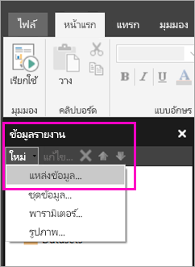

# สร้างแหล่งข้อมูลแบบฝังตัวสำหรับรายงานแบบแบ่งหน้าในบริการของ Power BICreate an embedded data source for paginated reports in the Power BI service

[!INCLUDE [applies-to](../includes/applies-to.md)] [!INCLUDE [yes-service](../includes/yes-service.md)] [!INCLUDE [yes-paginated](../includes/yes-paginated.md)] [!INCLUDE [yes-premium](../includes/yes-premium.md)] [!INCLUDE [no-desktop](../includes/no-desktop.md)][!INCLUDE [applies-to](../includes/applies-to.md)] [!INCLUDE [yes-service](../includes/yes-service.md)] [!INCLUDE [yes-paginated](../includes/yes-paginated.md)] [!INCLUDE [yes-premium](../includes/yes-premium.md)] [!INCLUDE [no-desktop](../includes/no-desktop.md)] 

ในบทความนี้ คุณจะได้เรียนรู้วิธีการสร้างและปรับเปลี่ยนแหล่งข้อมูลแบบฝังตัวสำหรับรายงานแบบแบ่งหน้าในบริการของ Power BIIn this article, you learn how to create and modify an embedded data source for a paginated report in the Power BI service. คุณอาจกำหนดแหล่งข้อมูลแบบฝังตัวได้ในรายงาน และใช้เฉพาะในรายงานนั้นYou define an embedded data source in a single report, and use it only in that report. ในตอนนี้ รายงานแบบแบ่งหน้าที่เผยแพร่ไปยังบริการของ Power BI ต้องใช้ชุดข้อมูลแบบฝังตัวและแหล่งข้อมูลแบบฝังตัว และสามารถเชื่อมต่อกับแหล่งข้อมูลเหล่านี้ได้:Currently, paginated reports published to the Power BI service need embedded datasets and embedded data sources, and can connect to these data sources:

- Azure Analysis ServicesAzure Analysis Services
- ฐานข้อมูล Azure SQL และAzure SQL Database and 
- คลังข้อมูล Azure SQLAzure SQL Data Warehouse
- SQL ServerSQL Server
- SQL Server Analysis ServicesSQL Server Analysis Services
- OracleOracle 
- TeradataTeradata 

สำหรับแหล่งข้อมูลต่อไปนี้ ให้ใช้ตัวเลือก[การเชื่อมต่อ SQL Server Analysis Services](../admin/service-premium-connect-tools.md):For the following data sources, use the [SQL Server Analysis Services connection](../admin/service-premium-connect-tools.md) option:

- ชุดข้อมูล Power BI PremiumPower BI Premium datasets

รายงานแบบแบ่งหน้าจะเชื่อมต่อกับแหล่งข้อมูลในองค์กรโดยใช้[เกตเวย์ของ Power BI](../connect-data/service-gateway-onprem.md)Paginated reports connect to on-premises data sources by way of a [Power BI gateway](../connect-data/service-gateway-onprem.md). คุณสามารถตั้งค่าเกตเวย์ได้หลังจากที่เผยแพร่รายงานไปยังบริการของ Power BI แล้วYou set up the gateway after you publish the report to the Power BI service.

ดู[ข้อมูลรายงานในตัวสร้างรายงาน Power BI](report-builder-data.md) สำหรับรายละเอียดเพิ่มเติมSee [Report Data in Power BI Report Builder](report-builder-data.md) for more detailed information.

## สร้างแหล่งข้อมูลแบบฝังตัวCreate an embedded data source
  
1. เกิดตัวสร้างรายงาน Power BIOpen Power BI Report Builder.

1. ที่แถบเครื่องมือในแผงข้อมูลรายงาน ให้คุณเลือก **แหล่งข้อมูล** > **ใหม่**On the toolbar in the Report Data pane, select **New** > **Data Source**. กล่องโต้ตอบ **คุณสมบัติแหล่งข้อมูล** จะเปิดขึ้นThe **Data Source Properties** dialog box opens.

   
  
1. ในกล่องข้อความ **ชื่อ** พิมพ์ชื่อสำหรับแหล่งข้อมูลหรือยอมรับค่าเริ่มต้นIn the **Name** text box, type a name for the data source or accept the default.  
  
1. เลือก **ใช้การเชื่อมต่อที่ฝังอยู่ในรายงานของฉัน**Select **Use a connection embedded in my report**.  
  
1. เลือกชนิดแหล่งข้อมูลจากรายการ **เลือกชนิดการเชื่อมต่อ**From the **Select connection type** list, select a data source type. 

1. ระบุสตริงเชื่อมต่อโดยใช้วิธีการใดวิธีการหนึ่งต่อไปนี้:Specify a connection string by using one of these methods:  
  
   - พิมพ์สตริงเชื่อมต่อลงในกล่องข้อความ **สตริงการเชื่อมต่อ** โดยตรงType the connection string directly in the **Connection string** text box. 
  
   - เลือก **สร้าง** เพื่อเปิดกล่องโต้ตอบ **คุณสมบัติการเชื่อมต่อ** สำหรับแหล่งข้อมูลที่คุณเลือกในขั้นตอนที่ 2Select **Build** to open the **Connection Properties** dialog box for the data source you chose in step 2.  
  
     กรอกเขตข้อมูลลงในกล่องโต้ตอบ **คุณสมบัติการเชื่อมต่อ** ตามที่เหมาะสมกับชนิดของแหล่งข้อมูลFill in the fields in the **Connection Properties** dialog box as appropriate for the data source type. คุณสมบัติการเชื่อมต่อประกอบไปด้วยชนิดของแหล่งข้อมูล ชื่อของแหล่งข้อมูล และข้อมูลประจำตัวที่ใช้Connection properties include the type of data source, the name of the data source, and the credentials to use. หลังจากที่คุณระบุค่าในกล่องโต้ตอบนี้แล้ว ให้เลือก **ทดสอบการเชื่อมต่อ** เพื่อยืนยันว่าแหล่งข้อมูลพร้อมใช้งานและข้อมูลประจำตัวที่คุณระบุนั้นถูกต้องAfter you specify values in this dialog box, select **Test Connection** to verify that the data source is available and that the credentials you specified are correct.  
  
1. เลือก **ข้อมูลประจำตัว**Select **Credentials**.  
  
   ระบุข้อมูลประจำตัวเพื่อใช้กับแหล่งข้อมูลนี้Specify the credentials to use for this data source. เจ้าของแหล่งข้อมูลจะเลือกชนิดของข้อมูลประจำตัวที่รองรับThe owner of the data source chooses the type of credentials that are supported. สำหรับข้อมูลเพิ่มเติม โปรดดู [ระบุข้อมูลประจำตัวและข้อมูลการเชื่อมต่อสำหรับแหล่งข้อมูลรายงาน](/sql/reporting-services/report-data/specify-credential-and-connection-information-for-report-data-sources)For more information, see [Specify Credential and Connection Information for Report Data Sources](/sql/reporting-services/report-data/specify-credential-and-connection-information-for-report-data-sources).
  
1. เลือก **ตกลง**Select **OK**.  
  
   แหล่งข้อมูลจะปรากฏขึ้นในแผงข้อมูลรายงานThe data source appears in the Report Data pane.

## ข้อจำกัดและข้อควรพิจารณาLimitations and Considerations

รายงานแบบแบ่งหน้าที่เชื่อมต่อกับชุดข้อมูล Power BI ปฏิบัติตามกฎสำหรับชุดข้อมูลที่แชร์ร่วมกันใน Power BI พร้อมการเปลี่ยนแปลงเล็กน้องบางอย่างPaginated reports connecting to Power BI datasets follow the rules for shared datasets in Power BI with some minor changes.  สำหรับผู้ใช้เพื่อดูรายงานแบบแบ่งหน้าโดยใช้ชุดข้อมูล Power BI ได้อย่างเหมาะสม และเพื่อให้แน่ใจว่ามีการเปิดใช้งานและบังคับใช้การจำกัดสิทธิ์ในการเข้าถึงข้อมูลของผู้ใช้ในระดับแถวของข้อมูล (RLS)  สำหรับผู้ชมของคุณ ตรวจสอบให้แน่ใจว่าคุณปฏิบัติตามกฎเหล่านี้:For users to properly view paginated reports using Power BI datasets, and to ensure  row-level security (RLS) is enabled and enforced for your viewers, make sure you follow these rules:

### แอปและพื้นที่ทำงานแบบคลาสสิกClassic apps and workspaces

- .rdl ในพื้นที่ทำงานเดียวกันเป็นชุดข้อมูล (เจ้าของรายเดิม): สนับสนุน.rdl in same workspace as dataset (same owner): Supported
- .rdl ในพื้นที่ทำงานต่างกันเป็นชุดข้อมูล (เจ้าของรายเดิม): สนับสนุน.rdl in different workspace as dataset (same owner): Supported
- .rdl ที่แชร์: คุณจำเป็นต้องมีสิทธิ์ในการอ่านที่กำหนดให้กับผู้ใช้แต่ละรายเพื่อดูรายงานในระดับชุดข้อมูลShared .rdl: You need Read permission assigned for each user viewing the report at the dataset level
- แอปที่แชร์: คุณจำเป็นต้องมีสิทธิ์ในการอ่านที่กำหนดให้กับผู้ใช้แต่ละรายเพื่อดูรายงานในระดับชุดข้อมูลShared app: You need Read permission assigned for each user viewing the report at the dataset level
- .rdl ในพื้นที่ทำงานเดียวกันเป็นชุดข้อมูล (ผู้ใช้งานที่แตกต่างกัน): สนับสนุน.rdl in same workspace as dataset (different user): Supported
- .rdl ในพื้นที่ทำงานแตกต่างกันเป็นชุดข้อมูล (ผู้ใช้งานที่แตกต่างกัน): คุณจำเป็นต้องมีสิทธิ์ในการอ่านที่กำหนดให้กับผู้ใช้แต่ละรายเพื่อดูรายงานในระดับชุดข้อมูล.rdl in different workspace as dataset (different user):You need Read permission assigned for each user viewing the report at the dataset level
- การรักษาความปลอดภัยในระดับบทบาท คุณจำเป็นต้องมีสิทธิ์ในการอ่านที่กำหนดให้กับผู้ใช้แต่ละรายเพื่อดูรายงานในระดับชุดข้อมูลเพื่อบังคับใช้สิทธิ์Role-level security: You need Read permission assigned for each user viewing the report at the dataset level to have it enforced.

### แอปและพื้นที่ทำงานประสบการณ์การใช้งานใหม่New experience apps and workspaces

- .rdl ในพื้นที่ทำงานเดียวกันเป็นชุดข้อมูล: สนับสนุน.rdl in same workspace as dataset: Supported
- .rdl ในพื้นที่ทำงานต่างกันเป็นชุดข้อมูล (เจ้าของรายเดิม): สนับสนุน.rdl in different workspace as dataset (same owner): Supported
- .rdl ที่แชร์: คุณจำเป็นต้องมีสิทธิ์ในการอ่านที่กำหนดให้กับผู้ใช้แต่ละรายเพื่อดูรายงานในระดับชุดข้อมูลShared .rdl: You need Read permission assigned for each user viewing the report at the dataset level
- แอปที่แชร์: คุณจำเป็นต้องมีสิทธิ์ในการอ่านที่กำหนดให้กับผู้ใช้แต่ละรายเพื่อดูรายงานในระดับชุดข้อมูลShared app: You need Read permission assigned for each user viewing the report at the dataset level
- .rdl ในพื้นที่ทำงานเดียวกันเป็นชุดข้อมูล (ผู้ใช้งานที่แตกต่างกัน) - ได้รับการสนับสนุน.rdl in same workspace as dataset (different user) - Supported
- .rdl ในพื้นที่ทำงานต่างกันเป็นชุดข้อมูล (ผู้ใช้งานที่แตกต่างกัน): คุณจำเป็นต้องมีสิทธิ์ในการอ่านที่กำหนดให้กับผู้ใช้แต่ละรายเพื่อดูรายงานในระดับชุดข้อมูล.rdl in different workspace as dataset (different user): You need Read permission assigned for each user viewing the report at the dataset level
- การรักษาความปลอดภัยในระดับบทบาท คุณจำเป็นต้องมีสิทธิ์ในการอ่านที่กำหนดให้กับผู้ใช้แต่ละรายเพื่อดูรายงานในระดับชุดข้อมูลเพื่อบังคับใช้สิทธิ์Role-level security: You need Read permission assigned for each user viewing the report at the dataset level to have it enforced

## ขั้นตอนถัดไปNext steps

- [สร้างชุดข้อมูลแบบฝังตัวสำหรับรายงานแบบแบ่งหน้าในบริการของ Power BICreate an embedded dataset for a paginated report in the Power BI service](paginated-reports-create-embedded-dataset.md)
- [รายงานแบบแบ่งหน้าใน Power BI Premium คืออะไรWhat are paginated reports in Power BI Premium?](paginated-reports-report-builder-power-bi.md)