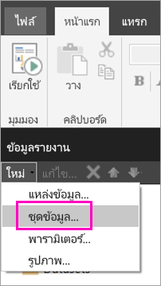
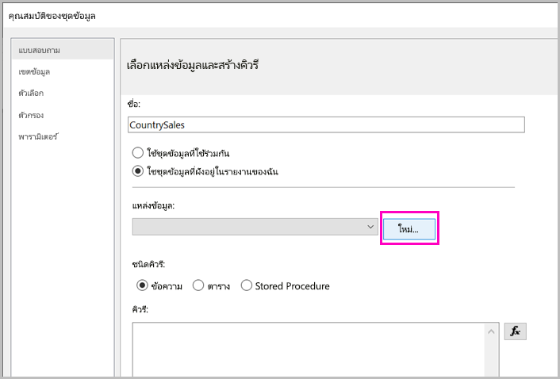
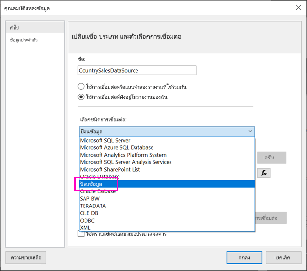
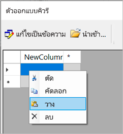
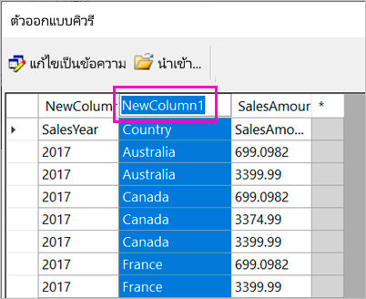
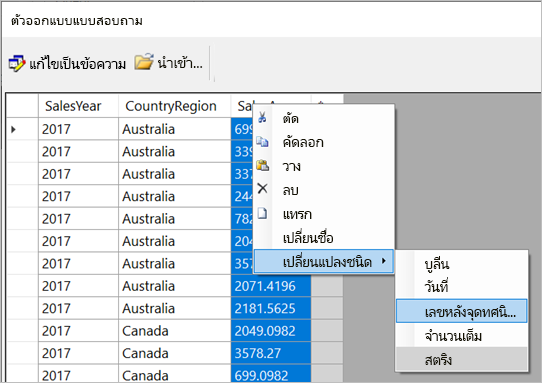
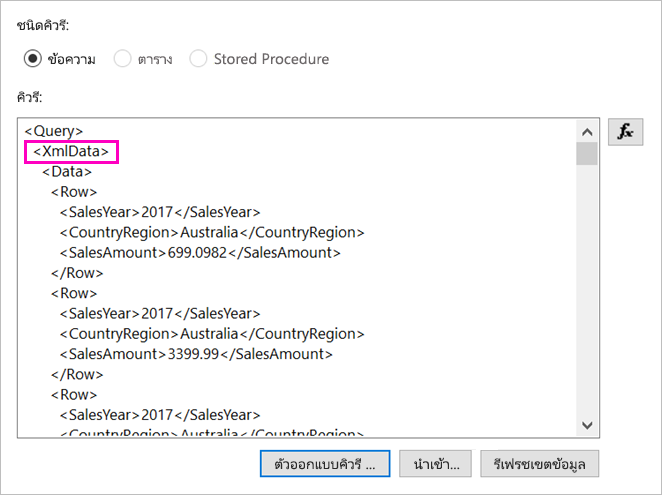
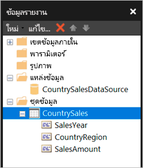

# <a name="enter-data-directly-in-a-paginated-report-in-report-builder---power-bi"></a><span data-ttu-id="d99f3-103">ใส่ข้อมูลในรายงานแบบแบ่งหน้าโดยตรงในตัวสร้างรายงาน - Power BI</span><span class="sxs-lookup"><span data-stu-id="d99f3-103">Enter data directly in a paginated report in Report Builder - Power BI</span></span>

<span data-ttu-id="d99f3-104">[!INCLUDE [applies-to](../includes/applies-to.md)] [!INCLUDE [yes-service](../includes/yes-service.md)] [!INCLUDE [yes-paginated](../includes/yes-paginated.md)] [!INCLUDE [yes-premium](../includes/yes-premium.md)] [!INCLUDE [no-desktop](../includes/no-desktop.md)]</span><span class="sxs-lookup"><span data-stu-id="d99f3-104">[!INCLUDE [applies-to](../includes/applies-to.md)] [!INCLUDE [yes-service](../includes/yes-service.md)] [!INCLUDE [yes-paginated](../includes/yes-paginated.md)] [!INCLUDE [yes-premium](../includes/yes-premium.md)] [!INCLUDE [no-desktop](../includes/no-desktop.md)]</span></span> 

<span data-ttu-id="d99f3-105">ในบทความนี้ คุณจะเรียนรู้เกี่ยวกับคุณลักษณะในตัวสร้างรายงาน Microsoft Power BI เวอร์ชันใหม่ซึ่งช่วยให้คุณสามารถป้อนข้อมูลลงในรายงาน RDL เป็นชุดข้อมูลแบบฝังตัวได้โดยตรง</span><span class="sxs-lookup"><span data-stu-id="d99f3-105">In this article, you learn about a feature in the new version of Microsoft Power BI Report Builder that lets you enter data directly into an RDL report as an embedded dataset.</span></span>  <span data-ttu-id="d99f3-106">คุณลักษณะนี้คล้ายกับ Power BI Desktop</span><span class="sxs-lookup"><span data-stu-id="d99f3-106">This feature is similar to Power BI Desktop.</span></span> <span data-ttu-id="d99f3-107">คุณสามารถพิมพ์ข้อมูลลงในชุดข้อมูลในรายงานได้โดยตรง หรือวางจากโปรแกรมอื่น เช่น Microsoft Excel</span><span class="sxs-lookup"><span data-stu-id="d99f3-107">You can type the data directly in a dataset in your report, or paste it from another program like Microsoft Excel.</span></span> <span data-ttu-id="d99f3-108">หลังจากที่คุณสร้างชุดข้อมูลโดยการป้อนข้อมูล คุณสามารถใช้ข้อมูลนี้ได้เช่นเดียวกับข้อมูลแบบฝังตัวอื่น ๆ ที่คุณสร้างขึ้น</span><span class="sxs-lookup"><span data-stu-id="d99f3-108">After you've created a dataset by entering data, you can use it just like you would any other embedded dataset you've created.</span></span> <span data-ttu-id="d99f3-109">นอกจากนี้คุณยังสามารถเพิ่มตารางมากกว่าหนึ่งตารางและใช้ตารางหนึ่งเป็นตัวกรองตารางอื่นก็ได้</span><span class="sxs-lookup"><span data-stu-id="d99f3-109">Plus you can add more than one table and use one as a filter for the other.</span></span> <span data-ttu-id="d99f3-110">คุณลักษณะนี้มีประโยชน์อย่างยิ่งสำหรับชุดข้อมูลขนาดเล็กแบบคงที่ซึ่งคุณอาจต้องใช้ในรายงานของคุณ เช่น พารามิเตอร์ของรายงาน</span><span class="sxs-lookup"><span data-stu-id="d99f3-110">This feature is especially useful for small, static datasets you might need to use in your report, like report parameters.</span></span>
 
## <a name="prerequisites"></a><span data-ttu-id="d99f3-111">ข้อกำหนดเบื้องต้น</span><span class="sxs-lookup"><span data-stu-id="d99f3-111">Prerequisites</span></span>

- <span data-ttu-id="d99f3-112">เพื่อป้อนข้อมูลในรายงานแบบแบ่งหน้าโดยตรง ให้ [ดาวน์โหลดและติดตั้งตัวสร้างรายงาน Power BI](https://aka.ms/pbireportbuilder)</span><span class="sxs-lookup"><span data-stu-id="d99f3-112">To enter data directly in a paginated report, [download and install Power BI Report Builder](https://aka.ms/pbireportbuilder).</span></span> 
- <span data-ttu-id="d99f3-113">หากต้องการบันทึกรายงานแบบแบ่งหน้าของคุณไปยังบริการ Power BI คุณต้องใช้ [บัญชี Power BI Pro](../fundamentals/service-self-service-signup-for-power-bi.md) และเขียนการเข้าถึงพื้นที่ทำงานใน [ความจุ Power BI Premium](../admin/service-premium-what-is.md)</span><span class="sxs-lookup"><span data-stu-id="d99f3-113">To save your paginated report to the Power BI service, you need a [Power BI Pro account](../fundamentals/service-self-service-signup-for-power-bi.md) and write access to a workspace in a [Power BI Premium capacity](../admin/service-premium-what-is.md).</span></span>
- <span data-ttu-id="d99f3-114">หากต้องการบันทึกรายงานแบบแบ่งหน้าของคุณไปยังเซิร์ฟเวอร์รายงาน คุณต้องมีสิทธิ์เพื่อ[แก้ไขไฟล์ RsReportServer.config](#upload-the-paginated-report-to-a-report-server)</span><span class="sxs-lookup"><span data-stu-id="d99f3-114">To save your paginated report to a report server, you need permissions to [edit the RsReportServer.config file](#upload-the-paginated-report-to-a-report-server).</span></span>

## <a name="create-a-data-source-and-dataset"></a><span data-ttu-id="d99f3-115">สร้างแหล่งข้อมูลและชุดข้อมูล</span><span class="sxs-lookup"><span data-stu-id="d99f3-115">Create a data source and dataset</span></span>

<span data-ttu-id="d99f3-116">หลังจากที่คุณดาวน์โหลดและติดตั้งตัวสร้างรายงานแล้ว คุณทำตามเวิร์กโฟลว์เดียวกันกับที่คุณใช้เพิ่มแหล่งข้อมูลและชุดข้อมูลแบบฝังตัวในรายงานของคุณ</span><span class="sxs-lookup"><span data-stu-id="d99f3-116">After you’ve downloaded and installed Report Builder, you follow the same workflow you use to add an embedded data source and dataset to your report.</span></span> <span data-ttu-id="d99f3-117">ในขั้นตอนต่อไปนี้ ภายใต้ **แหล่งข้อมูล** คุณจะเห็นตัวเลือกใหม่: **ป้อนข้อมูล**</span><span class="sxs-lookup"><span data-stu-id="d99f3-117">In the following procedure, under **Data Sources** you see a new option: **Enter Data**.</span></span>  <span data-ttu-id="d99f3-118">คุณจำเป็นต้องตั้งค่าแหล่งข้อมูลนี้เพียงครั้งเดียวในรายงาน</span><span class="sxs-lookup"><span data-stu-id="d99f3-118">You only need to set up this data source once in a report.</span></span> <span data-ttu-id="d99f3-119">หลังจากนั้นคุณสามารถสร้างตารางข้อมูลที่ป้อนหลายชุดเป็นชุดข้อมูลที่แยกจากกัน โดยใช้แหล่งข้อมูลเดียวทั้งหมด</span><span class="sxs-lookup"><span data-stu-id="d99f3-119">After that, you can create multiple tables of entered data as separate datasets, all using that single data source.</span></span>

1. <span data-ttu-id="d99f3-120">ใน **ข้อมูลรายงาน** ให้เลือก **ชุดข้อมูล** > **ใหม่**</span><span class="sxs-lookup"><span data-stu-id="d99f3-120">In the **Report Data** pane, select **New** > **Dataset**.</span></span>

    

1. <span data-ttu-id="d99f3-122">ในกล่องโต้ตอบ **คุณสมบัติของชุดข้อมูล** เลือก **ใช้ชุดข้อมูลที่ฝังอยู่ในรายงานของฉัน**</span><span class="sxs-lookup"><span data-stu-id="d99f3-122">In the **Dataset Properties** dialog box, select **Use a dataset embedded in my report**.</span></span>

1. <span data-ttu-id="d99f3-123">ถัดจาก **แหล่งข้อมูล** เลือก **ใหม่**</span><span class="sxs-lookup"><span data-stu-id="d99f3-123">Next to **Data source**, select **New**.</span></span>

    

1. <span data-ttu-id="d99f3-125">ในกล่องโต้ตอบ **คุณสมบัติของแหล่งข้อมูล** เลือก **ใช้การเชื่อมต่อที่ฝังอยู่ในรายงานของฉัน**</span><span class="sxs-lookup"><span data-stu-id="d99f3-125">In the **Data Source Properties** dialog box, select **Use a connection embedded in my report**.</span></span>
2. <span data-ttu-id="d99f3-126">ในกล่อง **เลือกประเภทการเชื่อมต่อ** ให้เลือก **ENTER DATA** > **OK**</span><span class="sxs-lookup"><span data-stu-id="d99f3-126">In the **Select connection type** box, select **ENTER DATA** > **OK**.</span></span>

    

1. <span data-ttu-id="d99f3-128">กลับมาในกล่องโต้ตอบ **คุณสมบัติของชุดข้อมูล** เลือก **ตัวออกแบบคิวรี**</span><span class="sxs-lookup"><span data-stu-id="d99f3-128">Back in the **Dataset Properties** dialog box, select **Query Designer**.</span></span>
2. <span data-ttu-id="d99f3-129">ในหน้าต่าง **ตัวออกแบบคิวรี** ให้คลิกขวาและวางข้อมูลลงในตาราง</span><span class="sxs-lookup"><span data-stu-id="d99f3-129">In the **Query Designer** pane, right-click and paste your data in the table.</span></span>

    

1. <span data-ttu-id="d99f3-131">ในการตั้งชื่อคอลัมน์ ให้ดับเบิลคลิกที่แต่ละ **NewColumn** และพิมพ์ชื่อคอลัมน์</span><span class="sxs-lookup"><span data-stu-id="d99f3-131">To set the column names, double-click each **NewColumn** and type the column name.</span></span>

    

1. <span data-ttu-id="d99f3-133">ถ้าแถวแรกมีส่วนหัวของคอลัมน์จากข้อมูลเดิม ให้คลิกขวาและลบออก</span><span class="sxs-lookup"><span data-stu-id="d99f3-133">If the first row contains column headings from the original data, right-click and delete it.</span></span>
    
9. <span data-ttu-id="d99f3-134">ตามค่าเริ่มต้น ชนิดข้อมูลสำหรับแต่ละคอลัมน์เป็นสตริง</span><span class="sxs-lookup"><span data-stu-id="d99f3-134">By default, the data type for each column is String.</span></span> <span data-ttu-id="d99f3-135">หากต้องการเปลี่ยนชนิดข้อมูล ให้คลิกขวาที่ส่วนหัวของคอลัมน์ > **เปลี่ยนประเภท** และตั้งค่าเป็นประเภทข้อมูลอื่น เช่น Date หรือ Float</span><span class="sxs-lookup"><span data-stu-id="d99f3-135">To change the data type, right-click the column header > **Change Type**, and set it to another data type, such as Date or Float.</span></span>

    

1. <span data-ttu-id="d99f3-137">เมื่อคุณสร้างตารางเสร็จแล้ว ให้เลือก **OK**</span><span class="sxs-lookup"><span data-stu-id="d99f3-137">When you’ve finished creating the table, select **OK**.</span></span>  

    <span data-ttu-id="d99f3-138">คิวรีที่สร้างขึ้นเหมือนกับที่คุณเห็นกับแหล่งข้อมูล XML</span><span class="sxs-lookup"><span data-stu-id="d99f3-138">The query that’s generated is the same as you’d see with an XML data source.</span></span> <span data-ttu-id="d99f3-139">ภายใต้หน้าปก เราใช้ XML เป็นผู้ให้บริการข้อมูล</span><span class="sxs-lookup"><span data-stu-id="d99f3-139">Under the covers, we’re using XML as the data provider.</span></span>  <span data-ttu-id="d99f3-140">เราได้นำไปใช้ในจุดประสงค์อื่นเพื่อให้สามารถใช้งานสถานการณ์สมมตินี้ได้เช่นกัน</span><span class="sxs-lookup"><span data-stu-id="d99f3-140">We’ve repurposed it to enable this scenario as well.</span></span>

    

12. <span data-ttu-id="d99f3-142">ในกล่องโต้ตอบ **คุณสมบัติของชุดข้อมูล** เลือก **OK**</span><span class="sxs-lookup"><span data-stu-id="d99f3-142">In the **Dataset Properties** dialog box, select **OK**.</span></span>

13. <span data-ttu-id="d99f3-143">คุณเห็นแหล่งข้อมูลและชุดข้อมูลในหน้าต่าง **ข้อมูลรายงาน**</span><span class="sxs-lookup"><span data-stu-id="d99f3-143">You see your data source and dataset in the **Report Data** pane.</span></span>

    

<span data-ttu-id="d99f3-145">คุณสามารถใช้ชุดข้อมูลของคุณเป็นพื้นฐานสำหรับการสร้างภาพข้อมูลในรายงานของคุณ</span><span class="sxs-lookup"><span data-stu-id="d99f3-145">You can use your dataset as the basis for data visualizations in your report.</span></span> <span data-ttu-id="d99f3-146">นอกจากนี้ คุณยังสามารถเพิ่มชุดข้อมูลอื่นและใช้แหล่งข้อมูลเดียวกันได้</span><span class="sxs-lookup"><span data-stu-id="d99f3-146">You can also add another dataset and use the same data source for it.</span></span>

## <a name="design-the-report"></a><span data-ttu-id="d99f3-147">ออกแบบรายงาน</span><span class="sxs-lookup"><span data-stu-id="d99f3-147">Design the report</span></span>

<span data-ttu-id="d99f3-148">เมื่อคุณมีแหล่งข้อมูลและชุดข้อมูลแล้ว คุณก็พร้อมที่จะสร้างรายงานของคุณแล้ว</span><span class="sxs-lookup"><span data-stu-id="d99f3-148">Now that you have a data source and dataset, you're ready to create your report.</span></span> <span data-ttu-id="d99f3-149">ขั้นตอนต่อไปนี้สร้างรายงานอย่างง่ายโดยยึดตามข้อมูลในส่วนก่อนหน้า</span><span class="sxs-lookup"><span data-stu-id="d99f3-149">The following procedure creates a simple report based on the data in the previous section.</span></span>

1. <span data-ttu-id="d99f3-150">บนเมนู **แทรก** ให้เลือก **ตาราง** > **ตัวช่วยสร้างตาราง**</span><span class="sxs-lookup"><span data-stu-id="d99f3-150">On the **Insert** menu, select **Table** > **Table Wizard**.</span></span>

    :::image type="content" source="media/paginated-reports-enter-data/paginated-table-wizard.png" alt-text="ภาพหน้าจอของการเลือกตัวเลือกตัวช่วยสร้างตาราง":::

1. <span data-ttu-id="d99f3-152">เลือกชุดข้อมูลที่คุณเพิ่งสร้าง > **ถัดไป**</span><span class="sxs-lookup"><span data-stu-id="d99f3-152">Select the dataset you just created > **Next**.</span></span>

    :::image type="content" source="media/paginated-reports-enter-data/paginated-choose-dataset.png" alt-text="ภาพหน้าจอของเลือกกล่องโต้ตอบชุดข้อมูล":::

2.  <span data-ttu-id="d99f3-154">ในหน้า จัดเรียงเขตข้อมูล ลากเขตข้อมูลที่คุณต้องการจัดกลุ่มตามจากกล่อง **เขตข้อมูลพร้อมใช้งาน** ไปยังกล่อง **กลุ่มแถว**:</span><span class="sxs-lookup"><span data-stu-id="d99f3-154">In the Arrange fields page, drag fields you want to group by from the **Available fields** box to the **Row groups** box.</span></span> <span data-ttu-id="d99f3-155">ในตัวอย่างนี้:</span><span class="sxs-lookup"><span data-stu-id="d99f3-155">In this example:</span></span>

    - <span data-ttu-id="d99f3-156">CountryRegion</span><span class="sxs-lookup"><span data-stu-id="d99f3-156">CountryRegion</span></span>
    - <span data-ttu-id="d99f3-157">SalesYear</span><span class="sxs-lookup"><span data-stu-id="d99f3-157">SalesYear</span></span>

3.  <span data-ttu-id="d99f3-158">ลากเขตข้อมูลที่คุณต้องการรวมจากกล่อง **เขตข้อมูลพร้อมใช้งาน** ไปยังกล่อง **ค่า**:</span><span class="sxs-lookup"><span data-stu-id="d99f3-158">Drag the fields you want to aggregate from the **Available fields** box to the **Values** box.</span></span> <span data-ttu-id="d99f3-159">ในตัวอย่างนี้:</span><span class="sxs-lookup"><span data-stu-id="d99f3-159">In this example:</span></span>

    - <span data-ttu-id="d99f3-160">SalesAmount</span><span class="sxs-lookup"><span data-stu-id="d99f3-160">SalesAmount</span></span>

    <span data-ttu-id="d99f3-161">ตามค่าเริ่มต้น ตัวสร้างรายงานจะบวกเขตข้อมูลในกล่อง **ค่า** แต่คุณสามารถเลือกการรวมอื่นได้</span><span class="sxs-lookup"><span data-stu-id="d99f3-161">By default, Report Builder sums the fields in the **Values** box, but you can choose another aggregation.</span></span>

    :::image type="content" source="media/paginated-reports-enter-data/paginated-select-aggregation.png" alt-text="ภาพหน้าจอของการรวมที่แตกต่างกันให้เลือก":::
 
1. <span data-ttu-id="d99f3-163">เลือก **ถัดไป**</span><span class="sxs-lookup"><span data-stu-id="d99f3-163">Select **Next**.</span></span>
4.  <span data-ttu-id="d99f3-164">ในหน้า **เลือกเค้าโครง** ให้คุณเก็บการตั้งค่าเริ่มต้นทั้งหมดเอาไว้ แต่ให้ล้าง **กลุ่มขยาย/ยุบ**</span><span class="sxs-lookup"><span data-stu-id="d99f3-164">In the **Choose the layout** page, keep all the default settings, but clear **Expand/collapse groups**.</span></span> <span data-ttu-id="d99f3-165">โดยทั่วไปแล้ว การขยายและการยุบกลุ่มนั้นยอดเยี่ยม แต่คราวนี้ เราต้องการดูข้อมูลทั้งหมด</span><span class="sxs-lookup"><span data-stu-id="d99f3-165">In general, expanding and collapsing groups is great, but this time we want to see all the data.</span></span>

5.  <span data-ttu-id="d99f3-166">เลือก **ถัดไป** > **เสร็จสิ้น**</span><span class="sxs-lookup"><span data-stu-id="d99f3-166">Select **Next** > **Finish**.</span></span> <span data-ttu-id="d99f3-167">ตารางแสดงอยู่ในพื้นผิวการออกแบบ</span><span class="sxs-lookup"><span data-stu-id="d99f3-167">The table is displayed on the design surface.</span></span>

    :::image type="content" source="media/paginated-reports-enter-data/paginated-design-view-matrix.png" alt-text="ภาพหน้าจอของรายงานในมุมมองออกแบบ":::

### <a name="run-the-report"></a><span data-ttu-id="d99f3-169">เรียกใช้รายงาน:</span><span class="sxs-lookup"><span data-stu-id="d99f3-169">Run the report</span></span>

<span data-ttu-id="d99f3-170">หากต้องการดูค่าจริงและดูตัวอย่างรายงาน คุณต้องเรียกใช้งาน</span><span class="sxs-lookup"><span data-stu-id="d99f3-170">To see the actual values and preview the report, you run it.</span></span>

1. <span data-ttu-id="d99f3-171">เลือก **เรียกใช้** ในริบบอน **หน้าหลัก**</span><span class="sxs-lookup"><span data-stu-id="d99f3-171">Select **Run** in the **Home** ribbon.</span></span>

    :::image type="content" source="media/paginated-reports-enter-data/paginated-run-report.png" alt-text="ภาพหน้าจอของการเลือกเรียกใช้บนริบบอนหน้าแรก":::

    <span data-ttu-id="d99f3-173">ในตอนนี้คุณดูค่าได้แล้ว</span><span class="sxs-lookup"><span data-stu-id="d99f3-173">Now you see the values.</span></span> <span data-ttu-id="d99f3-174">เมทริกซ์มีแถวมากกว่าที่คุณเห็นได้ในมุมมองออกแบบ!</span><span class="sxs-lookup"><span data-stu-id="d99f3-174">The matrix has more rows than you saw in Design view!</span></span>  <span data-ttu-id="d99f3-175">คุณสามารถจัดรูปแบบหน้าหรือตัดสินใจที่จะใช้การตั้งค่าเริ่มต้นก่อนที่จะบันทึกลงในเครื่องคอมพิวเตอร์ของคุณหรือเผยแพร่ไปยังบริการ</span><span class="sxs-lookup"><span data-stu-id="d99f3-175">You can either format the page or decide to use the default settings before saving to your local computer or publishing to the service.</span></span>

1. <span data-ttu-id="d99f3-176">หากต้องการดูว่ารายงานของคุณจะมีลักษณะอย่างไรเมื่อคุณพิมพ์ ให้เลือก **เค้าโครงการพิมพ์**</span><span class="sxs-lookup"><span data-stu-id="d99f3-176">To see how your report will look when you print it, select **Print Layout**.</span></span>

    :::image type="content" source="media/paginated-reports-enter-data/paginated-select-print.png" alt-text="ภาพหน้าจอของการเลือก เค้าโครงการพิมพ์":::

    <span data-ttu-id="d99f3-178">ตอนนี้คุณจะเห็นว่ารายงานมีลักษณะเป็นอย่างไรบนหน้าพิมพ์</span><span class="sxs-lookup"><span data-stu-id="d99f3-178">Now you see it as it will look on a printed page.</span></span>

    :::image type="content" source="media/paginated-reports-enter-data/paginated-print-layout.png" alt-text="ภาพหน้าจอของรายงานในมุมมองเค้าโครงการพิมพ์":::

## <a name="upload-the-paginated-report-to-the-power-bi-service"></a><span data-ttu-id="d99f3-180">อัปโหลดรายงานแบบแบ่งหน้าไปยังบริการของ Power BI</span><span class="sxs-lookup"><span data-stu-id="d99f3-180">Upload the paginated report to the Power BI service</span></span>

<span data-ttu-id="d99f3-181">ขณะนี้รายงานแบบแบ่งหน้าได้รับการสนับสนุนในบริการของ Power BI คุณสามารถอัปโหลดรายงานแบบแบ่งหน้าของคุณไปยังความจุพรีเมียม</span><span class="sxs-lookup"><span data-stu-id="d99f3-181">Now that paginated reports are supported in the Power BI service, you can upload your paginated report to a Premium capacity.</span></span> <span data-ttu-id="d99f3-182">โปรดดู [อัปโหลดรายงานแบบแบ่งหน้า](paginated-reports-save-to-power-bi-service.md) สำหรับรายละเอียด</span><span class="sxs-lookup"><span data-stu-id="d99f3-182">See [Upload a paginated report](paginated-reports-save-to-power-bi-service.md) for details.</span></span>

## <a name="upload-the-paginated-report-to-a-report-server"></a><span data-ttu-id="d99f3-183">อัปโหลดรายงานแบบแบ่งหน้าไปยังเซิร์ฟเวอร์รายงาน</span><span class="sxs-lookup"><span data-stu-id="d99f3-183">Upload the paginated report to a report server</span></span>

<span data-ttu-id="d99f3-184">นอกจากนี้คุณยังสามารถอัปโหลดรายงานแบบแบ่งหน้าของคุณไปยังเซิร์ฟเวอร์รายงาน Power BI Report Server หรือ SQL Server Reporting Services 2016 หรือ 2017</span><span class="sxs-lookup"><span data-stu-id="d99f3-184">You can also upload your paginated report to a Power BI Report Server or SQL Server Reporting Services 2016 or 2017 report server.</span></span> <span data-ttu-id="d99f3-185">ก่อนที่คุณจะทำ คุณต้องเพิ่มรายการต่อไปนี้ลงใน RsReportServer.config ของคุณเป็นส่วนขยายข้อมูลเพิ่มเติม</span><span class="sxs-lookup"><span data-stu-id="d99f3-185">Before you do, you need to add the following item to your RsReportServer.config as an additional data extension.</span></span> <span data-ttu-id="d99f3-186">สำรองไฟล์ RsReportServer.config ก่อนที่จะทำการเปลี่ยนแปลงในกรณีที่คุณเรียกใช้เข้าไปในประเด็น</span><span class="sxs-lookup"><span data-stu-id="d99f3-186">Back up your RsReportServer.config file before you make the change, in case you run into any issues.</span></span>

```xml
<Extension Name="ENTERDATA" Type="Microsoft.ReportingServices.DataExtensions.XmlDPConnection,Microsoft.ReportingServices.DataExtensions">
    <Configuration>
        <ConfigName>ENTERDATA</ConfigName>
    </Configuration>
</Extension>
```

<span data-ttu-id="d99f3-187">หลังจากแก้ไขแล้ว รายละเอียดของผู้ให้บริการข้อมูลในไฟล์กำหนดค่าควรมีลักษณะดังนี้</span><span class="sxs-lookup"><span data-stu-id="d99f3-187">After you've edited it, here's what the list of data providers in the config file should look like:</span></span>


<span data-ttu-id="d99f3-189">นั่นคือ - ตอนนี้คุณสามารถเผยแพร่รายงานที่ใช้ฟังก์ชันการทำงานใหม่นี้ไปยังเซิร์ฟเวอร์รายงานของคุณได้แล้ว</span><span class="sxs-lookup"><span data-stu-id="d99f3-189">That’s it – you can now publish reports that use this new functionality to your report server.</span></span>

## <a name="next-steps"></a><span data-ttu-id="d99f3-190">ขั้นตอนถัดไป</span><span class="sxs-lookup"><span data-stu-id="d99f3-190">Next steps</span></span>

- [<span data-ttu-id="d99f3-191">รายงานแบบแบ่งหน้าใน Power BI Premium คืออะไร</span><span class="sxs-lookup"><span data-stu-id="d99f3-191">What are paginated reports in Power BI Premium?</span></span>](paginated-reports-report-builder-power-bi.md)
- [<span data-ttu-id="d99f3-192">เซิร์ฟเวอร์รายงาน Power BI คืออะไร</span><span class="sxs-lookup"><span data-stu-id="d99f3-192">What is Power BI Report Server?</span></span>](../report-server/get-started.md)
