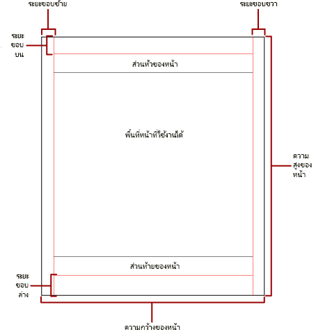
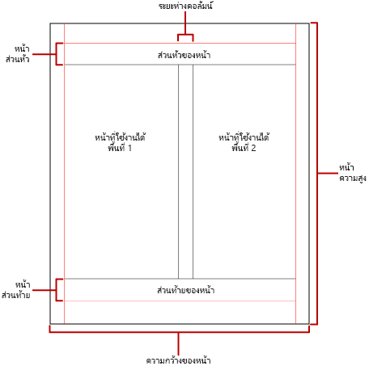

# การแบ่งหน้าในรายงานที่มีการแบ่งหน้าของ Power BIPagination in Power BI paginated reports

[!INCLUDE [applies-to](../includes/applies-to.md)] [!INCLUDE [yes-service](../includes/yes-service.md)] [!INCLUDE [yes-paginated](../includes/yes-paginated.md)] [!INCLUDE [yes-premium](../includes/yes-premium.md)] [!INCLUDE [no-desktop](../includes/no-desktop.md)][!INCLUDE [applies-to](../includes/applies-to.md)] [!INCLUDE [yes-service](../includes/yes-service.md)] [!INCLUDE [yes-paginated](../includes/yes-paginated.md)] [!INCLUDE [yes-premium](../includes/yes-premium.md)] [!INCLUDE [no-desktop](../includes/no-desktop.md)] 

 *การแบ่งหน้า* จะอ้างอิงตามจำนวนหน้าภายในรายงาน และการจัดเรียงรายการรายงานในหน้าเหล่านั้น*Pagination* refers to the number of pages in a report, and the arrangement of report items on those pages. การแบ่งหน้าในรายงานที่มีการแบ่งหน้าของ Power BI จะแตกต่างกันโดยขึ้นอยู่กับการขยายการแสดงข้อมูลที่คุณใช้ในการดูและส่งรายงานPagination in Power BI paginated reports varies depending on the rendering extension you use to view and deliver the report. เมื่อคุณเรียกใช้รายงานบนเซิร์ฟเวอร์รายงาน รายงานจะใช้การแสดงข้อมูลของ HTMLWhen you run a report on the report server, the report uses the HTML renderer. HTML จะทำตามชุดเฉพาะของกฎการแบ่งหน้าHTML follows a specific set of pagination rules. หากคุณส่งออกรายงานเดียวกันเป็น PDF ตัวอย่างเช่น คุณกำลังใช้ตัวแสดงผล PDF ซึ่งใช้กฎที่แตกต่างกันIf you export the same report to PDF, for example, you're using the PDF renderer, which uses a different set of rules. ดังนั้น รายงานจึงแบ่งหน้าแตกต่างกันTherefore, the report paginates differently. คุณจำเป็นต้องทำความเข้าใจกฎที่ใช้ในการควบคุมการแบ่งหน้าในรายงานที่มีการแบ่งหน้าของ Power BIYou need to understand the rules used to control pagination in Power BI paginated reports. จากนั้นคุณสามารถออกแบบรายงานที่ง่ายต่อการอ่านที่คุณปรับให้เหมาะสมสำหรับตัวแสดงผลที่คุณวางแผนที่จะใช้ในการจัดส่งรายงานของคุณThen you can successfully design an easy-to-read report that you optimize for the renderer you plan to use to deliver your report.  
  
 หัวข้อนี้กล่าวถึงผลกระทบของขนาดหน้ากระดาษจริงและโครงร่างรายงานเกี่ยวกับวิธีการที่รูปแบบของตัวแสดงผลแบบบังคับแบ่งหน้าแสดงรายงานThis topic discusses the impact of the physical page size and the report layout on how hard-page-break renderers render the report. คุณสามารถตั้งค่าคุณสมบัติเพื่อปรับเปลี่ยนขนาดหน้าและระยะขอบจริง และแบ่งรายงานเป็นคอลัมน์ได้ ให้ใช้บานหน้าต่าง **คุณสมบัติของรายงาน** บานหน้าต่าง **คุณสมบัติ** หรือกล่องโต้ตอบ **การตั้งค่าหน้ากระดาษ**You can set properties to modify the physical page size and margins, and divide the report into columns; use the **Report Properties** pane, the **Properties** pane, or the **Page Setup** dialog box. เข้าถึงบานหน้าต่าง **คุณสมบัติของรายงาน** โดยการคลิกพื้นที่สีน้ำเงินภายนอกเนื้อความรายงานAccess the **Report Properties** pane by clicking the blue area outside the report body. เข้าถึงกล่องโต้ตอบ **การตั้งค่าหน้ากระดาษ** โดยการคลิก **เรียกใช้** บนแท็บหน้าแรก จากนั้นคลิก **การตั้งค่าหน้ากระดาษ** บนแท็บเรียกใช้Access the **Page Setup** dialog box by clicking **Run** on the Home tab, and then clicking **Page Setup** on the Run tab.  
  
> [!NOTE]  
>  หากคุณได้ออกแบบรายงานให้มีความกว้างหนึ่งหน้า แต่มีการแสดงผลในหลาย ๆ หน้า ให้ตรวจสอบว่าความกว้างของเนื้อความรายงานรวมถึงระยะขอบนั้นไม่ใหญ่กว่าความกว้างของขนาดหน้ากระดาษจริงIf you've designed a report to be one page wide, but it renders across multiple pages, check that the width of the report body, including margins, isn't larger than the physical page size width. เพื่อป้องกันไม่ให้มีการเพิ่มหน้าเปล่าลงในรายงานของคุณ คุณสามารถลดขนาดคอนเทนเนอร์ได้โดยการลากมุมคอนเทนเนอร์ไปด้านซ้ายTo prevent empty pages from being added to your report, you can reduce the container size by dragging the container corner to the left.  

## เนื้อความรายงานThe report body  
 เนื้อความรายงานเป็นคอนเทนเนอร์สี่เหลี่ยมที่แสดงเป็นพื้นที่สีขาวบนพื้นผิวการออกแบบThe report body is a rectangular container displayed as white space on the design surface. ซึ่งสามารถขยายหรือลดขนาดเพื่อรองรับรายการรายงานที่มีอยู่ภายในIt can grow or shrink to accommodate the report items contained within it. เนื้อความรายงานไม่แสดงขนาดหน้ากระดาษจริง และในความเป็นจริงเนื้อความรายงานสามารถขยายเกินขอบเขตของขนาดหน้ากระดาษจริงเพื่อขยายหลายหน้ารายงานThe report body doesn't reflect the physical page size, and in fact, the report body can grow beyond the boundaries of the physical page size to span multiple report pages. ตัวแสดงผลบางส่วนแสดงรายงานที่ขยายหรือลดขนาดขึ้นอยู่กับเนื้อหาของหน้าSome renderers render reports that grow or shrink depending on the contents of the page. รายงานที่แสดงในรูปแบบเหล่านี้ได้รับการปรับให้เหมาะสมสำหรับการดูบนหน้าจอเช่น ในเว็บเบราว์เซอร์Reports rendered in these formats are optimized for screen-based viewing, such as in a Web browser. ตัวแสดงผลเหล่านี้เช่น Microsoft Excel, Word, HTML และ MHTML เพิ่มตัวแบ่งหน้าแนวตั้งเมื่อจำเป็นThese renderers, such as Microsoft Excel, Word, HTML, and MHTML, add vertical page breaks when required.  
  
 คุณสามารถจัดรูปแบบเนื้อความรายงานด้วยสีเส้นขอบ ลักษณะเส้นขอบ และความกว้างเส้นขอบYou can format the report body with a border color, border style, and border width. นอกจากนี้ คุณยังสามารถเพิ่มสีพื้นหลังและรูปพื้นหลังYou can also add a background color and background image.  
  
## หน้าจริงThe physical page  
 ขนาดของหน้าจริงคือขนาดแผ่นกระดาษThe physical page size is the paper size. ขนาดกระดาษที่คุณระบุสำหรับรายงานจะควบคุมวิธีการแสดงรายงานThe paper size that you specify for the report controls how the report is rendered. รายงานที่แสดงผลในรูปแบบของตัวแสดงผลแบบบังคับแบ่งหน้าจะแทรกตัวแบ่งหน้าในแนวนอนและแนวตั้งตามขนาดหน้าจริงReports rendered in hard-page-break formats insert page breaks horizontally and vertically based on the physical page size. ตัวแบ่งหน้าเหล่านี้มอบประสบการณ์การอ่านที่ดีที่สุดเมื่อพิมพ์หรือดูในรูปแบบไฟล์ที่มีการบังคับแบ่งหน้าThese page breaks provide an optimized reading experience when printed or viewed in a hard-page-break file format. รายงานที่แสดงผลในรูปแบบของตัวแสดงผลแบบไม่ได้บังคับแบ่งหน้าจะแทรกตัวแบ่งหน้าในแนวนอนตามขนาดหน้าจริงReports rendered in soft-page-break formats insert page breaks horizontally based on the physical size. อีกครั้ง ตัวแบ่งหน้ามอบประสบการณ์การอ่านที่ดีที่สุดเมื่อดูในเว็บเบราว์เซอร์Again, the page breaks provide an optimized reading experience when viewed in a Web browser.  
  
 ตามค่าเริ่มต้น ขนาดของหน้าคือ 8.5 x 11 นิ้วBy default, the page size is 8.5 x 11 inches. แต่คุณสามารถเปลี่ยน แต่คุณสามารถเปลี่ยนขนาดนี้ในบานหน้าต่าง **คุณสมบัติของรายงาน** หรือกล่องโต้ตอบ **การตั้งค่าหน้ากระดาษ** หรือโดยการเปลี่ยนคุณสมบัติ PageHeight และ PageWidth ในบานหน้าต่าง **คุณสมบัติ**You can change this size in the **Report Properties** pane or **Page Setup** dialog box, or by changing the PageHeight and PageWidth properties in the **Properties** pane. ขนาดหน้าจะไม่ขยายหรือลดขนาดเพื่อรองรับเนื้อหาของเนื้อความรายงานThe page size doesn't grow or shrink to accommodate the contents of the report body. ถ้าคุณต้องการให้รายงานปรากฏบนหน้าเดียว เนื้อหาทั้งหมดภายในเนื้อความรายงานต้องพอดีกับหน้าจริงIf you want the report to appear on a single page, all the content within the report body must fit on the physical page. ถ้าไม่พอดีและคุณใช้รูปแบบการบังคับแบ่งหน้า รายงานจะต้องมีหน้าเพิ่มเติมIf it doesn't fit and you use the hard-page-break format, then the report will require additional pages. ถ้าเนื้อความรายงานขยายเกินขอบด้านขวาของหน้าจริงแล้ว ตัวแบ่งหน้าจะถูกแทรกในแนวนอนIf the report body grows past the right edge of the physical page, then a page break is inserted horizontally. ถ้าเนื้อความรายงานขยายเกินขอบด้านล่างของหน้าจริงแล้ว ตัวแบ่งหน้าจะถูกแทรกในแนวตั้งIf the report body grows past the bottom edge of the physical page, then a page break is inserted vertically.  
  
 คุณสามารถแทนที่ขนาดหน้าจริงที่กำหนดไว้ในรายงานYou can override the physical page size that's defined in the report. ระบุขนาดของหน้าจริงโดยใช้การตั้งค่าข้อมูลอุปกรณ์สำหรับตัวแสดงผลที่คุณใช้เพื่อส่งออกรายงานSpecify the physical page size using the Device Information settings for the renderer that you're using to export the report. สำหรับรายการทั้งหมด ให้ดู [การตั้งค่าข้อมูลอุปกรณ์สำหรับการแสดงส่วนขยาย](/sql/reporting-services/device-information-settings-for-rendering-extensions-reporting-services) ในเอกสารประกอบของ SQL Server Reporting ServicesFor a complete list, see [Device Information Settings for Rendering Extensions](/sql/reporting-services/device-information-settings-for-rendering-extensions-reporting-services) in the SQL Server Reporting Services documentation.  
  
### ระยะขอบMargins

ตัวสร้างรายงานดึงระยะขอบจากขอบของมิติหน้าจริงเข้าไปยังการตั้งค่าระยะขอบที่ระบุReport Builder draws margins from the edge of the physical page dimensions inward to the specified margin setting. ถ้ารายการรายงานขยายเข้าไปพื้นที่ระยะขอบ พื้นที่ดังกล่าวจะถูกตัดเพื่อให้ไม่มีการแสดงพื้นที่ทับซ้อนกันIf a report item extends into the margin area, it is clipped so that the overlapping area isn't rendered. หากคุณระบุขนาดของระยะขอบที่ทำให้ความกว้างแนวนอนหรือแนวตั้งของหน้าเท่ากับศูนย์ การตั้งค่าระยะขอบจะมีค่าเริ่มต้นเป็นศูนย์If you specify margin sizes that cause the horizontal or vertical width of the page to equal zero, the margin settings default to zero. คุณระบุระยะขอบในบานหน้าต่าง **คุณสมบัติของรายงาน** หรือกล่องโต้ตอบ **การตั้งค่าหน้ากระดาษ** หรือโดยการเปลี่ยนแปลงคุณสมบัติ TopMargin, BottomMargin, LeftMargin และ RightMargin ในบานหน้าต่าง **คุณสมบัติ**You specify margins in the **Report Properties** pane or **Page Setup** dialog box, or by changing the TopMargin, BottomMargin, LeftMargin and RightMargin properties in the **Properties** pane. เมื่อต้องการแทนที่ขนาดของระยะขอบที่กำหนดในรายงาน ให้ระบุขนาดของระยะขอบได้โดยใช้การตั้งค่าข้อมูลอุปกรณ์สำหรับตัวแสดงผลเฉพาะที่คุณกำลังใช้เพื่อส่งออกรายงานได้To override the margin size defined in the report, specify the margin size using the Device Information settings for the specific renderer that you are using to export the report.  
  
 *พื้นที่หน้าที่สามารถใช้งานได้* คือพื้นที่ของหน้าจริงที่ยังคงเหลืออยู่หลังจากที่มีการจัดสรรพื้นที่ว่างสำหรับระยะขอบ การเว้นวรรคคอลัมน์ และส่วนหัวและส่วนท้ายของหน้ากระดาษแล้วThe *usable page area* is the area of the physical page that remains after allocating space for margins, column spacing, and the page header and footer. ระยะขอบจะถูกนำไปใช้เมื่อคุณแสดงและพิมพ์รายงานรูปแบบของตัวแสดงผลแบบบังคับแบ่งหน้าMargins are only applied when you render and print reports in hard-page-break renderer formats. รูปภาพต่อไปนี้แสดงระยะขอบและพื้นที่หน้าที่ใช้งานได้ของหน้าจริงThe following image indicates the margin and usable page area of a physical page.  
  
 
  
### คอลัมน์รูปแบบจดหมายข่าวNewsletter-style columns  

 รายงานของคุณสามารถแบ่งออกเป็นคอลัมน์ได้ เช่น คอลัมน์ในหนังสือพิมพ์Your report can be divided into columns, like columns in a newspaper. คอลัมน์จะถือว่าเป็นหน้า *แบบลอจิคัล* ที่แสดงบนหน้า *จริง* เดียวกันColumns are treated as *logical* pages rendered on the same *physical* page. หน้าเหล่านั้นจะถูกจัดเรียงจากซ้ายไปขวา บนลงล่าง และคั่นด้วยช่องว่างระหว่างแต่ละคอลัมน์They're arranged from left to right, top to bottom, and are separated by white space between each column. หากรายงานถูกแบ่งออกเป็นมากกว่าหนึ่งคอลัมน์ หน้าจริงแต่ละหน้าจะถูกแบ่งออกเป็นคอลัมน์ในแนวตั้งIf the report is divided into more than one column, each physical page is divided vertically into columns. แต่ละคอลัมน์จะถือว่าเป็นหน้าแบบตรรกะEach column is considered a logical page. ตัวอย่างเช่น สมมติว่าคุณมีสองคอลัมน์บนหน้าจริงFor example, suppose you have two columns on a physical page. เนื้อหาของรายงานของคุณจะเติมคอลัมน์แรกและคอลัมน์ที่สองThe content of your report fills the first column and then the second column. ถ้ารายงานทั้งหมดไม่พอดีกับภายในสองคอลัมน์แรก รายงานจะเติมคอลัมน์แรกและคอลัมน์ที่สองในหน้าถัดไปIf the report doesn't fit entirely within the first two columns, the report then fills the first and second column on the next page. มีการเติมคอลัมน์ต่อไป จากซ้ายไปขวา แล้วบนลงล่างจนกว่าจะมีการแสดงรายการรายงานทั้งหมดColumns continue to be filled, from left to right, top to bottom until all report items are rendered. หากคุณระบุขนาดคอลัมน์ที่ทำให้ความกว้างแนวนอนหรือความกว้างแนวตั้งเท่ากับศูนย์ ระยะห่างระหว่างคอลัมน์จะมีค่าเริ่มต้นเป็นศูนย์If you specify column sizes that cause the horizontal width or vertical width to equal zero, the column spacing defaults to zero.  
  
 คุณระบุคอลัมน์ในบานหน้าต่าง **คุณสมบัติของรายงาน** หรือกล่องโต้ตอบ **การตั้งค่าหน้ากระดาษ** หรือโดยการเปลี่ยนแปลงคุณสมบัติ TopMargin, BottomMargin, LeftMargin และ RightMargin ในบานหน้าต่าง **คุณสมบัติ**You specify columns in the **Report Properties** pane or **Page Setup** dialog box, or by changing the TopMargin, BottomMargin, LeftMargin and RightMargin properties in the **Properties** pane. เมื่อต้องการใช้ขนาดของระยะขอบที่ไม่ได้ระบุไว้ ให้ระบุขนาดของระยะขอบได้โดยใช้การตั้งค่าข้อมูลอุปกรณ์สำหรับตัวแสดงผลเฉพาะที่คุณกำลังส่งออกรายงานได้To use a margin size that isn't defined, specify the margin size using the Device Information settings for the specific renderer where you're exporting the report. คอลัมน์จะถูกนำไปใช้เมื่อคุณแสดงและพิมพ์รายงานในรูปแบบไฟล์ PDF หรือไฟล์ภาพColumns are only applied when you render and print reports in PDF or Image formats. รูปภาพต่อไปนี้แสดงพื้นที่หน้าที่ใช้งานได้ของหน้าที่มีคอลัมน์The following image indicates the usable page area of a page containing columns.  
  

  
## ตัวแบ่งหน้าและชื่อหน้าPage breaks and page names

 รายงานอาจอ่านง่ายขึ้นและข้อมูลสามารถตรวจสอบและส่งออกได้ง่ายขึ้นเมื่อรายงานมีชื่อหน้าA report might be more readable and its data easier to audit and export when the report has page names. ตัวสร้างรายงานมีคุณสมบัติสำหรับรายการเหล่านี้:Report Builder provides properties for these items:

- รายงานreports
- ขอบเขตตาราง เมทริกซ์ และข้อมูลรายการtable, matrix, and list data regions
- กลุ่มgroups
- สี่เหลี่ยมมุมฉากในรายงานเพื่อควบคุมการแบ่งหน้า รีเซ็ตหมายเลขหน้า และระบุชื่อหน้ารายงานใหม่บนตัวแบ่งหน้าrectangles in the report to control pagination, reset page numbers, and provide new report page names on page breaks. 
 
คุณลักษณะเหล่านี้สามารถปรับปรุงรายงานได้ไม่ว่าจะแสดงรายงานในรูปแบบใดก็ตามThese features can enhance reports regardless of the format in which reports are rendered. ซึ่งมีประโยชน์อย่างยิ่งเมื่อส่งออกรายงานไปยังเวิร์กบุ๊ก ExcelThey're especially useful when exporting reports to Excel workbooks.

> [!NOTE]
> ตาราง เมทริกซ ์และขอบเขตข้อมูลรายการล้วนแต่เป็นขอบเขตข้อมูลประเภทเดียวกันที่อยู่เบื้องหลังฉาก: *tablix*Table, matrix, and list data regions are all really the same kind of data region behind the scenes: a *tablix*. ดังนั้นคุณอาจพบชื่อนั้นSo you may encounter that name. 

 คุณสมบัติ InitialPageName แสดงชื่อหน้าเริ่มต้นของรายงานThe InitialPageName property provides the initial page name of the report. ถ้ารายงานของคุณไม่มีชื่อหน้าสำหรับตัวแบ่งหน้า ชื่อหน้าเริ่มต้นของรายงานจะถูกนำไปใช้สำหรับหน้าใหม่ทั้งหมดที่สร้างขึ้นโดยตัวแบ่งหน้าIf your report doesn't include page names for page breaks, then the initial page name is used for all the new pages created by page breaks. คุณไม่จำเป็นต้องใช้ชื่อหน้าเริ่มต้นYou're not required to use an initial page name.  
  
 รายงานที่แสดงผลสามารถใส่ชื่อหน้าใหม่สำหรับหน้าใหม่ที่ทำให้มีการแบ่งหน้าA rendered report can provide a new page name for the new page that a page break causes. หากต้องการกำหนดชื่อหน้า คุณต้องตั้งค่าคุณสมบัติ PageName ของตาราง เมทริกซ์ รายการ กลุ่ม หรือพื้นที่To provide the page name, you set the PageName property of a table, matrix, list, group, or rectangle. คุณไม่จำเป็นต้องระบุชื่อหน้าบนตัวแบ่งYou don't have to specify page names on breaks. ถ้าคุณไม่ได้มี ค่าของ InitialPageName จะถูกนำมาใช้แทนIf you don't, the value of InitialPageName is used instead. ถ้า InitialPageName ยังว่างเปล่า หน้าใหม่จะไม่มีชื่อIf InitialPageName is also blank, the new page has no name.  
  
 ตาราง เมทริกซ์ และขอบเขตข้อมูลรายการ กลุ่ม และพื้นที่รองรับตัวแบ่งหน้าTable, matrix, and list data regions, groups, and rectangles support page breaks.  
  
 ตัวแบ่งหน้ามีคุณสมบัติต่อไปนี้:The page break includes the following properties:  
  
- **BreakLocation** ระบุตำแหน่งที่ตั้งของตัวแบ่งสำหรับองค์ประกอบของรายงานที่เปิดใช้งานตัวแบ่งหน้า: ที่จุดเริ่มต้น สิ้นสุด หรือเริ่มต้นและสิ้นสุด**BreakLocation** provides the location of the break for the page break enabled report element: at the start, end, or start and end. ในกลุ่มต่าง ๆ BreakLocation สามารถอยู่ระหว่างกลุ่มได้On groups, BreakLocation can be located between groups.  
  
- **ปิดใช้งาน**  ระบุว่ามีการใช้ตัวแบ่งหน้ากับองค์ประกอบรายงานหรือไม่**Disabled** indicates whether a page break is applied to the report element. ถ้าคุณสมบัตินี้ประเมินเป็นจริง ตัวแบ่งหน้าจะถูกละเว้นIf this property evaluates to True, the page break is ignored. คุณสมบัตินี้จะถูกนำไปใช้เพื่อปิดใช้งานตัวแบ่งหน้าโดยยึดตามนิพจน์เมื่อมีการเรียกใช้รายงานThis property is used to dynamically disable page breaks based on expressions when the report is run.  
  
- **ResetPageNumber** ระบุว่าควรตั้งค่าหมายเลขหน้าเป็น 1 เมื่อมีตัวแบ่งหน้าเกิดขึ้นหรือไม่**ResetPageNumber** indicates whether the page number should be reset to 1 when a page break occurs. ถ้าคุณสมบัตินี้ประเมินเป็นจริง หมายเลขหน้าจะถูกรีเซ็ตIf this property evaluates to True, the page number is reset.  
  
 คุณสามารถตั้งค่าคุณสมบัติ BreakLocation ในกล่องโต้ตอบ **คุณสมบัติ Tablix** **คุณสมบัติพื้นที่** หรือ **คุณสมบัติกลุ่ม** แต่คุณต้องตั้งค่าคุณสมบัติที่ปิดใช้งาน คุณสมบัติ ResetPageNumber และ PageName ในบานหน้าต่างคุณสมบัติตัวสร้างรายงานYou can set the BreakLocation property in the **Tablix Properties** , **Rectangle Properties** , or **Group Properties** dialog boxes, but you must set the Disabled, ResetPageNumber, and PageName properties in the Report Builder Properties pane. ถ้าคุณสมบัติในบานหน้าต่างคุณสมบัติได้รับการจัดระเบียบตามประเภท คุณจะสามารถค้นหาคุณสมบัติต่าง ๆ ได้ในประเภท **PageBreak**If the properties in the Properties pane are organized by category, you find the properties in the **PageBreak** category. สำหรับกลุ่มต่าง ๆ ประเภท **PageBreak** จะอยู่ภายในประเภท **กลุ่ม**For groups, the **PageBreak** category is inside the **Group** category.  
  
 คุณสามารถใช้นิพจน์ค่าคงที่และอย่างง่าย หรือซับซ้อนในการกำหนด ค่าของคุณสมบัติที่ปิดใช้งานและคุณสมบัติ ResetPageNumberYou can use constants and simple or complex expressions to set the value of the Disabled and ResetPageNumber properties. อย่างไรก็ตาม คุณไม่สามารถใช้นิพจน์ที่มีคุณสมบัติ BreakLocation ได้However, you can't use expression with the BreakLocation property. สำหรับข้อมูลเพิ่มเติมเกี่ยวกับการเขียนและการใช้นิพจน์ ให้ดู [นิพจน์ในตัวสร้างรายงาน Power BI](report-builder-expressions.md)For more information about writing and using expressions, see [Expressions in Power BI Report Builder](report-builder-expressions.md).  
  
 ในรายงานของคุณ คุณสามารถเขียนนิพจน์ที่อ้างอิงชื่อหน้าหรือหมายเลขหน้าปัจจุบันโดยใช้คอลเลกชัน **ส่วนกลาง**In your report you can write expressions that reference the current page names or page numbers by using the **Globals** collection. สำหรับข้อมูลเพิ่มเติม ให้ดู [ส่วนกลางที่มีอยู่แล้วภายในและการอ้างอิงผู้ใช้](/sql/reporting-services/report-design/built-in-collections-built-in-globals-and-users-references-report-builder) ในตัวสร้างรายงานและเอกสาร Reporting ServicesFor more information, see [Built-in Globals and Users References](/sql/reporting-services/report-design/built-in-collections-built-in-globals-and-users-references-report-builder) in the Report Builder and Reporting Services documentation.
  
### การตั้งชื่อแท็บแผ่นงาน ExcelNaming Excel worksheet tabs

 คุณสมบัติเหล่านี้จะมีประโยชน์เมื่อคุณส่งออกรายงานไปยังเวิร์กบุ๊ก ExcelThese properties are useful when you export reports to Excel workbooks. ใช้คุณสมบัติ InitialPage เพื่อระบุชื่อเริ่มต้นสำหรับชื่อแท็บแผ่นงานเมื่อคุณส่งออกรายงาน และใช้ตัวแบ่งหน้าและคุณสมบัติ PageName เพื่อตั้งชื่อที่แตกต่างกันสำหรับแต่ละแผ่นงานUse the InitialPage property to specify a default name for the worksheet tab name when you export the report, and use page breaks and the PageName property to provide different names for each worksheet. หน้ารายงานใหม่แต่ละหน้าที่กำหนดโดยตัวแบ่งหน้าจะถูกส่งออกไปยังแผ่นงานอื่นที่ชื่อตามค่าของคุณสมบัติ PageNameEach new report page, defined by a page break, is exported to a different worksheet named by the value of the PageName property. ถ้า PageName ว่างเปล่าแต่รายงานมีชื่อหน้าเริ่มต้น จากนั้นแผ่นงานทั้งหมดในเวิร์กบุ๊ก Excel จะใช้ชื่อเดียวกัน นั่นคือชื่อหน้าเริ่มต้นIf PageName is blank, but the report has an initial page name, then all worksheets in the Excel workbook use the same name, the initial page name.  
  
 สำหรับข้อมูลเพิ่มเติมเกี่ยวกับวิธีการทำงานของคุณสมบัติเหล่านี้เมื่อมีการส่งออกรายงานไปยัง Excel ให้ดู [การส่งออกไปยัง Microsoft Excel](/sql/reporting-services/report-builder/exporting-to-microsoft-excel-report-builder-and-ssrs) ในตัวสร้างรายงานและเอกสาร Reporting ServicesFor more information about how these properties work when reports are exported to Excel, see [Exporting to Microsoft Excel](/sql/reporting-services/report-builder/exporting-to-microsoft-excel-report-builder-and-ssrs) in the Report Builder and Reporting Services documentation.  
  
## ขั้นตอนถัดไปNext steps

- [ดูรายงานแบบแบ่งหน้าในบริการของ Power BIView a paginated report in the Power BI service](../consumer/paginated-reports-view-power-bi-service.md)
- [หลีกเลี่ยงหน้าเปล่าเมื่อพิมพ์รายงานแบบแบ่งหน้าAvoid blank pages when printing paginated reports](../guidance/report-paginated-blank-page.md)
- มีคำถามเพิ่มเติมหรือไม่More questions? [ลองไปที่ชุมชน Power BITry the Power BI Community](https://community.powerbi.com/)
