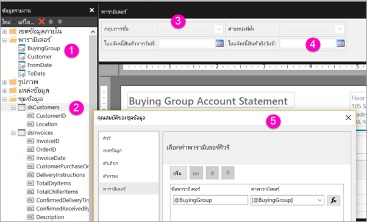

# สร้างพารามิเตอร์สำหรับรายงานแบบแบ่งหน้าในบริการของ Power BICreate parameters for paginated reports in the Power BI service

[!INCLUDE [applies-to](../includes/applies-to.md)] [!INCLUDE [yes-service](../includes/yes-service.md)] [!INCLUDE [yes-paginated](../includes/yes-paginated.md)] [!INCLUDE [yes-premium](../includes/yes-premium.md)] [!INCLUDE [no-desktop](../includes/no-desktop.md)][!INCLUDE [applies-to](../includes/applies-to.md)] [!INCLUDE [yes-service](../includes/yes-service.md)] [!INCLUDE [yes-paginated](../includes/yes-paginated.md)] [!INCLUDE [yes-premium](../includes/yes-premium.md)] [!INCLUDE [no-desktop](../includes/no-desktop.md)] 

ในบทความนี้ คุณจะได้เรียนวิธีการสร้างพารามิเตอร์สำหรับรายงานแบบแบ่งหน้าในบริการของ Power BIIn this article, you learn how to create parameters for paginated reports in the Power BI service.  พารามิเตอร์ของรายงานให้วิธีการเลือกข้อมูลรายงานและทำให้การนำเสนอรายงานมีความหลากหลายA report parameter provides a way to choose report data and vary the report presentation. คุณสามารถระบุค่าเริ่มต้นและรายการของค่าที่พร้อมใช้งานได้You can provide a default value and a list of available values. ผู้อ่านรายงานของคุณสามารถเปลี่ยนแปลงรายการที่เลือกได้Your report readers can change the selection. นอกจากนี้ พวกเขายังสามารถพิมพ์ลงในกล่องข้อความพารามิเตอร์เพื่อค้นหาค่าThey can also type in the parameter text boxes to search for values. ดูที่ [ดูพารามิเตอร์สำหรับรายงานที่มีการแบ่งหน้า](../consumer/paginated-reports-view-parameters.md) เพื่อดูว่า ผู้ใช้ทางธุรกิจของคุณโต้ตอบกับพารามิเตอร์ต่างๆ ในบริการของ Power BI อย่างไรSee [View parameters for paginated reports](../consumer/paginated-reports-view-parameters.md) to see how your business users interact with parameters in the Power BI service.  

ภาพประกอบต่อไปนี้แสดงให้เห็นมุมมองออกแบบในตัวสร้างรายงาน Power BI สำหรับรายงานที่มีพารามิเตอร์ @BuyingGroup, @Customer, @FromDate และ @ToDateThe following illustration shows Design view in Power BI Report Builder for a report with the parameters @BuyingGroup, @Customer, @FromDate, and @ToDate. 
  

  
1.  พารามิเตอร์ของรายงานในแผงข้อมูลรายงานThe report parameters in the Report Data pane.  
  
2.  ตารางพร้อมพารามิเตอร์หนึ่งตัวในชุดข้อมูลThe table with one of the parameters in the dataset.  
  
3.  แผงพารามิเตอร์The Parameters pane. คุณสามารถกำหนดเค้าโครงของพารามิเตอร์ในแผงพารามิเตอร์ได้You can customize the layout of parameters in the parameters pane. 
  
4.  พารามิเตอร์ @FromDate และ @ToDate มีประเภทข้อมูลเป็น **DateTime**The parameters @FromDate and @ToDate have the data type **DateTime**. เมื่อดูรายงาน คุณสามารถพิมพ์วันที่ในกล่องข้อความหรือเลือกจากส่วนควบคุมปฏิทินได้When viewing the report, you can either type a date in the text box or choose a date in the calendar control. 

5.  พารามิเตอร์ตัวหนึ่งในกล่องโต้ตอบ **คุณสมบัติชุดข้อมูล**One of the parameters in the **Dataset Properties** dialog box.  

  
## สร้างหรือแก้ไขพารามิเตอร์ของรายงานCreate or edit a report parameter  
  
1.  เปิดรายงานแบบแบ่งหน้าในตัวสร้างรายงาน Power BIOpen your paginated report in Power BI Report Builder.

1. ที่แผง **ข้อมูลรายงาน** ให้คุณคลิกขวาที่โหนด **พารามิเตอร์** > **เพิ่มพารามิเตอร์**In the **Report Data** pane, right-click the **Parameters** node > **Add Parameter**. กล่องโต้ตอบ **คุณสมบัติพารามิเตอร์ของรายงาน** จะเปิดขึ้นThe **Report Parameter Properties** dialog box opens.  
  
2.  ใน **ชื่อ** ให้คุณพิมพ์ชื่อสำหรับพารามิเตอร์หรือกดยอมรับชื่อเริ่มต้นIn **Name**, type a name for the parameter or accept the default name.  
  
3.  ใน **ข้อความตอบรับ** ให้คุณพิมพ์ข้อความที่จะแสดงข้างกล่องข้อความพารามิเตอร์เมื่อผู้ใช้เรียกใช้รายงานIn **Prompt**, type text to appear next to the parameter text box when the user runs the report.  
  
4.  ใน **ชนิดข้อมูล** ให้คุณเลือกชนิดข้อมูลสำหรับค่าพารามิเตอร์In **Data type**, select the data type for the parameter value.  
  
5.  ถ้าพารามิเตอร์สามารถมีค่าว่างได้ ให้เลือก **อนุญาตให้มีค่าว่าง**If the parameter can contain a blank value, select **Allow blank value**.  
  
6.  ถ้าพารามิเตอร์สามารถมีค่า Null ได้ ให้เลือก **อนุญาตให้มีค่า Null**If the parameter can contain a null value, select **Allow null value**.  
  
7.  เลือก **อนุญาตให้มีหลายค่า** เพื่อให้ผู้ใช้เลือกค่าสำหรับพารามิเตอร์ได้มากกว่าหนึ่งค่าTo allow a user to select more than one value for the parameter, select **Allow multiple values**.  
  
8.  ตั้งค่าตัวเลือกการมองเห็นSet the visibility option.  
  
    -   เลือก **มองเห็นได้** เพื่อแสดงพารามิเตอร์ในแถบเครื่องมือที่ด้านบนของรายงานTo show the parameter on the toolbar at the top of the report, select **Visible**.  
  
    -   เลือก **ซ่อน** เพื่อซ่อนพารามิเตอร์ไม่ให้แสดงในแถบเครื่องมือTo hide the parameter so that it doesn't display on the toolbar, select **Hidden**.  
  
    -   เลือก **ภายใน** เพื่อซ่อนพารามิเตอร์และปกป้องไว้จากการถูกดัดแปลงในเซิร์ฟเวอร์รายงานหลังจากที่เผยแพร่รายงานแล้วTo hide the parameter and protect it from being modified on the report server after the report is published, select **Internal**. จากนั้นพารามิเตอร์ของรายงานจะเห็นได้ในข้อกำหนดของรายงานThe report parameter can then only be viewed in the report definition. สำหรับตัวเลือกนี้ คุณต้องตั้งค่าเป็นค่าเริ่มต้นหรืออนุญาตให้พารามิเตอร์มีค่า Null ได้For this option, you must set a default value or allow the parameter to accept a null value.  
  
9. เลือก **ตกลง**Select **OK**. 

## ขั้นตอนถัดไปNext steps

ดูที่ [ดูพารามิเตอร์สำหรับรายงานแบบแบ่งหน้า](../consumer/paginated-reports-view-parameters.md) เพื่อดูว่าพารามิเตอร์มีหน้าตาอย่างไรในบริการของ Power BISee [View parameters for paginated reports](../consumer/paginated-reports-view-parameters.md) to see how the parameters look in the Power BI service.

สำหรับข้อมูลเชิงลึกเกี่ยวกับพารามิเตอร์ในรายงานที่มีการแบ่งหน้า ดู[พารามิเตอร์ของรายงานในตัวสร้างรายงาน Power BI](report-builder-parameters.md)For in-depth information about parameters in paginated reports, see [Report parameters in Power BI Report Builder](report-builder-parameters.md).
