# บทช่วยสอน: สร้างรายงานแบบแบ่งหน้าและอัปโหลดไปยังบริการของ Power BITutorial: Create a paginated report and upload it to the Power BI service

[!INCLUDE [applies-to](../includes/applies-to.md)] [!INCLUDE [yes-service](../includes/yes-service.md)] [!INCLUDE [yes-paginated](../includes/yes-paginated.md)] [!INCLUDE [yes-premium](../includes/yes-premium.md)] [!INCLUDE [no-desktop](../includes/no-desktop.md)][!INCLUDE [applies-to](../includes/applies-to.md)] [!INCLUDE [yes-service](../includes/yes-service.md)] [!INCLUDE [yes-paginated](../includes/yes-paginated.md)] [!INCLUDE [yes-premium](../includes/yes-premium.md)] [!INCLUDE [no-desktop](../includes/no-desktop.md)] 

ในบทช่วยสอนนี้ คุณจะได้เชื่อมต่อกับฐานข้อมูลตัวอย่าง Azure SQLIn this tutorial, you connect to a sample Azure SQL database. จากนั้นคุณจะได้ใช้วิซาร์ดในตัวสร้างรายงาน Power BI เพื่อสร้างรายงานแบบแบ่งหน้าพร้อมตารางที่ครอบคลุมพื้นที่หลายหน้าThen you use a wizard in Power BI Report Builder to create a paginated report with a table that wraps to multiple pages. และคุณจะได้อัปโหลดรายงานแบบแบ่งหน้าไปยังพื้นที่ทำงานในบริการของ Power BI ด้วยความจุพรีเมียมThen you upload the paginated report to a workspace in a Premium capacity in the Power BI service.

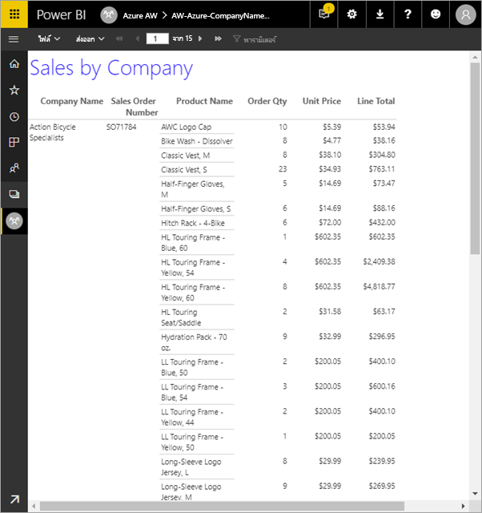

โปรดใช้ขั้นตอนต่อไปนี้เพื่อทำตามบทช่วยสอน:Here are the steps you complete in this tutorial:

> [!div class="checklist"]
> * สร้างฐานข้อมูลตัวอย่าง AzureCreate an Azure sample database.
> * สร้างเมทริกซ์ในตัวสร้างรายงาน Power BI โดยใช้วิซาร์ดช่วยCreate a matrix in Power BI Report Builder with the help of a wizard.
> * จัดรูปแบบรายงานให้สวยงามด้วยการเพิ่มชื่อเรื่อง หมายเลขหน้าและหัวคอลัมน์ในแต่ละหน้าFormat the report with title, page numbers, and column headings on each page.
> * จัดรูปแบบสกุลเงินFormat the currency.
> * อัปโหลดรายงานเข้าบริการของ Power BIUpload the report to the Power BI service.

ถ้าคุณยังไม่มีการสมัครใช้งาน Azure สร้าง[บัญชีฟรี](https://azure.microsoft.com/free/?WT.mc_id=A261C142F)ก่อนที่คุณจะเริ่มIf you don't have an Azure subscription, create a [free account](https://azure.microsoft.com/free/?WT.mc_id=A261C142F) before you begin.
 
## สิ่งที่จำเป็นต้องมีPrerequisites  

โปรดดูข้อกำหนดเบื้องต้นในการสร้างรายงานแบบแบ่งหน้า:Here are the prerequisites for creating the paginated report:

- ติดตั้ง[ตัวสร้างรายงาน Power BI จากศูนย์ดาวน์โหลด Microsoft](https://aka.ms/pbireportbuilder)Install [Power BI Report Builder from the Microsoft Download Center](https://aka.ms/pbireportbuilder). 

- ทำตามการเริ่มต้นด่วน[สร้างฐานข้อมูลตัวอย่าง Azure SQL ในพอร์ทัล Azure](/azure/sql-database/sql-database-get-started-portal)Follow the quickstart [Create an Azure SQL database sample  in the Azure portal](/azure/sql-database/sql-database-get-started-portal). คัดลอก และบันทึกค่าในกล่อง **ชื่อเซิร์ฟเวอร์** ในแท็บ **ภาพรวม** โปรดจดจำชื่อผู้ใช้และรหัสผ่านที่คุณสร้างใน AzureCopy and save the value in the **Server name** box on the **Overview** tab. Remember the user name and password you created in Azure.

โปรดดูข้อกำหนดเบื้องต้นในการอัปโหลดรายงานแบบแบ่งหน้าไปยังบริการของ Power BI:Here are the prerequisites for uploading your paginated report to the Power BI service:

- คุณต้องมี[สิทธิ์การใช้งาน Power BI Pro](../admin/service-admin-licensing-organization.md)You need a [Power BI Pro license](../admin/service-admin-licensing-organization.md).
- คุณต้องมีพื้นที่ทำงานบนบริการใน[ความจุ Power BI Premium](../admin/service-premium-what-is.md)You need a workspace on the service in a [Power BI Premium capacity](../admin/service-premium-what-is.md). มีไอคอนรูปข้าวหลามตัดที่หมายถึงอยู่ถัดจากชื่อของพื้นที่ทำงานIt has a diamond icon  next to the workspace name.

## ใช้วิซาร์ดสร้างเมทริกซ์Create the matrix with a wizard
  
1.  เริ่มตัวสร้างรายงาน Power BI จากคอมพิวเตอร์ของคุณStart Power BI Report Builder from your computer.  
  
     กล่องโต้ตอบ **เริ่มต้นใช้งาน** จะเปิดขึ้นThe **Getting Started** dialog box opens.  
  
     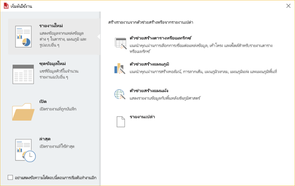
  
1.  ดูที่แผงข้างซ้ายและยืนยันว่าได้เลือก **รายงานใหม่** แล้ว จากนั้นดูที่แผงข้างขวาและเลือก **ตารางหรือวิซาร์ดเมทริกซ์**In the left pane, verify that **New Report** is selected, and in the right pane, select **Table or Matrix Wizard**.  
  
4.  ในหน้า **เลือกชุดข้อมูล** ให้คุณเลือก **สร้างชุดข้อมูล** > **ถัดไป**In the **Choose a dataset** page, select **Create a dataset** > **Next**.  

    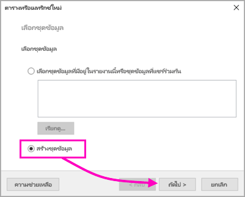
  
5.  ในหน้า **เลือกการเชื่อมต่อไปยังแหล่งข้อมูล** ให้คุณเลือก **ใหม่**In the **Choose a connection to a data source** page, select **New**. 

    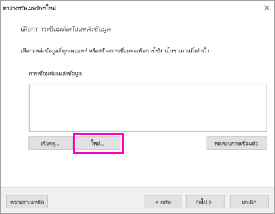
  
     กล่องโต้ตอบ **คุณสมบัติแหล่งข้อมูล** จะเปิดขึ้นThe **Data Source Properties** dialog box opens.  
  
6.  คุณสามารถตั้งชื่อแหล่งข้อมูลได้ตามต้องการ โดยใช้อักขระและเส้นขีดล่างYou can name a data source anything you want, using characters and underscores. สำหรับบทช่วยสอนนี้ ให้คุณพิมพ์ **MyAzureDataSource** ในกล่อง **ชื่อ**For this tutorial, in the **Name** box, type **MyAzureDataSource**.  
  
7.  ในกล่อง **เลือกชนิดการเชื่อมต่อ** ให้คุณเลือก **Microsoft Azure SQL Database**In the **Select connection type** box, select **Microsoft Azure SQL Database**.  
  
8.  เลือก **สร้าง** ที่อยู่ถัดจากกล่อง **สตริงการเชื่อมต่อ**Select **Build** next to the **Connection string** box. 

    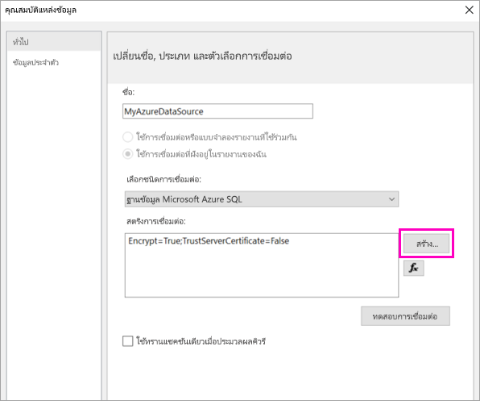

9. **ใน Azure:** ให้คุณย้อนกลับไปที่พอร์ทัล Azure และเลือก **ฐานข้อมูล SQL****In Azure:** Go back to the Azure portal and select **SQL databases**.

1. เลือกฐานข้อมูล Azure SQL ที่คุณสร้างขึ้นในการเริ่มต้นด่วน "สร้างฐานข้อมูลตัวอย่าง Azure SQL ในพอร์ทัล Azure" ในส่วน **ข้อกำหนดเบื้องต้น** ของบทความนี้Select the Azure SQL database you created in the quickstart "Create an Azure SQL database sample in the Azure portal" in the **Prerequisites** section of this article.

1. ที่แท็บ **ภาพรวม** ให้คุณคัดลอกค่าในกล่อง **ชื่อเซิร์ฟเวอร์**On the **Overview** tab, copy the value in the **Server name** box.

2. **ในตัวสร้างรายงาน** : ในกล่องโต้ตอบ **คุณสมบัติการเชื่อมต่อ** ให้วางชื่อเซิร์ฟเวอร์ที่คุณคัดลอกไว้ใต้ช่อง **ชื่อเซิร์ฟเวอร์****In Report Builder** : In the **Connection Properties** dialog box, under **Server name** paste the server name you copied. 

1. ในการ **เข้าสู่เซิร์ฟเวอร์** โปรดแน่ใจว่าได้เลือก **ใช้การตรวจสอบสิทธิ์เซิร์ฟเวอร์ SQL** จากนั้นให้คุณพิมพ์ชื่อผู้ใช้และรหัสผ่านที่สร้างไว้ใน Azure เพื่อใช้กับฐานข้อมูลตัวอย่างFor **Log on to the server** , make sure **Use SQL Server Authentication** is selected, then type the user name and password you created in Azure for the sample database.

1. ที่ด้านล่างของ **เชื่อมต่อไปยังฐานข้อมูล** ให้คุณเลือกลูกศรดรอปดาวน์และเลือกชื่อฐานข้อมูลที่สร้างไว้ใน AzureUnder **Connect to a database** , select the drop-down arrow and select the database name you created in Azure.
 
    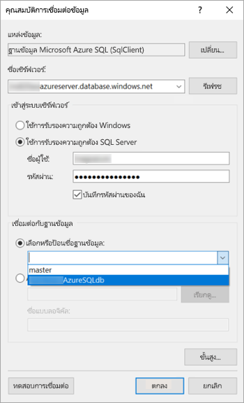

1. เลือก **ทดสอบการเชื่อมต่อ**Select **Test Connection**. คุณจะเห็นข้อความ **ผลการทดสอบ** แสดงว่า **การทดสอบการเชื่อมต่อสำเร็จ**You see the **Test results** message that **Test connection succeeded**.

1. เลือก **ตกลง** > **ตกลง**Select **OK** > **OK**. 

   ขณะนี้ตัวสร้างรายงานจะแสดงสตริงการเชื่อมต่อที่เพิ่งสร้างไว้ในกล่อง **สตริงการเชื่อมต่อ**Now in the **Connection string** box, Report Builder displays the connection string you just created. 

    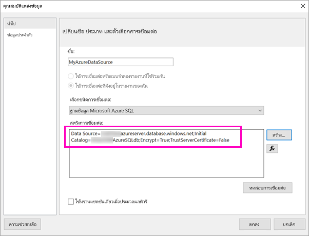

1. เลือก **ตกลง**Select **OK**.
  
9. ในหน้า **เลือกการเชื่อมต่อไปยังแหล่งข้อมูล** คุณจะเห็นคำว่า "(ในรายงานนี้)" อยู่ใต้การเชื่อมต่อกับแหล่งข้อมูลที่เพิ่งสร้างIn the **Choose a connection to a data source** page, you see "(in this Report)" under the data source connection you just created. เลือกแหล่งข้อมูลนั้น > **ถัดไป**Select that data source  > **Next**.  

    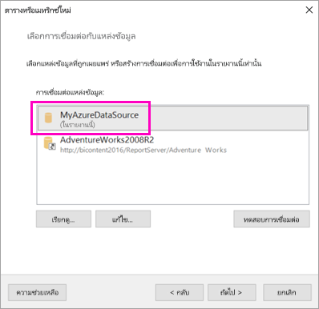

10. พิมพ์ชื่อผู้ใช้และรหัสผ่านเดียวกันนั้นลงในกล่องType the same user name and password in the box. 
  
10. ในหน้า **ออกแบบคิวรี** ให้คุณขยาย SaleIT และตาราง จากนั้นเลือกตารางเหล่านี้:In the **Design a query** page, expand SalesLT, expand Tables, and select these tables:

    - ที่อยู่Address
    - ลูกค้าCustomer
    - ผลิตภัณฑ์Product
    - ประเภทของผลิตภัณฑ์ProductCategory
    - SalesOrderDetailSalesOrderDetail
    - SalesOrderHeaderSalesOrderHeader

     หากมีการเลือก **ตรวจจับอัตโนมัติ** เพื่อหา **ความสัมพันธ์** >  ตัวสร้างรายงานจะตรวจจับความสัมพันธ์ระหว่างตารางเหล่านี้Because **Relationships** > **Auto Detect** is selected, Report Builder detects the relationships between these tables. 
    
    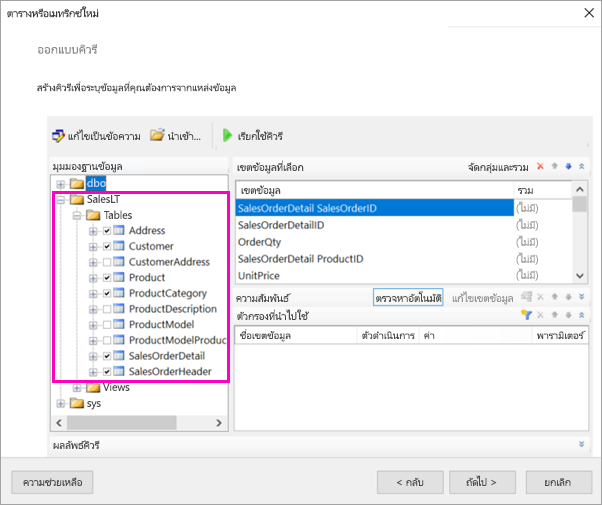
 
1.  เลือก **เรียกใช้คิวรี**Select **Run Query**. ตัวสร้างรายงานจะแสดง **ผลลัพธ์คิวรี**Report Builder displays the **Query results**. 
 
     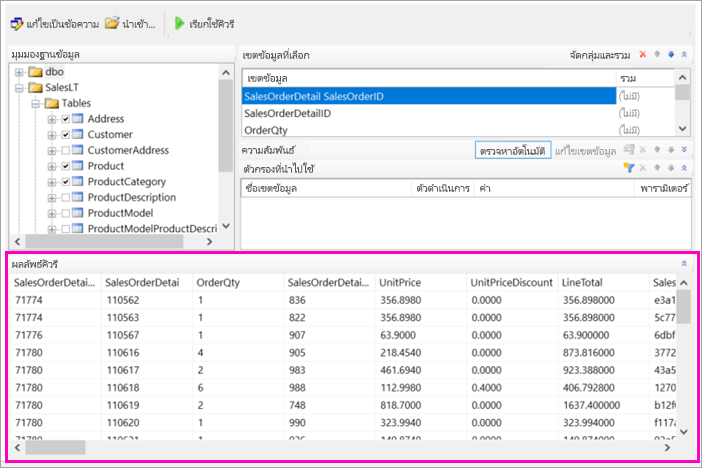

18. เลือก **ถัดไป**Select **Next**. 

19. ในหน้า **เลือกชุดข้อมูล** ให้คุณเลือกชุดข้อมูลที่คุณเพิ่งสร้าง > **ถัดไป**In the **Choose a dataset** page, choose the dataset you just created > **Next**.

    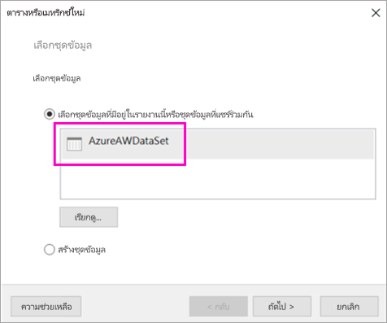

1. ในหน้า **จัดเรียงเขตข้อมูล** ให้คุณลากเขตข้อมูลเหล่านี้จากกล่อง **เขตข้อมูลพร้อมใช้งาน** ไปยังกล่อง **กลุ่มแถว** :In the **Arrange fields** page, drag these fields from the **Available fields** box to the **Row groups** box:

    - CompanyNameCompanyName
    - SalesOrderNumberSalesOrderNumber
    - Product_NameProduct_Name

1. ลากเขตข้อมูลเหล่านี้จากกล่อง **เขตข้อมูลพร้อมใช้งาน** ไปยังกล่อง **ค่า** :Drag these fields from the **Available fields** box to the **Values** box:

    - OrderQtyOrderQty
    - ราคาต่อหน่วยUnitPrice
    - ยอดรวมรายการทั้งหมดLineTotal

    ตัวสร้างรายงานได้สร้างเขตข้อมูลเหล่านี้ไว้ในผลรวมกล่อง **ค่า** โดยอัตโนมัติReport Builder automatically made the fields in the **Values** box sums.

    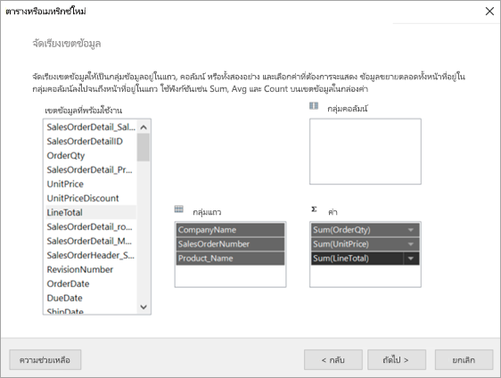

24. ในหน้า **เลือกเค้าโครง** ให้คุณเก็บการตั้งค่าเริ่มต้นทั้งหมดเอาไว้ แต่ให้ล้าง **กลุ่มขยาย/ยุบ**In the **Choose the layout** page, keep all the default settings, but clear **Expand/collapse groups**. โดยทั่วไปแล้ว ฟีเจอร์กลุ่มขยาย/ยุบใช้งานได้ดีมาก แต่ในครั้งนี้คุณต้องการให้ตารางครอบคลุมพื้นที่หลายหน้าIn general, the expand/collapse groups feature is great, but this time you want the table to wrap to multiple pages.

1. เลือก **ถัดไป** > **เสร็จสิ้น**Select **Next** > **Finish**. ตารางแสดงอยู่ในพื้นผิวการออกแบบThe table is displayed on the design surface.
 
## สิ่งที่คุณได้สร้างไว้What you've created

ลองดูผลลัพธ์ของวิซาร์ดกันสักครู่Let's pause for a moment to look at the results of the wizard.

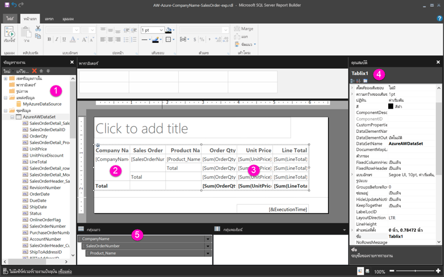

1. ในแผงข้อมูลรายงาน คุณจะเห็นแหล่งข้อมูล Azure ที่ฝังตัวและชุดข้อมูลที่ฝังตัวที่อ้างอิงตามแหล่งข้อมูลนั้น ซึ่งคุณสร้างทั้งสองสิ่งนี้ไว้In the Report Data pane, you see the embedded Azure data source and the embedded dataset based on it, both of which you created. 

2. พื้นผิวออกแบบมีความกว้างประมาณ 6 นิ้วThe design surface is about 6 inches wide. ที่พื้นผิวออกแบบ คุณจะเห็นเมทริกซ์แสดงหัวคอลัมน์และค่าพื้นที่ที่สำรองไว้On the design surface, you see the matrix, displaying column headings and placeholder values. โดยเมทริกซ์มีคอลัมน์หกอันและดูเหมือนจะมีความสูงแค่ห้าแถวThe matrix has six columns and appears to be only five rows tall. 

3. ปริมาณการสั่งซื้อ ราคาต่อหน่วย และผลรวมต่อบรรทัด ทั้งหมดที่กล่าวมานี้แสดงเป็นยอดรวม และมีผลรวมย่อยอยู่ในแต่ละกลุ่มแถวOrder Qty, Unit Price, and Line Total are all sums, and each row group has a subtotal. 

    คุณจะยังไม่เห็นค่าข้อมูลจริงYou still don't see actual data values. เมื่อต้องการดูค่าข้อมูลจริง ให้คุณเรียกใช้รายงานYou need to run the report to see them.

4. ในแผงคุณสมบัติ เมทริกซ์ที่เลือกไว้นั้นเรียกว่า Tablix1In the Properties pane, the selected matrix is called Tablix1. *Tablix* ในตัวสร้างรายงานคือขอบเขตข้อมูลที่จะแสดงข้อมูลในแถวและคอลัมน์A *tablix* in Report Builder is a data region that displays data in rows and columns. ซึ่งอาจเป็นได้ทั้งตารางหรือเมทริกซ์It can be either a table or a matrix.

5. ในแผงจัดกลุ่ม คุณจะเห็นกลุ่มสามแถวที่คุณสร้างไว้ในวิซาร์ด:In the Grouping pane, you see the three row groups you created in the wizard: 

    - CompanyNameCompanyName
    - ใบสั่งขายSales Order
    - ชื่อผลิตภัณฑ์Product Name

    เมทริกซ์นี้ไม่มีกลุ่มคอลัมน์ใดๆThis matrix doesn't have any column groups.

### เรียกใช้รายงาน:Run the report

คุณต้องเรียกใช้รายงานเพื่อดูค่าจริงTo see the actual values, you need to run the report.

1. เลือก **เรียกใช้** ในแถบเครื่องมือ **หน้าหลัก**Select **Run** in the **Home** toolbar.

   ในตอนนี้คุณดูค่าได้แล้วNow you see the values. เมทริกซ์มีแถวมากกว่าที่คุณเห็นได้ในมุมมองออกแบบ!The matrix has many more rows than you saw in Design view! โปรดทราบว่า ตัวสร้างรายงานบอกว่าเป็นหน้า **1** จาก **2?**Note that Report Builder says it's page **1** of **2?**. ตัวสร้างรายงานจะโหลดรายงานโดยเร็วที่สุด ดังนั้นระบบจะดึงข้อมูลได้เพียงพอสำหรับแค่สองหรือสามหน้าเท่านั้นReport Builder loads the report as quickly as possible, so it only retrieves enough data for a few pages at a time. เครื่องหมายปรัศนีบ่งชี้ว่า ตัวสร้างรายงานยังโหลดข้อมูลทั้งหมดไม่เสร็จThe question mark indicates that Report Builder hasn't loaded all the data yet.

   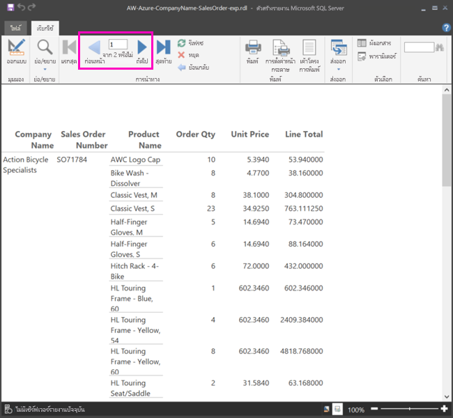

2. เลือก **เค้าโครงการพิมพ์**Select **Print Layout**. รายงานจะอยู่ในรูปแบบนี้เมื่อทำการพิมพ์The report will be in this format when you print it. ตอนนี้ตัวสร้างรายงานรู้แล้วว่ารายงานมีทั้งหมด 33 หน้า และได้เพิ่มสแตมป์วันที่และเวลาไว้ที่ส่วนท้ายแล้วโดยอัตโนมัติReport Builder now knows the report has 33 pages, and has automatically added a date and time stamp in the footer.

## จัดรูปแบบรายงานFormat the report

ในตอนนี้คุณก็มีรายงานพร้อมเมทริกซ์ที่ครอบคลุมทั้ง 33 หน้าแล้วNow you have a report with a matrix that wraps to 33 pages. มาเพิ่มฟีเจอร์อื่นๆ แล้วปรับปรุงหน้าตาของรายงานกันเถอะLet's add some other features and improve how it looks. คุณสามารถเรียกใช้รายงานได้หลังจากทำขั้นตอนครบทุกขั้นตอน หากคุณต้องการดูผลว่าเป็นเช่นไรYou can run the report after every step, if you want to see how it's coming along.

- ในแท็บ **เรียกใช้** ของริบบิ้น ให้คุณเลือก **การออกแบบ** เพื่อให้สามารถแก้ไขต่อได้On the **Run** tab of the Ribbon, select **Design** , so you can continue modifying it.  

### ตั้งความกว้างหน้าของหน้าSet page width

โดยทั่วไปแล้วจะมีการจัดรูปแบบรายงานแบบแบ่งหน้าไว้เพื่อการพิมพ์ และขนาดหน้าโดยปกติคือ 8 1/2 x 11 นิ้วTypically a paginated report is formatted for printing, and a typical page is 8 1/2 X 11 inches. 

1. ลากไม้บรรทัดเพื่อปรับให้พื้นผิวออกแบบกว้าง 7 นิ้วDrag the ruler to make the design surface 7 inches wide. ระยะขอบเริ่มต้นของแต่ละด้านคือ 1 นิ้ว ดังนั้นขอบด้านข้างจึงต้องแคบกว่านี้The default margins are 1 inch on each side, so the side margins need to be narrower.

1. คลิกในพื้นที่สีเทารอบๆ พื้นผิวการออกแบบเพื่อแสดงคุณสมบัติ **รายงาน**Click in the gray area around the design surface to show the **Report** properties.

    ถ้าคุณไม่เห็นแผงคุณสมบัติ ให้คลิกที่แท็บ **มุมมอง** > **คุณสมบัติ**If you don’t see the Properties pane, click the **View** tab > **Properties**.

2. ขยาย **ระยะขอบ** และเปลี่ยนขอบ **ซ้าย** และ **ขวา** จาก 1 นิ้วเป็น 0.75 นิ้วExpand **Margins** and change **Left** and **Right** from 1in to 0.75in. 

    
  
### เพิ่มชื่อรายงานAdd a report title  

1. เลือกคำว่า **คลิกเพื่อเพิ่มชื่อเรื่อง** ที่ด้านบนของหน้า แล้วพิมพ์ว่า **ยอดขายแยกตามบริษัท**Select the words **Click to add title** at the top of the page, then type **Sales by Company**.  

2. เลือกข้อความชื่อเรื่อง และเปลี่ยน **สี** เป็น **สีฟ้า** โดยเลือกที่แผงคุณสมบัติด้านล่าง **ตัวอักษร**Select the title text, and in the Properties pane under **Font** , change **Color** to **Blue**.
  
### เพิ่มหมายเลขหน้าAdd a page number

คุณจะสังเกตเห็นว่ารายงานมีสแตมป์วันที่และเวลาอยู่ที่ส่วนท้ายหน้าYou noticed the report has a date and time stamp in the footer. คุณสามารถเพิ่มหมายเลขหน้าที่ส่วนท้ายหน้าได้เช่นกันYou can add a page number to the footer, too.

1. ที่ด้านล่างของพื้นผิวการออกแบบ คุณจะเห็น [&ExecutionTime] ที่ด้านขวาในส่วนท้ายหน้าAt the bottom of the design surface, you see [&ExecutionTime] on the right in the footer. 

2. ในแผงข้อมูลรายงาน ให้คุณขยายโฟลเดอร์เขตข้อมูลภายในIn the Report Data pane, expand the Built-in Fields folder. ลาก **หมายเลขหน้า** ไปยังด้านซ้ายของส่วนท้ายหน้า โดยให้อยู่ที่ความสูงเดียวกันกับ [&ExecutionTime]Drag **Page Number** to the left side of the footer, at the same height as [&ExecutionTime].

3. ลากด้านขวาของกล่อง [&PageNumber] เพื่อทำให้เป็นสี่เหลี่ยมDrag the right side of the [&PageNumber] box to make it square.

4. ที่แท็บ **แทรก** ให้คุณเลือก **กล่องข้อความ**On the **Insert** tab, select **Text Box**.

5. คลิกที่ด้านขวาของ [&PageNumber] แล้วพิมพ์ "ของ" จากนั้นทำให้กล่องข้อความเป็นสี่เหลี่ยมClick to the right of [&PageNumber], type "of", then make the text box square.

6. ลาก **หน้าทั้งหมดโดยรวม** ไปที่ส่วนท้ายหน้า ที่ด้านขวาของ "ของ" จากนั้นลากด้านขวานั้นให้เป็นสี่เหลี่ยมเช่นกันDrag **Overall Total Pages** to the footer, to the right of "of", then drag its right side to make it square, too.

    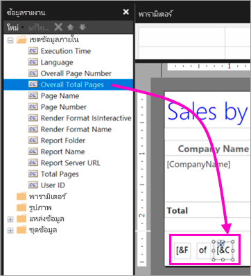

### ทำให้ตารางกว้างขึ้นMake the table wider  

ในตอนนี้คุณสามารถสร้างเมทริกซ์ได้กว้างพอที่จะเติมเต็มความกว้างของหน้า และทำให้คอลัมน์ข้อความกว้างขึ้นเพื่อให้ไม่ต้องเลื่อนดูชื่อมากนักNow you can make the matrix wide enough to fill the width of the page, and make the text columns wider so the names don't scroll as much. 
 
1. เลือกเมทริกซ์ จากนั้นเลือกคอลัมน์ชื่อบริษัทSelect the matrix, then select the Company Name column.

3. เลื่อนเมาส์ไปเหนือแถบสีเทาที่ด้านบนของเมทริกซ์ที่ขอบข้างขวาของคอลัมน์ "ชื่อบริษัท"Hover over the gray bar at the top of the matrix at the right edge of the Company Name column. ลากไปทางขวา จนคอลัมน์ได้ขนาด 1 3/8 นิ้วDrag to the right, until the column ends at 1 3/8 inches. 

    

4. ลากขอบข้างขวาของ "ชื่อผลิตภัณฑ์" จนกระทั่งคอลัมน์ได้ขนาด 3 3/4 นิ้วDrag the right edge of Product name until the column ends at 3 3/4 inches.   

ตอนนี้เมทริกซ์ก็กว้างเกือบเท่ากับพื้นที่การพิมพ์แล้วNow the matrix is almost as wide as the print area.

### จัดรูปแบบสกุลเงินFormat the currency

ถ้าคุณสังเกตเห็นว่าขณะที่เรียกใช้รายงานนั้น จำนวนเงินดอลลาร์ยังไม่ได้จัดรูปแบบIf you noticed when you ran the report, the dollar amounts aren't formatted as currency yet.

1. เลือกเซลล์ [Sum(OrderQty)] ที่มุมซ้ายบน จากนั้นกดปุ่ม Shift ค้างไว้ แล้วเลือกเซลล์ [Sum(LineTotal)] ที่มุมขวาล่างSelect the upper-left [Sum(OrderQty)] cell, hold down the Shift key, and select lower-right [Sum(LineTotal)] cell.

    

2. ที่แท็บ **หน้าหลัก** ให้คุณเลือกสัญลักษณ์สกุลเงินดอลลาร์ ( **$** ) จากนั้นเลือกลูกศรข้างๆ **สไตล์พื้นที่ที่สำรองไว้** > **ค่าตัวอย่าง**On the **Home** tab, select the dollar sign ( **$** ) currency symbol, then select the arrow next to **Placeholder styles** > **Sample Values**.
 
    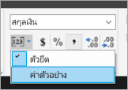

    ในตอนนี้คุณจะเห็นว่าค่านั้นจัดรูปแบบเป็นสกุลเงินแล้วNow you can see the values are formatted as currency.

    

### เพิ่มหัวคอลัมน์ในแต่ละหน้าAdd column headers on each page

การปรับปรุงการจัดรูปแบบอีกอย่างหนึ่งก่อนการเผยแพร่รายงานไปยังบริการของ Power BI: การทำให้หัวคอลัมน์แสดงในแต่ละหน้าของรายงานOne more formatting improvement before publishing the report to the Power BI service: making the column headers show up on each page in the report.

1. ที่ตรงขวาสุดของแถบด้านบนในแผง "การจัดกลุ่ม" ให้คุณเลือกลูกศรดรอปดาวน์ > **โหมดขั้นสูง**In the far-right end of the top bar in the Grouping pane, select the drop-down arrow > **Advanced Mode**.

    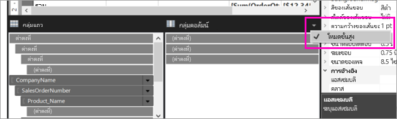

2. เลือกแถบ **สแตติก** ด้านบนใน **กลุ่มแถว**Select the top **Static** bar in the **Row Groups**. คุณจะเห็นว่ามีการเลือกเซลล์ชื่อบริษัทในเมทริกซ์แล้วYou see that the Company Name cell in the matrix is selected.

   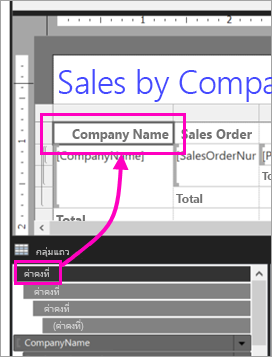

3. ในแผง **คุณสมบัติ** คุณจะเห็นคุณสมบัติสำหรับ **สมาชิก Tablix**In the **Properties** pane, you're looking at the properties for **Tablix Member**. ตั้งค่า **KeepWithGroup** เป็น **After** และตั้งค่า **RepeatOnNewPage** เป็น **True**Set **KeepWithGroup** to **After** and **RepeatOnNewPage** to **True**.

    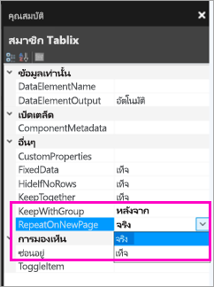

    ได้เวลาเรียกใช้รายงานแล้วดูว่าตอนนี้หน้าตาเป็นอย่างไรIt's time to run the report and see how it looks now.

5. เลือก **เรียกใช้** ที่แท็บ **หน้าหลัก**Select **Run** on the **Home** tab.

6. เลือก **เค้าโครงการพิมพ์** ถ้ายังไม่ได้เลือกSelect **Print Layout** , if it's not already selected. รายงานมีอยู่ด้วยกัน 29 หน้าNow the report has 29 pages. เลื่อนผ่านสักสองสามหน้าScroll through a few pages. คุณจะเห็นว่าสกุลเงินจัดรูปแบบแล้ว ทุกหน้ามีหัวคอลัมน์ และรายงานมีส่วนท้ายหน้าที่ระบุหมายเลขหน้าและสแตมป์วันที่และเวลาทุกๆ หน้าYou see the currency is formatted, the columns have headings on every page, and the report has a footer with page numbers and date and time stamp on every page.
 
    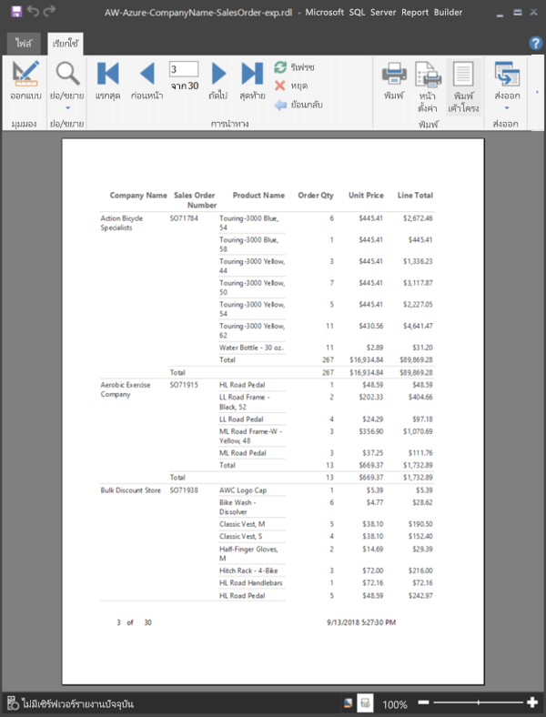

7. บันทึกรายงานลงคอมพิวเตอร์Save the report to your computer.
 
##  อัปโหลดรายงานเข้าส่วนบริการUpload the report to the service

ในตอนนี้คุณได้สร้างรายงานแบบแบ่งหน้าแล้ว ได้เวลาอัปโหลดเข้าบริการของ Power BINow that you've created this paginated report, it's time to upload it to the Power BI service.

1. ในบริการ Power BI (`https://app.powerbi.com`) ในหน้าต่างนำทาง ให้เลือก **พื้นที่ทำงาน** > **สร้างพื้นที่ทำงาน**In the Power BI service (`https://app.powerbi.com`) in the nav pane, select **Workspaces** > **Create workspace**.

2. ตั้งชื่อพื้นที่ทำงานของคุณว่า **Azure AW** หรือชื่อเฉพาะอย่างอื่นName your workspace **Azure AW** , or other unique name. ตอนนี้มีเพียงคุณที่เป็นสมาชิกYou're the only member for now. 

3. เลือกลูกศรที่อยู่ถัดจาก **ขั้นสูง** แล้วเปิด **ความจุเฉพาะ**Select the arrow next to **Advanced** and turn on **Dedicated capacity**. 

    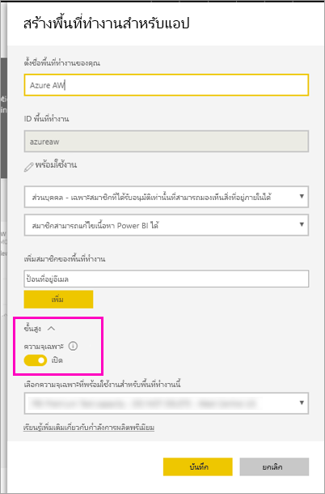

    ถ้าไม่สามารถเปิดได้ คุณต้องขอให้ผู้ดูแลระบบ Power BI ให้อนุญาตคุณในการเพิ่มพื้นที่ทำงานเข้าความจุพรีเมียมเฉพาะIf you can't turn it on, you need to ask your Power BI admin to give you permission to add the workspace to the dedicated Premium capacity.

4. เลือก **ความจุเฉพาะที่พร้อมใช้งานสำหรับพื้นที่ทำงานนี้** หากจำเป็นให้ > **บันทึก**Choose an **available dedicated capacity for this workspace** , if necessary > **Save**.
    
    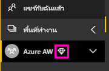

    ถ้าพื้นที่ทำงานไม่ได้อยู่ในความจุพรีเมียม เมื่อคุณลองอัปโหลดรายงาน คุณจะเห็นข้อความ "ไม่สามารถอัปโหลดรายงานแบบแบ่งหน้าได้"If the workspace isn't in a Premium capacity, when you try to upload your report you see the message, "Unable to upload paginated report." โปรดติดต่อผู้ดูแลระบบ Power BI เพื่อย้ายพื้นที่ทำงานนั้นContact your Power BI administrator to move the workspace.

1. ในพื้นที่ทำงานใหม่ของคุณ ให้เลือก **รับข้อมูล**In your new workspace, select **Get Data**.

2. ในกล่อง **ไฟล์** > **รับ**In the **Files** box > **Get**.

3. เลือก **ไฟล์ภายในเครื่อง** ไปยังตำแหน่งที่คุณบันทึกไฟล์ไว้ > **เปิด**Select **Local File** , navigate to where you saved the file > **Open**.

   Power BI จะนำเข้าไฟล์ของคุณ และคุณจะเห็นไฟล์นั้นอยู่ใต้ **รายงาน** ในหน้ารายการแอปPower BI imports your file, and you see it under **Reports** on the App list page.

    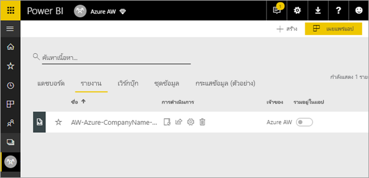

4. เลือกรายงานเพื่อดูSelect the report to view it.

5. ถ้ามีข้อผิดพลาด คุณอาจต้องป้อนข้อมูลประจำตัวใหม่If you get an error, you may need to reenter your credentials. เลือกไอคอน **จัดการ**Select the **Manage** icon.

    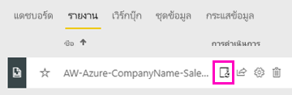

6. เลือก **แก้ไขข้อมูลประจำตัว** แล้วป้อนข้อมูลประจำตัวที่ใช้ใน Azure เมื่อทำการสร้างฐานข้อมูล AzureSelect **Edit credentials** and enter the credentials you used in Azure when you created the Azure database.

    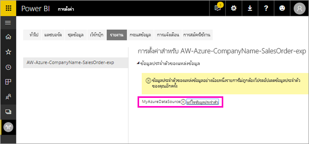

7. ทีนี้คุณสามารถดูรายงานแบบแบ่งหน้าในบริการของ Power BI ได้แล้วNow you can view your paginated report in the Power BI service.

    

## ขั้นตอนถัดไปNext steps

[รายงานแบบแบ่งหน้าใน Power BI Premium คืออะไรWhat are paginated reports in Power BI Premium?](paginated-reports-report-builder-power-bi.md)