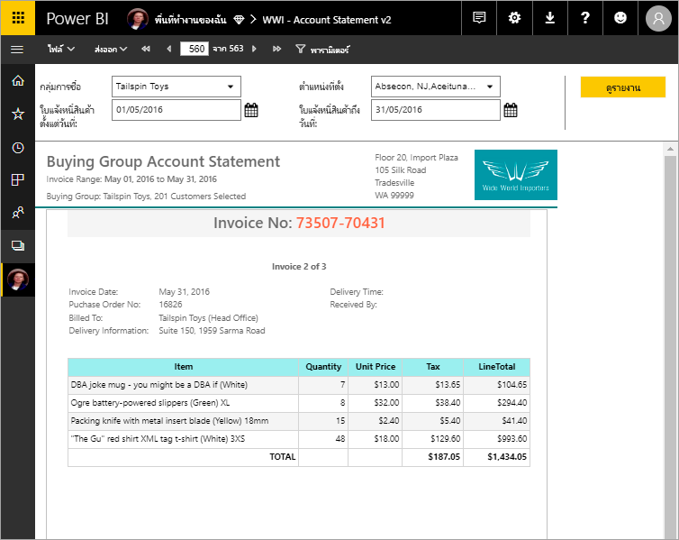

# รายงานแบบแบ่งหน้าใน Power BI Premium คืออะไรWhat are paginated reports in Power BI Premium?

[!INCLUDE [applies-to](../includes/applies-to.md)] [!INCLUDE [yes-service](../includes/yes-service.md)] [!INCLUDE [yes-paginated](../includes/yes-paginated.md)] [!INCLUDE [yes-premium](../includes/yes-premium.md)] [!INCLUDE [no-desktop](../includes/no-desktop.md)][!INCLUDE [applies-to](../includes/applies-to.md)] [!INCLUDE [yes-service](../includes/yes-service.md)] [!INCLUDE [yes-paginated](../includes/yes-paginated.md)] [!INCLUDE [yes-premium](../includes/yes-premium.md)] [!INCLUDE [no-desktop](../includes/no-desktop.md)] 

*รายงานแบบแบ่งหน้า* คือรายงานที่ออกแบบมาเพื่อการพิมพ์หรือแชร์*Paginated reports* are designed to be printed or shared. ซึ่งเรียกว่า *แบบแบ่งหน้า* เนื่องจากมีการจัดรูปแบบให้พอดีกับหน้าThey're called *paginated* because they're formatted to fit well on a page. โดยกำหนดให้แสดงข้อมูลทั้งหมดในตาราง แม้ว่าตารางนั้นต้องใช้พื้นที่หลายหน้าThey display all the data in a table, even if the table spans multiple pages. นอกจากนี้ยังก็เรียกว่า *พิกเซลสมบูรณ์แบบ* เพราะคุณสามารถควบคุมเค้าโครงหน้าของรายงานได้เต็มที่They're also called *pixel perfect* because you can control their report page layout exactly. ตัวสร้างรายงานใน Power BI เป็นเครื่องมือแบบสแตนด์อโลนเพื่อใช้เขียนรายงานที่มีการแบ่งหน้าสำหรับบริการ Power BIPower BI Report Builder is the standalone tool for authoring paginated reports for the Power BI service. 

ต่อไปนี่คือลิงก์ด่วนบางส่วนหากคุณพร้อมที่จะเริ่มต้นใช้งาน:Here are some quick links if you're ready to get started:

- [ติดตั้งตัวสร้างรายงาน Power BI จากศูนย์ดาวน์โหลด MicrosoftInstall Power BI Report Builder from the Microsoft Download Center](https://aka.ms/pbireportbuilder)
- [บทช่วยสอน: สร้างรายงานที่มีการแบ่งหน้าTutorial: Create a paginated report](paginated-reports-quickstart-aw.md)
- [ตัวอย่างรายงานที่มีการแบ่งหน้าของ Power BISample Power BI paginated reports](paginated-reports-samples.md)
- กำลังค้นหาข้อมูลเกี่ยวกับตัวสร้างรายงานสำหรับ Power BI Report Server หรือ SQL Server Reporting Services หรือไม่Looking for information about Report Builder for Power BI Report Server or SQL Server Reporting Services? โปรดดู[ติดตั้งตัวสร้างรายงาน - Power BI Report Server](../report-server/install-report-builder.md) แทนSee [Install Report Builder - Power BI Report Server](../report-server/install-report-builder.md) instead.

รายงานแบบแบ่งหน้ามักจะมีหลายหน้าPaginated reports often have many pages. ตัวอย่าง รายงานฉบับนี้มี 563 หน้าFor example, this report has 563 pages. แต่ละหน้ามีรูปแบบเหมือนกัน โดยใช้หนึ่งหน้าต่อใบแจ้งหนี้หนึ่งใบ และมีส่วนหัวกับส่วนท้ายหน้าซ้ำกันEach page is laid out exactly, with one page per invoice, and repeating headers and footers.

คุณสามารถดูตัวอย่างรายงานของคุณในตัวสร้างรายงาน แล้วเผยแพร่ไปยังบริการ Power BI หรือ app.powerbi.com ได้You can preview your report in Report Builder, then publish it to the Power BI service, app.powerbi.com. คุณต้องมีสิทธิ์การใช้งาน Power BI Pro ในการที่จะเผยแพร่รายงานไปยังบริการYou need a Power BI Pro license to publish a report to the service. คุณสามารถเผยแพร่และแบ่งปันรายงานที่มีการแบ่งหน้าได้ในพื้นที่ทำงานของฉัน หรือในพื้นที่ทำงาน ตราบเท่าที่พื้นที่ทำงานอยู่ในความจุ Power BI PremiumYou can publish and share paginated reports in your My Workspace or in workspaces, as long as the workspace is in a Power BI Premium capacity. นอกจากนี้ ผู้ดูแลระบบ Power BI ต้องเปิดใช้งานรายงานที่มีการแบ่งหน้าใน[ส่วนความจุแบบพรีเมียม](../admin/service-admin-premium-workloads.md#paginated-reports)ของพอร์ทัลผู้ดูแลของ Power BIAlso, a Power BI admin needs to enable paginated reports in the [Premium capacities section](../admin/service-admin-premium-workloads.md#paginated-reports) of the Power BI admin portal. 

## เปรียบเทียบรายงาน Power BI และรายงานที่มีการแบ่งหน้าCompare Power BI reports and paginated reports

ประโยชน์หลักของรายงานที่มีการแบ่งหน้าคือความสามารถในการพิมพ์ข้อมูลทั้งหมดในตาราง ไม่ว่าจะใช้เวลานานเท่าใดA major advantage of paginated reports is their ability to print all the data in a table, no matter how long. รูปภาพที่คุณวางตารางในรายงาน Power BIPicture that you place a table in a Power BI report. คุณจะเห็นบางแถวในตารางบนหน้า และคุณมีแถบเลื่อนเพื่อดูส่วนที่เหลือYou see some of its rows in the table on the page, and you have a scroll bar to see the rest. ถ้าคุณพิมพ์หน้านั้นหรือส่งออกไปยัง PDF มีเพียงแถวเดียวเท่านั้นที่พิมพ์คือแถวที่คุณเห็นในหน้าIf you print that page, or export it to PDF, the only rows that print are the ones you saw on the page. 

ตอนนี้สมมุติว่าคุณวางตารางเดียวกันในรายงานที่มีการแบ่งหน้าNow say you place the same table in a paginated report. เมื่อคุณพิมพ์หรือส่งออกไปยัง PDF รายงานที่มีการแบ่งหน้าจะมีจำนวนหน้ามากเท่าที่จำเป็นสำหรับการพิมพ์ทุกแถวในตารางนั้นWhen you print it or export it to PDF, the paginated report has as many pages as necessary to print every row in that table. 

ในวิดีโอต่อไปนี้ Microsoft Most Valued Professional - Data Platform Peter Myers, และ Principal Program Manager Chris Finlan สาธิตการพิมพ์ตารางที่คล้ายกันในรูปแบบรายงานสองรูปแบบIn the following video, Microsoft Most Valued Professional - Data Platform Peter Myers, and Principal Program Manager Chris Finlan demonstrate printing a similar table in the two report formats. 

<iframe width="560" height="315" src="https://www.youtube.com/embed/jXTiYJKw1Rs?list=PL1N57mwBHtN1icIhpjQOaRL8r9G-wytpT" frameborder="0" allowfullscreen></iframe>

วิดีโอนี้เป็นส่วนหนึ่งของหลักสูตรที่ใช้วิดีโอแบบแปดโมดูล [รายงานที่มีการแบ่งหน้าของ Power BI ในหนึ่งวัน](../learning-catalog/paginated-reports-online-course.md)This video is part of an eight-module video-based course, [Power BI Paginated Reports in a Day](../learning-catalog/paginated-reports-online-course.md). หลักสูตรนี้มีจุดประสงค์เพื่อช่วยสนับสนุนคุณในฐานะผู้เขียนรายงานให้มีความรู้ด้านเทคนิคที่จำเป็นในการสร้าง เผยแพร่ และแจกจ่ายรายงานที่มีการแบ่งหน้าของ Power BIThe course is designed to empower you as a report author with the technical knowledge required to create, publish, and distribute Power BI paginated reports.

## สร้างรายงานในตัวสร้างรายงานของ Power BICreate reports in Power BI Report Builder

รายงานที่มีการแบ่งหน้าจะมีเครื่องมือการออกแบบเอง ซึ่งก็คือ ตัวสร้างรายงาน Power BIPaginated reports have their own design tool, Power BI Report Builder. เป็นเครื่องมือใหม่ที่แชร์พื้นฐานเดียวกันกับเครื่องมือที่คุณเคยใช้ในการสร้างรายงานที่มีการแบ่งหน้าสำหรับเซิร์ฟเวอร์รายงาน Power BI หรือ SQL Server Reporting Services (SSRS)It's a new tool that shares the same foundation as the tools you'd previously used to create paginated reports for Power BI Report Server or SQL Server Reporting Services (SSRS). ในทางที่จริงแล้ว รายงานแบบแบ่งหน้าที่คุณสร้างสำหรับ SSRS 2016 และ 2017 หรือสำหรับ เซิร์ฟเวอร์รายงาน Power BI ในองค์กร สามารถเข้ากันได้กับบริการของ Power BIIn fact, paginated reports that you create for SSRS 2016 and 2017 or for Power BI Report Server on-premises, are compatible with the Power BI service. บริการของ Power BI จะรักษาความเข้ากันได้ย้อนหลังไว้ เพื่อให้คุณสามารถใช้รายงานต่อในอนาคตได้ และสามารถอัปเกรดรายงานแบบแบ่งหน้าที่เป็นเวอร์ชันก่อนหน้าได้The Power BI service maintains backwards compatibility so you can move your reports forward, and you can upgrade any previous-version paginated reports. คุณลักษณะของรายงานทั้งหมดไม่สามารถใช้งานได้เมื่อเปิดใช้งานNot all report features are available at launch. โปรดดู[ข้อจำกัดและข้อควรพิจารณา](#limitations-and-considerations)ในบทความนี้สำหรับรายละเอียดSee [Limitations and considerations](#limitations-and-considerations) in this article for details.
     
## รายงานจากแหล่งข้อมูลหลายแหล่งReport from a variety of data sources

รายงานแบบแบ่งหน้าหนึ่งรายงานอาจมีแหล่งข้อมูลที่ต่างกันได้จำนวนหนึ่งA single paginated report can have a number of different data sources. จะไม่มีแบบจำลองข้อมูลที่จำเป็น ต่างกับรายงานของ Power BIIt doesn't have an underlying data model, unlike Power BI reports. สำหรับการเผยแพร่รายงานแบบแบ่งหน้าในบริการของ Power BI ขั้นต้น คุณอาจสร้างแหล่งข้อมูลแบบฝังและชุดข้อมูลไว้ในรายงานได้เลยFor the initial release of paginated reports in the Power BI service, you create embedded data sources and datasets in the report itself. ในตอนนี้ คุณไม่สามารถใช้แหล่งข้อมูลที่ใช้ร่วมกันหรือชุดข้อมูลที่ใช้ร่วมกันได้For now, you can't use shared data sources or shared datasets. คุณสร้างรายงานในตัวสร้างรายงานได้จากคอมพิวเตอร์ของคุณเองYou create reports in Report Builder on your local computer. ถ้ารายงานเชื่อมต่อกับข้อมูลในองค์กร หลังจากที่คุณอัปโหลดรายงานไปยังบริการของ Power BI แล้ว คุณต้องสร้างเกตเวย์และเปลี่ยนเส้นทางการเชื่อมต่อข้อมูลIf a report connects to on-premises data, after you upload the report to the Power BI service, you need to create a gateway and redirect the data connection. ต่อไปนี้คือแหล่งข้อมูลที่คุณสามารถเชื่อมต่อในขณะนี้:Here are the data sources you can connect to at this time:

- ฐานข้อมูล Azure SQL และคลังข้ัอมูล (ผ่าน Basic และ oAuth)Azure SQL Database and Data Warehouse (via Basic and oAuth)
- Azure Analysis Services (ผ่าน SSO)Azure Analysis Services (via SSO)
- SQL Server ผ่านเกตเวย์SQL Server via a gateway
- SQL Server Analysis Services ผ่านเกตเวย์SQL Server Analysis Services via a gateway
- ชุดข้อมูล Power BIPower BI Datasets
- OracleOracle
- TeradataTeradata

## ออกแบบรายงานของคุณDesign your report  

### สร้างรายงานแบบแบ่งหน้าด้วยเมทริกซ์ แผนภูมิ และเค้าโครงแบบอิสระCreate paginated reports with matrix, chart, and free-form layouts

ตารางรายงานการทำงานที่มีประสิทธิภาพสำหรับข้อมูลที่อ้างอิงตามคอลัมน์Table reports work well for column-based data. รายงานเมทริกซ์ เช่นข้ามแท็บหรือรายงาน PivotTable เหมาะสำหรับการทำสรุปข้อมูลMatrix reports, like cross-tab or PivotTable reports, are good for summarized data. แผนภูมิรายงานนำเสนอข้อมูลในรูปแบบกราฟิก และแบบอิสระ *รายการ* ของรายงานสามารถนำเสนอเกือบทุกอย่าง เช่น ใบแจ้งหนี้Chart reports present data in a graphical format, and free-form *list* reports can present almost anything else, such as invoices. 
  
คุณสามารถเริ่มได้ที่วิซาร์ดของตัวสร้างรายงานYou can start with one of the Report Builder wizards. วิชาร์ดตาราง เมทริกซ์และแผนภูมิจะช่วยให้คุณสร้างการเชื่อมต่อกับแหล่งข้อมูลฝังและชุดข้อมูลฝังThe Table, Matrix, and Chart wizards walk you through creating the embedded data source connection and embedded dataset. จากนั้นให้คุณลากเขตข้อมูลและวางลงเพื่อสร้างคิวรีชุดข้อมูล เลือกเค้าโครงและสไตล์ แล้วปรับแต่งรายงานของคุณThen you drag and drop fields to create a dataset query, select a layout and style, and customize your report.  
  
ด้วยการใช้วิซาร์ดแมป คุณสามารถสร้างรายงานที่แสดงข้อมูลรวมกับพื้นหลังทางภูมิศาสตร์หรือเรขาคณิตได้With the Map wizard, you create reports that display aggregated data against a geographic or geometric background. ข้อมูลแผนที่อาจเป็นข้อมูลเชิงพื้นที่ที่ได้จากคิวรี Transact-SQL หรือจาก Environmental Systems Research Institute, Inc. แฟ้มเชปไฟล์ (ESRI)Map data can be spatial data from a Transact-SQL query or an Environmental Systems Research Institute, Inc. (ESRI) shapefile. คุณยังสามารถเพิ่มพื้นหลังไทล์แผนที่ของ Microsoft Bing ได้You can also add a Microsoft Bing map tile background.  

### เพิ่มส่วนต่างๆ ให้รายงานAdd more to your report

ปรับเปลี่ยนข้อมูลโดยการกรอง จัดกลุ่มและเรียงลำดับข้อมูล หรือโดยการเพิ่มสูตรหรือนิพจน์Modify your data by filtering, grouping, and sorting data, or by adding formulas or expressions. เพิ่มแผนภูมิ ตัววัด เส้นแบบประกายไฟ และตัวบ่งชี้ เพื่อสรุปข้อมูลในรูปแบบการแสดงผลด้วยภาพAdd charts, gauges, sparklines, and indicators to summarize data in a visual format.  ใช้พารามิเตอร์และตัวกรองเพื่อกรองข้อมูลสำหรับมุมมองแบบกำหนดเองUse parameters and filters to filter data for customized views. รูปภาพฝังหรือรูปภาพอ้างอิงและทรัพยากรอื่นๆ รวมทั้งเนื้อหาจากภายนอกEmbed or reference images and other resources, including external content.  

ทุกอย่างที่อยู่ในรายงานแบบแบ่งหน้า ตั้งแต่ตัวรายงานไปจนถึงกล่องข้อความ รูปภาพ ตาราง และแผนภูมิ จะมีอาร์เรย์ของคุณสมบัติที่คุณสามารถตั้งค่าได้เพื่อให้รายงานมีหน้าตาอย่างที่คุณต้องการEverything in a paginated report, from the report itself to every text box, image, table, and chart, has an array of properties you can set to make the report look exactly as you want it.

## การสร้างข้อกำหนดของรายงานCreating a report definition

เมื่อคุณออกแบบรายงานแบบแบ่งหน้า คือการที่คุณสร้าง *ข้อกำหนดของรายงาน*When you design a paginated report, you're really creating a *report definition*. ซึ่งไม่ได้มีข้อมูลIt doesn't contain the data. แต่จะระบุว่าต้องรับเอาข้อมูลจากที่ใด เอาข้อมูลใด และแสดงข้อมูลอย่างไรIt specifies where to get the data, which data to get, and how to display the data. เมื่อคุณเรียกดูรายงาน ตัวประมวลผลรายงานจะใช้ข้อกำหนดของรายงานที่คุณได้ระบุไว้ ดึงเอาข้อมูลนั้นมา แล้วรวมเข้ากับเค้าโครงรายงานเพื่อสร้างรายงานขึ้นWhen you run the report, the report processor takes the report definition you've specified, retrieves the data, and combines it with the report layout to generate the report. คุณสามารถอัปโหลดข้อกำหนดของรายงานไปยังบริการของ Power BI ได้ `https://app.powerbi.com` อาจจะเป็น "พื้นที่ทำงานของฉัน" หรือเป็นพื้นที่ทำงานที่แบ่งปันกับเพื่อนร่วมงานYou upload the report definition to the Power BI service, `https://app.powerbi.com`, either to your My Workspace or to a workspace shared with your colleagues. ถ้าแหล่งข้อมูลของรายงานนั้นอยู่ในองค์กร หลังจากที่คุณอัปโหลดรายงาน ให้คุณเปลี่ยนเส้นทางการเชื่อมต่อแหล่งข้อมูลให้ผ่านเกตเวย์If the report data source is on premises, after you upload the report, you redirect the data source connection to go through a gateway. 

## ดูรายงายแบบแบ่งหน้าของคุณView your paginated report
คุณสามารถเรียกดูรายงานแบบแบ่งหน้าได้ในบริการของ Power BI ในเบราว์เซอร์ และในแอปพลิเคชันมือถือ Power BI ได้อีกด้วยYou view your paginated report in the Power BI service in a browser, and also in the Power BI mobile apps. ในบริการของ Power BI คุณสามารถส่งออกรายงานได้หลากหลายรูปแบบ เช่น HTML, MHTML, PDF, XML, CSV, TIFF, Word และ ExcelFrom the Power BI service, you can export the report to a number of formats, such as HTML, MHTML, PDF, XML, CSV, TIFF, Word, and Excel. และคุณยังแบ่งปันไปให้ผู้อื่นได้ด้วยYou can also share it with others.  

## สร้างการสมัครใช้งานกับรายงานของคุณCreate a subscription to your report

ขณะนี้คุณสามารถตั้งค่าการสมัครใช้งานอีเมลสำหรับตัวคุณเองและผู้อื่นสำหรับรายงานที่มีการแบ่งหน้าในบริการของ Power BIYou can now set up email subscriptions for yourself and others for paginated reports in the Power BI service. โดยทั่วไป กระบวนการจะเหมือนกับการสมัครใช้งานรายงานและแดชบอร์ดในบริการของ Power BIIn general, the process is the same as subscribing to reports and dashboards in the Power BI service. ในการตั้งค่าการสมัครใช้งาน คุณเลือกจำนวนครั้งที่คุณต้องการรับอีเมล: รายวัน รายสัปดาห์ หรือรายชั่วโมงIn setting up subscriptions, you choose how often you want to receive the emails: daily, weekly, or hourly. การสมัครใช้งานประกอบด้วยเอกสารแนบเป็น PDF ของผลลัพธ์รายงานทั้งหมดThe subscription contains a PDF attachment of the entire report output.

สำหรับรายละเอียด โปรดดูบทความ [สมัครใช้งานรายงานที่มีการแบ่งหน้าสำหรับตัวคุณเองและผู้อื่นในบริการของ Power BI](../consumer/paginated-reports-subscriptions.md)For details, see the article [Subscribe yourself and others to paginated reports in the Power BI service](../consumer/paginated-reports-subscriptions.md). 

## ข้อจำกัดและข้อควรพิจารณาLimitations and considerations

ต่อไปนี้คือฟีเจอร์อื่นๆ ที่ไม่ได้รับการรองรับในการเผยแพร่ขั้นต้น:Here are some other features that aren't supported in the initial release:

- การปักหมุดหน้ารายงานหรือวิชวลไปยังแดชบอร์ด Power BIPinning report pages or visuals to Power BI dashboards. คุณยังสามารถปักหมุดการแสดงภาพไปยังแดชบอร์ด Power BI จากรายงานที่มีแบ่งหน้าภายในองค์กรบนเซิร์ฟเวอร์รายงาน Power BI หรือเซิร์ฟเวอร์ Reporting ServicesYou can still pin visualizations to a Power BI dashboard from an on-premises paginated report on a Power BI Report Server or Reporting Services report server. ดูการ [ปักหมุดรายการ Reporting Services ไปยังแดชบอร์ด Power BI](/sql/reporting-services/pin-reporting-services-items-to-power-bi-dashboards) สำหรับรายละเอียดเพิ่มเติมSee [Pin Reporting Services items to Power BI dashboards](/sql/reporting-services/pin-reporting-services-items-to-power-bi-dashboards) for more information.
- แผนผังเอกสารDocument Maps.
- รายงานการเข้าถึงรายละเอียดDrillthrough reports.  พิจารณาใช้พารามิเตอร์ URL กับรายงานที่มีการแบ่งหน้าสำหรับสถานการณ์การเข้าถึงรายละเอียดConsider using URL parameters with paginated reports for drillthrough scenarios.
- แหล่งข้อมูลที่ใช้ร่วมกันและชุดข้อมูลที่ใช้ร่วมกันShared data sources and shared datasets.

 
## ขั้นตอนถัดไปNext steps

- [ติดตั้งตัวสร้างรายงาน Power BI จากศูนย์ดาวน์โหลด MicrosoftInstall Power BI Report Builder from the Microsoft Download Center](https://aka.ms/pbireportbuilder)
- [บทช่วยสอน: สร้างรายงานที่มีการแบ่งหน้าTutorial: Create a paginated report](paginated-reports-quickstart-aw.md)
- [หลักสูตรออนไลน์: รายงานที่มีการแบ่งหน้าของ Power BI ในวันเดียวOnline course: Power BI Paginated Reports in a Day](../learning-catalog/paginated-reports-online-course.md)
- [ตัวอย่างรายงานที่มีการแบ่งหน้าของ Power BISample Power BI paginated reports](paginated-reports-samples.md)
- [ใส่ข้อมูลในรายงานแบบแบ่งหน้าโดยตรงEnter data directly in a paginated report](paginated-reports-enter-data.md)
- [บทช่วยสอน: ฝังรายงานที่มีการแบ่งหน้าของ Power BI ในแอปพลิเคชันสำหรับลูกค้าของคุณTutorial: Embed Power BI paginated reports into an application for your customers](../developer/embedded/embed-paginated-reports-customers.md)