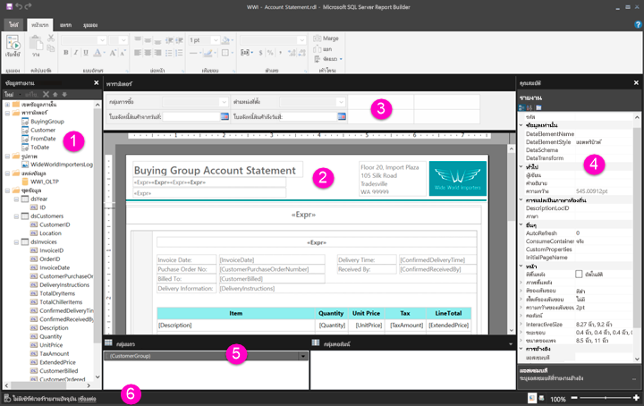

# สำรวจดูรอบๆ ในมุมมองการออกแบบรายงานสำหรับรายงานแบบแบ่งหน้าGetting around in Report Design View for paginated reports

[!INCLUDE [applies-to](../includes/applies-to.md)] [!INCLUDE [yes-service](../includes/yes-service.md)] [!INCLUDE [yes-paginated](../includes/yes-paginated.md)] [!INCLUDE [yes-premium](../includes/yes-premium.md)] [!INCLUDE [no-desktop](../includes/no-desktop.md)][!INCLUDE [applies-to](../includes/applies-to.md)] [!INCLUDE [yes-service](../includes/yes-service.md)] [!INCLUDE [yes-paginated](../includes/yes-paginated.md)] [!INCLUDE [yes-premium](../includes/yes-premium.md)] [!INCLUDE [no-desktop](../includes/no-desktop.md)] 

มุมมองการออกแบบรายงานในตัวสร้างรายงาน Power BI เป็นพื้นที่การออกแบบสำหรับสร้างรายงานแบบแบ่งหน้าที่สามารถเผยแพร่ไปยังบริการของ Power BI ได้Report Design View in Power BI Report Builder is the design space for creating paginated reports that you can publish to the Power BI service. พื้นที่การออกแบบนี้อยู่ที่ตรงกลางของตัวสร้างรายงาน พร้อมริบบิ้นและแผงต่างๆ ล้อมรอบThe design surface is at the center of Report Builder, with the ribbon and panes around it. พื้นที่การออกแบบคือที่ที่ให้คุณเพิ่มและจัดการหน่วยข้อมูลของรายงานได้The design surface is where you add and organize your report items. บทความนี้จะอธิบายถึงแผงต่างๆ ที่ใช้เพื่อเพิ่ม เลือกและจัดระเบียบทรัพยากรของรายงาน และเปลี่ยนคุณสมบัติหน่วยข้อมูลของรายงานThis article explains the panes you use to add, select, and organize your report resources, and change report item properties.  

1. [แผนข้อมูลรายงานReport data pane](#1-report-data-pane) 
2. [พื้นที่ออกแบบรายงานReport design surface](#2-report-design-surface)  
3. [แผงพารามิเตอร์Parameters pane](#3-parameters-pane) 
4. [แผงคุณสมบัติProperties pane](#4-properties-pane) 
5. [แผงการจัดกลุ่มGrouping pane](#5-grouping-pane) 
6. [แถบสถานะปัจจุบันของรายงานCurrent report status bar](#6-current-report-status-bar)  
  
## 1 แผงข้อมูลรายงาน1 Report Data pane  
 ที่แผงข้อมูลรายงาน คุณอาจกำหนดข้อมูลรายงานและทรัพยากรรายงานที่คุณต้องการสำหรับรายงานได้ก่อนที่จะออกแบบเค้าโครงรายงานFrom the Report Data pane, you define the report data and report resources that you need for a report before you design your report layout. ตัวอย่างเช่น คุณสามารถเพิ่มแหล่งข้อมูล ชุดข้อมูล เขตข้อมูลที่คำนวณไว้ พารามิเตอร์ของรายงาน และรูปภาพไปยังแผงข้อมูลรายงานได้For example, you can add data sources, datasets, calculated fields, report parameters, and images to the Report Data pane.  
  
 หลังจากที่คุณเพิ่มหน่วยข้อมูลไปยังแผงข้อมูลรายงานแล้ว ให้ลากเขตพื้นที่ไปยังหน่วยข้อมูลของรายงานที่อยู่ในพื้นที่การออกแบบเพื่อควบคุมการที่ข้อมูลปรากฏในรายงานAfter you add items to the Report Data pane, drag fields to report items on the design surface to control where data appears in the report.  
  
> [!TIP]  
>  ถ้าคุณลากเขตข้อมูลจากแผงข้อมูลรายงานไปยังพื้นที่ออกแบบรายงานโดยตรงแทนที่จะวางไว้ในเขตพื้นที่ข้อมูลเช่นตารางหรือแผนภูมิ เมื่อคุณเรียกใช้รายงาน คุณจะเห็นว่ามีเพียงค่าแรกจากข้อมูลเท่านั้นที่อยู่ในเขตข้อมูลนั้นIf you drag a field from the Report Data pane directly to the report design surface instead of placing it in a data region such as a table or chart, when you run the report, you will see only the first value from the data in that field.  
  
 คุณยังสามารถลากเขตข้อมูลที่มีอยู่ภายในจากแผงข้อมูลรายงานไปยังพื้นที่ออกแบบรายงานได้You can also drag built-in fields from the Report Data pane to the report design surface. เมื่อแสดง เขตข้อมูลเหล่านี้จะให้ข้อมูลเกี่ยวกับรายงาน เช่น ชื่อรายงาน จำนวนหน้าทั้งหมดในรายงาน และหมายเลขหน้าปัจจุบันWhen rendered, these fields provide information about the report, such as the report name, the total number of pages in the report, and the current page number.  
  
 จะมีการเพิ่มบางสิ่งไปยังแผงข้อมูลรายงานโดยอัตโนมัติเมื่อคุณเพิ่มบางอย่างในพื้นที่ออกแบบรายงานSome things are automatically added to the Report Data pane when you add something to the report design surface. ตัวอย่างเช่น หากคุณฝังรูปในรายงาน รูปนั้นจะถูกเพิ่มไปยังโฟลเดอร์รูปภาพในแผงข้อมูลรายงานFor example, if you embed an image in your report, it will be added to the Images folder in the Report Data pane.  
  
> [!NOTE]  
>  คุณสามารถใช้ปุ่ม **ใหม่** เพื่อเพิ่มหน่วยข้อมูลใหม่ไปยังแผงข้อมูลรายงานได้You can use the **New** button to add a new item to the Report Data pane. คุณสามารถเพิ่มชุดข้อมูลหลายชุดจากแหล่งข้อมูลเดียวกันหรือจากแหล่งข้อมูลอื่นไปยังรายงานได้You can add multiple datasets from the same data source or from other data sources to the report. เมื่อต้องการเพิ่มชุดข้อมูลใหม่จากแหล่งข้อมูลเดียวกัน ให้คุณคลิกขวาที่แหล่งข้อมูล > **เพิ่มชุดข้อมูล**To add a new dataset from the same data source, right-click a data source > **Add Dataset**.  
  
## 2 พื้นที่ออกแบบรายงาน2 Report design surface  
 พื้นที่ออกแบบรายงานของตัวสร้างรายงานคือพื้นที่ทำงานหลักสำหรับออกแบบรายงานของคุณThe Report Builder report design surface is the main work area for designing your reports. ในการวางหน่วยข้อมูลของรายงานเช่นเขตพื้นที่ข้อมูล รายงานย่อย กล่องข้อความ รูปสี่เหลี่ยมผืนผ้า และเส้นบรรทัดในรายงาน ให้คุณเพิ่มจากริบบิ้นหรือแกลลอรีส่วนรายงานลงในพื้นที่ออกแบบTo place report items such as data regions, subreports, text boxes, images, rectangles, and lines in your report, you add them from the ribbon or the Report Part Gallery to the design surface. ในพื้นที่นั้น คุณสามารถเพิ่มกลุ่ม นิพจน์ พารามิเตอร์ ตัวกรอง การดำเนินการ การมองเห็น และการจัดรูปแบบให้หน่วยข้อมูลของรายงานได้There, you can add groups, expressions, parameters, filters, actions, visibility, and formatting to your report items.  
  
 นอกจากนี้คุณยังสามารถเปลี่ยนสิ่งต่อไปนี้ได้:You can also change the following:  
  
-   คุณสมบัติของตัวรายงาน เช่นเส้นขอบและการเติมสี โดยการคลิกขวาที่พื้นที่สีขาวของพื้นที่ออกแบบ ด้านนอกหน่วยข้อมูลของรายงานใดก็ได้ แล้วเลือก **คุณสมบัติตัวรายงาน**The report body properties, such as border and fill color, by right-clicking the white area of the design surface, outside any report items, and selecting **Body Properties**.  
  
-   คุณสมบัติส่วนหัวและส่วนท้าย เช่น เส้นขอบและการเติมสี โดยการคลิกขวาที่พื้นที่สีขาวของพื้นที่ออกแบบในพื้นที่ส่วนหัวหรือส่วนท้าย นอกหน่วยข้อมูลของรายงานใดก็ได้ แล้วเลือก **คุณสมบัติส่วนหัว** หรือ **คุณสมบัติส่วนท้าย**The header and footer properties, such as border and fill color, by right-clicking the white area of the design surface in the header or footer area, outside any report items, and selecting **Header Properties** or **Footer Properties**.  
  
-   คุณสมบัติของตัวรายงาน เช่น การตั้งค่าหน้า โดยการคลิกขวาที่พื้นที่สีเทารอบๆ พื้นที่ออกแบบ แล้วเลือก **คุณสมบัติรายงาน**The properties of the report itself, such as page setup, by right-clicking the gray area around the design surface and selecting **Report Properties**.  
  
-   คุณสมบัติของหน่วยข้อมูลของรายงาน โดยการคลิกขวาแล้วเลือก **คุณสมบัติ**The properties of report items by right-clicking them and selecting **Properties**.  
  
### ขนาดพื้นที่ออกแบบและพื้นที่พิมพ์Design surface size and print area  
ขนาดพื้นที่ออกแบบอาจแตกต่างจากพื้นที่พิมพ์ของขนาดหน้าที่คุณได้เลือกไว้สำหรับพิมพ์รายงานThe design surface size might be different from the page size print area you specify to print the report. การเปลี่ยนขนาดของพื้นที่ออกแบบจะไม่เปลี่ยนพื้นที่พิมพ์ของรายงานChanging the size of the design surface will not change the print area of your report. ไม่ค่าคุณจะตั้งขนาดพื้นที่พิมพ์ของรายงานไว้เท่าใด ขนาดพื้นที่ออกแบบขนาดเต็มจะไม่เปลี่ยนNo matter what size you set for the print area of your report, the full design area size does not change. สำหรับข้อมูลเพิ่มเติม โปรดดูที่ ลักษณะการแสดงภาพFor more information, see Rendering Behaviors. 
  
- เมื่อต้องการแสดงไม้บรรทัด ให้เลือกกล่อง **ไม้บรรทัด** ที่แท็บ **มุมมอง**To display the ruler, on the **View** tab, select the **Ruler** check box.  
  
## 3 แผงพารามิเตอร์3 Parameters pane  
 ด้วยพารามิเตอร์ของรายงาน คุณสามารถควบคุมข้อมูลรายงาน เชื่อมต่อรายงานที่เกี่ยวข้องเข้าด้วยกันและสร้างความหลากหลายในการนำเสนอรายงานได้With report parameters, you can control report data, connect related reports together, and vary report presentation. แผงพารามิเตอร์จะให้เค้าโครงแบบยืดหยุ่นสำหรับพารามิเตอร์ของรายงานThe  Parameters pane provides a flexible layout for the report parameters.  
  
 อ่านเพิ่มเติมเกี่ยวกับพารามิเตอร์รายงานRead more about Report Parameters   
  
## 4 แผงคุณสมบัติ4 Properties pane
 ทุกหน่วยข้อมูลในรายงาน รวมทั้งเขตพื้นที่ข้อมูล รูปภาพ กล่องข้อความ และตัวรายงานเอง จะมีคุณสมบัติที่สัมพันธ์กันอยู่Every item in a report, including data regions, images, text boxes, and the report body itself, has properties associated with it. ตัวอย่างเช่น คุณสมบัติ BorderColor สำหรับกล่องข้อความจะแสดงค่าสีของเส้นขอบกล่องข้อความ และคุณสมบัติ PageSize สำหรับรายงานแสดงขนาดหน้าของรายงานFor example, the BorderColor property for a text box shows the color value of the text box's border, and the PageSize property for the report shows the page size of the report.  
  
 คุณสมบัติเหล่านี้จะแสดงในแผงคุณสมบัติThese properties are displayed in the Properties pane. คุณสมบัติในแผงจะเปลี่ยนตามหน่วยข้อมูลของรายงานที่คุณเลือกThe properties in the pane change depending on the report item that you select.  
  
- เมื่อต้องการดูแผงคุณสมบัติ ที่แท็บ **มุมมอง** ในกลุ่ม **แสดง/ซ่อน** > **คุณสมบัติ**To see the Properties pane, on the **View** tab in the **Show/Hide** group > **Properties**.  
  
### การเปลี่ยนค่าคุณสมบัติChanging Property Values  
 ในตัวสร้างรายงาน คุณสามารถเปลี่ยนคุณสมบัติสำหรับหน่วยข้อมูลของรายงานได้หลายวิธี:In Report Builder, you can change the properties for report items several ways:  
  
-   โดยการเลือกปุ่มและรายการที่ริบบิ้นBy selecting buttons and lists on the ribbon.  
  
-   โดยการเปลี่ยนการตั้งค่าภายในกล่องโต้ตอบBy changing settings within dialog boxes.  
  
-   โดยการเปลี่ยนค่าคุณสมบัติภายในแผงคุณสมบัติBy changing property values within the Properties pane.  
  
 คุณสมบัติที่ใช้บ่อยที่สุดจะพร้อมใช้งานในกล่องโต้ตอบและที่ริบบิ้นThe most commonly used properties are available in the dialog boxes and on the ribbon.  
  
 คุณสามารถตั้งค่าคุณสมบัติจากรายการดรอปดาวน์ พิมพ์ค่า หรือเลือก`<Expression>`เพื่อสร้างนิพจน์ได้ตามแต่คุณสมบัติDepending on the property, you can set a property value from a drop-down list, type the value, or select `<Expression>` to create an expression.  
  
### การเปลี่ยนมุมมองแผงคุณสมบัติChanging the Properties Pane View  
 ตามค่าเริ่มต้นแล้ว คุณสมบัติที่แสดงในแผงคุณสมบัติได้รับการจัดระเบียบให้เป็นประเภทกว้างๆ เช่น การดำเนินการ, เส้นขอบ, การเติม, ฟอนต์ และทั่วไปBy default, properties displayed in the Properties pane are organized into broad categories, such as Action, Border, Fill, Font, and General. แต่ละประเภทจะมีชุดคุณสมบัติที่สัมพันธ์กันEach category has a set of properties associated with it. ตัวอย่างเช่น คุณสมบัติต่อไปนี้ถูกจัดอยู่ในประเภทฟอนต์: Color, FontFamily, FontSize, FontStyle, FontWeight, LineHeight และ TextDecorationFor example, the following properties are listed in the Font category: Color, FontFamily, FontSize, FontStyle, FontWeight, LineHeight, and TextDecoration. คุณสามารถเรียงคุณสมบัติทั้งหมดในแผงได้ตามตัวอักษรถ้าคุณต้องการIf you prefer, you can alphabetize all the properties listed in the pane. ซึ่งจะเป็นการเอาประเภทออกและแสดงรายการคุณสมบัติทั้งหมดตามลำดับตัวอักษร โดยไม่คำนึงถึงประเภทThis removes the categories and lists all the properties in alphabetical order, regardless of category.  
  
 แผงคุณสมบัติมีปุ่มสามปุ่มที่ด้านบนของแผง: **ประเภท\*\*\*\*การเรียงตัวอักษร** และ **หน้าคุณสมบัติ**The Properties pane has three buttons at the top of pane: **Category** , **Alphabetize** , and **Property Page**. เลือกปุ่มประเภทและการเรียงตัวอักษรเพื่อสลับระหว่างมุมมองแผงคุณสมบัติSelect the Category and Alphabetize buttons to switch between the Properties pane views. เลือกปุ่ม **หน้าคุณสมบัติ** เพื่อเปิดกล่องโต้ตอบคุณสมบัติสำหรับหน่วยข้อมูลของรายงานที่เลือกSelect the **Property Pages** button to open the properties dialog box for a selected report item.  
  
  
## 5 แผงการจัดกลุ่ม5 Grouping pane

 กลุ่มต่างๆ จะใช้เพื่อจัดระเบียบข้อมูลรายงานของคุณให้เป็นลำดับขั้นวิชวลและเพื่อคำนวณผลรวมGroups are used to organize your report data into a visual hierarchy and to calculate totals. คุณสามารถดูกลุ่มแถวและคอลัมน์ภายในเขตพื้นที่ข้อมูลที่พื้นที่ออกแบบและในแผงการจัดกลุ่มเช่นกันYou can view the row and column groups within a data region on the design surface and also in the Grouping pane. แผงการจัดกลุ่มมีสองแผง: กลุ่มแถวและกลุ่มคอลัมน์The Grouping pane has two panes: Row Groups and Column Groups. เมื่อคุณเลือกเขตพื้นที่ข้อมูล แผงการจัดกลุ่มจะแสดงกลุ่มทั้งหมดภายในเขตพื้นที่ข้อมูลนั้นเป็นรายการลำดับขั้น: กลุ่มลูกจะอยู่เยื้องไปข้างล่างของกลุ่มพ่อแม่When you select a data region, the Grouping pane displays all the groups within that data region as a hierarchical list: Child groups appear indented under their parent groups.  
  
 คุณสามารถสร้างกลุ่มได้โดยการลากเขตข้อมูลจากแผงข้อมูลรายงานและวางที่พื้นที่ออกแบบหรือในแผงการจัดกลุ่มYou can create groups by dragging fields from the Report Data pane and dropping them on the design surface or in the Grouping pane. ในแผงการจัดกลุ่ม คุณสามารถเพิ่มกลุ่มพ่อแม่ กลุ่มติดกัน และกลุ่มลูกได้ และคุณยังเปลี่ยนคุณสมบัติกลุ่มและลบกลุ่มได้In the Grouping pane, you can add parent, adjacent, and child groups, change group properties, and delete groups.  
  
 แผงการจัดกลุ่มแสดงเป็นค่าเริ่มต้น แต่คุณสามารถปิดได้โดยการล้างกล่องกาเครื่องหมายของแผงการจัดกลุ่มที่แท็บมุมมอง แผงการจัดกลุ่มไม่มีให้ใช้กับแผนภูมิหรือเขตพื้นที่ข้อมูลของตัววัดThe Grouping pane is displayed by default but you can close it by clearing the Grouping pane check box on the View tab. The Grouping pane is not available for the Chart or Gauge data regions.  
  
 สำหรับข้อมูลเพิ่มเติม โปรดดูแผงการจัดกลุ่มและกลุ่มทำความเข้าใจFor more information, see Grouping Pane and Understanding Groups.  
  
## 6 แถบสถานะปัจจุบันของรายงาน6 Current report status bar

แถบบสถานะปัจจุบันของรายงานจะแสดงชื่อเซิร์ฟเวอร์ที่มีการเชื่อมต่อกับรายงาน หรือแสดงข้อความ "ไม่มีเซิร์ฟเวอร์รายงานปัจจุบัน"The current report status bar shows the name of the server the report is connected to, or it shows "No current report server." คุณสามารถเลือก **เชื่อมต่อ** เพื่อเชื่อมต่อกับเซิร์ฟเวอร์ได้You can select **Connect** to connect to a server.

## ขั้นตอนถัดไปNext steps

[รายงานแบบแบ่งหน้าใน Power BI Premium คืออะไรWhat are paginated reports in Power BI Premium?](paginated-reports-report-builder-power-bi.md) 

  
  
