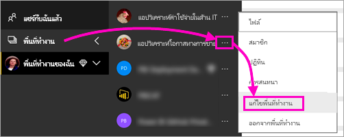
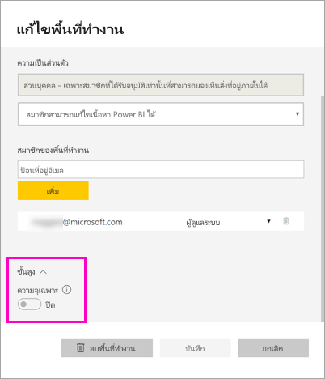
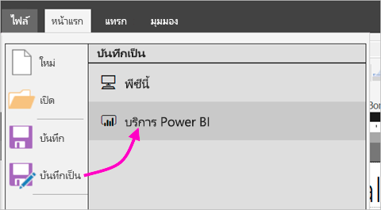
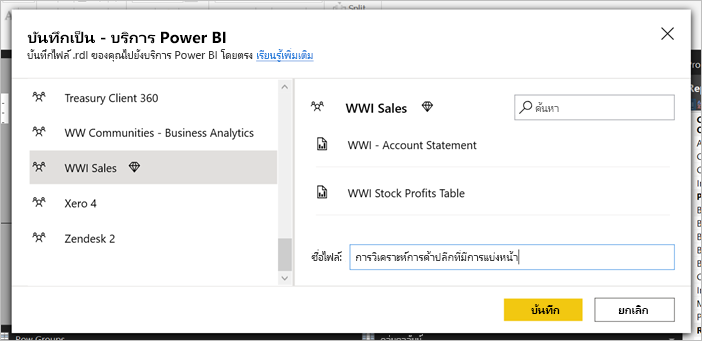
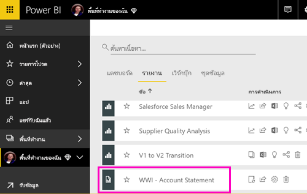
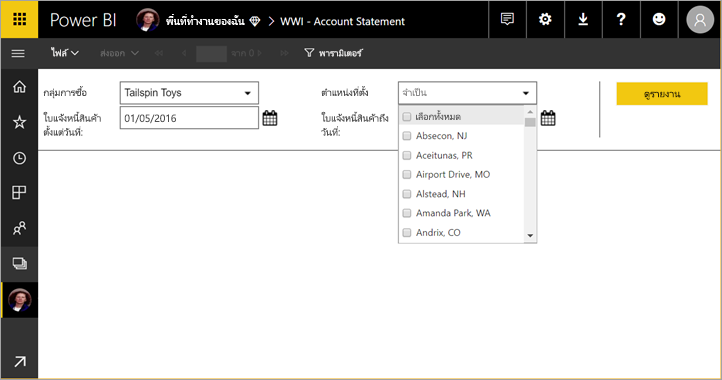
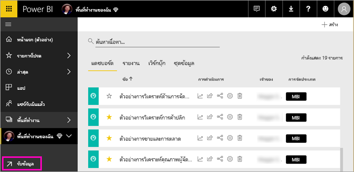
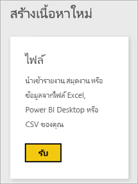
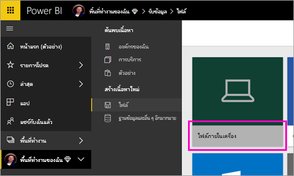
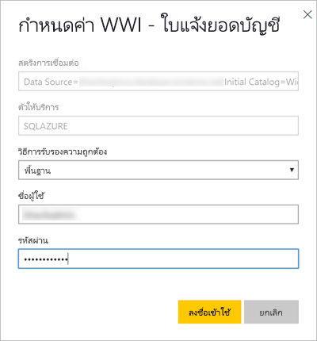

# เผยแพร่รายงานแบบแบ่งหน้าไปยังบริการของ Power BIPublish a paginated report to the Power BI service

[!INCLUDE [applies-to](../includes/applies-to.md)] [!INCLUDE [yes-service](../includes/yes-service.md)] [!INCLUDE [yes-paginated](../includes/yes-paginated.md)] [!INCLUDE [yes-premium](../includes/yes-premium.md)] [!INCLUDE [no-desktop](../includes/no-desktop.md)][!INCLUDE [applies-to](../includes/applies-to.md)] [!INCLUDE [yes-service](../includes/yes-service.md)] [!INCLUDE [yes-paginated](../includes/yes-paginated.md)] [!INCLUDE [yes-premium](../includes/yes-premium.md)] [!INCLUDE [no-desktop](../includes/no-desktop.md)] 

ในบทความนี้ คุณจะได้เรียนรู้เกี่ยวกับการเผยแพร่รายงานแบบแบ่งหน้าไปยังบริการของ Power BI โดยการอัปโหลดจากคอมพิวเตอร์ของคุณเองIn this article, you learn about publishing a paginated report to the Power BI service by uploading it from your local computer. คุณสามารถอัปโหลดรายงานแบบแบ่งหน้าไปยัง "พื้นที่ทำงานของฉัน" หรือพื้นที่ทำงานอื่นได้ ตราบเท่าที่พื้นที่ทำงานนั้นอยู่ในความจุ PremiumYou can upload paginated reports to your My Workspace or any other workspace, as long as the workspace is in a Premium capacity. มองหาไอคอนรูปข้าวหลามตัดLook for the diamond icon  ถัดจากชื่อพื้นที่ทำงานnext to the workspace name. 

หากแหล่งข้อมูลของรายงานของคุณอยู่ในองค์กร คุณต้องสร้างเกตเวย์หลังจากที่อัปโหลดรายงานแล้วIf your report data source is on premises, you need to create a gateway after you upload the report. ดูที่ส่วน [สร้างเกตเวย์](#create-a-gateway) ในภายหลังในบทความนี้See the [Create a gateway](#create-a-gateway) section later in this article.

## เพิ่มพื้นที่ทำงานไปยังความจุพรีเมียมAdd a workspace to a Premium capacity

ถ้าพื้นที่ทำงานไม่มีไอคอนรูปข้าวหลามตัดIf the workspace doesn't have the diamond icon  อยู่ถัดจากชื่อ คุณต้องเพิ่มพื้นที่ทำงานไปยังความจุพรีเมียมnext to the name, you need to add the workspace to a Premium capacity. 

1. เลือก **พื้นที่ทำงาน** เลือกจุดไข่ปลา ( **...** ) ที่อยู่ถัดจากชื่อของพื้นที่ทำงาน จากนั้นเลือก **แก้ไขพื้นที่ทำงาน**Select **Workspaces** , select the ellipsis ( **...** ) next to the workspace name, then select **Edit workspace**.

    

1. ในกล่องโต้ตอบ **แก้ไขพื้นที่ทำงาน** ให้คุณขยาย **ขั้นสูง** จากนั้นเลื่อน **ความจุเฉพาะ** ไปยัง **เปิด**In the **Edit workspace** dialog box, expand **Advanced** , then slide **Dedicated capacity** to **On**.

    

   คุณอาจไม่สามารถเปลี่ยนได้You may not be able to change it. ถ้าเปลี่ยนไม่ได้ โปรดติดต่อผู้ดูแลความจุ Power BI Premium เพื่อให้สิทธิ์ในการกำหนดกับคุณ เพื่อเพิ่มพื้นที่ทำงานไปยังความจุพรีเมียมIf not, then contact your Power BI Premium capacity admin to give you assignment rights to add your workspace to a Premium capacity.

## จากตัวสร้างรายงาน เผยแพร่รายงานที่มีการแบ่งหน้าFrom Report Builder, publish a paginated report

1. สร้างรายงานแบบแบ่งหน้าในตัวสร้างรายงานและบันทึกลงคอมพิวเตอร์ของคุณCreate your paginated report in Report Builder and save it to your local computer.

1. บนเมนู **ไฟล์** ของตัวสร้างรายงาน เลือก **บันทึกเป็น**On the Report Builder **File** menu, select **Save as**.

    

    ถ้าคุณยังไม่ได้ลงชื่อเข้าใช้ Power BI คุณจำเป็นต้องลงชื่อเข้าใช้หรือสร้างบัญชีตอนนี้If you aren't signed in to Power BI yet, you need to sign in or create an account now. ในมุมขวาบนของตัวสร้างรายงาน เลือก **ลงชื่อเข้าใช้** และดำเนินการตามขั้นตอนให้เสร็จสมบูรณ์In the upper-right corner of Report Builder, select **Sign in** and complete the steps.

2. ในรายการของพื้นที่ทำงานทางด้านซ้าย ให้เลือกพื้นที่ทำงานที่มีไอคอนรูปเพชร  ที่อยู่ถัดจากชื่อIn the list of workspaces on the left, select a workspace with the diamond icon  next to its name. พิมพ์ **ชื่อไฟล์** ในกล่อง > **บันทึก**Type a **File name** in the box > **Save**. 

    

4. เปิดบริการของ Power BI ในเบราว์เซอร์และเรียกดูไปที่พื้นที่ทำงานแบบ Premium ซึ่งคุณสามารถเผยแพร่รายงานที่มีการแบ่งหน้าได้Open the Power BI service in a browser and browse to the Premium workspace where you published the paginated report. บนแท็บ **รายงาน** คุณจะมองเห็นรายงานของคุณOn the **Reports** tab, you see your report.

    

5. เลือกรายงานที่มีการแบ่งหน้าเพื่อเปิดในบริการของ Power BISelect the paginated report to open it in the Power BI service. ถ้ามีพารามิเตอร์ คุณต้องเลือกก่อนที่คุณจะสามารถดูรายงานได้If it has parameters, you need to select them before you can view the report.

    

6. หากแหล่งข้อมูลรายงานของคุณอยู่ภายในองค์กร ให้อ่านเกี่ยวกับวิธีการ[สร้างเกตเวย์](#create-a-gateway)ในบทความนี้ เพื่อเข้าถึงแหล่งข้อมูลIf your report data source is on premises, read about how to [create a gateway](#create-a-gateway) in this article to access the data source.

## จากบริการของ Power BI อัปโหลดรายงานที่มีการแบ่งหน้าFrom the Power BI service, upload a paginated report

นอกจากนี้ คุณยังสามารถเริ่มต้นจากบริการของ Power BI และอัปโหลดรายงานที่มีการแบ่งหน้าYou can also start from the Power BI service and upload a paginated report.

1. สร้างรายงานแบบแบ่งหน้าในตัวสร้างรายงานและบันทึกลงคอมพิวเตอร์ของคุณCreate your paginated report in Report Builder and save it to your local computer.

1. เปิดบริการของ Power BI ในเบราเซอร์และเรียกดูพื้นที่ทำงาน Premium ที่คุณต้องการเผยแพร่รายงานOpen the Power BI service in a browser and browse to the Premium workspace where you want to publish the report. มองหาไอคอนรูปข้าวหลามตัดNote the diamond icon  ที่อยู่ถัดจากชื่อnext to the name. 

1. เลือก **รับข้อมูล**Select **Get Data**.

    

1. ในกล่อง **ไฟล์** เลือก **รับ**In the **Files** box, select **Get**.

    

1. เลือก **ไฟล์ภายในเครื่อง** > เรียกดูรายงานแบบแบ่งหน้า > **เปิด**Select **Local file** > browse to the paginated report > **Open**.

    

1. เลือก **ดำเนินการต่อ** > **แก้ไขข้อมูลประจำตัว**Select **Continue** > **Edit credentials**.

    

1. กำหนดข้อมูลประจำตัว > **ลงชื่อเข้าใช้**Configure your credentials > **Sign in**.

    

   บนแท็บ **รายงาน** คุณจะมองเห็นรายงานของคุณOn the **Reports** tab, you see your report.

    

1. เลือกเพื่อเปิดในบริการของ Power BISelect it to open it in the Power BI service. ถ้ามีพารามิเตอร์ คุณต้องเลือกก่อนที่คุณจะสามารถดูรายงานได้If it has parameters, you need to select them before you can view the report.
 
    

6. หากแหล่งข้อมูลรายงานของคุณอยู่ภายในองค์กร ให้อ่านเกี่ยวกับวิธีการ[สร้างเกตเวย์](#create-a-gateway)ในบทความนี้ เพื่อเข้าถึงแหล่งข้อมูลIf your report data source is on premises, read about how to [create a gateway](#create-a-gateway) in this article to access the data source.

## สร้างเกตเวย์Create a gateway

เช่นเดียวกันกับรายงาน Power BI อื่นๆ หากแหล่งข้อมูลของรายงานอยู่ในองค์กร คุณต้องสร้างหรือเชื่อมต่อเกตเวย์เพื่อเข้าถึงข้อมูลJust like any other Power BI report, if the report data source is on premises, then you need to create or connect to a gateway to access the data.

1. ที่ถัดจากชื่อรายงาน ให้คุณเลือก **จัดการ**Next to the report name, select **Manage**.

   

1. ดูบทความบริการของ Power BI [เกตเวย์ข้อมูลภายในองค์กรคืออะไร](../connect-data/service-gateway-onprem.md) สำหรับรายละเอียดและขั้นตอนถัดไปSee the Power BI service article [What is an on-premises data gateway](../connect-data/service-gateway-onprem.md) for details and next steps.

## ขั้นตอนถัดไปNext steps

- [ดูรายงานแบบแบ่งหน้าในบริการของ Power BIView a paginated report in the Power BI service](../consumer/paginated-reports-view-power-bi-service.md)
- [รายงานแบบแบ่งหน้าใน Power BI Premium คืออะไรWhat are paginated reports in Power BI Premium?](paginated-reports-report-builder-power-bi.md)
- [บทช่วยสอน: ฝังรายงานที่มีการแบ่งหน้าของ Power BI ในแอปพลิเคชันสำหรับลูกค้าของคุณTutorial: Embed Power BI paginated reports into an application for your customers](../developer/embedded/embed-paginated-reports-customers.md)
