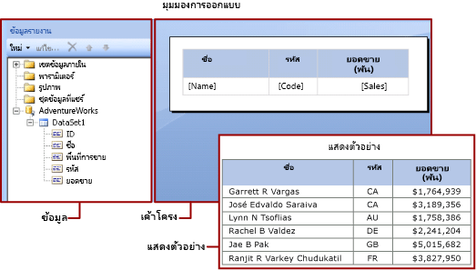

# นิพจน์ในตัวสร้างรายงานใน Power BIExpressions in Power BI Report Builder

[!INCLUDE [applies-to](../includes/applies-to.md)] [!INCLUDE [yes-service](../includes/yes-service.md)] [!INCLUDE [yes-paginated](../includes/yes-paginated.md)] [!INCLUDE [yes-premium](../includes/yes-premium.md)] [!INCLUDE [no-desktop](../includes/no-desktop.md)][!INCLUDE [applies-to](../includes/applies-to.md)] [!INCLUDE [yes-service](../includes/yes-service.md)] [!INCLUDE [yes-paginated](../includes/yes-paginated.md)] [!INCLUDE [yes-premium](../includes/yes-premium.md)] [!INCLUDE [no-desktop](../includes/no-desktop.md)] 

นิพจน์ถูกใช้อย่างแพร่หลายผ่านรายงานที่มีการแบ่งหน้าของตัวสร้างรายงานใน Power BI เพื่อกู้คืน คำนวณ แสดงผล จัดกลุ่ม เรียงลำดับ กรอง กำหนดค่าพารามิเตอร์ และจัดรูปแบบข้อมูลExpressions are widely used throughout Power BI Report Builder paginated reports to retrieve, calculate, display, group, sort, filter, parameterize, and format data. 
  
รายการคุณสมบัติของรายงานหลายข้อสามารถตั้งค่าไปที่นิพจน์ได้Many report item properties can be set to an expression. นิพจน์ช่วยคุณควบคุมเนื้อหา การออกแบบ และการตอบโต้ของรายงานของคุณExpressions help you control the content, design, and interactivity of your report. นิพจน์ถูกเขียนในMicrosoft Visual Basic ถูกบันทึกในข้อกำหนดของรายงาน และได้รับการประมวลผลโดยเค้าโครงรายงานเมื่อคุณดูรายงานExpressions are written in Microsoft Visual Basic, saved in the report definition, and evaluated by the report processor when you run the report.  
  
 แตกต่างจากแอปพลิเคชัน เช่น Microsoft Office Excel ที่คุณทำงานในเวิร์กชีตโดยตรง แต่ในรายงานคุณจะได้ทำงานกับนิพจน์ที่เป็นพื้นที่สำรองไว้สำหรับข้อมูลUnlike applications such as Microsoft Office Excel where you work with data directly in a worksheet, in a report, you work with expressions that are placeholders for data. คุณต้องแสดงตัวอย่างรายงานเพื่อดูข้อมูลจริงจากนิพจน์ที่ได้รับการประมวลผลแล้วTo see the actual data from the evaluated expressions, you must preview the report. เมื่อคุณเรียกดูรายงาน ตัวประมวลผลรายงานจะคำนวณแต่ละนิพจน์ ในขณะที่รวมข้อมูลรายงานและองค์ประกอบเค้าโครงรายงานเข้าด้วยกัน เช่น ตารางและแผนภูมิWhen you run the report, the report processor evaluates each expression as it combines report data and report layout elements such as tables and charts.  
  
 ในขณะที่คุณออกแบบรายงาน หลายนิพจน์สำหรับหน่วยข้อมูลของรายงานได้ถูกตั้งค่าไว้สำหรับคุณแล้วAs you design a report, many expressions for report items are set for you. ตัวอย่างเช่น เมื่อคุณลากฟิลด์จากบานหน้าต่างข้อมูลไปยังเซลล์ตารางบนพื้นผิวการออกแบบรายงาน ค่ากล่องข้อความจะถูกตั้งค่าไปยังนิพจน์ธรรมดาสำหรับฟิลด์For example, when you drag a field from the data pane to a table cell on the report design surface, the text box value is set to a simple expression for the field. ในรูปภาพต่อไปนี้ บานหน้าต่าง ข้อมูลรายงาน จะแสดงผลเขตชุดข้อมูล ID, ชื่อ, พื้นที่ขาย, รหัส, และยอดขายIn the following figure, the Report Data pane displays the dataset fields ID, Name, SalesTerritory, Code, and Sales. สามฟิลด์ที่ได้ถูกเพิ่มไปยังตาราง: [Name], [Code], และ [Sales].Three fields have been added to the table: [Name], [Code], and [Sales]. เครื่องหมายบนพื้นผิวการออกแบบแสดงนิพจน์พื้นฐาน`=Fields!Name.Value`The notation [Name] on the design surface represents the underlying expression `=Fields!Name.Value`.  
  

  
 เมื่อคุณดูรายงาน ตัวประมวลผลรายงานจะรวมขอบเขตข้อมูลตารางเข้ากับข้อมูลจริงจากการเชื่อมต่อข้อมูลและแสดงแถวในตารางสำหรับทุกแถวในชุดผลลัพธ์When you preview the report, the report processor combines the table data region with the actual data from the data connection and displays a row in the table for every row in the result set.  
  
 ในการป้อนนิพจน์ด้วยตนเอง ให้เลือกรายการบนพื้นผิวการออกแบบ และใช้เมนูทางลัดและกล่องโต้ตอบเพื่อตั้งค่าคุณสมบัติของรายการTo enter expressions manually, select an item on the design surface, and use shortcut menus and dialog boxes to set the properties of the item. เมื่อคุณเห็นปุ่ม \* **(fx)** _ หรือค่า `<Expression>` ในรายการแบบเลื่อนลง คุณจะรู้ได้ว่าคุณสามารถตั้งค่าคุณสมบัติไปยังนิพจน์ได้When you see the \***(fx)** _ button or the value `<Expression>` in a drop-down list, you know that you can set the property to an expression. 
  
##   เข้าใจรูปแบบนิพจน์ธรรมดาและรูปแบบนิพจน์ที่ซับซ้อนUnderstanding simple and complex expressions  
 นิพจน์เริ่มด้วยเครื่องหมายเท่ากับ (=) และถูกเขียนใน Microsoft Visual BasicExpressions begin with an equal sign (=) and are written in Microsoft Visual Basic. นิพจน์สามารถรวมการรวมกันของค่าคงที่ ตัวดำเนินการ และการอ้างอิงไปยังค่าภายใน (ฟิลด์ การสะสม และฟังก์ชัน) และไปยังภายนอกหรือรหัสที่กำหนดเองExpressions can include a combination of constants, operators, and references to built-in values (fields, collections, and functions), and to external or custom code.  
  
 คุณสามารถใช้นิพจน์เพื่อระบุค่าของคุณสมบัติรายการของรายงานอีกหลายรายการYou can use expressions to specify the value of many report item properties. คุณสมบัติทั่วไปส่วนใหญ่เป็นค่าสำหรับกล่องข้อความและตัวแทนข้อความThe most common properties are values for text boxes and placeholder text. ปกติแล้วหากกล่องข้อความมีนิพจน์แค่กลุ่มเดียว นิพจน์นั้นจะเป็นค่าของคุณสมบัติกล่องข้อความTypically, if a text box contains only one expression, the expression is the value of the text box property. หากกล่องข้อความมีหลากหลายนิพจน์ แต่ละนิพนจ์จะเป็นค่าของตัวแทนข้อความในกล่องข้อความIf a text box contains multiple expressions, each expression is the value of placeholder text in the text box.  
  
 ตามค่าเริ่มต้น นิพจน์จะปรากฏบนพื้นผิวการออกแบบรายงานเป็นรูปแบบธรรมดา\* หรือรูปแบบที่ *ซับซ้อน*By default, expressions appear on the report design surface as _simple\* or *complex expressions*.  
  
-   **รูปแบบธรรมดา** นิพจน์รูปแบบธรรมดามีการอ้างอิงไปยังรายการเดี่ยวในการสะสมภายใน ตัวอย่างเช่น เขตชุดข้อมูล พารามิเตอร์ หรือฟิลด์ในตัว**Simple** A simple expression contains a reference to a single item in a built-in collection, for example, a dataset field, a parameter, or a built-in field. นิพจน์รูปแบบธรรมดาจะปรากฏในวงเล็บบนพื้นผิวการออกแบบOn the design surface, a simple expression appears in brackets. ตัวอย่างเช่น `[FieldName]`ตรงกับนิพจน์พื้นฐาน`=Fields!FieldName.Value`For example, `[FieldName]` corresponds to the underlying expression `=Fields!FieldName.Value`. นิพจน์รูปแบบธรรมดาจะถูกสร้างขึ้นเพื่อคุณโดยอัตโนมัติ ในขณะที่คุณสร้างเค้าโครงรายงานและลากรายการจากบานหน้าต่างข้อมูลรายงานไปยังพื้นผิวการออกแบบSimple expressions are created for you automatically as you create the report layout and drag items from the Report Data pane to the design surface. สำหรับข้อมูลเพิ่มเติมเกี่ยวกับสัญลักษณ์ที่แสดงการสะสมภายในที่แตกต่าง ให้ดู[ความเข้าใจเกี่ยวกับสัญลักษณ์คำนำหน้าสำหรับนิพจน์รูปแบบธรรมดา](#DisplayText)For more information about the symbols that represent different built-in collections, see [Understanding Prefix Symbols for Simple Expressions](#DisplayText).  
  
-   **รูปแบบซับซ้อน** นิพจน์รูปแบบซับซ้อนมีการอ้างอิงไปยังหลากหลายการอ้างอิงภายใน ตัวดำเนินการ และฟังก์ชันการโทร**Complex** A complex expression contains references to multiple built-in references, operators, and function calls. นิพจน์รูปแบบซับซ้อนจะปรากฏเป็น <\<Expr>> เมื่อค่านิพจน์รวมมากกว่าแค่การอ้างอิงแบบธรรมดาA complex expression appears as <\<Expr>> when the expression value includes more than a simple reference. หากต้องการดูนิพจน์ ให้วางเมาส์เหนือนิพจน์นั้นและใช้เครื่องมือTo view the expression, hover over it and use the tooltip. หากต้องการแก้ไขนิพจน์ ให้เปิดในกล่องโต้ตอบ **นิพจน์**To edit the expression, open it in the **Expression** dialog box.  
  
 รูปภาพต่อไปนี้แสดงรูปแบบปกติและนิพจน์รูปแบบซับซ้อนสำหรับทั้งกล่องข้อความและตัวแทนข้อความThe following figure shows typical simple and complex expressions for both text boxes and placeholder text.  
  
 
  
 หากต้องการแสดงค่าตัวอย่างแทนข้อความสำหรับนิพจน์ ใช้รูปแบบกับกล่องข้อความหรือตัวแทนข้อความTo display sample values instead of text for expressions, apply formatting to the text box or placeholder text. รูปภาพต่อไปนี้แสดงการสลับพื้นผิวการออกแบบรายงานเพื่อแสดงค่าตัวอย่างThe following figure shows the report design surface toggled to show sample values:  
  
  

##  เข้าใจสัญลักษณ์คำนำหน้าในนิพจน์รูปแบบธรรมดาUnderstanding prefix symbols in simple expressions  

นิพจน์รูปแบบธรรมดาใช้สัญลักษณ์เพื่อบ่งบอกว่าการอ้างอิงเป็นฟิลด์ พารามิเตอร์ การสะสมภายใน หรือการสะสมรายการของรายงานหรือไม่Simple expressions use symbols to indicate whether the reference is to a field, a parameter, a built-in collection, or the ReportItems collection. ตารางต่อไปนี้แสดงตัวอย่างการแสดงผลและข้อความนิพจน์:The following table shows examples of display and expression text:  
  
|รายการItem|ตัวอย่างข้อความการแสดงผลDisplay text example|ตัวอย่างข้อความนิพจน์Expression text example|  
|----------|--------------------------|-----------------------------|  
|ฟิลด์ชุดข้อมูลDataset fields|`[Sales]`   `[SUM(Sales)]`   `[FIRST(Store)]`|`=Fields!Sales.Value`   `=Sum(Fields!Sales.Value)`   `=First(Fields!Store.Value)`|  
|รายงานพารามิเตอร์Report parameters|`[@Param]`   `[@Param.Label]`|`=Parameters!Param.Value`   `=Parameters!Param.Label`|  
|ฟิลด์ภายในBuilt-in fields|`[&ReportName]`|`=Globals!ReportName.Value`|  
|ตัวอักษรสัญพจน์ถูกใช้เพื่อแสดงผลข้อความLiteral characters used for display text|`\[Sales\]`|`[Sales]`|  
  
##   การเขียนนิพจน์รูปแบบซับซ้อนWriting complex expressions  
 นิพจน์สามารถรวมการอ้างอิงไปยังฟังก์ชัน ตัวดำเนินการ ค่าคงที่ ฟิลด์ พารามิเตอร์ รายการ จากการสะสมภายใน และเพื่อฝังรหัสกำหนดเองหรือแอสเซมบลีกำหนดเองExpressions can include references to functions, operators, constants, fields, parameters, items from built-in collections, and to embedded custom code or custom assemblies.  
  
 ตารางต่อไปนี้แสดงประเภทการอ้างอิงที่คุณสามารถรวมในนิพจน์ได้The following table lists the kinds of references you can include in an expression:  
  
|เอกสารอ้างอิงReferences|คำอธิบายDescription|ตัวอย่าง:Example|  
|----------------|-----------------|-------------|  
|ค่าคงที่Constants|อธิบายค่าคงที่ที่คุณสามารถเข้าถึงแบบโต้ตอบสำหรับคุณสมบัติที่ต้องการค่าคงที่ เช่น สีตัวอักษรDescribes the constants you can access interactively for properties that require constant values, such as font colors.|`="Blue"`|  
|ผู้ดำเนินการOperators|อธิบายตัวดำเนินการที่ คุณสามารถใช้เพื่อรวมการอ้างอิงในนิพจน์Describes the operators you can use to combine references in an expression. ตัวอย่างเช่น ตัวดำเนินการ **&** นำมาใช้เพื่อสตริงที่ต่อกันFor example, the **&** operator is used for concatenating strings.|`="The report ran at: " & Globals!ExecutionTime & "."`|  
|คอลเลกชันภายใน:Built-in Collections|อธิบายการสะสมภายในที่คุณสามารถรวมในนิพจน์ เช่น `Fields`, `Parameters` และ`Variables`Describes the built-in collections that you can include in an expression, such as `Fields`, `Parameters`, and `Variables`.|`=Fields!Sales.Value`   `=Parameters!Store.Value`   `=Variables!MyCalculation.Value`|  
|รายงานภายในและฟังก์ชันการรวมBuilt-in Report and Aggregate Functions|อธิบายฟังก์ชันภายใน เช่น `Sum` หรือ `Previous` ที่คุณสามารถเข้าถึงจากนิพจน์Describes the built-in functions, such as `Sum` or `Previous`, that you can access from an expression.|`=Previous(Sum(Fields!Sales.Value))`|  
|รหัสที่กำหนดเองและการอ้างอิงแอสเซมบลีในนิพจน์ในตัวสร้างรายงานCustom Code and Assembly References in Expressions in Report Builder |อธิบายวิธีที่คุณสามารถเข้าถึงคลาส CLR ภายในตัว`xref:System.Math`และ`xref:System.Convert`คลาส CLR อื่น ฟังก์ชันรันไทม์ไลบรารีของ Visual Basic หรือเมธอดจากแอสเซมบลีภายนอกDescribes how you can access the built-in CLR classes `xref:System.Math` and `xref:System.Convert`, other CLR classes, Visual Basic run-time library functions, or methods from an external assembly.   อธิบายวิธีที่คุณสามารถเข้าถึงรหัสที่กำหนดเองที่ถูกฝังในรายงานของคุณ หรือที่คุณรวบรวมและติดตั้งเป็นแอสเซมบลีกำหนดเองในรีพอร์ตไคลเอ็นต์และรีพอร์ตเซิร์ฟเวอร์Describes how you can access custom code that is embedded in your report, or that you compile and install as a custom assembly on both the report client and the report server.|`=Sum(Fields!Sales.Value)`   `=CDate(Fields!SalesDate.Value)`   `=DateAdd("d",3,Fields!BirthDate.Value)`   `=Code.ToUSD(Fields!StandardCost.Value)`|  
   
##   นิพจน์ที่ถูกต้องValidating expressions  
 เมื่อคุณสร้างนิพจน์สำหรับคุณสมบัติรายการของรายงานที่เจาะจง การอ้างอิงที่คุณรวมในนิพจน์จะขึ้นอยู่กับค่าที่คุณสมบัติรายการของรายงานสามารถยอมรับและขอบเขตที่คุณสมบัติได้รับการประเมินWhen you create an expression for a specific report item property, the references that you can include in an expression depend on the values that the report item property can accept and the scope in which the property is evaluated. ตัวอย่างเช่น:For example:  
  
-   ตามค่าเริ่มต้น นิพจน์ [Sum] คำนวณผลรวมของข้อมูลที่อยู่ในขอบเขตในเวลาที่นิพจน์ได้รับการประเมินBy default, the expression [Sum] calculates the sum of data that is in scope at the time the expression is evaluated. สำหรับเซลล์ตาราง ขอบเขตจะขึ้นอยู่กับกลุ่มแถวและคอลัมน์สมาชิกFor a table cell, the scope depends on row and column group memberships. 
  
-   สำหรับค่าของคุณสมบัติรูปแบบอักษร ค่าต้องประมวลที่ชื่อและรูปแบบอักษรFor the value for a Font property, the value must evaluate to the name of a font.  
  
-   ไวยากรณ์นิพจน์ได้ถูกตรวจสอบความถูกต้องในช่วงเวลาการออกแบบExpression syntax is validated at design time. การตรวจสอบขอบเขตนิพจน์จะเกิดขึ้นเมื่อคุณเผยแพร่รายงานExpression scope validation occurs when you publish the report. สำหรับการตรวจสอบที่ขึ้นอยู่กับข้อมูลจริง ข้อผิดพลาดจะถูกตรวจพบเมื่อเวลาเรียกดูเท่านั้นFor validation that depends on the actual data, errors can only be detected at run-time. นิพจน์บางกลุ่มเหล่านี้สร้าง #Error เป็นข้อความข้อผิดพลาดในรายงานที่แสดงผลSome of these expressions produce #Error as an error message in the rendered report. 

## ขั้นตอนถัดไปNext steps

- [รายงานแบบแบ่งหน้าใน Power BI Premium คืออะไรWhat are paginated reports in Power BI Premium?](paginated-reports-report-builder-power-bi.md)
