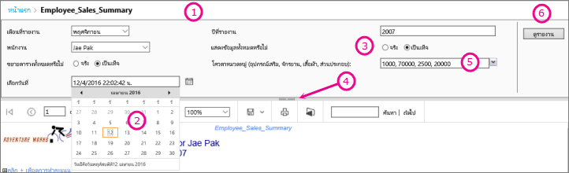
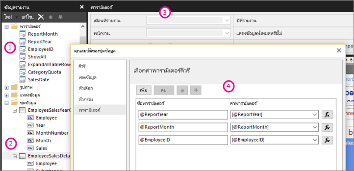

# พารามิเตอร์รายงานในตัวสร้างรายงานของ Power BIReport parameters in Power BI Report Builder

[!INCLUDE [applies-to](../includes/applies-to.md)] [!INCLUDE [yes-service](../includes/yes-service.md)] [!INCLUDE [yes-paginated](../includes/yes-paginated.md)] [!INCLUDE [yes-premium](../includes/yes-premium.md)] [!INCLUDE [no-desktop](../includes/no-desktop.md)][!INCLUDE [applies-to](../includes/applies-to.md)] [!INCLUDE [yes-service](../includes/yes-service.md)] [!INCLUDE [yes-paginated](../includes/yes-paginated.md)] [!INCLUDE [yes-premium](../includes/yes-premium.md)] [!INCLUDE [no-desktop](../includes/no-desktop.md)] 

หัวข้อนี้อธิบายการใช้งานทั่วไปสำหรับพารามิเตอร์รายงานของตัวสร้างรายงาน Power BI ที่คุณสมบัติต่างๆ คุณสามารถตั้งค่าได้และเพิ่มเติมอีกมากThis topic describes the common uses for Power BI Report Builder report parameters, the properties you can set, and much more. พารามิเตอร์รายงานทำให้คุณสามารถควบคุมข้อมูลรายงาน เชื่อมต่อรายงานที่เกี่ยวข้องเข้าด้วยกัน และทำให้การนำเสนอรายงานมีความหลากหลายReport parameters enable you to control report data, connect related reports together, and vary report presentation. คุณสามารถใช้พารามิเตอร์รายงานในรายงานที่มีการแบ่งหน้าที่คุณสร้างในตัวสร้างรายงานYou can use report parameters in paginated reports you create in Report Builder.

##  การใช้งานทั่วไปสำหรับพารามิเตอร์Common uses for parameters

 นี่คือบางส่วนของวิธีทั่วไปในการใช้พารามิเตอร์Here are some of the most common ways to use parameters.  
  
**ควบคุมข้อมูลรายงานที่มีการแบ่งหน้า****Control paginated report data**
  
- กรองข้อมูลรายงานที่มีการแบ่งหน้าที่แหล่งข้อมูลโดยการเขียนคิวรีชุดข้อมูลที่มีตัวแปรต่างๆFilter paginated report data at the data source by writing dataset queries that contain variables.  
  
- ช่วยให้ผู้ใช้สามารถระบุค่าเพื่อกำหนดข้อมูลเองในรายงานที่มีการแบ่งหน้าEnable users to specify values to customize the data in a paginated report. ตัวอย่างเช่น ใส่พารามิเตอร์สองรายการสำหรับวันที่เริ่มต้นและวันที่สิ้นสุดสำหรับข้อมูลการขายFor example, provide two parameters for the start date and end date for sales data.  
  
**ทำให้การนำเสนอรายงานมีความหลากหลาย****Vary report presentation**
  
- ช่วยให้ผู้ใช้สามารถระบุค่าเพื่อช่วยปรับแต่งลักษณะของรายงานEnable users to specify values to help customize the appearance of a report. ตัวอย่างเช่น ป้อนพารามิเตอร์แบบบูลีนเพื่อระบุว่าจะขยายหรือยุบกลุ่มแถวที่ซ้อนกันทั้งหมดในตารางFor example, provide a Boolean parameter to indicate whether to expand or collapse all nested row groups in a table.  
  
- ช่วยให้ผู้ใช้สามารถกำหนดข้อมูลและลักษณะรายงานเองโดยการรวมพารามิเตอร์ต่างๆ ในนิพจน์Enable users to customize report data and appearance by including parameters in an expression.  
  
##  การดูรายงานที่มีพารามิเตอร์Viewing a report with parameters

เมื่อคุณดูรายงานที่มีพารามิเตอร์ แถบเครื่องมือตัวแสดงรายงานจะแสดงพารามิเตอร์แต่ละตัว เพื่อให้คุณระบุค่าได้แบบโต้ตอบWhen you view a report that has parameters, the report viewer toolbar displays each parameter so you can interactively specify values. ภาพประกอบต่อไปนี้แสดงพื้นที่พารามิเตอร์สำหรับรายงานที่มีพารามิเตอร์ @ReportMonth, @ReportYear, @EmployeeID, @ShowAll, @ExpandTableRows, @CategoryQuota และ @SalesDateThe following illustration shows the parameter area for a report with parameters @ReportMonth, @ReportYear, @EmployeeID, @ShowAll, @ExpandTableRows, @CategoryQuota, and @SalesDate.  

  
1. **แผงพารามิเตอร์** แถบเครื่องมือตัวดูรายงานจะแสดงพร้อมท์หรือค่าเริ่มต้นสำหรับพารามิเตอร์แต่ละตัว**Parameters pane** The report viewer toolbar displays a prompt and default value for each parameter. คุณสามารถกำหนดเค้าโครงของพารามิเตอร์ในแผงพารามิเตอร์ได้You can customize the layout of parameters in the parameters pane.  
  
2. **@SalesDate พารามิเตอร์** พารามิเตอร์@SalesDateเป็นชนิดข้อมูล **DateTime****@SalesDate parameter** The parameter @SalesDate is data type **DateTime**. พร้อมท์ เลือกวันที่ จะปรากฎถัดจากกล่องข้อความThe prompt Select the Date appears next to the text box. หากปรับเปลี่ยนวันที่ ให้พิมพ์วันที่ใหม่ในกล่องข้อความหรือใช้การควบคุมปฏิทินTo modify the date, type a new date in the text box or use the calendar control.  
  
3. **@ShowAll พารามิเตอร์** พารามิเตอร์@ShowAllเป็นชนิดข้อมูล **บูลีน****@ShowAll parameter** The parameter @ShowAll is data type **Boolean**. ใช้ปุ่มตัวเลือกเพื่อระบุ **True** หรือ **False**Use the radio buttons to specify **True** or **False**.  
  
4. **แสดงหรือซ่อนที่จับพื้นที่พารามิเตอร์** บนแถบเครื่องมือตัวดูรายงาน คลิกลูกศรนี้เพื่อแสดงหรือซ่อนแผงพารามิเตอร์**Show or Hide Parameter Area handle** On the report viewer toolbar, click this arrow to show or hide the parameters pane.  
  
5. **@CategoryQuota พารามิเตอร์** พารามิเตอร์@CategoryQuotaเป็นชนิดข้อมูล **ลอย** เพื่อให้ใช้ค่าตัวเลข**@CategoryQuota parameter** The parameter @CategoryQuota is data type **Float**, so it takes a numeric value.  @CategoryQuota ถูกตั้งค่าเป็นอนุญาตให้มีหลายค่า@CategoryQuota is set to allow multiple values.  
  
6. **ดูรายงาน** หลังจากที่คุณใส่ค่าพารามิเตอร์ ให้คลิกที่ **ดูรายงาน** เพื่อเรียกใช้รายงาน**View Report**  After you enter parameter values, click **View Report** to run the report. หากพารามิเตอร์ทั้งหมดมีค่าเริ่มต้น รายงานจะทำงานอัตโนมัติในการดูครั้งแรกIf all parameters have default values, the report runs automatically on first view.  
  
##  การสร้างพารามิเตอร์ต่างๆCreating parameters

คุณสามารถสร้างพารามิเตอร์ของรายงานด้วยวิธีที่แตกต่างกันไม่กี่วิธีYou can create report parameters in a few different ways.
  
> [!NOTE]
>  ไม่ใช่ทุกแหล่งข้อมูลที่จะสนับสนุนพารามิเตอร์ต่างๆNot all data sources support parameters.
  
**คิวรีชุดข้อมูลหรือกระบวนการจัดเก็บด้วยพารามิเตอร์ต่างๆ****Dataset query or stored procedure with parameters**
  
 เพิ่มคิวรีชุดข้อมูลที่มีตัวแปรต่างๆ หรือกระบวนการที่จัดเก็บชุดข้อมูลที่มีพารามิเตอร์ป้อนเข้าAdd a dataset query that contains variables or a dataset stored procedure that contains input parameters. พารามิเตอร์ชุดข้อมูลสร้างขึ้นสำหรับแต่ละตัวแปรหรือพารามิเตอร์ป้อนเข้า และพารามิเตอร์ของรายงานสร้างขึ้นสำหรับแต่ละพารามิเตอร์ชุดข้อมูลA dataset parameter is created for each variable or input parameter, and a report parameter is created for each dataset parameter.  
  

  
 รูปภาพจากตัวสร้างรายงานแสดงข้อมูลต่อไปนี้:This image from Report Builder shows:  
  
1.  พารามิเตอร์ของรายงานในแผงข้อมูลรายงานThe report parameters in the Report Data pane.  
  
2.  ชุดข้อมูลพร้อมพารามิเตอร์ต่างๆThe dataset with the parameters.  
  
3.  แผงพารามิเตอร์The Parameters pane.  
  
4.  พารามิเตอร์ที่แสดงในกล่องโต้ตอบคุณสมบัติชุดข้อมูลThe parameters listed in the Dataset Properties dialog box.  
  
**สร้างพารามิเตอร์ด้วยตนเอง****Create a parameter manually**
  
สร้างพารามิเตอร์ด้วยตนเองจากแผงพารามิเตอร์Create a parameter manually from the Report Data pane. คุณสามารถกำหนดค่าพารามิเตอร์ของรายงานเพื่อให้ผู้ใช้สามารถป้อนค่าแบบโต้ตอบเพื่อช่วยปรับแต่งเนื้อหาหรือลักษณะของรายงานYou can configure report parameters so that a user can interactively enter values to help customize the contents or appearance of a report. นอกจากนี้คุณยังสามารถกำหนดค่าพารามิเตอร์ของรายงานเพื่อให้ผู้ใช้ไม่สามารถเปลี่ยนค่าที่กำหนดค่าไว้ล่วงหน้าYou can also configure report parameters so that a user cannot change preconfigured values.  
  
> [!NOTE]  
>  เนื่องจากพารามิเตอร์ต่างๆ ถูกจัดการโดยอิสระบนเซิร์ฟเวอร์ การเผยแพร่รายงานหลักที่มีการตั้งค่าพารามิเตอร์ใหม่จะไม่เป็นการเขียนทับการตั้งค่าพารามิเตอร์ที่มีอยู่ในรายงานBecause parameters are managed independently on the server, republishing a main report with new parameter settings doesn't overwrite the existing parameters settings on the report.  

### ค่าพารามิเตอร์ต่างๆParameter values

 ต่อไปนี้คือตัวเลือกต่างๆ สำหรับการเลือกค่าพารามิเตอร์ในรายงานThe following are options for selecting parameter values in the report.  
  
- เลือกค่าพารามิเตอร์เดี่ยวจากรายการแบบเลื่อนลงSelect a single parameter value from a drop-down list.  
  
- เลือกพารามิเตอร์หลายค่าจากรายการแบบเลื่อนลงSelect multiple parameter values from a drop-down list.  
  
- เลือกค่าหนึ่งจากรายการแบบเลื่อนลงสำหรับหนึ่งพารามิเตอร์ ซึ่งกำหนดค่าต่างๆ ที่มีในรายการแบบเลื่อนลงสำหรับพารามิเตอร์อื่นSelect a value from a drop-down list for one parameter, which determines the values that are available in the drop-down list for another parameter. พารามิเตอร์เหล่านี้เป็นพารามิเตอร์แบบเรียงซ้อนThese are cascading parameters. พารามิเตอร์แบบเรียงซ้อนให้คุณสามารถกรองค่าพารามิเตอร์ตามลำดับจากค่าต่างๆ นับพันให้เป็นจำนวนที่สามารถจัดการได้Cascading parameters enables you to successively filter parameter values from thousands of values to a manageable number. สำหรับข้อมูลเพิ่มเติม ดู [ใช้พารามิเตอร์แบบเรียงซ้อนในรายงานแบบแบ่งหน้า](../guidance/paginated-report-cascading-parameter.md)For more information, see [Use cascading parameters in paginated reports](../guidance/paginated-report-cascading-parameter.md).
  
- เรียกใช้รายงานโดยไม่ต้องเลือกค่าพารามิเตอร์ก่อน เนื่องจากระบบได้สร้างค่าเริ่มต้นสำหรับพารามิเตอร์ไว้แล้วRun the report without having to first select a parameter value because a default value has been created for the parameter.  
  
##  คุณสมบัติพารามิเตอร์ของรายงานReport parameter properties

 คุณสามารถเปลี่ยนคุณสมบัติพารามิเตอร์ของรายงานโดยการใช้กล่องโต้ตอบคุณสมบัติรายงานYou can change the report parameter properties by using the Report Properties dialog box. ตารางต่อไปนี้สรุปคุณสมบัติที่คุณสามารถตั้งค่าสำหรับแต่ละพารามิเตอร์:The following table summarizes the properties that you can set for each parameter:  
  
|คุณสมบัติProperty|คำอธิบายDescription|  
|--------------|-----------------|  
|ชื่อName|พิมพ์ชื่อตรงตามตัวพิมพ์ใหญ่-เล็กสำหรับพารามิเตอร์Type a case-sensitive name for the parameter. ชื่อต้องเริ่มต้นด้วยตัวอักษรและสามารถมีตัวอักษร ตัวเลข ขีดล่าง (_)The name must begin with a letter and can have letters, numbers, an underscore (_). ชื่อห้ามมีเว้นวรรคThe name cannot have spaces. สำหรับพารามิเตอร์ที่สร้างขึ้นโดยอัตโนมัติ ชื่อจะตรงกับพารามิเตอร์ในคิวรีชุดข้อมูลFor automatically generated parameters, the name matches the parameter in the dataset query. ตามค่าเริ่มต้น พารามิเตอร์ที่สร้างขึ้นเองจะเหมือนกับพารามิเตอร์ของรายงาน 1By default, manually created parameters are similar to ReportParameter1.|  
|พร้อมท์Prompt|ข้อความที่ปรากฎถัดจากพารามิเตอร์บนแถบเครื่องมือตัวดูรายงานThe text that appears next to the parameter on the report viewer toolbar.|  
|ชนิดของข้อมูลData type|พารามิเตอร์ของรายงานต้องเป็นหนึ่งในชนิดของข้อมูลดังต่อไปนี้:A report parameter must be one of the following data types:   **Boolean****Boolean**. ผู้ใช้เลือกจริงหรือเท็จจากปุ่มตัวเลือกThe user selects True or False from a radio button.   **DateTime****DateTime**. ผู้ใช้เลือกวันที่จากการควบคุมปฏิทินThe user selects a date from a calendar control.   **Integer****Integer**. ผู้ใช้พิมพ์ค่าต่างๆ ในกล่องข้อความThe user types values in a text box.   **Float****Float**. ผู้ใช้พิมพ์ค่าต่างๆ ในกล่องข้อความThe user types values in a text box.   **Text****Text**. ผู้ใช้พิมพ์ค่าต่างๆ ในกล่องข้อความThe user types values in a text box.   เมื่อมีการกำหนดค่าต่างๆ สำหรับพารามิเตอร์ ผู้ใช้เลือกค่าต่างๆ จากรายการแบบเลื่อนลง แม้เมื่อชนิดของข้อมูลเป็น **DateTime**When available values are defined for a parameter, the user chooses values from a drop-down list, even when the data type is **DateTime**.|  
|อนุญาตให้มีค่าว่างAllow blank value|เลือกตัวเลือกนี้หากค่าของพารามิเตอร์สามารถเป็นสตริงว่างหรือที่ว่างเปล่าSelect this option if the value of the parameter can be an empty string or a blank.   หากคุณกำหนดค่าต่างๆ ที่ถูกต้องสำหรับพารามิเตอร์หนึ่ง และคุณต้องการค่าว่างให้เป็นหนึ่งในค่าที่ถูกต้อง คุณต้องรวมไว้เป็นหนึ่งในค่าต่างๆ ที่คุณระบุIf you specify valid values for a parameter, and you want a blank value to be one of the valid values, you must include it as one of the values that you specify. การเลือกตัวเลือกนี้จะไม่ได้รวมค่าว่างสำหรับค่าที่มีอยู่โดยอัตโนมัติSelecting this option doesn't automatically include a blank for available values.|  
|อนุญาตให้มีค่า NullAllow null value|เลือกตัวเลือกนี้หากค่าของพารามิเตอร์สามารถเป็น NullSelect this option if the value of the parameter can be a null.   หากคุณกำหนดค่าต่างๆ ที่ถูกต้องสำหรับพารามิเตอร์หนึ่งและคุณต้องการค่า Null ให้เป็นหนึ่งในค่าที่ถูกต้อง คุณต้องรวมค่า Null เป็นหนึ่งในค่าต่างๆ ที่คุณกำหนดIf you specify valid values for a parameter, and you want null to be one of the valid values, you must include null as one of the values that you specify. การเลือกตัวเลือกนี้จะไม่รวม Null โดยอัตโนมัติสำหรับค่าต่างๆ ที่มีSelecting this option doesn't automatically include a null for available values.|  
|อนุญาตให้มีหลายค่าAllow multiple values|ป้อนค่าต่างๆ ที่มีเพื่อสร้างรายการแบบเลื่อนลงที่ผู้ใช้ของคุณสามารถเลือกได้Provide available values to create a drop-down list that your users can choose from. นี่เป็นทางที่ดีที่จะทำให้มั่นใจว่าเฉพาะค่าต่างๆ ที่ถูกต้องได้ถูกส่งในคิวรีชุดข้อมูลThis is a good way to ensure that only valid values are submitted in the dataset query.   เลือกตัวเลือกนี้หากค่าสำหรับพารามิเตอร์สามารถเป็นได้หลายค่าที่แสดงในรายการแบบเลื่อนลงSelect this option if the value for the parameter can be multiple values that are displayed in a drop-down list. ค่า Null ไม่ได้รับอนุญาตNull values are not allowed. เมื่อเลือกตัวเลือกนี้ กล่องกาเครื่องหมายจะถูกเพิ่มในรายการของค่าต่างที่มีในรายการแบบเลื่อนลงของพารามิเตอร์When this option is selected, check boxes are added to the list of available values in a parameter drop-down list. ด้านบนของรายการประกอบด้วยกล่องกาเครื่องหมายสำหรับ **เลือกทั้งหมด**The top of the list includes a check box for **Select All**. ผู้ใช้สามารถตรวจสอบค่าต่างๆ ที่พวกเขาต้องการUsers can check the values that they want.   หากข้อมูลที่ให้ค่าต่างๆ มีการเปลี่ยนแปลงอย่างรวดเร็ว รายการที่ผู้ใช้เห็นอาจจะไม่เป็นปัจจุบันที่สุดIf the data that provides values changes rapidly, the list the user sees might not be the most current.|  
|มองเห็นได้Visible|เลือกตัวเลือกนี้เพื่อแสดงพารามิเตอร์ของรายงานในตอนต้นของรายงานเมื่อมันทำงานSelect this option to display the report parameter at the top of the report when it's run. ตัวเลือกนี้อนุญาตให้ผู้ใช้เลือกค่าพารามิเตอร์ต่างๆ ขณะเวลาทำงานThis option allows users to select parameter values at run time.|  
|ซ่อนอยู่Hidden|เลือกตัวเลือกนี้เพื่อซ่อนพารามิเตอร์ของรายงานในรายงานเผยแพร่Select this option to hide the report parameter in the published report. ค่าพารามิเตอร์ต่างๆ ของรายงานยังคงสามารถถูกตั้งค่าบน URL ของรายงานในคำจำกัดความการสมัครใช้งานหรือบนเซิร์ฟเวอร์ของรายงานThe report parameter values can still be set on a report URL, in a subscription definition, or on the report server.|  
|ภายในInternal|เลือกตัวเลือกนี้เพื่อซ่อนพารามิเตอร์ของรายงานSelect this option to hide the report parameter. ในรายงานที่เผยแพร่ พารามิเตอร์ของรายงานสามารถดูได้ในข้อกำหนดของรายงานเท่านั้นIn the published report, the report parameter can only be viewed in the report definition.|  
|ค่าที่มีAvailable values|หากคุณได้กำหนดค่าต่างๆ ที่มีแล้วสำหรับพารามิเตอร์หนึ่ง ค่าต่างๆ ที่ถูกต้องมักปรากฎเป็นรายการแบบเลื่อนลงIf you have specified available values for a parameter, the valid values always appear as a drop-down list. ตัวอย่างเช่น หากคุณให้ค่าต่างๆ ที่มีสำหรับพารามิเตอร์ **DateTime** รายการแบบเลื่อนลงสำหรับวันที่ปรากฎในแผงพารามิเตอร์แทนที่การควบคุมปฏิทินFor example, if you provide available values for a **DateTime** parameter, a drop-down list for dates appears in the parameter pane instead of a calendar control.   เพื่อให้แน่ใจว่ารายชื่อของค่าต่างๆ มีความสม่ำเสมอทั่วรายงานและรายงานย่อยต่างๆ คุณสามารถตั้งค่าตัวเลือกหนึ่งในแหล่งข้อมูลเพื่อใช้การทำธุรกรรมครั้งเดียวสำหรับคิวรีทั้งหมดในชุดข้อมูลที่เชื่อมโยงกับแหล่งข้อมูลTo ensure that a list of values is consistent among a report and subreports, you can set an option on the data source to use a single transaction for all queries in the datasets that are associated with a data source.   **หมายเหตุความปลอดภัย** ในรายงานใดๆ ที่รวมพารามิเตอร์ของชนิดข้อมูล **Text** ให้แน่ใจว่าใช้รายการค่าที่มี (หรือเรียกว่า รายการค่าที่ถูกต้อง) และทำให้แน่ใจว่าผู้ใช้ใดๆ ที่กำลังเรียกใช้รายงานจะมีสิทธิ์ที่จำเป็นเพื่อดูข้อมูลในรายงานเท่านั้น**Security Note** In any report that includes a parameter of data type **Text**, be sure to use an available values list (also known as a valid values list) and ensure that any user running the report has only the permissions necessary to view the data in the report.|  
|ค่าเริ่มต้นDefault values|ตั้งค่าเริ่มต้นจากคิวรีหรือจากรายการคงที่Set default values from a query or from a static list.   เมื่อแต่ละพารามิเตอร์มีค่าเริ่มต้น รายงานจะทำงานอัตโนมัติในการดูครั้งแรกWhen each parameter has a default value, the report runs automatically on first view.|  
|ขั้นสูงAdvanced|กำหนดแอตทริบิวต์ข้อกำหนดของรายงาน **UsedInQuery** ค่าที่บ่งชี้ว่าพารามิเตอร์นี้ส่งผลโดยตรงหรือโดยอ้อมแก่ข้อมูลในรายงานหรือไม่Set the report definition attribute **UsedInQuery**, a value that indicates whether this parameter directly or indirectly affects the data in a report.   **กำหนดโดยอัตโนมัติว่าเมื่อใดจะรีเฟรช****Automatically determine when to refresh**  เลือกตัวเลือกนี้เมื่อคุณต้องการให้หน่วยประมวลผลรายงานทำการกำหนดการตั้งค่าสำหรับค่านี้Choose this option when you want the report processor to determine a setting for this value. ค่าเป็น **จริง** หากหน่วยประมวลผลรายงานตรวจพบคิวรีชุดข้อมูลพร้อมการอ้างอิงในทางตรงหรือทางอ้อมไปยังพารามิเตอร์นี้ หรือหากรายงานมีรายงานย่อยต่างๆThe value is **True** if the report processor detects a dataset query with a direct or indirect reference to this parameter, or if the report has subreports.   **รีเฟรชอยู่เสมอ****Always refresh**  เลือกตัวเลือกนี้หากพารามิเตอร์ของรายงานถูกใช้ในทางตรงหรือทางอ้อมในคิวรีชุดข้อมูลหรือพารามิเตอร์นิพจน์Choose this option when the report parameter is used directly or indirectly in a dataset query or parameter expression. ตัวเลือกนี้ตั้งค่า **UsedInQuery** ให้เป็นจริงThis option sets **UsedInQuery** to True.   **ไม่ต้องรีเฟรช****Never refresh**  เลือกตัวเลือกนี้เมื่อพารามิเตอร์ของรายงานไม่ได้ถูกใช้ในทางตรงหรือทางอ้อมในคิวรีชุดข้อมูลหรือนิพจน์พารามิเตอร์Choose this option when the report parameter is not used directly or indirectly in a dataset query or parameter expression. ตัวเลือกนี้ตั้งค่า **UsedInQuery** ให้เป็นเท็จThis option sets **UsedInQuery** to False.   **คำเตือน** ใช้ **ไม่ต้องรีเฟรช** ด้วยความระมัดระวัง**Caution** Use **Never Refresh** with caution. บนเซิร์ฟเวอร์ของรายงาน **UsedInQuery** ถูกใช้เพื่อช่วยควบคุมตัวเลือกแคชสำหรับข้อมูลรายงานและสำหรับรายงานที่แสดง และตัวเลือกพารามิเตอร์สำหรับรายงานสแนปช็อตOn the report server, **UsedInQuery** is used to help control cache options for report data and for rendered reports, and parameter options for snapshot reports. หากคุณตั้งค่า **ไม่ต้องรีเฟรช** อย่างไม่ถูกต้อง คุณอาจทำให้รายงานมีข้อมูลที่ไม่ถูกต้องรายงานขัดข้องหรือเป็นเหตุให้รายงานสแนปช๊อตมีข้อมูลที่ไม่สอดคล้องกันIf you set **Never Refresh** incorrectly, you could cause incorrect report data or reports to be cached, or cause a snapshot report to have inconsistent data. |  
  
##   คิวรีชุดข้อมูลDataset query  
 หากต้องการกรองข้อมูลในคิวรีชุดข้อมูล คุณสามารถรวมวลีข้อจำกัดที่จำกัดข้อมูลที่เรียกโดยโดยการระบุค่าต่างๆ เพื่อรวมหรือไม่รวมจากชุดผลลัพธ์To filter data in the dataset query, you can include a restriction clause that limits the retrieved data by specifying values to include or exclude from the result set.  
  
 ใช้ตัวออกแบบคิวรีสำหรับแหล่งข้อมูลเพื่อช่วยสร้างคิวรีแบบมีพารามิเตอร์Use the query designer for the data source to help build a parameterized query.  
  
-   สำหรับคิวรี Transact-SQL แหล่งข้อมูลที่แตกต่างกันสนับสนุนไวยากรณ์ที่แตกต่างกันสำหรับพารามิเตอร์ต่างๆFor Transact-SQL queries, different data sources support different syntax for parameters. การสนับสนุนครอบคลุมตั้งแต่พพารามิเตอร์ต่างๆ ที่ระบุไว้ในคิวรีตามตำแหน่งหรือตามชื่อSupport ranges from parameters that are identified in the query by position or by name. ในตัวออกแบบคิวรีเชิงสัมพันธ์ คุณต้องเลือกตัวเลือกพารามิเตอร์สำหรับตัวกรองเพื่อสร้างคิวรีแบบมีพารามิเตอร์In the relational query designer, you must select the parameter option for a filter to create a parameterized query.   
  
-   สำหรับคิวรีต่างๆ ที่อิงตามแหล่งข้อมูลหลายมิติ เช่น Microsoft SQL Server Analysis Services คุณสามารถระบุว่าจะสร้างพารามิเตอร์ที่อิงจากตัวกรองที่คุณระบุไว้ในตัวออกแบบคิวรีหรือไม่For queries that are based on a multidimensional data source such as Microsoft SQL Server Analysis Services, you can specify whether to create a parameter based on a filter that you specify in the query designer. 
  
##   การจัดการพารามิเตอร์สำหรับรายงานที่เผยแพร่Parameter management for a published report  
 เมื่อคุณออกแบบรายงาน พารามิเตอร์ของรายงานจะถูกบันทึกไว้ในข้อกำหนดของรายงานWhen you design a report, report parameters are saved in the report definition. เมื่อคุณเผยแพร่รายงาน พารามิเตอร์ของรายงานจะถูกบันทึกและจัดการแยกกันจากข้อกำหนดของรายงานWhen you publish a report, report parameters are saved and managed separately from the report definition.  
  
 สำหรับรายงานที่เผยแพร่ คุณสามารถใช้ดังต่อไปนี้:For a published report, you can use the following:  
  
-   **คุณสมบัติพารามิเตอร์ของรายงาน****Report parameter properties.** เปลี่ยนค่าพารามิเตอร์ของรายงานโดยตรงบนรีพอร์ตเซิร์ฟเวอร์อย่างเป็นอิสระจากข้อกำหนดของรายงานChange report parameter values directly on the report server independently from the report definition.  
  
-   **การสมัครใช้งานรายงาน****Report subscriptions.** คุณสามารถระบุค่าพารามิเตอร์ต่างๆ เพื่อกรองข้อมูลและส่งรายงานผ่านการสมัครใช้งานYou can specify parameter values to filter data and deliver reports through subscriptions. 
  
 คุณสมบัติพารามิเตอร์สำหรับรายงานที่เผยแพร่ได้ถูกสงวนไว้หากคุณเผยแพร่ข้อกำหนดของรายงานซ้ำParameter properties for a published report are preserved if you republish the report definition. หากข้อกำหนดของรายงานถูกเผยแพร่ซ้ำเป็นรายงานเดิม ชื่อพารามิเตอร์และชนิดของข้อมูลยังคงเหมือนเดิม การตั้งค่าคุณสมบัติของคุณถูกรักษาไว้If the report definition is republished as the same report, and parameter names and data types remain the same, your property settings are retained. หากคุณเพิ่มหรือลบพารามิเตอร์ในข้อกำหนดของรายงาน หรือเปลี่ยนชนิดข้อมูลหรือชื่อของพารามิเตอร์ที่มีอยู่ คุณอาจต้องเปลี่ยนคุณสมบัติของพารามิเตอร์ในรายงานที่เผยแพร่If you add or delete parameters in the report definition, or change the data type or name of an existing parameter, you may need to change the parameter properties in the published report.  
  
 ไม่สามารถแก้ไขพารามิเตอร์ทั้งหมดได้ในทุกกรณีNot all parameters can be modified in all cases. หากพารามิเตอร์ของรายงานได้รับค่าเริ่มต้นจากคิวรีชุดข้อมูล จะไม่สามารถแก้ไขค่าสำหรับรายงานที่เผยแพร่และไม่สามารถแก้ไขได้ในรีพอร์ตเซิร์ฟเวอร์If a report parameter gets a default value from a dataset query, that value cannot be modified for a published report and cannot be modified on the report server. ค่าที่ใช้ในเวลาทำงานถูกกำหนดเมื่อคิวรีทำงานหรือในกรณีของพารามิเตอร์แบบนิพจน์ เมื่อนิพจน์ถูกประเมินThe value that is used at run time is determined when the query runs, or in the case of expression-based parameters, when the expression is evaluated.  
  
 ตัวเลือกการปฏิบัติการรายงานอาจมีผลต่อวิธีการประมวลผลพารามิเตอร์Report execution options can affect how parameters are processed. รายงานที่เรียกใช้เป็นสแน็บช็อตไม่สามารถใช้พารามิเตอร์ต่างๆ ที่แปรผันมาจากคิวรีนอกจากคิวรีมีค่าเริ่มต้นสำหรับพารามิเตอร์ต่างๆA report that runs as a snapshot cannot use parameters that are derived from a query unless the query includes default values for the parameters.  
  
##   พารามิเตอร์สำหรับการสมัครใช้งานParameters for a subscription  
 คุณสามารถกำหนดการสมัครใช้งานสำหรับตามความต้องการหรือสำหรับสแนปช็อตและระบุค่าพารามิเตอร์เพื่อการใช้งานในระหว่างการประมวลผลการสมัครใช้งานYou can define a subscription for an on demand or for a snapshot and specify parameter values to use during subscription processing.  
  
-   **รายงานตามความต้องการ****On-demand report.**  สำหรับรายงานตามความต้องการ คุณสามารถระบุค่าพารามิเตอร์ที่แตกต่างจากค่าที่เผยแพร่สำหรับแต่ละพารามิเตอร์ที่แสดงไว้สำหรับรายงานFor an on-demand report, you can specify a different parameter value than the published value for each parameter listed for the report. ตัวอย่างเช่น สมมติว่าคุณมีรายงานบริการสายโทรศัพท์ที่ใช้พารามิเตอร์ *ระยะเวลา* ในส่งกลับคำขอในการบริการลูกค้าสำหรับวัน สัปดาห์ หรือเดือนในปัจจุบันFor example, suppose you have a Call Service report that uses a *Time Period* parameter to return customer service requests for the current day, week, or month. หากค่าพารามิเตอร์เริ่มต้นสำหรับรายงานนี้ถูกตั้งค่าไว้เป็น **วันนี้** การสมัครสมาชิกของคุณสามารถใช้ค่าพารามิเตอร์ที่แตกต่างกันได้ (เช่น **สัปดาห์** หรือ **เดือน**) เพื่อสร้างรายงานที่รวมตัวเลขรายสัปดาห์หรือรายเดือนIf the default parameter value for the report is set to **today**, your subscription can use a different parameter value (such as **week** or **month**) to produce a report that contains weekly or monthly figures.  
  
## ขั้นตอนถัดไปNext steps

- [รายงานแบบแบ่งหน้าใน Power BI Premium คืออะไรWhat are paginated reports in Power BI Premium?](paginated-reports-report-builder-power-bi.md)  
- [ใช้พารามิเตอร์การเรียงในรายงานที่มีเลขหน้าUse cascading parameters in paginated reports](../guidance/paginated-report-cascading-parameter.md)
