# สร้างรายงานแบบแบ่งหน้าโดยอ้างอิงจากชุดข้อมูลที่ใช้ร่วมกันของ Power BICreate a paginated report based on a Power BI shared dataset

[!INCLUDE [applies-to](../includes/applies-to.md)] [!INCLUDE [yes-service](../includes/yes-service.md)] [!INCLUDE [yes-paginated](../includes/yes-paginated.md)] [!INCLUDE [yes-premium](../includes/yes-premium.md)] [!INCLUDE [yes-desktop](../includes/yes-desktop.md)][!INCLUDE [applies-to](../includes/applies-to.md)] [!INCLUDE [yes-service](../includes/yes-service.md)] [!INCLUDE [yes-paginated](../includes/yes-paginated.md)] [!INCLUDE [yes-premium](../includes/yes-premium.md)] [!INCLUDE [yes-desktop](../includes/yes-desktop.md)] 

คุณสามารถใช้ชุดข้อมูลที่คุณสร้างใน Power BI Desktop เป็นแหล่งข้อมูลสำหรับรายงานแบบแบ่งหน้าจากตัวสร้างรายงาน Power BIYou can use a dataset that you create in Power BI Desktop as a data source for Power BI Report Builder paginated reports. นึกภาพสถานการณ์สมมตินี้: คุณได้สร้างรายงาน Power BI ใน Power BI DesktopPicture this scenario: You've created a Power BI report in Power BI Desktop. คุณใช้เวลามากมายในการออกแบบแบบจำลองข้อมูล จากนั้นสร้างรายงาน Power BI ที่สวยงามพร้อมวิชวลที่ยอดเยี่ยมทุกประเภทYou spent a lot of time designing the data model, then created a beautiful Power BI report with all sorts of great visuals. รายงานของคุณมีเมทริกซ์ที่มีหลายแถว ดังนั้นคุณต้องเลื่อนเพื่อดูทั้งหมดYour report has a matrix with many rows, so you have to scroll to see them all. ผู้อ่านรายงานของคุณต้องการรายงานที่พวกเขาสามารถพิมพ์ออกมาได้ ซึ่งจะแสดงแถวทั้งหมดในเมทริกซ์นั้นYour report readers want a report they can print out, that will show all the rows in that matrix. รายงานแบบแบ่งหน้าของ Power BI จะสามารถทำได้: พิมพ์ตารางหรือเมทริกซ์ที่รันไปหลายหน้า ด้วยส่วนหัวและส่วนท้ายของหน้าและเค้าโครงหน้าที่สมบูรณ์แบบที่คุณออกแบบA Power BI paginated report can do that: print a table or matrix that runs to multiple pages, with page headers and footers and a perfect page layout that you design. ซึ่งจะเติมเต็มรายงาน Power BI DesktopIt will complement the Power BI Desktop report. คุณต้องการให้รายงานยึดตามข้อมูลเดียวกันอย่างแม่นยำ ไม่มีความขัดแย้ง ดังนั้นคุณต้องใช้ชุดข้อมูลเดียวกันYou want them to be based on the exact same data, no discrepancies, so you use the same dataset.

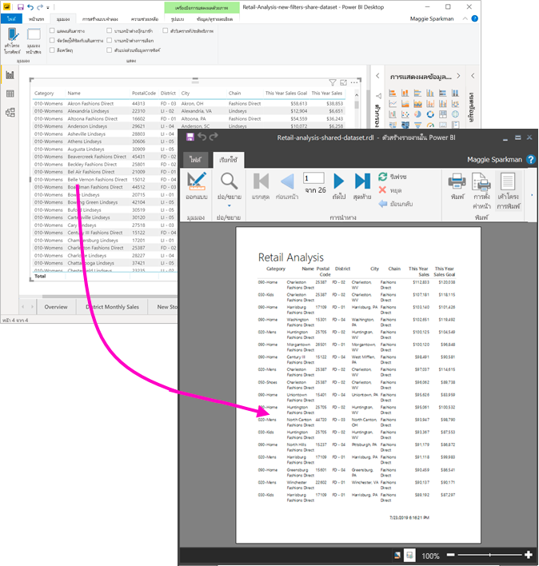

ชุดข้อมูลไม่จำเป็นต้องอยู่ในพื้นที่ทำงานในความจุแบบพรีเมียมและคุณไม่จำเป็นต้องเป็นสมาชิกของพื้นที่ทำงานนั้นThe dataset doesn't have to be in a workspace in a Premium capacity, and you don't need to be a member of that workspace. คุณเพียงแค่ต้องมี[สิทธิ์ในการสร้าง](../connect-data/service-datasets-build-permissions.md)ชุดข้อมูลYou just need to have [Build permission](../connect-data/service-datasets-build-permissions.md) for the dataset. ในการเผยแพร่รายงานแบบแบ่งหน้า คุณจำเป็นต้องมีสิทธิ์การใช้งาน Power BI ProTo publish your paginated report, you do need a Power BI Pro license. นอกจากนี้คุณยังต้องมีบทบาทผู้สนับสนุนสำหรับพื้นที่ทำงานในความจุพรีเมียมด้วยเป็นอย่างน้อยYou also need at least a Contributor role for a workspace in a Premium capacity.

## สิ่งที่คุณจำเป็นต้องมีWhat you need

ต่อไปนี้คือรายการของสิ่งที่คุณจำเป็นต้องและไม่จำเป็นต้องใช้ชุดข้อมูลที่ใช้ร่วมกันในตัวสร้างรายงาน Power BIHere's a list of what you need and don't need to use a shared dataset in Power BI Report Builder.

- ตัวสร้างรายงานใน Power BIPower BI Report Builder. [ดาวน์โหลดและติดตั้งตัวสร้างรายงานใน Power BI](https://aka.ms/pbireportbuilder)[Download and install Power BI Report Builder](https://aka.ms/pbireportbuilder).
- หากต้องการเข้าถึงชุดข้อมูล Power BI คุณจะต้องมีสิทธิ์ในการสร้างชุดข้อมูลTo access a Power BI dataset, you need to have Build permission for the dataset. อ่านเกี่ยวกับ[สิทธิ์ในการสร้าง](../connect-data/service-datasets-build-permissions.md)Read about [Build permission](../connect-data/service-datasets-build-permissions.md).
- คุณไม่จำเป็นต้องมีใบอนุญาต Power BI Pro เพื่อสร้างรายงานแบบแบ่งหน้าในตัวสร้างรายงานYou don't need a Power BI Pro license to create a paginated report in Report Builder. 
- คุณจำเป็นต้องมีสิทธิ์การใช้งาน Power BI Pro เพื่อเผยแพร่รายงานแบบแบ่งหน้าของคุณYou do need a Power BI Pro license to publish your paginated report. นอกจากนี้คุณยังต้องมีบทบาทผู้สนับสนุนสำหรับพื้นที่ทำงานในความจุพรีเมียมด้วยเป็นอย่างน้อยYou also need at least a Contributor role for a workspace in a Premium capacity. 
- ทางเลือก: ถ้าคุณต้องการทำตามบทความนี้ให้ดาวน์โหลดไฟล์ .pbix [ตัวอย่างการวิเคราะห์ด้านการขายปลีก](https://download.microsoft.com/download/9/6/D/96DDC2FF-2568-491D-AAFA-AFDD6F763AE3/Retail%20Analysis%20Sample%20PBIX.pbix)ของ Power BI Desktop จากนั้นเปิดไฟล์ใน Power BI Desktop และเพิ่มตารางที่มีคอลัมน์จำนวนมากOptional: If you want to follow along with this article, download the Power BI Desktop [Retail Analysis sample .pbix](https://download.microsoft.com/download/9/6/D/96DDC2FF-2568-491D-AAFA-AFDD6F763AE3/Retail%20Analysis%20Sample%20PBIX.pbix) file, open it in Power BI Desktop and add a table with a lot of columns. ในบานหน้าต่าง **รูปแบบ** ให้ปิด **ผลรวม**In the **Format** pane, turn off **Totals**. จากนั้นเผยแพร่ไปยังพื้นที่ทำงานในบริการของ Power BIThen publish it to a workspace in the Power BI service.

    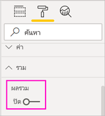

## เชื่อมต่อกับชุดข้อมูล Power BIConnect to the Power BI dataset

1. เกิดตัวสร้างรายงาน Power BIOpen Power BI Report Builder.
1. เลือก **ลงชื่อเข้าใช้** ที่มุมบนขวาของตัวสร้างรายงานเพื่อลงชื่อเข้าใช้บัญชี Power BI ของคุณSelect **Sign in** in the upper-right corner of Report Builder to sign in to your Power BI account.
1. ในบานหน้าต่างข้อมูลรายงาน ให้เลือก **ใหม่** >  **การเชื่อมต่อชุดข้อมูล Power BI**In the Report Data pane, select **New** > **Power BI Dataset Connection**.

    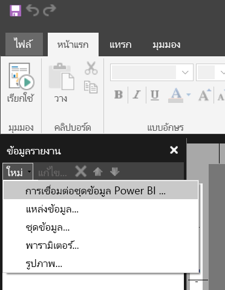

    > [!NOTE]
    > คุณไม่สามารถสร้างแหล่งข้อมูลหรือชุดข้อมูลสำหรับชุดข้อมูล Power BI ได้โดยใช้ตัวช่วยสร้างตาราง เมทริกซ์ หรือแผนภูมิของตัวสร้างรายงานYou can't create the data source or dataset for a Power BI dataset by using the Report Builder Table, Matrix, or Chart wizards. หลังจากที่คุณได้สร้างขึ้นแล้ว คุณสามารถใช้ตัวช่วยสร้างตาราง เมทริกซ์ หรือแผนภูมิที่ยึดตามรายงานเหล่านั้นได้After you've created them, you can use the wizards to create tables, matrixes, or charts based on them.

1. ค้นหาหรือเรียกดูชุดข้อมูลหรือพื้นที่ทำงานในที่ซึ่งมีชุดข้อมูลอยู่ > **เลือก**Search or browse for the dataset or the workspace where it resides > **Select**.
    เติมตัวสร้างรายงานในชื่อชุดข้อมูลReport Builder fills in the dataset name.

    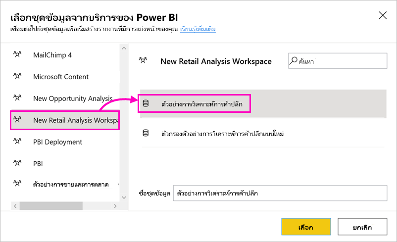
    
1. ชุดข้อมูลจะแสดงอยู่ภายใต้แหล่งข้อมูลในบานหน้าต่างข้อมูลรายงานThe dataset is listed under Data Sources in the Report Data pane.

    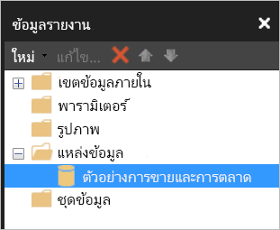

    โปรดจำไว้ว่าคุณสามารถเชื่อมต่อกับชุดข้อมูล Power BI หลายชุดและแหล่งข้อมูลอื่น ๆ ในรายงานแบบแบ่งหน้าเดียวกันได้Remember, you can connect to multiple Power BI datasets and other data sources in the same paginated report.

## รับคิวรี DAX สำหรับชุดข้อมูลGet the DAX query for the dataset

เมื่อคุณต้องการให้ข้อมูลในรายงาน Power BI ของคุณและในรายงานของตัวสร้างรายงานเป็นแบบเดียวกัน การเชื่อมต่อกับชุดข้อมูลจะไม่เพียงพอWhen you want the data in your Power BI report and in your Report Builder report to be the same, it's not enough to connect to the dataset. คุณยังจำเป็นต้องมีคิวรีที่สร้างขึ้นบนชุดข้อมูลนั้นด้วยYou also need the query that's built on that dataset.

### วิดีโอ: รับคิวรี DAXVideo: Get the DAX query

ในวิดีโอต่อไปนี้ Chris Finlan สาธิตวิธีรับ DAX ที่คุณต้องการสำหรับรายงานที่มีการแบ่งหน้าของคุณIn the following video, Chris Finlan demonstrates how to get the DAX you need for your paginated report.

<iframe width="400" height="450" src="https://www.youtube.com/embed/NfoOK4QRkhI" frameborder="0" allowfullscreen></iframe>

### ขั้นตอนในการรับคิวรี DAXSteps to get the DAX query

ในตอนนี้นี่คือขั้นตอนในการรับคิวรีNow here are the steps to get the query.

1. เปิดรายงาน Power BI (.pbix) ใน Power BI DesktopOpen the Power BI report (.pbix) in Power BI Desktop.
1. ตรวจสอบให้แน่ใจว่าคุณมีตารางในรายงานที่มีข้อมูลทั้งหมดที่คุณต้องการในรายงานแบบแบ่งหน้าMake sure you have a table in your report that contains all the data you want in your paginated report. ตารางต้องมีคุณสมบัติตรงตามข้อกำหนดทั้งสองนี้:The table needs to meet these two requirements:
    - ต้องเป็นตารางแบน ไม่ใช่เมทริกซ์หรือวิชวลอื่น ๆIt needs to be a flat table, not a matrix or other visual. หากไม่ใช่ตาราง ให้แปลงเป็นตารางตอนนี้ ทำตามขั้นตอนของ Performance Analyzer ที่ตามมา จากนั้นแปลงกลับเป็นวิชวลที่คุณต้องการIf it's not a table, convert it to a table now, go through the Performance Analyzer steps that follow, then convert it back to the visual you want.
    - สำหรับเขตข้อมูลแบบตัวเลข คุณจำเป็นต้องใช้ *หน่วยวัดที่กำหนดไว้ล่วงหน้า*For your numeric fields, you need to use *predefined measures*. หน่วยวัดดังกล่าวมีสัญลักษณ์เครื่องคิดเลขอยู่ข้างๆThey have a calculator symbol next to them. อ่านเกี่ยวกับ [การสร้างหน่วยวัด](../transform-model/desktop-measures.md)Read about [creating measures](../transform-model/desktop-measures.md). 

        

1. บนริบบอน **มุมมอง** ให้เลือก **ตัววิเคราะห์ประสิทธิภาพ**On the **View** ribbon, select **Performance Analyzer**.

    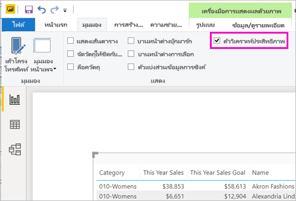

1. ในบานหน้าต่าง **ตัววิเคราะห์ประสิทธิภาพ** ให้เลือก **เริ่มการบันทึก** จากนั้นเลือก **รีเฟรชวิชวล**In the **Performance Analyzer** pane, select **Start recording**, then select **Refresh visuals**.

    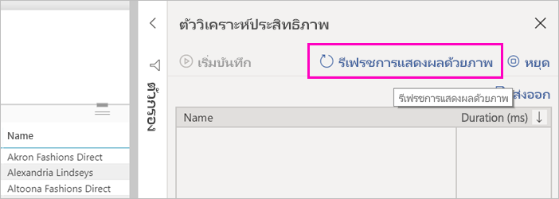

1. ขยายเครื่องหมายบวก ( **+** ) ที่อยู่ถัดจากชื่อตาราง แล้วเลือก **คัดลอกคิวรี**Expand the plus sign (**+**) next to the table name, and select **Copy query**. คิวรีเป็นสูตร DAX ที่คุณต้องการสำหรับชุดข้อมูลในตัวสร้างรายงานของ Power BIThe query is the DAX formula you need for the dataset in Power BI Report Builder.

    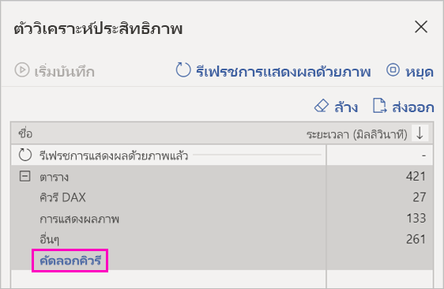

## สร้างชุดข้อมูลพร้อมคิวรีCreate the dataset with the query

1. กลับไปที่ตัวสร้างรายงานของ Power BIGo back to Power BI Report Builder.
1. คลิกขวาที่ชุดข้อมูลภายใต้ **แหล่งข้อมูล** และเลือก **เพิ่มชุดข้อมูล**Right-click the dataset under **Data Sources** and select **Add Dataset**.

    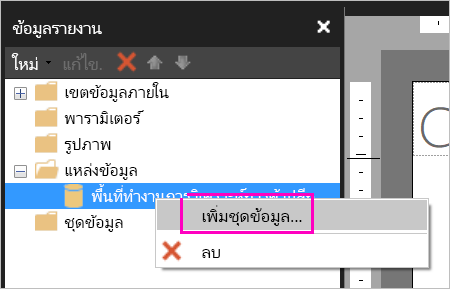

1. ในคุณสมบัติชุดข้อมูล ให้กำหนดชื่อ และเลือก **ตัวออกแบบคิวรี**In Dataset Properties, give it a name, and select **Query Designer**.

4. ตรวจสอบให้แน่ใจว่ามีการเลือก **DAX** และยกเลิกการเลือกไอคอน **โหมดการออกแบบ**Make sure **DAX** is selected, and deselect the **Design Mode** icon.

    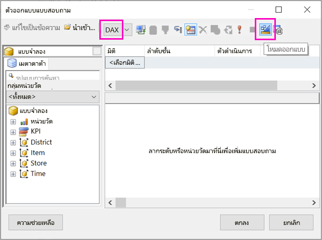

1. ในกล่องด้านบน ให้วางคิวรีที่คุณคัดลอกจาก Power BI DesktopIn the upper box, paste the query you copied from Power BI Desktop.

    > [!NOTE]
    > ถ้าคิวรีของคุณมีฟังก์ชัน TOPN ให้ลบออกจากคิวรีของคุณIf your query includes the TOPN function, delete it from your query.

1. เลือก **ดำเนินการคิวรี** (เครื่องหมายอัศเจรีย์สีแดง !) เพื่อให้แน่ใจว่าคิวรีของคุณทำงานSelect **Execute Query** (the red exclamation mark, !) to be sure your query works. 

    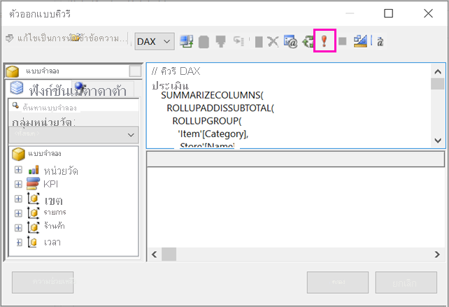

    คุณจะเห็นผลลัพธ์ของคิวรีในกล่องด้านล่างYou see the results of the query in the lower box.

    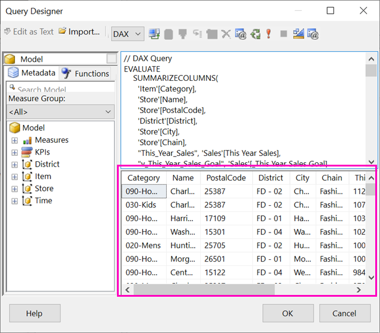

1. เลือก **ตกลง**Select **OK**.

    คุณเห็นคิวรีของคุณในหน้าต่าง **คิวรี** ของกล่องโต้ตอบ **คุณสมบัติของชุดข้อมูล**You see your query in the **Query** window of the **Dataset Properties** dialog box.

    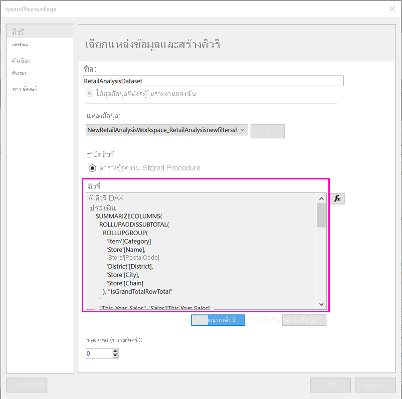

1. เลือก **ตกลง**Select **OK**.

    ในตอนนี้คุณจะเห็นชุดข้อมูลใหม่ของคุณที่มีรายการของเขตข้อมูลในบานหน้าต่างข้อมูลรายงานNow you see your new dataset with a list of its fields in the Report Data pane.

    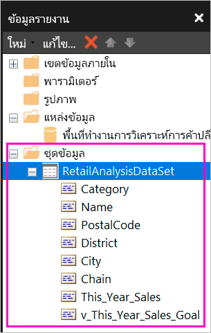

## สร้างตารางในรายงานCreate a table in the report

หนึ่งในแนวทางที่รวดเร็วสำหรับการสร้างตารางคือ ใช้ตัวช่วยสร้างตารางOne quick way to create a table is to use the Table Wizard.

1. บนริบบอน **แทรก** เลือก **ตาราง** > **ตัวช่วยสร้างตาราง**On the **Insert** ribbon, select **Table** > **Table Wizard**.

    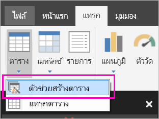

1. เลือกชุดข้อมูลที่คุณสร้างขึ้นด้วยคิวรี DAX > **ถัดไปt**Choose the dataset you created with the DAX query > **Next**.

    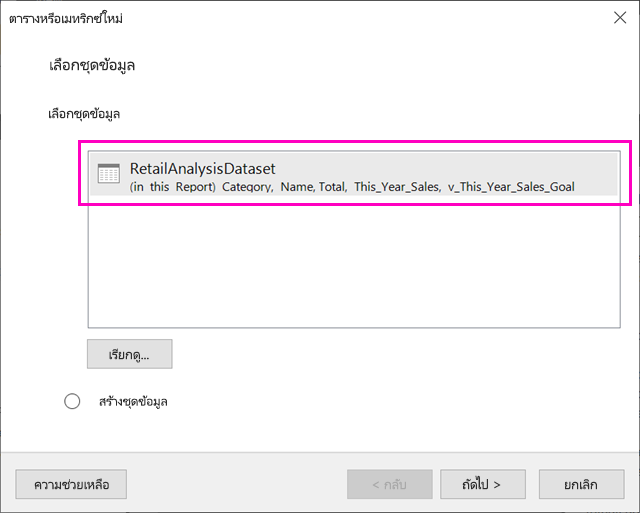

1. หากต้องการสร้างตารางแบน ให้เลือกเขตข้อมูลที่คุณต้องการใน **เขตข้อมูลที่พร้อมใช้งาน**To make a flat table, select the fields you want in **Available fields**. คุณสามารถเลือกเขตข้อมูลหลายรายการในครั้งเดียวโดยการเลือกรายการแรกที่คุณต้องการ จากนั้นกดปุ่ม Shift ค้างไว้และเลือกรายการสุดท้ายYou can select multiple fields at a time by selecting the first one you want, holding the Shift key, and selecting the last one.

    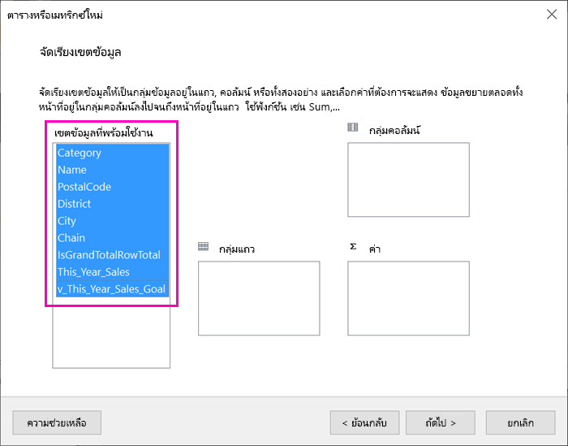

1. ลากเขตข้อมูลไปยังกล่อง **ค่า** > **ถัดไป**Drag the fields to the **Values** box > **Next**.

    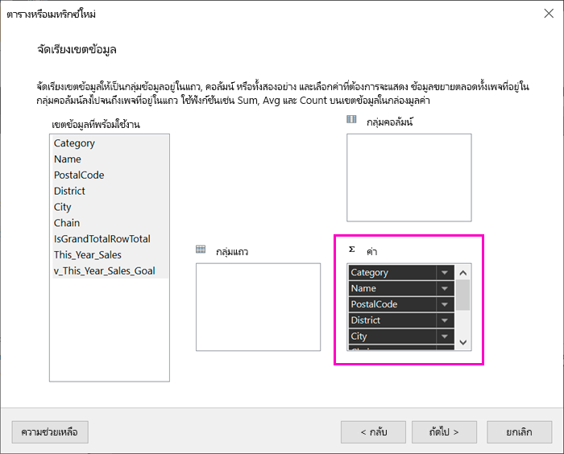

1. เลือกตัวเลือกเค้าโครงที่คุณต้องการ > **ถัดไป**Choose the layout options you want > **Next**.

1. เลือก **เสร็จสิ้น**Select **Finish**.
    คุณจะเห็นตารางของคุณในมุมมองออกแบบYou see your table in Design View.

    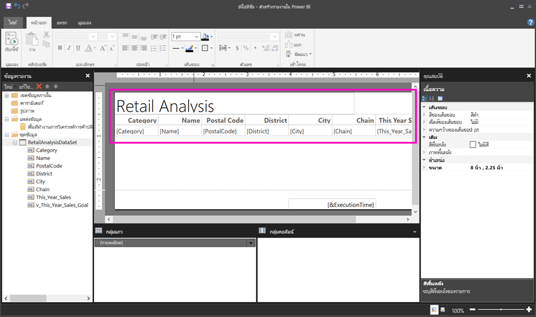

1. เลือก **คลิกเพื่อเพิ่มชื่อเรื่อง** และเพิ่มชื่อเรื่องSelect **Click to add title** and add a title.

1. เลือก **เรียกใช้** เพื่อแสดงตัวอย่างรายงานSelect **Run** to preview your report.

    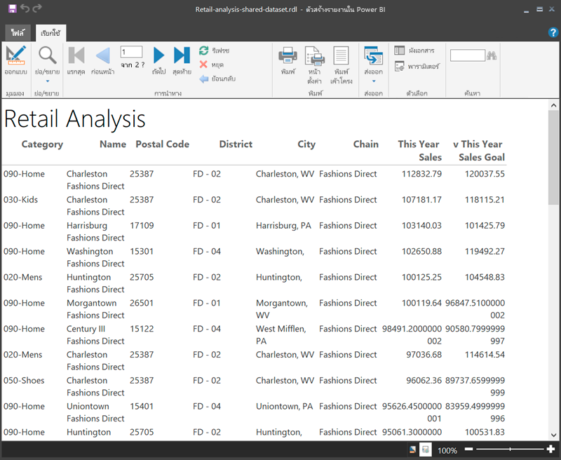

1. เลือก **พิมพ์เค้าโครง** เพื่อดูว่ารายงานของคุณจะมีลักษณะอย่างไรSelect **Print Layout** to see how your report will look printed. 

    เค้าโครงรายงานนี้ต้องการการทำงานบางอย่างThis report layout needs some work. ซึ่งมี 54 หน้า เนื่องจากคอลัมน์และระยะขอบทำให้ตารางกว้างสองหน้าIt has 54 pages because the columns and margins make the table two pages wide.

    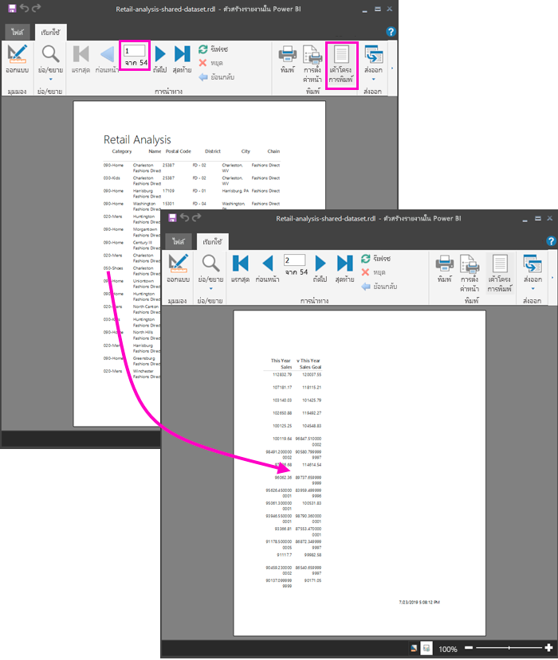

## จัดรูปแบบรายงานFormat the report

คุณมีตัวเลือกการจัดรูปแบบหลายตัวเลือกเพื่อทำให้ตารางของคุณพอดีกับหนึ่งหน้าYou have several formatting options to make your table fit on one page. 

1. คุณสามารถบีบระยะขอบของหน้าให้แคบลงได้ในบานหน้าต่างคุณสมบัติYou can narrow the page margins in the Properties pane. หากคุณไม่เห็นบานหน้าต่างคุณสมบัติ บนริบบอน **มุมมอง** ให้เลือกช่องทำเครื่องหมาย **คุณสมบัติ**If you don't see the Properties pane, on the **View** ribbon, select the **Properties** check box.

1. เลือกรายงาน ไม่ใช่ตารางหรือชื่อเรื่องSelect the report, not the table or title.
1. ในบานหน้าต่าง **คุณสมบัติของรายงาน** ภายใต้ **หน้า**, ขยาย **ระยะขอบ** และเปลี่ยนแต่ละรายการเป็น **0.75in**In the **Report Properties** pane, under **Page**, expand **Margins** and change each one to **0.75in**.

    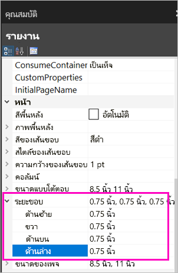

1. คุณยังสามารถทำให้คอลัมน์แคบลงได้อีกด้วยYou can also make columns narrower. เลือกเส้นขอบคอลัมน์และลากด้านขวาไปทางซ้ายSelect the column border and drag the right side to the left.

    

1. ตัวเลือกอื่นคือ เพื่อตรวจสอบให้แน่ใจว่ามีการจัดรูปแบบค่าตัวเลขไว้อย่างดีแล้วAnother option is to make sure the number values are formatted well. เลือกเซลล์ที่มีค่าตัวเลขSelect a cell with a number value. 
    > [!TIP]
    > คุณสามารถจัดรูปแบบได้มากกว่าหนึ่งเซลล์ในครั้งเดียวโดยการกดแป้น Shift ค้างไว้ในขณะที่คุณเลือกเซลล์อื่นๆYou can format more than cell at a time by holding down the Shift key while you select the other cells.

    

1. บนริบบอน **หน้าแรก** ในส่วน **ตัวเลข** ให้เปลี่ยนรูปแบบ **ค่าเริ่มต้น** เป็นรูปแบบตัวเลข เช่น **สกุลเงิน**On the **Home** ribbon, in the **Number** section, change the **Default** format to a numeric format such as **Currency**.

    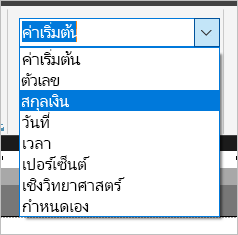

1. เปลี่ยนสไตล์ **ข้อความตัวอย่าง** เป็น **ค่าตัวอย่าง** เพื่อให้คุณเห็นการจัดรูปแบบในเซลล์Change the **Placeholder** style to **Sample Values** so you can see the formatting in the cell. 

    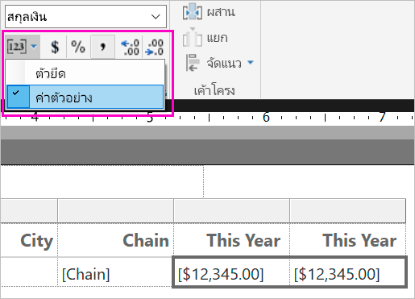

1. หากเหมาะสม ในส่วน **ตัวเลข** ให้ลดตำแหน่งทศนิยมเพื่อประหยัดพื้นที่มากขึ้นIf appropriate, in the **Number** section decrease the decimals to save more space.

### การกำจัดหน้าว่างGetting rid of blank pages

แม้ว่าคุณจะทำให้ระยะขอบและคอลัมน์ของตารางแคบลง แต่รายงานของคุณก็อาจลงท้ายด้วยหน้าว่างเปล่าได้Even if you've made the margins and the table columns narrower, you may still end up with every other page being blank. ทำไม?Why? เป็นเรื่องของคณิตศาสตร์Because of the math. 

เมื่อคุณเพิ่มระยะขอบของหน้าตามที่คุณตั้งค่าไว้ รวมถึงความกว้างของ *เนื้อความ* ในรายงาน ซึ่งจะต้องมีค่าน้อยกว่าความกว้างของรูปแบบรายงานWhen you add up the page margins you set, plus the width of the *body* of the report, it has to be less than the width of the report format.

ตัวอย่างเช่น สมมติว่ารายงานของคุณมีรูปแบบ 8.5" X 11" และคุณได้ตั้งค่าระยะขอบด้านข้างแต่ละด้านเป็น 0.75For example, say your report has an 8.5" X 11" format and you've set the side margins to 0.75 each. ระยะขอบทั้งสองบีบเข้าหากันรวม 1.5" ดังนั้นส่วนเนื้อความจะต้องมีความกว้างน้อยกว่า 7"The two margins together make 1.5", so the body has to be less than 7" wide.

1. เลือกขอบด้านขวาของพื้นผิวการออกแบบรายงานและลาก ดังนั้นจึงมีค่าน้อยกว่าจำนวนที่ต้องการบนไม้บรรทัดSelect the right edge of the report design surface, and drag it so it's less than the desired number on the ruler. 

    > [!TIP]
    > คุณสามารถตั้งค่าได้อย่างแม่นยำยิ่งขึ้นในคุณสมบัติ **เนื้อความ**You can set it more accurately in the **Body** properties. ภายใต้ **ขนาด** ให้ตั้งค่าคุณสมบัติ **ความกว้าง**Under **Size**, set the **Width** property.

    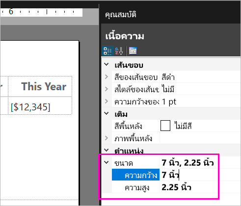

1. เลือก **เรียกใช้งาน** เพื่อดูตัวอย่างรายงานของคุณและตรวจสอบให้แน่ใจว่าคุณได้กำจัดหน้าว่างเปล่าSelect **Run** to preview your report and make sure you've gotten rid of the blank pages. ในตอนนี้ รายงานนี้มีเพียง 26 หน้าแทนที่จะเป็น 54 ตามเดิมThis report now has only 26 pages, instead of the original 54. สำเร็จ!Success!

    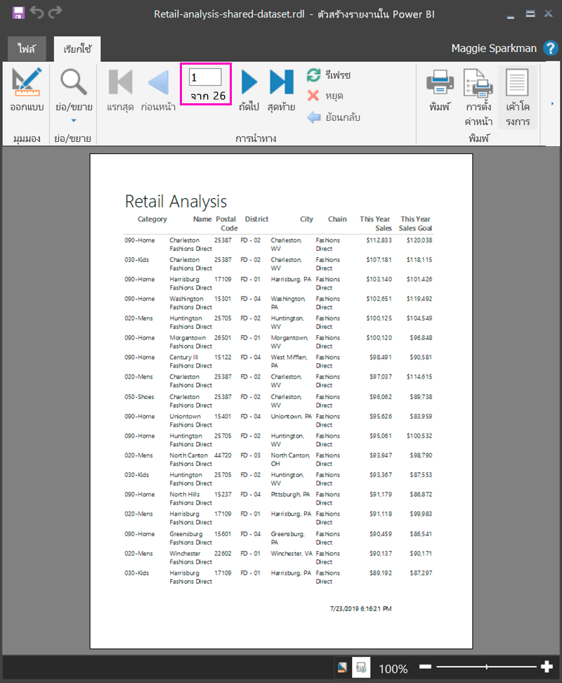

## ข้อจำกัดและข้อควรพิจารณาLimitations and considerations 

- สำหรับชุดข้อมูลที่ใช้การเชื่อมต่อสดไปยังบริการวิเคราะห์ข้อมูล คุณสามารถเชื่อมต่อโดยตรงโดยใช้การเชื่อมต่อบริการวิเคราะห์พื้นฐานแทนชุดข้อมูลที่ใช้ร่วมกันFor datasets that use a Live Connection to Analysis Services, you can connect directly by using the underlying Analysis Services connection instead of a shared dataset.
- ถ้าคุณต้องการใช้ชุดข้อมูล Power BI ที่ใช้ DirectQuery ใน Power BI Report Builder ชุดข้อมูลจะต้องรวมหน่วยวัด แม้ว่าคุณจะไม่ได้วางแผนที่จะแสดงหน่วยวัดในรายงานของคุณก็ตามIf you want to use a Power BI dataset that uses DirectQuery in Power BI Report Builder, the dataset has to include a measure, even if you don't plan to surface the measure in your report. หากไม่มีหน่วยวัด ชุดข้อมูลจะไม่ส่งคืนผลลัพธ์ข้อมูลที่เหมาะสมWithout the measure, the dataset won't return proper data results.
- ชุดข้อมูลที่มีการส่งเสริมหรือได้รับการรับรองจะปรากฏในรายการชุดข้อมูลที่มี แต่ไม่ได้ทำเครื่องหมายเช่นนั้นDatasets with Promoted or Certified endorsements appear in the list of available datasets, but they aren't marked as such. 
- คุณไม่สามารถฝังรายงานที่มีการแบ่งหน้าที่อ้างอิงตามชุดข้อมูลที่ใช้ร่วมกันของ Power BI ในสถานการณ์ "แอปเป็นเจ้าของข้อมูล"You can't embed paginated reports that are based on Power BI shared datasets in the "App Owns Data" scenario.

## ขั้นตอนถัดไปNext steps

- [รายงานแบบแบ่งหน้าใน Power BI Premium คืออะไรWhat are paginated reports in Power BI Premium?](paginated-reports-report-builder-power-bi.md)
