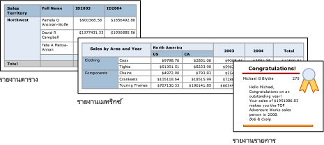

# ตาราง เมทริกซ์ และรายการในตัวสร้างรายงานใน Power BITables, matrixes, and lists in Power BI Report Builder

[!INCLUDE [applies-to](../includes/applies-to.md)] [!INCLUDE [yes-service](../includes/yes-service.md)] [!INCLUDE [yes-paginated](../includes/yes-paginated.md)] [!INCLUDE [yes-premium](../includes/yes-premium.md)] [!INCLUDE [no-desktop](../includes/no-desktop.md)][!INCLUDE [applies-to](../includes/applies-to.md)] [!INCLUDE [yes-service](../includes/yes-service.md)] [!INCLUDE [yes-paginated](../includes/yes-paginated.md)] [!INCLUDE [yes-premium](../includes/yes-premium.md)] [!INCLUDE [no-desktop](../includes/no-desktop.md)] 

ในตัวสร้างรายงาน ตาราง เมทริกซ์ และรายการเป็น *ขอบเขตข้อมูล* ที่แสดงผลข้อมูลรายงานที่มีการแบ่งหน้าในเซลล์ที่ถูกจัดเป็นแถวและคอลัมน์In Report Builder, tables, matrixes, and lists are *data regions* that display paginated report data in cells that are organized into rows and columns. โดยทั่วไปแล้วเซลล์จะมีข้อมูลข้อความเช่น ข้อความ วันที่ และหมายเลข แต่เซลล์ก็ยังมีเกจ์ แผนภูมิ หรือรายการการรายงาน เช่น รูปภาพThe cells typically contain text data such as text, dates, and numbers but they can also contain gauges, charts, or report items such as images. ตาราง เมทริกซ์ และรายการมักจะถูกเรียกรวมกันว่า *ขอบเขตข้อมูล* tablixCollectively, tables, matrixes, and lists are frequently referred to as *tablix* data regions.  
  
 ตาราง เมทริกซ์ และเทมเพลตรายการถูกสร้างในขอบเขตข้อมูล tablix ซึ่งเป็นเส้นตารางที่ยืดหยุ่นได้ที่สามารถแสดงผลข้อมูลในเซลล์The table, matrix, and list templates are built on the tablix data region, which is a flexible grid that can display data in cells. ในเทมเพลตตารางและเมทริกซ์ เซลล์ถูกจัดเป็นแถวและคอลัมน์In the table and matrix templates, cells are organized into rows and columns. เนื่องจากเทมเพลตเป็นรูปแบบของขอบเขตข้อมูล tablix ทั่วไป คุณสามารถแสดงข้อมูลในการรวมกันของรูปแบบเทมเพลต และเปลี่ยนตาราง เมทริกซ์ หรือรายการ เพื่อรวมคุณลักษณะของขอบเขตข้อมูลอื่นขณะที่คุณพัฒนารายงานของคุณBecause templates are variations of the underlying generic tablix data region, you can display data in combination of template formats and change the table, matrix, or list on to include the features of another data region as you develop your report. ตัวอย่างเช่น หากคุณเพิ่มตารางแล้วพบว่าไม่เป็นไปตามที่คุณต้องการ คุณสามารถเพิ่มกลุ่มคอลัมน์เพื่อทำให้ตารางเป็นเมทริกซ์For example, if you add a table and find it does not serve your needs, you can add column groups to make the table a matrix.  
  
 ตารางและขอบเขตข้อมูลเมทริกซ์สามารถแสดงความสัมพันธ์ของข้อมูลที่มีความซับซ้อนโดยมี ตารางที่ซ้อนกัน เมทริกซ์ รายการ แผนภูมิ และเกจ์The table and matrix data regions can display complex data relationships by including nested tables, matrixes, lists, charts and gauges. ตารางและเมทริกซ์มีเค้าโครงแบบตารางและข้อมูลเหล่านั้นมาจากข้อมูลชุดเดียว สร้างขึ้นบนแหล่งข้อมูลเดียวTables and matrixes have a tabular layout and their data comes from a single dataset, built on a single data source. ความแตกต่างที่สำคัญระหว่างตารางและเมทริกซ์คือตารางสามารถรวมได้เพียงกลุ่มแถวเท่านั้น ในขณะที่เมทริกซ์มีทั้งกลุ่มแถวและกลุ่มคอลัมน์The key difference between tables and matrixes is that tables can include only row groups, where as matrixes have row groups and column groups.  
  
 รายการมีความต่างกันเล็กน้อยLists are a little different. มีการสนับสนุนเค้าโครงอิสระและรวมทั้งตารางหรือเมทริกซ์เพียร์หลายอัน ซึ่งแต่ละอันใช้ข้อมูลจากชุดข้อมูลที่แตกต่างกันThey support a free-layout that and can include multiple peer tables or matrixes, each using data from a different dataset. รายการสามารถใช้สำหรับแบบฟอร์มได้ เช่น ใบแจ้งหนี้Lists can also be used for forms, such as invoices.  
  
 รูปภาพต่อไปนี้แสดงรายงานแบบธรรมดาที่มีตาราง เมทริกซ์ หรือรายการThe following pictures show simple reports with a table, matrix, or list.  

  
##   ตารางTables  
 ใช้ตารางเพื่อแสดงข้อมูลรายละเอียด จัดการข้อมูลในกลุ่มแถวหรือทั้งสองUse a table to display detail data, organize the data in row groups, or both. เทมเพลตตารางมีสามคอลัมน์ซึ่งมีแถวส่วนหัวของตารางและแถวรายละเอียดสำหรับข้อมูลThe Table template contains three columns with a table header row and a details row for data. รูปภาพต่อไปนี้แสดงเทมเพลตตารางเบื้องต้น เลือกออกแบบพื้นผิวThe following figure shows the initial table template, selected on the design surface:  

  
 คุณสามารถรวมข้อมูลโดยฟิลด์เดียว โดยหลายฟิลด์ หรือโดยเขียนนิพจน์ของคุณเองYou can group data by a single field, by multiple fields, or by writing your own expression. คุณสามารถสร้างกลุ่มที่ซ้อนกันหรืออิสระ กลุ่มที่ติดกันและแสดงค่ารวมสำหรับข้อมูลที่จัดกลุ่ม หรือเพิ่มผลรวมไปยังกลุ่มYou can create nested groups or independent, adjacent groups and display aggregated values for grouped data, or add totals to groups. ตัวอย่างเช่น หากตารางของคุณมีกลุ่มแถวที่เรียกว่า **ประเภท** คุณสามารถเพิ่มผลรวมย่อยสำหรับแต่ละกลุ่ม รวมถึงผลรวมทั้งหมดสำหรับการรายงานFor example, if your table has a row group called **Category**, you can add a subtotal for each group as well as a grand total for the report. ในการพัฒนาลักษณะของตารางและข้อมูลไฮไลท์ที่คุณต้องการเน้น คุณสามารถรวมเซลล์และนำรูปแบบไปใช้ในข้อมูลและส่วนหัวของตารางTo improve the appearance of the table and highlight data you want to emphasize, you can merge cells and apply formatting to data and table headings.  
  
 คุณสามารถซ่อนรายละเอียดหรือจัดกลุ่มข้อมูลเบื้องต้นได้ และรวมการสลับแบบลงรายละเอียดเพื่อให้ผู้ใช้สามารถเลือกจำนวนข้อมูลที่ต้องการแสดงYou can initially hide detail or grouped data, and include drilldown toggles to enable a user to interactively choose how much data to show.  
  
##   เมทริกซ์Matrixes  
 ใช้เมทริกซ์เพื่อแสดงสรุปข้อมูลรวม จัดกลุ่มเป็นแถวและคอลัมน์ คล้ายกับ PivotTable หรือ crosstabUse a matrix to display aggregated data summaries, grouped in rows and columns, similar to a PivotTable or crosstab. จำนวนของแถวและคอลัมน์สำหรับกลุ่มถูกพิจารณาโดยจำนวนของค่าที่ไม่ซ้ำสำหรับแต่ละกลุ่มแถวและคอลัมน์The number of rows and columns for groups is determined by the number of unique values for each row and column groups. รูปภาพต่อไปนี้แสดงเทมเพลตเมทริกซ์เบื้องต้น เลือกพื้นผิวการออกแบบ:The following figure shows the initial matrix template, selected on the design surface:  

 
 คุณสามารถรวมข้อมูลโดยหลายฟิลด์หรือนิพจน์ในกลุ่มแถวและคอลัมน์You can group data by multiple fields or expressions in row and column groups. ขณะทำงาน เมื่อข้อมูลรายงานและขอบเขตข้อมูลถูกรวมเข้าด้วยกัน เมทริกซ์จะเพิ่มขึ้นในแนวนอนและแนวตั้งบนหน้าเว็บ เป็นคอลัมน์สำหรับกลุ่มคอลัมน์และเเถวสำหรับกลุ่มแถวจะถูกเพิ่มAt run time, when the report data and data regions are combined, a matrix grows horizontally and vertically on the page as columns for column groups and rows for row groups are added. เซลล์เมทริกซ์แสดงค่ารวมที่ถูกกำหนดขอบเขตไปยังจุดตัดของกลุ่มแถวและคอลัมน์ที่เซลล์อยู่The matrix cells display aggregate values that are scoped to the intersection of the row and column groups to which the cell belongs. ตัวอย่างเช่น หากเมทริกซ์ของคุณมีหนึ่งกลุ่มแถว (ประเภท) และสองกลุ่มคอลัมน์(อาณาเขตและปี) ที่แสดงผลรวมยอดขาย รายงานแสดงเซลล์สองเซลล์ที่มีผลรวมยอดขายสำหรับแต่ละค่าในกลุ่มประเภทFor example, if your matrix has a row group (Category) and two column groups (Territory and Year) that display the sum of sales, the report displays two cells with sums of sales for each value in the Category group. ขอบเขตของเซลล์คือจุดตัดสองจุดคือ: ประเภทกับอาณาเขตและประเภทกับปีThe scope of the cells are the two intersections are: Category and Territory and Category and Year. เมทริกซ์สามารถรวมกลุ่มที่มีซ้อนกันและติดกันThe matrix can include nested and adjacent groups. กลุ่มที่ซ้อนกันมีความสัมพันธ์กันแบบพ่อแม่ลูกและกลุ่มที่ติดกันมีความสัมพันธ์แบบเพื่อนNested groups have a parent-child relationship and adjacent groups a peer relationship. คุณสามารถเพิ่มผลรวมย่อยสำหรับกลุ่มแถวและคอลัมน์ที่ซ้อนกันได้ในทุกระดับภายในเมทริกซ์You can add subtotals for any and all levels of nested row and column groups within the matrix.  
  
 เพื่อทำให้ข้อมูลเมทริกซ์อ่านได้มากขึ้นและไฮไลท์ข้อมูลที่คุณต้องการเน้น คุณสามารถรวมหรือแยกเซลล์แบบแนวนอนและแนวตั้งและประยุกต์ใช้การจัดรูปแบบกับข้อมูลและส่วนหัวของกลุ่มTo make the matrix data more readable and highlight the data you want to emphasize, you can merge cells or split horizontally and vertically and apply formatting to data and group headings.  
  
 คุณยังสามารถรวมการสลับการลงรายละเอียดที่ซ่อนข้อมูลรายละเอียดเบื้องต้น ผู้ใช้สามารถคลิกสลับไปมาเพื่อแสดงรายละเอียดเพิ่มขึ้นหรือน้อยลงตามที่ต้องการYou can also include drilldown toggles that initially hide detail data; the user can then click the toggles to display more or less detail as needed.  
  
##   รายการLists  
 ใช้รายการเพื่อสร้างเค้าโครงฟอร์มอิสระUse a list to create a free-form layout. คุณไม่ได้ถูกจำกัดเค้าโครงเส้นตาราง แต่สามารถวางฟิลด์ได้อย่างอิสระภายในรายการYou are not limited to a grid layout, but can place fields freely inside the list. คุณสามารถใช้รายการเพื่ออกแบบฟอร์มสำหรับการแสดงผลหลายฟิลด์ชุดข้อมูล หรือเป็นคอนเทนเนอร์เพื่อแสดงผลหลายขอบฟิลด์เคียงข้างกันสำหรับข้อมูลที่จัดกลุ่มYou can use a list to design a form for displaying many dataset fields or as a container to display multiple data regions side by side for grouped data. ตัวอย่างเช่น คุณสามารถนิยามกลุ่มสำหรับรายการ เพิ่มตาราง แผนภูมิ และรูปภาพ และแสดงค่าในตารางและกราฟิกจากค่าแต่ละกลุ่ม ตามที่คุณอาจจะสำหรับการบันทึกพนักงานหรือผู้ป่วยFor example, you can define a group for a list; add a table, chart, and image; and display values in table and graphic form for each group value, as you might for an employee or patient record.  

  
##   การเตรียมข้อมูลPreparing data  
 ตาราง เมทริกซ์ และขอบเขตข้อมูลรายการแสดงข้อมูลจากชุดข้อมูลA table, matrix, and list data regions display data from a dataset. คุณสามารถจัดเตรียมข้อมูลในแบบสอบถามที่ดึงข้อมูลสำหรับชุดข้อมูลหรือโดยการตั้งค่าคุณสมบัติในตาราง เมทริกซ์ หรือรายการYou can prepare the data in the query that retrieves the data for the dataset or by setting properties in the table, matrix, or list.  
  
 ภาษาคิวรีเช่น Transact-SQL ที่คุณใช้เพื่อดึงข้อมูลสำหรับชุดข้อมูลรายงานสามารถจัดเตรียมข้อมูลโดยใช้ตัวกรองเพื่อรวมเฉพาะชุดย่อยของข้อมูลแทนที่ค่าว่างหรือช่องว่างด้วยค่าคงที่ที่ทำให้รายงานอ่านได้มากขึ้น และการเรียงลำดับและจัดกลุ่มข้อมูลThe query languages such as Transact-SQL, that you use to retrieve the data for the report datasets can prepare the data by applying filters to include only a subset of the data, replacing null values or blanks with constants that make the report more readable, and sorting and grouping data.  
  
 หากคุณเลือกที่จะเตรียมข้อมูลในตาราง เมทริกซ์ หรือขอบเขตรายการของข้อมูล ให้ตั้งคุณสมบัติบนขอบเขตข้อมูลหรือเซลล์ภายในขอบเขตข้อมูลIf you choose to prepare the data in the table, matrix, or list data region of a report, you set properties on the data region or cells within the data region. หากคุณต้องการกรองหรือเรียงข้อมูล ให้ตั้งคุณสมบัติบนขอบเขตข้อมูลIf you want to filter or sort the data, set the properties on the data region. ตัวอย่างเช่น เพื่อเรียงข้อมูลที่คุณระบุคอลัมน์ในการเรียงและทิศทางการเรียงFor example, to sort the data you specify the columns to sort on and the sort direction. หากคุณต้องการระบุค่าอื่นสำหรับฟิลด์ ให้ตั้งค่าข้อความเซลล์ที่เเสดงฟิลด์If you want to provide an alternative value for a field, you set the values of the cell text that displays the field. ตัวอย่างเช่น เพื่อแสดง Blank เมื่อฟิลด์ว่างเปล่าหรือเป็นโมฆะ ให้คุณใช้นิพจน์เพื่อตั้งค่าFor example, to display Blank when a field is empty or null, you use an expression to set the value.  
  
##   การสร้างและการกำหนดค่าตาราง เมทริกซ์ หรือรายการBuilding and configuring a table, matrix, or list  
 เมื่อคุณเพิ่มตารางหรือเมทริกซ์ไปยังรายงานของคุณ คุณสามารถใช้ตัวช่วยสร้างตารางและเมทริกซ์หรือสร้างด้วยตัวเองจากเทมเพลตที่ตัวสร้างรายงานมีให้When you add tables or matrixes to your report, you can use the Table and Matrix Wizard or build them manually from the templates that Report Builder provides. รายการถูกสร้างขึ้นเองจากเทมเพลตรายการLists are built manually from the list template.  
  
 ตัวช่วยสร้างแนะนำคุณผ่านขั้นตอนในการสร้างอย่างรวดเร็วและกำหนดค่าตารางและเมทริกซ์The wizard guides you through the steps to quickly build and configure a table or matrix. หลังจากที่คุณเสร็จสิ้นจากตัวช่วยสร้างแล้วหรือคุณสร้างขอบเขตข้อมูล tablix ตั้งแต่เริ่มต้น คุณสามารถกำหนดค่าและปรับแต่งเพิ่มเติมได้After you complete the wizard or if you build the tablix data regions from scratch, you can further configure and refine them. กล่องโต้ตอบสามารถใช้งานได้จากเมนูคลิกขวาบนพื้นที่ข้อมูลทำให้ง่ายต่อการตั้งค่าคุณสมบัติที่ใช้บ่อยที่สุดสำหรับตัวแบ่งหน้า การทำซ้ำ และการมองเห็นส่วนหัวและส่วนท้าย ตัวเลือกการแสดง ตัวกรอง และการเรียงลำดับThe dialog boxes, available from the right-click menus on the data regions, make it easy to set the most commonly used properties for page breaks, repeatability and visibility of headers and footers, display options, filters, and sorting. แต่ขอบเขตข้อมูล tablix มีคุณสมบัติเพิ่มเติมมากมายซึ่งคุณสามารถตั้งค่าได้เฉพาะหน้าคุณสมบัติของตัวสร้างรายงานBut the tablix data region provides a wealth of additional properties, which you can set only in the Properties pane of Report Builder. ตัวอย่างเช่น หากคุณต้องการแสดงข้อความเมื่อชุดข้อมูลสำหรับตารา งเมทริกซ์ หรือรายการว่างเปล่า คุณจะระบุคุณสมบัติใน NoRowsMessage tablix ในหน้าต่างคุณสมบัติFor example, if you want to display a message when the dataset for a table, matrix, or list is empty, you specify the message text in the NoRowsMessage tablix property in the Properties pane.  
  
##   การเปลี่ยนแปลงระหว่างเทมเพลต tablixChanging between tablix templates  
 คุณไม่ได้ถูกจำกัดโดยตัวเลือกเทมเพลต tablix เบื้องต้นของคุณYou are not limited by your initial tablix template choice. ขณะคุณเพิ่ม กลุ่ม ผลรวม และป้ายชื่อ คุณอาจต้องการแก้ไขการออกแบบ tablix ของคุณAs you add groups, totals, and labels, you might want to modify your tablix design. ตัวอย่างเช่น คุณอาจเริ่มด้วยตารางและจากนั้นลบแถวรายละเอียดและเพิ่มกลุ่มคอลัมน์For example, you might start with a table and then delete the details row and add column groups.  
  
 คุณสามารถพัฒนาตาราง เมทริกซ์ หรือรายการต่อไปโดยการเพิ่มคุณลักษณะ tablixYou can continue to develop a table, matrix, or list by adding any tablix feature. คุณลักษณะ tablix รวมถึงการแสดงผลข้อมูลรายละเอียดหรือค่ารวมสำหรับจัดกลุ่มข้อมูลในแถวและคอลัมน์Tablix features include displaying detail data or aggregates for grouped data on rows and columns. คุณสามารถสร้างกลุ่มแบบซ้อนกัน กลุ่มติดกันแบบอิสระ หรือกลุ่มแบบซ้ำYou can create nested groups, independent adjacent groups, or recursive groups. คุณสามารถกรองและเรียงกลุ่มข้อมูล และรวมกลุ่มโดยง่าย โดยรวมนิพจน์หลายกลุ่มเข้ากับกลุ่มคำจำกัดความYou can filter and sort grouped data, and easily combine groups by including multiple group expressions in a group definition  
  
 คุณยังสามารถเพิ่มผลรวมสำหรับกลุ่มหรือผลรวมทั้งหมดสำหรับขอบเขตข้อมูลYou can also add totals for a group or grand totals for the data region. คุณสามารถซ่อนแถวหรือคอลัมน์เพื่อลดความซับซ้อนของรายงานและช่วยให้ผู้ใช้สลับการแสดงผลของข้อมูลที่ถูกซ่อน เช่น ในรายงานลงรายละเอียดYou can hide rows or columns to simplify a report and enable the user to toggle the display of the hidden data, as in a drilldown report. 

## ขั้นตอนถัดไปNext steps

- [รายงานแบบแบ่งหน้าใน Power BI Premium คืออะไรWhat are paginated reports in Power BI Premium?](paginated-reports-report-builder-power-bi.md)
