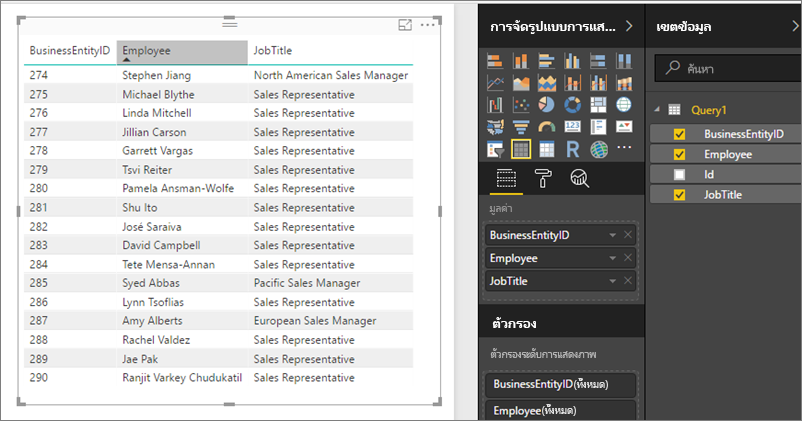

# เข้าถึงชุดข้อมูลที่ใช้ร่วมกันเป็นฟีด OData ในเซิร์ฟเวอร์รายงาน Power BIAccessing shared datasets as OData feeds in Power BI Report Server
คุณสามารถเข้าถึงชุดข้อมูลที่ใช้ร่วมกันจาก Power BI Desktop ด้วยฟีด ODataYou can access shared datasets from Power BI Desktop with an OData feed.

1. คุณสามารถเชื่อมต่อกับแหล่งข้อมูล OData ได้โดย URL ของฟีด ODataWith the OData feed URL, you connect to the OData source.
   
    
2. หลังจากที่คุณนำข้อมูลลงใน Power BI Desktop คุณจะสามารถปรับเปลี่ยนได้ในตัวแก้ไขแบบสอบถามAfter you bring the data into Power BI Desktop, you can modify it in the Query Editor.
   
    
3. คุณสามารถใช้ข้อมูลในการออกแบบรายงานได้ในขณะนี้Now you can use the data in designing reports.
   
    

โปรดตรวจสอบให้แน่ใจว่าใช้ **ตัวเลือกขั้นสูง** เพื่อที่คุณจะสามารถเปิดใช้งานคอลัมน์ชนิดเปิด และจัดรูปแบบคอลัมน์ตาม Power Query ตามความต้องการของคุณBe sure to use **Advanced Options** so you can turn on Open Type Columns and format the columns accordingly in Power Query to meet your needs.

อ่านเพิ่มเติมเกี่ยวกับ[เชื่อมต่อกับฟีด OData ใน Power BI Desktop](../connect-data/desktop-connect-odata.md)Read more about [connecting to OData feeds in Power BI Desktop](../connect-data/desktop-connect-odata.md).

มีคำถามเพิ่มเติมหรือไม่More questions? [ลองถามชุมชน Power BITry asking the Power BI Community](https://community.powerbi.com/)

