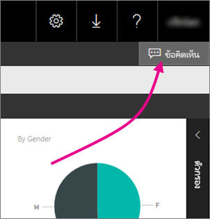
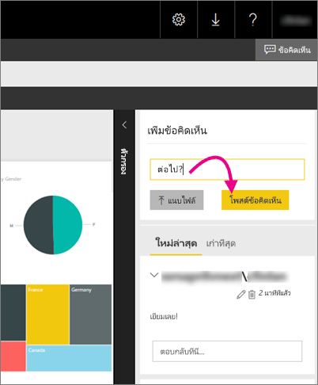

# เพิ่มข้อคิดเห็นไปยังรายงานในรีพอร์ตเซิร์ฟเวอร์ - เซิร์ฟเวอร์รายงาน Power BIAdd comments to a report in a report server - Power BI Report Server

คุณสามารถเพิ่มข้อคิดเห็นเมื่อต้องการรายงาน รวมถึงรายงาน Power BI ภายในพอร์ทัลเว็บของรีพอร์ตเซิร์ฟเวอร์You can add comments to reports, including Power BI reports, within the web portal of a report server. ข้อคิดเห็นสดพร้อมรายงาน และทุกคนที่มีสิทธิ์ที่เหมาะสม สามารถดูข้อคิดเห็นสำหรับรายงานได้The comments live with the report, and anyone with the right permissions can see the comments for the report. ดูส่วน[การให้สิทธิ์](#permissions)ด้านล่างสำหรับรายละเอียดSee the [Permissions](#permissions) section below for details.

## เพิ่ม หรือดูข้อคิดเห็นAdd or view comments

1. เปิดส่วนที่มีการแบ่งหน้าหรือรายงาน Power BI บนรีพอร์ตเซิร์ฟเวอร์Open a paginated or Power BI report on a report server.
2. ในมุมขวาบน ให้เลือก**ข้อคิดเห็น**In the upper-right corner, select **Comments**.

    

    ในบานหน้าต่างข้อคิดเห็น คุณสามารถดูข้อคิดเห็นใดๆ ที่มีอยู่In the Comments pane, you can see any existing comments.
3. เขียนข้อคิดเห็นของคุณ จากนั้นเลือก**โพสต์ข้อคิดเห็น**Write your comment, then select **Post Comment**.

    

    ข้อคิดเห็นของคุณจะแสดงในบานหน้าต่างด้านบนพอร์ทัลเว็บ พร้อมกับข้อคิดเห็นก่อนหน้าYour comment shows in the pane on the web portal, along with any previous comments. ข้อคิดเห็นนั้นไม่ได้ปรากฏพร้อมกับรายงานในแอป Power BI สำหรับอุปกรณ์เคลื่อนที่They don't appear with the report on in the Power BI mobile apps.

   > [!TIP]
   > คุณทราบหรือไม่Did you know? คุณสามารถ[ใส่คำอธิบายประกอบรายงาน Power BI ในแอป Power BI สำหรับอุปกรณ์เคลื่อนที่](../consumer/mobile/mobile-annotate-and-share-a-tile-from-the-mobile-apps.md)และแชร์รายงานที่มีคำอธิบายประกอบกับผู้อื่นได้You can [annotate Power BI reports in the Power BI mobile apps](../consumer/mobile/mobile-annotate-and-share-a-tile-from-the-mobile-apps.md) and share the annotated reports with others.

## สิทธิ์Permissions

ขึ้นอยู่กับสิทธิ์ของคุณ คุณสามารถ:Depending on your permissions, you can:

* ไม่เห็นข้อคิดเห็นNot see comments.
* ดูข้อคิดเห็นทั้งหมด และโพสต์ แก้ไข และลบของคุณเองSee all comments, and post, edit, and delete your own.
* ดูข้อคิดเห็นทั้งหมด โพสต์ แก้ไข และลบของคุณเอง และลบของบุคคลอื่นSee all comments; post, edit, and delete your own; and delete other people’s.

## ขั้นตอนถัดไปNext steps
* [เซิร์ฟเวอร์รายงาน Power BI คืออะไรWhat is Power BI Report Server?](get-started.md)  

มีคำถามเพิ่มเติมหรือไม่More questions? [ลองถามชุมชน Power BITry asking the Power BI Community](https://community.powerbi.com/)

