# <a name="configure-power-bi-report-server-with-azure-application-proxy"></a><span data-ttu-id="fe84b-103">กำหนดค่าเซิร์ฟเวอร์รายงาน Power BI ด้วยพร็อกซีแอปพลิเคชัน Azure</span><span class="sxs-lookup"><span data-stu-id="fe84b-103">Configure Power BI Report Server with Azure Application Proxy</span></span>

<span data-ttu-id="fe84b-104">บทความนี้อธิบายวิธีใช้พร็อกซีแอปพลิเคชัน Azure Active Directory เพื่อเชื่อมต่อกับเซิร์ฟเวอร์รายงาน Power BI และ SQL Server Reporting Services (SSRS) 2016 และใหม่กว่า</span><span class="sxs-lookup"><span data-stu-id="fe84b-104">This article discusses how to use Azure Active Directory Application Proxy to connect to Power BI Report Server and SQL Server Reporting Services (SSRS) 2016 and later.</span></span> <span data-ttu-id="fe84b-105">โดยผ่านการรวมกลุ่มนี้ ผู้ใช้ที่อยู่ห่างจากเครือข่ายองค์กรสามารถเข้าถึงเซิร์ฟเวอร์รายงาน Power BI  และรายงาน Reporting Services ได้จากเบราว์เซอร์ไคลเอ็นต์และได้รับการปกป้องโดย Azure Active Directory (AD)</span><span class="sxs-lookup"><span data-stu-id="fe84b-105">Through this integration, users who are away from the corporate network can access their Power BI Report Server and Reporting Services reports from their client browsers and be protected by Azure Active Directory (AD).</span></span> <span data-ttu-id="fe84b-106">อ่านเพิ่มเติมเกี่ยวกับการเข้าถึงระยะไกลไปยังแอปพลิเคชันในองค์กรผ่านทาง[พร็อกซีแอปพลิเคชัน Azure Active Directory](/azure/active-directory/manage-apps/application-proxy)</span><span class="sxs-lookup"><span data-stu-id="fe84b-106">Read more about remote access to on-premises applications through [Azure Active Directory's Application Proxy](/azure/active-directory/manage-apps/application-proxy).</span></span>

## <a name="environment-details"></a><span data-ttu-id="fe84b-107">รายละเอียดสภาพแวดล้อม</span><span class="sxs-lookup"><span data-stu-id="fe84b-107">Environment details</span></span>

<span data-ttu-id="fe84b-108">เราใช้ค่าเหล่านี้ในตัวอย่างที่เราได้สร้างขึ้น</span><span class="sxs-lookup"><span data-stu-id="fe84b-108">We used these values in the example we created.</span></span> 

- <span data-ttu-id="fe84b-109">โดเมน: umacontoso.com</span><span class="sxs-lookup"><span data-stu-id="fe84b-109">Domain: umacontoso.com</span></span>
- <span data-ttu-id="fe84b-110">เซิร์ฟเวอร์รายงาน Power BI: PBIRSAZUREAPP.umacontoso.com</span><span class="sxs-lookup"><span data-stu-id="fe84b-110">Power BI Report Server: PBIRSAZUREAPP.umacontoso.com</span></span>
- <span data-ttu-id="fe84b-111">เครื่องมือข้อมูลเซิร์ฟเวอร์ SQL Server SQLSERVERAZURE.umacontoso.com</span><span class="sxs-lookup"><span data-stu-id="fe84b-111">SQL Server Data Source: SQLSERVERAZURE.umacontoso.com</span></span>

## <a name="configure-power-bi-report-server"></a><span data-ttu-id="fe84b-112">กำหนดค่า Power BI Report Server</span><span class="sxs-lookup"><span data-stu-id="fe84b-112">Configure Power BI Report Server</span></span>

<span data-ttu-id="fe84b-113">หลังจากติดตั้งเซิร์ฟเวอร์รายงาน Power BI (สมมติว่าติดตั้งบน Azure VM) ให้กำหนดค่าบริการเว็บเซิร์ฟเวอร์รายงาน Power BI และ URL พอร์ทัลเว็บโดยใช้ขั้นตอนต่อไปนี้:</span><span class="sxs-lookup"><span data-stu-id="fe84b-113">After installing Power BI Report Server (assuming on an Azure VM), configure the Power BI Report Server web service and web portal URLs using the following steps:</span></span>

1. <span data-ttu-id="fe84b-114">สร้างกฎขาเข้าและขาออกบนไฟร์วอลล์ VM สำหรับพอร์ต๘๐ (พอร์ต๔๔๓หากคุณมีการกำหนดค่า Url https)</span><span class="sxs-lookup"><span data-stu-id="fe84b-114">Create inbound and outbound rules on the VM firewall for Port 80 (Port 443 if you have https URLs configured).</span></span> <span data-ttu-id="fe84b-115">นอกจากนี้สร้างกฎขาเข้าและขาออกสำหรับ Azure VM จากพอร์ทัล Azure สำหรับโพรโทคอล TCP –พอร์ต๘๐</span><span class="sxs-lookup"><span data-stu-id="fe84b-115">Also, create inbound and outbound rules for Azure VM from the Azure portal for TCP protocol – Port 80.</span></span>
2. <span data-ttu-id="fe84b-116">ชื่อ DNS ที่ได้รับการกำหนดค่าสำหรับ VM ในสภาพแวดล้อมของเราคือ `pbirsazureapp.eastus.cloudapp.azure.com`</span><span class="sxs-lookup"><span data-stu-id="fe84b-116">The DNS name configured for the VM in our environment is `pbirsazureapp.eastus.cloudapp.azure.com`.</span></span>
3. <span data-ttu-id="fe84b-117">กำหนดค่าบริการเว็บภายนอกของเซิร์ฟเวอร์รายงาน Power BI และ URL เว็บพอร์ทัลโดยเลือกแท็บ **ขั้นสูง** > **เพิ่ม** ปุ่ม > **เลือกชื่อส่วนหัวของโฮสต์** และเพิ่มชื่อโฮสต์ (ชื่อ DNS) ดังที่แสดงไว้ที่นี่</span><span class="sxs-lookup"><span data-stu-id="fe84b-117">Configure the Power BI Report Server external web service and web portal URL by selecting the **Advanced** tab > **Add** button > **Choose Host Header Name** and adding the host name (DNS name) as shown here.</span></span>

    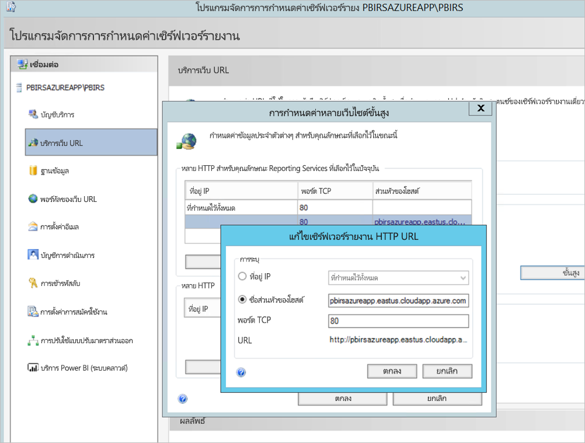

1. <span data-ttu-id="fe84b-119">เราดำเนินการขั้นตอนก่อนหน้าสำหรับทั้งการ Web Service และ Web portal และได้มี Url ที่ลงทะเบียนไว้ในตัวจัดการการกำหนดค่าเซิร์ฟเวอร์รายงาน:</span><span class="sxs-lookup"><span data-stu-id="fe84b-119">We performed the previous step for both Web service and Web portal section and got the URLs registered on the report server Configuration Manager:</span></span>

    - `https://pbirsazureapp.eastus.cloudapp.azure.com/ReportServer`
    - `https://pbirsazureapp.eastus.cloudapp.azure.com/Reports`

2. <span data-ttu-id="fe84b-120">ในพอร์ทัล Azure เราเห็นสอง IP แอดเดรสสำหรับ VM ในส่วนระบบเครือข่าย</span><span class="sxs-lookup"><span data-stu-id="fe84b-120">In Azure portal we see two IP addresses for the VM in the networking section</span></span> 

    - <span data-ttu-id="fe84b-121">**IP สาธารณะ**</span><span class="sxs-lookup"><span data-stu-id="fe84b-121">**Public IP**.</span></span> 
    - <span data-ttu-id="fe84b-122">**ส่วนบุคคล**.</span><span class="sxs-lookup"><span data-stu-id="fe84b-122">**Private IP**.</span></span> 
    
    <span data-ttu-id="fe84b-123">ที่อยู่ IP สาธารณะใช้สำหรับการเข้าถึงจากภายนอกเครื่องเสมือน</span><span class="sxs-lookup"><span data-stu-id="fe84b-123">The Public IP address is used for access from outside the virtual machine.</span></span>

3. <span data-ttu-id="fe84b-124">ดังนั้นเราจึงเพิ่มรายการไฟล์โฮสต์บน VM (เซิร์ฟเวอร์รายงาน Power BI) เพื่อรวมที่อยู่ IP สาธารณะและชื่อโฮสต์ไว้ `pbirsazureapp.eastus.cloudapp.azure.com`</span><span class="sxs-lookup"><span data-stu-id="fe84b-124">Hence, we added the host file entry on the VM (Power BI Report Server) to include the Public IP address and the host name `pbirsazureapp.eastus.cloudapp.azure.com`.</span></span>
4. <span data-ttu-id="fe84b-125">โปรดทราบว่าในการเริ่มต้นใช้งาน VM ที่อยู่ IP แบบไดนามิกอาจเปลี่ยนแปลงและคุณอาจจำเป็นต้องเพิ่ม IP แอดเดรสที่ถูกต้องอีกครั้งในไฟล์โฮสต์</span><span class="sxs-lookup"><span data-stu-id="fe84b-125">Note that on restarting the VM, the dynamic IP address might change, and you may have to add the right IP address again in the host file.</span></span> <span data-ttu-id="fe84b-126">เพื่อหลีกเลี่ยงปัญหานี้คุณสามารถตั้งค่า IP แอดเดรสสาธารณะเป็นแบบสแตติกในพอร์ทัล Azure</span><span class="sxs-lookup"><span data-stu-id="fe84b-126">To avoid this, you can set the Public IP address to static in the Azure portal.</span></span>
5. <span data-ttu-id="fe84b-127">ต้องสามารถเข้าถึง Url ของ Web Service และพอร์ทัลของเว็บได้สำเร็จหลังจากทำการเปลี่ยนแปลงที่กล่าวถึงข้างต้น</span><span class="sxs-lookup"><span data-stu-id="fe84b-127">The Web service and Web portal URLs should be accessible successfully after making the above-mentioned changes.</span></span>
6. <span data-ttu-id="fe84b-128">ในการเข้าถึง URL `https://pbirsazureapp.eastus.cloudapp.azure.com/ReportServer` บนเซิร์ฟเวอร์เราจะได้รับพร้อมท์สามครั้งสำหรับข้อมูลประจำตัวและดูหน้าจอว่างเปล่า</span><span class="sxs-lookup"><span data-stu-id="fe84b-128">On accessing the URL `https://pbirsazureapp.eastus.cloudapp.azure.com/ReportServer` on the server, we're prompted three times for credentials, and see a blank screen.</span></span>
7. <span data-ttu-id="fe84b-129">เพิ่มรายการรีจิสทรีต่อไปนี้:</span><span class="sxs-lookup"><span data-stu-id="fe84b-129">Add the following registry entry:</span></span>

    <span data-ttu-id="fe84b-130">`HKEY\_LOCAL\_MACHINE \SYSTEM\CurrentControlset\Control \Lsa\ MSV1\_0` รีจิสทรีคีย์</span><span class="sxs-lookup"><span data-stu-id="fe84b-130">`HKEY\_LOCAL\_MACHINE \SYSTEM\CurrentControlset\Control \Lsa\ MSV1\_0` registry key</span></span>

1. <span data-ttu-id="fe84b-131">เพิ่มค่าใหม่ `BackConnectionHostNames`ค่าหลายสตริงและใส่ชื่อโฮสต์ `pbirsazureapp.eastus.cloudapp.azure.com`</span><span class="sxs-lookup"><span data-stu-id="fe84b-131">Add a new value `BackConnectionHostNames`, a multi-string value, and provide the host name `pbirsazureapp.eastus.cloudapp.azure.com`.</span></span>

<span data-ttu-id="fe84b-132">หลังจากนั้นเราสามารถเข้าถึง Url บนเซิร์ฟเวอร์ได้เช่นกัน</span><span class="sxs-lookup"><span data-stu-id="fe84b-132">After that, we can access the URLs on the server as well.</span></span>

## <a name="configure-power-bi-report-server-to-work-with-kerberos"></a><span data-ttu-id="fe84b-133">กำหนดค่าเซิร์ฟเวอร์รายงาน Power BI เพื่อให้ทำงานกับ Kerberos ได้</span><span class="sxs-lookup"><span data-stu-id="fe84b-133">Configure Power BI Report Server to work with Kerberos</span></span>

### <a name="1-configure-the-authentication-type"></a><span data-ttu-id="fe84b-134">1. การกำหนดค่าชนิดการรับรองความถูกต้อง</span><span class="sxs-lookup"><span data-stu-id="fe84b-134">1. Configure the authentication type</span></span>

<span data-ttu-id="fe84b-135">เราจำเป็นต้องกำหนดค่าชนิดการรับรองความถูกต้องสำหรับเซิร์ฟเวอร์รายงานเพื่ออนุญาตให้สามารถรับมอบสิทธิ์ Kerberos ที่บังคับได้</span><span class="sxs-lookup"><span data-stu-id="fe84b-135">We need to configure the authentication type for the report server to allow for Kerberos constrained delegation.</span></span> <span data-ttu-id="fe84b-136">ซึ่งทำได้ภายในไฟล์ **rsreportserver.config**</span><span class="sxs-lookup"><span data-stu-id="fe84b-136">This configuring is done within the **rsreportserver.config** file.</span></span>

<span data-ttu-id="fe84b-137">ภายในไฟล์ rsreportserver.config คุณจะต้องการปรับค่าส่วน **รับรองความถูกต้อง/AuthenticationTypes** ให้เหมาะสมยิ่งขึ้น</span><span class="sxs-lookup"><span data-stu-id="fe84b-137">Within the rsreportserver.config file, find the **Authentication/AuthenticationTypes** section.</span></span>

<span data-ttu-id="fe84b-138">เราต้องตรวจสอบให้แน่ใจว่า RSWindowsNegotiate อยู่ในรายการและเป็นส่วนแรกในรายการของชนิดการรับรองความถูกต้อง</span><span class="sxs-lookup"><span data-stu-id="fe84b-138">We want to make sure that RSWindowsNegotiate is listed and is first in the list of authentication types.</span></span> <span data-ttu-id="fe84b-139">ซึ่งควรมีลักษณะคล้ายต่อไปนี้</span><span class="sxs-lookup"><span data-stu-id="fe84b-139">It should look similar to the following.</span></span>

```
<AuthenticationTypes>

    <RSWindowsNegotiate/>

</AuthenticationTypes>
```

<span data-ttu-id="fe84b-140">ถ้าคุณจำเป็นต้องเปลี่ยนแปลงแฟ้มการกำหนดค่า **หยุดและเริ่มบริการ** เซิร์ฟเวอร์รายงานจากโปรแกรมจัดการการกำหนดค่าเซิร์ฟเวอร์รายงานเพื่อตรวจสอบให้แน่ใจว่าการเปลี่ยนแปลงจะมีผล</span><span class="sxs-lookup"><span data-stu-id="fe84b-140">If you have to change the configuration file, **stop and restart the report server** service from Report Server Configuration Manager to make sure the changes take effect.</span></span>

### <a name="2-register-service-principal-names-spns"></a><span data-ttu-id="fe84b-141">2. ลงทะเบียนชื่อบริการหลัก (SPNs)</span><span class="sxs-lookup"><span data-stu-id="fe84b-141">2. Register service principal names (SPNs)</span></span>

<span data-ttu-id="fe84b-142">เปิดพร้อมท์คำสั่งในฐานะผู้ดูแลระบบและดำเนินการตามขั้นตอนต่อไปนี้</span><span class="sxs-lookup"><span data-stu-id="fe84b-142">Open the command prompt as an administrator and perform the following steps.</span></span>

<span data-ttu-id="fe84b-143">ลงทะเบียน SPN ต่อไปนี้ภายใต้บัญชี **บัญชีบริการเซิร์ฟเวอร์รายงาน Power BI** โดยใช้คำสั่งต่อไปนี้</span><span class="sxs-lookup"><span data-stu-id="fe84b-143">Register the following SPNs under the account **Power BI Report Server service account** using the following commands</span></span>

```
setspn -s http/ Netbios name\_of\_Power BI Report Server\_server<space> Power BI Report Server\_ServiceAccount

setspn -s http/ FQDN\_of Power BI Report Server\_server<space> Power BI Report Server\_ServiceAccount
```

<span data-ttu-id="fe84b-144">ลงทะเบียน SPN ต่อไปนี้ภายใต้บัญชีบัญชีบริการเซิร์ฟเวอร์รายงาน Power BI โดยใช้คำสั่งต่อไปนี้</span><span class="sxs-lookup"><span data-stu-id="fe84b-144">Register the following SPNs under the SQL Server service account using the following commands (for a default instance of SQL Server):</span></span>

```
setspn -s MSSQLSVC/FQDN\_of\_SQL\_Server: 1433 (PortNumber) <SQL service service account>

setspn -s MSSQLSVC/FQDN\_of\_SQL\_Server<SQL service service account>
```

### <a name="3-configure-delegation-settings"></a><span data-ttu-id="fe84b-145">3. กำหนดค่าการตั้งค่าการมอบหมาย</span><span class="sxs-lookup"><span data-stu-id="fe84b-145">3. Configure delegation settings</span></span>

<span data-ttu-id="fe84b-146">ส่วนสุดท้ายที่เราจำเป็นต้องกำหนดค่าคือการตั้งค่าการรับมอบสิทธิ์บนบัญชีผู้ใช้บริการเซิร์ฟเวอร์รายงาน</span><span class="sxs-lookup"><span data-stu-id="fe84b-146">We have to configure the delegation settings on the report server service account.</span></span>

1. <span data-ttu-id="fe84b-147">ผู้ใช้ active Directory และคอมพิวเตอร์</span><span class="sxs-lookup"><span data-stu-id="fe84b-147">Open Active Directory Users and Computers.</span></span>
2. <span data-ttu-id="fe84b-148">คุณจะต้องเริ่มต้นโดยไปที่คุณสมบัติของบัญชีผู้ใช้บริการเซิร์ฟเวอร์รายงานภายในผู้ใช้ Active Directory และคอมพิวเตอร์</span><span class="sxs-lookup"><span data-stu-id="fe84b-148">Open the Properties of the report server service account within Active Directory Users and Computers.</span></span>
3. <span data-ttu-id="fe84b-149">เราจะต้องกำหนดค่าการมอบสิทธิ์ที่บังคับด้วยโปรโตคอลการส่งผ่าน</span><span class="sxs-lookup"><span data-stu-id="fe84b-149">We want to configure constrained delegation with protocol transiting.</span></span> <span data-ttu-id="fe84b-150">สำหรับการรับมอบสิทธิ์ทีี่บังคับ คุณต้องมีความชัดเจนว่าบริการใดที่คุณต้องการมอบหมาย</span><span class="sxs-lookup"><span data-stu-id="fe84b-150">With constrained delegation, we need to be explicit about which services we want to delegate to.</span></span>
4. <span data-ttu-id="fe84b-151">คลิกขวาที่ **บัญชีบริการเซิร์ฟเวอร์รายงาน** และเลือก **คุณสมบัติ**</span><span class="sxs-lookup"><span data-stu-id="fe84b-151">Right click the **report server service account** and select **Properties**.</span></span>
5. <span data-ttu-id="fe84b-152">เลือกแถบ **การมอบหมาย**</span><span class="sxs-lookup"><span data-stu-id="fe84b-152">Select the **Delegation** tab.</span></span>
6. <span data-ttu-id="fe84b-153">เลือก **เชื่อถือผู้ใช้รายนี้สำหรับการรับมอบสิทธิ์ไปยังบริการที่ระบุเท่านั้น**</span><span class="sxs-lookup"><span data-stu-id="fe84b-153">Select **Trust this user for delegation to specified services only**.</span></span>
7. <span data-ttu-id="fe84b-154">เลือก **ใช้โปรโตคอลรับรองความถูกต้องใดก็ได้**</span><span class="sxs-lookup"><span data-stu-id="fe84b-154">Select **Use any authentication protocol**.</span></span>
8. <span data-ttu-id="fe84b-155">ภายใต้ **บริการที่บัญชีผู้ใช้นี้สามารถใช้ข้อมูลประจำตัวที่ได้รับมอบหมาย:** เลือก **เพิ่ม**</span><span class="sxs-lookup"><span data-stu-id="fe84b-155">Under the **Services to which this account can present delegated credentials** : select **Add**.</span></span>
9. <span data-ttu-id="fe84b-156">ในกล่องโต้ตอบใหม่ เลือก **ผู้ใช้หรือคอมพิวเตอร์**</span><span class="sxs-lookup"><span data-stu-id="fe84b-156">In the new dialog, select **Users or Computers**.</span></span>
10. <span data-ttu-id="fe84b-157">ป้อนบัญชีบริการ **สำหรับบริการเซิร์ฟเวอร์ SQL** และเลือก **ตกลง**</span><span class="sxs-lookup"><span data-stu-id="fe84b-157">Enter the **service account for the SQL server service** and select **OK**.</span></span>

    <span data-ttu-id="fe84b-158">ซึ่งเริ่มต้นด้วย MSSQLSVC</span><span class="sxs-lookup"><span data-stu-id="fe84b-158">It begins with MSSQLSVC.</span></span>

1. <span data-ttu-id="fe84b-159">เพิ่มการ SPNs</span><span class="sxs-lookup"><span data-stu-id="fe84b-159">Add the SPNs.</span></span>
2. <span data-ttu-id="fe84b-160">เลือก **ตกลง**</span><span class="sxs-lookup"><span data-stu-id="fe84b-160">Select **OK**.</span></span> <span data-ttu-id="fe84b-161">คุณควรเห็น SPN ในรายการแล้วตอนนี้</span><span class="sxs-lookup"><span data-stu-id="fe84b-161">You should see the SPN in the list now.</span></span>

<span data-ttu-id="fe84b-162">ขั้นตอนเหล่านี้ช่วยกำหนดค่าเซิร์ฟเวอร์รายงาน Power BI ให้ทำงานกับกลไกการพิสูจน์ตัวตน Kerberos และรับการเชื่อมต่อทดสอบกับแหล่งข้อมูลที่ทำงานบนเครื่องท้องถิ่นของคุณ</span><span class="sxs-lookup"><span data-stu-id="fe84b-162">These steps help configure Power BI Report Server to work with Kerberos authentication mechanism and get the test connection to data source working on your local machine.</span></span>

## <a name="configure-azure-application-proxy-connector"></a><span data-ttu-id="fe84b-163">กำหนดค่าพร็อกซีแอปพลิเคชัน  Azure</span><span class="sxs-lookup"><span data-stu-id="fe84b-163">Configure Azure Application Proxy connector</span></span>

<span data-ttu-id="fe84b-164">อ้างอิงไปยังบทความสำหรับการกำหนดค่า [ที่เกี่ยวข้องกับตัวเชื่อมต่อพร็อกซีโปรแกรมประยุกต์](/azure/active-directory/manage-apps/application-proxy-add-on-premises-application#add-an-on-premises-app-to-azure-ad)</span><span class="sxs-lookup"><span data-stu-id="fe84b-164">Refer to the article for [configuration related to Application Proxy connector](/azure/active-directory/manage-apps/application-proxy-add-on-premises-application#add-an-on-premises-app-to-azure-ad)</span></span>

<span data-ttu-id="fe84b-165">เราได้ติดตั้งตัวเชื่อมต่อพร็อกซีแอปพลิเคชันบนเซิร์ฟเวอร์รายงาน Power BI แต่คุณสามารถกำหนดค่าบนเซิร์ฟเวอร์แยกต่างหากและตรวจสอบให้แน่ใจว่าได้ตั้งค่าการมอบหมายอย่างถูกต้อง</span><span class="sxs-lookup"><span data-stu-id="fe84b-165">We installed Application Proxy connector on Power BI Report Server, but you can configure it on a separate server and make sure that delegation is set up properly.</span></span>

### <a name="ensure-the-connector-is-trusted-for-delegation"></a><span data-ttu-id="fe84b-166">ตรวจสอบให้แน่ใจว่าตัวเชื่อมต่อที่เชื่อถือได้สำหรับการมอบหมาย</span><span class="sxs-lookup"><span data-stu-id="fe84b-166">Ensure the Connector is trusted for delegation</span></span>

<span data-ttu-id="fe84b-167">ตรวจสอบให้แน่ใจว่าตัวเชื่อมต่อได้รับการเชื่อถือสำหรับการมอบหมายไปยัง SPN ที่เพิ่มไปยังบัญชีพูลโปรแกรมประยุกต์ของเซิร์ฟเวอร์รายงาน</span><span class="sxs-lookup"><span data-stu-id="fe84b-167">Ensure the Connector is trusted for delegation to the SPN added to the report server application pool account.</span></span>

<span data-ttu-id="fe84b-168">กำหนดค่าการมอบหมายที่มีข้อจำกัดของ Kerberos (KCD) เพื่อให้บริการพร็อกซีโปรแกรมประยุกต์ Azure AD สามารถมอบหมายข้อมูลเฉพาะตัวของผู้ใช้ไปยังบัญชีพูลโปรแกรมประยุกต์ของเซิร์ฟเวอร์รายงาน</span><span class="sxs-lookup"><span data-stu-id="fe84b-168">Configure Kerberos Constrained Delegation (KCD) so that the Azure AD Application Proxy service can delegate user identities to the report server application pool account.</span></span> <span data-ttu-id="fe84b-169">กำหนดค่า KCD โดยการเปิดใช้งานตัวเชื่อมต่อพร็อกซีแอปพลิเคชันเพื่อดึงข้อมูลตั๋ว Kerberos สำหรับผู้ใช้ของคุณที่ได้รับการรับรองความถูกต้องใน Azure AD</span><span class="sxs-lookup"><span data-stu-id="fe84b-169">Configure KCD by enabling the Application Proxy connector to retrieve Kerberos tickets for your users who have been authenticated in Azure AD.</span></span> <span data-ttu-id="fe84b-170">จากนั้นเซิร์ฟเวอร์จะส่งผ่านบริบทไปยังแอปพลิเคชันเป้าหมายหรือเซิร์ฟเวอร์รายงาน Power BI ในกรณีนี้</span><span class="sxs-lookup"><span data-stu-id="fe84b-170">Then that server passes the context to the target application, or Power BI Report Server in this case.</span></span>

<span data-ttu-id="fe84b-171">ในการกำหนดค่า KCD ให้ทำซ้ำขั้นตอนต่อไปนี้สำหรับแต่ละเครื่องเชื่อมต่อ</span><span class="sxs-lookup"><span data-stu-id="fe84b-171">To configure KCD, repeat the following steps for each connector machine.</span></span>

1. <span data-ttu-id="fe84b-172">ลงชื่อเข้าใช้ตัวควบคุมโดเมนในฐานะผู้ดูแลโดเมนจากนั้นเปิด **ผู้ใช้ Active Directory และคอมพิวเตอร์ที่ใช้งานอยู่**</span><span class="sxs-lookup"><span data-stu-id="fe84b-172">Sign into a domain controller as a domain administrator, and then open **Active Directory Users and Computers**.</span></span>
2. <span data-ttu-id="fe84b-173">ค้นหาคอมพิวเตอร์ที่ตัวเชื่อมต่อกำลังทำงานอยู่</span><span class="sxs-lookup"><span data-stu-id="fe84b-173">Find the computer that the connector is running on.</span></span>
3. <span data-ttu-id="fe84b-174">ดับเบิลคลิกที่คอมพิวเตอร์จากนั้นเลือกแท็บ **การรับมอบสิทธิ์**</span><span class="sxs-lookup"><span data-stu-id="fe84b-174">Double-click the computer, and then select the **Delegation** tab.</span></span>
4. <span data-ttu-id="fe84b-175">เลือก **เชื่อถือคอมพิวเตอร์เครื่องนี้สำหรับการรับมอบสิทธิ์ไปยังบริการที่ระบุเท่านั้น**</span><span class="sxs-lookup"><span data-stu-id="fe84b-175">Set the delegation settings to **Trust this computer for delegation to the specified services only**.</span></span> <span data-ttu-id="fe84b-176">แล้วให้เลือก **ใช้โปรโตคอลรับรองความถูกต้องใดก็ได้**</span><span class="sxs-lookup"><span data-stu-id="fe84b-176">Then select **Use any authentication protocol**.</span></span>
5. <span data-ttu-id="fe84b-177">เลือก **เพิ่ม** จากนั้นเลือก **ผู้ใช้หรือคอมพิวเตอร์**</span><span class="sxs-lookup"><span data-stu-id="fe84b-177">Select **Add**, and then select **Users or Computers**.</span></span>
6. <span data-ttu-id="fe84b-178">ป้อนบัญชีบริการที่คุณใช้สำหรับเซิร์ฟเวอร์รายงาน Power BI</span><span class="sxs-lookup"><span data-stu-id="fe84b-178">Enter the service account that you're using for Power BI Report Server.</span></span> <span data-ttu-id="fe84b-179">บัญชีนี้คือบัญชีที่คุณเพิ่ม SPN เข้าไปภายในการกำหนดค่า Reporting Services</span><span class="sxs-lookup"><span data-stu-id="fe84b-179">This account is the one you added the SPN to within the report server configuration.</span></span>
7. <span data-ttu-id="fe84b-180">คลิก **ตกลง**</span><span class="sxs-lookup"><span data-stu-id="fe84b-180">Click **OK**.</span></span> 
8. <span data-ttu-id="fe84b-181">หากต้องการบันทึกการเปลี่ยนแปลงให้คลิก **ตกลง** อีกครั้ง</span><span class="sxs-lookup"><span data-stu-id="fe84b-181">To save the changes, click **OK** again.</span></span>

## <a name="publish-through-azure-ad-application-proxy"></a><span data-ttu-id="fe84b-182">เผยแพร่ผ่านพร็อกซีแอปพลิเคชัน Azure AD</span><span class="sxs-lookup"><span data-stu-id="fe84b-182">Publish through Azure AD Application Proxy</span></span>

<span data-ttu-id="fe84b-183">คุณพร้อมที่จะกำหนดค่าพร็อกซีแอปพลิเคชัน Azure AD แล้วตอนนี้</span><span class="sxs-lookup"><span data-stu-id="fe84b-183">Now you're ready to configure Azure AD Application Proxy.</span></span>

<span data-ttu-id="fe84b-184">เผยแพร่เซิร์ฟเวอร์รายงาน Power BI ผ่านพร็อกซีแอปพลิเคชันด้วยการตั้งค่าต่อไปนี้</span><span class="sxs-lookup"><span data-stu-id="fe84b-184">Publish Power BI Report Server through Application Proxy with the following settings.</span></span> <span data-ttu-id="fe84b-185">สำหรับคำแนะนำทีละขั้นตอนเกี่ยวกับวิธีเผยแพร่แอปพลิเคชันผ่านพร็อกซีแอปพลิเคชันโปรดดู[ การเผยแพร่แอปพลิเคชันโดยใช้พร็อกซีแอปพลิเคชัน  Azure AD](/azure/active-directory/manage-apps/application-proxy-add-on-premises-application#add-an-on-premises-app-to-azure-ad)</span><span class="sxs-lookup"><span data-stu-id="fe84b-185">For step-by-step instructions on how to publish an application through Application Proxy, see [Publishing applications using Azure AD Application Proxy](/azure/active-directory/manage-apps/application-proxy-add-on-premises-application#add-an-on-premises-app-to-azure-ad).</span></span>

- <span data-ttu-id="fe84b-186">**URL ภายนอก** : ป้อน URL ไปยังเซิร์ฟเวอร์รายงานที่ตัวเชื่อมต่อสามารถเข้าถึงได้ในเครือข่ายขององค์กร</span><span class="sxs-lookup"><span data-stu-id="fe84b-186">**Internal URL** : Enter the URL to the report server that the connector can reach in the corporate network.</span></span> <span data-ttu-id="fe84b-187">ตรวจสอบให้แน่ใจว่า URL นี้ไม่สามารถเข้าถึงได้จากเซิร์ฟเวอร์ที่มีการติดตั้งตัวเชื่อมต่อ</span><span class="sxs-lookup"><span data-stu-id="fe84b-187">Make sure this URL is reachable from the server the connector is installed on.</span></span> <span data-ttu-id="fe84b-188">แนวทางปฏิบัติที่เหมาะสมที่สุดคือการใช้โดเมนระดับบนสุดเช่น `https://servername/` เพื่อหลีกเลี่ยงปัญหาเกี่ยวกับพาธย่อยที่เผยแพร่ผ่านพร็อกซีแอปพลิเคชัน</span><span class="sxs-lookup"><span data-stu-id="fe84b-188">A best practice is using a top-level domain such as `https://servername/` to avoid issues with subpaths published through Application Proxy.</span></span> <span data-ttu-id="fe84b-189">ตัวอย่างเช่นใช้ `https://servername/` และไม่ใช่ `https://servername/reports/` หรือ `https://servername/reportserver/`</span><span class="sxs-lookup"><span data-stu-id="fe84b-189">For example, use `https://servername/` and not `https://servername/reports/` or `https://servername/reportserver/`.</span></span> <span data-ttu-id="fe84b-190">เราได้กำหนดค่าสภาพแวดล้อมของเราด้วย `https://pbirsazureapp.eastus.cloudapp.azure.com/`</span><span class="sxs-lookup"><span data-stu-id="fe84b-190">We've configured our environment with `https://pbirsazureapp.eastus.cloudapp.azure.com/`.</span></span>

    > [!NOTE]
    > <span data-ttu-id="fe84b-191">เราขอแนะนำให้ใช้การเชื่อมต่อ HTTPS ที่ปลอดภัยไปยังเซิร์ฟเวอร์รายงาน</span><span class="sxs-lookup"><span data-stu-id="fe84b-191">We recommend using a secure HTTPS connection to the report server.</span></span> <span data-ttu-id="fe84b-192">โปรดดู [การกำหนดค่าการเชื่อมต่อ SSL บนเซิร์ฟเวอร์รายงานโหมดดั้งเดิม](/sql/reporting-services/security/configure-ssl-connections-on-a-native-mode-report-server) สำหรับข้อมูลวิธีการ</span><span class="sxs-lookup"><span data-stu-id="fe84b-192">See [Configure SSL connections on a native mode report server](/sql/reporting-services/security/configure-ssl-connections-on-a-native-mode-report-server) for how-to information.</span></span>

- <span data-ttu-id="fe84b-193">**URL ภายนอก** ป้อน URL สาธารณะที่แอป Power BI สำหรับอุปกรณ์เคลื่อนที่จะเชื่อมต่อ</span><span class="sxs-lookup"><span data-stu-id="fe84b-193">**External URL** : Enter the public URL the Power BI mobile app will connect to.</span></span> <span data-ttu-id="fe84b-194">ตัวอย่างเช่นอาจ มีลักษณะเช่น `https://reports.contoso.com` ถ้ามีการใช้โดเมนแบบกำหนดเอง</span><span class="sxs-lookup"><span data-stu-id="fe84b-194">For example, it may look like `https://reports.contoso.com` if a custom domain is used.</span></span> <span data-ttu-id="fe84b-195">หากต้องการใช้โดเมนแบบกำหนดเอง ให้อัปโหลดใบรับรองสำหรับโดเมนและชี้ระเบียน DNS ไปยังโดเมน msappproxy.net เริ่มต้นสำหรับแอปพลิเคชันของคุณ</span><span class="sxs-lookup"><span data-stu-id="fe84b-195">To use a custom domain, upload a certificate for the domain, and point a DNS record to the default msappproxy.net domain for your application.</span></span> <span data-ttu-id="fe84b-196">สำหรับขั้นตอนโดยละเอียด ให้ดูที่การ[ทำงานด้วยโดเมนแบบกำหนดเองในพร็อกซีแอปพลิเคชัน Azure AD](/azure/active-directory/manage-apps/application-proxy-configure-custom-domain)</span><span class="sxs-lookup"><span data-stu-id="fe84b-196">For detailed steps, see [Working with custom domains in Azure AD Application Proxy](/azure/active-directory/manage-apps/application-proxy-configure-custom-domain).</span></span>

<span data-ttu-id="fe84b-197">เราได้กำหนดค่า URL ภายนอกให้เป็น `https://pbirsazureapp-umacontoso2410.msappproxy.net/` สำหรับสภาพแวดล้อมของเรา</span><span class="sxs-lookup"><span data-stu-id="fe84b-197">We've configured the external URL to be `https://pbirsazureapp-umacontoso2410.msappproxy.net/` for our environment.</span></span>

- <span data-ttu-id="fe84b-198">**วิธีการรับรองความถูกต้องล่วงหน้า**: Azure Active Directory</span><span class="sxs-lookup"><span data-stu-id="fe84b-198">**Pre-authentication Method**: Azure Active Directory.</span></span>
- <span data-ttu-id="fe84b-199">**กลุ่มตัวเชื่อมต่อ:** ค่าเริ่มต้น</span><span class="sxs-lookup"><span data-stu-id="fe84b-199">**Connector Group:** Default.</span></span>

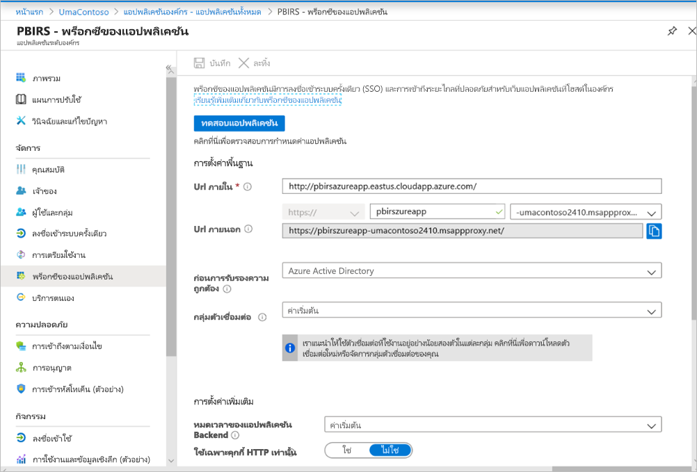

<span data-ttu-id="fe84b-201">เรายังไม่ได้ทำการเปลี่ยนแปลงใดๆ ในส่วน **การตั้งค่าเพิ่มเติม**</span><span class="sxs-lookup"><span data-stu-id="fe84b-201">We haven't made any changes in the **Additional Settings** section.</span></span> <span data-ttu-id="fe84b-202">ซึ่งได้รับการกำหนดค่าให้ทำงานกับตัวเลือกเริ่มต้น</span><span class="sxs-lookup"><span data-stu-id="fe84b-202">It's configured to work with the default options.</span></span>

> [!IMPORTANT]
> <span data-ttu-id="fe84b-203">เมื่อกำหนดค่าพร็อกซีแอปพลิเคชัน โปรดทราบว่าคุณสมบัติ **การหมดเวลาของแอปพลิเคชันหลังบ้าน** ถูกตั้งค่าเป็น **ค่าเริ่มต้น** (85 วินาที)</span><span class="sxs-lookup"><span data-stu-id="fe84b-203">When configuring the application proxy, note that the **Backend Application Timeout** property is set to **Default** (85 seconds).</span></span> <span data-ttu-id="fe84b-204">ถ้าคุณมีรายงานที่ใช้เวลานานกว่า 85 วินาทีในการดำเนิน ให้ตั้งค่าคุณสมบัตินี้เป็น **ยาว** (180 วินาที) ซึ่งเป็นค่าการหมดเวลาที่เป็นไปได้สูงสุด</span><span class="sxs-lookup"><span data-stu-id="fe84b-204">If you have reports that take longer than 85 seconds to execute, set this property to **Long** (180 seconds), which is the highest possible timeout value.</span></span> <span data-ttu-id="fe84b-205">เมื่อกำหนดค่าเป็น **ยาว** แล้วรายงานทั้งหมดจะต้องดำเนินการให้เสร็จสมบูรณ์ภายใน 180 วินาทีหรือไม่เช่นนั้นจะหมดเวลาและส่งผลให้เกิดข้อผิดพลาด</span><span class="sxs-lookup"><span data-stu-id="fe84b-205">When configured for **Long**, all reports need to complete within 180 seconds or they time out and result in an error.</span></span>


### <a name="configure-single-sign-on"></a><span data-ttu-id="fe84b-207">กำหนดค่าการลงชื่อเข้าระบบครั้งเดียว</span><span class="sxs-lookup"><span data-stu-id="fe84b-207">Configure single sign-on</span></span>

<span data-ttu-id="fe84b-208">เมื่อแอปของคุณได้รับการเผยแพร่ ให้กำหนดค่าการตั้งค่าการลงชื่อเข้าระบบครั้งเดียวด้วยขั้นตอนต่อไปนี้:</span><span class="sxs-lookup"><span data-stu-id="fe84b-208">Once your app is published, configure the single sign-on settings with the following steps:</span></span>

1. <span data-ttu-id="fe84b-209">บนหน้าแอปพลิเคชันในพอร์ทัล เลือก **การลงชื่อเข้าระบบครั้งเดียว**</span><span class="sxs-lookup"><span data-stu-id="fe84b-209">On the application page in the portal, select **Single sign-on**.</span></span>
2. <span data-ttu-id="fe84b-210">สำหรับ **โหมดการลงชื่อเข้าระบบเพียงครั้งเดียว** ให้เลือก **การรับรองความถูกต้องของ Windows แบบรวม**</span><span class="sxs-lookup"><span data-stu-id="fe84b-210">For **Single Sign-on Mode**, select **Integrated Windows Authentication**.</span></span>
3. <span data-ttu-id="fe84b-211">ตั้งค่า **SPN แอปพลิเคชันภายใน** เป็นค่าที่คุณตั้งค่าไว้ก่อนหน้านี้</span><span class="sxs-lookup"><span data-stu-id="fe84b-211">Set **Internal Application SPN** to the value that you set earlier.</span></span> <span data-ttu-id="fe84b-212">คุณสามารถระบุค่านี้ได้โดยใช้ขั้นตอนต่อไปนี้:</span><span class="sxs-lookup"><span data-stu-id="fe84b-212">You can identify this value by using the following steps:</span></span>

    - <span data-ttu-id="fe84b-213">ลองเรียกใช้รายงานหรือดำเนินการทดสอบการเชื่อมต่อไปยังแหล่งข้อมูลเพื่อให้ตั๋ว Kerberos ได้รับการสร้างขึ้น</span><span class="sxs-lookup"><span data-stu-id="fe84b-213">Try running a report or perform test connection to data source so that a Kerberos ticket gets created.</span></span>
    - <span data-ttu-id="fe84b-214">หลังจากดำเนินการเชื่อมต่อรายงาน/ทดสอบการเชื่อมต่อ, เปิด command พร้อมท์, แล้วเรียกใช้คำสั่ง command นี้: `klist`</span><span class="sxs-lookup"><span data-stu-id="fe84b-214">After successful execution of the report/ test connection, open command prompt and run the command: `klist`.</span></span> <span data-ttu-id="fe84b-215">ในส่วนผลลัพธ์ คุณควรเห็นตั๋วที่มี `http/` SPN</span><span class="sxs-lookup"><span data-stu-id="fe84b-215">In the result section, you should see a ticket with `http/` SPN.</span></span> <span data-ttu-id="fe84b-216">ถ้าเหมือนกับ SPN ที่คุณได้กำหนดค่าด้วยเซิร์ฟเวอร์รายงาน Power BI ให้ใช้ SPN ดังกล่าวในส่วนนี้</span><span class="sxs-lookup"><span data-stu-id="fe84b-216">If it's same as the SPN you have configured with Power BI Report Server, use that SPN in this section.</span></span>

1. <span data-ttu-id="fe84b-217">เลือก **ข้อมูลประจำตัวของการเข้าสู่ระบบที่ได้รับมอบสิทธิ์** สำหรับตัวเชื่อมต่อที่จะใช้ในนามของผู้ใช้ของคุณ</span><span class="sxs-lookup"><span data-stu-id="fe84b-217">Choose the **Delegated Login Identity** for the connector to use on behalf of your users.</span></span> <span data-ttu-id="fe84b-218">สำหรับข้อมูลเพิ่มเติม โปรดดูที่[การทำงานกับข้อมูลประจำตัวในองค์กรและคลาวด์ที่แตกต่างกัน](/azure/active-directory/manage-apps/application-proxy-configure-single-sign-on-with-kcd#working-with-different-on-premises-and-cloud-identities)</span><span class="sxs-lookup"><span data-stu-id="fe84b-218">For more information, see [Working with different on-premises and cloud identities](/azure/active-directory/manage-apps/application-proxy-configure-single-sign-on-with-kcd#working-with-different-on-premises-and-cloud-identities).</span></span>

    <span data-ttu-id="fe84b-219">เราขอแนะนำให้ใช้ชื่อหลักของผู้ใช้</span><span class="sxs-lookup"><span data-stu-id="fe84b-219">We recommend using User Principal name.</span></span> <span data-ttu-id="fe84b-220">ในตัวอย่างของเรา เราได้กำหนดให้ทำงานกับตัวเลือก **ชื่อหลักของผู้ใช้**:</span><span class="sxs-lookup"><span data-stu-id="fe84b-220">In our sample, we configured it to work with **User Principal name** option:</span></span>

    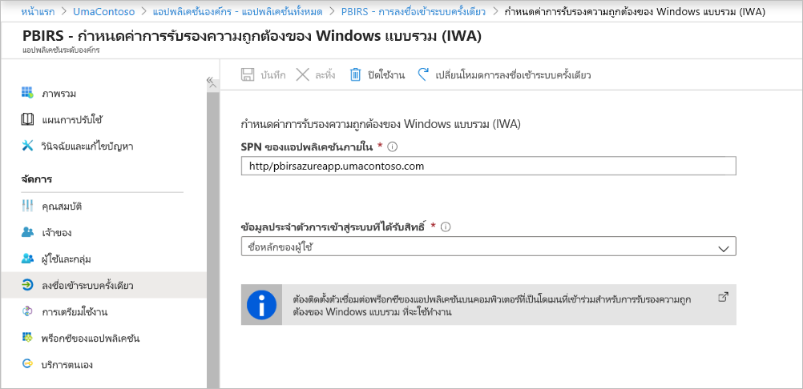

1. <span data-ttu-id="fe84b-222">เลือก **บันทึก** เพื่อบันทึกการเปลี่ยนแปลงของคุณ</span><span class="sxs-lookup"><span data-stu-id="fe84b-222">Click **Save** to save your changes.</span></span>

### <a name="finish-setting-up-your-application"></a><span data-ttu-id="fe84b-223">ตั้งค่าแอปพลิเคชันของคุณให้เสร็จสมบูรณ์</span><span class="sxs-lookup"><span data-stu-id="fe84b-223">Finish setting up your application</span></span>

<span data-ttu-id="fe84b-224">เพื่อดำเนินการการตั้งค่าแอปพลิเคชันของคุณให้เสร็จสิ้น ให้ไปที่ส่วน **ผู้ใช้และกลุ่ม** และกำหนดผู้ใช้เพื่อเข้าถึงแอปพลิเคชันนี้</span><span class="sxs-lookup"><span data-stu-id="fe84b-224">To finish setting up your application, go to the **Users and groups** section and assign users to access this application.</span></span>

1. <span data-ttu-id="fe84b-225">กำหนดค่าส่วน **การรับรองความถูกต้อง** ของการลงทะเบียนแอปพลิเคชันที่เซิร์ฟเวอร์รายงาน Power BI ดังต่อไปนี้สำหรับการเปลี่ยนเส้นทาง **URL** และ **การตั้งค่าขั้นสูง**:</span><span class="sxs-lookup"><span data-stu-id="fe84b-225">Configure the **Authentication** section of App registration for the Power BI Report Server application as follows for **Redirect URLs** and **Advanced settings**:</span></span>

    - <span data-ttu-id="fe84b-226">สร้าง URL การเปลี่ยนเส้นทางใหม่และกำหนดค่าด้วย **ชนิด** = **เว็บ** และ **URI การเปลี่ยนเส้นทาง** = `https://pbirsazureapp-umacontoso2410.msappproxy.net/`</span><span class="sxs-lookup"><span data-stu-id="fe84b-226">Create a new Redirect URL and configure it with **Type** = **Web** and **Redirect URI** = `https://pbirsazureapp-umacontoso2410.msappproxy.net/`</span></span>
    - <span data-ttu-id="fe84b-227">ในส่วน **การตั้งค่าขั้นสูง** ให้กำหนดค่า **URL ออกจากระบบ** เป็น `https://pbirsazureapp-umacontoso2410.msappproxy.net/?Appproxy=logout`</span><span class="sxs-lookup"><span data-stu-id="fe84b-227">In the **Advanced Settings** section, configure the **Logout URL** to `https://pbirsazureapp-umacontoso2410.msappproxy.net/?Appproxy=logout`</span></span>

    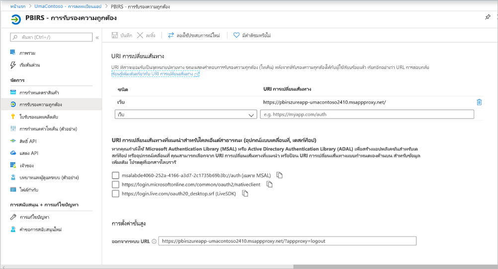

1. <span data-ttu-id="fe84b-229">ดำเนินการกำหนดค่าส่วน **การรับรองความถูกต้อง** ของการลงทะเบียนแอปพลิเคชันเซิร์ฟเวอร์รายงาน Power BI ต่อไปนี้สำหรับ **การให้สิทธิ์โดยนัย** **ชนิดไคลเอ็นต์เริ่มต้น** และ **ชนิดบัญชีที่ได้รับการรองรับ**:</span><span class="sxs-lookup"><span data-stu-id="fe84b-229">Continue configuring the **Authentication** section of App registration for the Power BI Report Server application as follows for **Implicit grant**, **Default client type**, and **Supported account types**:</span></span>

    - <span data-ttu-id="fe84b-230">ตั้งค่า **การให้สิทธิ์โดยนัย** เป็น **รหัสโทเค็น**</span><span class="sxs-lookup"><span data-stu-id="fe84b-230">Set **Implicit grant** to **ID tokens**.</span></span>
    - <span data-ttu-id="fe84b-231">ตั้งค่า **ชนิดไคลเอ็นต์เริ่มต้น** เป็น **ไม่มี**</span><span class="sxs-lookup"><span data-stu-id="fe84b-231">Set **Default client type** to **No**.</span></span>
    - <span data-ttu-id="fe84b-232">ตั้งค่า **ชนิดบัญชีที่ได้รับการรองรับ** เป็น **บัญชี ในไดเรกทอรีองค์กรนี้เท่านั้น (เฉพาะ UmaContoso - ผู้เช่าเดียวเท่านั้น)**</span><span class="sxs-lookup"><span data-stu-id="fe84b-232">Set **Supported account types** to **Accounts in this organizational directory only (UmaContoso only – Single tenant)**.</span></span>

    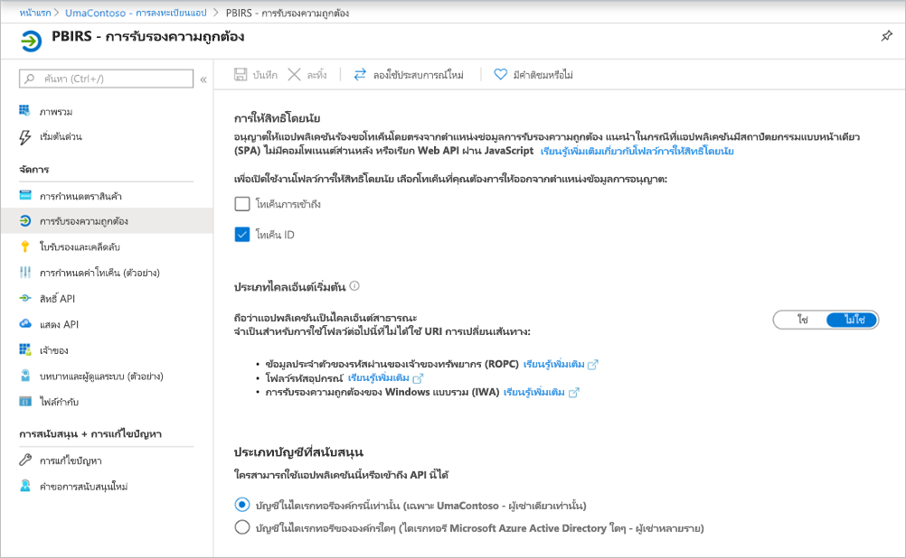

1. <span data-ttu-id="fe84b-234">เมื่อมีการตั้งค่าการลงชื่อเข้าระบบครั้งเดียวและ URL `https://pbirsazureapp-umacontoso2410.msappproxy.net` ทำงานอยู่ เราจำเป็นต้องตรวจสอบให้แน่ใจว่าบัญชีผู้ใช้ที่เราเข้าสู่ระบบจะซิงค์กับบัญชีที่มีการให้สิทธิ์ในเซิร์ฟเวอร์รายงาน Power BI</span><span class="sxs-lookup"><span data-stu-id="fe84b-234">Once the single sign-on is set up and the URL `https://pbirsazureapp-umacontoso2410.msappproxy.net` is working, we have to make sure that the account that we log in with is synced with the account to which the permissions are provided in Power BI Report Server.</span></span>

1. <span data-ttu-id="fe84b-235">ก่อนอื่นเราจำเป็นต้องกำหนดค่าโดเมนแบบกำหนดเองที่เรากำลังวางแผนที่จะใช้ในการเข้าสู่ระบบแล้วตรวจสอบให้แน่ใจว่าได้รับการยืนยันแล้ว</span><span class="sxs-lookup"><span data-stu-id="fe84b-235">We first have to configure the custom domain that we are planning to use in the login, then make sure it is verified</span></span>
2. <span data-ttu-id="fe84b-236">ในกรณีนี้ เราได้ซื้อโดเมนที่เรียกว่า umacontoso.com และกำหนดค่าโซน DNS ด้วยรายการต่างๆ</span><span class="sxs-lookup"><span data-stu-id="fe84b-236">In this case, we purchased a domain called umacontoso.com and configured the DNS zone with the entries.</span></span> <span data-ttu-id="fe84b-237">คุณยังสามารถลองใช้โดเมน `onmicrosoft.com` และซิงค์กับ AD ในองค์กรที่ได้</span><span class="sxs-lookup"><span data-stu-id="fe84b-237">You can also try using the `onmicrosoft.com` domain and sync it with on-premises AD.</span></span>

    <span data-ttu-id="fe84b-238">ดูบทความ[บทช่วยสอน: แมปชื่อ DNS แบบกำหนดเองที่มีอยู่ไปยัง Azure App Service](/Azure/app-service/app-service-web-tutorial-custom-domain) สำหรับการอ้างอิง</span><span class="sxs-lookup"><span data-stu-id="fe84b-238">See the article [Tutorial: Map an existing custom DNS name to Azure App Service](/Azure/app-service/app-service-web-tutorial-custom-domain) for reference.</span></span>

1. <span data-ttu-id="fe84b-239">หลังจากตรวจสอบรายการ DNS สำหรับโดเมนแบบกำหนดเองเรียบร้อยแล้ว คุณมองเห็นสถานะเป็น **ตรวจสอบแล้ว** ที่สอดคล้องกับโดเมนจากพอร์ทัล</span><span class="sxs-lookup"><span data-stu-id="fe84b-239">After successfully verifying the DNS entry for the custom domain, you should be able to see the status as **Verified** corresponding to the domain from the portal.</span></span>

    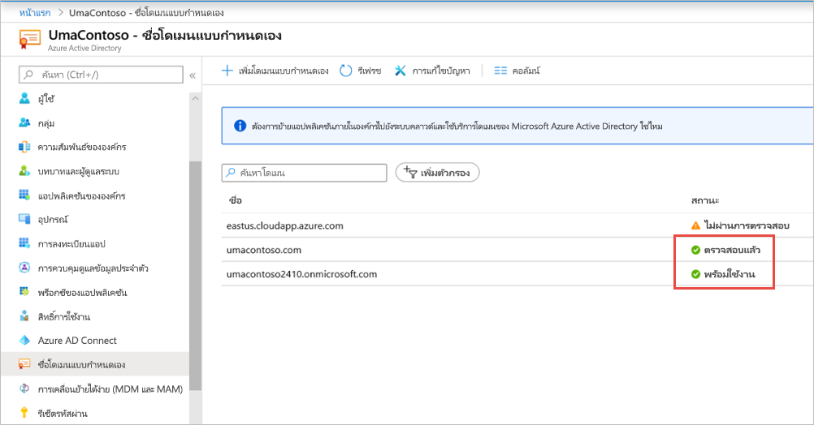

1. <span data-ttu-id="fe84b-241">ติดตั้ง Microsoft Azure AD เชื่อมต่อบนเซิร์ฟเวอร์ตัวควบคุมโดเมนและกำหนดค่าให้ซิงค์กับ Azure AD</span><span class="sxs-lookup"><span data-stu-id="fe84b-241">Install Microsoft Azure AD connect on the domain controller server and configure it to sync with Azure AD.</span></span>

    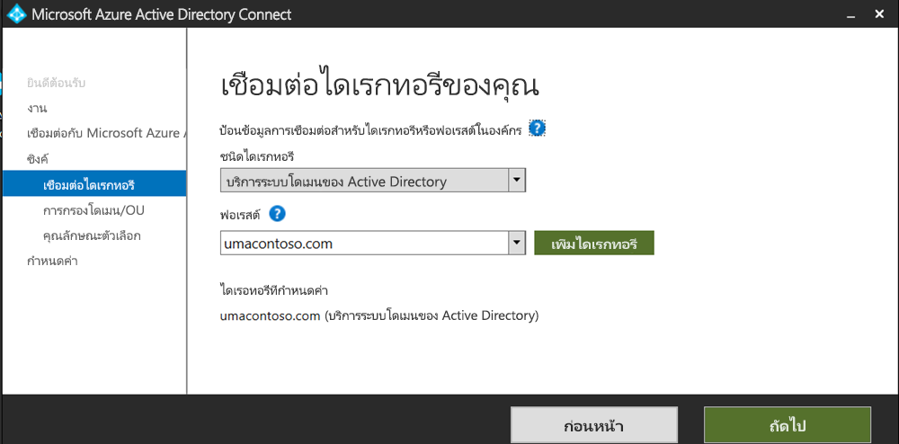

1. <span data-ttu-id="fe84b-243">เมื่อ Azure AD ซิงค์กับ AD ในองค์กร เราจะเห็นสถานะต่อไปนี้จากพอร์ทัล Azure:</span><span class="sxs-lookup"><span data-stu-id="fe84b-243">Once the Azure AD has synced with on-premises AD, we see the following status from the Azure portal:</span></span>

    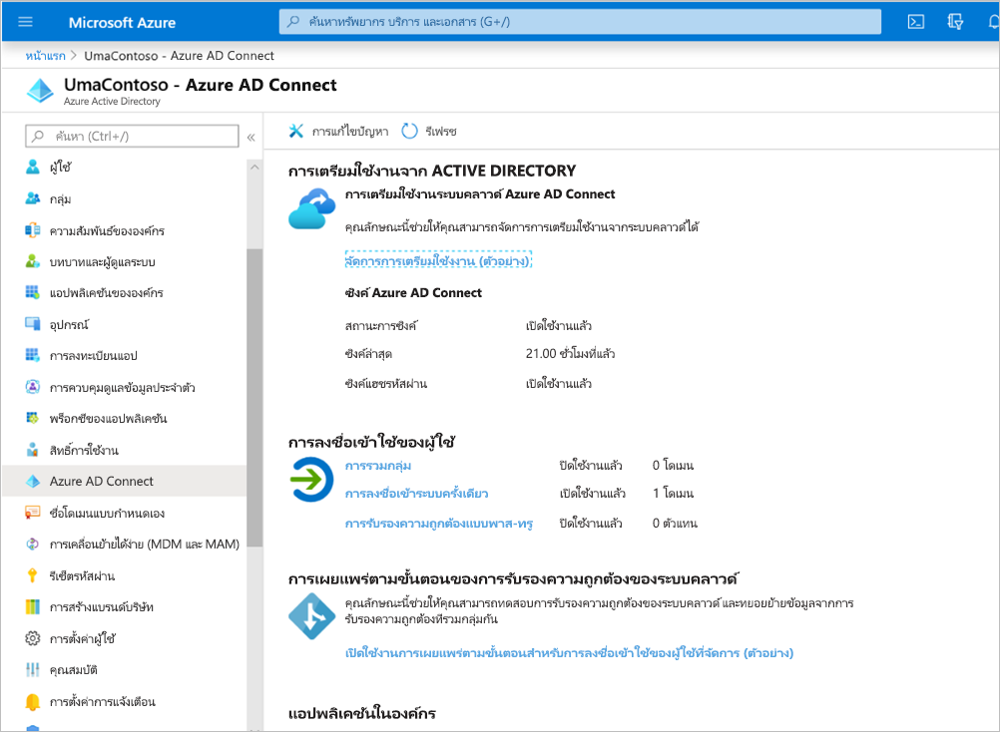

1. <span data-ttu-id="fe84b-245">นอกจากนี้ เมื่อการซิงค์เสร็จสมบูรณ์แล้ว ให้เปิดโดเมน AD และความน่าเชื่อถือบนตัวควบคุมโดเมน</span><span class="sxs-lookup"><span data-stu-id="fe84b-245">Also, once the sync is successful, open the AD domains and trusts on the Domain controller.</span></span> <span data-ttu-id="fe84b-246">คลิกขวาโดเมน Active Directory และความน่าเชื่อถือ > คุณสมบัติและเพิ่ม UPN</span><span class="sxs-lookup"><span data-stu-id="fe84b-246">Right-click Active Directory Domains and Trusts > Properties and add the UPN.</span></span> <span data-ttu-id="fe84b-247">ในสภาพแวดล้อมของเรา `umacontoso.com` เป็นโดเมนแบบกำหนดเองที่เราซื้อ</span><span class="sxs-lookup"><span data-stu-id="fe84b-247">In our environment, `umacontoso.com` is the custom domain we purchased.</span></span>

1. <span data-ttu-id="fe84b-248">หลังจากเพิ่ม UPN คุณควรสามารถกำหนดค่าบัญชีผู้ใช้ที่มี UPN ได้เพื่อให้บัญชี Azure AD และบัญชี AD ในองค์กรได้รับการเชื่อมต่อและโทเค็นที่รู้จักในระหว่างการรับรองความถูกต้อง</span><span class="sxs-lookup"><span data-stu-id="fe84b-248">After adding the UPN, you should be able to configure the user accounts with the UPN so that the Azure AD account and the on-premises AD account are connected and that the token is recognized during authentication.</span></span>

    <span data-ttu-id="fe84b-249">ชื่อโดเมน AD จะแสดงในรายการดรอปดาวน์ของ **ชื่อการเข้าสู่ระบบของผู้ใช้** หลังจากที่คุณทำตามขั้นตอนก่อนหน้า</span><span class="sxs-lookup"><span data-stu-id="fe84b-249">The AD domain name gets listed in the drop-down list of the **User logon name** section after you do the previous step.</span></span> <span data-ttu-id="fe84b-250">กำหนดค่าชื่อผู้ใช้และเลือกโดเมนจากรายการดรอปดาวน์ในส่วน **ชื่อการเข้าสู่ระบบของผู้ใช้** ของคุณสมบัติผู้ใช้ AD</span><span class="sxs-lookup"><span data-stu-id="fe84b-250">Configure the user name, and select the domain from the drop-down list in the **User logon name** section of the AD user properties.</span></span>

    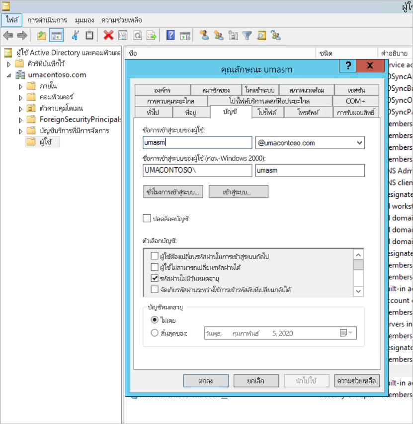

1. <span data-ttu-id="fe84b-252">เมื่อการซิงค์ AD เสร็จสมบูรณ์ คุณจะเห็นบัญชีผู้ AD ในองค์กรปรากฏในพอร์ทัล Azure ภายใต้ส่วน **ผู้ใช้และกลุ่ม** ของแอปพลิเคชัน</span><span class="sxs-lookup"><span data-stu-id="fe84b-252">Once the AD sync is successful, you see the on-premises AD account coming up in the Azure portal under the **Users and Groups** section of the application.</span></span> <span data-ttu-id="fe84b-253">แหล่งที่มาสำหรับบัญชีผู้ใช้คือ **Windows Server AD**</span><span class="sxs-lookup"><span data-stu-id="fe84b-253">The source for the account is **Windows Server AD.**</span></span>
2. <span data-ttu-id="fe84b-254">การเข้าสู่ระบบด้วย `umasm@umacontoso.com` จะเท่ากับการใช้ข้อมูลประจำตัวของ Windows `Umacontoso\umasm`</span><span class="sxs-lookup"><span data-stu-id="fe84b-254">Logging in with `umasm@umacontoso.com` will be equivalent to using the Windows credentials `Umacontoso\umasm`.</span></span>

    <span data-ttu-id="fe84b-255">จะสามารถใช้ขั้นตอนก่อนหน้านี้ได้หากคุณมีการกำหนดค่า AD ในองค์กรและกำลังวางแผนที่จะซิงค์กับ Azure AD</span><span class="sxs-lookup"><span data-stu-id="fe84b-255">These previous steps are applicable if you have on-premises AD configured and are planning to sync it with Azure AD.</span></span>

    <span data-ttu-id="fe84b-256">การลงชื่อเข้าใช้สำเร็จหลังจากการดำเนินการขั้นตอนข้างต้นนี้:</span><span class="sxs-lookup"><span data-stu-id="fe84b-256">Successful sign-in after implementing the above steps:</span></span>

    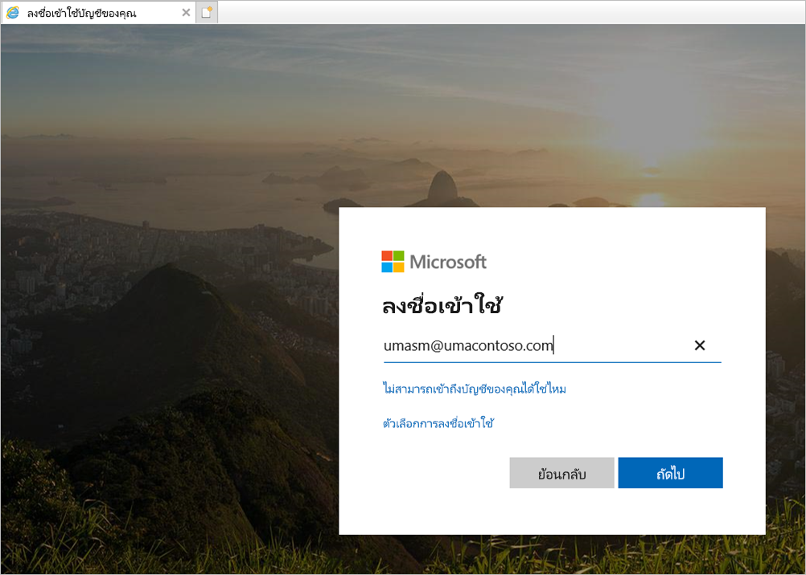

    <span data-ttu-id="fe84b-258">ตามด้วยการแสดงเว็บพอร์ทัล:</span><span class="sxs-lookup"><span data-stu-id="fe84b-258">Followed by the display of web portal:</span></span>

    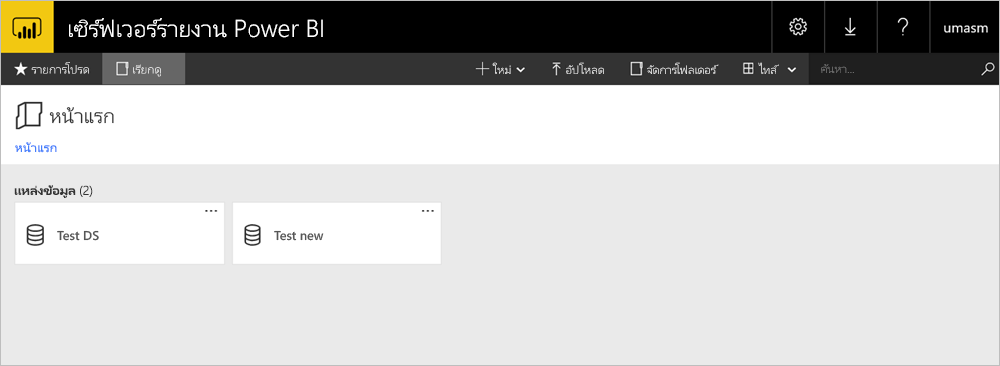

    <span data-ttu-id="fe84b-260">ด้วยการทดสอบการเชื่อมต่อกับแหล่งข้อมูลที่สำเร็จโดยใช้ Kerberos เป็นการรับรองความถูกต้อง:</span><span class="sxs-lookup"><span data-stu-id="fe84b-260">With a successful test connection to data source using Kerberos as the authentication:</span></span>

    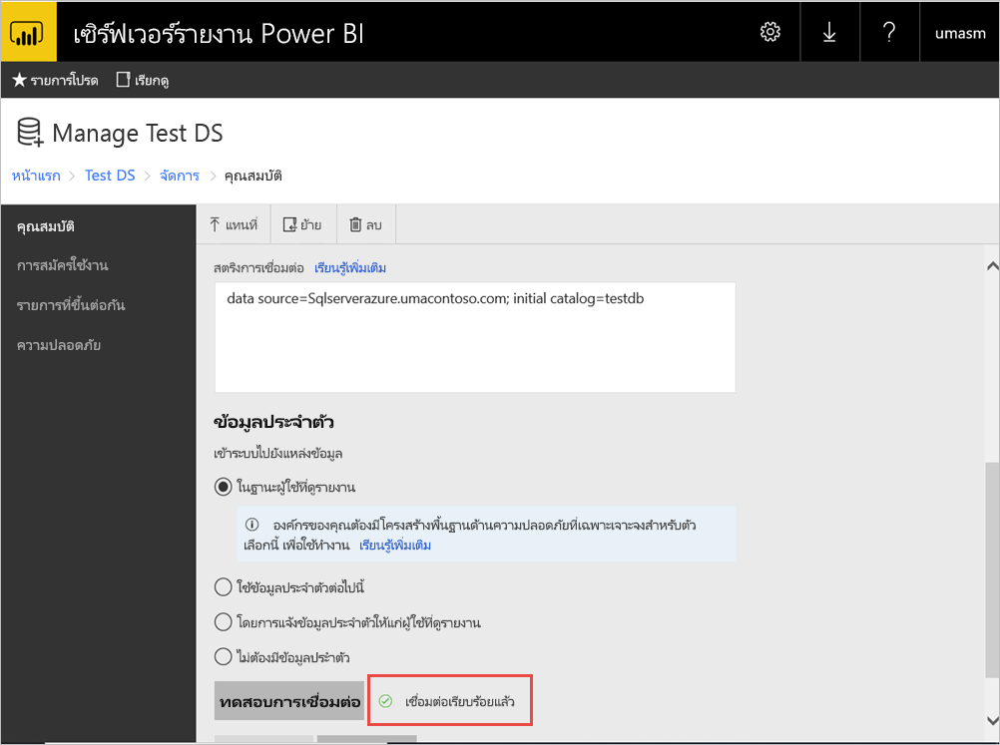

## <a name="access-from-power-bi-mobile-apps"></a><span data-ttu-id="fe84b-262">การเข้าถึงแอป Power BI สำหรับอุปกรณ์เคลื่อนที่</span><span class="sxs-lookup"><span data-stu-id="fe84b-262">Access from Power BI mobile apps</span></span>

### <a name="configure-the-application-registration"></a><span data-ttu-id="fe84b-263">กำหนดค่าการลงทะเบียนแอปพลิเคชัน</span><span class="sxs-lookup"><span data-stu-id="fe84b-263">Configure the application registration</span></span>

<span data-ttu-id="fe84b-264">ก่อนที่แอป Power BI สำหรับอุปกรณ์เคลื่อนที่จะสามารถเชื่อมต่อและเข้าถึงเซิร์ฟเวอร์รายงาน Power BI ได้ คุณต้องกำหนดค่าการลงทะเบียนแอปพลิเคชันที่ถูกสร้างขึ้นโดยอัตโนมัติสำหรับคุณในการ[เผยแพร่ผ่านทางพร็อกซีแอปพลิเคชัน Azure AD](#publish-through-azure-ad-application-proxy) ก่อนหน้าในบทความนี้</span><span class="sxs-lookup"><span data-stu-id="fe84b-264">Before the Power BI mobile app can connect and access Power BI Report Server, you must configure the application registration that was automatically created for you in [Publish through Azure AD Application Proxy](#publish-through-azure-ad-application-proxy) earlier in this article.</span></span>

> [!NOTE]
> <span data-ttu-id="fe84b-265">ถ้าคุณใช้นโยบายการเข้าถึงตามเงื่อนไขที่กำหนดให้แอป Power BI สำหรับมือถือเป็นแอปไคลเอ็นต์ที่ได้รับการอนุมัติคุณจะไม่สามารถใช้ Azure AD Application Proxy เพื่อเชื่อมต่อแอปมือถือ Power BI กับเซิร์ฟเวอร์รายงาน Power BI</span><span class="sxs-lookup"><span data-stu-id="fe84b-265">If you use conditional access policies that require the Power BI mobile app to be an approved client app, you can’t use Azure AD Application Proxy to connect the Power BI mobile app to Power BI Report Server.</span></span>

1. <span data-ttu-id="fe84b-266">บนหน้าภาพรวม **Azure Active Directory** ให้เลือก **การลงทะเบียนแอป**</span><span class="sxs-lookup"><span data-stu-id="fe84b-266">On the Azure Active Directory **Overview** page, select **App registrations**.</span></span>
2. <span data-ttu-id="fe84b-267">บนแท็บ **แอปพลิเคชันทั้งหมด** ให้ค้นหาแอปพลิเคชันที่คุณสร้างขึ้นสำหรับเซิร์ฟเวอร์รายงาน Power BI</span><span class="sxs-lookup"><span data-stu-id="fe84b-267">On the **All applications** tab, search for the application you created for Power BI Report Server.</span></span>
3. <span data-ttu-id="fe84b-268">เลือกแอปพลิเคชันจากนั้นเลือก **การรับรองความถูกต้อง**</span><span class="sxs-lookup"><span data-stu-id="fe84b-268">Select the application, then select **Authentication**.</span></span>
4. <span data-ttu-id="fe84b-269">เพิ่มการเปลี่ยนเส้นทาง URI ต่อไปนี้ตามแพลตฟอร์มที่คุณกำลังใช้</span><span class="sxs-lookup"><span data-stu-id="fe84b-269">Add the following Redirect URIs based on which platform you are using.</span></span>

    <span data-ttu-id="fe84b-270">เมื่อกำหนดค่าแอปสำหรับ Power BI Mobile ที่ใช้ **iOS** ให้เพิ่มการเปลี่ยนเส้นทาง URI ต่อไปนี้ของชนิดไคลเอ็นต์สาธารณะ (อุปกรณ์เคลื่อนที่และ Desktop):</span><span class="sxs-lookup"><span data-stu-id="fe84b-270">When configuring the app for Power BI Mobile **iOS**, add the following Redirect URIs of type Public Client (Mobile and Desktop):</span></span>

    - `msauth://code/mspbi-adal%3a%2f%2fcom.microsoft.powerbimobile`
    - `msauth://code/mspbi-adalms%3a%2f%2fcom.microsoft.powerbimobilems`
    - `mspbi-adal://com.microsoft.powerbimobile`
    - `mspbi-adalms://com.microsoft.powerbimobilems`

    <span data-ttu-id="fe84b-271">เมื่อกำหนดค่าแอปสำหรับ  Power BI Mobile ที่ใช้ **Android** ให้เพิ่มการเปลี่ยนเส้นทาง URI ต่อไปนี้ของชนิดไคลเอ็นต์สาธารณะ (อุปกรณ์เคลื่อนที่และ Desktop):</span><span class="sxs-lookup"><span data-stu-id="fe84b-271">When configuring the app for Power BI Mobile **Android**, add the following Redirect URIs of type Public Client (Mobile and Desktop):</span></span>

    - `urn:ietf:wg:oauth:2.0:oob`
    - `mspbi-adal://com.microsoft.powerbimobile`
    - `msauth://com.microsoft.powerbim/g79ekQEgXBL5foHfTlO2TPawrbI%3D`
    - `msauth://com.microsoft.powerbim/izba1HXNWrSmQ7ZvMXgqeZPtNEU%3D`

    <span data-ttu-id="fe84b-272">เมื่อกำหนดค่าแอปสำหรับ Power BI บนอุปกรณ์เคลื่อน iOS และ Android ให้เพิ่มการเปลี่ยนเส้นทาง URI ต่อไปนี้ของชนิดไคลเอ็นต์สาธารณะ (อุปกรณ์เคลื่อนที่และ Desktop) ไปยังรายการการเปลี่ยนเส้นทาง URI ที่กำหนดค่าไว้สำหรับ iOS:</span><span class="sxs-lookup"><span data-stu-id="fe84b-272">When configuring the app for both Power BI Mobile iOS and Android, add the following Redirect URI of type Public Client (Mobile and Desktop) to the list of Redirect URIs configured for iOS:</span></span>

    - `urn:ietf:wg:oauth:2.0:oob`

    > [!IMPORTANT]
    > <span data-ttu-id="fe84b-273">ต้องเพิ่มการเปลี่ยนเส้นทาง URI สำหรับแอปพลิเคชันเพื่อให้สามารถทำงานได้อย่างถูกต้อง</span><span class="sxs-lookup"><span data-stu-id="fe84b-273">The Redirect URIs must be added for the application to work correctly.</span></span>

### <a name="connect-from-the-power-bi-mobile-apps"></a><span data-ttu-id="fe84b-274">เชื่อมต่อจากแอป Power BI mobile</span><span class="sxs-lookup"><span data-stu-id="fe84b-274">Connect from the Power BI mobile apps</span></span>

1. <span data-ttu-id="fe84b-275">ในแอป Power BI mobile ให้เชื่อมต่อกับอินสแตนซ์ของเซิร์ฟเวอร์รายงานของคุณ</span><span class="sxs-lookup"><span data-stu-id="fe84b-275">In the Power BI mobile app, connect to your report server instance.</span></span> <span data-ttu-id="fe84b-276">หากต้องการเชื่อมต่อ ให้ป้อน **URL ภายนอก** สำหรับแอปพลิเคชันที่คุณเผยแพร่ผ่านทางพร็อกซีของแอปพลิเคชัน</span><span class="sxs-lookup"><span data-stu-id="fe84b-276">To connect, enter the **External URL** for the application you published through Application Proxy.</span></span>
2. <span data-ttu-id="fe84b-277">เลือก **เชื่อมต่อ**</span><span class="sxs-lookup"><span data-stu-id="fe84b-277">Select **Connect**.</span></span> <span data-ttu-id="fe84b-278">คุณจะถูกเปลี่ยนเส้นทางไปยังหน้าลงชื่อเข้าใช้ Azure Active Directory</span><span class="sxs-lookup"><span data-stu-id="fe84b-278">You'll be directed to the Azure Active Directory sign-in page.</span></span>
3. <span data-ttu-id="fe84b-279">ใส่ข้อมูลประจำตัวที่ถูกต้องสำหรับผู้ใช้ของคุณและเลือก **ลงชื่อเข้าใช้**</span><span class="sxs-lookup"><span data-stu-id="fe84b-279">Enter valid credentials for your user and select **Sign in**.</span></span> <span data-ttu-id="fe84b-280">คุณจะเห็นองค์ประกอบจากเซิร์ฟเวอร์รายงานของคุณ</span><span class="sxs-lookup"><span data-stu-id="fe84b-280">You'll see the elements from your report server.</span></span>

## <a name="next-steps"></a><span data-ttu-id="fe84b-281">ขั้นตอนถัดไป</span><span class="sxs-lookup"><span data-stu-id="fe84b-281">Next steps</span></span>

[<span data-ttu-id="fe84b-282">เปิดใช้งานการเข้าถึงระยะไกลไปยัง Power BI Mobile ด้วยพร็อกซีแอปพลิเคชันของ Azure AD</span><span class="sxs-lookup"><span data-stu-id="fe84b-282">Enable remote access to Power BI Mobile with Azure AD Application Proxy</span></span>](/azure/active-directory/manage-apps/application-proxy-integrate-with-power-bi)

<span data-ttu-id="fe84b-283">มีคำถามเพิ่มเติมหรือไม่</span><span class="sxs-lookup"><span data-stu-id="fe84b-283">More questions?</span></span> [<span data-ttu-id="fe84b-284">ลองถามชุมชน Power BI</span><span class="sxs-lookup"><span data-stu-id="fe84b-284">Try asking the Power BI Community</span></span>](https://community.powerbi.com/)
