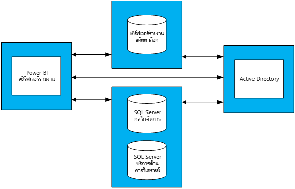

# คำแนะนำในการวางแผนความจุสำหรับเวอร์รายงาน Power BICapacity planning guidance for Power BI Report Server
เซิร์ฟเวอรรายงาน์ power BI เป็นแบบบริการตนเอง BI และเป็นโซลูชันการรายงานสำหรับองค์กรธุรกิจ ซึ่งลูกค้าสามารถปรับใช้ภายในองค์กรหลังไฟร์วอลล์ของพวกเขา ได้Power BI Report Server is a self-service BI and enterprise reporting solution that customers can deploy on their premises, behind their firewall. จะรวมความสามารถในการรายงานแบบโต้ตอบของ Power BI Desktop ด้วยแพลตฟอร์มที่เซิร์ฟเวอร์ภายในองค์กรของ SQL Server Reporting ServicesIt combines the interactive report capability of Power BI Desktop with the on-premises server platform of SQL Server Reporting Services. ด้วยน้ำหนักและการเติบโตของการใช้งานของการวิเคราะห์และการรายงานภายในองค์กร การจัดทำงบประมาณฮาร์ดแวร์โครงสร้างพื้นฐานและลิขสิทธิ์ซอฟต์แวร์จึงถูกใช้งาน เพื่อขยายไปยังฐานผู้ใช้แบบองค์กร ซึ่งเป็นเรื่องท้าทายยิ่งนักWith heavy and growing usage of analytics and reporting within enterprises, budgeting the hardware infrastructure and software licenses required to scale to an enterprise user base can be a challenge. เอกสารนี้มีวัตถุประสงค์เพื่อเสนอคำแนะนำเกี่ยวกับการวางแผนความจุสำหรับเซิร์ฟเวอร์รายงาน Power BI โดยแบ่งปันผลลัพธ์การดำเนินการทดสอบการโหลดจำนวนมากของปริมาณงานต่าง ๆ กับเซิร์ฟเวอร์รายงานThis paper aims to offer guidance on capacity planning for Power BI Report Server by sharing results of numerous load test executions of various workloads against a report server. ในขณะที่รายงาน คิวรี และการใช้รูปแบบขององค์กรแตกต่างกันอย่างกว้างขวาง ผลลัพธที่์แสดงอยู่ในเอกสารนี้ พร้อมกับการทดสอบจริงที่ใช้และอธิบายโดยละเอียดเกี่ยวกับวิธี่ดำเนินการ ทำหน้าที่เป็นจุดอ้างอิงสำหรับทุกคน ในช่วงต้นของขั้นตอนการวางแผนเพื่อใช้เซิร์ฟเวอร์รายงาน Power BIWhile organizations' reports, queries, and usage patterns vary widely, the results presented in this paper, along with the actual tests used and a detailed description of how they were executed, serve as a reference point for anyone in the early-stage planning process of deploying Power BI Report Server.

## สรุปสำหรับผู้บริหารExecutive summary
เราใช้ปริมาณงานสองชริดกับเซิร์ฟเวอร์รายงาน Power BI ปริมาณงานแต่ละรายการประกอบด้วยการแสดงรายงานชนิดต่างๆ เช่นเดียวกับการดำเนินการพอร์ทัลเว็บต่างๆWe executed two different types of workloads against Power BI Report Server; each workload consisted of rendering different types of reports as well as performing various web portal operations. 

* ในปริมาณงาน "Power BI Report Heavy" เป็นการดำเนินการบ่อยที่สุด (เช่น ดำเนินการ 60% ของเวลา) ถูกแสดงรายงาน Power BIIn "Power BI Report Heavy" workload, the most frequently executed operation (i.e. the operation executed 60% of the time) was rendering Power BI reports.
* ในปริมาณงาน “Paginated Report Heavy” เป็นการดำเนินการบ่อยที่สุด ถูกแสดงรายงานIn "Paginated Report Heavy" workload, the most frequently executed operation was rendering paginated reports.

ภายใต้สี่เซิร์ฟเวอร์โทโพโลยีของเซิร์ฟเวอร์รายงาน Power BI และคาดหวังว่า ไม่เกิน 5% ของผู้ใชที่้จะเข้าถึงเซิร์ฟเวอร์รายงานได้ทุกเวลา ตารางต่อไปนี้อธิบายถึงจำนวนสูงสุดของผู้ใช้ที่เซิร์ฟเวอร์รายงาน Power BI ที่สามารถจัดการกับน้อย 99% ความน่าเชื่อถือUnder a four-server topology of Power BI Report Server and the expectation that no more than 5% of users will access a report server at any one time, the following table describes the maximum number of users Power BI Report Server can handle with at least 99% reliability. 

| ปริมาณงานWorkload | 8 Core/32 GB RAM8 Core/32 GB RAM | 16 Core/64 GB RAM16 Core/64 GB RAM |
| --- | --- | --- |
| **Power BI Report Heavy** (>60%)**Power BI Report Heavy** (>60%) |ผู้ใช้ 1000 ราย1,000 users |ผู้ใช้ 3000 ราย3,000 users |
| **แบ่งหน้า (RDL) Report Heavy**  (> 60%)**Paginated (RDL) Report Heavy** (>60%) |ผู้ใช้ 2000 ราย2,000 users |ผู้ใช้ 3,200 ราย3,200 users |

ในแต่ละครั้งที่เรียกใช้งาน ทรัพยากรที่ใช้นมากที่สุดคือ CPUIn each run, the most overwhelmed resource was CPU. เนื่องจากนี่ การเพิ่มจำนวน cores ใน Power BI Report Server จะให้เชื่อถือของระบบมากกว่าการเพิ่มจำนวนหน่วยความจำหรือเพิ่มขนาดฮาร์ดดิสก์Due to this, increasing the number of cores to Power BI Report Server would yield a higher gain in the reliability of the system than increasing the amount of memory or hard-disk space. 

## วิธีการทดสอบTest methodology
ทดสอบโทโพโลยีที่ใช้เป็นไปตามเครื่องเสมือน Microsoft Azure ไม่ได้เป็นตามผู้จัดจำหน่ายฮาร์ดแวร์The testing topology used was based on Microsoft Azure Virtual Machines instead of vendor-specific physical hardware. เครื่องทั้งหมดถูกโฮสต์ในขอบเขตของสหรัฐอเมริกาAll machines were hosted in US regions. สิ่งนี้แสดงแนวโน้มทั่วไปของการจำลองเสมือนของฮาร์ดแวร์ทั้งภายในองค์กรและในระบบคลาวด์สาธารณะThis reflects the general trend of hardware virtualization both on-premises and in the public cloud. 

### โทโพโลยของเซิร์ฟเวอร์รายงาน Power BIPower BI Report Server topology
การใช้เซิร์ฟเวอร์รายงาน Power BI ประกอบด้วยเครื่องเสมือนต่อไปนี้The Power BI Report Server deployment consisted of the following virtual machines:

* Active Directory Domain Controller สิ่งนี้จำเป็นสำหรับ SQL Server Database Engine, SQL Server Analysis Services และเซิร์ฟเวอร์รายงาน Power BI เพื่อรับรองคำขอทั้งหมดได้อย่างปลอดภัยActive Directory Domain Controller: this was needed by SQL Server Database Engine, SQL Server Analysis Services, and Power BI Report Server to securely authenticate all requests.
* SQL Server Database Engine and SQL Server Analysis Services นี่คือตำแหน่งที่เราจัดเก็บฐานข้อมูลทั้งหมดสำหรับรายงานที่จะใช้เมื่อเราแสดงผลSQL Server Database Engine and SQL Server Analysis Services: this was where we stored all the databases for the reports to consume when we rendered them.
* เซิร์ฟเวอร์รายงานของ Power BIPower BI Report Server
* ฐ่านข้อมูลเซิร์ฟเวอร์รายงานของ Power BIPower BI Report Server Database. ฐานข้อมูลเซิร์ฟเวอร์รายงานถูกโฮสต์บนคอมพิวเตอร์มากเครื่องมากกว่าเซิร์ฟเวอร์รายงาน Power BI เพื่อให้ไม่จำเป็นเพื่อการแย่งหน่วยความจำของ SQL Server Database Engine CPU เครือข่าย และแหล่งข้อมูลบนดิสก์The report server database is hosted on a different machine than Power BI Report Server so that it does not need to compete with SQL Server Database Engine for memory, CPU, network, and disk resources.

ดูภาคผนวก 1.1 โทโพโลยีเซิร์ฟเวอร์รายงาน Power BI และภาคผนวก 1.2 การตั้งค่าเครื่องเสมือนเซิร์ฟเวอร์รายงาน Power BI สำหรับการกำหนดค่าโดยละเอียดของแต่ละเครื่องเสมือนที่ใช้ในโทโพโลยีSee Appendix 1.1 Power BI Report Server Topology and Appendix 1.2 Power BI Report Server Virtual Machine Configuration for a thorough configuration of each virtual machine used in the topology.

### ทดสอบTests
การทดสอบที่ใช้ใน การทดสอบการโหลด มีให้ดาวน์โหลดได้สาธารณะในโครงการ GitHub ที่ชื่อว่า [Reporting Services LoadTest](https://github.com/Microsoft/Reporting-Services-LoadTest)The tests used in the load test runs are publicly available in a GitHub project called [Reporting Services LoadTest](https://github.com/Microsoft/Reporting-Services-LoadTest). เครื่องมือนี้ช่วยให้ผู้ใช้ศึกษาประสิทธิภาพการทำงาน ความน่าเชื่อถือ ปรับขนาด และลักษณะการคืนสภาพของ SQL Server Reporting Services และ Power BI Report ServerThis tool allows users to study the performance, reliability, scalability and recoverability characteristics of SQL Server Reporting Services and Power BI Report Server. โครงการนี้ประกอบด้วย่ของกรณีทดสอบสีกลุ่มThis project consists of four groups of test cases:

* ทดสอบการจำลองกำลังแสดงรายงาน Power BITests simulating rendering Power BI reports,
* ทดสอบการจำลอการแสดงงรายงานมือถือTests simulating rendering mobile reports,
* ทดสอบการจำลองแสดงรายงานที่ถูกจัดหน้าขนาดเล็กและใหญ่และTests simulating rendering small and large paginated reports, and 
* ทดสอบการจำลองการดำเนินการชนิดต่าง ๆ ของการดำเนินการเว็บพอร์ทัลTests simulating performing various types of web portal  operations. 

การทดสอบทั้งหมดถูกเขียนขึ้นเพื่อทำการดำเนินการแบบ end-to-end (เช่นการสร้างรายงาน สร้างแหล่งข้อมูลใหม่ และอื่น ๆ)All tests were written to perform an end-to-end operation (such as rendering a report, creating a new data source, etc.). พวกเขาทำสิ่งนี้ โดยทำการร้องขอเว็บหนึ่งอันหรือมากกว่าไปยังเซิร์ฟเวอร์รายงาน (ผ่าน API)They accomplish this by making one or more web requests to the report server (via APIs). ในโลกแห่งความจริง ผู้ใช้อาจจำเป็นต้องดำเนินการขั้นกลางสองสามสองสามชนิด เพื่อเสร็จสิ้นการดำเนินการ end-to-end หนึ่งอันIn the real world, a user may need to perform a few intermediate operations to complete one of these end-to-end operations. ตัวอย่างเช่น เมื่อต้องแสดงรายงานผู้ใช้จะต้องไปยังเว็บพอร์ทัล นำทางไปยังโฟลเดอร์ที่รายงานอยู่ จากนั้นคลิกรายงานเพื่อแสดงFor example, to render a report a user will need to go to the web portal, navigate to the folder where the report is, then click the report to render it. ในขณะทดสอบไม่ดำเนินการทั้งหมด การทำงานที่ต้องการสร้างงานแบบ end-to-end พวกเขายังคงกำหนดการโหลดส่วนใหญ่ของการโหลดเซิร์ฟเวอร์รายงาน Power BI จะเป็นไปได้While tests don't perform all the operations needed to accomplish an end-to-end task, they still impose most of the load that Power BI Report Server would experience. คุณสามารถเรียนรู้เพิ่มเติมเกี่ยวกับรายชนิดต่างๆที่ใช้ รวมถึงความหลากหลายของการดำเนินการทำโดยการสำรวจ GitHub projectYou can learn more about the different types of reports used as well as the variety of operations performed by exploring the GitHub project.  

> [!NOTE]
> เครื่องมือนี้ไม่ได้รับการสนับสนุนอย่างเป็นทางการจาก Microsoft แต่ทีมผลิตภัณฑ์จะมีส่วนร่วมในโครงการและตอบปัญหาที่ผู้สนับสนุนรายอื่นแจ้งให้ทราบThe tool isn't officially supported by Microsoft, but the product team does contribute to the project and answer issues that are raised by other contributors.

### ปริมาณงานWorkloads
มีโปรไฟล์ปริมาณงาน 2 ชุดที่ใช้ในการทดสอบ: รายงาน power BI Heavy และมีการแบ่งหน้ารายงาน HeavyThere are 2 workload profiles used in testing: Power BI Report Heavy and Paginated Report Heavy. ตารางด้านล่างนี้อธิบายเกี่ยวกับการแจกแจงคำขอที่ดำเนินการกับเซิร์ฟเวอร์รายงานThe table below describes the distribution of requests executed against the Report Server.

| กิจกรรมActivity | Power BI Report Heavy ความถี่ของการเกิดขึ้นPower BI Report Heavy, Frequency of occurrence | Paginated Report Heavy ความถี่ของการเกิดขึ้นPaginated Report Heavy, Frequency of occurrence |
| --- | --- | --- |
| **แสดงรายงาน Power BI****Rendering Power BI reports** |60%60% |10%10% |
| **การแสดงผลรายงานแบบจัดหน้า(RDL)****Rendering paginated (RDL) reports** |30%30% |60%60% |
| **แสดงรายงานมือถือ****Rendering mobile reports** |5%5% |20%20% |
| **การดำเนินงานเว็บพอร์ทัล****Web portal operations** |5%5% |10%10% |

### โหลดผู้ใช้User load
สำหรับการทดสอบการเรียกใช้ การทดสอบถูกดำเนินการโดยยึดตามความถี่ที่ระบุในปริมาณงานหนึ่งหรือสองอย่างFor each test run, tests were executed based on the frequency specified in one of the two workloads. ทดสอบการเริ่มต้นใช้งานกับผู้ใช้งานพร้อมกัน 20 ราย ที่ขอไปยังเซิร์ฟเวอร์รายงานTests started with 20 concurrent user requests to the report server. การโหลดผู้ใช้จากนั้นถูกเพิ่มขึ้นทีละน้อยจนกว่าความน่าเชื่อถือจะตกต่ำกว่าเป้าหมาย 99%The user load was then gradually increased until reliability dropped below the 99% target.

## ผลลัพธ์Results
### ความจุเพื่อผู้ใช้พร้อมกันConcurrent user capacity
ตามที่ระบุไว้ก่อนหน้านี้ การทดสอบเริ่มต้นใช้งานกับผู้ใช้พร้อมกัน 20 ราย ที่ทำการขอไปยังเซิร์ฟเวอร์รายงานAs stated earlier, tests started with 20 concurrent users making requests to the report server. จำนวนผู้ใช้พร้อมกันได้เพิ่มขึ้นทีละน้อยจนกว่า 1% ของคำขอทั้งหมดจะล้มเหลวThe number of concurrent users was then gradually increased until 1% of all requests were failing. ผลลัพธ์ในตารางต่อไปนี้บอกให้เราจำนวนการขอของผู้ใช้พร้อมกัน ซึ่งเซิร์ฟเวอร์จะสามารถจัดการภายใต้การโหลดสูงสุดกับอัตราความล้มเหลวน้อยกว่า 1%The results in the following table tell us the number of concurrent user requests that the server would be able to handle under peak load with a failure rate of less than 1%.

| ปริมาณงานWorkload | 8 Core/32 GB8 Core/32 GB | 16 Core/64 GB16 Core/64 GB |
| --- | --- | --- |
| **Power BI Report Heavy****Power BI Report Heavy** |ผู้ใช้พร้อมกัน 50 ราย50 concurrent users |ผู้ใช้พร้อมกัน 150 ราย150 concurrent users |
| **Paginated Report Heavy****Paginated Report Heavy** |ผู้ใช้พร้อมกัน 100 ราย100 concurrent users |ผู้ใช้พร้อมกัน 160 ราย160 concurrent users |

### ความจุผู้ใช้ทั้งหมดTotal user capacity
ที่ Microsoft เรามีการปรับใช้ของการผลิตของเซิร์ฟเวอร์รายงาน Power BI ที่ใช้หลายทีมAt Microsoft, we have a production deployment of Power BI Report Server that several teams used. เมื่อเราวิเคราะห์การใช้งานจริงของสภาพแวดล้อมนี้ เราจะสังเกตเห็นว่า จำนวนผู้ใช้พร้อมกันในเวลาใดุ (แม้แต่ในระหว่างการโหลดสูงสุดประจำวัน) ไม่มีแนวโน้มเกิน 5% ของฐานผู้ใช้ทั้งหมดWhen we analyze actual usage of this environment, we observe that the number of concurrent users at any given time (even during daily peak load) doesn't tend to exceed 5% of the total user base. เราใช้ 5% ของอัตราส่วนแบบพร้อมกัน เป็นเกณฑ์มาตรฐาน หาฐานผู้ใช้เซิร์ฟเวอร์รายงาน Power BI ไม่สามารถจัดการความน่าเชื่อถือ 99%Using this 5% concurrency ratio as a benchmark, we extrapolated the total user base Power BI Report Server could handle with 99% reliability.

| ปริมาณงานWorkload | 8 Core/32 GB8 Core/32 GB | 16 Core/64 GB16 Core/64 GB |
| --- | --- | --- |
| **Power BI Report Heavy****Power BI Report Heavy** |ผู้ใช้ 1000 ราย1,000 users |ผู้ใช้ 3000 ราย3,000 users |
| **Paginated Report Heavy****Paginated Report Heavy** |ผู้ใช้ 2000 ราย2,000 users |ผู้ใช้ 3,200 ราย3,200 users |

## สรุปSummary
สำหรับแต่ละทดสอบการโหลดที่ทำ CPU ใช้ทรัพยากรมากที่สุดตรงจุดโหลดสูงสุดบนเครื่องเซิร์ฟเวอร์รายงาน Power BIFor each load test run, CPU was the most overwhelmed resource at the point of peak load on the Power BI Report Server machine. เนื่องจากนี่ ทรัพยากรแรกที่ต้องการเพิ่มคือจำนวนของ coreDue to this, the first resource that should be increased is the number of cores. อีกวิธีหนึ่งคือ คุณสามารถพิจารณาขยาย โดยการเพิ่มโฮสต์เซิร์ฟเวอร์รายงาน Power BI ในโทโพโลยีของคุณAlternately, you can consider scaling out by adding more servers hosting Power BI Report Server in your topology.

ผลลัพธ์นำเสนอในเอกสารนี้มาจากการดำเนินการกับชุดเฉพาะของรายงานที่ใช้ชุดข้อมูล ซึ่งถูกทำซ้ำในรูปแบบเฉพาะเจาะจงThe results presented in this paper were derived from executing a specific set of reports consuming a specific set of data, repeated in a specific way. เป็นจุดอ้างอิงที่มีประโยชน์ แต่โปรดทราบว่าการใช้งานของคุณจะขึ้นอยู่กับรายงาน คิวรี่ รูปแบบการใช้ และการปรับใช้ของเซิร์ฟเวอร์รายงาน Power BI ของคุณIt's a useful reference point, but keep in mind that your usage will depend on your reports, queries, usage patterns and deployment of your Power BI Report Server.

## ภาคผนวกAppendix
### โทโพโลยี 11 Topology
**1.1 โทโพโลยีเซิร์ฟเวอร์รายงาน BI power****1.1 Power BI Report Server Topology**

เมื่อต้องเน้นเท่านั้นบนเซิร์ฟเวอร์รายงาน Power BI ลักษณะการทำงานภายใต้การกำหนดค่าที่หลากหลาย การกำหนดค่า VM สำหรับเครื่องแต่ละชนิด(ยกเว้นเครื่องโฮสตเซิร์ฟเวอ์รรายงาน Power BI) ได้รับการแก้ไขTo focus solely on Power BI Report Server behavior under different configurations, the VM configuration  for each type of machine (except for the machine hosting Power BI Report Server) was fixed. แต่ละเครื่องจะถูกเตรียมใช้งานตามเครื่อง D Series second-generation (v2) ที่มี Premium Storage DisksEach machine was provisioned according to the second-generation (v2) D Series machines with Premium Storage Disks. คุณสามารถหาข้อมูลโดยละเอียดเกี่ยวกับ แต่ละขนาดของ VM ภายใต้ส่วน [“วัตถุประสงค์ทั่วไป”](https://azure.microsoft.com/pricing/details/virtual-machines/windows/)You can find detailed information about each VM size under the ["General Purpose" section](https://azure.microsoft.com/pricing/details/virtual-machines/windows/).

| ชนิดเครื่องเสมือนVirtual Machine Type | ตัวประมวลผลProcessor | หน่วยความจำMemory | ขนาด azure VMAzure VM Size |
| --- | --- | --- | --- |
| **Active Directory Domain Controller****Active Directory Domain Controller** |2 Cores2 Cores |7 GB7 GB |Standard_DS2_v2Standard_DS2_v2 |
| **SQL Server Database Engine and Analysis Services****SQL Server Database Engine and Analysis Services** |16 cores16 Cores |56 GB56 GB |Standard_DS5_v2Standard_DS5_v2 |
| **ฐานข้อมูลเซิร์ฟเวอร์รายงาน****Report Server Database** |16 Cores16 Cores |56 GB56 GB |Standard_DS5_v2Standard_DS5_v2 |

**1.2 กำหนดค่าเครื่องเสมือนของเซิร์ฟเวอร์รายงาน BI power****1.2 Power BI Report Server Virtual Machine Configuration** 

กำหนดค่าที่หลากหลายของตัวประมวลผลและหน่วยความจะถูกใช้สำหรับเครื่องเสมือนโฮสต์เซิร์ฟเวอร์รายงาน BI powerDifferent configurations of processor and memory were used for the Virtual Machine hosting Power BI Report Server. ไม่เหมือนกับ Vm อื่นๆ เครื่องนี้ถูกเตรียมใช้งานตามเครื่อง D Series third-generation (v3) ที่มี Premium Storage DisksUnlike the other VMs, this machine was provisioned according to the third-generation (v3) D Series Machines with Premium Storage Disks. คุณสามารถหาข้อมูลโดยละเอียดเกี่ยวกับขนาดของ VM นี้ ภายใต้ส่วน [“วัตถุประสงค์ทั่วไป”](https://azure.microsoft.com/pricing/details/virtual-machines/windows/.)You can find detailed information about this VM size under the ["General Purpose" section](https://azure.microsoft.com/pricing/details/virtual-machines/windows/.)

| เครื่องเสมือนVirtual Machine | ตัวประมวลผลProcessor | หน่วยความจำMemory | ขนาด azure VMAzure VM Size |
| --- | --- | --- | --- |
| **เซิร์ฟเวอร์รายงาน BI power(เล็ก)****Power BI Report Server (Small)** |8 Cores8 Cores |32 GB32 GB |Standard_D8S_v3Standard_D8S_v3 |
| **เซิร์ฟเวอร์รายงาน BI power(ใหญ่)****Power BI Report Server (Large)** |16 Cores16 Cores |64 GB64 GB |vStandard_D16S_v3vStandard_D16S_v3 |

### 2 เรียกใช้เครื่องมือ LoadTest2 Run the LoadTest tool
ถ้าคุณต้องการเรียกใช้เครื่องมือReporting Services LoadTest กับ Microsoft Azure ของเซิร์ฟเวอร์รายงาน Power BI ของคุณ ให้ทำตามขั้นตอนเหล่านี้If you'd like to run the Reporting Services LoadTest tool against your or a Microsoft Azure deployment of Power BI Report Server, follow these steps.

1. โคลนโครงการ Reporting Services LoadTest จาก GitHub (https://github.com/Microsoft/Reporting-Services-LoadTest)Clone the Reporting Services LoadTest project from GitHub (https://github.com/Microsoft/Reporting-Services-LoadTest).  
2. ในไดเรกทอรีโครงการ คุณจะพบไฟล์โซลูชันที่เรียกว่า RSLoadTests.slnIn the project directory, you will find a solution file called RSLoadTests.sln. เปิดไฟล์นี้ ในปี Visual Studio 2015 หรือใหม่กว่าOpen this file in Visual Studio 2015 or later.
3. กำหนดว่าคุณต้องการเรียกใช้เครื่องมือนี้ กับการใชงาน้ของเซิร์ฟเวอร์รายงาน Power BI หรือกับเซิร์ฟเวอร์รายงานของ Power BI ใน Microsoft AzureDetermine whether you want to run this tool against your deployment of Power BI Report Server or against a deployment of Power BI Report Server in Microsoft Azure. ถ้าคุณกำลังจะเรียกใช้กับการปรับใช้ของคุณเอง ไปที่ขั้นตอนที่ 5If you are going to run it against your own deployment, go to step 5.
4. ทำตามคำแนะนำที่แสดงอยู่บน https://github.com/Microsoft/Reporting-Services-LoadTest#create-a-sql-server-reporting-services-load-environment-in-azure เพื่อสร้างสภาพแวดล้อมเซิร์ฟเวอร์รายงาน Power BI ใน AzureFollow the instructions listed on https://github.com/Microsoft/Reporting-Services-LoadTest#create-a-sql-server-reporting-services-load-environment-in-azure to create a Power BI Report Server environment in Azure.
5. เมื่อคุณปรับใช้สภาพแวดล้อมเสร็จแล้ว ทำตามคำแนะนำที่แสดงอยู่ที่ https://github.com/Microsoft/Reporting-Services-LoadTest#load-test-execution เพื่อเรียกใช้การทดสอบOnce you finish deploying the environment, follow the instructions listed on https://github.com/Microsoft/Reporting-Services-LoadTest#load-test-execution to run the tests.

มีคำถามเพิ่มเติมหรือไม่More questions? [ลองถามชุมชน Power BITry asking the Power BI Community](https://community.powerbi.com/)
