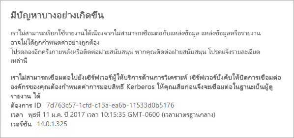
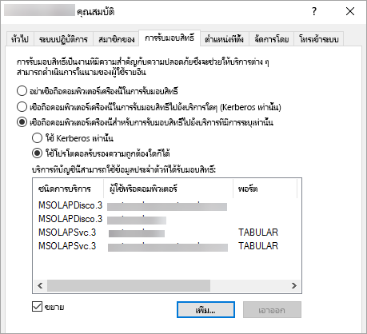

# <a name="configure-kerberos-to-use-power-bi-reports"></a><span data-ttu-id="6a561-103">กำหนดค่า Kerberos เพื่อใช้รายงาน Power BI</span><span class="sxs-lookup"><span data-stu-id="6a561-103">Configure Kerberos to use Power BI reports</span></span>
<iframe width="640" height="360" src="https://www.youtube.com/embed/vCH8Fa3OpQ0?showinfo=0" frameborder="0" allowfullscreen></iframe>

<span data-ttu-id="6a561-104">เรียนรู้วิธีการกำหนดค่าเซิร์ฟเวอร์รายงานของคุณสำหรับการรับรองความถูกต้อง Kerberos ไปยังแหล่งข้อมูลที่ใช้ภายในรายงานของ Power BI สำหรับสภาพแวดล้อมแบบกระจาย</span><span class="sxs-lookup"><span data-stu-id="6a561-104">Learn how to configure your report server for Kerberos authentication to data sources used within your Power BI reports for a distributed environment.</span></span>

<span data-ttu-id="6a561-105">เซิร์ฟเวอร์รายงาน Power BI รวมถึงความสามารถในการโฮสต์รายงาน Power BI</span><span class="sxs-lookup"><span data-stu-id="6a561-105">Power BI Report Server includes the ability to host Power BI reports.</span></span> <span data-ttu-id="6a561-106">เซิร์ฟเวอร์รายการของคุณสนับสนุนแหล่งข้อมูลมากมาย</span><span class="sxs-lookup"><span data-stu-id="6a561-106">Many data sources are supported by your report server.</span></span> <span data-ttu-id="6a561-107">ในขณะที่บทความนี้มุ่งเน้นโดยเฉพาะ SQL Server Analysis Services คุณสามารถใช้แนวคิด และที่นำไปใช้กับแหล่งข้อมูลอื่น ๆ เช่น SQL Server</span><span class="sxs-lookup"><span data-stu-id="6a561-107">While this article focuses specifically on SQL Server Analysis Services, you can use the concepts and apply that to other data sources such as SQL Server.</span></span>

<span data-ttu-id="6a561-108">คุณสามารถติดตั้งเซิร์ฟเวอร์รายงาน Power BI, SQL Server และ Analysis Services บนคอมพิวเตอร์เครื่องเดียวได้ และทุกอย่างควรใช้งานได้โดยไม่ต้องกำหนดค่าเพิ่มเติม</span><span class="sxs-lookup"><span data-stu-id="6a561-108">You can install Power BI Report Server, SQL Server and Analysis Services on a single machine and everything should work without additional configuration.</span></span> <span data-ttu-id="6a561-109">ซึ่งดีมากสำหรับสภาพแวดล้อมการทดสอบ</span><span class="sxs-lookup"><span data-stu-id="6a561-109">This is great for a test environment.</span></span> <span data-ttu-id="6a561-110">คุณอาจพบข้อผิดพลาดถ้าคุณมีบริการเหล่านี้ติดตั้งอยู่บนเครื่องที่แยกต่างหากที่เรียกว่าสภาพแวดล้อมแบบกระจาย</span><span class="sxs-lookup"><span data-stu-id="6a561-110">You may hit errors if you have these services installed on separate machines which is called a distributed environment.</span></span> <span data-ttu-id="6a561-111">ในสภาพแวดล้อมเช่นนี้ คุณจะต้องใช้การรับรองความถูกต้อง Kerberos</span><span class="sxs-lookup"><span data-stu-id="6a561-111">In this environment, you are required to use Kerberos authentication.</span></span> <span data-ttu-id="6a561-112">ต้องมีการกำหนดค่าที่จำเป็นสำหรับการนำขั้นตอนนี้ไปใช้</span><span class="sxs-lookup"><span data-stu-id="6a561-112">There is configuration required to implement this.</span></span> 

<span data-ttu-id="6a561-113">โดยเฉพาะอย่างยิ่ง คุณจะต้องกำหนดค่าการมอบสิทธิ์ที่บังคับ</span><span class="sxs-lookup"><span data-stu-id="6a561-113">Specifically, you will need to configure constrained delegation.</span></span> <span data-ttu-id="6a561-114">คุณอาจมีการกำหนดค่า Kerberos ในสภาพแวดล้อมของคุณ แต่ Kerberos อาจไม่ถูกกำหนดค่าการมอบสิทธิ์ที่บังคับ</span><span class="sxs-lookup"><span data-stu-id="6a561-114">You may have Kerberos configured in your environment but it may not be configured for constrained delegation.</span></span>

## <a name="error-running-report"></a><span data-ttu-id="6a561-115">ข้อผิดพลาดในการเรียกใช้รายงาน</span><span class="sxs-lookup"><span data-stu-id="6a561-115">Error running report</span></span>
<span data-ttu-id="6a561-116">ถ้าเซิร์ฟเวอร์รายงานของคุณไม่ได้มีการกำหนดค่าอย่างถูกต้อง อาจมีผิดพลาดต่อไปนี้เกิดขึ้น</span><span class="sxs-lookup"><span data-stu-id="6a561-116">If your report server is not configured properly, you may receive the following error.</span></span>

```output
Something went wrong.

We couldn't run the report because we couldn't connect to its data source. The report or data source might not be configured correctly. 
```

<span data-ttu-id="6a561-117">ในรายละเอียดทางเทคนิค คุณจะเห็นข้อความต่อไปนี้</span><span class="sxs-lookup"><span data-stu-id="6a561-117">Within Technical details, you will see the following message.</span></span>

```output
We couldn't connect to the Analysis Services server. The server forcibly closed the connection. To connect as the user viewing the report, your organization must have configured Kerberos constrained delegation.
```


 
## <a name="configuring-kerberos-constrained-delegation"></a><span data-ttu-id="6a561-119">การกำหนดค่าการมอบสิทธิ์ที่บังคับของ Kerberos</span><span class="sxs-lookup"><span data-stu-id="6a561-119">Configuring Kerberos constrained delegation</span></span>
<span data-ttu-id="6a561-120">มีหลายรายการที่จำเป็นต้องกำหนดค่าลำดับเพื่อให้การรับมอบสิทธิ์ที่บังคับของ Kerberos ทำงานได้</span><span class="sxs-lookup"><span data-stu-id="6a561-120">There are several items that need to be configured in order for Kerberos constrained delegation to work.</span></span> <span data-ttu-id="6a561-121">ซึ่งรวมถึงชื่อหลักของการบริการ (Service Principal Name: SPN) และการตั้งค่าการมอบสิทธิ์บนบัญชีบริการ</span><span class="sxs-lookup"><span data-stu-id="6a561-121">This includes Service Principal Names (SPN) and delegation settings on service accounts.</span></span>

> [!NOTE]
> <span data-ttu-id="6a561-122">ในการกำหนดค่า SPN และการตั้งค่าการรับมอบสิทธิ์ คุณต้องเป็นผู้ดูแลโดเมน</span><span class="sxs-lookup"><span data-stu-id="6a561-122">In order to configure SPNs and delegation settings, you need to be a domain administrator.</span></span>
> 
> 

<span data-ttu-id="6a561-123">เราจะต้องกำหนดค่าหรือตรวจสอบรายการต่อไปนี้</span><span class="sxs-lookup"><span data-stu-id="6a561-123">We will need to configure, or validate, the following.</span></span>

1. <span data-ttu-id="6a561-124">ชนิดการรับรองความถูกต้องภายในการกำหนดค่าเซิร์ฟเวอร์รายงาน</span><span class="sxs-lookup"><span data-stu-id="6a561-124">Authentication type within Report Server config.</span></span>
2. <span data-ttu-id="6a561-125">SPN สำหรับบัญชีผู้ใช้บริการเซิร์ฟเวอร์รายงาน</span><span class="sxs-lookup"><span data-stu-id="6a561-125">SPNs for the report server service account.</span></span>
3. <span data-ttu-id="6a561-126">SPN สำหรับบริการ Analysis Services</span><span class="sxs-lookup"><span data-stu-id="6a561-126">SPNs for the Analysis Services service.</span></span>
4. <span data-ttu-id="6a561-127">SPN สำหรับบริการเบราเซอร์ SQL บนเครื่องของ Analysis Services</span><span class="sxs-lookup"><span data-stu-id="6a561-127">SPNs for the SQL Browser service on the Analysis Services machine.</span></span> <span data-ttu-id="6a561-128">ส่วนนี้สำหรับตัวอย่างที่ตั้งชื่อแล้วเท่านั้น</span><span class="sxs-lookup"><span data-stu-id="6a561-128">This is for named instances only.</span></span>
5. <span data-ttu-id="6a561-129">ตั้งค่าการรับมอบสิทธิ์บนเซิร์ฟเวอร์รายงานบัญชีบริการ</span><span class="sxs-lookup"><span data-stu-id="6a561-129">Delegation settings on the report server service account.</span></span>

## <a name="authentication-type-within-report-server-configuration"></a><span data-ttu-id="6a561-130">ชนิดการรับรองความถูกต้องภายในการกำหนดค่าเซิร์ฟเวอร์รายงาน</span><span class="sxs-lookup"><span data-stu-id="6a561-130">Authentication type within Report Server configuration</span></span>
<span data-ttu-id="6a561-131">เราจำเป็นต้องกำหนดค่าชนิดการรับรองความถูกต้องสำหรับเซิร์ฟเวอร์รายงานเพื่ออนุญาตให้สามารถรับมอบสิทธิ์ Kerberos ที่บังคับได้</span><span class="sxs-lookup"><span data-stu-id="6a561-131">We need to configure the authentication type for the report server to allow for Kerberos constrained delegation.</span></span> <span data-ttu-id="6a561-132">ซึ่งทำได้ภายในไฟล์ **rsreportserver.config**</span><span class="sxs-lookup"><span data-stu-id="6a561-132">This is done within the **rsreportserver.config** file.</span></span> <span data-ttu-id="6a561-133">ตำแหน่งเริ่มต้นสำหรับไฟล์นี้คือ`C:\Program Files\Microsoft Power BI Report Server\PBIRS\ReportServer`</span><span class="sxs-lookup"><span data-stu-id="6a561-133">The default location for this file is `C:\Program Files\Microsoft Power BI Report Server\PBIRS\ReportServer`.</span></span>

<span data-ttu-id="6a561-134">ภายในไฟล์ rsreportserver.config คุณจะต้องการปรับค่าส่วน **รับรองความถูกต้อง/AuthenticationTypes** ให้เหมาะสมยิ่งขึ้น</span><span class="sxs-lookup"><span data-stu-id="6a561-134">Within the rsreportserver.config file, you will want to fine the **Authentication/AuthenticationTypes** section.</span></span>

<span data-ttu-id="6a561-135">เราต้องตรวจสอบให้แน่ใจว่า RSWindowsNegotiate อยู่ในรายการและเป็นส่วนแรกในรายการของชนิดการรับรองความถูกต้อง</span><span class="sxs-lookup"><span data-stu-id="6a561-135">We want to make sure that RSWindowsNegotiate is listed and the first in the list of authentication types.</span></span> <span data-ttu-id="6a561-136">ซึ่งควรมีลักษณะคล้ายต่อไปนี้</span><span class="sxs-lookup"><span data-stu-id="6a561-136">It should look similar to the following.</span></span>

```xml
<AuthenticationTypes>
    <RSWindowsNegotiate/>
    <RSWindowsNTLM/>
</AuthenticationTypes>
```

<span data-ttu-id="6a561-137">ถ้าคุณต้องเปลี่ยนแปลงไฟล์การกำหนดค่า คุณควรหยุดและเริ่มใช้งานเซิร์ฟเวอร์รายงานเพื่อทำการตรวจสอบให้แน่ใจว่าการเปลี่ยนแปลงดังกล่าวมีผล</span><span class="sxs-lookup"><span data-stu-id="6a561-137">If you had to change the configuration file, you will want to stop and start the report server to make sure the changes take effect.</span></span>

<span data-ttu-id="6a561-138">สำหรับข้อมูลเพิ่มเติม ดูที่[กำหนดค่าการรับรองความถูกต้องของ Windows บนเซิร์ฟเวอร์รายงาน](/sql/reporting-services/security/configure-windows-authentication-on-the-report-server)</span><span class="sxs-lookup"><span data-stu-id="6a561-138">For more information, see [Configure Windows Authentication on the Report Server](/sql/reporting-services/security/configure-windows-authentication-on-the-report-server).</span></span>

## <a name="spns-for-the-report-server-service-account"></a><span data-ttu-id="6a561-139">SPN สำหรับบัญชีผู้ใช้บริการเซิร์ฟเวอร์รายงาน</span><span class="sxs-lookup"><span data-stu-id="6a561-139">SPNs for the report server service account</span></span>
<span data-ttu-id="6a561-140">ต่อไปเราจำเป็นต้องตรวจสอบให้แน่ใจว่าเซิร์ฟเวอร์รายงานมี SPN ที่ถูกต้องพร้อมใช้งานหรือไม่</span><span class="sxs-lookup"><span data-stu-id="6a561-140">Next, we need to make sure that the report server has valid SPNs available.</span></span> <span data-ttu-id="6a561-141">ซึ่งจะยึดตามบัญชีผู้ใช้บริการที่มีการกำหนดค่าสำหรับเซิร์ฟเวอร์รายงานดังกล่าว</span><span class="sxs-lookup"><span data-stu-id="6a561-141">This is based on the service account that is configured for the report server.</span></span>

### <a name="virtual-service-account-or-network-service"></a><span data-ttu-id="6a561-142">บัญชีบริการเสมือนหรือบริการเครือข่าย</span><span class="sxs-lookup"><span data-stu-id="6a561-142">Virtual Service Account or Network Service</span></span>
<span data-ttu-id="6a561-143">ถ้าเซิร์ฟเวอร์รายงานของคุณมีการกำหนดค่าสำหรับบัญชีบัญชีบริการเสมือนหรือบัญชีบริการเครือข่าย คุณไม่ควรต้องทำอะไรอีก</span><span class="sxs-lookup"><span data-stu-id="6a561-143">If your report server is configured for the Virtual Service Account or Network Service account, you should not have to do anything.</span></span> <span data-ttu-id="6a561-144">สิ่งเหล่านี้อยู่ในบริบทของบัญชีเครื่องแล้ว</span><span class="sxs-lookup"><span data-stu-id="6a561-144">These are in the context of the machine account.</span></span> <span data-ttu-id="6a561-145">บัญชีเครื่องจะมี SPN โฮสต์ตามค่าเริ่มต้น</span><span class="sxs-lookup"><span data-stu-id="6a561-145">The machine account will have HOST SPNs by default.</span></span> <span data-ttu-id="6a561-146">ซึ่งจะครอบคลุมบริการ HTTP และจะใช้โดยเซิร์ฟเวอร์รายงาน</span><span class="sxs-lookup"><span data-stu-id="6a561-146">These will cover the HTTP service and will be used by the report server.</span></span>

<span data-ttu-id="6a561-147">ถ้าคุณกำลังใช้ชื่อเซิร์ฟเวอร์เสมือนที่ชื่อไม่เหมือนกับบัญชีเครื่อง รายการโฮสต์จะไม่ครอบคลุมและคุณจะต้องเพิ่ม SPN สำหรับชื่อโฮสต์เซิร์ฟเวอร์เสมือนด้วยตนเอง</span><span class="sxs-lookup"><span data-stu-id="6a561-147">If you are using a virtual server name, one that is not same as the machine account, the HOST entries will not cover you and you will need to manually add the SPNs for the virtual server host name.</span></span>

### <a name="domain-user-account"></a><span data-ttu-id="6a561-148">บัญชีผู้ใช้โดเมน</span><span class="sxs-lookup"><span data-stu-id="6a561-148">Domain user account</span></span>
<span data-ttu-id="6a561-149">ถ้าเซิร์ฟเวอร์รายงานของคุณถูกกำหนดค่าให้ใช้บัญชีผู้ใช้โดเมน คุณจะต้องสร้าง HTTP SPN บนบัญชีผู้ใช้นั้นด้วยตนเอง</span><span class="sxs-lookup"><span data-stu-id="6a561-149">If your report server is configured to use a domain user account, you will have to manually create HTTP SPNs on that account.</span></span> <span data-ttu-id="6a561-150">ซึ่งสามารถทำได้โดยใช้เครื่องมือ setspn ที่มาพร้อมกับ Windows</span><span class="sxs-lookup"><span data-stu-id="6a561-150">This can be done using the setspn tool that comes with Windows.</span></span>

> [!NOTE]
> <span data-ttu-id="6a561-151">คุณจะต้องมีสิทธิ์ผู้ดูแลระบบโดเมนเพื่อสร้าง SPN ขึ้น</span><span class="sxs-lookup"><span data-stu-id="6a561-151">You will need domain admin rights in order to create the SPN.</span></span>
> 
> 

<span data-ttu-id="6a561-152">แนะนำให้สร้างสอง SPN</span><span class="sxs-lookup"><span data-stu-id="6a561-152">It is recommended to create two SPNs.</span></span> <span data-ttu-id="6a561-153">หนึ่งด้วยชื่อ NetBIOS และอีกหนึ่งด้วยชื่อโดเมนแบบเต็มที่มีคุณสมบัติเหมาะสม (FQDN)</span><span class="sxs-lookup"><span data-stu-id="6a561-153">One with the NetBIOS name and the other with the fully qualified domain name (FQDN).</span></span> <span data-ttu-id="6a561-154">SPN จะอยู่ในรูปแบบดังต่อไปนี้</span><span class="sxs-lookup"><span data-stu-id="6a561-154">The SPN will be in the following format.</span></span>

```console
<Service>/<Host>:<port>
```

<span data-ttu-id="6a561-155">เซิร์ฟเวอร์รายงาน Power BI จะใช้การบริการของ HTTP</span><span class="sxs-lookup"><span data-stu-id="6a561-155">Power BI Report Server will use a Service of HTTP.</span></span> <span data-ttu-id="6a561-156">สำหรับ HTTP SPN คุณจะไม่ทำรายการพอร์ต</span><span class="sxs-lookup"><span data-stu-id="6a561-156">For HTTP SPNs you will not list a port.</span></span> <span data-ttu-id="6a561-157">บริการที่เราสนใจที่นี่คือ HTTP</span><span class="sxs-lookup"><span data-stu-id="6a561-157">The service we are interested in here is HTTP.</span></span> <span data-ttu-id="6a561-158">โฮสต์ของ SPN จะเป็นชื่อที่คุณใช้ใน URL หนึ่ง</span><span class="sxs-lookup"><span data-stu-id="6a561-158">The host of the SPN will be the name you use in a URL.</span></span> <span data-ttu-id="6a561-159">โดยทั่วไปแล้วนี่คือชื่อของเครื่อง</span><span class="sxs-lookup"><span data-stu-id="6a561-159">Typically, this is the machine name.</span></span> <span data-ttu-id="6a561-160">ถ้าคุณอยู่เบื้องหลังตัวสร้างสมดุลการโหลด ชื่อนี้อาจเป็นชื่อเสมือน</span><span class="sxs-lookup"><span data-stu-id="6a561-160">If you are behind a load balancer, this may be a virtual name.</span></span>

> [!NOTE]
> <span data-ttu-id="6a561-161">คุณสามารถตรวจสอบ URL ได้ด้วยการดูสิ่งที่คุณใส่ลงในแถบที่อยู่ของเบราว์เซอร์ หรือคุณสามารถค้นหาในตัวจัดการการกำหนดค่าเซิร์ฟเวอร์รายงานบนแถบ Web Portal URL</span><span class="sxs-lookup"><span data-stu-id="6a561-161">You can verify the URL by either looking at what you enter into the address bar of the browser, or you can look in the Report Server Configuration Manager on the Web Portal URL tab.</span></span>
> 
> 

<span data-ttu-id="6a561-162">ถ้าชื่อเครื่องของคุณคือ ContosoRS ดังนั้น SPN ของคุณจะเป็นดังต่อไปนี้</span><span class="sxs-lookup"><span data-stu-id="6a561-162">If your machine name is ContosoRS, your SPNs would be the following.</span></span>

| <span data-ttu-id="6a561-163">ประเภท SPN</span><span class="sxs-lookup"><span data-stu-id="6a561-163">SPN Type</span></span> | <span data-ttu-id="6a561-164">SPN</span><span class="sxs-lookup"><span data-stu-id="6a561-164">SPN</span></span> |
| --- | --- |
| <span data-ttu-id="6a561-165">ชื่อโดเมนแบบเต็มที่มีคุณสมบัติ (FQDN)</span><span class="sxs-lookup"><span data-stu-id="6a561-165">Fully Qualified Domain Name (FQDN)</span></span> |<span data-ttu-id="6a561-166">HTTP/ContosoRS.contoso.com</span><span class="sxs-lookup"><span data-stu-id="6a561-166">HTTP/ContosoRS.contoso.com</span></span> |
| <span data-ttu-id="6a561-167">NetBIOS</span><span class="sxs-lookup"><span data-stu-id="6a561-167">NetBIOS</span></span> |<span data-ttu-id="6a561-168">HTTP/ContosoRS</span><span class="sxs-lookup"><span data-stu-id="6a561-168">HTTP/ContosoRS</span></span> |

### <a name="location-of-spn"></a><span data-ttu-id="6a561-169">ตำแหน่งที่ตั้งของ SPN</span><span class="sxs-lookup"><span data-stu-id="6a561-169">Location of SPN</span></span>
<span data-ttu-id="6a561-170">คุณจะใส่ SPN นี้ที่ไหน?</span><span class="sxs-lookup"><span data-stu-id="6a561-170">So, where do you put the SPN?</span></span> <span data-ttu-id="6a561-171">SPN จะถูกวางไว้บนสิ่งที่คุณกำลังใช้สำหรับบัญชีบริการของคุณ</span><span class="sxs-lookup"><span data-stu-id="6a561-171">The SPN will be placed on whatever you are using for your service account.</span></span> <span data-ttu-id="6a561-172">ถ้าคุณใช้บัญชีผู้ใช้บริการเสมือนหรือบริการเครือข่าย ส่วนนี้จะเป็นบัญชีเครื่อง</span><span class="sxs-lookup"><span data-stu-id="6a561-172">If you are using Virtual Service Account or Network Service, this will be the machine account.</span></span> <span data-ttu-id="6a561-173">แม้ว่าเราได้กล่าวถึงแล้วก่อนหน้านี้ คุณควรจำเป็นต้องทำสิ่งนี้สำหรับ URL เสมือนเท่านั้น</span><span class="sxs-lookup"><span data-stu-id="6a561-173">Although we mentioned before you should only need to do this for a virtual URL.</span></span> <span data-ttu-id="6a561-174">ถ้าคุณใช้ผู้ใช้โดเมนสำหรับบัญชีผู้ใช้บริการเซิร์ฟเวอร์รายงาน คุณจะใส่ SPN ที่บัญชีผู้ใช้โดเมนนั้น</span><span class="sxs-lookup"><span data-stu-id="6a561-174">If you are using a domain user for the report server service account, then you will place the SPN on that domain user account.</span></span>

<span data-ttu-id="6a561-175">ตัวอย่างเช่น ถ้าเราใช้บัญชีผู้ใช้บริการเครือข่ายและชื่อของเราเครื่องคือ ContosoRS เราจะวาง SPN ทีี่ ContosoRS</span><span class="sxs-lookup"><span data-stu-id="6a561-175">For example, if we are using the Network Service account and our machine name is ContosoRS, we would place the SPN on ContosoRS.</span></span>

<span data-ttu-id="6a561-176">ถ้าเราใช้บัญชีผู้ใช้โดเมนของ RSService เราจะวาง SPN บน RSService</span><span class="sxs-lookup"><span data-stu-id="6a561-176">If we are using a domain user account of RSService, we would place the SPN on RSService.</span></span>

### <a name="using-setspn-to-add-the-spn"></a><span data-ttu-id="6a561-177">ใช้ SetSPN เพื่อเพิ่ม SPN ดังกล่าว</span><span class="sxs-lookup"><span data-stu-id="6a561-177">Using SetSPN to add the SPN</span></span>
<span data-ttu-id="6a561-178">เราสามารถใช้เครื่องมือ SetSPN เพื่อเพิ่ม SPN ดังกล่าวได้</span><span class="sxs-lookup"><span data-stu-id="6a561-178">We can use the SetSPN tool to add the SPN.</span></span> <span data-ttu-id="6a561-179">เราจะทำตามตัวอย่างเดียวกันกับทางด้านบนด้วยบัญชีผู้ใช้เครื่องและบัญชีผู้ใช้โดเมน</span><span class="sxs-lookup"><span data-stu-id="6a561-179">We will follow the same example as above with the Machine account and the domain user account.</span></span>

<span data-ttu-id="6a561-180">การวาง SPN ดังกล่าวบนบัญชีเครื่องสำหรับทั้ง FQDN และ NetBIOS SPN จะมีลักษณะคล้ายกับรายการต่อไปนี้ถ้าเราใช้ URL แบบเสมือนของ contosoreports</span><span class="sxs-lookup"><span data-stu-id="6a561-180">Placing the SPN on a machine account, for both the FQDN and NetBIOS SPN, would look similar to the following if we were using a virtual URL of contosoreports.</span></span>

```console
Setspn -a HTTP/contosoreports.contoso.com ContosoRS
Setspn -a HTTP/contosoreports ContosoRS
```

<span data-ttu-id="6a561-181">การวาง SPN บนบัญชีผู้ใช้โดเมนสำหรับทั้ง FQDN และ NetBIOS SPN จะมีลักษณะคล้ายกับรายการดังต่อไปนี้ถ้าคุณใช้ชื่อเครื่องสำหรับโฮสต์ของ SPN</span><span class="sxs-lookup"><span data-stu-id="6a561-181">Placing the SPN on a domain user account, for both the FQDN and NetBIOS SPN, would look similar to the following if you were using the machine name for the host of the SPN.</span></span>

```console
Setspn -a HTTP/ContosoRS.contoso.com RSService
Setspn -a HTTP/ContosoRS RSService
```

## <a name="spns-for-the-analysis-services-service"></a><span data-ttu-id="6a561-182">SPN สำหรับบริการ Analysis Services</span><span class="sxs-lookup"><span data-stu-id="6a561-182">SPNs for the Analysis Services service</span></span>
<span data-ttu-id="6a561-183">SPN สำหรับ Analysis Services จะคล้ายกับที่เราดำเนินการกับเซิร์ฟเวอร์รายงาน Power BI</span><span class="sxs-lookup"><span data-stu-id="6a561-183">The SPNs for Analysis Services are similar to what we did with Power BI Report Server.</span></span> <span data-ttu-id="6a561-184">รูปแบบของ SPN จะแตกต่างเล็กน้อยถ้าคุณมีตัวอย่างที่ตั้งชื่อแล้ว</span><span class="sxs-lookup"><span data-stu-id="6a561-184">The format of the SPN is a little different if you have a named instance.</span></span>

<span data-ttu-id="6a561-185">สำหรับ Analysis Services เราใช้บริการของ MSOLAPSvc.3</span><span class="sxs-lookup"><span data-stu-id="6a561-185">For Analysis Services, we use a Service of MSOLAPSvc.3.</span></span> <span data-ttu-id="6a561-186">เราจะระบุชื่อตัวอย่างสำหรับตำแหน่งที่ตั้งพอร์ตบน SPN</span><span class="sxs-lookup"><span data-stu-id="6a561-186">We will specify the instance name for the port location on the SPN.</span></span> <span data-ttu-id="6a561-187">ส่วนที่เป็นโฮสต์ของ SPN จะเป็นชื่อเครื่องหรือชื่อเสมือนของกลุ่ม</span><span class="sxs-lookup"><span data-stu-id="6a561-187">The host part of the SPN will either be the machine name, or the Cluster virtual name.</span></span>

<span data-ttu-id="6a561-188">ตัวอย่างของ SPN สำหรับ Analysis Services มีลักษณะดังต่อไปนี้</span><span class="sxs-lookup"><span data-stu-id="6a561-188">An example of an Analysis Services SPN would look like the following.</span></span>

| <span data-ttu-id="6a561-189">ชนิด</span><span class="sxs-lookup"><span data-stu-id="6a561-189">Type</span></span> | <span data-ttu-id="6a561-190">รูปแบบ</span><span class="sxs-lookup"><span data-stu-id="6a561-190">Format</span></span> |
| --- | --- |
| <span data-ttu-id="6a561-191">ตัวอย่างเริ่มต้น</span><span class="sxs-lookup"><span data-stu-id="6a561-191">Default instance</span></span> |<span data-ttu-id="6a561-192">MSOLAPSvc.3/ContosoAS.contoso.com</span><span class="sxs-lookup"><span data-stu-id="6a561-192">MSOLAPSvc.3/ContosoAS.contoso.com</span></span><br><span data-ttu-id="6a561-193">MSOLAPSvc.3/ContosoAS</span><span class="sxs-lookup"><span data-stu-id="6a561-193">MSOLAPSvc.3/ContosoAS</span></span> |
| <span data-ttu-id="6a561-194">ตัวอย่างที่ตั้งชื่อ</span><span class="sxs-lookup"><span data-stu-id="6a561-194">Named instance</span></span> |<span data-ttu-id="6a561-195">MSOLAPSvc.3/ContosoAS.contoso.com:INSTANCENAME</span><span class="sxs-lookup"><span data-stu-id="6a561-195">MSOLAPSvc.3/ContosoAS.contoso.com:INSTANCENAME</span></span><br><span data-ttu-id="6a561-196">MSOLAPSvc.3/ContosoAS:INSTANCENAME</span><span class="sxs-lookup"><span data-stu-id="6a561-196">MSOLAPSvc.3/ContosoAS:INSTANCENAME</span></span> |

<span data-ttu-id="6a561-197">การวางตำแหน่งของ SPN จะคล้ายกับสิ่งที่กล่าวถึงก่อนหน้านี้กับเซิร์ฟเวอร์รายงาน Power BI</span><span class="sxs-lookup"><span data-stu-id="6a561-197">Placement of the SPN is also similar to what was mentioned with Power BI Report Server.</span></span> <span data-ttu-id="6a561-198">ซึ่งจะยึดตามบัญชีผู้ใช้บริการ</span><span class="sxs-lookup"><span data-stu-id="6a561-198">It is based on the service account.</span></span>  <span data-ttu-id="6a561-199">ถ้าคุณใช้ระบบภายในเครื่องหรือบริการเครือข่าย คุณจะอยู่ในบริบทของบัญชีเครื่อง</span><span class="sxs-lookup"><span data-stu-id="6a561-199">If you are using Local System or Network Service, you will be in the context of the machine account.</span></span> <span data-ttu-id="6a561-200">ถ้าคุณใช้บัญชีผู้ใช้โดเมนสำหรับตัวอย่าง Analysis Services คุณจะวาง SPN ที่บัญชีผู้ใช้โดเมนนั้น</span><span class="sxs-lookup"><span data-stu-id="6a561-200">If you are using a domain user account for the Analysis Services instance, you will place the SPN on the domain user account.</span></span>

### <a name="using-setspn-to-add-the-spn"></a><span data-ttu-id="6a561-201">ใช้ SetSPN เพื่อเพิ่ม SPN ดังกล่าว</span><span class="sxs-lookup"><span data-stu-id="6a561-201">Using SetSPN to add the SPN</span></span>
<span data-ttu-id="6a561-202">เราสามารถใช้เครื่องมือ SetSPN เพื่อเพิ่ม SPN ดังกล่าวได้</span><span class="sxs-lookup"><span data-stu-id="6a561-202">We can use the SetSPN tool to add the SPN.</span></span> <span data-ttu-id="6a561-203">สำหรับตัวอย่างนี้ ชื่อเครื่องจะเป็น ContosoAS</span><span class="sxs-lookup"><span data-stu-id="6a561-203">For this example, the machine name will be ContosoAS.</span></span>

<span data-ttu-id="6a561-204">การวาง SPN ดังกล่าวบนบัญชีเครื่องสำหรับทั้ง FQDN และ NetBIOS SPN จะมีลักษณะคล้ายกับรายการต่อไปนี้</span><span class="sxs-lookup"><span data-stu-id="6a561-204">Placing the SPN on a machine account, for both the FQDN and NetBIOS SPN, would look similar to the following.</span></span>

```console
Setspn -a MSOLAPSvc.3/ContosoAS.contoso.com ContosoAS
Setspn -a MSOLAPSvc.3/ContosoAS ContosoAS
```

<span data-ttu-id="6a561-205">การวาง SPN ดังกล่าวบนบัญชีผู้ใช้โดเมนสำหรับทั้ง FQDN และ NetBIOS SPN จะมีลักษณะคล้ายกับรายการต่อไปนี้</span><span class="sxs-lookup"><span data-stu-id="6a561-205">Placing the SPN on a domain user account, for both the FQDN and NetBIOS SPN, would look similar to the following.</span></span>

```console
Setspn -a MSOLAPSvc.3/ContosoAS.contoso.com OLAPService
Setspn -a MSOLAPSvc.3/ContosoAS OLAPService
```

## <a name="spns-for-the-sql-browser-service"></a><span data-ttu-id="6a561-206">SPN สำหรับบริการ SQL Browser</span><span class="sxs-lookup"><span data-stu-id="6a561-206">SPNs for the SQL Browser service</span></span>
<span data-ttu-id="6a561-207">ถ้าคุณมีตัวอย่าง Analysis Services ที่มีชื่อแล้ว คุณยังจำเป็นต้องตรวจสอบให้แน่ใจว่าคุณมี SPN สำหรับบริการเบราว์เซอร์ดังกล่าวด้วย</span><span class="sxs-lookup"><span data-stu-id="6a561-207">If you have an Analysis Services named instance, you also need to make sure you have an SPN for the browser service.</span></span> <span data-ttu-id="6a561-208">ซึ่งมีเฉพาะใน Analysis Services</span><span class="sxs-lookup"><span data-stu-id="6a561-208">This is unique to Analysis Services.</span></span>

<span data-ttu-id="6a561-209">SPN สำหรับ SQL Browser จะคล้ายกับสิ่งที่เราดำเนินการกับเซิร์ฟเวอร์รายงาน Power BI</span><span class="sxs-lookup"><span data-stu-id="6a561-209">The SPNs for SQL Browser are similar to what we did with Power BI Report Server.</span></span>

<span data-ttu-id="6a561-210">สำหรับ SQL Browser เราใช้บริการของ MSOLAPDisco.3</span><span class="sxs-lookup"><span data-stu-id="6a561-210">For SQL Browser, we use a Service of MSOLAPDisco.3.</span></span> <span data-ttu-id="6a561-211">เราจะระบุชื่อตัวอย่างสำหรับตำแหน่งที่ตั้งพอร์ตบน SPN</span><span class="sxs-lookup"><span data-stu-id="6a561-211">We will specify the instance name for the port location on the SPN.</span></span> <span data-ttu-id="6a561-212">ส่วนที่เป็นโฮสต์ของ SPN จะเป็นชื่อเครื่องหรือชื่อเสมือนของกลุ่ม</span><span class="sxs-lookup"><span data-stu-id="6a561-212">The host part of the SPN will either be the machine name, or the Cluster virtual name.</span></span>
<span data-ttu-id="6a561-213">คุณไม่จำเป็นต้องระบุสิ่งใดสำหรับชื่อหรือพอร์ตตัวอย่าง</span><span class="sxs-lookup"><span data-stu-id="6a561-213">You do not have to specify anything for the instance name or port.</span></span>

<span data-ttu-id="6a561-214">ตัวอย่างของ SPN สำหรับ Analysis Services มีลักษณะดังต่อไปนี้</span><span class="sxs-lookup"><span data-stu-id="6a561-214">An example of an Analysis Services SPN would look like the following.</span></span>

```console
MSOLAPDisco.3/ContosoAS.contoso.com
MSOLAPDisco.3/ContosoAS
```

<span data-ttu-id="6a561-215">การวางตำแหน่งของ SPN จะคล้ายกับสิ่งที่กล่าวถึงก่อนหน้านี้กับเซิร์ฟเวอร์รายงาน Power BI</span><span class="sxs-lookup"><span data-stu-id="6a561-215">Placement of the SPN is also similar to what was mentioned with Power BI Report Server.</span></span> <span data-ttu-id="6a561-216">ความแตกต่าง ณ จุดนี้คือ SQL Browser ทำงานภายใต้บัญชีระบบภายในเครื่องเสมอ</span><span class="sxs-lookup"><span data-stu-id="6a561-216">The difference here is that SQL Browser always runs under the Local System account.</span></span> <span data-ttu-id="6a561-217">ซึ่งหมายความว่า SPN จะไปที่บัญชีเครื่องเสมอ</span><span class="sxs-lookup"><span data-stu-id="6a561-217">This means that the SPNs will always go on the machine account.</span></span> 

### <a name="using-setspn-to-add-the-spn"></a><span data-ttu-id="6a561-218">ใช้ SetSPN เพื่อเพิ่ม SPN ดังกล่าว</span><span class="sxs-lookup"><span data-stu-id="6a561-218">Using SetSPN to add the SPN</span></span>
<span data-ttu-id="6a561-219">เราสามารถใช้เครื่องมือ SetSPN เพื่อเพิ่ม SPN ดังกล่าวได้</span><span class="sxs-lookup"><span data-stu-id="6a561-219">We can use the SetSPN tool to add the SPN.</span></span> <span data-ttu-id="6a561-220">สำหรับตัวอย่างนี้ ชื่อเครื่องจะเป็น ContosoAS</span><span class="sxs-lookup"><span data-stu-id="6a561-220">For this example, the machine name will be ContosoAS.</span></span>

<span data-ttu-id="6a561-221">การวาง SPN ดังกล่าวบนบัญชีเครื่องสำหรับทั้ง FQDN และ NetBIOS SPN จะมีลักษณะคล้ายกับรายการต่อไปนี้</span><span class="sxs-lookup"><span data-stu-id="6a561-221">Placing the SPN on the machine account, for both the FQDN and NetBIOS SPN, would look similar to the following.</span></span>

```console
Setspn -a MSOLAPDisco.3/ContosoAS.contoso.com ContosoAS
Setspn -a MSOLAPDisco.3/ContosoAS ContosoAS
```

<span data-ttu-id="6a561-222">สำหรับข้อมูลเพิ่มเติม ดูที่ [จำเป็นต้องมี SPN สำหรับบริการเบราเซอร์เซิร์ฟเวอร์ SQL](https://support.microsoft.com/kb/950599)</span><span class="sxs-lookup"><span data-stu-id="6a561-222">For more information, see [An SPN for the SQL Server Browser service is required](https://support.microsoft.com/kb/950599).</span></span>

## <a name="delegation-settings-on-the-report-server-service-account"></a><span data-ttu-id="6a561-223">การตั้งค่าการรับมอบสิทธิ์บนบัญชีบริการเซิร์ฟเวอร์รายงาน</span><span class="sxs-lookup"><span data-stu-id="6a561-223">Delegation settings on the report server service account</span></span>
<span data-ttu-id="6a561-224">ส่วนสุดท้ายที่เราจำเป็นต้องกำหนดค่าคือการตั้งค่าการรับมอบสิทธิ์บนบัญชีผู้ใช้บริการเซิร์ฟเวอร์รายงาน</span><span class="sxs-lookup"><span data-stu-id="6a561-224">The last part that we have to configure are the delegation settings on the report server service account.</span></span> <span data-ttu-id="6a561-225">มีเครื่องมือหลายตัวที่คุณสามารถใช้เพื่อดำเนินการขั้นตอนเหล่านี้ได้</span><span class="sxs-lookup"><span data-stu-id="6a561-225">There are different tools you can use to perform these steps.</span></span> <span data-ttu-id="6a561-226">สำหรับจุดประสงค์ของเอกสารนี้ เราจะใช้ผู้ใช้ Active Directory และคอมพิวเตอร์</span><span class="sxs-lookup"><span data-stu-id="6a561-226">For the purposes of this document, we will stick with Active Directory Users and Computers.</span></span>

<span data-ttu-id="6a561-227">คุณจะต้องเริ่มต้นโดยไปที่คุณสมบัติของบัญชีผู้ใช้บริการเซิร์ฟเวอร์รายงานภายในผู้ใช้ Active Directory และคอมพิวเตอร์</span><span class="sxs-lookup"><span data-stu-id="6a561-227">You will need to start by going to the properties of the report server service account within Active Directory Users and Computers.</span></span> <span data-ttu-id="6a561-228">ซึ่งจะเป็นบัญชีเครื่องถ้าคุณใช้บัญชีผู้ใช้บริการเสมือนหรือบริการเครือข่าย หรือจะเป็นบัญชีผู้ใช้โดเมน</span><span class="sxs-lookup"><span data-stu-id="6a561-228">This will either be the machine account, if you used Virtual Service Account or Network Service, or it will be a domain user account.</span></span>

<span data-ttu-id="6a561-229">เราจะต้องกำหนดค่าการมอบสิทธิ์ที่บังคับด้วยส่งผ่านโปรโตคอล</span><span class="sxs-lookup"><span data-stu-id="6a561-229">We will want to configure constrained delegation with protocol transiting.</span></span> <span data-ttu-id="6a561-230">สำหรับการรับมอบสิทธิ์ทีี่บังคับ คุณต้องมีความชัดเจนว่าบริการใดที่คุณต้องการมอบหมาย</span><span class="sxs-lookup"><span data-stu-id="6a561-230">With constrained delegation, you need to be explicit with which services we want to delegate to.</span></span> <span data-ttu-id="6a561-231">เราจะไปและเพิ่มทั้ง SPN สำหรับบริการ Analysis Services และ SPN SQL Browser ไปยังรายการที่เซิร์ฟเวอร์รายงาน Power BI สามารถมอบหมายสิทธิ์ได้</span><span class="sxs-lookup"><span data-stu-id="6a561-231">We will go and add both the Analysis Services service SPN and the SQL Browser SPN to the list that Power BI Report Server can delegate to.</span></span>

1. <span data-ttu-id="6a561-232">คลิกขวาบนบัญชีผู้ใช้บริการเซิร์ฟเวอร์รายงาน และเลือก **คุณสมบัติ**</span><span class="sxs-lookup"><span data-stu-id="6a561-232">Right click on the report server service account and select **Properties**.</span></span>
2. <span data-ttu-id="6a561-233">เลือกแถบ **การมอบหมาย**</span><span class="sxs-lookup"><span data-stu-id="6a561-233">Select the **Delegation** tab.</span></span>
3. <span data-ttu-id="6a561-234">เลือก **เชื่อถือคอมพิวเตอร์เครื่องนี้สำหรับการรับมอบสิทธิ์ไปยังบริการที่ระบุเท่านั้น**</span><span class="sxs-lookup"><span data-stu-id="6a561-234">Select **Trust this computer for delegation to specified services only**.</span></span>
4. <span data-ttu-id="6a561-235">เลือก **ใช้โปรโตคอลรับรองความถูกต้องใดก็ได้**</span><span class="sxs-lookup"><span data-stu-id="6a561-235">Select **Use any authentication protocol**.</span></span>
5. <span data-ttu-id="6a561-236">ใต้ **บริการที่บัญชีผู้ใช้นี้สามารถใช้ข้อมูลประจำตัวที่ได้รับมอบหมาย:** เลือก **เพิ่ม**</span><span class="sxs-lookup"><span data-stu-id="6a561-236">Under the **Services to which this account can present delegated credentials**: select **Add**.</span></span>
6. <span data-ttu-id="6a561-237">ในกล่องโต้ตอบใหม่ เลือก **ผู้ใช้หรือคอมพิวเตอร์**</span><span class="sxs-lookup"><span data-stu-id="6a561-237">In the new dialog, select **Users or Computers**.</span></span>
7. <span data-ttu-id="6a561-238">ป้อนบัญชีบริการสำหรับบริการ Analysis Services และเลือก **ตกลง**</span><span class="sxs-lookup"><span data-stu-id="6a561-238">Enter the service account for the Analysis Services service and select **Ok**.</span></span>
8. <span data-ttu-id="6a561-239">เลือก SPN ที่คุณสร้างขึ้น</span><span class="sxs-lookup"><span data-stu-id="6a561-239">Select the SPN that you created.</span></span> <span data-ttu-id="6a561-240">ซึ่งจะเริ่มต้นด้วย`MSOLAPSvc.3`</span><span class="sxs-lookup"><span data-stu-id="6a561-240">It will begin with `MSOLAPSvc.3`.</span></span> <span data-ttu-id="6a561-241">ถ้าคุณเพิ่มทั้ง FQDN และ NetBIOS SPN ระบบจะเลือกทั้งสองอย่าง</span><span class="sxs-lookup"><span data-stu-id="6a561-241">If you added both the FQDN and the NetBIOS SPN, it will select both.</span></span> <span data-ttu-id="6a561-242">คุณอาจเห็นแค่อย่างเดียวเท่านั้น</span><span class="sxs-lookup"><span data-stu-id="6a561-242">You may only see one.</span></span>
9. <span data-ttu-id="6a561-243">เลือก **ตกลง**</span><span class="sxs-lookup"><span data-stu-id="6a561-243">Select **OK**.</span></span>  <span data-ttu-id="6a561-244">คุณควรเห็น SPN ในรายการแล้วตอนนี้</span><span class="sxs-lookup"><span data-stu-id="6a561-244">You should see the SPN in the list now.</span></span>
10. <span data-ttu-id="6a561-245">คุณอาจเลือก **ขยาย** เพื่อแสดงทั้ง FQDN และ NetBIOS SPN ในรายการดังกล่าว</span><span class="sxs-lookup"><span data-stu-id="6a561-245">Optionally, you can select **Expanded** to show both the FQDN and NetBIOS SPN in the list.</span></span>
11. <span data-ttu-id="6a561-246">เลือก **เพิ่ม** อีกครั้ง</span><span class="sxs-lookup"><span data-stu-id="6a561-246">Select **Add** again.</span></span> <span data-ttu-id="6a561-247">เราจะเพิ่ม SPN SQL Browser ตอนนี้้</span><span class="sxs-lookup"><span data-stu-id="6a561-247">We will add the SQL Browser SPN now.</span></span>
12. <span data-ttu-id="6a561-248">ในกล่องโต้ตอบใหม่ เลือก **ผู้ใช้หรือคอมพิวเตอร์**</span><span class="sxs-lookup"><span data-stu-id="6a561-248">In the new dialog, select **Users or Computers**.</span></span>
13. <span data-ttu-id="6a561-249">ใส่ชื่อเครื่องสำหรับเครื่องที่บริการ SQL Browser เปิดอยู่ แล้วเลือก **ตกลง**</span><span class="sxs-lookup"><span data-stu-id="6a561-249">Enter the Machine name for the machine the SQL Browser service is on and select **Ok**.</span></span>
14. <span data-ttu-id="6a561-250">เลือก SPN ที่คุณสร้างขึ้น</span><span class="sxs-lookup"><span data-stu-id="6a561-250">Select the SPN that you created.</span></span> <span data-ttu-id="6a561-251">ซึ่งจะเริ่มต้นด้วย`MSOLAPDisco.3`</span><span class="sxs-lookup"><span data-stu-id="6a561-251">It will begin with `MSOLAPDisco.3`.</span></span> <span data-ttu-id="6a561-252">ถ้าคุณเพิ่มทั้ง FQDN และ NetBIOS SPN ระบบจะเลือกทั้งสองอย่าง</span><span class="sxs-lookup"><span data-stu-id="6a561-252">If you added both the FQDN and the NetBIOS SPN, it will select both.</span></span> <span data-ttu-id="6a561-253">คุณอาจเห็นแค่อย่างเดียวเท่านั้น</span><span class="sxs-lookup"><span data-stu-id="6a561-253">You may only see one.</span></span>
15. <span data-ttu-id="6a561-254">เลือก **ตกลง**</span><span class="sxs-lookup"><span data-stu-id="6a561-254">Select **Ok**.</span></span> <span data-ttu-id="6a561-255">กล่องโต้ตอบควรมีลักษณะคล้ายรูปต่อไปนี้ ถ้าคุณได้ทำเครื่องหมายที่ **ขยาย**</span><span class="sxs-lookup"><span data-stu-id="6a561-255">The dialog should look similar to the following if you checked **Expanded**.</span></span>
    
    
16. <span data-ttu-id="6a561-257">เลือก **ตกลง**</span><span class="sxs-lookup"><span data-stu-id="6a561-257">Select **Ok**.</span></span>
17. <span data-ttu-id="6a561-258">ปิดและเปิดเซิร์ฟเวอร์รายงาน Power BI ใหม่</span><span class="sxs-lookup"><span data-stu-id="6a561-258">Reboot the Power BI Report Server.</span></span>

## <a name="running-a-power-bi-report"></a><span data-ttu-id="6a561-259">การเรียกใช้รายงาน Power BI</span><span class="sxs-lookup"><span data-stu-id="6a561-259">Running a Power BI Report</span></span>
<span data-ttu-id="6a561-260">หลังจากที่มีการกำหนดค่าด้านบนทั้งหมดแล้ว รายงานของคุณควรแสดงอย่างถูกต้อง</span><span class="sxs-lookup"><span data-stu-id="6a561-260">After all of the above configuration is in place, your report should display properly.</span></span> 


<span data-ttu-id="6a561-262">ขณะที่การกำหนดค่านี้ควรใช้ได้ในกรณีส่วนใหญ่ ด้วย Kerberos อาจมีการกำหนดค่าที่แตกต่างออกไปโดยขึ้นอยู่กับสภาพแวดล้อมของคุณ</span><span class="sxs-lookup"><span data-stu-id="6a561-262">While this configuration should work in most cases, with Kerberos, there can be different configuration depending on your environment.</span></span> <span data-ttu-id="6a561-263">ถ้ารายงานยังคงไม่โหลด คุณจะต้องติดต่อผู้ดูแลระบบโดเมนของคุณเพื่อตรวจสอบเพิ่มเติม หรือติดต่อฝ่ายสนับสนุน</span><span class="sxs-lookup"><span data-stu-id="6a561-263">If the report will still not load, you will want to reach out to your domain administrator to investigate further or contact support.</span></span>

## <a name="next-steps"></a><span data-ttu-id="6a561-264">ขั้นตอนถัดไป</span><span class="sxs-lookup"><span data-stu-id="6a561-264">Next steps</span></span>
[<span data-ttu-id="6a561-265">ภาพรวมของผู้ดูแลระบบ</span><span class="sxs-lookup"><span data-stu-id="6a561-265">Administrator overview</span></span>](admin-handbook-overview.md)  
[<span data-ttu-id="6a561-266">ติดตั้ง Power BI Report Server</span><span class="sxs-lookup"><span data-stu-id="6a561-266">Install Power BI Report Server</span></span>](install-report-server.md)  

<span data-ttu-id="6a561-267">มีคำถามเพิ่มเติมหรือไม่</span><span class="sxs-lookup"><span data-stu-id="6a561-267">More questions?</span></span> [<span data-ttu-id="6a561-268">ลองถามชุมชน Power BI</span><span class="sxs-lookup"><span data-stu-id="6a561-268">Try asking the Power BI Community</span></span>](https://community.powerbi.com/)