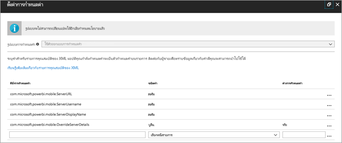
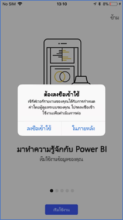
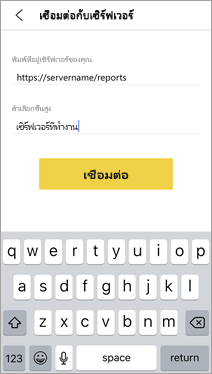
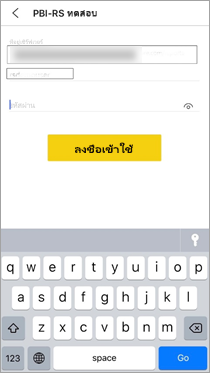

# กำหนดค่าการเข้าถึงเซิร์ฟเวอร์รายงานจากระยะไกล สำหรับแอปอุปกรณ์เคลื่อนที่ ของ Power BIConfigure Power BI mobile app access to Report Server remotely

ใช้ได้กับ:Applies to:

|  |  |
|:--- |:--- |
| iOSiOS |AndroidAndroid |

ในบทความนี้ เรียนรู้วิธีการใช้เครื่องมือ MDM ขององค์กรของคุณเพื่อกำหนดค่าการเข้าถึงแอปอุปกรณ์เคลื่อนที่ไปยังเซิร์ฟเวอร์รายงานIn this article, learn how to use your organization's MDM tool to configure Power BI mobile app access to Report Server. เมื่อต้องการกำหนดค่า ผู้ดูแลระบบ IT สร้างนโยบายการกำหนดค่าแอปด้วยข้อมูลที่จำเป็นเพื่อที่จะส่งไปยังแอปTo configure it, IT administrators create an app configuration policy with the required information to be pushed to the app. 

 ผู้ใช้แอป Power BI สำหรับอุปกรณ์เคลื่อนที่ สามารถเชื่อมต่อกับเซิร์ฟเวอร์รายงานขององค์กรได้ง่ายขึ้น เนื่องจากมีการกำหนดค่าการเชื่อมต่อเซิร์ฟเวอร์รายงานไว้แล้วWith the Report Server connection already configured, Power BI mobile app users can connect to their organization's Report Server more easily. 

## สร้างนโยบายการกำหนดค่าแอปในเครื่องมือ MDMCreate the app configuration policy in MDM tool 

ในฐานะผู้ดูแลระบบ ต่อไปนี้คือขั้นตอนที่คุณทำตามใน Microsoft Intune เพื่อสร้างนโยบายการกำหนดค่าแอปAs admin, here are the steps you follow in Microsoft Intune to create the app configuration policy. ขั้นตอนและประสบการณ์การสร้างนโยบายการกำหนดค่าแอปอาจแตกต่างกันในเครื่องมือ MDM อื่น ๆThe steps and experience of building the app configuration policy may be different in other MDM tools. 

1. เชื่อมต่อเครื่องมือ MDM ของคุณConnect your MDM tool. 
2. สร้างและตั้งชื่อนโยบายการกำหนดค่าแอปใหม่Create and name a new app configuration policy. 
3. เลือกผู้ใช้ที่คุณจะแจกจ่ายนโยบายกำหนดค่าแอปนี้ไปให้Choose which users to distribute this app configuration policy to. 
4. สร้างคู่คีย์-ค่าCreate key-value pairs. 

ตารางต่อไปนี้กล่าวถึงคู่ต่าง ๆThe following table spells out the pairs.

|คีย์Key  |ประเภทType  |คำอธิบายDescription  |
|---------|---------|---------|
| com.microsoft.powerbi.mobile.ServerURLcom.microsoft.powerbi.mobile.ServerURL | สตริงString | URL เซิร์ฟเวอร์รายงานReport Server URL   ควรเริ่มต้นด้วย http/httpsShould start with http/https |
| com.microsoft.powerbi.mobile.ServerUsernamecom.microsoft.powerbi.mobile.ServerUsername | สตริงString | [เป็นทางเลือก][optional]   ชื่อผู้ใช้เพื่อใช้สำหรับการเชื่อมต่อเซิร์ฟเวอร์The username to use for connecting the server.   หากไม่มีชื่ออยู่ แอปจะปรากฏข้อควมให้ผู้ใช้ให้พิมพ์ชื่อผู้ใช้สำหรับการเชื่อมต่อIf one does not exist, the app prompts the user to type the username for the connection.| 
| com.microsoft.powerbi.mobile.ServerDisplayNamecom.microsoft.powerbi.mobile.ServerDisplayName | สตริงString | [เป็นทางเลือก][optional]   ค่าเริ่มต้นเป็น "เซิร์ฟเวอร์รายงาน"Default value is “Report server”   ชื่อที่เรียกง่ายที่ใช้ในแอปเพื่อเป็นตัวแทนเซิร์ฟเวอร์A friendly name used in the app to represent the server | 
| com.microsoft.powerbi.mobile.OverrideServerDetailscom.microsoft.powerbi.mobile.OverrideServerDetails | บูลีนBoolean | ค่าเริ่มต้นเป็น TrueDefault value is True  เมื่อตั้งค่าเป็น "True" จะแทนที่ข้อกำหนดของเซิร์ฟเวอร์รายงานใด ๆ ที่อยู่ในอุปกรณ์เคลื่อนที่อยู่แล้วWhen set to “True”, it overrides any Report Server definition already in the mobile device. เซิร์ฟเวอร์ที่มีอยู่ที่ถูกกำหนดค่าไว้จะถูกลบExisting servers that are already configured are deleted.   การแทนการตั้งค่าเป็น True ยังช่วยป้องกันไม่ให้ผู้ใช้ลบการกำหนดค่านั้นด้วยOverride set to True also prevents the user from removing that configuration.   การตั้งค่าเป็น "False" จะเพิ่มค่าที่ส่ง โดยอปล่อยให้มีการใช้การตั้งค่าใด ๆ ที่มีอยู่ต่อไปSet to “False” adds the pushed values, leaving any existing settings.   หากมีการกำหนดค่า URL เซิร์ฟเวอร์เดียวกันในแอปสำหรับอุปกรณ์เคลื่อนที่แล้ว แอปจะปิดการกำหนดค่าดังกล่าวด้วยIf the same server URL is already configured in the mobile app, the app leaves that configuration as is. แอปจะไม่ขอให้ผู้ใช้ตรวจสอบสิทธิ์ซ้ำสำหรับเซิร์ฟเวอร์เดียวกันThe app doesn't ask the user to reauthenticate  for the same server. |

นี่คือตัวอย่างของการตั้งค่านโยบายการกำหนดค่าโดยใช้ IntuneHere's an example of setting the configuration policy using Intune.

## ผู้ใช้ปลายทางที่เชื่อมต่อกับเซิร์ฟเวอร์รายงานEnd users connecting to Report Server

 สมมติว่าคุณเผยแพร่นโยบายการกำหนดค่าแอปสำหรับรายชื่อการแจกจ่ายSay you publish the app configuration policy for a distribution list. เมื่อผู้ใช้และอุปกรณ์ในรายชื่อการแจกจ่ายดังกล่าวเริ่มต้นใช้งานแอปสำหรับอุปกรณ์เคลื่อนที่ พวกเขาจะได้รับประสบการณ์ดังต่อไปนี้When users and devices on that distribution list start the mobile app, they have the following experience. 

1. พวกเขาจะเห็นข้อความว่าแอปสำหรับอุปกรณ์เคลื่อนที่ของตนได้กำหนดค่าสำหรับเซิร์ฟเวอร์รายงานแล้ว และแตะ **ลงชื่อเข้าใช้**They see a message that their mobile app is configured with a Report Server, and tap **Sign in**.

    

2.  บนหน้า **เชื่อมต่อกับเซิร์ฟเวอร์** รายละเอียดของเซิร์ฟเวอร์รายงานได้ถูกกรอกให้แล้วOn the **Connect to server** page, the report server details already filled in. ผู้ใช้แตะ **เชื่อมต่อ**They tap **Connect**.

    

3. ผู้ใช้พิมพ์รหัสผ่านเพื่อรับรองความถูกต้อง จากนั้นแตะ **ลงชื่อเข้าใช้**They type a password to authenticate, then tap **Sign in**. 

    

ตอนนี้ ผู้ใช้สามารถดูและโต้ตอบกับ KPI และรายงาน Power BI ที่จัดเก็บบนเซิร์ฟเวอร์รายงานNow they can view and interact with KPIs and Power BI reports stored on the Report Server.

## ขั้นตอนถัดไปNext steps

- [เปิดใช้งานการเข้าถึงระยะไกลไปยัง Power BI Mobile ด้วยพร็อกซีแอปพลิเคชันของ Azure ADEnable remote access to Power BI Mobile with Azure AD Application Proxy](/azure/active-directory/manage-apps/application-proxy-integrate-with-power-bi)
- [ภาพรวมของผู้ดูแลระบบAdministrator overview](admin-handbook-overview.md)  
- [ติดตั้ง Power BI Report ServerInstall Power BI Report Server](install-report-server.md)  

มีคำถามเพิ่มเติมหรือไม่More questions? [ลองถามชุมชน Power BITry asking the Power BI Community](https://community.powerbi.com/)