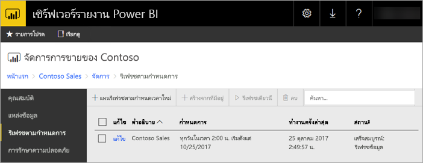
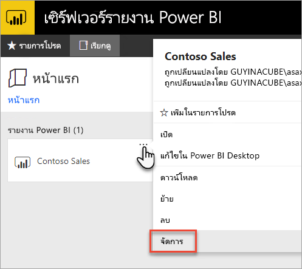
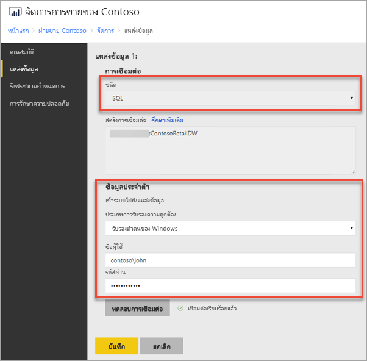
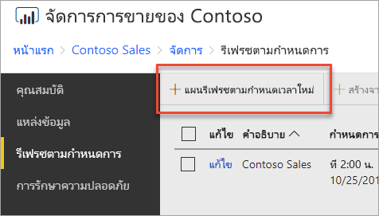
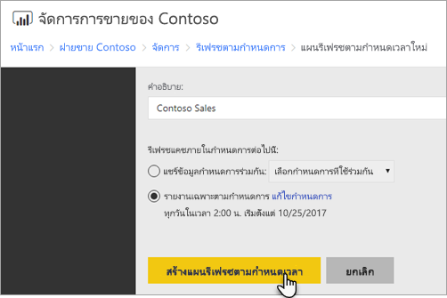
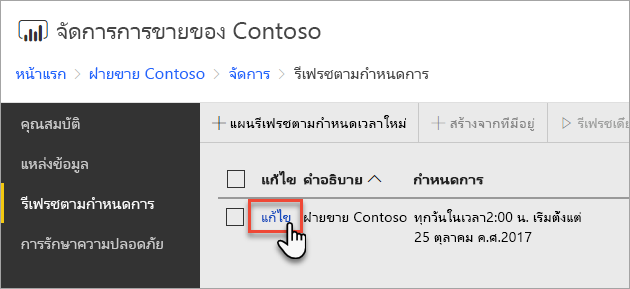
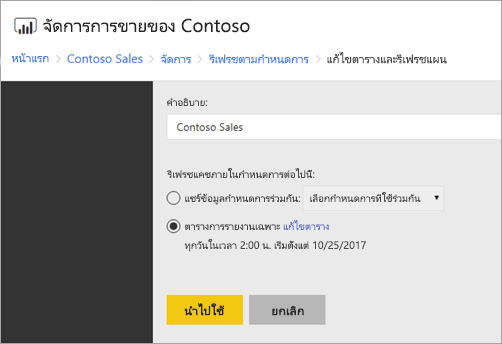

# วิธีการกำหนดค่าการรีเฟรชตามกำหนดเวลา ของรายงาน Power BIHow to configure Power BI report scheduled refresh
ในการรีเฟรชข้อมูลในรายงาน Power BI ในเซิร์ฟเวอร์รายงาน Power BI คุณต้องสร้างแผนการรีเฟรชตามกำหนดเวลาTo refresh data in your Power BI report in Power BI Report Server, you must create a scheduled refresh plan. คุณสร้างแผนนี้ได้ในพื้นที่ *จัดการ* ของรายงาน Power BI บนเซิร์ฟเวอร์รายงานYou create this plan in the *Manage* area of a Power BI report on the report server.

## กำหนดค่าข้อมูลประจำตัวของแหล่งข้อมูลConfigure data source credentials
คุณต้องได้รับการอนุญาตที่จำเป็นในการสร้างแผนการรีเฟรชตามกำหนดเวลาYou need the necessary permissions to create a scheduled refresh plan. สิทธิ์ได้รับการกำหนดไว้ในนิยามบทบาทสำหรับเซิร์ฟเวอร์รายงานPermissions are defined in the role definitions for the report server. ดู [นิยามบทบาท - บทบาทที่กำหนดไว้ล่วงหน้า](/sql/reporting-services/security/role-definitions-predefined-roles) ในเอกสารคู่มือ SQL Server Reporting Services สำหรับรายละเอียดSee [Role definitions - predefined roles](/sql/reporting-services/security/role-definitions-predefined-roles) in the SQL Server Reporting Services documentation for details.

ก่อนที่จะสร้างแผนการรีเฟรชตามกำหนดเวลา คุณจำเป็นต้องตั้งค่าข้อมูลประจำตัวสำหรับ **แต่ละแหล่งข้อมูล** ที่ใช้ในรายงาน Power BI ของคุณPrior to creating a schedule data refresh plan, you need to set the credentials for **each data source** used in your Power BI report.

1. ในพอร์ทัลของเว็บ คลิกขวาบนรายงาน Power BI และเลือก **จัดการ**In the web portal, right-click on the Power BI report and select **Manage**.
   
    
2. ในเมนูทางด้านซ้าย เลือกแท็บ **แหล่งข้อมูล**In the left menu, select the **Data sources** tab.
3. สำหรับแต่ละแหล่งข้อมูลที่ปรากฏขึ้น เลือกชนิดของการรับรองความถูกต้องที่จะใช้เมื่อเชื่อมต่อกับแหล่งข้อมูลนั้นFor each data source that appears, choose the type of authentication to use when connecting to that data source. ใส่ข้อมูลประจำตัวที่เหมาะสมEnter the appropriate credentials.
   
    

## การสร้างแผนรีเฟรชตามกำหนดเวลาCreating a Schedule Refresh Plan
ทำตามขั้นตอนเหล่านี้ เพื่อสร้างแผนรีเฟรชตามกำหนดเวลาFollow these steps to create a scheduled refresh plan.

1. ในพอร์ทัลของเว็บ คลิกขวาบนรายงาน Power BI และเลือก **จัดการ**In the web portal, right-click on the Power BI report and select **Manage**.
   
    
2. ในเมนูทางด้านซ้าย เลือกแท็บ **รีเฟรชตามกำหนดเวลา**In the left menu, select the **Scheduled refresh** tab.
3. บนหน้า **รีเฟรชตามกำหนดเวลา** เลือก **สร้างแผนรีเฟรชตามกำหนดเวลาใหม่**On the **Scheduled refresh** page, select **New scheduled refresh plan**.
   
    
4. บนหน้า **สร้างแผนรีเฟรชตามกำหนดเวลาใหม่** ใส่คำอธิบาย และตั้งค่ากำหนดเวลา สำหรับเวลาที่คุณต้องการให้รูปแบบข้อมูลของคุณถูกรีเฟรชOn the **New Scheduled Refresh Plan** page, enter a description and set a schedule for when you want your data model to be refreshed.
5. เลือก **สร้างแผนรีเฟรชตามกำหนดเวลา** เมื่อเสร็จแล้วSelect **Create scheduled refresh plan** when done.
   
    

## การปรับเปลี่ยนแผนรีเฟรชตามกำหนดเวลาModifying a Schedule Refresh Plan
การปรับเปลี่ยนแผนรีเฟรชตามกำหนดเวลา จะคล้ายกับเวลาสร้างแผนModifying a scheduled refresh plan is similar to creating one.

1. ในพอร์ทัลของเว็บ คลิกขวาบนรายงาน Power BI และเลือก **จัดการ**In the web portal, right-click on the Power BI report and select **Manage**.
   
    
2. ในเมนูทางด้านซ้าย เลือกแท็บ **รีเฟรชตามกำหนดเวลา**In the left menu, select the **Scheduled refresh** tab.
3. บนหน้า **รีเฟรชตามกำหนดเวลา** เลือก **แก้ไข** ข้างแผนการรีเฟรชที่คุณต้องการจัดการOn the **Scheduled refresh** page, select **Edit** beside the refresh plan you want to manage.
   
    
4. บนหน้า **แก้ไขแผนรีเฟรชตามกำหนดเวลา** ใส่คำอธิบาย และตั้งค่ากำหนดเวลา สำหรับเวลาที่คุณต้องการให้รูปแบบข้อมูลของคุณถูกรีเฟรชOn the **Edit Scheduled Refresh Plan** page, enter a description and set a schedule for when you want your data model to be refreshed.
5. เลือก **นำไปใช้** เมื่อทำเสร็จแล้วSelect **Apply** when done.
   
    

## ดูสถานะของแผนรีเฟรชตามกำหนดเวลาViewing the status of Schedule Refresh Plan
ดูสถานะของแผนรีเฟรชตามกำหนดเวลาในพอร์ทัลของเว็บView the status of a schedule refresh plan in the web portal.

1. ในพอร์ทัลของเว็บ คลิกขวาบนรายงาน Power BI และเลือก **จัดการ**In the web portal, right-click on the Power BI report and select **Manage**.
   
    
2. ในเมนูทางด้านซ้าย เลือกแท็บ **รีเฟรชตามกำหนดเวลา**In the left menu, select the **Scheduled refresh** tab.
3. บนหน้า **รีเฟรชตามกำหนดเวลา** คอลัมน์ด้านขวาสุดจะแสดงสถานะของแผนOn the **Scheduled refresh** page, the right most column displays the status of a plan.
   
   | **สถานะ****Status** | **คำอธิบาย****Description** |
   | --- | --- |
   | แผนรีเฟรชตามกำหนดเวลาใหม่New Scheduled Refresh Plan |แผนถูกสร้างขึ้นแล้ว แต่ยังไม่เคยเรียกใช้งานThe plan has been created but has not ran. |
   | กำลังรีเฟรชRefreshing |กระบวนการรีเฟรชได้เริ่มขึ้นแล้วThe refresh process has started. |
   | กำลังสตรีมรูปแบบไปยังเซิร์ฟเวอร์การวิเคราะห์Streaming model to Analysis Server |กำลังคัดลอกรูปแบบ จากฐานข้อมูลแค็ตตาล็อกเซิร์ฟเวอร์รายงาน ไปยังอินสแตนซ์ของ Analysis Services ที่ถูกโฮสต์Copying the model from the report server catalog database to the hosted Analysis Services instance. |
   | กำลังรีเฟรชข้อมูลRefreshing data |กำลังรีเฟรชข้อมูลภายในรูปแบบRefreshing the data within the model. |
   | กำลังเอาข้อมูลประจำตัวออกจากรูปแบบRemoving credentials from the model |เอาข้อมูลประจำตัวที่ใช้ในการเชื่อมต่อกับแหล่งข้อมูลออกจากรูปแบบRemoved the credentials used to connect to the data source from the model. |
   | กำลังบันทึกรูปแบบไปยังแค็ตตาล็อกSaving model to the catalog |การรีเฟรชข้อมูลเสร็จสมบูรณ์ และรูปแบบปรับปรุงใหม่กำลังถูกบันทึกกลับไปยังฐานข้อมูลแค็ตตาล็อกของเซิร์ฟเวอร์รายงานRefreshing of data is complete and the refreshed model is being saved back to the report server catalog database. |
   | เสร็จสมบูรณ์แล้ว: รีเฟรชข้อมูลCompleted: Data Refresh |รีเฟรชเสร็จสิ้นแล้วRefresh is done. |
   | ข้อผิดพลาด:Error: |มีข้อผิดพลาดเกิดขึ้นระหว่างการรีเฟรช และแสดงข้อผิดพลาดAn error occurred during refresh and is displayed. |

เว็บเพจนี้ต้องมีการรีเฟรชเพื่อดูสถานะปัจจุบันThe web page must be refreshed to see the current status. สถานะจะไม่เปลี่ยนแปลงโดยอัตโนมัติThe status will not change automatically.

## ขั้นตอนถัดไปNext steps
เมื่อต้องการเรียนรู้เพิ่มเติมเกี่ยวกับการสร้างและปรับเปลี่ยนกำหนดเวลา ดู[สร้าง แก้ไข และลบกำหนดเวลา](/sql/reporting-services/subscriptions/create-modify-and-delete-schedules)To learn more about creating and modifying schedules, see [Create, modify, and delete schedules](/sql/reporting-services/subscriptions/create-modify-and-delete-schedules).

สำหรับข้อมูลเกี่ยวกับวิธีการแก้ไขปัญหารีเฟรชตามกำหนดเวลา ดู[แก้ไขปัญหารีเฟรชตามกำหนดเวลาในรีพอร์ตเซิร์ฟเวอร์ Power BI](scheduled-refresh-troubleshoot.md)For information on how to troubleshoot scheduled refresh, see [Troubleshoot scheduled refresh in Power BI Report Server](scheduled-refresh-troubleshoot.md).

มีคำถามเพิ่มเติมหรือไม่More questions? [ลองถามชุมชน Power BITry asking the Power BI Community](https://community.powerbi.com/)