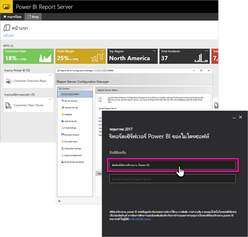

# <a name="developer-handbook-overview-power-bi-report-server"></a><span data-ttu-id="daa7f-103">ภาพรวมคู่มือสำหรับนักพัฒนา เซิร์ฟเวอร์รายงาน Power BI</span><span class="sxs-lookup"><span data-stu-id="daa7f-103">Developer handbook overview, Power BI Report Server</span></span>

<span data-ttu-id="daa7f-104">ยินดีต้อนรับสู่คู่มือสำหรับนักพัฒนา สำหรับเซิร์ฟเวอร์รายงาน Power BI ซึ่งใช้จัดเก็บ และจัดการรายงาน Power BI, รายงานบนอุปกรณ์เคลื่อนที่ และรายงานที่จัดรูปหน้าแล้วของคุณภายในองค์กร</span><span class="sxs-lookup"><span data-stu-id="daa7f-104">Welcome to the developer handbook for Power BI Report Server, an on-premises location for storing and managing your Power BI, mobile, and paginated reports.</span></span>



<span data-ttu-id="daa7f-106">คู่มือนี้แสดงให้เห็นตัวเลือกที่คุณมีในฐานะนักพัฒนา เพื่อทำงานกับ เซิร์ฟเวอร์รายงาน Power BI</span><span class="sxs-lookup"><span data-stu-id="daa7f-106">This handbook highlights options you have, as a developer, to work with Power BI Report Server.</span></span>

## <a name="embedding"></a><span data-ttu-id="daa7f-107">การฝังตัว</span><span class="sxs-lookup"><span data-stu-id="daa7f-107">Embedding</span></span>

<span data-ttu-id="daa7f-108">สำหรับรายงานใด ๆ ภายในเซิร์ฟเวอร์รายงาน Power BI คุณสามารถฝังตัวภายใน iFrame โดยการเพิ่มพารามิเตอร์ querystring `?rs:Embed=true` เข้าไปใน URL</span><span class="sxs-lookup"><span data-stu-id="daa7f-108">For any report within Power BI Report Server, you can embed within an iFrame by adding the querystring parameter `?rs:Embed=true` to the URL.</span></span> <span data-ttu-id="daa7f-109">เทคนิคนี้สามารทำงานร่วมกับรายงาน Power BI เช่นเดียวกับรายงานชนิดอื่น ๆ</span><span class="sxs-lookup"><span data-stu-id="daa7f-109">This technique works with Power BI reports as well as other report types.</span></span>

### <a name="report-viewer-control"></a><span data-ttu-id="daa7f-110">ตัวควบคุม Report Viewer</span><span class="sxs-lookup"><span data-stu-id="daa7f-110">Report Viewer Control</span></span>

<span data-ttu-id="daa7f-111">สำหรับรายงานที่มีการแบ่งหน้า คุณสามารถใช้ประโยชน์จากตัวควบคุม Report Viewer</span><span class="sxs-lookup"><span data-stu-id="daa7f-111">For paginated reports, you can take advantage of the Report Viewer Control.</span></span> <span data-ttu-id="daa7f-112">ด้วยเทคนิคนี้ คุณสามารถใส่ตัวควบคุมภายใน .NET Windows หรือแอปพลิเคชันเว็บ</span><span class="sxs-lookup"><span data-stu-id="daa7f-112">With it, you can place the control within a .NET windows or web application.</span></span> <span data-ttu-id="daa7f-113">สำหรับข้อมูลเพิ่มเติม ดู[เริ่มต้นใช้งานตัวควบคุม Report Viewer](/sql/reporting-services/application-integration/integrating-reporting-services-using-reportviewer-controls-get-started)</span><span class="sxs-lookup"><span data-stu-id="daa7f-113">For more information, see [Get started with the Report Viewer Control](/sql/reporting-services/application-integration/integrating-reporting-services-using-reportviewer-controls-get-started).</span></span>

## <a name="apis"></a><span data-ttu-id="daa7f-114">API</span><span class="sxs-lookup"><span data-stu-id="daa7f-114">APIs</span></span>

<span data-ttu-id="daa7f-115">คุณมีหลายตัวเลือกสำหรับ API เพื่อโต้ตอบกับเซิร์ฟเวอร์รายงาน Power BI</span><span class="sxs-lookup"><span data-stu-id="daa7f-115">You have several API options for interacting with Power BI Report Server.</span></span> <span data-ttu-id="daa7f-116">ซึ่งรวมไปถึงรายการต่อไปนี้</span><span class="sxs-lookup"><span data-stu-id="daa7f-116">This technique includes the following.</span></span>

* [<span data-ttu-id="daa7f-117">REST API</span><span class="sxs-lookup"><span data-stu-id="daa7f-117">REST APIs</span></span>](rest-api.md)
* [<span data-ttu-id="daa7f-118">การเข้าถึง URL</span><span class="sxs-lookup"><span data-stu-id="daa7f-118">URL Access</span></span>](/sql/reporting-services/url-access-ssrs)
* [<span data-ttu-id="daa7f-119">ผู้ให้บริการ WMI</span><span class="sxs-lookup"><span data-stu-id="daa7f-119">WMI Provider</span></span>](/sql/reporting-services/wmi-provider-library-reference/reporting-services-wmi-provider-library-reference-ssrs)

<span data-ttu-id="daa7f-120">คุณยังสามารถใช้ [โปรแกรมอรรถประโยชน์ของ PowerShell](https://github.com/Microsoft/ReportingServicesTools) ที่เป็นโอเพนซอร์ส เพื่อจัดการเซิร์ฟเวอร์รายงานของคุณได้</span><span class="sxs-lookup"><span data-stu-id="daa7f-120">You can also use the open-source [PowerShell utilities](https://github.com/Microsoft/ReportingServicesTools) to manage your report server.</span></span>

> [!NOTE]
> <span data-ttu-id="daa7f-121">โปรแกรมอรรถประโยชน์ PowerShell สนับสนุนไฟล์ Power BI Desktop (.pbix) ผ่านคำสั่ง -RsRest\*</span><span class="sxs-lookup"><span data-stu-id="daa7f-121">The PowerShell utilities support Power BI Desktop files (.pbix) via the -RsRest\* commands.</span></span>

<span data-ttu-id="daa7f-122">เรียกใช้คำสั่งต่อไปนี้เพื่อค้นหาว่าคำสั่งใดในโมดูล ReportingServicesTools PowerShell รองรับไฟล์ Power BI Desktop (.pbix)</span><span class="sxs-lookup"><span data-stu-id="daa7f-122">Run the following command to find which commands in the ReportingServicesTools PowerShell module support Power BI Desktop files (.pbix).</span></span>

```powershell
Get-Command -Module ReportingServicesTools -Noun RsRest*
```

## <a name="custom-extensions"></a><span data-ttu-id="daa7f-123">ส่วนขยายแบบกำหนดเอง</span><span class="sxs-lookup"><span data-stu-id="daa7f-123">Custom extensions</span></span>

<span data-ttu-id="daa7f-124">ไลบรารีส่วนขยายคือ ชุดของคลาส อินเทอร์เฟซ และชนิดของค่า ที่มีอยู่ในเซิร์ฟเวอร์รายงาน Power BI</span><span class="sxs-lookup"><span data-stu-id="daa7f-124">The Extension Library is a set of classes, interfaces, and value types that are included in Power BI Report Server.</span></span> <span data-ttu-id="daa7f-125">ไลบรารีนี้ให้การเข้าถึงฟังก์ชันการทำงานของระบบ และถูกออกแบบมาเพื่อให้เป็นพื้นฐานที่ แอปพลิเคชัน Microsoft .NET Framework สามารถใช้ขยายคอมโพเนนต์ของ เซิร์ฟเวอร์รายงาน Power BI</span><span class="sxs-lookup"><span data-stu-id="daa7f-125">This library provides access to system functionality and is designed to be the foundation on which Microsoft .NET Framework applications can be used to extend Power BI Report Server components.</span></span>

<span data-ttu-id="daa7f-126">มีส่วนขยายหลายชนิดที่คุณสามารถสร้างได้</span><span class="sxs-lookup"><span data-stu-id="daa7f-126">There are several types of extensions you can build.</span></span>

* <span data-ttu-id="daa7f-127">ส่วนขยายการประมวลผลข้อมูล</span><span class="sxs-lookup"><span data-stu-id="daa7f-127">Data processing extensions</span></span>
* <span data-ttu-id="daa7f-128">ส่วนขยายการจัดส่ง</span><span class="sxs-lookup"><span data-stu-id="daa7f-128">Delivery extensions</span></span>
* <span data-ttu-id="daa7f-129">ส่วนขยายการแสดงผลรายงานที่มีการแบ่งหน้า</span><span class="sxs-lookup"><span data-stu-id="daa7f-129">Rendering extensions for paginated reports</span></span>
* <span data-ttu-id="daa7f-130">ส่วนขยายการรักษาความปลอดภัย</span><span class="sxs-lookup"><span data-stu-id="daa7f-130">Security extensions</span></span>

<span data-ttu-id="daa7f-131">เมื่อต้องการเรียนรู้เพิ่มเติม ดู[ไลบรารีส่วนขยาย](/sql/reporting-services/extensions/reporting-services-extension-library)</span><span class="sxs-lookup"><span data-stu-id="daa7f-131">To learn more, see [Extension library](/sql/reporting-services/extensions/reporting-services-extension-library).</span></span>

## <a name="next-steps"></a><span data-ttu-id="daa7f-132">ขั้นตอนถัดไป</span><span class="sxs-lookup"><span data-stu-id="daa7f-132">Next steps</span></span>

[<span data-ttu-id="daa7f-133">เริ่มต้นใช้งานตัวควบคุม Report Viewer</span><span class="sxs-lookup"><span data-stu-id="daa7f-133">Get started with the Report Viewer Control</span></span>](/sql/reporting-services/application-integration/integrating-reporting-services-using-reportviewer-controls-get-started)  
[<span data-ttu-id="daa7f-134">สร้างแอปพลิเคชันโดยใช้ บริการเว็บ และ .NET Framework</span><span class="sxs-lookup"><span data-stu-id="daa7f-134">Building Applications Using the Web Service and the .NET Framework</span></span>](/sql/reporting-services/report-server-web-service/net-framework/building-applications-using-the-web-service-and-the-net-framework)  
[<span data-ttu-id="daa7f-135">เข้าถึง URL</span><span class="sxs-lookup"><span data-stu-id="daa7f-135">URL Access</span></span>](/sql/reporting-services/url-access-ssrs)  
[<span data-ttu-id="daa7f-136">ไลบรารีส่วนขยาย</span><span class="sxs-lookup"><span data-stu-id="daa7f-136">Extension library</span></span>](/sql/reporting-services/extensions/reporting-services-extension-library)  
[<span data-ttu-id="daa7f-137">ผู้ให้บริการ WMI</span><span class="sxs-lookup"><span data-stu-id="daa7f-137">WMI Provider</span></span>](/sql/reporting-services/wmi-provider-library-reference/reporting-services-wmi-provider-library-reference-ssrs)

<span data-ttu-id="daa7f-138">มีคำถามเพิ่มเติมหรือไม่</span><span class="sxs-lookup"><span data-stu-id="daa7f-138">More questions?</span></span> [<span data-ttu-id="daa7f-139">ลองถามชุมชน Power BI</span><span class="sxs-lookup"><span data-stu-id="daa7f-139">Try asking the Power BI Community</span></span>](https://community.powerbi.com/)
