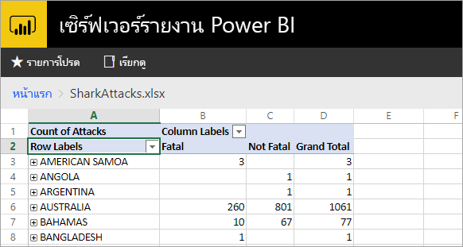
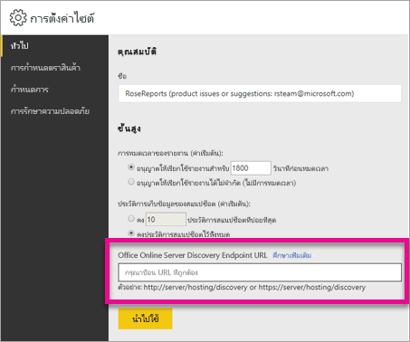

# <a name="configure-your-report-server-to-host-excel-workbooks-using-office-online-server-oos"></a><span data-ttu-id="24d09-103">กำหนดค่าเซิร์ฟเวอร์รายงานของคุณเพื่อโฮสต์ เวิร์กบุ๊ก Excel โดยใช้ Office Online Server (OOS)</span><span class="sxs-lookup"><span data-stu-id="24d09-103">Configure your report server to host Excel workbooks using Office Online Server (OOS)</span></span>

<span data-ttu-id="24d09-104">นอกเหนือจากการดูรายงาน Power BI ในพอร์ทัลของเว็บแล้ว เซิร์ฟเวอร์รายงาน Power BI สามารถโฮสต์สมุดงาน Excel โดยใช้ [Office Online Server](/officeonlineserver/office-online-server-overview) (OOS) ได้</span><span class="sxs-lookup"><span data-stu-id="24d09-104">In addition to viewing Power BI reports in the web portal, Power BI Report Server can host Excel workbooks by using [Office Online Server](/officeonlineserver/office-online-server-overview) (OOS).</span></span> <span data-ttu-id="24d09-105">เซิร์ฟเวอร์รายงานของคุณกลายเป็นสถานที่เดียวเพื่อเผยแพร่ และดูเนื้อหา Microsoft BI แบบบริการตนเอง</span><span class="sxs-lookup"><span data-stu-id="24d09-105">Your report server becomes a single location to publish and view self-service Microsoft BI content.</span></span>



## <a name="prepare-server-to-run-office-online-server"></a><span data-ttu-id="24d09-107">เตรียมเซิร์ฟเวอร์เพื่อเรียกใช้ Office Online Server</span><span class="sxs-lookup"><span data-stu-id="24d09-107">Prepare server to run Office Online Server</span></span>

<span data-ttu-id="24d09-108">ทำตามขั้นตอนต่อไปนี้บนเซิร์ฟเวอร์ที่จะเรียกใช้ Office Online Server</span><span class="sxs-lookup"><span data-stu-id="24d09-108">Perform these procedures on the server that will run Office Online Server.</span></span> <span data-ttu-id="24d09-109">เซิร์ฟเวอร์นี้ต้องเป็น Windows Server 2012 R2 หรือ Windows Server 2016</span><span class="sxs-lookup"><span data-stu-id="24d09-109">This server must be Windows Server 2012 R2 or Windows Server 2016.</span></span> <span data-ttu-id="24d09-110">Windows Server 2016 จำเป็นต้องมี Office Online Server เดือนเมษายน 2017 หรือใหม่กว่า</span><span class="sxs-lookup"><span data-stu-id="24d09-110">Windows Server 2016 requires Office Online Server April 2017 or later.</span></span>

### <a name="install-prerequisite-software-for-office-online-server"></a><span data-ttu-id="24d09-111">ติดตั้งซอฟต์แวร์ตามข้อกำหนดเบื้องต้นสำหรับ Office Online Server</span><span class="sxs-lookup"><span data-stu-id="24d09-111">Install prerequisite software for Office Online Server</span></span>

1. <span data-ttu-id="24d09-112">เปิดพร้อมท์ Windows PowerShell เป็นผู้ดูแลระบบ และเรียกใช้คำสั่งนี้เพื่อติดตั้ง บทบาทและบริการที่จำเป็น</span><span class="sxs-lookup"><span data-stu-id="24d09-112">Open the Windows PowerShell prompt as an administrator and run this command to install the required roles and services.</span></span>

    <span data-ttu-id="24d09-113">**Windows Server 2012 R2:**</span><span class="sxs-lookup"><span data-stu-id="24d09-113">**Windows Server 2012 R2:**</span></span>

    ```powershell
    Add-WindowsFeature Web-Server,Web-Mgmt-Tools,Web-Mgmt-Console,Web-WebServer,Web-Common-Http,Web-Default-Doc,Web-Static-Content,Web-Performance,Web-Stat-Compression,Web-Dyn-Compression,Web-Security,Web-Filtering,Web-Windows-Auth,Web-App-Dev,Web-Net-Ext45,Web-Asp-Net45,Web-ISAPI-Ext,Web-ISAPI-Filter,Web-Includes,InkandHandwritingServices,NET-Framework-Features,NET-Framework-Core,NET-HTTP-Activation,NET-Non-HTTP-Activ,NET-WCF-HTTP-Activation45,Windows-Identity-Foundation,Server-Media-Foundation
    ```

    <span data-ttu-id="24d09-114">**Windows Server 2016:**</span><span class="sxs-lookup"><span data-stu-id="24d09-114">**Windows Server 2016:**</span></span>

    ```powershell
    Add-WindowsFeature Web-Server,Web-Mgmt-Tools,Web-Mgmt-Console,Web-WebServer,Web-Common-Http,Web-Default-Doc,Web-Static-Content,Web-Performance,Web-Stat-Compression,Web-Dyn-Compression,Web-Security,Web-Filtering,Web-Windows-Auth,Web-App-Dev,Web-Net-Ext45,Web-Asp-Net45,Web-ISAPI-Ext,Web-ISAPI-Filter,Web-Includes,NET-Framework-Features,NET-Framework-45-Features,NET-Framework-Core,NET-Framework-45-Core,NET-HTTP-Activation,NET-Non-HTTP-Activ,NET-WCF-HTTP-Activation45,Windows-Identity-Foundation,Server-Media-Foundation
    ```

    <span data-ttu-id="24d09-115">ถ้าถูกพร้อมท์ ให้รีสตาร์ตเซิร์ฟเวอร์</span><span class="sxs-lookup"><span data-stu-id="24d09-115">If prompted, restart the server.</span></span>
2. <span data-ttu-id="24d09-116">ติดตั้งซอฟต์แวร์ต่อไปนี้:</span><span class="sxs-lookup"><span data-stu-id="24d09-116">Install the following software:</span></span>

   * [<span data-ttu-id="24d09-117">.NET Framework 4.5.2</span><span class="sxs-lookup"><span data-stu-id="24d09-117">.NET Framework 4.5.2</span></span>](https://go.microsoft.com/fwlink/p/?LinkId=510096)
   * [<span data-ttu-id="24d09-118">Visual C++ Redistributable Packages for Visual Studio 2013</span><span class="sxs-lookup"><span data-stu-id="24d09-118">Visual C++ Redistributable Packages for Visual Studio 2013</span></span>](https://www.microsoft.com/download/details.aspx?id=40784)
   * [<span data-ttu-id="24d09-119">Visual C++ Redistributable for Visual Studio 2015</span><span class="sxs-lookup"><span data-stu-id="24d09-119">Visual C++ Redistributable for Visual Studio 2015</span></span>](https://go.microsoft.com/fwlink/p/?LinkId=620071)
   * [<span data-ttu-id="24d09-120">Microsoft.IdentityModel.Extention.dll</span><span class="sxs-lookup"><span data-stu-id="24d09-120">Microsoft.IdentityModel.Extention.dll</span></span>](https://go.microsoft.com/fwlink/p/?LinkId=620072)

### <a name="install-office-online-server"></a><span data-ttu-id="24d09-121">ติดตั้ง Office Online Server</span><span class="sxs-lookup"><span data-stu-id="24d09-121">Install Office Online Server</span></span>

<span data-ttu-id="24d09-122">ถ้าคุณวางแผนที่จะใช้คุณลักษณะใด ๆ ของ Excel Online ที่ใช้การเข้าถึงข้อมูลภายนอก (เช่น Power Pivot) โปรดทราบว่า Office Online Server ต้องอยู่ในฟอเรสต์ Active Directory เดียวกับของผู้ใช้ เช่นเดียวกับแหล่งข้อมูลภายนอกใด ๆ ที่คุณวางแผนที่จะเข้าถึง โดยใช้การรับรองความถูกต้องด้วย Windows</span><span class="sxs-lookup"><span data-stu-id="24d09-122">If you plan to use any Excel Online features that utilize external data access (such as Power Pivot), note that Office Online Server must reside in the same Active Directory forest as its users as well as any external data sources that you plan to access using Windows-based authentication.</span></span>

1. <span data-ttu-id="24d09-123">ดาวน์โหลด Office Online Server จาก [Volume Licensing Service Center (VLSC)](https://go.microsoft.com/fwlink/p/?LinkId=256561)</span><span class="sxs-lookup"><span data-stu-id="24d09-123">Download Office Online Server from the [Volume Licensing Service Center (VLSC)](https://go.microsoft.com/fwlink/p/?LinkId=256561).</span></span> <span data-ttu-id="24d09-124">การดาวน์โหลดจะอยู่ภายใต้ผลิตภัณฑ์ Office เหล่านั้นบนพอร์ทัล VLSC</span><span class="sxs-lookup"><span data-stu-id="24d09-124">The download is located under those Office products on the VLSC portal.</span></span> <span data-ttu-id="24d09-125">สำหรับการพัฒนา คุณสามารถดาวน์โหลด OOS จากดาวน์โหลดสำหรับสมาชิกของ MSDN</span><span class="sxs-lookup"><span data-stu-id="24d09-125">For development purposes, you can download OOS from MSDN subscriber downloads.</span></span>
2. <span data-ttu-id="24d09-126">เรียกใช้ Setup.exe</span><span class="sxs-lookup"><span data-stu-id="24d09-126">Run Setup.exe.</span></span>
3. <span data-ttu-id="24d09-127">บนหน้า**อ่านข้อกำหนดสิทธิ์การใช้งานซอฟต์แวร์ของ Microsoft** เลือก**ฉันยอมรับเงื่อนไขของข้อตกลงนี้** แล้วเลือก**ดำเนินการต่อ**</span><span class="sxs-lookup"><span data-stu-id="24d09-127">On the **Read the Microsoft Software License Terms** page, select **I accept the terms of this agreement** and select **Continue**.</span></span>
4. <span data-ttu-id="24d09-128">บนหน้า**เลือกตำแหน่งที่ตั้งไฟล์** เลือกโฟลเดอร์ที่คุณต้องการติดตั้งไฟล์ Office Online Server (ตัวอย่างเช่น C:\Program Files\Microsoft Office Web Apps\*) และเลือก **ติดตั้งทันที**</span><span class="sxs-lookup"><span data-stu-id="24d09-128">On the **Choose a file location** page, select the folder where you want the Office Online Server files to be installed (for example, C:\Program Files\Microsoft Office Web Apps\*) and select **Install Now**.</span></span> <span data-ttu-id="24d09-129">ถ้าโฟลเดอร์ที่คุณระบุไม่มีอยู่จริง โปรแกรมติดตั้งจะสร้างให้คุณ</span><span class="sxs-lookup"><span data-stu-id="24d09-129">If the folder you specified doesn’t exist, Setup creates it for you.</span></span>

    <span data-ttu-id="24d09-130">เราขอแนะนำให้ คุณติดตั้ง Office Online Server บนไดรฟ์ระบบ</span><span class="sxs-lookup"><span data-stu-id="24d09-130">We recommend that you install Office Online Server on the system drive.</span></span>

5. <span data-ttu-id="24d09-131">เมื่อโปรแกรมติดตั้ง Office Online Server ติดตั้งเสร็จ เลือก**ปิด**</span><span class="sxs-lookup"><span data-stu-id="24d09-131">When Setup finishes installing Office Online Server, select **Close**.</span></span>

### <a name="install-language-packs-for-office-web-apps-server-optional"></a><span data-ttu-id="24d09-132">ติดตั้งชุดภาษาสำหรับ Office Web Apps Server (ไม่บังคับ)</span><span class="sxs-lookup"><span data-stu-id="24d09-132">Install language packs for Office Web Apps Server (optional)</span></span>

<span data-ttu-id="24d09-133">ชุดภาษา Office Online Server ช่วยให้ผู้ใช้ดูไฟล์ Office บนเว็บได้ในหลายภาษา</span><span class="sxs-lookup"><span data-stu-id="24d09-133">Office Online Server Language Packs let users view web-based Office files in multiple languages.</span></span>

<span data-ttu-id="24d09-134">เมื่อต้องการติดตั้งชุดภาษา ทำตามขั้นตอนเหล่านี้</span><span class="sxs-lookup"><span data-stu-id="24d09-134">To install the language packs, follow these steps.</span></span>

1. <span data-ttu-id="24d09-135">ดาวน์โหลดชุดภาษา Online Server Office จาก[ศูนย์ดาวน์โหลด Microsoft](https://go.microsoft.com/fwlink/p/?LinkId=798136)</span><span class="sxs-lookup"><span data-stu-id="24d09-135">Download the Office Online Server Language Packs from the [Microsoft Download Center](https://go.microsoft.com/fwlink/p/?LinkId=798136).</span></span>
2. <span data-ttu-id="24d09-136">เรียกใช้ **wacserverlanguagepack.exe**</span><span class="sxs-lookup"><span data-stu-id="24d09-136">Run **wacserverlanguagepack.exe**.</span></span>
3. <span data-ttu-id="24d09-137">ในตัว Office Online Server Language Pack Wizard บนหน้า**อ่านข้อกำหนดสิทธิ์การใช้งานซอฟต์แวร์ของ Microsoft** เลือก**ฉันยอมรับเงื่อนไขของข้อตกลงนี้** และเลือก**ดำเนินการต่อ**</span><span class="sxs-lookup"><span data-stu-id="24d09-137">In the Office Online Server Language Pack Wizard, on the **Read the Microsoft Software License Terms** page, select **I accept the terms of this agreement** and select **Continue**.</span></span>
4. <span data-ttu-id="24d09-138">เมื่อโปรแกรมติดตั้ง Office Online Server ติดตั้งเสร็จ เลือก**ปิด**</span><span class="sxs-lookup"><span data-stu-id="24d09-138">When Setup finishes installing Office Online Server, select **Close**.</span></span>

## <a name="deploy-office-online-server"></a><span data-ttu-id="24d09-139">ปรับใช้ Office Online Server</span><span class="sxs-lookup"><span data-stu-id="24d09-139">Deploy Office Online Server</span></span>

### <a name="create-the-office-online-server-farm-https"></a><span data-ttu-id="24d09-140">สร้างฟาร์มสำหรับ Office Online Server (HTTPS)</span><span class="sxs-lookup"><span data-stu-id="24d09-140">Create the Office Online Server farm (HTTPS)</span></span>

<span data-ttu-id="24d09-141">ใช้คำสั่ง New-OfficeWebAppsFarm เพื่อสร้างฟาร์มสำหรับ Office Online Server ใหม่ที่ประกอบด้วยเซิร์ฟเวอร์เดียว ดังที่แสดงในตัวอย่างต่อไปนี้</span><span class="sxs-lookup"><span data-stu-id="24d09-141">Use the New-OfficeWebAppsFarm command to create a new Office Online Server farm that consists of a single server, as shown in the following example.</span></span>

```powershell
New-OfficeWebAppsFarm -InternalUrl "https://server.contoso.com" -ExternalUrl "https://wacweb01.contoso.com" -CertificateName "OfficeWebApps Certificate"
```

<span data-ttu-id="24d09-142">**พารามิเตอร์**</span><span class="sxs-lookup"><span data-stu-id="24d09-142">**Parameters**</span></span>

* <span data-ttu-id="24d09-143">**–InternalURL** คือชื่อโดเมนแบบเต็ม (FQDN) ของเซิร์ฟเวอร์ที่เรียกใช้ Office Online Server เช่น `https://servername.contoso.com`</span><span class="sxs-lookup"><span data-stu-id="24d09-143">**–InternalURL** is the fully qualified domain name (FQDN) of the server that runs Office Online Server, such as `https://servername.contoso.com`.</span></span>
* <span data-ttu-id="24d09-144">**–ExternalURL** คือ FQDN ที่สามารถเข้าถึงได้บนอินเทอร์เน็ต</span><span class="sxs-lookup"><span data-stu-id="24d09-144">**–ExternalURL** is the FQDN that can be accessed on the Internet.</span></span>
* <span data-ttu-id="24d09-145">**–CertificateName** คือชื่อที่เข้าใจง่ายของใบรับรอง</span><span class="sxs-lookup"><span data-stu-id="24d09-145">**–CertificateName** is the friendly name of the certificate.</span></span>

### <a name="create-the-office-online-server-farm-http"></a><span data-ttu-id="24d09-146">สร้างฟาร์มสำหรับ Office Online Server (HTTP)</span><span class="sxs-lookup"><span data-stu-id="24d09-146">Create the Office Online Server farm (HTTP)</span></span>

<span data-ttu-id="24d09-147">ใช้คำสั่ง New-OfficeWebAppsFarm เพื่อสร้างฟาร์มสำหรับ Office Online Server ใหม่ที่ประกอบด้วยเซิร์ฟเวอร์เดียว ดังที่แสดงในตัวอย่างต่อไปนี้</span><span class="sxs-lookup"><span data-stu-id="24d09-147">Use the New-OfficeWebAppsFarm command to create a new Office Online Server farm that consists of a single server, as shown in the following example.</span></span>

```powershell
New-OfficeWebAppsFarm -InternalURL "https://servername" -AllowHttp
```

<span data-ttu-id="24d09-148">**พารามิเตอร์**</span><span class="sxs-lookup"><span data-stu-id="24d09-148">**Parameters**</span></span>

* <span data-ttu-id="24d09-149">**–InternalURL** คือชื่อของเซิร์ฟเวอร์ที่เรียกใช้ Office Online Server เช่น `https://servername`</span><span class="sxs-lookup"><span data-stu-id="24d09-149">**–InternalURL** is the name of the server that runs Office Online Server, such as `https://servername`.</span></span>
* <span data-ttu-id="24d09-150">**–AllowHttp** กำหนดค่าฟาร์มให้ใช้ HTTP</span><span class="sxs-lookup"><span data-stu-id="24d09-150">**–AllowHttp** configures the farm to use HTTP.</span></span>

### <a name="verify-that-the-office-online-server-farm-was-created-successfully"></a><span data-ttu-id="24d09-151">ตรวจสอบว่าฟาร์มของ Office Online Server ถูกสร้างขึ้นเรียบร้อยแล้ว</span><span class="sxs-lookup"><span data-stu-id="24d09-151">Verify that the Office Online Server farm was created successfully</span></span>

<span data-ttu-id="24d09-152">หลังจากที่ฟาร์มถูกสร้างขึ้นแล้ว รายละเอียดเกี่ยวกับฟาร์มจะปรากฏในพร้อมท์ Windows PowerShell</span><span class="sxs-lookup"><span data-stu-id="24d09-152">After the farm is created, details about the farm are displayed in the Windows PowerShell prompt.</span></span> <span data-ttu-id="24d09-153">เพื่อตรวจสอบว่า Office Online Server ถูกติดตั้ง และกำหนดค่าอย่างถูกต้อง ใช้เว็บเบราว์เซอร์เข้าถึง URL ของการค้นพบ Office Online Server ดังที่แสดงในตัวอย่างต่อไปนี้</span><span class="sxs-lookup"><span data-stu-id="24d09-153">To verify that Office Online Server is installed and configured correctly, use a web browser to access the Office Online Server discovery URL, as shown in the following example.</span></span> <span data-ttu-id="24d09-154">URL ของการค้นพบ คือพารามิเตอร์ *InternalUrl* ที่คุณระบุเมื่อคุณกำหนดค่าฟาร์ม Office Online Server ของคุณ ตามด้วย */hosting/discovery* ตัวอย่างเช่น:</span><span class="sxs-lookup"><span data-stu-id="24d09-154">The discovery URL is the *InternalUrl* parameter you specified when you configured your Office Online Server farm, followed by */hosting/discovery*, for example:</span></span>

```
<InternalUrl>/hosting/discovery
```

<span data-ttu-id="24d09-155">ถ้า Office Online Server ทำงานได้ตามคาด คุณควรเห็นไฟล์ XML ของการค้นหา Web Application Open Platform Interface Protocol (WOPI) ในเว็บเบราว์เซอร์ของคุณ</span><span class="sxs-lookup"><span data-stu-id="24d09-155">If Office Online Server works as expected, you should see a Web Application Open Platform Interface Protocol (WOPI)-discovery XML file in your web browser.</span></span> <span data-ttu-id="24d09-156">หลายบรรทัดแรกของไฟล์ดังกล่าว ควรมีลักษณะดังตัวอย่างต่อไปนี้:</span><span class="sxs-lookup"><span data-stu-id="24d09-156">The first few lines of that file should resemble the following example:</span></span>

```xml
<?xml version="1.0" encoding="utf-8" ?> 
<wopi-discovery>
<net-zone name="internal-http">
<app name="Excel" favIconUrl="<InternalUrl>/x/_layouts/images/FavIcon_Excel.ico" checkLicense="true">
<action name="view" ext="ods" default="true" urlsrc="<InternalUrl>/x/_layouts/xlviewerinternal.aspx?<ui=UI_LLCC&><rs=DC_LLCC&>" /> 
<action name="view" ext="xls" default="true" urlsrc="<InternalUrl>/x/_layouts/xlviewerinternal.aspx?<ui=UI_LLCC&><rs=DC_LLCC&>" /> 
<action name="view" ext="xlsb" default="true" urlsrc="<InternalUrl>/x/_layouts/xlviewerinternal.aspx?<ui=UI_LLCC&><rs=DC_LLCC&>" /> 
<action name="view" ext="xlsm" default="true" urlsrc="<InternalUrl>/x/_layouts/xlviewerinternal.aspx?<ui=UI_LLCC&><rs=DC_LLCC&>" /> 
```

### <a name="configure-excel-workbook-maximum-size"></a><span data-ttu-id="24d09-157">กำหนดค่าขนาดสูงสุดของเวิร์กบุ๊ก Excel</span><span class="sxs-lookup"><span data-stu-id="24d09-157">Configure Excel workbook maximum size</span></span>

<span data-ttu-id="24d09-158">ขนาดไฟล์สูงสุดสำหรับไฟล์ทั้งหมดใน เซิร์ฟเวอร์รายงาน Power BI คือ 100 เมกะไบต์</span><span class="sxs-lookup"><span data-stu-id="24d09-158">The maximum file size for all files in Power BI Report Server is 100 MB.</span></span> <span data-ttu-id="24d09-159">ถ้าคุณต้องการให้ใช้ค่าเดียวกันกับเวิร์กบุ๊ก Excel คุณต้องตั้งค่านี้ด้วยตัวเองใน OOS</span><span class="sxs-lookup"><span data-stu-id="24d09-159">To stay in sync with that, you need to manually set this in OOS.</span></span>

```powershell
Set-OfficeWebAppsFarm -ExcelWorkbookSizeMax 100
```

## <a name="using-effectiveusername-with-analysis-services"></a><span data-ttu-id="24d09-160">การใช้ EffectiveUserName กับ Analysis Services</span><span class="sxs-lookup"><span data-stu-id="24d09-160">Using EffectiveUserName with Analysis Services</span></span>

<span data-ttu-id="24d09-161">เพื่ออนุญาตให้เชื่อมต่อสดไปยัง Analysis Services สำหรับการเชื่อมต่อภายในเวิร์กบุ๊ก Excel ที่ใช้ EffectiveUserName นั้น</span><span class="sxs-lookup"><span data-stu-id="24d09-161">To allow for live connections to Analysis Services, for connections within an Excel workbook that make use of EffectiveUserName.</span></span> <span data-ttu-id="24d09-162">เพื่อให้ OOS ได้ใช้ EffectiveUserName คุณจะต้องเพิ่มบัญชีเครื่องของเซิร์ฟเวอร์ OOS ให้เป็นผู้ดูแลระบบสำหรับอินสแตนซ์ของ Analysis Services</span><span class="sxs-lookup"><span data-stu-id="24d09-162">For OOS to make use of EffectiveUserName, you will need to add the machine account of the OOS server as an administrator for the Analysis Services instance.</span></span> <span data-ttu-id="24d09-163">จำเป็นต้องใช้ Management Studio สำหรับ SQL Server 2016 หรือใหม่กว่า สำหรับทำขั้นตอนนี้</span><span class="sxs-lookup"><span data-stu-id="24d09-163">Management Studio for SQL Server 2016 or later is needed to do this.</span></span>

<span data-ttu-id="24d09-164">เฉพาะการเชื่อมต่อกับ Analysis Services แบบฝังตัวเท่านั้นที่ ได้รับการสนับสนุนภายในเวิร์กบุ๊ก Excel ในขณะนี้</span><span class="sxs-lookup"><span data-stu-id="24d09-164">Only embedded Analysis Services connections are currently supported within an Excel workbook.</span></span> <span data-ttu-id="24d09-165">บัญชีของผู้ใช้จะต้องมีสิทธิ์ในการเชื่อมต่อกับ Analysis Services เนื่องจากการพร็อกซีผู้ใช้ยังไม่มีให้ใช้งาน</span><span class="sxs-lookup"><span data-stu-id="24d09-165">The user's account will need to have permission to connect to Analysis Services as the ability to proxy the user is not available.</span></span>

<span data-ttu-id="24d09-166">เรียกใช้คำสั่ง PowerShell ต่อไปนี้บนเซิร์ฟเวอร์ OOS</span><span class="sxs-lookup"><span data-stu-id="24d09-166">Run the following PowerShell commands on the OOS Server.</span></span>

```powershell
Set-OfficeWebAppsFarm -ExcelUseEffectiveUserName:$true
Set-OfficeWebAppsFarm -ExcelAllowExternalData:$true
Set-OfficeWebAppsFarm -ExcelWarnOnDataRefresh:$false
```

## <a name="configure-a-power-pivot-instance-for-data-models"></a><span data-ttu-id="24d09-167">กำหนดค่าอินสแตนซ์ของ Power Pivot สำหรับแบบจำลองข้อมูล</span><span class="sxs-lookup"><span data-stu-id="24d09-167">Configure a Power Pivot instance for data models</span></span>

<span data-ttu-id="24d09-168">การติดตั้งอินสแตนซ์ Analysis Services โหมด Power Pivot ช่วยให้คุณทำงานกับเวิร์กบุ๊ก Excel ที่กำลังใช้ Power Pivot</span><span class="sxs-lookup"><span data-stu-id="24d09-168">Installing an Analysis Services Power Pivot mode instance lets you work with Excel workbooks that are using Power Pivot.</span></span> <span data-ttu-id="24d09-169">ตรวจสอบให้แน่ใจว่า อินสแตนซ์นั้นมีชื่อว่า *POWERPIVOT*</span><span class="sxs-lookup"><span data-stu-id="24d09-169">Make sure that the instance name is *POWERPIVOT*.</span></span> <span data-ttu-id="24d09-170">เพิ่มบัญชีเครื่องของเซิร์ฟเวอร์ OOS เป็นผู้ดูแล สำหรับอินสแตนซ์ Analysis Services โหมด Power Pivot</span><span class="sxs-lookup"><span data-stu-id="24d09-170">Add the machine account of the OOS server as an administrator, for the Analysis Services Power Pivot mode instance.</span></span> <span data-ttu-id="24d09-171">จำเป็นต้องใช้ Management Studio สำหรับ SQL Server 2016 หรือใหม่กว่า สำหรับทำขั้นตอนนี้</span><span class="sxs-lookup"><span data-stu-id="24d09-171">Management Studio for SQL Server 2016 or later is needed to do this.</span></span>

<span data-ttu-id="24d09-172">เพื่อให้ OOS ได้ใช้อินสแตนซ์โหมด Power Pivot เรียกใช้คำสั่งต่อไปนี้</span><span class="sxs-lookup"><span data-stu-id="24d09-172">For OOS to use the Power Pivot mode instance, run the following command.</span></span>

```powershell
New-OfficeWebAppsExcelBIServer -ServerId <server_name>\POWERPIVOT
```

<span data-ttu-id="24d09-173">ถ้าคุณยังไม่ได้อนุญาตข้อมูลภายนอก จากขั้นตอน Analysis Services ด้านบน เรียกใช้คำสั่งต่อไปนี้</span><span class="sxs-lookup"><span data-stu-id="24d09-173">If you did not already allow external data, from the Analysis Services step above, run the following command.</span></span>

```powershell
Set-OfficeWebAppsFarm -ExcelAllowExternalData:$true
```

### <a name="firewall-considerations"></a><span data-ttu-id="24d09-174">ข้อควรพิจารณาเกี่ยวกับไฟร์วอลล์</span><span class="sxs-lookup"><span data-stu-id="24d09-174">Firewall considerations</span></span>

<span data-ttu-id="24d09-175">เพื่อหลีกเลี่ยงปัญหาไฟร์วอลล์ คุณอาจจำเป็นต้องเปิดพอร์ต 2382 และ 2383</span><span class="sxs-lookup"><span data-stu-id="24d09-175">To avoid firewall issues, you may need to open the ports 2382 and 2383.</span></span> <span data-ttu-id="24d09-176">คุณยังสามารถเพิ่ม *msmdsrv.exe* สำหรับอินสแตนซ์ Power Pivot ให้เป็นแอปพลิเคชันไฟร์วอลล์ ที่กำหนดนโยบายไฟร์วอลล์</span><span class="sxs-lookup"><span data-stu-id="24d09-176">You can also add the *msmdsrv.exe*, for the Power Pivot instance, as an application firewall wall policy.</span></span>

## <a name="configure-power-bi-report-server-to-use-the-oos-server"></a><span data-ttu-id="24d09-177">กำหนดค่าเซิร์ฟเวอร์รายงาน Power BI เพื่อใช้เซิร์ฟเวอร์ OOS</span><span class="sxs-lookup"><span data-stu-id="24d09-177">Configure Power BI Report Server to use the OOS Server</span></span>

<span data-ttu-id="24d09-178">บนหน้า**ทั่วไป** ของ**การตั้งค่าไซต์** ใส่ url ของการค้นพบ OOS</span><span class="sxs-lookup"><span data-stu-id="24d09-178">On the **General** page of **Site settings**, enter the OOS discovery url.</span></span> <span data-ttu-id="24d09-179">Url ของการค้นพบ OOS คือ *InternalUrl* ตามด้วย */hosting/discovery* ใช้เมื่อมีการปรับใช้เซิร์ฟเวอร์ OOS</span><span class="sxs-lookup"><span data-stu-id="24d09-179">The OOS discovery url is the *InternalUrl*, used when deploying the OOS server, followed by */hosting/discovery*.</span></span> <span data-ttu-id="24d09-180">ตัวอย่างเช่น `https://servername/hosting/discovery` สำหรับ HTTP</span><span class="sxs-lookup"><span data-stu-id="24d09-180">For example, `https://servername/hosting/discovery`, for HTTP.</span></span> <span data-ttu-id="24d09-181">และ `https://server.contoso.com/hosting/discovery` สำหรับ HTTPS</span><span class="sxs-lookup"><span data-stu-id="24d09-181">And, `https://server.contoso.com/hosting/discovery` for HTTPS.</span></span>

<span data-ttu-id="24d09-182">เมื่อต้องเข้าถึง**การตั้งค่าไซต์** เลือก**ไอคอนรูปเฟือง**ที่มุมบนขวา แล้วเลือก**การตั้งค่าไซต์**</span><span class="sxs-lookup"><span data-stu-id="24d09-182">To get to **Site settings**, select the **gear icon** in the upper right and select **Site settings**.</span></span>

<span data-ttu-id="24d09-183">เฉพาะผู้ใช้ที่มีบทบาท**ผู้ดูแลระบบ**จะเห็นการตั้งค่า Office Online Server discovery url</span><span class="sxs-lookup"><span data-stu-id="24d09-183">Only a user with the **System Administrator** role will see the Office Online Server discovery url setting.</span></span>



<span data-ttu-id="24d09-185">หลังจากที่คุณใส่ url ของการค้นพบ และเลือก**นำไปใช้**แล้ว การเลือกเวิร์กบุ๊ก Excel ใด ๆ ภายในพอร์ทัลของเว็บ ควรจะแสดงเวิร์กบุ๊กนั้นภายในพอร์ทัลของเว็บ</span><span class="sxs-lookup"><span data-stu-id="24d09-185">After you enter the discovery url, and select **Apply**, selecting an Excel workbook, within the web portal, should display the workbook within the web portal.</span></span>

## <a name="limitations-and-considerations"></a><span data-ttu-id="24d09-186">ข้อจำกัดและข้อควรพิจารณา</span><span class="sxs-lookup"><span data-stu-id="24d09-186">Limitations and considerations</span></span>

- <span data-ttu-id="24d09-187">คุณทำได้แค่การอ่านเวิร์กบุ๊กเท่านั้น</span><span class="sxs-lookup"><span data-stu-id="24d09-187">You will have read only capability with workbooks.</span></span>
- <span data-ttu-id="24d09-188">การรีเฟรชตามกำหนดเวลาไม่ได้รับการสนับสนุนสำหรับเวิร์กบุ๊ก Excel ในเซิร์ฟเวอร์รายงาน Power BI</span><span class="sxs-lookup"><span data-stu-id="24d09-188">Scheduled refresh isn't supported for Excel workbooks in Power BI Report Server.</span></span>

## <a name="next-steps"></a><span data-ttu-id="24d09-189">ขั้นตอนถัดไป</span><span class="sxs-lookup"><span data-stu-id="24d09-189">Next steps</span></span>

[<span data-ttu-id="24d09-190">ภาพรวมของผู้ดูแลระบบ</span><span class="sxs-lookup"><span data-stu-id="24d09-190">Administrator overview</span></span>](admin-handbook-overview.md)  
[<span data-ttu-id="24d09-191">ติดตั้ง Power BI Report Server</span><span class="sxs-lookup"><span data-stu-id="24d09-191">Install Power BI Report Server</span></span>](install-report-server.md)  
[<span data-ttu-id="24d09-192">ดาวน์โหลดตัวสร้างรายงาน</span><span class="sxs-lookup"><span data-stu-id="24d09-192">Download Report Builder</span></span>](https://www.microsoft.com/download/details.aspx?id=53613)  
[<span data-ttu-id="24d09-193">ดาวน์โหลด SQL Server Data Tools (SSDT)</span><span class="sxs-lookup"><span data-stu-id="24d09-193">Download SQL Server Data Tools (SSDT)</span></span>](/sql/ssdt/download-sql-server-data-tools-ssdt)

<span data-ttu-id="24d09-194">มีคำถามเพิ่มเติมหรือไม่</span><span class="sxs-lookup"><span data-stu-id="24d09-194">More questions?</span></span> [<span data-ttu-id="24d09-195">ลองถามชุมชน Power BI</span><span class="sxs-lookup"><span data-stu-id="24d09-195">Try asking the Power BI Community</span></span>](https://community.powerbi.com/)