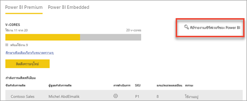
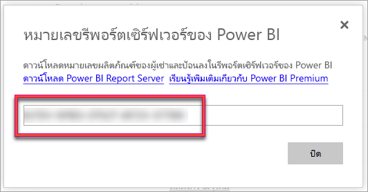
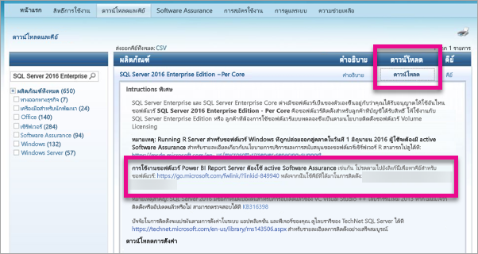

# วิธีการค้นหาคีย์ผลิตภัณฑ์เซิร์ฟเวอร์รายงานของคุณHow to find your report server product key
เรียนรู้วิธีคุณสามารถค้นหาคีย์ผลิตภัณฑ์เซิร์ฟเวอร์รายงาน Power BI ของคุณเมื่อต้องการติดตั้งเซิร์ฟเวอร์ของคุณในสภาพแวดล้อมการผลิตLearn how you can find your Power BI Report Server product key to install your server in a production environment.

<iframe width="640" height="360" src="https://www.youtube.com/embed/6CQnf-NGtpU?rel=0&amp;showinfo=0" frameborder="0" allowfullscreen></iframe>

ดาวน์โหลดเซิร์ฟเวอร์รายงาน Power BI และคุณจะได้รับข้อตกลงการรับประกันซอฟต์แวร SQL Server EnterpriseYou downloaded Power BI Report Server, and you have a SQL Server Enterprise Software Assurance agreement. หรือ คุณสามารถซื้อ Power BI PremiumOr, you purchased Power BI Premium. หากคุณต้องการติดตั้งเซิร์ฟเวอร์ในสภาพแวดล้อมการผลิต คุณต้องใช้คีย์ผลิตภัณฑ์ในการทำเช่นนั้นYou want to install the server in a production environment, but you need a product key in order to do that. คีย์ผลิตภัณฑ์อยู่ที่ไหนWhere is the product key? 

คีย์ผลิตภัณฑ์จะอยู่ในหนึ่งในสองตำแหน่งโดยขึ้นอยู่กับสิ่งที่คุณซื้อThe product key will be in one of two places depending on what you purchased.

## ซื้อ Power BI PremiumPurchased Power BI Premium
ถ้าคุณซื้อ Power BI Premium ภายในแท็บการ **ตั้งค่าความจุ** ของพอร์ทัลผู้ดูแลระบบ Power BI คุณจะสามารถเข้าถึงคีย์ผลิตภัณฑ์เซิร์ฟเวอร์รายงาน Power BI ของคุณIf you have purchased Power BI Premium, within the **Capacity settings** tab of the Power BI admin portal, you will have access to your Power BI Report Server product key. ซึ่งสิ่งนี้จะพร้อมใช้งานสำหรับผู้ดูแลระบบสากล หรือผู้ใช้ที่ได้รับการกำหนดบทบาทผู้ดูแลระบบบริการ Power BIThis will only be available for Global Admins or users assigned the Power BI service administrator role.

โดยเลือก **คีย์เซิร์ฟเวอร์รายงาน Power BI** จะแสดงกล่องโต้ตอบที่มีคีย์ผลิตภัณฑ์ของคุณSelecting **Power BI Report Server key** will display a dialog contain your product key. คุณสามารถคัดลอกและใช้กับการติดตั้งYou can copy it and use it with the installation.

## ข้อตกลงการรับประกันซอฟต์แวร์ที่ซื้อแล้วPurchased Software Assurance agreement
ถ้าคุณมีข้อตกลง SQL Server Enterprise SA คุณจะสามารถรับคีย์ผลิตภัณฑ์ของคุณจาก[ศูนย์บริการ Volume Licensing](https://www.microsoft.com/Licensing/servicecenter/)If you have a SQL Server Enterprise SA agreement, you can get your product key from the [Volume Licensing Service Center](https://www.microsoft.com/Licensing/servicecenter/). ค้นหาภายใต้เซอร์วิสแพ็คล่าสุดสำหรับเซิร์ฟเวอร์ SQL รุ่นล่าสุดLook under the latest service pack, for the latest version of SQL Server. หากคุณค้นหาไม่พบ ให้ค้นหาภายใต้การปล่อย RTM ของเซิร์ฟเวอร์ SQL รุ่นล่าสุดIf you don't see it there, look under the RTM release of the latest SQL Server version.

> [!NOTE]
> คุณต้องค้นหาภายใต้ส่วนดาวน์โหลดYou need to look under the download section. ไม่ใช่ส่วนคีย์Not the keys section.
> 
> 

 
## ขั้นตอนถัดไปNext steps
[ติดตั้ง Power BI Report ServerInstall Power BI Report Server](install-report-server.md)  
[ติดตั้ง Power BI Desktop ที่ปรับให้เหมาะสำหรับ Power BI Report ServerInstall Power BI Desktop optimized for Power BI Report Server](install-powerbi-desktop.md)  
[ดาวน์โหลดตัวสร้างรายงานDownload Report Builder](https://www.microsoft.com/download/details.aspx?id=53613)  
[ดาวน์โหลด SQL Server Data Tools (SSDT)Download SQL Server Data Tools (SSDT)](/sql/ssdt/download-sql-server-data-tools-ssdt)

มีคำถามเพิ่มเติมหรือไม่More questions? [ลองถามชุมชน Power BITry asking the Power BI Community](https://community.powerbi.com/)