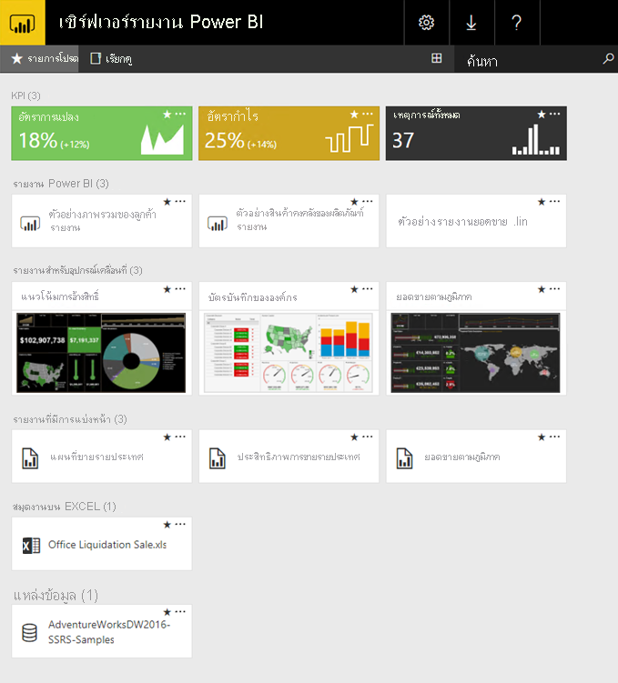

# เซิร์ฟเวอร์รายงาน Power BI คืออะไร?What is Power BI Report Server?

Power BI Report Server เป็นเซิร์ฟเวอร์รายงานในองค์กรที่มีพอร์ทัลเว็บที่คุณแสดงและจัดการรายงานและ KPIPower BI Report Server is an on-premises report server with a web portal in which you display and manage reports and KPIs. นอกจากนี้ยังมีเครื่องมือในการสร้างรายงาน Power BI รายงานแบบแบ่งหน้า รายงานมือถือ และ KPIAlong with it come the tools to create Power BI reports, paginated reports, mobile reports, and KPIs. ผู้ใช้ของคุณสามารถเข้าถึงรายงานเหล่านั้นได้หลายวิธี: ดูในเว็บเบราว์เซอร์ หรืออุปกรณ์เคลื่อนที่ หรือเป็นอีเมลในกล่องขาเข้าของพวกเขาได้Your users can access those reports in different ways: viewing them in a web browser or mobile device, or as an email in their in-box.

## เปรียบเทียบเซิร์ฟเวอร์รายงาน Power BIComparing Power BI Report Server 
เซิร์ฟเวอร์รายงาน Power BI คล้ายกับทั้ง SQL Server Reporting Services และบริการออนไลน์ของ Power BI แต่ในด้านที่ต่างกันPower BI Report Server is similar to both SQL Server Reporting Services and the Power BI online service, but in different ways. เซิร์ฟเวอร์รายงาน Power BI ทำการโฮสต์รายงาน Power BI (.pbix), ไฟล์ Excel และรายงานที่มีการแบ่งหน้า (.rdl) เช่นเดียวกับบริการของ Power BILike the Power BI service, Power BI Report Server hosts Power BI reports (.pbix), Excel files, and paginated reports (.rdl). เซิร์ฟเวอร์รายงาน Power BI อยู่ภายในองค์กร เหมือนกับ Reporting ServicesLike Reporting Services, Power BI Report Server is on premises. คุณสมบัติเซิร์ฟเวอร์รายงาน Power BI คือชุดใหญ่ของ Reporting Services: ทุกอย่างที่คุณสามารถทำได้ใน Reporting Services คุณสามารถทำได้ในเซิร์ฟเวอร์รายงาน Power BI รวมทั้งเพิ่มการสนับสนุนสำหรับรายงาน Power BIPower BI Report Server features are a superset of Reporting Services: everything you can do in Reporting Services, you can do with Power BI Report Server, along with support for Power BI reports. ดู[เปรียบเทียบเซิร์ฟเวอร์รายงาน Power BI และบริการของ Power BI](compare-report-server-service.md) สำหรับรายละเอียดSee [Comparing Power BI Report Server and the Power BI service](compare-report-server-service.md) for details.

## สิทธิ์การใช้งานเซิร์ฟเวอร์รายงาน Power BILicensing Power BI Report Server
เซิร์ฟเวอร์รายงาน power BI จะใช้งานได้เมื่อมีใบอนุญาตให้ใช้งานสองอย่างดังต่อไปนี้: [Power BI Premium](../admin/service-premium-what-is.md) และ SQL Server Enterprise Edition พร้อมการรับประกันซอฟต์แวร์Power BI Report Server is available through two different licenses: [Power BI Premium](../admin/service-premium-what-is.md) and SQL Server Enterprise Edition with Software Assurance. ดู [การให้สิทธิการใช้งาน Microsoft Volume](https://www.microsoftvolumelicensing.com/DocumentSearch.aspx?Mode=3&DocumentTypeId=1&ShowArchived=True) สำหรับรายละเอียดเพิ่มเติมSee [Microsoft Volume Licensing](https://www.microsoftvolumelicensing.com/DocumentSearch.aspx?Mode=3&DocumentTypeId=1&ShowArchived=True) for details. ด้วยสิทธิ์การใช้งาน Power BI Premium คุณสามารถสร้างการปรับใช้ที่ผสมผสานระหว่างระบบคลาวด์และภายในองค์กรWith a Power BI Premium license, you can create a hybrid deployment mixing cloud and on-premises.

ถ้าคุณเผยแพร่รายงาน Power BI ไปยังเซิร์ฟเวอร์รายงาน Power BI คุณยังต้องมีสิทธิการใช้งาน Power BI Pro อีกด้วยIf you publish Power BI reports to Power BI Report Server, you also need a Power BI Pro license. คุณไม่จำเป็นต้องมีสิทธิการใช้งาน Power BI Pro เพื่อดูและโต้ตอบกับรายงาน Power BI บนเซิร์ฟเวอร์รายงาน Power BIYou don't need a Power BI Pro license to view and interact with Power BI reports on Power BI Report Server.

> [!NOTE]
> สำหรับ Power BI Premium เซิร์ฟเวอร์รายงาน Power BI จะมาพร้อมกับ P SKUFor Power BI Premium, Power BI Report Server is only included with P SKUs. ไม่รวมกับ EM SKUIt is not included with EM SKUs.

## เว็บพอร์ทัลWeb portal
ทางเข้าสู่เซิร์ฟเวอร์รายงาน Power BI คือ พอร์ทัลของเว็บที่มีความปลอดภัย ที่คุณสามารถดูในเบราว์เซอร์สมัยใหม่เบราว์เซอร์ใดก็ได้The entry point for Power BI Report Server is a secure web portal you can view in any modern browser. ที่นี่ คุณสามารถเข้าถึงรายงานและ KPI ทั้งหมดของคุณได้Here, you access all your reports and KPIs. เนื้อหาบนพอร์ทัลของเว็บ ถูกจัดระเบียบในลำดับชั้นแบบโฟลเดอร์ดั้งเดิมThe content on the web portal is organized in a traditional folder hierarchy. ในโฟลเดอร์ของคุณ เนื้อหาจะถูกจัดกลุ่มตามชนิดดังต่อไปนี้: รายงาน Power BI รายงานแบบแบ่งหน้า รายงานมือถือ KPI และเวิร์กบุ๊ก ExcelIn your folders, content is grouped by type: Power BI reports, mobile reports, paginated reports, KPIs, and Excel workbooks. ชุดข้อมูลที่ใช้ร่วมกันและแหล่งข้อมูลที่ใช้ร่วมกันอยู่ในโฟลเดอร์ของตนเองเพื่อใช้เป็นส่วนสร้างรายงานของคุณShared datasets and shared data sources are in their own folders, to use as building blocks for your reports. คุณสามารถแท็กรายการโปรดเพื่อดูรายการโปรดทั้งหมดในโฟลเดอร์เดียวได้You tag favorites to view them in a single folder. และคุณสามารถสร้าง KPI ที่เหมาะสมในเว็บพอร์ทัลได้And you create KPIs right in the web portal. 

ขึ้นอยู่กับสิทธิ์ของคุณ คุณสามารถจัดการเนื้อหาในพอร์ทัลของเว็บDepending on your permissions, you can manage the content in the web portal. คุณสามารถกำหนดตารางเวลาการประมวลผลรายงาน การเข้าถึงรายงานตามความต้องการ และสมัครสมาชิกรายงานที่เผยแพร่แล้วYou can schedule report processing, access reports on demand, and subscribe to published reports. คุณยังสามารถใช้[การกำหนดตราสินค้า](/sql/reporting-services/branding-the-web-portal)แบบกำหนดเองของคุณ กับพอร์ทัลของเว็บคุณได้You can also apply your own custom [branding](/sql/reporting-services/branding-the-web-portal) to your web portal. 

อ่านเพิ่มเติมเกี่ยวกับ [พอร์ทัลของเว็บเซิร์ฟเวอร์รายงาน Power BI](/sql/reporting-services/web-portal-ssrs-native-mode)More about the [Power BI Report Server web portal](/sql/reporting-services/web-portal-ssrs-native-mode).

## รายงาน Power BIPower BI reports
คุณสร้างรายงาน Power BI (.pbix) ด้วยเวอร์ชันของ Power BI Desktop ที่ปรับให้เหมาะสำหรับเซิร์ฟเวอร์รายงานYou create Power BI reports (.pbix) with the version of Power BI Desktop optimized for the report server. จากนั้นคุณเผยแพร่และดูรายงานในพอร์ทัลของเว็บในสภาพแวดล้อมของคุณเองThen you publish them and view them in the web portal in your own environment.

รายงาน Power BI เป็นการดูจากหลายมุมมองเข้าไปในรูปแบบข้อมูล ด้วยการแสดงภาพที่แสดงการค้นพบและข้อมูลเชิงลึกต่าง ๆ ที่ได้จากรูปแบบข้อมูลนั้นA Power BI report is a multi-perspective view into a data model, with visualizations that represent different findings and insights from that data model.  รายงานสามารถมีการแสดงภาพเดียวหรือมีหน้าที่เต็มไปด้วยการแสดงภาพA report can have a single visualization or pages full of visualizations. ขึ้นอยู่กับบทบาทของคุณ คุณอาจอ่านและสำรวจรายงาน หรือคุณอาจสร้างรายงานสำหรับผู้อื่นDepending on your role, you may read and explore reports, or you may create them for others.

อ่านเกี่ยวกับ[การติดตั้ง Microsoft Power BI Desktop](install-powerbi-desktop.md)Read about [installing Microsoft Power BI Desktop](install-powerbi-desktop.md).

## รายงานที่มีการแบ่งหน้าPaginated reports
รายงานที่มีการแบ่งหน้า (.rdl) เป็นรายงานรูปแบบเอกสารที่มีการแสดงภาพ ที่ตารางขยายตามแนวนอนและแนวตั้งเพื่อแสดงข้อมูลทั้งหมด ต่อเนื่องจากหน้าหนึ่งไปยังอีกหน้าหนึ่งตามความจำเป็นPaginated reports (.rdl) are document-style reports with visualizations, in which tables expand horizontally and vertically to display all their data, continuing from page to page as needed. ซึ่งเหมาะมากกับสำหรับเอกสารที่มีเค้าโครงคงที่, พิกเซลสมบูรณ์แบบ ที่ปรับให้เหมาะสมสำหรับการพิมพ์ เช่นไฟล์ PDF และ WordThey're great for generating fixed-layout, pixel-perfect documents optimized for printing, such as PDF and Word files. 

คุณสร้างรายงานที่มีการแบ่งหน้าด้วย[ตัวสร้างรายงาน](/sql/reporting-services/report-builder/report-builder-in-sql-server-2016)หรือ ตัวออกแบบรายงาน ใน[SQL Server Data Tools (SSDT)](/sql/reporting-services/tools/reporting-services-in-sql-server-data-tools-ssdt)You can create paginated reports using [Report Builder](/sql/reporting-services/report-builder/report-builder-in-sql-server-2016) or Report Designer in [SQL Server Data Tools (SSDT)](/sql/reporting-services/tools/reporting-services-in-sql-server-data-tools-ssdt).

## รายงานอุปกรณ์มือถือของ Reporting ServicesReporting Services mobile reports
รายงานอุปกรณ์มือถือเชื่อมต่อกับข้อมูลภายในองค์กร และมีเค้าโครงแบบตอบสนอง ที่ปรับเข้ากับอุปกรณ์ต่าง ๆ และวิธีที่คุณถือมือถือMobile reports connect to on-premises data and have a responsive layout that adapts to different devices and the different ways you hold them. คุณสร้างรายงานนั้นด้วย SQL Server Mobile Report PublisherYou create them with SQL Server Mobile Report Publisher.

อ่านเพิ่มเติมเกี่ยวกับ[รายงานอุปกรณ์มือถือของ Reporting Services](/sql/reporting-services/mobile-reports/create-mobile-reports-with-sql-server-mobile-report-publisher)More about [Reporting Services mobile reports](/sql/reporting-services/mobile-reports/create-mobile-reports-with-sql-server-mobile-report-publisher). 

## ฟีเจอร์โปรแกรม Report ServerReport Server programming features
ใช้ประโยชน์จากคุณลักษณะการเขียนโปรแกรมเซิร์ฟเวอร์รายงาน Power BI เพื่อขยายและกำหนดความสามารถการรายงานของคุณเอง ด้วย API เพื่อรวมหรือขยายการประมวลผลข้อมูลและรายงานในแอปพลิเคชันแบบกำหนดเองTake advantage of Power BI Report Server programming features to extend and customize your reports, with APIs to integrate or extend data and report processing in custom applications.

เพิ่มเติม[เอกสารของนักพัฒนาเซิร์ฟเวอร์รายงาน](/sql/reporting-services/reporting-services-developer-documentation)More [Report Server developer documentation](/sql/reporting-services/reporting-services-developer-documentation).

## ขั้นตอนถัดไปNext steps
[ติดตั้ง Power BI Report ServerInstall Power BI Report Server](install-report-server.md)  
[ดาวน์โหลดตัวสร้างรายงานDownload Report Builder](https://www.microsoft.com/download/details.aspx?id=53613)  

มีคำถามเพิ่มเติมหรือไม่More questions? [ลองถามชุมชน Power BITry asking the Power BI Community](https://community.powerbi.com/)