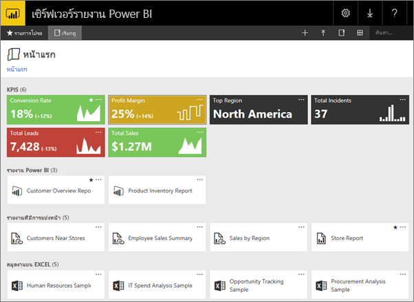
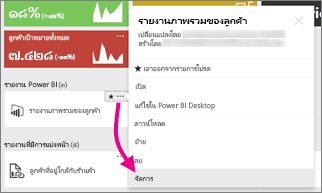
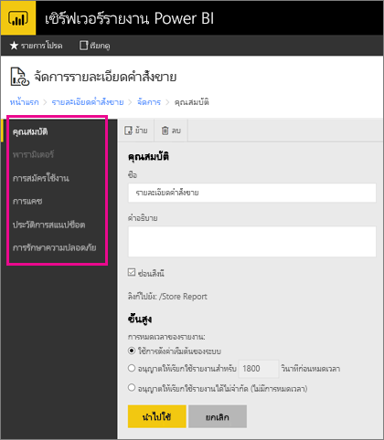

# จัดการเนื้อหาในพอร์ทัลของเว็บManage content in the web portal 
พอร์ทัลของเว็บเซิร์ฟเวอร์รายงาน Power BI คือ ตำแหน่งที่ตั้งภายในองค์กรสำหรับการดู การจัดเก็บ และการจัดการ Power BI ของคุณ รายงานสำหรับอุปกรณ์เคลื่อนที่และที่มีการแบ่งหน้า และ KPIThe Power BI Report Server web portal is an on-premises location for viewing, storing and managing your Power BI, mobile, and paginated reports, and KPIs.

คุณสามารถดูพอร์ทัลของเว็บในเบราว์เซอร์ที่ทันสมัยใดๆ ก็ได้You can view the web portal in any modern browser. ในพอร์ทัลของเว็บ รายงาน และ KPI จะถูกจัดระเบียบไว้ในโฟลเดอร์ และคุณสามารถทำเครื่องหมายว่าเป็นรายการโปรดได้In the web portal, reports and KPIs are organized in folders, and you can mark them as favorites. นอกจากนี้คุณยังสามารถเก็บ สมุดงาน Excel ไว้ที่นั่นได้You can also store Excel workbooks there. จากพอร์ทัลของเว็บ คุณสามารถเปิดใช้เครื่องมือที่คุณจำเป็นต้องใช้ในการสร้างรายงาน:From the web portal, you can launch the tools you need to create reports:

* **รายงาน Power BI** ที่สร้างขึ้นด้วย Power BI Desktop: ดูรายงานเหล่านั้นในพอร์ทัลของเว็บและแอป Power BI สำหรับอุปกรณ์เคลื่อนที่**Power BI reports** created with Power BI Desktop: View them in the web portal and the Power BI mobile apps.
* **รายงานที่มีการแบ่งหน้า** ซึ่งถูกสร้างขึ้นในตัวสร้างรายงาน: เอกสารที่ดูทันสมัยและเค้าโครงแบบคงที่ถูกปรับให้เหมาะสมสำหรับการพิมพ์**Paginated reports** created in Report Builder: Modern-looking, fixed-layout documents optimized for printing.
* **KPI** ที่ถูกสร้างอย่างเหมาะสมในพอร์ทัลของเว็บ**KPIs** created right in the web portal.

ในพอร์ทัลของเว็บ คุณสามารถเรียกดูโฟลเดอร์ของเซิร์ฟเวอร์รายงานหรือค้นหารายงานเฉพาะเจาะจงIn the web portal you can browse the report server folders or search for specific reports. คุณสามารถดูรายงาน คุณสมบัติทั่วไป และสำเนาในอดีตของรายงานที่ถูกเก็บไว้ในประวัติรายงานYou can view a report, its general properties and past copies of the report that are captured in report history. ขึ้นอยู่กับสิทธิ์ของคุณ คุณอาจยังสามารถสมัครใช้งานรายงานสำหรับจัดส่งไปยังกล่องขาเข้าของอีเมลหรือโฟลเดอร์ที่ใช้ร่วมกันในระบบไฟล์ของคุณDepending on your permissions, you might also be able to subscribe to reports for delivery to your e-mail inbox or a shared folder on the file system.

## บทบาทและสิทธิ์ของพอร์ทัลของเว็บWeb portal roles and permissions
แอปพลิเคชันพอร์ทัลของเว็บ ทำงานในเบราว์เซอร์The web portal application runs in a browser. เมื่อคุณเริ่มพอร์ทัลของเว็บ หน้า ลิงก์ และตัวเลือกที่คุณเห็นจะแตกต่างกันไปโดยขึ้นอยู่กับสิทธิ์ที่คุณมีบนเซิร์ฟเวอร์รายงานWhen you start the web portal, the pages, links, and options you see vary based on the permissions you have on the report server. ถ้าคุณถูกกำหนดให้ได้บทบาทที่มีสิทธิ์แบบเต็ม คุณสามารถเข้าถึงชุดของเมนูและหน้าแอปพลิเคชันทั้งหมดสำหรับการจัดการเซิร์ฟเวอร์รายงานIf you're assigned to a role with full permissions, you have access to the complete set of application menus and pages for managing a report server. ถ้าคุณถูกกำหนดให้ได้บทบาทที่มีสิทธิ์ในการดูและเรียกใช้รายงาน คุณจะเห็นเฉพาะเมนูและหน้าที่คุณจำเป็นต้องใช้สำหรับกิจกรรมเหล่านั้นIf you're assigned to a role with permissions to view and run reports, you only see the menus and pages you need for those activities. คุณสามารถมีการกำหนดบทบาทที่แตกต่างกันสำหรับเซิร์ฟเวอร์รายงานที่แตกต่างกัน หรือแม้แต่รายงานและโฟลเดอร์ต่างๆ บนเซิร์ฟเวอร์รายงานเดียวYou can have different role assignments for different report servers, or even for the various reports and folders on a single report server.

## เริ่มต้นพอร์ทัลของเว็บStart the web portal
1. เปิดเว็บเบราว์เซอร์ของคุณOpen your web browser.
   
    ดูรายการของ[เว็บเบราว์เซอร์และรุ่นที่ได้รับการสนับสนุน](browser-support.md)See this list of [supported web browsers and versions](browser-support.md).
2. ในแถบที่อยู่ พิมพ์ URL พอร์ทัลของเว็บIn the address bar, type the web portal URL.
   
    ตามค่าเริ่มต้น URL คือ<em>https://[ComputerName]/reports</em>By default, the URL is <em>https://[ComputerName]/reports</em>.
   
    เซิร์ฟเวอร์รายงานอาจถูกกำหนดค่าให้ใช้พอร์ตที่เจาะจงThe report server might be configured to use a specific port. ตัวอย่างเช่น<em>https://[ComputerName]:80/reports</em>หรือ<em>https://[ComputerName]:8080/reports</em>For example, <em>https://[ComputerName]:80/reports</em> or <em>https://[ComputerName]:8080/reports</em>
   
    คุณเห็นว่า พอร์ทัลของเว็บจัดกลุ่มรายการลงในหมวดหมู่เหล่านี้:You see that the web portal groups items into these categories:
   
   * KPIsKPIs
   * รายงานสำหรับอุปกรณ์เคลื่อนที่Mobile reports
   * รายงานที่มีการแบ่งหน้าPaginated reports
   * รายงาน Power BI DesktopPower BI Desktop reports
   * เวิร์กบุ๊ก ExcelExcel workbooks
   * ชุดข้อมูลDatasets
   * แหล่งข้อมูลData sources
   * ทรัพยากรResources

## จัดการรายการในพอร์ทัลของเว็บManage items in the web portal
เซิร์ฟเวอร์รายงาน Power BI มีการควบคุมอย่างละเอียดของรายการที่คุณเก็บไว้บนพอร์ทัลของเว็บPower BI Report Server offers detailed control of the items you store on the web portal. ตัวอย่างเช่น คุณสามารถตั้งค่าการสมัครใช้งาน การแคช สแนปช็อต และรักษาความปลอดภัยบนรายงานที่มีการแบ่งหน้าแต่ละรายการFor example, you can set up subscriptions, caching, snapshots, and security on individual paginated reports.

1. เลือก **ตัวเลือกเพิ่มเติม** (...) ที่มุมบนขวาของรายการ จากนั้นเลือก **จัดการ**Select **More options** (...) in the upper-right corner of an item, then select **Manage**.
   
    
2. เลือกคุณสมบัติหรือคุณลักษณะอื่นๆ ที่คุณต้องการตั้งค่าChoose the property or other feature you want to set.
   
    
3. เลือก **นำไปใช้**Select **Apply**.

อ่านเพิ่มเติมเกี่ยวกับ[การทำงานกับการสมัครใช้งานในพอร์ทัลของเว็บ](/sql/reporting-services/working-with-subscriptions-web-portal)Read more about [working with subscriptions in the web portal](/sql/reporting-services/working-with-subscriptions-web-portal).

## ขั้นตอนถัดไปNext steps
[เซิร์ฟเวอร์รายงาน Power BI คืออะไรWhat is Power BI Report Server?](get-started.md)

มีคำถามเพิ่มเติมหรือไม่More questions? [ลองถามชุมชน Power BITry asking the Power BI Community](https://community.powerbi.com/)