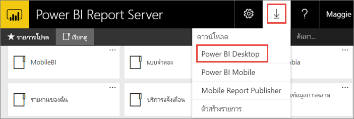
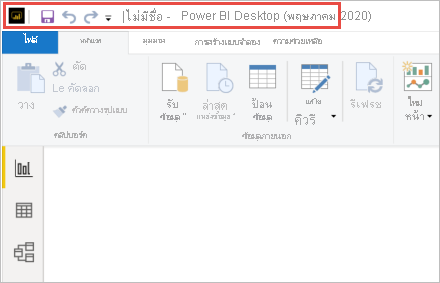
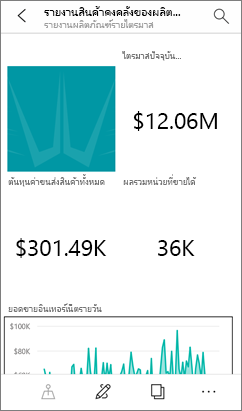

# ติดตั้ง Power BI Desktop ที่ปรับให้เหมาะสำหรับเซิร์ฟเวอร์รายงาน Power BIInstall Power BI Desktop optimized for Power BI Report Server

เมื่อต้องสร้างรายงาน Power BI สำหรับเซิร์ฟเวอร์รายงาน Power BI คุณจำเป็นต้องดาวน์โหลดและติดตั้ง Power BI Desktop เวอร์ชันที่ปรับให้เหมาะสำหรับเซิร์ฟเวอร์รายงาน Power BITo create Power BI reports for Power BI Report Server, you need to download and install the version of Power BI Desktop that's optimized for Power BI Report Server. การเผยแพร่นี้จะแตกต่างจาก Power BI Desktop ที่ใช้กับบริการ Power BIThis release is different from the Power BI Desktop used with the Power BI service. ตัวอย่างเช่น เวอร์ชันของ Power BI Desktop สำหรับบริการของ Power BI ที่มีคุณลักษณะการแสดงตัวอย่างFor example, the version of Power BI Desktop for the Power BI service includes preview features. คุณลักษณะเหล่านั้นไม่ได้อยู่ในเวอร์ชัน Power BI Report Server จนกว่าจะพร้อมใช้งานทั่วไปThose features aren't in the Power BI Report Server version until they're generally available. การใช้การเผยแพรนี้จะทำให้แน่ใจว่า เซิร์ฟเวอร์รายงานสามารถโต้ตอบกับรายงานและแบบจำลองเวอร์ชันที่ทราบแล้วได้Using this release makes sure that the report server can interact with a known version of the reports and model. 

ไม่ต้องกังวลNot to worry. เนื่องจากคุณสามารถติดตั้ง Power BI Desktop และ Power BI Desktop ที่ปรับให้เหมาะสมสำหรับ Power BI Report Server ได้โดยควบคู่กันไปบนคอมพิวเตอร์เครื่องเดียวกันYou can install Power BI Desktop, and Power BI Desktop optimized for Power BI Report Server, side by side on the same computer.

## ดาวน์โหลด และติดตั้ง Power BI DesktopDownload and install Power BI Desktop

วิธีที่ง่ายที่สุดเพื่อให้แน่ใจว่าคุณมีเวอร์ชันล่าสุดของ Power BI Desktop ที่ปรับให้เหมาะสมสำหรับเซิร์ฟเวอร์รายงาน Power BI ก็คือ การเริ่มต้นจากพอร์ทัลเว็บของเซิร์ฟเวอร์รายงานของคุณThe easiest way to be sure you have the most up-to-date version of Power BI Desktop optimized for Power BI Report Server is to start from the web portal of your report server.

1. ในพอร์ทัลเว็บเซิร์ฟเวอร์รายงาน เลือก **ดาวน์โหลด** ลูกศร > **Power BI Desktop**In the report server web portal, select the **Download** arrow > **Power BI Desktop**.

    

    หรือไปที่หน้าหลัก [เซิร์ฟเวอร์รายงาน Power BI](https://powerbi.microsoft.com/report-server/) แล้วเลือก **ตัวเลือกการดาวน์โหลดขั้นสูง**Or go to the [Power BI Report Server](https://powerbi.microsoft.com/report-server/) home page and select **Advanced download options**.

2. ในหน้าศูนย์ดาวน์โหลด ให้เลือกภาษา จากนั้นเลือก **ดาวน์โหลด**In the Download Center page, select a language, then select **Download**.

3. ขึ้นอยู่กับคอมพิวเตอร์ของคุณ เลือก:Depending on your computer, select: 

    - **PBIDesktopRS.msi** (เวอร์ชัน 32 บิต) หรือ**PBIDesktopRS.msi** (the 32-bit version) or
    - **PBIDesktopRS_x64.msi** (เวอร์ชัน 64 บิต)**PBIDesktopRS_x64.msi** (the 64-bit version).

1. หลังจากที่คุณดาวน์โหลดตัวติดตั้งแล้ว เรียกใช้ตัวช่วยสร้างการติดตั้ง Power BI DesktopAfter you download the installer, run the Power BI Desktop Setup Wizard.

2. ในตอนท้ายของการติดตั้ง เลือก **เรียกใช้ Power BI Desktop**At the end of the installation, select **Launch Power BI Desktop**.

    จะเริ่มต้นโดยอัตโนมัติ และคุณก็พร้อมที่จะไปต่อIt starts automatically and you're ready to go.

## ตรวจสอบว่าคุณกำลังใช้เวอร์ชันที่ถูกต้องVerify you're using the correct version
เป็นเรื่องง่ายเมื่อต้องการตรวจสอบว่าคุณกำลังใช้ Power BI Desktop ที่ถูกต้องอยู่: ดูที่เปิดใช้งานหน้าจอหรือแถบชื่อเรื่องภายใน Power BI DesktopIt's easy to verify that you're using the correct Power BI Desktop: Look at the launch screen or title bar within Power BI Desktop. คุณสามารถแจ้งว่าคุณมีเวอร์ชันที่ถูกต้องเนื่องจาก **Power BI Desktop (ตุลาคม 2020)** อยู่ในแถบชื่อYou can tell you have the right version because **Power BI Desktop (October 2020)** is in the title bar. นอกจากนี้ สีโลโก้ Power BI จะกลับกันโดยสีเหลืองจะอยู่บนพื้นดำแทนที่เป็นสีดำบนพื้นเหลืองAlso, the Power BI logo colors are reversed, yellow on black instead of black on yellow.

เวอร์ชั่น Power BI Desktop สำหรับบริการ Power BI ไม่มีเดือนและปีในแถบรายการชื่อThe version of Power BI Desktop for the Power BI service doesn't have the month and year in the title bar.

## การเชื่อมโยงนามสกุลไฟล์File extension association
เนื่องจากคุณสามารถติดตั้ง Power BI Desktop และ Power BI Desktop ที่ปรับให้เหมาะสมสำหรับ Power BI Report Server ได้โดยควบคู่กันไปบนคอมพิวเตอร์เครื่องเดียวกันSay you've installed both Power BI Desktop and Power BI Desktop optimized for Power BI Report Server on the same machine. การติดตั้ง Power BI Desktop ครั้งล่าสุดของคุณมีการเชื่อมโยงไฟล์กับไฟล์ .pbixYour most recent installation of Power BI Desktop has the file association with .pbix files. ดังนั้นแล้วเมื่อคุณดับเบิลคลิกที่ไฟล ์.pbix ก็จะเปิดใช้ Power BI Desktop ที่คุณได้ทำการติดตั้งล่าสุดThus, when you double-click a .pbix file, it launches the Power BI Desktop you installed most recently.

ถ้าคุณมี Power BI Desktop อยู่ แล้วติดตั้ง Power BI Desktop ที่ปรับให้เหมาะสมสำหรับเซิร์ฟเวอร์รายงาน Power BI ไฟล์ pbix ทั้งหมดก็จะเปิดใน Power BI Desktop ที่ปรับให้เหมาะสมสำหรับเซิร์ฟเวอร์รายงาน Power BI ตามค่าเริ่มต้นIf you have Power BI Desktop and then install Power BI Desktop optimized for Power BI Report Server, all .pbix files open in Power BI Desktop optimized for Power BI Report Server by default. ถ้าคุณต้องการให้ Power BI Desktop เป็นค่าเริ่มต้นแทนสำหรับเปิดใช้งานเมื่อเปิดไฟล์ .pbix ให้ติดตั้ง [ Power BI Desktop จาก Microsoft Store ใหม่](https://aka.ms/pbidesktopstore)If you would rather have Power BI Desktop be the default to launch when opening a .pbix file, reinstall [Power BI Desktop from the Microsoft Store](https://aka.ms/pbidesktopstore).

คุณสามารถเปิด Power BI Desktop เวอร์ชันที่คุณต้องการใช้ก่อนได้เสมอYou can always open the version of Power BI Desktop you want to use first. จากนั้น ให้เปิดไฟล์จากภายใน Power BI DesktopAnd then open the file from within Power BI Desktop.

นี่คือวิธีที่ปลอดภัยที่สุดในการเปิด Power BI Desktop เวอร์ชันที่ถูกต้องHere's the safest way to always open the correct version of Power BI Desktop. เริ่มต้นการแก้ไขรายงาน Power BI จากภายใน Power BI Report Server หรือสร้างรายงาน Power BI ใหม่จากบริการของ Power BIStart editing a Power BI report from within Power BI Report Server, or create a new Power BI report from the Power BI service.

## ข้อควรพิจารณาและข้อจำกัดConsiderations and limitations

รายงาน Power BI ในเซิร์ฟเวอร์รายงาน Power BI ในบริการของ Power BI (`https://app.powerbi.com`) และในแอปสำหรับอุปกรณ์เคลื่อนที่ Power BI ทำงานในลักษณะที่ใกล้เคียงกัน  แต่จะมีบางคุณลักษณ์ที่แตกต่างกันPower BI reports in Power BI Report Server, in the Power BI service (`https://app.powerbi.com`), and in the Power BI mobile apps act almost exactly the same, but a few features are different.

### การเลือกภาษาSelecting a language

สำหรับการ Power BI Desktop ที่ปรับให้เหมาะสำหรับเซิร์ฟเวอร์รายงาน Power BI คุณต้องเลือกภาษาเมื่อคุณติดตั้งแอปFor Power BI Desktop optimized for Power BI Report Server, you select the language when you install the app. ซึ่งหลังจากนี้คุณจะไม่สามารถเปลี่ยนภาษาได้ แต่คุณสามารถติดตั้งเวอร์ชันในภาษาอื่นได้You can't change it after, but you can install a version in another language.

### การแสดงภาพรายงานในเบราว์เซอร์Report visuals in a browser

รายงานของเซิร์ฟเวอร์รายงาน Power BI รองรับส่วนการแสดงผลเกือบทั้งหมด รวมทั้งส่วนวิชวล Power BIPower BI Report Server reports support almost all visualizations, including Power BI visuals. รายงานในเซิร์ฟเวอร์รายงาน Power BI ไม่สนับสนุน:Power BI Report Server reports don’t support:

* วิชวล RR visuals
* แผนที่ ArcGISArcGIS maps
* การนำทางแบบแสดงเส้นนำทางBreadcrumbs
* คุณลักษณะที่เป็นตัวอย่างใน Power BI DesktopPower BI Desktop preview features

### รายงานในแอปสำหรับอุปกรณ์เคลื่อนที่ Power BIReports in the Power BI mobile apps

รายงานในเซิร์ฟเวอร์รายงาน Power BI สนับสนุนฟังก์ชันพื้นฐานทั้งหมดใน[แอปสำหรับอุปกรณ์เคลื่อนที่ Power BI](../consumer/mobile/mobile-apps-for-mobile-devices.md) รวมถึง:Power BI Report Server reports support all the basic functionality in the [Power BI mobile apps](../consumer/mobile/mobile-apps-for-mobile-devices.md), including:

* [เค้าโครงรายงานโทรศัพท์](../create-reports/desktop-create-phone-report.md): คุณสามารถปรับรายงานให้เหมาะสมกับแอปสำหรับอุปกรณ์เคลื่อนที่ Power BI ได้[Phone report layout](../create-reports/desktop-create-phone-report.md): You can optimize a report for the Power BI mobile apps. บนโทรศัพท์มือถือของคุณ รายงานที่ปรับให้เหมาะสมมีไอคอนพิเศษ  และเค้าโครงที่เหมาะกับมือถือOn your mobile phone, optimized reports have a special icon , and layout.
  
    

รายงานในเซิร์ฟเวอร์รายงาน Power BI ไม่สนับสนุนคุณลักษณะเหล่านี้ในแอปสำหรับอุปกรณ์เคลื่อนที่ Power BI:Power BI Report Server reports don’t support these features in the Power BI mobile apps:

* วิชวล RR visuals
* แผนที่ ArcGISArcGIS maps
* วิชวล Power BIPower BI visuals
* การนำทางแบบแสดงเส้นนำทางBreadcrumbs
* การกรองพรมแดนหรือบาร์โค้ดGeo filtering or bar codes

### การรักษาความปลอดภัยแบบกำหนดเองCustom Security

Power BI Desktop ที่ปรับให้เหมาะสำหรับเซิร์ฟเวอร์รายงาน Power BI ไม่รองรับการรักษาความปลอดภัยแบบกำหนดเองPower BI Desktop optimized for Power BI Report Server does not support custom security. ถ้ามีการกำหนดค่าเซิร์ฟเวอร์รายงาน Power BI ของคุณด้วยส่วนขยายการรักษาความปลอดภัยแบบกำหนดเอง คุณจะไม่สามารถบันทึกรายงาน Power BI จาก Power BI Desktop (ปรับให้เหมาะสำหรับเซิร์ฟเวอร์รายงาน Power BI) ไปยังอินสแตนซ์เซิร์ฟเวอร์รายงาน Power BI ได้If your Power BI Report Server is configured with a custom security extension, you can't save a Power BI report from Power BI Desktop (optimized for Power BI Report Server) to the Power BI Report Server instance. คุณจำเป็นต้องบันทึกไฟล์รายงานนามสกุล .pbix จาก Power BI Desktop และอัปโหลดไปยังไซต์พอร์ทัลเซิร์ฟเวอร์รายงาน Power BIYou need to save the .pbix report file from Power BI Desktop and upload it to the Power BI Report Server portal site.

### การบันทึกรายงานไปยังเซิร์ฟเวอร์รายงาน Power BI ในโดเมนอื่นSaving reports to a Power BI Report Server in a different domain

เมื่อคุณบันทึกรายงาน Power BI ไปยังเซิร์ฟเวอร์รายงาน Power BI ข้อมูลประจำตัว Windows ของคุณจะถูกใช้When you save a Power BI report to Power BI Report Server, your Windows credentials are used. การบันทึกไปยังเซิร์ฟเวอร์รายงานในโดเมนอื่นโดยตรง ข้อมูลประจำตัว Windows ของคุณ จะไม่ได้รับการสนับสนุนSaving directly to a report server in a different domain to your Windows credentials is not supported. คุณสามารถใช้เว็บเบราว์เซอร์เพื่อดูเซิร์ฟเวอร์รายงาน และอัปโหลดไฟล์จากเครื่องของคุณแทนYou can use a web browser to view the report server and manually upload the file from your machine instead.

## ขั้นตอนถัดไปNext steps

หลังจากที่ติดตั้ง Power BI Desktop แล้ว คุณสามารถเริ่มการสร้างรายงาน Power BI ได้Now that you have Power BI Desktop installed, you can start creating Power BI reports.

[สร้างรายงาน Power BI สำหรับเซิร์ฟเวอร์รายงาน Power BICreate a Power BI report for Power BI Report Server](quickstart-create-powerbi-report.md)  
[เซิร์ฟเวอร์รายงาน Power BI คืออะไรWhat is Power BI Report Server?](get-started.md)

มีคำถามเพิ่มเติมหรือไม่More questions? [ลองถามชุมชน Power BITry asking the Power BI Community](https://community.powerbi.com/)

