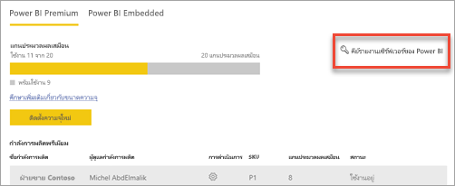
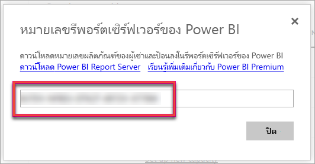
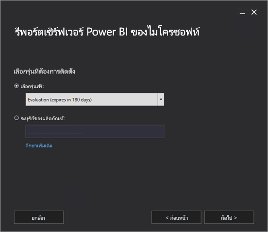
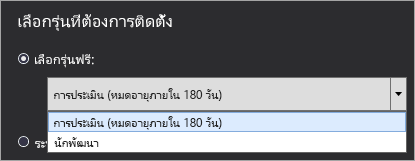
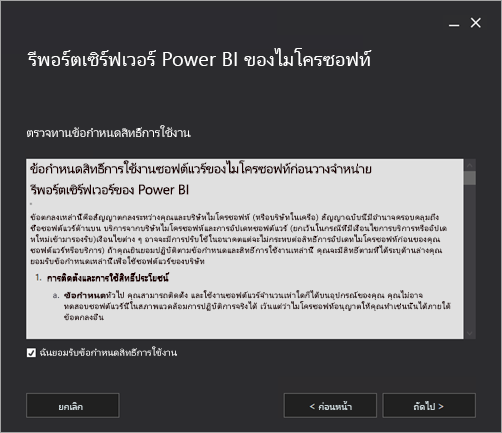
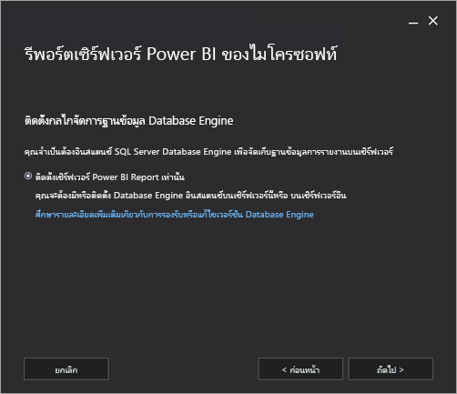
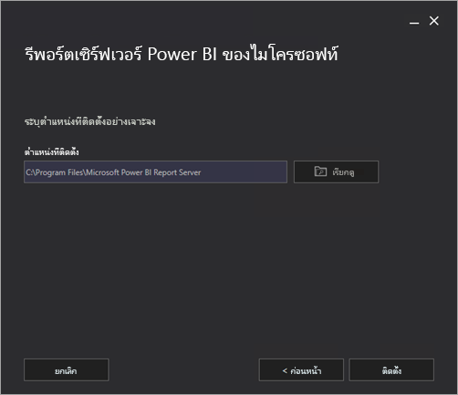
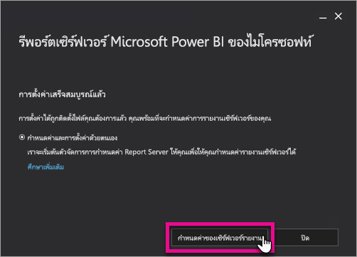
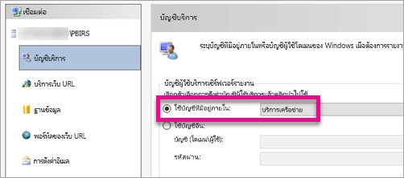
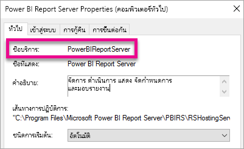

# ติดตั้ง Power BI Report ServerInstall Power BI Report Server

เรียนรู้วิธีการติดตั้งเซิร์ฟเวอร์รายงาน Power BILearn how to install Power BI Report Server.

## ดาวน์โหลดเซิร์ฟเวอร์รายงาน Power BIDownload Power BI Report Server

ในหน้า[การรายงานภายในองค์กรกับเซิร์ฟเวอร์รายงาน Power BI](https://powerbi.microsoft.com/report-server/) เลือก**ดาวน์โหลดรุ่นทดลองใช้ฟรี**On the [On-premises reporting with Power BI Report Server](https://powerbi.microsoft.com/report-server/) page, select **Download free trial**.

เมื่อคุณเรียกใช้ไฟล์ PowerBIReportServer.exe คุณจะเลือกรุ่นทดลองใช้ฟรีหรือป้อนรหัสผลิตภัณฑ์ของคุณWhen you run the PowerBIReportServer.exe file, you select the free trial or you enter your product key. อ่านรายละเอียดRead on for details.

## ก่อนที่คุณจะติดตั้งBefore you install

ก่อนที่คุณจะติดตั้ง Power BI Report Server เราขอแนะนำให้คุณตรวจสอบ [ข้อกำหนดของฮาร์ดแวร์และซอฟต์แวร์สำหรับการติดตั้ง Power BI Report Server](system-requirements.md)Before you install Power BI Report Server, we recommend you review the [Hardware and Software Requirements for installing Power BI Report Server](system-requirements.md).

 > [!IMPORTANT]
 > ในขณะที่คุณสามารถติดตั้งเซิร์ฟเวอร์รายงาน Power BI ในสภาพแวดล้อมที่มีตัวควบคุมโดเมนแบบอ่านอย่างเดียว (RODC), Power BI Report Server จำเป็นต้องเข้าถึงตัวควบคุมโดเมนแบบอ่าน-เขียนเพื่อให้ทำงานได้อย่างถูกต้องWhile you can install Power BI Report Server in an environment that has a Read-Only Domain Controller (RODC), Power BI Report Server needs access to a Read-Write Domain Controller to function properly. ถ้า Power BI Report Server สามารถเข้าถึง RODC ได้เท่านั้นคุณอาจพบข้อผิดพลาดเมื่อพยายามจัดการบริการIf Power BI Report Server only has access to a RODC, you may encounter errors when trying to administer the service.

### คีย์ผลิตภัณฑ์เซิร์ฟเวอร์รายงาน Power BIPower BI Report Server product key

คุณสามารถรับคีย์ผลิตภัณฑ์สำหรับเซิร์ฟเวอร์รายงาน Power BI จากแหล่งข้อมูลอื่นสองแห่ง:You can get the product key for Power BI Report Server from two different sources:

- Power BI PremiumPower BI Premium
- SQL Server Enterprise Software Assurance (SA)SQL Server Enterprise Software Assurance (SA)

อ่านรายละเอียดRead on for details.

#### Power BI PremiumPower BI Premium

ถ้าคุณซื้อ Power BI Premium แล้ว ภายในแท็บ **การตั้งค่า Premium** ของพอร์ทัลผู้ดูแลระบบ Power BI คุณสามารถเข้าถึงคีย์ผลิตภัณฑ์ของเซิร์ฟเวอร์รายงาน Power BIIf you've purchased Power BI Premium, within the **Premium settings** tab of the Power BI admin portal, you have access to your Power BI Report Server product key. พอร์ทัลผู้ดูแลระบบพร้อมใช้งานสำหรับผู้ดูแลระบบส่วนกลาง หรือผู้ใช้ที่ได้รับการกำหนดบทบาทเป็นผู้ดูแลระบบบริการของ Power BI เท่านั้นThe admin portal is only available to Global Admins or users assigned the Power BI service administrator role.

การเลือก**คีย์เซิร์ฟเวอร์รายงาน Power BI** จะแสดงบทสนทนาที่มีคีย์ผลิตภัณฑ์ของคุณSelecting **Power BI Report Server key** displays a dialog containing your product key. คุณสามารถคัดลอกคีย์และนำไปใช้กับการติดตั้งYou can copy it and use it with the installation.

#### SQL Server Enterprise Software Assurance (SA)SQL Server Enterprise Software Assurance (SA)

ถ้าคุณมีข้อตกลง SQL Server Enterprise SA คุณสามารถรับคีย์ผลิตภัณฑ์ของคุณจาก[ศูนย์บริการการมอบสิทธิ์การใช้งาน Volume](https://www.microsoft.com/Licensing/servicecenter/)ได้If you have a SQL Server Enterprise SA agreement, you can get your product key from the [Volume Licensing Service Center](https://www.microsoft.com/Licensing/servicecenter/).

## ติดตั้งเซิร์ฟเวอร์รายงานของคุณInstall your report server

การติดตั้งเซิร์ฟเวอร์รายงาน Power BI จะเป็นไปอย่างง่ายดายInstalling Power BI Report Server is straightforward. มีเพียงไม่กี่ขั้นตอนในการติดตั้งไฟล์There are only a few steps to install the files.

คุณไม่จำเป็นต้องใช้เปิดงานเซิร์ฟเวอร์กลไกจัดการฐานข้อมูล SQL Server ในขณะติดตั้งYou don't need a SQL Server Database Engine server available at the time of install. แต่คุณจะต้องมีเพื่อกำหนดค่า “บริการการรายงาน” หลังจากติดตั้งYou will need one to configure Reporting Services after install.

1. ค้นหาตำแหน่งที่ตั้งของ PowerBIReportServer.exe และเปิดใช้งานตัวติดตั้งFind the location of PowerBIReportServer.exe and launch the installer.

2. เลือก**ติดตั้งเซิร์ฟเวอร์รายงาน Power BI**Select **Install Power BI Report Server**.

    
3. เลือกรุ่นเพื่อติดตั้ง จากนั้นเลือก**ถัดไป**Choose an edition to install and then select **Next**.

    

    เลือก “รุ่นการประเมิน” หรือ “รุ่นนักพัฒนา”Choose either Evaluation or Developer edition.

    

    หรือป้อนคีย์ผลิตภัณฑ์ที่คุณได้รับมาจากบริการของ Power BI หรือศูนย์บริการ Volume LicenseOtherwise, enter the product key that you got from either the Power BI service or the Volume License Service Center. ดูที่ส่วน[ก่อนที่คุณจะติดตั้ง](#before-you-install)ข้างต้น สำหรับข้อมูลเพิ่มเติมเกี่ยวกับวิธีการรับคีย์ผลิตภัณฑ์ของคุณFor more information about how to get your product key, see the [Before you install](#before-you-install) section above.
4. อ่านและยอมรับเงื่อนไขและข้อกำหนดสิทธิ์การใช้งาน จากนั้นเลือก**ถัดไป**Read and agree to the license terms and conditions, then select **Next**.

    
5. คุณต้องมีกลไลจัดการฐานข้อมูลที่พร้อมใช้งานเพื่อจัดเก็บฐานข้อมูลเซิร์ฟเวอร์รายงานYou need a Database Engine available to store the report server database. เลือก**ถัดไป**เพื่อติดตั้งเซิร์ฟเวอร์รายงานเท่านั้นSelect **Next** to install the report server only.

    
6. ระบุตำแหน่งการติดตั้งสำหรับเซิร์ฟเวอร์รายงานSpecify the install location for the report server. เลือก**ติดตั้ง**เพื่อดำเนินการต่อSelect **Install** to continue.

    

    เส้นทางเริ่มต้นคือ C:\Program Files\Microsoft Power BI Report ServerThe default path is C:\Program Files\Microsoft Power BI Report Server.

7. หลังจากตั้งค่าสำเร็จ เลือก**กำหนดค่าเซิร์ฟเวอร์รายงาน**เพื่อเปิดใช้ตัวจัดการการกำหนดค่าบริการการรายงานAfter a successful setup, select **Configure Report Server** to launch the Reporting Services Configuration Manager.

    

## กำหนดค่าเซิร์ฟเวอร์รายงานของคุณConfigure your report server

หลังจากที่คุณเลือก**กำหนดค่าเซิร์ฟเวอร์รายงาน**ในการตั้งค่า คุณจะพบ Reporting Services Configuration ManagerAfter you select **Configure Report Server** in the setup, you're presented with Reporting Services Configuration Manager. ดูที่[ตัวจัดการการกำหนดค่าบริการการรายงาน](/sql/reporting-services/install-windows/reporting-services-configuration-manager-native-mode)สำหรับข้อมูลเพิ่มเติมFor more information, see [Reporting Services Configuration Manager](/sql/reporting-services/install-windows/reporting-services-configuration-manager-native-mode).

เพื่อดำเนินการกำหนดค่าเริ่มต้นของ “บริการการรายงาน” ให้เสร็จสิ้น คุณต้อง[สร้างฐานข้อมูลเซิร์ฟเวอร์รายงาน](/sql/reporting-services/install-windows/ssrs-report-server-create-a-report-server-database)To complete the initial configuration of Reporting Services, you [create a report server database](/sql/reporting-services/install-windows/ssrs-report-server-create-a-report-server-database). เซิร์ฟเวอร์ฐานข้อมูล SQL Server จะต้องทำตามขั้นตอนต่อไปนี้A SQL Server Database server is required to complete this step.

### สร้างฐานข้อมูลในเซิร์ฟเวอร์อื่นCreating a database on a different server

ถ้าคุณกำลังสร้างฐานข้อมูลเซิร์ฟเวอร์รายงานในเซิร์ฟเวอร์ฐานข้อมูลบนคอมพิวเตอร์เครื่องอื่น ให้เปลี่ยนบัญชีบริการสำหรับเซิร์ฟเวอร์รายงานให้เป็นข้อมูลประจำตัวที่เซิร์ฟเวอร์ฐานข้อมูลจดจำได้If you're creating the report server database on a database server on a different machine, change the service account for the report server to a credential that is recognized on the database server. 

ตามค่าเริ่มต้น เซิร์ฟเวอร์รายงานใช้บัญชีผู้ใช้บริการเสมือนBy default, the report server uses the virtual service account. ถ้าคุณพยายามที่จะสร้างฐานข้อมูลบนเซิร์ฟเวอร์อื่น คุณอาจได้รับข้อผิดพลาดต่อไปนี้ในขั้นตอนการใช้สิทธิ์การเชื่อมต่อที่นำมาปรับใช้If you try to create a database on a different server, you may receive the following error on the Applying connection rights step.

`System.Data.SqlClient.SqlException (0x80131904): Windows NT user or group '(null)' not found. Check the name again.`

คุณสามารถเปลี่ยนบัญชีบริการเป็นบริการเครือข่ายหรือบัญชีโดเมน เพื่อหลีกเลี่ยงข้อผิดพลาดTo work around the error, you can change the service account to either Network Service or a domain account. การเปลี่ยนบัญชีบริการเป็นบริการเครือข่ายจะใช้สิทธิ์ในบริบทของบัญชีเครื่องสำหรับเซิร์ฟเวอร์รายงานChanging the service account to Network Service applies rights in the context of the machine account for the report server.

ดูที่[การกำหนดค่าบัญชีผู้ใช้บริการเซิร์ฟเวอร์รายงาน](/sql/reporting-services/install-windows/configure-the-report-server-service-account-ssrs-configuration-manager)สำหรับข้อมูลเพิ่มเติมFor more information, see [Configure the report server service account](/sql/reporting-services/install-windows/configure-the-report-server-service-account-ssrs-configuration-manager).

## บริการ WindowsWindows Service

บริการ windows ได้รับการสร้างให้เป็นส่วนหนึ่งของการติดตั้งA windows service is created as part of the installation. ซึ่งจะแสดงเป็น**เซิร์ฟเวอร์รายงาน Power BI**It is displayed as **Power BI Report Server**. ชื่อบริการคือ**PowerBIReportServer**The service name is **PowerBIReportServer**.

## การจอง URL เริ่มต้นDefault URL reservations

การจอง URL ประกอบด้วยคำนำหน้า ชื่อโฮสต์ พอร์ต และไดเรกทอรีเสมือน:URL reservations are composed of a prefix, host name, port, and virtual directory:

| ส่วนPart | คำอธิบายDescription |
| --- | --- |
| คำนำหน้าPrefix |คำนำหน้าเริ่มต้นคือ HTTPThe default prefix is HTTP. ถ้าคุณติดตั้งใบรับรอง Secure Sockets Layer (SSL) ไว้แล้วก่อนหน้านี้ “การตั้งค่า” จะพยายามสร้างการจอง URL ที่ใช้คำนำหน้าเป็น HTTPSIf you previously installed a Secure Sockets Layer (SSL) certificate, Setup tries to create URL reservations that use the HTTPS prefix. |
| ชื่อโฮสต์Host name |ชื่อโฮสต์เริ่มต้นคือ สัญลักษณ์ที่คาดเดายาก (+)The default host name is a strong wildcard (+). ซึ่งระบุว่าเซิร์ฟเวอร์รายงานยอมรับคำขอ HTTP ใด ๆ บนพอร์ตที่กำหนดไว้สำหรับชื่อโฮสต์ที่แก้ไขไปยังคอมพิวเตอร์ รวมถึง`https://<computername>/reportserver`,`https://localhost/reportserver`หรือ `https://<IPAddress>/reportserver.`It specifies that the report server accepts any HTTP request on the designated port for any host name that resolves to the computer, including `https://<computername>/reportserver`, `https://localhost/reportserver`, or `https://<IPAddress>/reportserver.` |
| พอร์ตPort |พอร์ตเริ่มต้นคือ 80The default port is 80. ถ้าคุณใช้พอร์ตใด ๆ นอกเหนือจากพอร์ต 80 คุณต้องเพิ่มพอร์ตนั้นลงใน URL อย่างชัดเจนเมื่อคุณเปิดเว็บพอร์ทัลในหน้าต่างเบราเซอร์If you use any port other than port 80, you have to explicitly add it to the URL when you open web portal in a browser window. |
| ไดเรกทอรีเสมือนVirtual directory |ตามค่าเริ่มต้น ไดเรกทอรีเสมือนได้รับการสร้างขึ้นในรูปแบบของ ReportServer สำหรับ Web Service เซิร์ฟเวอร์รายงาน และรายงานสำหรับพอร์ทัลเว็บBy default, virtual directories are created in the format of ReportServer for the Report Server Web service and Reports for the web portal. ไดเรกทอรีเสมือนเริ่มต้นคือ**reportserver**สำหรับ Web Service เซิร์ฟเวอร์รายงานFor the Report Server Web service, the default virtual directory is **reportserver**. ไดเรกทอรีเสมือนเริ่มต้นคือ**รายงาน**สำหรับพอร์ทัลเว็บFor the web portal, the default virtual directory is **reports**. |

ตัวอย่างของสตริงที่ URL สมบูรณ์อาจเป็นดังนี้:An example of the complete URL string might be as follows:

* `https://+:80/reportserver`มอบการเข้าถึงไปยังเซิร์ฟเวอร์รายงาน`https://+:80/reportserver`, provides access to the report server.
* `https://+:80/reports`มอบการเข้าถึงพอร์ทัลเว็บ`https://+:80/reports`, provides access to the web portal.

## ไฟร์วอลล์Firewall

ถ้าคุณกำลังเข้าถึงเซิร์ฟเวอร์รายงานจากเครื่องระยะไกล กรุณาตรวจสอบให้แน่ใจว่าคุณได้กำหนดกฎไฟร์วอลล์แล้วใช่หรือไม่ หากมีไฟร์วอลล์อยู่If you're accessing the report server from a remote machine, make sure you've configured any firewall rules if there is a firewall present.

เปิดพอร์ต TCP ที่คุณกำหนดค่าสำหรับ Web Service URL และ Web Portal URL ของคุณOpen up the TCP port that you've configured for your Web Service URL and Web Portal URL. ซึ่งจะกำหนดค่าบนพอร์ต TCP 80 ตามค่าเริ่มต้นBy default, they're configured on TCP port 80.

## การกำหนดค่าเพิ่มเติมAdditional configuration

* ดูที่[รวมกับบริการ Power BI](/sql/reporting-services/install-windows/power-bi-report-server-integration-configuration-manager)เพื่อกำหนดค่าการรวมกับบริการ Power BI เมื่อต้องการให้คุณสามารถปักหมุดรายการรายงานไปยังแดชบอร์ด Power BITo configure integration with the Power BI service so you can pin report items to a Power BI dashboard, see [Integrate with the Power BI service](/sql/reporting-services/install-windows/power-bi-report-server-integration-configuration-manager).
* ดูที่[ตั้งค่าอีเมล์](/sql/reporting-services/install-windows/e-mail-settings-reporting-services-native-mode-configuration-manager)และ[อีเมลที่ส่งในเซิร์ฟเวอร์รายงาน](/sql/reporting-services/subscriptions/e-mail-delivery-in-reporting-services)เมื่อต้องการกำหนดค่าอีเมลสำหรับการประมวลผลการสมัครใช้งานTo configure email for subscriptions processing, see [E-Mail settings](/sql/reporting-services/install-windows/e-mail-settings-reporting-services-native-mode-configuration-manager) and [E-Mail delivery in a report server](/sql/reporting-services/subscriptions/e-mail-delivery-in-reporting-services).
* ดูที่[กำหนดค่าไฟร์วอลล์สำหรับการเข้าถึงเซิร์ฟเวอร์รายงาน](/sql/reporting-services/report-server/configure-a-firewall-for-report-server-access)และ[การกำหนดค่าเซิร์ฟเวอร์รายงานสำหรับการดูแลระบบระยะไกล](/sql/reporting-services/report-server/configure-a-report-server-for-remote-administration) เมื่อต้องการกำหนดค่าพอร์ทัลเว็บเพื่อให้คุณสามารถเข้าถึงได้ผ่านคอมพิวเตอร์รายงานเพื่อดูและจัดการรายงานTo configure the web portal so you can access it on a report computer to view and manage reports, see [Configure a firewall for report server access](/sql/reporting-services/report-server/configure-a-firewall-for-report-server-access) and [Configure a report server for remote administration](/sql/reporting-services/report-server/configure-a-report-server-for-remote-administration).
* สำหรับรายละเอียดเกี่ยวกับการตั้งค่าคุณสมบัติระบบของเซิร์ฟเวอร์รายงานใน SQL Server Management Studio ดู [หน้าคุณสมบัติของเซิร์ฟเวอร์ขั้นสูง](/sql/reporting-services/tools/server-properties-advanced-page-reporting-services)For details on setting report server system properties in SQL Server Management Studio, see [Server Properties Advanced Page](/sql/reporting-services/tools/server-properties-advanced-page-reporting-services). ถ้าไม่กำหนด ตัวเลือกจะใช้กับเซิร์ฟเวอร์รายงาน Power BI และ SQL Server Reporting Services ทั้งสองUnless it specifies otherwise, the options apply to both Power BI Report Server and SQL Server Reporting Services.

## ขั้นตอนถัดไปNext steps

[ภาพรวมของผู้ดูแลระบบAdministrator overview](admin-handbook-overview.md)  
[วิธีการค้นหาคีย์ผลิตภัณฑ์เซิร์ฟเวอร์รายงานของคุณHow to find your report server product key](find-product-key.md)  
[ติดตั้ง Power BI Desktop ที่ปรับให้เหมาะสำหรับ Power BI Report ServerInstall Power BI Desktop optimized for Power BI Report Server](install-powerbi-desktop.md)  
[ตรวจสอบการติดตั้งบริการการรายงานVerify a Reporting Services installation](/sql/reporting-services/install-windows/verify-a-reporting-services-installation)  
[กำหนดค่าบัญชีผู้ใช้บริการเซิร์ฟเวอร์รายงานConfigure the report server service account](/sql/reporting-services/install-windows/configure-the-report-server-service-account-ssrs-configuration-manager)  
[กำหนดค่า URL ของเซิร์ฟเวอร์รายงานConfigure report server URLs](/sql/reporting-services/install-windows/configure-report-server-urls-ssrs-configuration-manager)  
[กำหนดค่าการเชื่อมต่อฐานข้อมูลเซิร์ฟเวอร์รายงานConfigure a report server database connection](/sql/reporting-services/install-windows/configure-a-report-server-database-connection-ssrs-configuration-manager)  
[เตรียมใช้งานเซิร์ฟเวอร์รายงานInitialize a report server](/sql/reporting-services/install-windows/ssrs-encryption-keys-initialize-a-report-server)  
[กำหนดค่าการเชื่อมต่อ SSL ในเซิร์ฟเวอร์รายงานConfigure SSL connections on a report server](/sql/reporting-services/security/configure-ssl-connections-on-a-native-mode-report-server)  
[กำหนดค่าบัญชีบริการ windows และสิทธิ์Configure windows service accounts and permissions](/sql/database-engine/configure-windows/configure-windows-service-accounts-and-permissions)  
[การสนับสนุนเบราว์เซอร์สำหรับ Power BI Report ServerBrowser support for Power BI Report Server](browser-support.md)

มีคำถามเพิ่มเติมหรือไม่More questions? [ลองถามชุมชน Power BITry asking the Power BI Community](https://community.powerbi.com/)