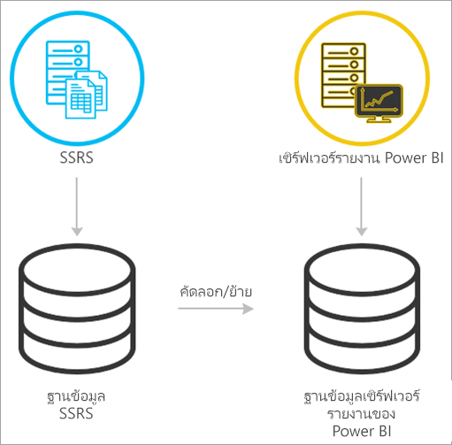
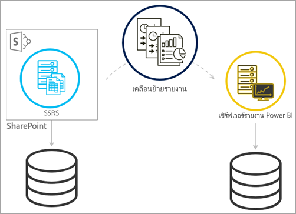
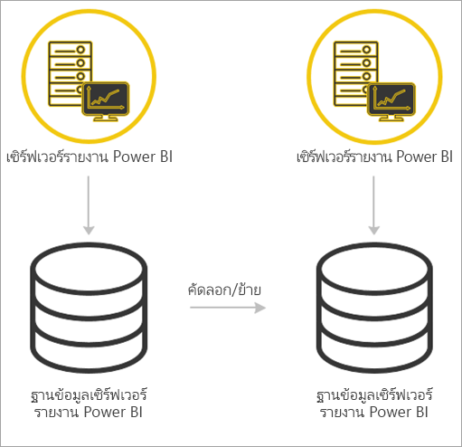

# <a name="migrate-a-report-server-installation"></a><span data-ttu-id="bd3ec-103">ย้ายการติดตั้งเซิร์ฟเวอร์รายงาน</span><span class="sxs-lookup"><span data-stu-id="bd3ec-103">Migrate a report server installation</span></span>

<span data-ttu-id="bd3ec-104">เรียนรู้วิธีการย้ายอินสแตนซ์ SQL Server Reporting Services (SSRS) ที่มีอยู่ของคุณไปยังอินสแตนซ์ของเซิร์ฟเวอร์รายงาน Power BI</span><span class="sxs-lookup"><span data-stu-id="bd3ec-104">Learn how to migrate your existing SQL Server Reporting Services (SSRS) instance to an instance of Power BI Report Server.</span></span>

<span data-ttu-id="bd3ec-105">การย้ายได้รับการกำหนดให้เป็นการย้ายไฟล์ข้อมูลของแอปพลิเคชันไปยังอินสแตนซ์เซิร์ฟเวอร์รายงาน Power BI ใหม่</span><span class="sxs-lookup"><span data-stu-id="bd3ec-105">Migration is defined as moving application data files to a new Power BI Report Server instance.</span></span> <span data-ttu-id="bd3ec-106">ต่อไปนี้เป็นเหตุผลทั่วไปที่คุณอาจต้องย้ายการติดตั้งของคุณ:</span><span class="sxs-lookup"><span data-stu-id="bd3ec-106">The following are common reasons why you might migrate your installation:</span></span>

* <span data-ttu-id="bd3ec-107">คุณต้องการย้ายจาก SQL Server Reporting Services ไปยังเซิร์ฟเวอร์รายงาน Power BI</span><span class="sxs-lookup"><span data-stu-id="bd3ec-107">You want to move from SQL Server Reporting Services to Power BI Report Server</span></span>
  
  > [!NOTE]
  > <span data-ttu-id="bd3ec-108">ไม่มีการอัปเกรด inplace จาก SQL Server Reporting Services ไปยังเซิร์ฟเวอร์รายงาน Power BI</span><span class="sxs-lookup"><span data-stu-id="bd3ec-108">There is not an inplace upgrade from SQL Server Reporting Services to Power BI Report Server.</span></span> <span data-ttu-id="bd3ec-109">จำเป็นต้องมีการย้าย</span><span class="sxs-lookup"><span data-stu-id="bd3ec-109">A migration is necessary.</span></span>

* <span data-ttu-id="bd3ec-110">คุณมีการใช้งานมาตราส่วนขนาดใหญ่ หรือข้อกำหนดการอัปเดต</span><span class="sxs-lookup"><span data-stu-id="bd3ec-110">You have a large-scale deployment or update requirements</span></span>
* <span data-ttu-id="bd3ec-111">คุณกำลังเปลี่ยนฮาร์ดแวร์หรือโทโพโลยีของการติดตั้งของคุณ</span><span class="sxs-lookup"><span data-stu-id="bd3ec-111">You're changing the hardware or topology of your installation</span></span>
* <span data-ttu-id="bd3ec-112">คุณพบปัญหาที่บล็อกการอัปเกรด</span><span class="sxs-lookup"><span data-stu-id="bd3ec-112">You encounter an issue that blocks upgrade</span></span>

## <a name="migrating-to-power-bi-report-server-from-ssrs-native-mode"></a><span data-ttu-id="bd3ec-113">ย้ายไปยังเซิร์ฟเวอร์รายงาน Power BI จาก SSRS (โหมดเนทิฟ)</span><span class="sxs-lookup"><span data-stu-id="bd3ec-113">Migrating to Power BI Report Server from SSRS (Native mode)</span></span>

<span data-ttu-id="bd3ec-114">ย้ายจากอินสแตนซ์ SSRS (โหมดเนทิฟ) ไปยังเซิร์ฟเวอร์รายงาน Power BI ที่ประกอบด้วยบางขั้นตอน</span><span class="sxs-lookup"><span data-stu-id="bd3ec-114">Migrating from an SSRS (Native mode) instance to Power BI Report Server consists of a few steps.</span></span>

<span data-ttu-id="bd3ec-115"></span><span class="sxs-lookup"><span data-stu-id="bd3ec-115"></span></span>

> [!NOTE]
> <span data-ttu-id="bd3ec-116">SQL Server 2008 Reporting Services และรุ่นที่ใหม่กว่าที่สนับสนุนการย้าย</span><span class="sxs-lookup"><span data-stu-id="bd3ec-116">SQL Server 2008 Reporting Services and later are supported for migration.</span></span>

* <span data-ttu-id="bd3ec-117">ฐานข้อมูลสำรอง แอปพลิเคชัน และไฟล์การกำหนดค่า</span><span class="sxs-lookup"><span data-stu-id="bd3ec-117">Backup database, application, and configuration files</span></span>
* <span data-ttu-id="bd3ec-118">สำรองข้อมูลคีย์การเข้ารหัสลับ</span><span class="sxs-lookup"><span data-stu-id="bd3ec-118">Back up the encryption key</span></span>
* <span data-ttu-id="bd3ec-119">โคลนฐานข้อมูลเซิร์ฟเวอร์รายงานของคุณที่โฮสต์รายงานของคุณ</span><span class="sxs-lookup"><span data-stu-id="bd3ec-119">Clone your report server database hosting your reports</span></span>
* <span data-ttu-id="bd3ec-120">ติดตั้งเซิร์ฟเวอร์รายงาน Power BI</span><span class="sxs-lookup"><span data-stu-id="bd3ec-120">Install Power BI Report Server.</span></span> <span data-ttu-id="bd3ec-121">ถ้าคุณกำลังใช้ฮาร์ดแวร์ที่เหมือนกัน คุณสามารถติดตั้งเซิร์ฟเวอร์รายงาน Power BI บนเซิร์ฟเวอร์เดียวกันกับอินสแตนซ์ SSRS</span><span class="sxs-lookup"><span data-stu-id="bd3ec-121">If you're using the same hardware, you can install Power BI Report Server on the same server as the SSRS instance.</span></span> <span data-ttu-id="bd3ec-122">สำหรับข้อมูลเพิ่มเติมเกี่ยวกับการติดตั้งเซิร์ฟเวอร์รายงาน Power BI ดูที่[ติดตั้งเซิร์ฟเวอร์รายงาน Power BI](install-report-server.md)</span><span class="sxs-lookup"><span data-stu-id="bd3ec-122">For more information on installing Power BI Report Server, see [Install Power BI Report Server](install-report-server.md).</span></span>

> [!NOTE]
> <span data-ttu-id="bd3ec-123">ชื่ออินสแตนซ์สำหรับเซิร์ฟเวอร์รายงาน Power BI จะเป็น*PBIRS*</span><span class="sxs-lookup"><span data-stu-id="bd3ec-123">The instance name for the Power BI Report Server will be *PBIRS*.</span></span>

* <span data-ttu-id="bd3ec-124">กำหนดค่าเซิร์ฟเวอร์รายงานโดยใช้ตัวจัดการการกำหนดค่าเซิร์ฟเวอร์รายงาน และเชื่อมต่อกับฐานข้อมูลที่ได้รับการโคลน</span><span class="sxs-lookup"><span data-stu-id="bd3ec-124">Configure the report server using Report Server Configuration Manager and connect to the cloned database.</span></span>
* <span data-ttu-id="bd3ec-125">ดำเนินการล้างข้อมูลที่จำเป็นสำหรับอินสแตนซ์ SSRS (โหมดเนทิฟ)</span><span class="sxs-lookup"><span data-stu-id="bd3ec-125">Perform any cleanup needed for the SSRS (Native mode) instance</span></span>

## <a name="migration-to-power-bi-report-server-from-ssrs-sharepoint-integrated-mode"></a><span data-ttu-id="bd3ec-126">การย้ายไปยังเซิร์ฟเวอร์รายงาน Power BI จาก SSRS (โหมดการรวม SharePoint)</span><span class="sxs-lookup"><span data-stu-id="bd3ec-126">Migration to Power BI Report Server from SSRS (SharePoint-integrated mode)</span></span>

<span data-ttu-id="bd3ec-127">การย้ายจากการ SSRS (โหมดการรวม SharePoint) ไปยังเซิร์ฟเวอร์รายงาน Power BI จะไม่ตรงไปตรงมาเหมือนโหมดเนทิฟ</span><span class="sxs-lookup"><span data-stu-id="bd3ec-127">Migrating from an SSRS (SharePoint-integrated mode) to Power BI Report Server is not as straight forward as native mode.</span></span> <span data-ttu-id="bd3ec-128">ขั้นตอนเหล่านี้ให้คำแนะนำบางส่วน คุณอาจมีไฟล์และสินทรัพย์อื่นๆภายใน SharePoint คุณที่จำเป็นต้องจัดการภายนอกขั้นตอนเหล่านี้</span><span class="sxs-lookup"><span data-stu-id="bd3ec-128">While these steps provide some guidance, you may have other files and assets within SharePoint that you need to manage outside of these steps.</span></span>

<span data-ttu-id="bd3ec-129"></span><span class="sxs-lookup"><span data-stu-id="bd3ec-129"></span></span>

<span data-ttu-id="bd3ec-130">คุณจะต้องย้ายเนื้อหาเซิร์ฟเวอร์รายงานเฉพาะจาก SharePoint ไปยังเซิร์ฟเวอร์ของคุณรายงาน Power BI</span><span class="sxs-lookup"><span data-stu-id="bd3ec-130">You need to migrate the specific report server content from SharePoint to your Power BI Report Server.</span></span> <span data-ttu-id="bd3ec-131">คุณต้องติดตั้งเซิร์ฟเวอร์รายงาน Power BI ไว้บางที่ในสภาพแวดล้อมของคุณให้เรียบร้อย</span><span class="sxs-lookup"><span data-stu-id="bd3ec-131">You need to have already installed Power BI Report Server somewhere in your environment.</span></span> <span data-ttu-id="bd3ec-132">สำหรับข้อมูลเพิ่มเติมเกี่ยวกับการติดตั้งเซิร์ฟเวอร์รายงาน Power BI ดูที่[ติดตั้งเซิร์ฟเวอร์รายงาน Power BI](install-report-server.md)</span><span class="sxs-lookup"><span data-stu-id="bd3ec-132">For more information on installing Power BI Report Server, see [Install Power BI Report Server](install-report-server.md).</span></span>

<span data-ttu-id="bd3ec-133">ถ้าคุณต้องการคัดลอกเนื้อหาของเซิร์ฟเวอร์รายงานจากสภาพแวดล้อมของ SharePoint ของคุณไปยังเซิร์ฟเวอร์รายงาน Power BI คุณจะต้องใช้เครื่องมือ เช่น**rs.exe**เพื่อคัดลอกเนื้อหา</span><span class="sxs-lookup"><span data-stu-id="bd3ec-133">If you want to copy the report server content from your SharePoint environment to Power BI Report Server, you need to use tools such as **rs.exe** to copy the content.</span></span> <span data-ttu-id="bd3ec-134">ด้านล่างนี้คือตัวอย่างของสิ่งที่สคริปต์จะคัดลอกเนื้อหาของเซิร์ฟเวอร์รายงานจาก SharePoint ไปยัง เซิร์ฟเวอร์รายงาน Power BI</span><span class="sxs-lookup"><span data-stu-id="bd3ec-134">Below is a sample of what the script would be to copy report server content from SharePoint to Power BI Report Server.</span></span>

> [!NOTE]
> <span data-ttu-id="bd3ec-135">สคริปต์ตัวอย่างควรทำงานร่วมกับ SharePoint 2010 และรุ่นที่ใหม่กว่าและ SQL Server 2008 Reporting Services และรุ่นที่ใหม่กว่า</span><span class="sxs-lookup"><span data-stu-id="bd3ec-135">The sample script should work against SharePoint 2010 and later and SQL Server 2008 Reporting Services and later.</span></span>

### <a name="sample-script"></a><span data-ttu-id="bd3ec-136">สคริปต์ตัวอย่าง</span><span class="sxs-lookup"><span data-stu-id="bd3ec-136">Sample script</span></span>

```
Sample Script
rs.exe
-i ssrs_migration.rss -e Mgmt2010
-s https://SourceServer/_vti_bin/reportserver
-v st="sites/bi" -v f="Shared Documents“
-u Domain\User1 -p Password
-v ts=https://TargetServer/reportserver
-v tu="Domain\User" -v tp="Password"
```

## <a name="migrating-from-one-power-bi-report-server-to-another"></a><span data-ttu-id="bd3ec-137">ย้ายจากเซิร์ฟเวอร์รายงาน Power BI ไปยังที่อื่น</span><span class="sxs-lookup"><span data-stu-id="bd3ec-137">Migrating from one Power BI Report Server to another</span></span>

<span data-ttu-id="bd3ec-138">ย้ายจากเซิร์ฟเวอร์รายงาน Power BI เป็นกระบวนการเดียวกันกับการย้ายจาก SSRS (โหมดเนทิฟ)</span><span class="sxs-lookup"><span data-stu-id="bd3ec-138">Migrating from one Power BI Report Server is the same process as migrating from SSRS (Native-mode).</span></span>

<span data-ttu-id="bd3ec-139"></span><span class="sxs-lookup"><span data-stu-id="bd3ec-139"></span></span>

* <span data-ttu-id="bd3ec-140">ฐานข้อมูลสำรอง แอปพลิเคชัน และไฟล์การกำหนดค่า</span><span class="sxs-lookup"><span data-stu-id="bd3ec-140">Backup database, application, and configuration files</span></span>
* <span data-ttu-id="bd3ec-141">สำรองข้อมูลคีย์การเข้ารหัสลับ</span><span class="sxs-lookup"><span data-stu-id="bd3ec-141">Back up the encryption key</span></span>
* <span data-ttu-id="bd3ec-142">โคลนฐานข้อมูลเซิร์ฟเวอร์รายงานของคุณที่โฮสต์รายงานของคุณ</span><span class="sxs-lookup"><span data-stu-id="bd3ec-142">Clone your report server database hosting your reports</span></span>
* <span data-ttu-id="bd3ec-143">ติดตั้งเซิร์ฟเวอร์รายงาน Power BI</span><span class="sxs-lookup"><span data-stu-id="bd3ec-143">Install Power BI Report Server.</span></span> <span data-ttu-id="bd3ec-144">คุณ *ไม่สามารถ* ติดตั้งเซิร์ฟเวอร์รายงาน Power BI บนเซิร์ฟเวอร์เดียวกันกับเซิร์ฟเวอร์ที่คุณกำลังย้ายจาก</span><span class="sxs-lookup"><span data-stu-id="bd3ec-144">You *can't* install Power BI Report Server on the same server as the one you're migrating from.</span></span> <span data-ttu-id="bd3ec-145">สำหรับข้อมูลเพิ่มเติมเกี่ยวกับการติดตั้งเซิร์ฟเวอร์รายงาน Power BI ดูที่[ติดตั้งเซิร์ฟเวอร์รายงาน Power BI](install-report-server.md)</span><span class="sxs-lookup"><span data-stu-id="bd3ec-145">For more information on installing Power BI Report Server, see [Install Power BI Report Server](install-report-server.md).</span></span>

> [!NOTE]
> <span data-ttu-id="bd3ec-146">ชื่ออินสแตนซ์สำหรับเซิร์ฟเวอร์รายงาน Power BI จะเป็น*PBIRS*</span><span class="sxs-lookup"><span data-stu-id="bd3ec-146">The instance name for the Power BI Report Server will be *PBIRS*.</span></span>

* <span data-ttu-id="bd3ec-147">กำหนดค่าเซิร์ฟเวอร์รายงานโดยใช้ตัวจัดการการกำหนดค่าเซิร์ฟเวอร์รายงาน และเชื่อมต่อกับฐานข้อมูลที่ได้รับการโคลน</span><span class="sxs-lookup"><span data-stu-id="bd3ec-147">Configure the report server using Report Server Configuration Manager and connect to the cloned database.</span></span>
* <span data-ttu-id="bd3ec-148">ดำเนินการล้างข้อมูลต่างๆที่จำเป็นสำหรับการติดตั้งเซิร์ฟเวอรรายงาน์ Power BI แบบเดิม</span><span class="sxs-lookup"><span data-stu-id="bd3ec-148">Perform any cleanup needed for the old Power BI Report Server installation.</span></span>

## <a name="next-steps"></a><span data-ttu-id="bd3ec-149">ขั้นตอนถัดไป</span><span class="sxs-lookup"><span data-stu-id="bd3ec-149">Next steps</span></span>

[<span data-ttu-id="bd3ec-150">ภาพรวมของผู้ดูแลระบบ</span><span class="sxs-lookup"><span data-stu-id="bd3ec-150">Administrator overview</span></span>](admin-handbook-overview.md)  
[<span data-ttu-id="bd3ec-151">ติดตั้ง Power BI Report Server</span><span class="sxs-lookup"><span data-stu-id="bd3ec-151">Install Power BI Report Server</span></span>](install-report-server.md)  
[<span data-ttu-id="bd3ec-152">สคริปต์กับ rs.exe Utility และ Web Service</span><span class="sxs-lookup"><span data-stu-id="bd3ec-152">Script with the rs.exe Utility and the Web Service</span></span>](/sql/reporting-services/tools/script-with-the-rs-exe-utility-and-the-web-service)

<span data-ttu-id="bd3ec-153">มีคำถามเพิ่มเติมหรือไม่</span><span class="sxs-lookup"><span data-stu-id="bd3ec-153">More questions?</span></span> [<span data-ttu-id="bd3ec-154">ลองถามชุมชน Power BI</span><span class="sxs-lookup"><span data-stu-id="bd3ec-154">Try asking the Power BI Community</span></span>](https://community.powerbi.com/)