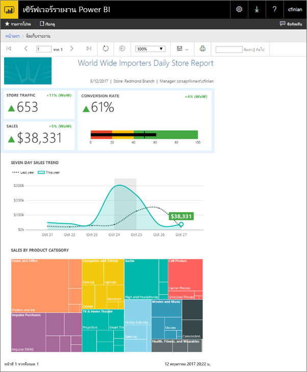
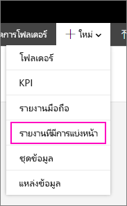
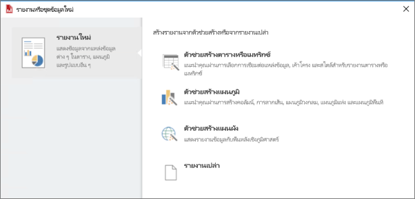
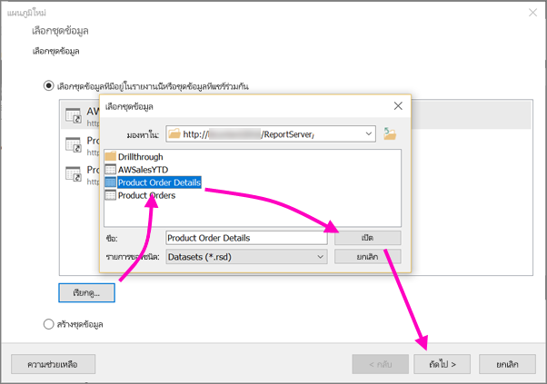
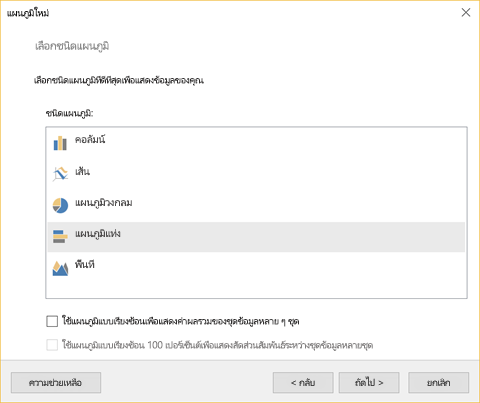
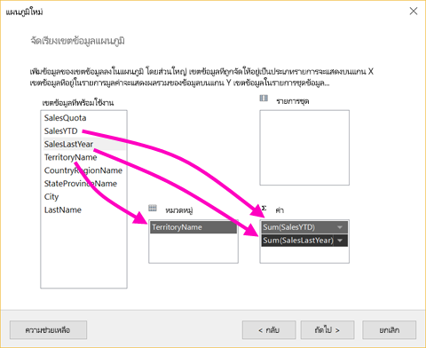
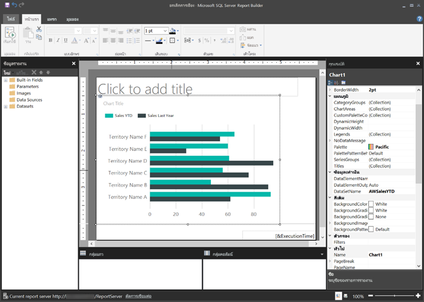
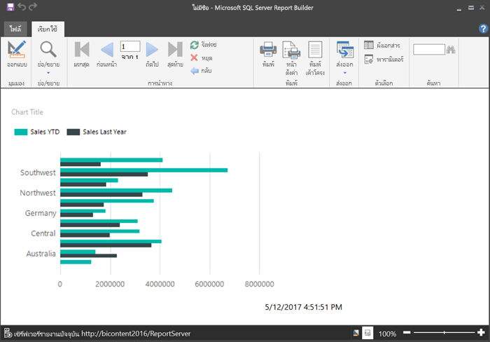
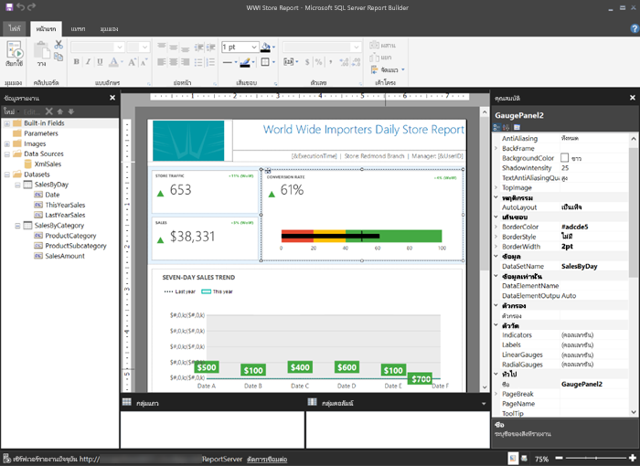

# สร้างรายงานแบบแบ่งหน้าสำหรับเซิร์ฟเวอร์รายงาน Power BICreate a paginated report for Power BI Report Server
ในบทความนี้ คุณสามารถสร้างรายงานแบบแบ่งหน้าสำหรับเซิร์ฟเวอร์รายงาน Power BI ในขั้นตอนง่าย ๆ ไม่กี่ขั้นตอนIn this article, you create a paginated report for Power BI Report Server in a few simple steps.

กำลังมองหาความช่วยเหลือเกี่ยวกับการสร้างรายงานแบบแบ่งหน้าในตัวสร้างรายงานสำหรับบริการของ Power BI หรือไม่Looking for help with creating paginated reports in Report Builder for the Power BI service? ดู [ตัวสร้างรายงานใน Power BI](../paginated-reports/report-builder-power-bi.md) แทนSee [Power BI Report Builder](../paginated-reports/report-builder-power-bi.md) instead.

ตามชื่อแนะนำ รายงานแบบแบ่งหน้าสามารถเรียกใช้งานกับหน้ามากมายAs the name suggests, paginated reports can run to many pages. พวกเขากำลังวางเค้าโครงในรูปแบบคงที่ และเสนอการกำหนดค่าอย่างแม่นยำThey're laid out in a fixed format and offer precise customization. รายงานแบบแบ่งหน้าคือ ไฟล์ .rdlPaginated reports are .rdl files.

คุณสามารถจัดเก็บและจัดการกับรายงานแบบแบ่งหน้าในเว็บพอร์ทัลเซิร์ฟเวอร์รายงาน Power BI เหมือนกับที่คุณสามารถทำได้ในเว็บพอร์ทัล SQL Server Reporting Services (SSRS)You can store and manage paginated reports in the Power BI Report Server web portal, just as you can in the SQL Server Reporting Services (SSRS) web portal. คุณสามารถสร้าง และแก้ไขไฟล์ใน “ตัวสร้างรายงาน” หรือ “ตัวออกแบบรายงาน” ในเครื่องมือข้อมูลเซิร์ฟเวอร์ SQL (SSDT), แล้วเผยแพร่ไปยังเว็บพอร์ทัลYou create and edit them in Report Builder or Report Designer in SQL Server Data Tools (SSDT), then publish them to either web portal. จากนั้น ผู้อ่านรายงานในองค์กรของคุณสามารถดูข้อมูลได้ ในเบราว์เซอร์ หรือ ในแอป Power BI บนมือถือในอุปกรณ์เคลื่อนที่ของพวกเขาThen report readers in your organization can view them in a browser or in a Power BI mobile app on their mobile device.

ถ้าคุณเคยสร้างรายงานแบบแบ่งหน้าใน “ตัวสร้างรายงาน” หรือ “ตัวออกแบบรายงาน” ดังนั้นคุณก็พร้อมที่จะสร้างรายงานแบบแบ่งหน้าสำหรับเซิร์ฟเวอร์รายงาน Power BIIf you've already created paginated reports in Report Builder or Report Designer, then you're ready to create paginated reports for Power BI Report Server. ถ้าไม่เคย นี่คือขั้นตอนด่วนที่จะช่วยคุณเริ่มต้นใช้งานIf not, here are some quick steps to get you started.

## ขั้นตอนที่ 1: เริ่มต้นใช้งานตัวสร้างรายงานStep 1: Start Report Builder
คุณอาจมีการติดตั้งตัวสร้างรายงานเพื่อสร้างรายงานสำหรับเซิร์ฟเวอร์ SSRS แล้วYou may already have installed Report Builder to create reports for an SSRS server. คุณสามารถใช้รุ่นเดียวกัน หรือใช้ตัวสร้างรายงานเพื่อสร้างรายงานสำหรับเซิร์ฟเวอร์รายงาน Power BIYou can use the same version or Report Builder to create reports for Power BI Report Server. ถ้าคุณยังไม่ได้ทำการติดตั้ง คุณสามารถติดตั้งได้ง่ายๆIf you haven't installed it, the process is easy.

1. ในเว็บพอร์ทัลเซิร์ฟเวอร์ Power BI เลือก **สร้างรายงาน** > **แบบแบ่งหน้าใหม่**In the Power BI Report Server web portal, select **New** > **Paginated Report**.
   
    
   
    ถ้าคุณยังไม่ได้ติดตั้ง “ตัวสร้างรายงาน” คุณจะถูกนำเข้าสู่กระบวนการติดตั้งตอนนี้If you don't have Report Builder installed already, it leads you through the installation process now.
2. หลังจากติดตั้งแล้ว “ตัวสร้างรายงาน” จะเปิดขึ้นใน **หน้าจอชุดข้อมูลหรือ** รายงานใหม่After it's installed, Report Builder opens to the **New Report or Dataset** screen.
   
    
3. เลือกตัวช่วยสร้างสำหรับชนิดของรายงานที่คุณต้องการสร้าง:Select the wizard for the kind of report you want to create:
   
   * ตารางหรือเมทริกซ์Table or matrix
   * แผนภูมิChart
   * แผนที่Map
   * ว่างBlank
4. มาเริ่มต้นด้วยตัวช่วยสร้างแผนภูมิLet's start with the Chart wizard.
   
    ตัวช่วยสร้างแผนภูมิจะช่วยแนะนำขั้นตอนการสร้างแผนภูมิพื้นฐานในรายงานให้กับคุณThe Chart wizard walks you the steps of creating a basic chart in a report. จากที่นั่น คุณสามารถปรับแต่งรายงานของคุณได้เกือบทุกวิธีแบบไม่จำกัดFrom there, you can customize your report in almost unlimited ways.

## ขั้นตอนที่ 2: ไปที่ตัวช่วยสร้างแผนภูมิStep 2: Go through the Chart wizard
ตัวช่วยสร้างแผนภูมิจะช่วยแนะนำขั้นตอนพื้นฐานของการสร้างการแสดงภาพในรายงานThe Chart wizard walks you through the basic steps of creating a visualization in a report.

รายงานแบบแบ่งหน้าสามารถเชื่อมต่อกับแหล่งข้อมูลที่หลากหลาย จากเซิร์ฟเวอร์ Microsoft SQL และ ฐานข้อมูล Microsoft Azure SQL ไปยัง Oracle, Hyperion และอื่นๆ อีกมากมายPaginated reports can connect to a wide variety of data sources, from Microsoft SQL Server and Microsoft Azure SQL Database to Oracle, Hyperion, and many more. อ่านเกี่ยวกับ [แหล่งข้อมูลที่ได้รับการสนับสนุนโดยรายงานแบบแบ่งหน้า](connect-data-sources.md)Read about [data sources supported by paginated reports](connect-data-sources.md).

ในหน้าแรกของช่วยสร้างแผนภูมิ **เลือกชุดข้อมูล** คุณสามารถสร้างชุดข้อมูลหรือเลือกชุดข้อมูลที่ใช้ร่วมกันบนเซิร์ฟเวอร์ได้In the first page in the Chart wizard, **Choose a dataset**, you can create a dataset or choose a shared dataset on a server. *ชุดข้อมูล* ส่งกลับข้อมูลรายงานจากแบบสอบถามบนแหล่งข้อมูลภายนอก*Datasets* return report data from a query on an external data source.

1. เลือก **เรียกดู** > เลือกชุดข้อมูลที่ใช้ร่วมกันบนเซิร์ฟเวอร์ > **เปิด** > **ถัดไป**Select **Browse** > select a shared dataset on a server > **Open** > **Next**.
   
    
   
     ต้องการสร้างชุดข้อมูลหรือไม่Need to create a dataset? ดูที่[สร้างชุดข้อมูลที่ใช้ร่วมกันหรือชุดข้อมูลที่ฝัง](/sql/reporting-services/report-data/create-a-shared-dataset-or-embedded-dataset-report-builder-and-ssrs)See [Create a shared or embedded dataset](/sql/reporting-services/report-data/create-a-shared-dataset-or-embedded-dataset-report-builder-and-ssrs).
2. เลือกชนิดแผนภูมิ - ในกรณีนี้ แผนภูมิแท่งChoose a chart type -- in this case, a bar chart.
   
    
3. จัดเรียงเขตข้อมูลโดยการลากไปยัง **ประเภท**, **ชุด** และ **กล่อง** ค่าArrange the fields by dragging them to the **Categories**, **Series**, and **Values** boxes.
   
    
4. เลือก **ถัดไป** > **เสร็จสิ้น**Select **Next** > **Finish**.

## ขั้นตอนที่ 3: ออกแบบรายงานของคุณStep 3: Design your report
ในตอนนี้คุณอยู่ในมุมมองการออกแบบรายงานNow you're in Report Design view. จะสังเกตเห็นว่าข้อมูลเป็นข้อมูลตัวอย่างที่จะแสดงผล ไม่ใช่ข้อมูลของคุณNotice the data is placeholder data, not your data.

* เมื่อต้องการดูข้อมูลของคุณ เลือก **เรียกใช้**To view your data, select **Run**.
  
     
* เมื่อต้องการย้อนกลับไปยังมุมมองการออกแบบ เลือก **ออกแบบ**To go back to Design view, select **Design**.

คุณสามารถปรับเปลี่ยนแผนภูมิคุณเพิ่งสร้าง เปลี่ยนเค้าโครง ค่า คำอธิบายแผนภูมิ...หรือปรับเปรี่ยนอะไรก็ได้You can modify the chart you just created, changing the layout, values, legend... really just about anything.

และคุณสามารถเพิ่มการเรียงลำดับทั้งหมดของการแสดงภาพต่างๆ เช่น ตัววัด ตาราง เมทริกซ์ ตาราง แผนที่ และอื่นๆAnd you can add all sorts of other visualizations: gauges, tables, matrixes, tables, maps, and more. คุณสามารถเพิ่มหัวกระดาษและท้ายกระดาษสำหรับหลายหน้าYou can add headers and footers for multiple pages. ดู[บทช่วยสอนตัวสร้างรายงาน](/sql/reporting-services/report-builder-tutorials)เพื่อลองด้วยตัวคุณเองSee the [Report Builder tutorials](/sql/reporting-services/report-builder-tutorials) to try them for yourself.

## ขั้นตอนที่ 4: บันทึกรายงานของคุณไปยังเซิร์ฟเวอร์รายงานStep 4: Save your report to the report server
เมื่อรายงานของคุณพร้อมแล้ว บันทึกไปยังเซิร์ฟเวอร์รายงาน Power BIWhen your report is ready, save it to Power BI Report Server.

1. ไปที่ **เมนู** ไฟล์ เลือก **บันทึกเป็น** และบันทึกไปยังเซิร์ฟเวอร์รายงานOn the **File** menu, select **Save as**, and save it to the report server. 
2. ในตอนนี้คุณสามารถดูรายงานได้ในเบราว์เซอร์Now you can view it in the browser.
   
    

## ขั้นตอนถัดไปNext steps
มีทรัพยากรที่ยอดเยี่ยมมากมายสำหรับการออกแบบรายงานใน “ตัวสร้างรายงาน” และใน “ตัวออกแบบรายงาน” ในเครื่องมือข้อมูลเซิร์ฟเวอร์ SQLThere are many great resources for designing reports in Report Builder and in Report Designer in SQL Server Data Tools. บทช่วยสอนตัวสร้างรายงานเหมาะสำหรับการเริ่มต้นThe Report Builder tutorials are a good place to start.

* [บทช่วยสอนตัวสร้างรายงานReport Builder tutorials](/sql/reporting-services/report-builder-tutorials)
* [เซิร์ฟเวอร์รายงาน Power BI คืออะไรWhat is Power BI Report Server?](get-started.md)  

มีคำถามเพิ่มเติมหรือไม่More questions? [ลองถามชุมชน Power BITry asking the Power BI Community](https://community.powerbi.com/)