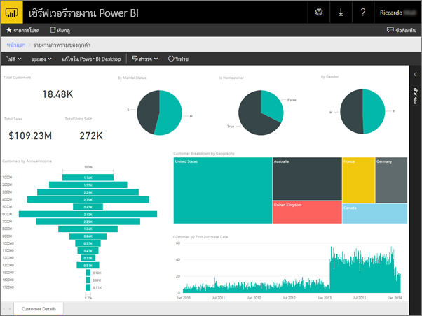
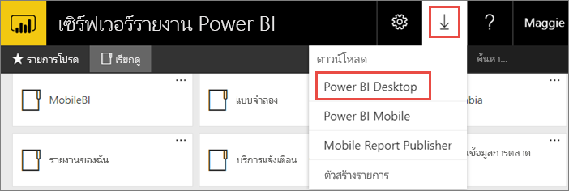
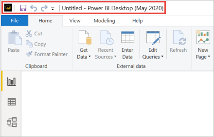
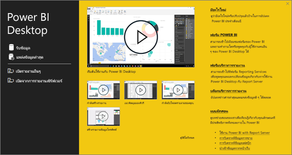
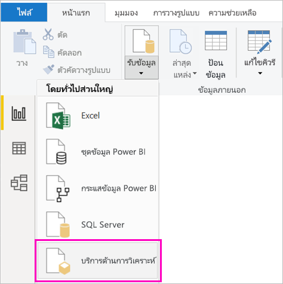
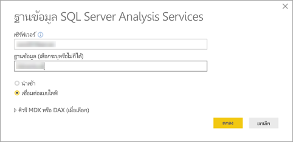
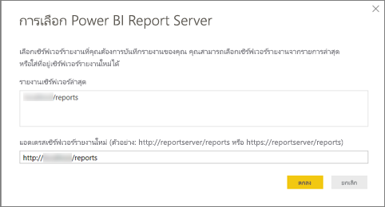
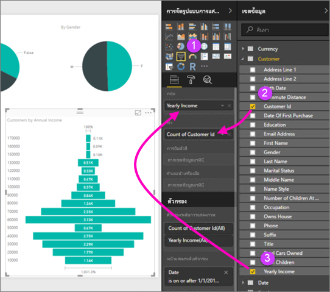
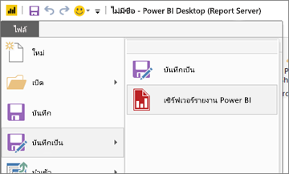

# สร้างรายงาน Power BI สำหรับเซิร์ฟเวอร์รายงาน Power BICreate a Power BI report for Power BI Report Server
คุณสามารถจัดเก็บ และจัดการรายงาน Power BI ภายในองค์กร ในพอร์ทัลของเว็บเซิร์ฟเวอร์รายงาน Power BI เช่นเดียวกับที่คุณสามารถจัดเก็บรายงาน Power BI ในระบบคลาวด์ในบริการของ Power BI (https://powerbi.com) ได้You can store and manage Power BI reports on premises in the Power BI Report Server web portal, just as you can store Power BI reports in the cloud in the Power BI service (https://powerbi.com). คุณสร้างและแก้ไขรายงานใน Power BI Desktop แล้วเผยแพร่ไปยังพอร์ทัลของเว็บYou create and edit reports in Power BI Desktop, and publish them to the web portal. จากนั้น ผู้อ่านรายงานในองค์กรของคุณ สามารถดูรายงานได้ในเบราว์เซอร์ หรือในแอปมือถือ Power BI บนอุปกรณ์เคลื่อนที่ของพวกเขาThen report readers in your organization can view them in a browser or in a Power BI mobile app on a mobile device.

ต่อไปนี้เป็นสี่ขั้นตอนด่วน ที่ช่วยให้คุณเริ่มต้นHere are four quick steps to get you started.

## ขั้นตอนที่ 1: ติดตั้ง Power BI Desktop ที่ปรับให้เหมาะสำหรับเซิร์ฟเวอร์รายงาน Power BIStep 1: Install Power BI Desktop optimized for Power BI Report Server

ถ้าคุณเคยสร้างรายงาน Power BI ใน Power BI Desktop แล้ว คุณเกือบพร้อมที่จะสร้างรายงาน Power BI สำหรับเซิร์ฟเวอร์รายงาน Power BIIf you've already created Power BI reports in Power BI Desktop, then you're almost ready to create Power BI reports for Power BI Report Server. เราขอแนะนำให้ติดตั้งเวอร์ชันของ Power BI Desktop ที่ปรับให้เหมาะสำหรับเซิร์ฟเวอร์รายงาน Power BI เพื่อให้คุณมั่นใจว่าเซิร์ฟเวอร์ และแอปจะซิงค์กันอยู่เสมอ คุณสามารถมี Power BI Desktop ทั้งสองเวอร์ชันบนคอมพิวเตอร์เครื่องเดียวกันWe recommend installing the version of Power BI Desktop optimized for Power BI Report Server so you know the server and the app are always in sync. You can have both versions of Power BI Desktop on the same computer.

1. ในพอร์ทัลของเว็บเซิร์ฟเวอร์รายงาน เลือกลูกศร **ดาวน์โหลด** > **Power BI Desktop**In the report server web portal, select the **Download** arrow > **Power BI Desktop**.

    

    หรือไปที่หน้าหลัก [เซิร์ฟเวอร์รายงาน Power BI](https://powerbi.microsoft.com/report-server/) แล้วเลือก **ตัวเลือกการดาวน์โหลดขั้นสูง**Or go to the [Power BI Report Server](https://powerbi.microsoft.com/report-server/) home page and select **Advanced download options**.

2. ในหน้าศูนย์ดาวน์โหลด เลือก **ดาวน์โหลด**In the Download Center page, select **Download**.

3. ขึ้นอยู่กับคอมพิวเตอร์ของคุณ เลือก:Depending on your computer, select:

    - **PBIDesktopRS.msi** (เวอร์ชัน 32 บิต) หรือ**PBIDesktopRS.msi** (the 32-bit version) or

    - **PBIDesktopRS_x64.msi** (เวอร์ชัน 64 บิต)**PBIDesktopRS_x64.msi** (the 64-bit version).

4. หลังจากที่คุณดาวน์โหลดตัวติดตั้งแล้ว เรียกใช้ตัวช่วยสร้างการติดตั้ง Power BI DesktopAfter you download the installer, run the Power BI Desktop Setup Wizard.

2. ในตอนท้ายของการติดตั้ง ทำเครื่องหมายที่ **เริ่มต้น Power BI Desktop ทันที**At the end of the installation, check **Start Power BI Desktop now**.
   
    จะเริ่มต้นโดยอัตโนมัติ และคุณก็พร้อมที่จะไปต่อIt starts automatically and you're ready to go. คุณสามารถแจ้งว่าคุณมีเวอร์ชันที่ถูกต้องเนื่องจาก **Power BI Desktop (ตุลาคม 2020)** อยู่ในแถบชื่อYou can tell you have the right version because **Power BI Desktop (October 2020)** is in the title bar.

    

3. ถ้าคุณไม่คุ้นเคยกับ Power BI Desktop ลองดูวิดีโอบนหน้าจอยินดีต้อนรับIf you're not familiar with Power BI Desktop, consider watching the videos on the welcome screen.
   
    

## ขั้นตอนที่ 2: เลือกแหล่งข้อมูลStep 2: Select a data source
คุณสามารถเชื่อมต่อกับแหล่งข้อมูลที่หลากหลายYou can connect to a variety of data sources. อ่านเพิ่มเติมเกี่ยวกับ[การเชื่อมต่อกับแหล่งข้อมูล](connect-data-sources.md)Read more about [connecting to data sources](connect-data-sources.md).

1. จากหน้าจอยินดีต้อนรับ เลือก **รับข้อมูล**From the welcome screen, select **Get Data**.
   
    หรือบนการแท็บ **หน้าแรก** เลือก **รับข้อมูล**Or on the **Home** tab, select **Get Data**.
2. เลือกแหล่งข้อมูลของคุณ - ในตัวอย่างนี้เป็น **Analysis Services**Select your data source -- in this example, **Analysis Services**.
   
    
3. กรอกค่า **เซิร์ฟเวอร์** และใส่ **ฐานข้อมูล** ถ้าจำเป็นFill in **Server**, and optionally, **Database**. ตรวจสอบให้แน่ใจว่าตัวเลือก **เชื่อมต่อแบบไลฟ์** ถูกเลือก > **ตกลง**Make sure **Connect live** is selected > **OK**.
   
    
4. เลือกเซิร์ฟเวอร์รายงานที่คุณจะบันทึกรายงานของคุณChoose the report server where you'll save your reports.
   
    

## ขั้นตอนที่ 3: ออกแบบรายงานของคุณStep 3: Design your report
เรื่องสนุกๆ อยู่ในส่วนนี้: คุณจะสร้างวิชวลที่แสดงข้อมูลของคุณHere's the fun part: You get to create visuals that illustrate your data.

ตัวอย่างเช่น คุณสามารถสร้างแผนภูมิกรวยของลูกค้าและจัดกลุ่มตามรายได้รายปีFor example, you could create a funnel chart of customers and group values by yearly income.

1. ใน **การจัดรูปแบบการแสดงข้อมูล** เลือก **แผนภูมิกรวย**In **Visualizations**, select **Funnel chart**.
2. ลากเขตข้อมูลที่จะนับลงใน **ค่า**Drag the field to be counted to the **Values** well. ถ้าเขตข้อมูลไม่ใช่ตัวเลข Power BI Desktop จะทำการ *นับจำนวน* ค่าให้โดยอัตโนมัติIf it's not a numeric field, Power BI Desktop automatically makes it a *Count of* the value.
3. ลากเขตข้อมูลที่จะจัดกลุ่มลงใน **กลุ่ม**Drag the field to group on to the **Group** well.

อ่านเพิ่มเติมเกี่ยวกับ[การออกแบบรายงาน Power BI](../create-reports/desktop-report-view.md)Read much more about [designing a Power BI report](../create-reports/desktop-report-view.md).

## ขั้นตอนที่ 4: บันทึกรายงานของคุณไปยังเซิร์ฟเวอร์รายงานStep 4: Save your report to the report server
เมื่อรายงานของคุณพร้อมแล้ว คุณบันทึกไปยังเซิร์ฟเวอร์รายงาน Power BI ที่คุณเลือกในขั้นตอนที่ 2When your report is ready, you save it to the Power BI Report Server you chose in Step 2.

1. บนเมนู **แฟ้ม** เลือก **บันทึกเป็น** > **เซิร์ฟเวอร์รายงาน Power BI**On the **File** menu, select **Save as** > **Power BI Report Server**.
   
    
2. ตอนนี้ คุณสามารถดูรายงานได้ในพอร์ทัลของเว็บNow you can view it in the web portal.
   
    
    
> [!NOTE]
> หากคุณเลือกที่จะแก้ไขรายงานในอนาคต ข้อมูลรายงานที่คุณเห็นในเดสก์ท็อปจะเป็นข้อมูลที่แคชเสมอเมื่อสร้างรายงานครั้งแรกIf you choose to edit the report in the future, the report data you see in the desktop will always be the cached data from when the report was initially created.  หากต้องการดูข้อมูลล่าสุดเมื่อแก้ไขรายงาน คุณต้องรีเฟรชข้อมูลในแอปพลิเคชัน Power BI Desktop ของคุณTo view the latest data when editing the report, you must refresh the data in your Power BI Desktop application.

## ขั้นตอนถัดไปNext steps
### Power BI DesktopPower BI Desktop
มีทรัพยากรที่ยอดเยี่ยมมากมายสำหรับการสร้างรายงานใน Power BI DesktopThere are so many great resources for creating reports in Power BI Desktop. ลิงก์นี้เป็นจุดเริ่มต้นที่ดีThis link is a good starting point.

* [เริ่มต้นใช้งาน Power BI DesktopGet started with Power BI Desktop](../fundamentals/desktop-getting-started.md)
* การเรียนรู้ตามคำแนะนำ: [สำรวจ Power BI Desktop](/learn/modules/get-data-power-bi/2-getting-started-power-bi-desktop)Guided learning: [Explore Power BI Desktop](/learn/modules/get-data-power-bi/2-getting-started-power-bi-desktop)

### เซิร์ฟเวอร์รายงาน Power BIPower BI Report Server
* [ติดตั้ง Power BI Desktop ที่ปรับให้เหมาะสำหรับ Power BI Report ServerInstall Power BI Desktop optimized for Power BI Report Server](install-powerbi-desktop.md)  
* [เซิร์ฟเวอร์รายงาน Power BI คืออะไรWhat is Power BI Report Server?](get-started.md)  

มีคำถามเพิ่มเติมหรือไม่More questions? [ลองถามชุมชน Power BITry asking the Power BI Community](https://community.powerbi.com/)
