# <a name="embed-a-power-bi-report-server-report-using-an-iframe-in-sharepoint-server"></a><span data-ttu-id="7ac8a-103">ฝังรายงานเซิร์ฟเวอร์รายงาน Power BI โดยใช้ iFrame ใน SharePoint Server</span><span class="sxs-lookup"><span data-stu-id="7ac8a-103">Embed a Power BI Report Server report using an iFrame in SharePoint Server</span></span>

<span data-ttu-id="7ac8a-104">ในบทความนี้ คุณจะได้เรียนรู้วิธีการฝังรายงานเซิร์ฟเวอร์รายงาน Power BI โดยใช้ iFrame ในหน้า SharePoint</span><span class="sxs-lookup"><span data-stu-id="7ac8a-104">In this article, you learn how to embed a Power BI Report Server report by using an iFrame in a SharePoint page.</span></span> <span data-ttu-id="7ac8a-105">ถ้าคุณกำลังทำงานกับ SharePoint Online เซิร์ฟเวอร์รายงาน Power BI ต้องสามารถเข้าถึงแบบสาธารณะได้</span><span class="sxs-lookup"><span data-stu-id="7ac8a-105">If you're working with SharePoint Online, Power BI Report Server must be publicly accessible.</span></span> <span data-ttu-id="7ac8a-106">ใน SharePoint Online, Power BI Web Part ที่ทำงานกับบริการของ Power BI ไม่ทำงานกับเซิร์ฟเวอร์รายงาน Power BI</span><span class="sxs-lookup"><span data-stu-id="7ac8a-106">In SharePoint Online, the Power BI Web part that works with the Power BI service won't work with Power BI Report Server.</span></span>  

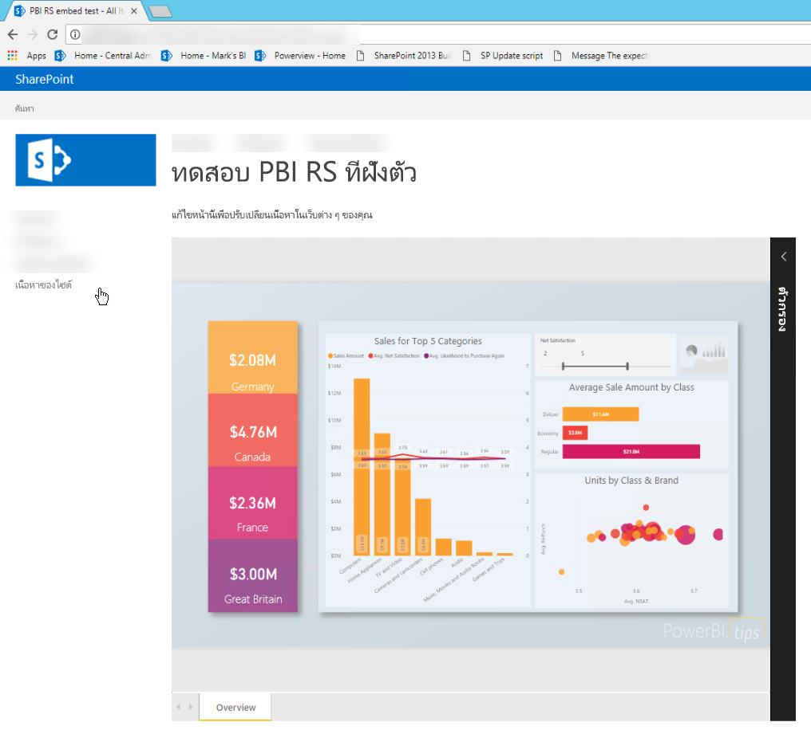

## <a name="prerequisites"></a><span data-ttu-id="7ac8a-108">ข้อกำหนดเบื้องต้น</span><span class="sxs-lookup"><span data-stu-id="7ac8a-108">Prerequisites</span></span>
* <span data-ttu-id="7ac8a-109">ติดตั้งและกำหนดค่า [เซิร์ฟเวอร์รายงาน Power BI](https://powerbi.microsoft.com/report-server/) แล้ว</span><span class="sxs-lookup"><span data-stu-id="7ac8a-109">[Power BI Report Server](https://powerbi.microsoft.com/report-server/) installed and configured.</span></span>
* <span data-ttu-id="7ac8a-110">ติดตั้ง [Power BI Desktop ที่ปรับให้เหมาะสำหรับเซิร์ฟเวอร์รายงาน Power BI](install-powerbi-desktop.md) แล้ว</span><span class="sxs-lookup"><span data-stu-id="7ac8a-110">[Power BI Desktop optimized for Power BI Report Server](install-powerbi-desktop.md) installed.</span></span>
* <span data-ttu-id="7ac8a-111">ติดตั้งและกำหนดค่า [สภาพแวดล้อม SharePoint 2013 2016 หรือ 2019](/sharepoint/install/install) แล้ว</span><span class="sxs-lookup"><span data-stu-id="7ac8a-111">A [SharePoint 2013, 2016, or 2019 environment](/sharepoint/install/install) installed and configured.</span></span>
* <span data-ttu-id="7ac8a-112">สามารถรองรับ Internet Explorer 11 ได้เฉพาะเมื่อมีการตั้งค่าโหมดเอกสารเป็นโหมด IE11 (Microsoft Edge) หรือเมื่อใช้ SharePoint Online</span><span class="sxs-lookup"><span data-stu-id="7ac8a-112">Internet Explorer 11 is only supported if the document mode is set to IE11 (Edge) mode or when using SharePoint Online.</span></span> <span data-ttu-id="7ac8a-113">คุณอาจใช้เบราว์เซอร์อื่นๆ ที่รองรับกับ SharePoint ภายในองค์กรและ SharePoint Online</span><span class="sxs-lookup"><span data-stu-id="7ac8a-113">You may use other supported browsers with SharePoint on-premises and SharePoint Online.</span></span>

## <a name="create-the-power-bi-report-url"></a><span data-ttu-id="7ac8a-114">สร้าง URL ของรายงาน Power BI</span><span class="sxs-lookup"><span data-stu-id="7ac8a-114">Create the Power BI report URL</span></span>

1. <span data-ttu-id="7ac8a-115">ดาวน์โหลดตัวอย่างจาก GitHub [การสาธิตบล็อก](https://github.com/Microsoft/powerbi-desktop-samples)</span><span class="sxs-lookup"><span data-stu-id="7ac8a-115">Download the sample from GitHub: [Blog Demo](https://github.com/Microsoft/powerbi-desktop-samples).</span></span> <span data-ttu-id="7ac8a-116">เลือก **โคลนหรือดาวน์โหลด**, จากนั้นเลือก **ดาวน์โหลด ZIP**</span><span class="sxs-lookup"><span data-stu-id="7ac8a-116">Select **Clone or download**, and then select **Download ZIP**.</span></span>

    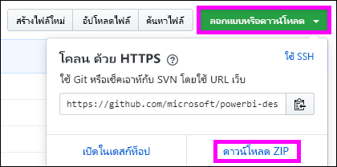

2. <span data-ttu-id="7ac8a-118">Unzip ไฟล์และเปิดไฟล์ .pbix ตัวอย่างใน Power BI Desktop ที่ปรับให้เหมาะสำหรับเซิร์ฟเวอร์รายงาน Power BI</span><span class="sxs-lookup"><span data-stu-id="7ac8a-118">Unzip the file, and open the sample .pbix file in Power BI Desktop optimized for Power BI Report Server.</span></span>

    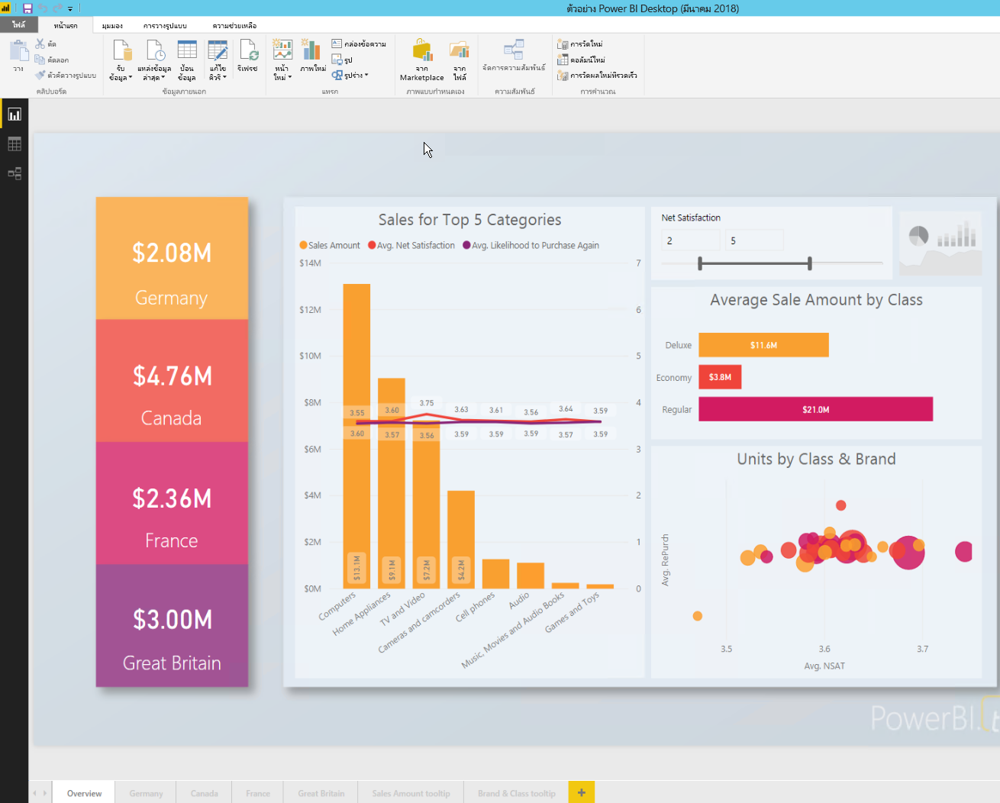

3. <span data-ttu-id="7ac8a-120">บันทึกรายงานไปยัง **เซิร์ฟเวอร์รายงาน Power BI**</span><span class="sxs-lookup"><span data-stu-id="7ac8a-120">Save the report to the **Power BI Report Server**.</span></span> 

    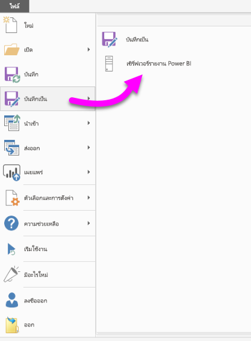

4. <span data-ttu-id="7ac8a-122">ดูรายงานในพอร์ทัลของเว็บเซิร์ฟเวอร์รายงาน Power BI</span><span class="sxs-lookup"><span data-stu-id="7ac8a-122">View report in the Power BI Report Server web portal.</span></span>

    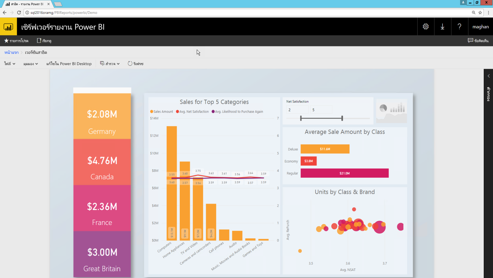

### <a name="capture-the-url-parameter"></a><span data-ttu-id="7ac8a-124">จับภาพพารามิเตอร์ URL</span><span class="sxs-lookup"><span data-stu-id="7ac8a-124">Capture the URL parameter</span></span>

<span data-ttu-id="7ac8a-125">หลังจากคุณมี URL ของคุณแล้ว คุณสามารถสร้าง iFrame ภายในหน้า SharePoint เพื่อโฮสต์รายงาน</span><span class="sxs-lookup"><span data-stu-id="7ac8a-125">After you have your URL, you can create an iFrame within a SharePoint page to host the report.</span></span> <span data-ttu-id="7ac8a-126">สำหรับ URL ของรายงานเซิร์ฟเวอร์รายงาน Power BI เพิ่มพารามิเตอร์สตริงคิวรีต่อไปนี้เพื่อฝังรายงานของคุณใน SharePoint iFrame: `?rs:embed=true`</span><span class="sxs-lookup"><span data-stu-id="7ac8a-126">For any Power BI Report Server report URL, add the following query string parameter to embed your report in a SharePoint iFrame: `?rs:embed=true`.</span></span>

   <span data-ttu-id="7ac8a-127">ตัวอย่างเช่น:</span><span class="sxs-lookup"><span data-stu-id="7ac8a-127">For example:</span></span>
    ``` 
    https://myserver/reports/powerbi/Sales?rs:embed=true
    ```
## <a name="embed-the-report-in-a-sharepoint-iframe"></a><span data-ttu-id="7ac8a-128">ฝังรายงานใน SharePoint iFrame</span><span class="sxs-lookup"><span data-stu-id="7ac8a-128">Embed the report in a SharePoint iFrame</span></span>

1. <span data-ttu-id="7ac8a-129">นำทางไปยัง SharePoint หน้า **เนื้อหาของไซต์**</span><span class="sxs-lookup"><span data-stu-id="7ac8a-129">Navigate to a SharePoint **Site Contents** page.</span></span>

    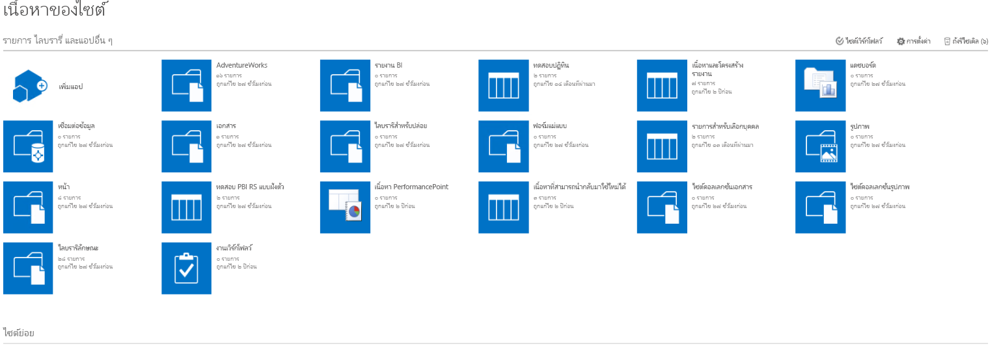

2. <span data-ttu-id="7ac8a-131">เลือกหน้าที่คุณต้องการเพิ่มรายงานของคุณ</span><span class="sxs-lookup"><span data-stu-id="7ac8a-131">Choose the page where you want to add your report.</span></span>

    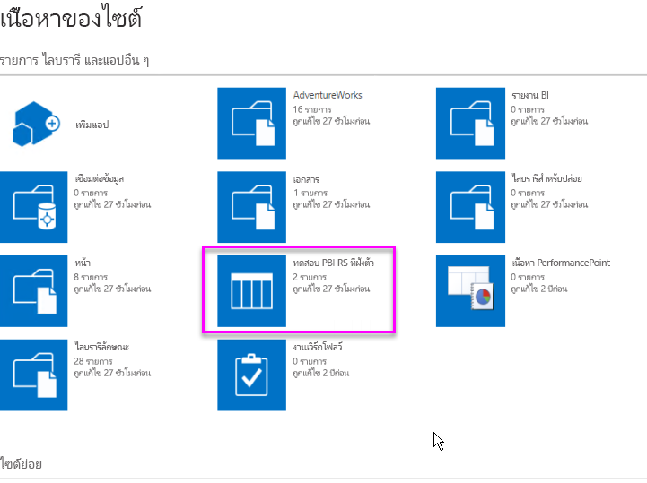

3. <span data-ttu-id="7ac8a-133">เลือกที่ไอคอนรูปเฟืองด้านบนขวา แล้วเลือก **แก้ไขหน้า**</span><span class="sxs-lookup"><span data-stu-id="7ac8a-133">Select the gear icon on the top right, and then select **Edit page**.</span></span>

    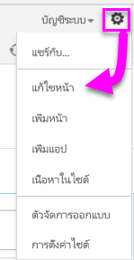

4. <span data-ttu-id="7ac8a-135">เลือก **เพิ่ม Web Part**</span><span class="sxs-lookup"><span data-stu-id="7ac8a-135">Select **Add a Web Part**.</span></span>

5. <span data-ttu-id="7ac8a-136">ภายใต ้ **ประเภท** เลือก **สื่อและเนื้อหา**</span><span class="sxs-lookup"><span data-stu-id="7ac8a-136">Under **Categories**, select **Media and Content**.</span></span> <span data-ttu-id="7ac8a-137">ภายใต ้ **ส่วน** เลือก **ตัวแก้ไขเนื้อหา** แล้วเลือก **เพิ่ม**</span><span class="sxs-lookup"><span data-stu-id="7ac8a-137">Under **Parts**, select **Content Editor**, and then select **Add**.</span></span>

    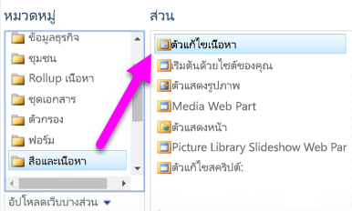

6. <span data-ttu-id="7ac8a-139">เลือก **คลิกที่นี่เพื่อเพิ่มเนื้อหาใหม่**</span><span class="sxs-lookup"><span data-stu-id="7ac8a-139">Select **Click here to add new content**.</span></span>

7. <span data-ttu-id="7ac8a-140">จากเมนูด้านบน เลือก **จัดรูปแบบข้อความ** แล้วเลือก **แก้ไขแหล่งข้อมูล**</span><span class="sxs-lookup"><span data-stu-id="7ac8a-140">From the top menu, select **Format Text**, and then select **Edit Source**.</span></span>

     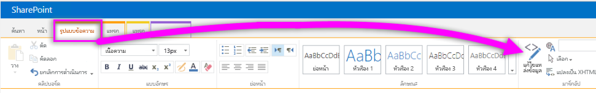

8. <span data-ttu-id="7ac8a-142">ในหน้าต่าง **แก้ไขแหล่งข้อมูล** วางรหัส iFrame ของคุณใน **HTML Source** แล้วเลือก **ตกลง**</span><span class="sxs-lookup"><span data-stu-id="7ac8a-142">In the **Edit Source** window, paste your iFrame code in **HTML Source**, and then select **OK**.</span></span>

    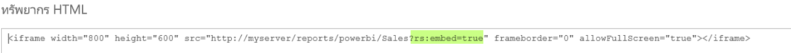

     <span data-ttu-id="7ac8a-144">ตัวอย่างเช่น:</span><span class="sxs-lookup"><span data-stu-id="7ac8a-144">For example:</span></span>
     ```html
     <iframe width="800" height="600" src="https://myserver/reports/powerbi/Sales?rs:embed=true" frameborder="0" allowFullScreen="true"></iframe>
     ```

9. <span data-ttu-id="7ac8a-145">ในเมนูด้านบน เลือก **หน้า** แล้วเลือก **หยุดการแก้ไข**</span><span class="sxs-lookup"><span data-stu-id="7ac8a-145">In the top menu, select **Page**, and then select **Stop Editing**.</span></span>

    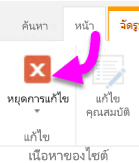

    <span data-ttu-id="7ac8a-147">รายงานจะปรากฏขึ้นบนหน้า</span><span class="sxs-lookup"><span data-stu-id="7ac8a-147">The report appears on the page.</span></span>

    

## <a name="next-steps"></a><span data-ttu-id="7ac8a-149">ขั้นตอนถัดไป</span><span class="sxs-lookup"><span data-stu-id="7ac8a-149">Next steps</span></span>

- <span data-ttu-id="7ac8a-150">[สร้างรายงาน Power BI สำหรับเซิร์ฟเวอร์รายงาน Power BI](quickstart-create-powerbi-report.md)</span><span class="sxs-lookup"><span data-stu-id="7ac8a-150">[Create a Power BI report for Power BI Report Server](quickstart-create-powerbi-report.md).</span></span>  
- <span data-ttu-id="7ac8a-151">[สร้างรายงานที่มีการแบ่งหน้าสำหรับเซิร์ฟเวอร์รายงาน Power BI](quickstart-create-paginated-report.md)</span><span class="sxs-lookup"><span data-stu-id="7ac8a-151">[Create a paginated report for Power BI Report Server](quickstart-create-paginated-report.md).</span></span>  

<span data-ttu-id="7ac8a-152">มีคำถามเพิ่มเติมหรือไม่</span><span class="sxs-lookup"><span data-stu-id="7ac8a-152">More questions?</span></span> <span data-ttu-id="7ac8a-153">[ลองไปที่ชุมชน Power BI](https://community.powerbi.com/)</span><span class="sxs-lookup"><span data-stu-id="7ac8a-153">[Try the Power BI Community](https://community.powerbi.com/).</span></span>