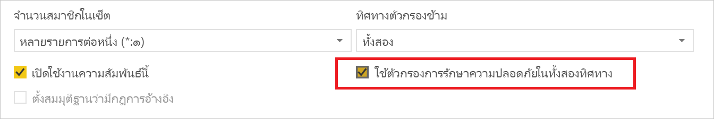
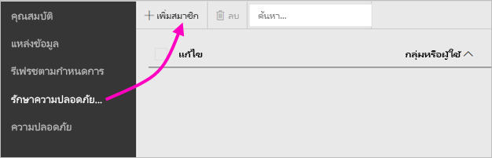
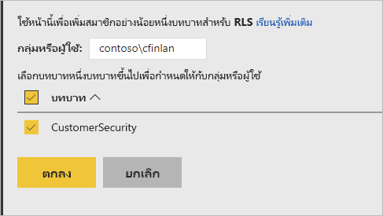
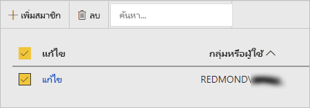

# การรักษาความปลอดภัยระดับแถว (RLS) ในเซิร์ฟเวอร์รายงาน Power BIRow-level security (RLS) in Power BI Report Server

การตั้งค่าความปลอดภัยระดับแถว (RLS) กับเซิร์ฟเวอร์รายงาน Power BI สามารถจำกัดการเข้าถึงข้อมูลสำหรับผู้ใช้ที่กำหนดSetting up row-level security (RLS) with Power BI Report Server can restrict data access for given users. ตัวกรองจำกัดการเข้าถึงข้อมูลในระดับแถว และคุณสามารถกำหนดตัวกรองภายในบทบาทได้Filters restrict data access at the row level, and you can define filters within roles.  หากคุณใช้การอนุญาตเริ่มต้นในเซิร์ฟเวอร์รายงาน Power BI ผู้ใช้ใด ๆ ที่มีสิทธิ์ผู้เผยแพร่หรือตัวจัดการเนื้อหาสำหรับรายงาน Power BI สามารถกำหนดสมาชิกให้กับบทบาทสำหรับรายงานนั้นIf you're using the default permissions in Power BI Report Server, any user with Publisher or Content Manager permissions for the Power BI report can assign members to roles for that report.    

คุณสามารถกำหนดค่า RLS สำหรับรายงานที่นำเข้าไปยัง Power BI ด้วย Power BI DesktopYou configure RLS for reports imported into Power BI with Power BI Desktop. คุณยังสามารถกำหนดค่า RLS บนรายงานที่ใช้ DirectQuery เช่น SQL Server ได้อีกด้วยYou can also configure RLS on reports that use DirectQuery, such as SQL Server.  โปรดทราบว่า RLS จะไม่ปฏิบัติตามหากการเชื่อมต่อ DirectQuery ของคุณใช้การตรวจสอบสิทธิ์แบบรวมสำหรับโปรแกรมอ่านรายงานKeep in mind that RLS isn't respected if your DirectQuery connection uses integrated authentication for report readers. ในส่วนการเชื่อมต่อสดของ Analysis Services คุณสามารถกำหนดค่ารักษาความปลอดภัยระดับแถวบนแบบจำลองภายในองค์กรได้For Analysis Services live connections, you configure row-level security on the on-premises model. ตัวเลือกความปลอดภัยจะไม่แสดงสำหรับชุดข้อมูลที่เชื่อมต่อสดThe security option doesn't show up for live connection datasets. 

[!INCLUDE [rls-desktop-define-roles](../includes/rls-desktop-define-roles.md)]

## การกรองแบบข้ามสองทิศทางBidirectional cross-filtering

ตามค่าเริ่มต้น การกรอง row-level security จะใช้ตัวกรองทิศทางเดียว โดยไม่คำนึงว่าการตั้งค่าความสัมพันธ์เป็นแบบทิศทางเดียวหรือสองทิศทางBy default, row-level security filtering uses single-directional filters, regardless of whether the relationships are set to single direction or bidirectional. คุณสามารถเปิดใช้งานการกรองแบบข้ามสองทิศทาง ด้วยความปลอดภัยระดับแถวด้วยตนเองได้You can manually enable bidirectional cross-filter with row-level security.

- เลือกความสัมพันธ์ และทำเครื่องหมายบนกล่องกาเครื่องหมาย **ใช้ตัวกรองความปลอดภัยในทั้งสองทิศทาง**Select the relationship and check the **Apply security filter in both directions** checkbox. 

    

ทำเครื่องหมายที่ช่องนี้เมื่อใช้งาน[การรักษาความปลอดภัยระดับแถวแบบไดนามิก](/analysis-services/tutorial-tabular-1200/supplemental-lesson-implement-dynamic-security-by-using-row-filters)ตามชื่อผู้ใช้หรือรหัสล็อกอินCheck this box when implementing [dynamic row-level security](/analysis-services/tutorial-tabular-1200/supplemental-lesson-implement-dynamic-security-by-using-row-filters) based on user name or login ID. 

เพื่อเรียนรู้เพิ่มเติม ดูที่[ตัวกรองไขว้แบบสองทิศทางที่ใช้ DirectQuery ใน Power BI Desktop](../transform-model/desktop-bidirectional-filtering.md)และบทความเชิงเทคนิคของ[การรักษาความปลอดภัยแบบลำจองภาษา BI แบบตาราง](https://download.microsoft.com/download/D/2/0/D20E1C5F-72EA-4505-9F26-FEF9550EFD44/Securing%20the%20Tabular%20BI%20Semantic%20Model.docx)To learn more, see [Bidirectional cross-filtering using DirectQuery in Power BI Desktop](../transform-model/desktop-bidirectional-filtering.md) and the [Securing the Tabular BI Semantic Model](https://download.microsoft.com/download/D/2/0/D20E1C5F-72EA-4505-9F26-FEF9550EFD44/Securing%20the%20Tabular%20BI%20Semantic%20Model.docx) technical whitepaper.

[!INCLUDE [rls-desktop-view-as-roles](../includes/rls-desktop-view-as-roles.md)]

## เพิ่มสมาชิกไปยังบทบาทAdd members to roles 

หลังจากคุณบันทึกรายงานของคุณใน Power BI Report Server แล้วคุณจะจัดการความปลอดภัยและเพิ่มหรือลบสมาชิกบนเซิร์ฟเวอร์ได้After you save your report in Power BI Report Server, you manage security and add or remove members on the server. เฉพาะผู้ใช้ที่ มีสิทธิ์ผู้เผยแพร่หรือผู้จัดการเนื้อหาสำหรับรายงานที่มีตัวเลือกการรักษาความปลอดภัยระดับแถวพร้อมใช้งานและไม่เป็นสีเทาเท่านั้นOnly users with either Publisher or Content Manager permissions for the report have the row-level security option available and not greyed out.

 ถ้ารายงานไม่มีบทบาทจำเป็น คุณจำเป็นเมื่อต้องเปิดใน Power BI Desktop เพิ่มหรือปรับเปลี่ยนบทบาท จาก นั้นบันทึกกลับไปยังเซิร์ฟเวอร์รายงาน Power BIIf the report doesn't have the roles it needs, you need to open it in Power BI Desktop, add or modify roles, then save it back to Power BI Report Server. 

1. ใน Power BI Desktop บันทึกรายงานไปยังเซิร์ฟเวอร์รายงาน Power BIIn Power BI Desktop, save the report to Power BI Report Server. คุณจะต้องมีเวอร์ชั่น Power BI Desktop ที่ปรับให้เหมาะสำหรับเซิร์ฟเวอร์รายงาน Power BIYou need to use the version of Power BI Desktop optimized for Power BI Report Server.
2. ในบริการ Power BI รายงาน เลือกจุดไข่ปลา ( **...** ) ถัดจากรายงานIn Power BI Report Service, select the ellipsis (**…**) next to the report. 

3. เลือก**จัดการ** > **ความปลอดภัยระดับแถว**Select **Manage** > **Row-level security**. 

     

    บนหน้า **การรักษาความปลอดภัยระดับแถว** คุณสามารถเพิ่มสมาชิกบทบาทที่คุณสร้างขึ้นใน Power BI Desktop ได้On the **Row-level security** page, you add members to a role you created in Power BI Desktop.

5. เมื่อต้องเพิ่มสมาชิก เลือก**เพิ่มสมาชิก**To add a member, select **Add Member**.

1. ป้อนผู้ใช้หรือกลุ่มในกล่องข้อความในรูปแบบชื่อผู้ใช้ (DOMAIN\user) และเลือกบทบาทที่คุณต้องการกำหนดให้กับพวกเขาEnter the user or group in the text box in the Username format (DOMAIN\user) and select the roles you wish to assign to them. สมาชิกรายนี้จะต้องอยู่ภายในองค์กรของคุณThe member has to be within your organization.   

    

    ทั้งนี้ขึ้นอยู่กับวิธีที่คุณตั้งค่า Active Directory ไว้ การป้อนชื่อผู้ใช้หลักที่นี่ก็ใช้ได้Depending on how you have Active Directory configured, entering the User Principal Name here also works. ในกรณีนั้น เซิร์ฟเวอร์รายงานจะแสดงชื่อผู้ใช้ที่เกี่ยวข้องในรายการIn that case, the Report Server shows the corresponding username in the list.

1. คลิก**ตกลง**เพื่อนำไปใช้Click **OK** to apply.   

8. หากต้องการลบสมาชิก ให้ทำเครื่องหมายที่ช่องถัดจากชื่อและเลือก **ลบ**To remove members, check the box next to their names and select **Delete**.  คุณสามารถลบสมาชิกหลายคนพร้อมกันได้You can delete multiple members at a time. 

    

## username () และ userprincipalname ()username() and userprincipalname()

คุณสามารถใช้ประโยชน์จากฟังก์ชัน DAX username() หรือ userprincipalname() ภายในชุดข้อมูลของคุณได้You can take advantage of the DAX functions username() or userprincipalname() within your dataset. คุณสามารถใช้กับนิพจน์ใน Power BI Desktop ได้You can use them within expressions in Power BI Desktop. เมื่อคุณเผยแพร่โมเดลของคุณ เซิร์ฟเวอร์ Power BI Report จะใช้โมเดลเหล่านั้นWhen you publish your model, Power BI Report Server uses them.

ภายใน Power BI Desktop username() จะส่งผู้ใช้กลับในรูปแบบของ DOMAIN\User และ userprincipalname() จะส่งผู้ใช้กลับในรูปแบบของ user@contoso.comWithin Power BI Desktop, username() returns a user in the format of DOMAIN\User and userprincipalname() returns a user in the format of user@contoso.com.

ภายในเซิร์ฟเวอร์รายงาน Power BI ชื่อผู้ใช้ () และ userprincipalname () ทั้งคู่ส่งคืนชื่อผู้ใช้หลัก (UPN) ของผู้ใช้ซึ่งคล้ายกับที่อยู่อีเมลWithin Power BI Report Server, username() and userprincipalname() both return the user's User Principal Name (UPN), which is similar to an email address.

หากคุณใช้การรับรองความถูกต้องที่กำหนดเองใน Power BI Report Server จะส่งคืนรูปแบบชื่อผู้ใช้ที่คุณตั้งค่าสำหรับผู้ใช้If you're using custom authentication in Power BI Report Server, it returns the username format you’ve set up for users.  

## ข้อจำกัดLimitations 

นี่คือข้อจำกัดในปัจจุบันสำหรับการรักษาความปลอดภัยระดับแถวในโมเดล Power BIHere are the current limitations for row-level security on Power BI models. 

ผู้ใช้ที่มีรายงานโดยใช้ชื่อผู้ใช้ () ฟังก์ชั่น DAX จะสังเกตเห็นพฤติกรรมใหม่ในขณะนี้ซึ่งชื่อผู้ใช้หลัก (UPN) จะถูกส่งคืนยกเว้นเมื่อใช้ DirectQuery กับการรักษาความปลอดภัยแบบรวมUsers that had reports using the username() DAX function will notice new behavior now where the User Principal Name (UPN) is returned EXCEPT when using DirectQuery with integrated security.  เนื่องจาก RLS ไม่ได้ปฏิบัติตามในสถานการณ์นั้น ลักษณะการทำงานในสถานการณ์นั้นจะไม่เปลี่ยนแปลงSince RLS isn't respected in that scenario, the behavior in that scenario is unchanged.

คุณสามารถกำหนด RLS บนชุดข้อมูลที่สร้างขึ้นด้วย Power BI Desktop เท่านั้นYou can define RLS only on datasets created with Power BI Desktop. เพื่อเปิดใช้งาน RLS สำหรับชุดข้อมูลที่สร้างขึ้นโดยใช้ Excel คุณจะต้องแปลงไฟล์ของคุณให้เป็นไฟล์ Power BI Desktop (PBIX) ก่อนTo enable RLS for datasets created with Excel, you must convert your files into Power BI Desktop (PBIX) files first. เรียนรู้เพิ่มเติมเกี่ยวกับ[การแปลงแฟ้ม Excel](../connect-data/desktop-import-excel-workbooks.md)Learn more about [converting Excel files](../connect-data/desktop-import-excel-workbooks.md).

เฉพาะการสกัด แปลง และโหลดข้อมูล (ETL) และการเชื่อมต่อ DirectQuery โดยใช้ข้อมูลประจำตัวจะได้รับการสนับสนุนOnly Extract, Transform, Load (ETL) and DirectQuery connections using stored credentials are supported. การเชื่อมต่อแบบสดไปยังบริการการวิเคราะห์และการเชื่อมต่อ DirectQuery โดยใช้การรับรองความถูกต้องแบบรวมถูกจัดการในแหล่งข้อมูลพื้นฐานLive connections to Analysis Services and DirectQuery connections using integrated authentication are handled in the underlying data source. 

ถ้าคุณกำลังใช้การรักษาความปลอดภัยแบบรวมกับ DirectQuery แล้วผู้ใช้ของคุณอาจสังเกตเห็น:If you're using integrated security with DirectQuery, then your users may notice:
- RLS ถูกปิดใช้งาน และข้อมูลทั้งหมดจะถูกส่งกลับRLS is disabled and all data is returned.
- ผู้ใช้ไม่สามารถอัปเดตการกำหนดบทบาทและรับข้อผิดพลาดในหน้า RLS Manage ได้Users can't update their role assignments, and get an error on the RLS Manage page.
- สำหรับฟังก์ชั่นชื่อผู้ใช้ DAX คุณจะได้รับชื่อผู้ใช้เป็น DOMAIN \ USER ต่อไปFor the DAX username function, you continue to receive the username as DOMAIN\USER. 

ผู้เขียนรายงานไม่มีสิทธิ์เข้าถึงเพื่อดูข้อมูลรายงานใน Power BI Report Server จนกว่าพวกเขาจะกำหนดบทบาทให้ตัวเองหลังจากอัปโหลดรายงานแล้วReport authors don't have access to view the report data in Power BI Report Server until they've assigned themselves roles accordingly after uploading the report. 

 

## คำถามที่ถามบ่อยFAQ 

### ฉันสามารถสร้างบทบาทเหล่านี้สำหรับแหล่งข้อมูล Analysis Services ได้หรือไม่Can I create these roles for Analysis Services data sources? 

คุณสามารถสร้างได้ถ้าคุณนำเข้าข้อมูลลงใน Power BI DesktopYou can if you imported the data into Power BI Desktop. ถ้าคุณกำลังใช้ข้อมูลแบบ live connection คุณไม่สามารถกำหนดค่า RLS ภายในบริการ Power BIIf you're using a live connection, you can't configure RLS within the Power BI service. RLS จะได้รับการกำหนดภายใน Analysis Services แบบจำลองภายในองค์กรRLS is defined within the Analysis Services model on-premises. 

### ฉันสามารถใช้ RLS เพื่อจำกัดคอลัมน์หรือหน่วยวัดที่สามารถเข้าถึงโดยผู้ใช้ของฉันได้หรือไม่Can I use RLS to limit the columns or measures accessible by my users? 

หมายเลขNo. ถ้าผู้ใช้มีสิทธิ์เข้าถึงแถวเฉพาะของข้อมูล พวกเขาสามารถเห็นคอลัมน์ทั้งหมดของข้อมูลสำหรับแถวนั้นIf a user has access to a particular row of data, they can see all the columns of data for that row. 

### RLS อนุญาตให้ฉันซ่อนข้อมูลรายละเอียด แต่ให้สิทธิ์การเข้าถึงข้อมูลที่สรุปไว้ในภาพหรือไม่?Does RLS let me hide detailed data but give access to data summarized in visuals? 

ไม่ ถึงแม่ว่าคุณรักษาข้อมูลของแต่ละแถว แต่ผู้ใช้สามารถดูรายละเอียดหรือข้อมูลสรุปได้ตลอดเวลาNo, you secure individual rows of data but users can always see either the details or the summarized data. 

### ฉันสามารถเพิ่มบทบาทใหม่ใน Power BI Desktop ได้หรือไม่ถ้าฉันมีบทบาทและสมาชิกที่กำหนดอยู่แล้ว?Can I add new roles in Power BI Desktop if I already have existing roles and members assigned? 

ใช่ ถ้าคุณมีการกำหนดบทบาทที่มีอยู่แล้วและสมาชิกที่ได้รับมอบหมายใน Power BI Report Server คุณสามารถสร้างบทบาทเพิ่มเติมและเผยแพร่รายงานของคุณโดยไม่มีผลกับการมอบหมายปัจจุบันYes, if you already have existing roles defined and members assigned in Power BI Report Server, you can make additional roles and republish your report with no effect on your current assignments. 
 

## ขั้นตอนถัดไปNext steps

[เซิร์ฟเวอร์รายงาน Power BI คืออะไร](get-started.md) 
[ภาพรวมของผู้ดูแลระบบ](admin-handbook-overview.md)[What is Power BI Report Server?](get-started.md) 
[Administrator handbook](admin-handbook-overview.md)  

มีคำถามเพิ่มเติมหรือไม่More questions? [ลองถามชุมชน Power BITry asking the Power BI Community](https://community.powerbi.com/)