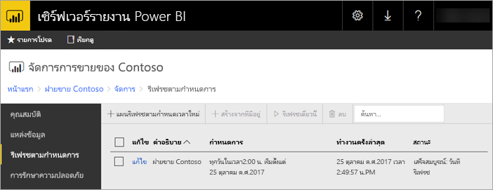

# รายงาน Power BI รีเฟรชตามกำหนดการในเซิร์ฟเวอร์รายงาน Power BIPower BI report scheduled refresh in Power BI Report Server
การรีเฟรชตามกำหนดการสำหรับรายงาน Power BI จะช่วยให้ข้อมูลสำหรับรายงานได้รับการอัปเดตอยู่เสมอScheduled refresh for Power BI reports allows the data for a report to stay up to date.

การรีเฟรชตามกำหนดการจะใช้เฉพาะกับรายงาน Power BI ที่มีแบบจำลองที่ฝังScheduled refresh is specific to Power BI reports with an embedded model. ซึ่งหมายความว่า คุณนำเข้าข้อมูลลงในรายงานแทนการใช้การเชื่อมต่อแบบรายงานสดหรือ DirectQueryMeaning you imported data into the report instead of using a live connection or DirectQuery. เมื่อนำเข้าข้อมูลของคุณ จซึ่งะไม่ได้เชื่อมต่อจากแหล่งข้อมูลต้นฉบับ และจำเป็นต้องอัปเดตเพื่อทำให้ข้อมูลใหม่อยู่เสมอWhen importing your data, it is disconnected from the original data source and needs to be updated to keep data fresh. การรีเฟรชตามกำหนดการเป็นวิธีที่จะทำให้ข้อมูลของคุณอัปเดตอยู่เสมอScheduled refresh is the way to keep your data up to date.

การรีเฟรชตามกำหนดการได้รับการกำหนดค่าภายในส่วนการจัดการของรายงานScheduled refresh is configured within the management section of a report. สำหรับข้อมูลเพิ่มเติมเกี่ยวกับวิธีการกำหนดค่าการรีเฟรชตามกำหนดการ ดูที่[วิธีการกำหนดค่าการรีเฟรชตามกำหนดการของรายงาน Power BI](configure-scheduled-refresh.md)For more information on how to configure scheduled refresh, see [How to configure Power BI report scheduled refresh](configure-scheduled-refresh.md).

## วิธีการทำงานHow this works
มีส่วนประกอบมากมายที่เกี่ยวข้องเมื่อมีการใช้การรีเฟรชตามกำหนดการสำหรับรายงาน Power BI ของคุณSeveral components are involved when using scheduled refresh for your Power BI reports.

* SQL Server Agent เป็นตัวจับเวลาการสร้างเหตุการณ์ตามกำหนดการSQL Server Agent as a timer to generate scheduled events.
* งานที่กำหนดจะถูกเพิ่มลงในคิวของเหตุการณ์และการแจ้งเตือนในฐานข้อมูลเซิร์ฟเวอร์รายงานScheduled jobs are added to a queue of events and notifications in the report server database. ในการใช้งาน scale-out คิวจะได้รับการแชร์ทั่วทั้งเซิร์ฟเวอร์รายงานทั้งหมดในการใช้งานIn a scale-out deployment, the queue is shared across all of the report servers in the deployment.
* การประมวลผลรายงานทั้งหมดที่เกิดขึ้นเนื่องจากผลลัพธ์ของกำหนดการเหตุการณ์ทำหน้าที่เป็นกระบวนการพื้นหลังAll report processing that occurs as a result of a schedule event is performed as a background process.
* โหลดแบบจำลองข้อมูลภายในอินสแตนซ์ Analysis ServicesThe data model is loaded within an Analysis Services instance.
* สำหรับบางแหล่งข้อมูล กลไกจัดการโต้ตอบกับผู้ใช้ Power Query ถูกใช้เพื่อเชื่อมต่อกับแหล่งข้อมูล และแปลงข้อมูลFor some data sources, the Power Query mashup engine is used to connect to data sources and transform the data. แหล่งข้อมูลอื่นๆอาจเชื่อมต่อโดยตรงจากบริการ Analysis Services ที่ใช้สำหรับการโฮสต์แบบจำลองข้อมูลสำหรับเซิร์ฟเวอร์รายงาน Power BIOther data sources may be connected to directly from an Analysis Services service used to host the data models for Power BI Report Server.
* โหลดข้อมูลใหม่ลงในแบบจำลองข้อมูลภายใน Analysis ServicesNew data is loaded into the data model within Analysis Services.
* ในการกำหนดค่าการขยายขนาดความจุ แบบจำลองข้อมูลสามารถทำซ้ำข้ามโหนดได้In a scale-out configuration, the data model can be replicated across nodes.
* Analysis Services ประมวลผลข้อมูล และดำเนินการการคำนวณที่จำเป็นต่างๆAnalysis Services processes the data and executes any needed calculations.

เซิร์ฟเวอร์รายงาน power BI จะรักษาคิวของเหตุการณ์สำหรับการดำเนินการที่กำหนดไว้ทั้งหมดPower BI Report Server maintains an event queue for all scheduled operations. ซึ่งจะทำการสำรวจคิวตามเวลาปกติเพื่อตรวจสอบเหตุการณ์ใหม่It polls the queue at regular intervals to check for new events. ตามค่าเริ่มต้น คิวจะได้รับการสแกนที่ช่วงเวลา 10 วินาทีBy default, the queue is scanned at 10 second intervals. คุณสามารถเปลี่ยนช่วงเวลาโดยการปรับเปลี่ยน **PollingInterval**, **IsNotificationService** และ **IsEventService** ตั้งค่าการกำหนดค่าในตัวไฟล์ RSReportServer.configYou can change the interval by modifying the **PollingInterval**, **IsNotificationService**, and **IsEventService** configuration settings in the RSReportServer.config file. **IsDataModelRefreshService** ยังสามารถใช้เพื่อตั้งค่าว่ากระบวนการของเซิร์ฟเวอร์รายงานกำหนดเหตุการณ์ไว้หรือไม่**IsDataModelRefreshService** can also be used to set whether a report server process scheduled events.

### การบริการด้านการวิเคราะห์Analysis Services
สร้างรายงาน Power BI รวมถึงการดำเนินการรีเฟรชตามกำหนดการ จำเป็นต้องโหลดแบบจำลองข้อมูลของรายงาน Power BI ใน Analysis ServicesRendering a Power BI report, as well as performing a scheduled refresh, requires loading the Power BI report's data model in Analysis Services. กระบวนการ Analysis Services จะทำงานร่วมกับเซิร์ฟเวอร์รายงาน Power BI ReportAn Analysis Services process will be running with Power BI Report Server.

## ข้อควรพิจารณาและข้อจำกัดConsiderations and limitations
### เมื่อไม่สามารถใช้การรีเฟรชตามกำหนดการWhen scheduled refresh can't be used
รายงาน Power BI ทั้งหมดไม่สามารถมีแผนการรีเฟรชตามกำหนดการที่ถูกสร้างขึ้นบนรายงานเหล่านั้นNot all Power BI Reports can have a scheduled refresh plan created on them. รายการต่อไปนี้คือรายงาน Power BI ที่คุณไม่สามารถสร้างแผนการรีเฟรชตามกำหนดการได้The following is a list of Power BI Reports that you Can't create a scheduled refresh plan.

* รายงานของคุณประกอบด้วยแหล่งข้อมูล Analysis Services อย่างน้อยหนึ่งแหล่งที่ใช้การเชื่อมต่อแบบรายงานสดYour report contains one or more Analysis Services data sources, which use a live connection.
* รายงานของคุณประกอบด้วยแหล่งข้อมูลอย่างน้อยหนึ่งแหล่งที่ใช้ DirectQueryYour report contains one or more data sources, which use DirectQuery.
* รายงานของคุณไม่มีแหล่งข้อมูลYour report does not contain any data source. ตัวอย่างเช่น ข้อมูลที่ป้อนด้วยตนเองผ่านทาง *ป้อนข้อมูล* หรือรายงานมีเนื้อหาแบบค่าคงที่เท่านั้น เช่น รูปภาพ ข้อความ และอื่นๆFor example, data is manually entered via *Enter Data* or a report contains only static content like images, text, etc.

นอกเหนือจากรายการด้านบน ยังมีสถานการณ์เฉพาะที่มีแหล่งข้อมูลในโหมด *นำเข้า* ที่คุณไม่สามารถสร้างแผนการรีเฟรชได้In addition to the above list, there are specific scenarios with data sources in *import* mode, for which you cannot create refresh plans.

* ถ้าแหล่งข้อมูล *ไฟล์* หรือ *โฟลเดอร์* ถูกใช้และเส้นทางของไฟล์เป็นเส้นทางท้องถิ่น (เช่น C:\Users\user\Documents), แผนการรีเฟรชจะไม่สามารถสร้างได้If a *File* or *Folder* data source is used and the file path is a local path (e.g. C:\Users\user\Documents), then a refresh plan cannot be created. เส้นทางจะต้องเป็นเส้นทางที่เซิร์ฟเวอร์รายงานสามารถเชื่อมต่อเหมือนกับการแชร์เครือข่ายThe path must be a path the report server can connect to like a network share. ตัวอย่างเช่น *\\myshare\Documents*For example, *\\myshare\Documents*.
* ถ้าแหล่งข้อมูลสามารถเชื่อมต่อโดยใช้เฉพาะ OAuth (ตัวอย่างเช่น Facebook, Google Analytics, Salesforce และอื่นๆ), แผนการรีเฟรช cache จะไม่สามารถสร้างได้If data source can be connected using only OAuth (e.g. Facebook, Google Analytics, Salesforce, etc.), then cache refresh plan cannot be created. ในขณะนี้ RS ไม่สนับสนุนการรับรองความถูกต้อง OAuth สำหรับแหล่งข้อมูลใดๆ ไม่ว่าจะเป็นสำหรับแบ่งหน้า เคลื่อนที่ หรือรายงาน Power BIAt the moment, RS does not support OAuth authentication for any data source whether it is for paginated, mobile or Power BI reports.

### ขีดจำกัดหน่วยความจำMemory limits
ปริมาณงานแบบดั้งเดิมสำหรับเซิร์ฟเวอร์รายงานเหมือนกับเว็บแอปพลิเคชันTraditional workload for a report server has been similar to a web application. ความสามารถในการอัปโหลดรายงานที่มีข้อมูลที่นำเข้า หรือ DirectQuery และความสามารถในการดำเนินการรีเฟรชตามกำหนดการ ขึ้นอยู่กับอินสแตนซ์ Analysis Services ที่ถูกโฮสต์ควบคู่ไปกับเซิร์ฟเวอร์รายงานThe ability to load reports with imported data or DirectQuery, and the ability to perform scheduled refresh, rely on an Analysis Services instance being hosted alongside of the report server. จากผลที่ได้อาจทำให้เกิดความดันหน่วยความจำที่ไม่คาดคิดบนเซิร์ฟเวอร์As a result, this could result is unexpected memory pressure on the server. วางแผนการใช้งานเซิร์ฟเวอร์ของคุณให้สอดคล้องกับ Analysis Services ที่อาจจะสามารถใช้หน่วยความจำควบคู่ไปกับเซิร์ฟเวอร์รายงานPlan your server deployment accordingly knowning that Analysis Services may be consuming memory alongside the report server.

สำหรับข้อมูลเกี่ยวกับวิธีการตรวจสอบอินสแตนซ์ Analysis Services ดู[ตรวจสอบอินสแตนซ์ Analysis Services](/sql/analysis-services/instances/monitor-an-analysis-services-instance)For information on how to monitor an Analysis Services instance, see [Monitor an Analysis Services Instance](/sql/analysis-services/instances/monitor-an-analysis-services-instance).

สำหรับข้อมูลเกี่ยวกับการตั้งค่าหน่วยความจำภายใน Analysis Services ดู[คุณสมบัติหน่วยความจำ](/sql/analysis-services/server-properties/memory-properties)For information about memory settings within Analysis Services, see [Memory Properties](/sql/analysis-services/server-properties/memory-properties).

### ขีดจำกัดขนาดของแบบจำลองข้อมูลData model size limit
แบบจำลองข้อมูลที่โหลดลงในกลไก Analysis Services ภายในระหว่างการรีเฟรชตามกำหนดการมีขนาดสูงสุด 2,000 MB (2GB)The data model loaded into the internal Analysis Services engine during a scheduled refresh has a maximum size of 2,000 MB (2GB). ซึ่งคุณไม่สามารถกำหนดค่าขนาดสูงสุดนี้ได้This maximum size can't be configured. ถ้าแบบจำลองข้อมูลของคุณขยายขนาดใหญ่กว่า 2GB คุณจะได้รับข้อผิดพลาดการรีเฟรชเป็น "ความยาวของผลลัพธ์เกินขีดจำกัดความยาว (2GB) ของประเภทเป้าหมายขนาดใหญ่"If your data model grows larger than 2GB, you will receive the refresh error, "The length of the result exceeds the length limit (2GB) of the target large type." ในกรณีนี้ เราขอแนะนำให้โฮสต์แบบจำลองในอินสแตนซ์ Analysis Services และใช้การเชื่อมต่อแบบสดกับแบบจำลองในรายงานIn that case, we recommend hosting the model in an Analysis Services instance and using a live connection to the model in the report.

## ขั้นตอนถัดไปNext steps
กำหนดค่า[การรีเฟรชตามกำหนดการ](configure-scheduled-refresh.md)ในรายงาน Power BIConfigure [scheduled refresh](configure-scheduled-refresh.md) on a Power BI report.

มีคำถามเพิ่มเติมหรือไม่More questions? [ลองถามชุมชน Power BITry asking the Power BI Community](https://community.powerbi.com/)