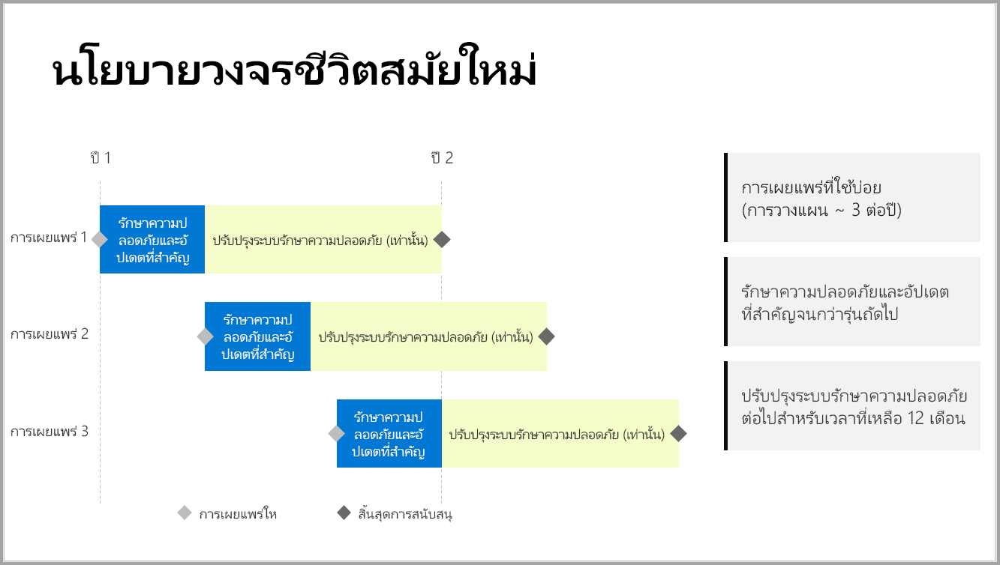

# การสนับสนุนเบราว์เซอร์สำหรับ Power BI Report ServerSupport timeline for Power BI Report Server

Power BI Report Server เผยแพร่เพียงไม่กี่ครั้งต่อปีPower BI Report Server releases a few times per year. ความปลอดภัยและการอัปเดตที่สำคัญมีพร้อมใช้งานจนกว่าการเผยแพร่ถัดไปจะพร้อมใช้งานโดยทั่วไป (GA)Security and critical updates are available until the next release becomes generally available (GA). หลังจากการเผยแพร่ถัดไป การเผยแพร่ก่อนหน้าจะยังคงได้รับการอัปเดตความปลอดภัยสำหรับส่วนที่เหลือของช่วงอายุการเผยแพร่ 12 เดือนAfter the next release, the previous release continues to receive security updates for the remainder of the 12-month release lifespan.

นโยบายสนับสนุนนี้ช่วยให้เราส่งมอบนวัตกรรมให้แก่ลูกค้าในอัตราที่รวดเร็วในขณะที่ยังมีความยืดหยุ่นสำหรับลูกค้าเพื่อปรับใช้นวัตกรรมตามความเร็วของตนThis support policy allows us to deliver innovation to customers at a rapid rate while providing flexibility for customers to adopt the innovation at their pace.

* ระยะให้บริการด้านความปลอดภัยและการอัปเดตที่สำคัญ - เมื่อเรียกใช้ Power BI Report Server เวอร์ชันล่าสุดที่เป็นปัจจุบัน คุณจะได้รับทั้งความปลอดภัยและการอัปเดตที่สำคัญSecurity and Critical Updates servicing phase - When running the latest current version of Power BI Report Server, you receive both Security and Critical updates.
* ระยะให้บริการอัปเดตความปลอดภัย (เท่านั้น) - หลังจากที่มีการเผยแพร่เวอร์ชันใหม่ การสนับสนุนเวอร์ชันที่เก่ากว่าจะลดลงเหลือเพียงการอัปเดตความปลอดภัยสำหรับช่วงอายุการสนับสนุน 12 เดือนที่เหลือ (แสดงในรูปภาพ 1)Security Updates (Only) servicing phase - After the release of a new version, support for older versions reduces to Security updates only for the rest of the 12-month support lifecycle (shown in figure 1).

    

## ประวัติเวอร์ชั่นVersion history

| **เวอร์ชัน****Version** | **วันที่พร้อมใช้งาน****Availability date** | **วันที่สิ้นสุดการสนับสนุน****Support end date** |
| --- | --- | --- |
| กันยายน 2019September 2019 | กันยายน 2019September 2019 | ไม่รองรับเวอร์ชันเดือนกันยายน 2019 และเวอร์ชันก่อนหน้าทั้งหมดอีกต่อไปSeptember 2019 and all previous versions no longer supported
| มกราคม 2020January 2020 | มกราคม 2020January 2020 | มกราคม 2021January 2021
| พฤษภาคม 2020May 2020 | พฤษภาคม 2020May 2020 | พฤษภาคม 2021May 2021
| ตุลาคม 2020October 2020 | ตุลาคม 2020October 2020 | ตุลาคม 2021October 2021

เมื่อต้องการดาวน์โหลด Power BI Report Server และ Power BI Desktop ซึ่งปรับให้เหมาะสมที่สุดกับ Power BI Report Server ไปที่ [การรายงานภายในองค์กรกับ Power BI Report Server](https://powerbi.microsoft.com/report-server/)To download Power BI Report Server, and Power BI Desktop optimized for Power BI Report Server, go to [On-premises reporting with Power BI Report Server](https://powerbi.microsoft.com/report-server/).

## ขั้นตอนถัดไปNext steps
[มีอะไรใหม่ใน Power BI Report ServerWhat's new in Power BI Report Server](whats-new.md)  
[เซิร์ฟเวอร์รายงาน Power BI คืออะไร](get-started.md)
[ภาพรวมของผู้ดูแลระบบ](admin-handbook-overview.md)[What is Power BI Report Server?](get-started.md)
[Administrator overview](admin-handbook-overview.md)  
[ติดตั้ง Power BI Report ServerInstall Power BI Report Server](install-report-server.md)  

มีคำถามเพิ่มเติมหรือไม่More questions? [ลองถามชุมชน Power BITry asking the Power BI Community](https://community.powerbi.com/)
