# บทช่วยสอน: สำรวจพอร์ทัลเว็บ Power BI Report Server ใน VMTutorial: Explore the Power BI Report Server web portal in a VM
ในบทช่วยสอนนี้ คุณสร้างเครื่องเสมือน Azure ที่มีการติดตั้ง Power BI Report Server ไว้แล้วได้ ดังนั้นคุณสามารถดู แก้ไข และจัดการตัวอย่าง Power BI และรายงานที่มีการแบ่งหน้า และ KPI ได้In this tutorial, you create an Azure virtual machine with Power BI Report Server already installed, so you can experience viewing, editing, and managing sample Power BI and paginated reports, and KPIs.

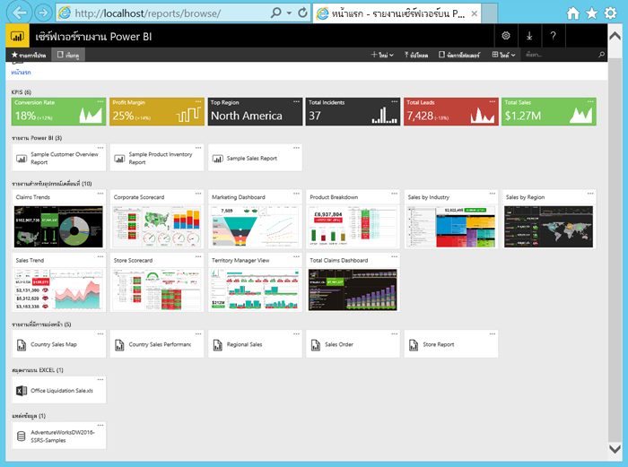

นี่คืองานที่คุณต้องทำในบทช่วยสอนนี้:Here are the tasks you'll do in this tutorial:

> [!div class="checklist"]
> * สร้างและเชื่อมต่อกับ VMCreate and connect to a VM
> * เริ่มและสำรวจพอร์ทัลเว็บ Power BI Report ServerStart and explore the Power BI Report Server web portal
> * ติดแท็กรายการที่คุณชื่นชอบTag a favorite item
> * ดูและแก้ไขรายงาน Power BIView and edit a Power BI report
> * ดู จัดการ และแก้ไขรายงานที่มีการแบ่งหน้าView, manage, and edit a paginated report
> * ดูเวิร์กบุ๊ก Excel ใน Excel OnlineView an Excel workbook in Excel Online

สำหรับบทช่วยสอนนี้ คุณจำเป็นต้องมีการสมัครใช้งาน AzureFor this tutorial, you need an Azure subscription. ถ้าคุณยังไม่มีการสมัครใช้งาน Azure สร้าง[บัญชีฟรี](https://azure.microsoft.com/free/?WT.mc_id=A261C142F)ก่อนที่คุณจะเริ่มIf you don’t have one, create a [free account](https://azure.microsoft.com/free/?WT.mc_id=A261C142F) before you begin.

## สร้าง Power BI Report Server VMCreate a Power BI Report Server VM

โชคดีที่ทีม Power BI ได้สร้าง VM ที่มาพร้อมกับ Power BI Report Server แบบติดตั้งไว้แล้วLuckily, the Power BI team has created a VM that comes with Power BI Report Server already installed.

1. ใน Azure Marketplace เลือกเซิร์ฟเวอร์รายงาน Power BIIn the Azure Marketplace, select Power BI Report Server. ลิงก์นี้จะเปิดขึ้นโดยตรง: [เซิร์ฟเวอร์รายงาน Power BI](https://azuremarketplace.microsoft.com/marketplace/apps/reportingservices.technical-preview?tab=Overview)This link opens it directly: [Power BI Report Server](https://azuremarketplace.microsoft.com/marketplace/apps/reportingservices.technical-preview?tab=Overview).  

2. เลือก **รับทันที**Select **Get it now**.
3. ในการยอมรับข้อตกลงการใช้งานและนโยบายความเป็นส่วนตัวของผู้ให้บริการ เลือก **ดำเนินการต่อ**To agree to the provider's terms of use and privacy policy, select **Continue**.

4. เลือก **สร้าง**Select **Create**.

    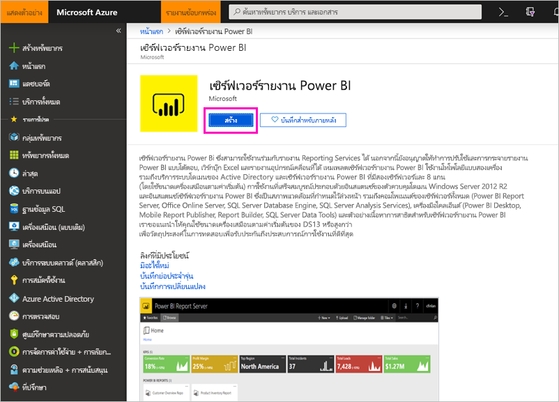

5. ใน **ขั้นตอนที่ 1 ข้อมูลพื้นฐาน** สำหรับ **ชื่อ VM** เรียกว่า **reportservervm**In **Step 1 Basics**, for **VM Name**, call it **reportservervm**.

    ชื่อ Power BI Report Server VM ไม่สามารถมีเครื่องหมายขีดคั่นได้The Power BI Report Server VM name can't contain dashes.

5. สร้างชื่อผู้ใช้และรหัสผ่านCreate a user name and password.

6. สำหรับ **กลุ่มทรัพยากร** เลือก **สร้างใหม่** ต่อไป และเรียกว่า **reportserverresourcegroup** > **ตกลง**For **Resource group**, select **Create new**, and call it **reportserverresourcegroup** > **OK**.

    ถ้าคุณเลื่อนผ่านบทช่วยสอนมากกว่าหนึ่งครั้ง คุณจำเป็นต้องตั้งชื่อกลุ่มทรัพยากรเป็นชื่ออื่นหลังจากครั้งแรกIf you go through the tutorial more than once, you need to give the resource group a different name after the first time. คุณไม่สามารถใช้ชื่อกลุ่มทรัพยากรเดียวกันสองครั้งในการสมัครใช้งานหนึ่งYou can't use the same resource group name twice in one subscription. 

    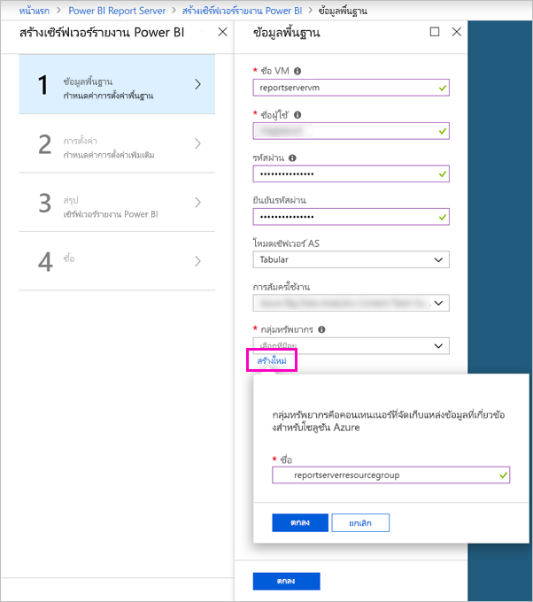

7. ใช้ค่าเริ่มต้นอื่น ๆ ต่อไป > **ตกลง**Keep the other defaults > **OK**.

8. ใน **ขั้นตอนที่ 2 การตั้งค่า** ใช้ค่าเริ่มต้นต่อไป > **ตกลง**In **Step 2 Settings**, keep the defaults > **OK**.
 
    บัญชี **ที่เก็บข้อมูล SQL** และ **ค่าบัญชีที่เก็บข้อมูลการวินิจฉัย** ต้องไม่ซ้ำกันThe **SQL Storage account** and **Diagnostics Storage account** values must also be unique. ถ้าคุณเลื่อนผ่านบทช่วยสอนมากกว่าหนึ่งครั้ง คุณจำเป็นต้องตั้งเป็นชื่ออื่นIf you go through the tutorial more than once, you need to give them different names.

9. ใน **สรุปขั้นตอนที่ 3** ตรวจสอบการเลือกของคุณ >**ตกลง**In **Step 3 Summary**, review your selections > **OK**.

10. ใน **ขั้นตอนซื้อที่ 4** ตรวจทานข้อกำหนดของนโยบายผู้ใช้และความเป็นส่วนตัว > **สร้าง**In **Step 4 Buy**, review the Terms of user and privacy policy > **Create**.

    กระบวนการ **ส่งการปรับใช้สำหรับเซิร์ฟเวอร์รายงาน Power BI** อาจใช้เวลาหลายนาทีThe **Submitting deployment for Power BI Report Server** process may take several minutes.

## เชื่อมต่อกับเครื่องเสมือนของคุณConnect to your virtual machine

1. ในแผงนำทาง Azure ให้เลือก **เครื่องเสมือน**In the Azure nav pane, select **Virtual machines**. 

2. ในกล่อง **กรองตามชื่อ** พิมพ์ "รายงาน"In the **Filter by name** box, type "report". 

3. เลือก VM ที่ชื่อว่า **REPORTSERVERVM**Select the VM named **REPORTSERVERVM**.

    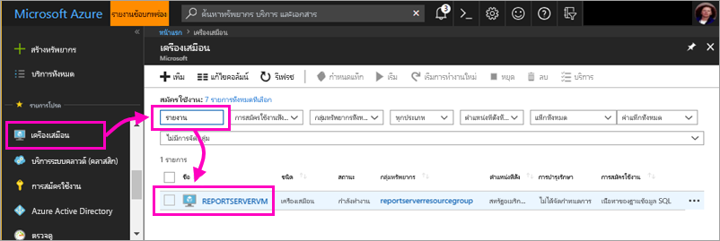

4. ใต้เครื่องเสมือน REPORTSERVERVM เลือก **เชื่อมต่อ**Under REPORTSERVERVM Virtual machine, select **Connect**.

    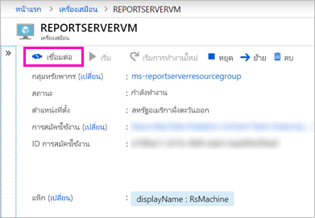

5. ในบานหน้าต่าง **เชื่อมต่อกับเครื่องเสมือน** ให้เก็บค่าเริ่มต้นและเลือก **ดาวน์โหลดไฟล์ RDP**In the **Connect to virtual machine** pane, keep the defaults and select **Download RDP File**.

1. ในกล่องโต้ตอบการ **เชื่อมต่อเดสก์ท็อประยะไกล** เลือก **เชื่อมต่อ**In the **Remote Desktop Connection** dialog box, select **Connect**.

6. ใส่ชื่อและรหัสผ่านที่คุณสร้างขึ้นสำหรับการ VM > **ตกลง**Enter the name and password you created for the VM > **OK**.

7. กล่องโต้ตอบถัดไประบุว่า **ไม่สามารถระบุข้อมูลประจำตัวของคอมพิวเตอร์ระยะไกลได้**The next dialog box says **The identity of the remote computer cannot be identified**. เลือก **ใช่**Select **Yes**.

   Voila, VM ใหม่ของคุณเปิดขึ้นVoila, your new VM opens.

## เซิร์ฟเวอร Power BI Report บน VMPower BI Report Server on the VM

เมื่อ VM ของคุณเปิดขึ้น ต่อไปนี้คือรายการที่คุณเห็นบนเดสก์ท็อปWhen your VM opens, here are the items you see on the desktop.

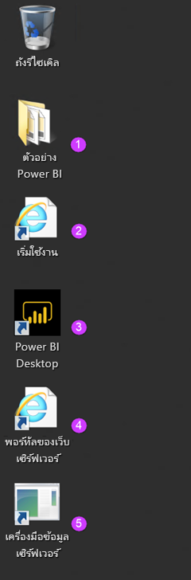

|ตัวเลขNumber  |คืออะไรWhat it is  |
|---------|---------|
| | รายงาน Power BI ตัวอย่าง (.PBIX)Sample Power BI (.PBIX) reports |
| | ลิงก์ไปยังเอกสารประกอบเซิร์ฟเวอร์รายงาน Power BILinks to Power BI Report Server documentation |
| | เริ่มต้น Power BI Desktop ที่ปรับให้เหมาะสมสำหรับเซิร์ฟเวอร์รายงาน Power BI (มกราคม 2019)Starts Power BI Desktop optimized for Power BI Report Server (January 2019) |
| | พอร์ทัลเว็บเซิร์ฟเวอร์รายงาน Power BI เปิดขึ้นในเบราว์เซอร์Opens Power BI Report Server web portal in the browser |
| | เริ่มต้นเครื่องมือข้อมูล SQL Server สำหรับสร้างรายงานที่มีการแบ่งหน้า (.RDL)Starts SQL Server Data Tools, for creating paginated (.RDL) reports |

ดับเบิลคลิกที่ไอคอน **พอร์ทัลเว็บเซิร์ฟเวอร์รายงาน**Double-click the **Report Server Web Portal** icon. เบราว์เซอร์เปิดขึ้น`https://localhost/reports/browse`The browser opens `https://localhost/reports/browse`. ในพอร์ทัลเว็บคุณจะเห็นไฟล์ต่าง ๆ ที่ถูกจัดกลุ่มแยกตามประเภทIn the web portal, you see various files grouped by type. 

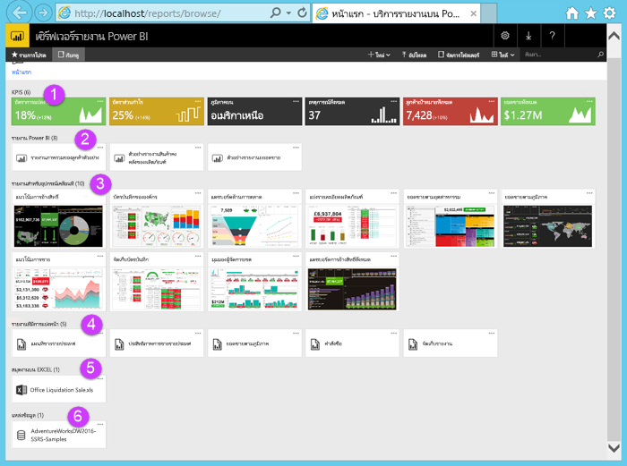

|ตัวเลขNumber  |คืออะไรWhat it is  |
|---------|---------|
| | KPI ที่สร้างขึ้นในพอร์ทัลเว็บKPIs created in the web portal |
| |  รายงาน Power BI (.PBIX)Power BI (.PBIX) reports  |
| | รายงานมือถือที่สร้างขึ้นใน SQL Server Mobile Report PublisherMobile reports created in SQL Server Mobile Report Publisher  |
| |  รายงานที่มีการแบ่งหน้าที่สร้างขึ้นในตัวสร้างรายงานหรือเครื่องมือข้อมูล SQL ServerPaginated reports created in Report Builder or SQL Server Data Tools  |
| | เวิร์กบุ๊ก ExcelExcel workbooks   | 
| | แหล่งข้อมูลสำหรับรายงานที่มีการแบ่งหน้าData sources for paginated reports | 

## แท็กรายการโปรดของคุณTag your favorites
คุณสามารถแท็กรายงานและ KPI ที่คุณต้องการทำให้เป็นรายการโปรดYou can tag the reports and KPIs that you want to be favorites. ง่ายต่อการค้นหาเนื่องจากทั้งหมดถูกรวบรวมไว้ในโฟลเดอร์รายการโปรดเดียว ทั้งในพอร์ทัลของเว็บ และในแอป Power BI สำหรับอุปกรณ์เคลื่อนที่They're easier to find because they're all gathered in a single Favorites folder, both in the web portal and in the Power BI mobile apps. 

1. เลือกจุดไข่ปลา ( **...** ) ที่มุมขวาบนของ **อัตราผลกำไร** KPI > **เพิ่มไปยังรายการโปรด**Select the ellipsis (**…**) in the upper-right corner of the **Profit Margin** KPI > **Add to Favorites**.
   
    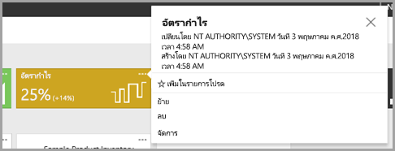
2. เลือก **รายการโปรด** บน Ribbon พอร์ทัลของเว็บเพื่อดูพร้อมกับรายการโปรดอื่นๆ ของคุณบนหน้ารายการโปรดในพอร์ทัลของเว็บSelect **Favorites** on the web portal ribbon to see it along with your other favorites on the Favorites page in the web portal.
   
    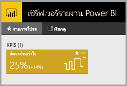

3. เลือก **เรียกดู** เพื่อกลับไปยังพอร์ทัลเว็บSelect **Browse** to go back to the web portal.
   
## ดูรายการในมุมมองรายการView items in List view
ตามค่าเริ่มต้น พอร์ทัลของเว็บจะแสดงเนื้อหาในมุมมองไทล์By default, the web portal displays its contents in Tile view.

คุณสามารถสลับเป็นมุมมองรายการ ซึ่งเป็นเรื่องง่ายเมื่อต้องย้าย หรือลบหลายรายการในแต่ละครั้งYou can switch to List view, where it's easy to move or delete multiple items at a time. 

1. เลือก **รายการ** > **ไทล์**Select **Tiles** > **List**.
   
    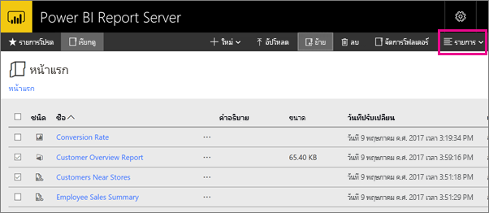

2. ย้อนกลับไปยังมุมมองไทล์: เลือก **รายการ** > **ไทล์**Go back to Tiles view: Select **List** > **Tiles**.

## รายงาน Power BIPower BI reports

คุณสามารถดูและโต้ตอบกับรายงาน Power BI ในพอร์ทัลเว็บ และเริ่มต้น Power BI Desktop ได้โดยตรงจากพอร์ทัลเว็บYou can view and interact with Power BI reports in the web portal, and start Power BI Desktop right from the web portal.

### ดูรายงาน Power BIView Power BI reports

1. ในพอร์ทัลเว็บใต้ **รายงาน Power BI** เลือก **รายงานภาพรวมของลูกค้าตัวอย่าง**In the web portal under **Power BI reports**, select **Sample Customer Overview Report**. รายงานเปิดขึ้นในเบราว์เซอร์The report opens in the browser.

1. เลือกช่วงสหรัฐอเมริกาในแผนภูมิต้นไม้เพื่อดูวิธีดังกล่าวไฮไลต์ค่าที่เกี่ยวข้องในภาพอื่นSelect the United States block in the tree map to see how it highlights related values in the other visuals.

    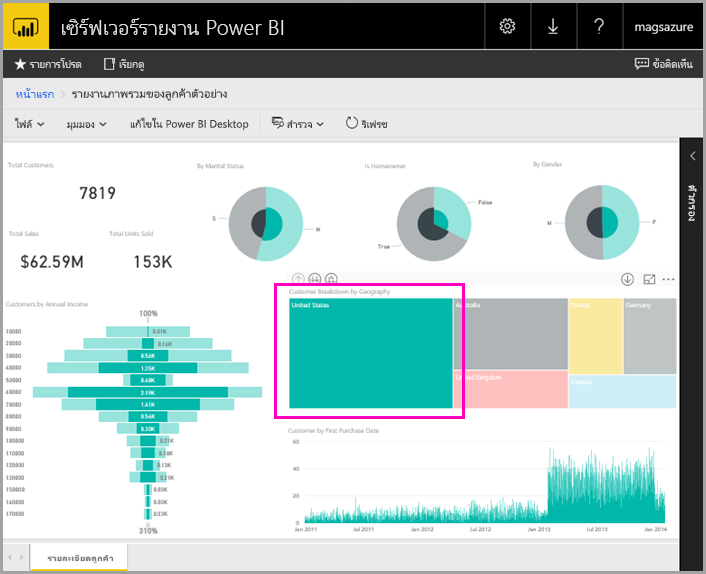

### แก้ไขใน Power BI DesktopEdit in Power BI Desktop

1. เลือก **แก้ไขใน Power BI Desktop**Select **Edit in Power BI Desktop**.

1. เลือก **อนุญาต** เพื่ออนุญาตให้เว็บไซต์นี้เปิดโปรแกรมบนคอมพิวเตอร์ของคุณSelect **Allow** to allow this web site to open a program on your computer. 

     หน้ารายงานเปิดขึ้นใน Power BI DesktopThe report opens in Power BI Desktop. โปรดสังเกตชื่อในแถบด้านบน "Power BI Desktop (มกราคม 2019)"Note the name in the top bar, "Power BI Desktop (January 2019)". นี่เป็นเวอร์ชันที่ปรับให้เหมาะสำหรับเซิร์ฟเวอร์รายงาน Power BIThat's the version optimized for Power BI Report Server.

    ใช้เวอร์ชัน Power BI Desktop ที่ติดตั้งไว้บน VMUse the version of Power BI Desktop that's installed on the VM. คุณไม่สามารถอัปโหลดรายงานข้ามโดเมนได้You can't go across domains to upload a report.

3. ในบานหน้าต่างเขตข้อมูล ขยายตารางลูกค้าและลากเขตข้อมูลอาชีพไปยังตัวกรองระดับรายงานIn the Fields pane, expand the Customers table and drag the Occupation field to Report level filters.

    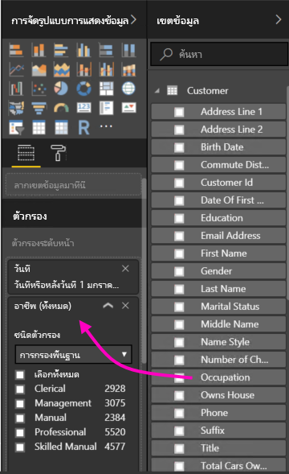

1. บันทึกรายงานSave the report.

1. กลับไปยังรายงานในเบราว์เซอร์แล้วเลือกไอคอน **รีเฟรช** เบราว์เซอร์Go back to the report in the browser and select the browser **Refresh** icon.

    

8. ขยายบานหน้าต่าง **ตัวกรอง** ทางด้านขวาเพื่อดูตัวกรอง **อาชีพ** ที่คุณเพิ่มExpand the **Filters** pane on the right to see the **Occupation** filter you added. เลือก **Professional**Select **Professional**.

    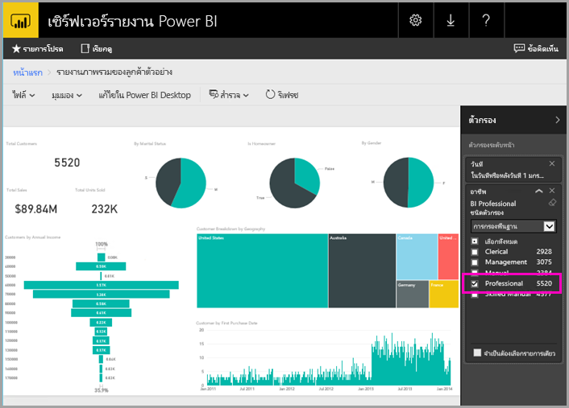

3. เลือก **เรียกดู** เพื่อกลับไปยังพอร์ทัลเว็บSelect **Browse** to go back to the web portal.

## รายงานที่มีการแบ่งหน้า (.RDL)Paginated (.RDL) reports

คุณสามารถดูและจัดการรายงานที่มีการแบ่งหน้าและเปิดใช้ตัวสร้างรายงาน จากพอร์ทัลเว็บได้You can view and manage paginated reports, and launch Report Builder, from the web portal.

### จัดการรายงานที่มีการแบ่งหน้าManage a paginated report

1. ในพอร์ทัลเว็บใต้ **รายงานที่มีการแบ่งหน้า** ให้เลือก **ตัวเลือกเพิ่มเติม** (...) ถัดจาก **ใบสั่งขาย** > **จัดการ**In the web portal under **Paginated reports**, select **More options** (...) next to **Sales Order** > **Manage**.

1. เลือก **พารามิเตอร์** เปลี่ยนค่าเริ่มต้นสำหรับ **SalesOrderNumber** เป็น **SO50689** > **นำไปใช้**Select **Parameters**, change the default value for **SalesOrderNumber** to **SO50689** > **Apply**.

   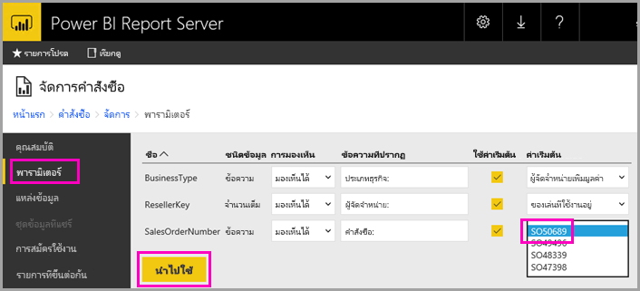

3. เลือก **เรียกดู** เพื่อกลับไปยังพอร์ทัลเว็บSelect **Browse** to go back to the web portal.

### ดูรายงานที่มีการแบ่งหน้าView a paginated report

1. เลือก **ใบสั่งซื้อ** ในพอร์ทัลเว็บSelect **Sales Order** in the web portal.
 
3.  คุณจะเห็นว่าเปิดไปยังพารามิเตอร์ **คำสั่งซื้อ** ที่คุณตั้งค่า **SO50689**You see it opened to the **Order** parameter you set, **SO50689**. 

    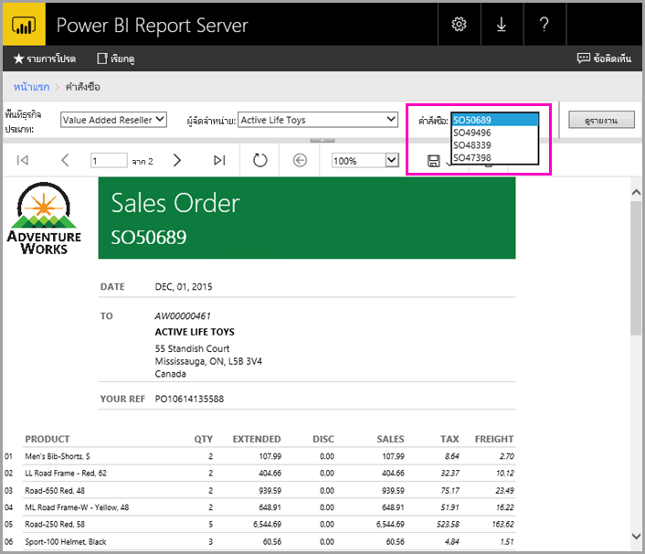

    คุณสามารถเปลี่ยนพารามิเตอร์ได้ที่นี่พร้อมกับพารามิเตอร์อื่น ๆ โดยไม่ต้องเปลี่ยนค่าเริ่มต้นYou can change that parameter here, along with the other parameters, without changing the defaults.

1. เลือก **คำสั่ง** **SO48339** > **ดูรายงาน**Select **Order** **SO48339** > **View Report**.

4. คุณจะเห็นว่านี่คือหน้า 1 จาก 2 หน้าYou see that this is page 1 of 2. เลือกลูกศรขวาเพื่อดูหน้าที่สองSelect the right arrow to see the second page. ตารางมีต่อไปยังหน้านั้นThe table continues on that page.

    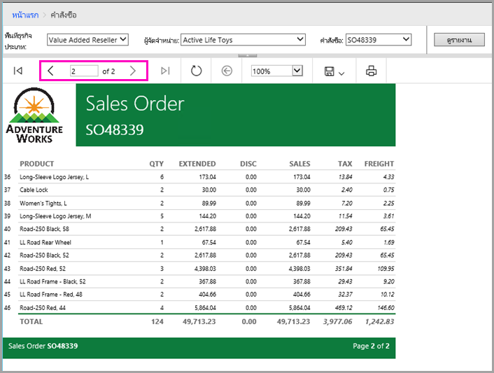

5. เลือก **เรียกดู** เพื่อกลับไปยังพอร์ทัลเว็บSelect **Browse** to go back to the web portal.

### แก้ไขรายงานที่มีการแบ่งหน้าEdit a paginated report

คุณสามารถแก้ไขรายงานที่มีการแบ่งหน้าได้ในตัวสร้างรายงาน และคุณสามารถเริ่มตัวสร้างรายงานได้จากเบราว์เซอร์ดังกล่าวYou can edit paginated reports in Report Builder, and you can start Report Builder right from the browser.

1. ในพอร์ทัลเว็บ ให้เลือก **ตัวเลือกเพิ่มเติม** (...) ถัดจาก **ใบสั่งขาย** > **แก้ไขในตัวสร้างรายงาน**In the web portal, select **More options** (...) next to **Sales Order** > **Edit in Report Builder**.

1. เลือก **อนุญาต** เพื่ออนุญาตให้เว็บไซต์นี้เปิดโปรแกรมบนคอมพิวเตอร์ของคุณSelect **Allow** to allow this web site to open a program on your computer.

1. รายงานใบสั่งซื้อเปิดขึ้นในมุมมองออกแบบในตัวสร้างรายงานThe Sales Order report opens in Design View in Report Builder.

    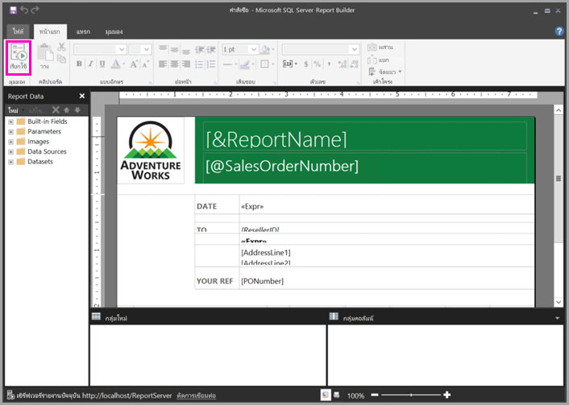

1. เลือก **เรียกใช้** เพื่อแสดงตัวอย่างรายงานSelect **Run** to preview the report.

    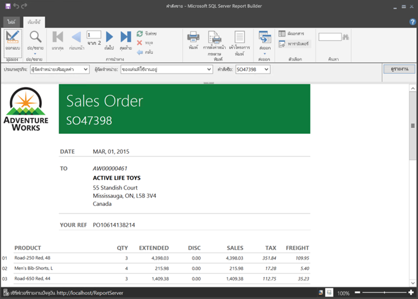

5. ปิดตัวสร้างรายงานและย้อนกลับไปยังเบราว์เซอร์Close Report Builder and go back to the browser.

## ดูเวิร์กบุ๊ก ExcelView Excel workbooks

คุณสามารถดูและโต้ตอบกับเวิร์กบุ๊ก Excel ได้ใน Excel Online ในเซิร์ฟเวอร์รายงาน Power BIYou can view and interact with Excel workbooks in Excel Online in Power BI Report Server. 

1. เลือกเวิร์กบุ๊ก Excel **Office Liquidation Sale.xlsx**Select the Excel workbook **Office Liquidation Sale.xlsx**. ระบบอาจขอให้กรอกข้อมูลประจำตัวIt may ask for credentials. เลือก **ยกเลิก**Select **Cancel**. 
    จะเปิดขึ้นในพอร์ทัลเว็บIt opens in the web portal.
1. เลือก **อุปกรณ์** ในตัวแบ่งส่วนข้อมูลSelect **Appliance** in the slicer.

    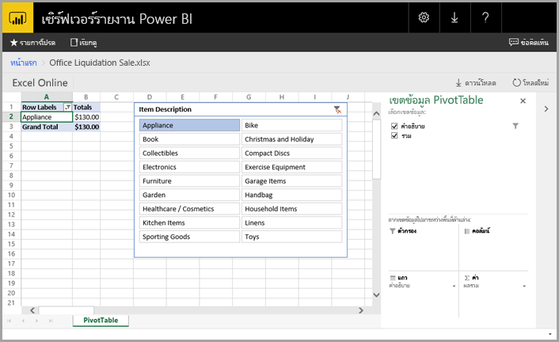

1. เลือก **เรียกดู** เพื่อกลับไปยังพอร์ทัลเว็บSelect **Browse** to go back to the web portal.

## ล้างแหล่งข้อมูลClean up resources

ตอนนี้คุณได้เรียนรู้บทช่วยสอนนี้เสร็จสิ้นแล้ว ลบกลุ่มทรัพยากร เครื่องเสมือน และแหล่งข้อมูลทั้งหมดที่เกี่ยวข้องNow that you've finished this tutorial, delete the resource group, virtual machine, and all related resources. 

- เมื่อต้องการทำเช่นนั้น เลือกกลุ่มทรัพยากรสำหรับ VM และเลือก **ลบ**To do so, select the resource group for the VM and select **Delete**.

## ขั้นตอนถัดไปNext steps

ในบทช่วยสอนนี้คุณได้สร้าง VM ด้วยเซิร์ฟเวอร์รายงาน Microsoft Power BIIn this tutorial, you've created a VM with Power BI Report Server. คุณได้ลองใช้ฟังก์ชันการทำงานของพอร์ทัลเว็บบางส่วน และคุณได้เปิดรายงาน Power BI และรายงานที่แบ่งหน้าในตัวแก้ไขที่เกี่ยวข้องแล้วYou've tried some of the functionality of the web portal, and you've opened a Power BI report and a paginated report in their respective editors. VM นี้มีการติดตั้งแหล่งข้อมูลของ SQL Server Analysis Services ดังนั้นคุณสามารถลองสร้าง Power BI และรายงานที่แบ่งหน้าของคุณเองได้ด้วยแหล่งข้อมูลเดียวกันเหล่านั้นThis VM has SQL Server Analysis Services data sources installed, so you can try creating your own Power BI and paginated reports with those same data sources. 

เมื่อต้องการเรียนรู้เพิ่มเติมเกี่ยวกับการสร้างรายงานสำหรับเซิร์ฟเวอร์รายงาน Power BI ให้ไปต่อTo learn more about creating reports for Power BI Report Server, continue on.

> [!div class="nextstepaction"]
> [สร้างรายงาน Power BI สำหรับเซิร์ฟเวอร์รายงาน Power BICreate a Power BI report for Power BI Report Server](./quickstart-create-powerbi-report.md)

