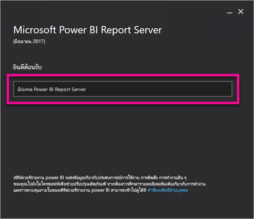
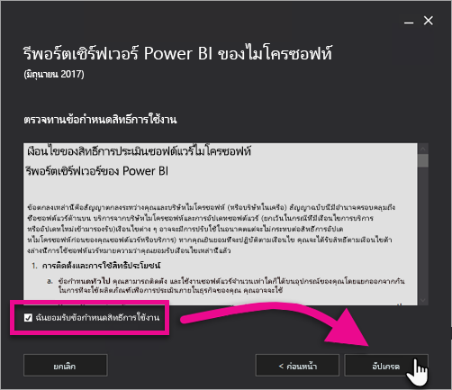
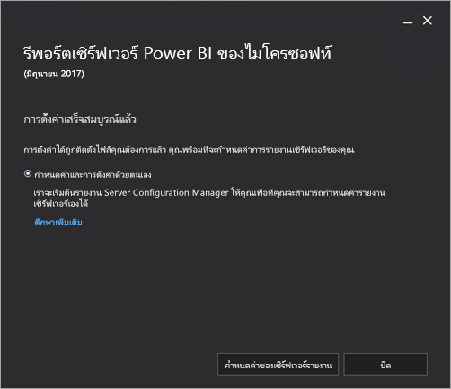

# อัปเกรด Power BI Report Server

เรียนรู้วิธีการอัปเกรด Power BI Report Server

 **ดาวน์โหลด** 

หากต้องการดาวน์โหลดเซิร์ฟเวอร์รายงาน Power BI และ Power BI Desktop สำหรับเซิร์ฟเวอร์รายงาน Power BI ให้ไปที่การ[รายงานภายในองค์กรด้วยเซิร์ฟเวอร์รายงาน Power BI](https://powerbi.microsoft.com/report-server/)

## ก่อนเริ่มต้น

ก่อนที่คุณจะอัปเกรดเซิร์ฟเวอร์รายงานเราขอแนะนำให้ทำตามขั้นตอนต่อไปนี้เพื่อสำรองข้อมูลเซิร์ฟเวอร์รายงานของคุณ

### การสำรองข้อมูลคีย์การเข้ารหัสลับ

คุณควรสำรองข้อมูลคีย์การเข้ารหัสลับเมื่อคุณกำหนดค่าการติดตั้งเซิร์ฟเวอร์รายงานเป็นครั้งแรก คุณควรสำรองข้อมูลคีย์ทุกครั้งที่คุณเปลี่ยนข้อมูลประจำตัวของบัญชีบริการหรือเปลี่ยนชื่อคอมพิวเตอร์ สำหรับข้อมูลเพิ่มเติม ดู [สำรองข้อมูลและคืนค่าคีย์การเข้ารหัสลับบริการรายงาน](/sql/reporting-services/install-windows/ssrs-encryption-keys-back-up-and-restore-encryption-keys)

### สำรองฐานข้อมูลเซิร์ฟเวอร์รายงาน

เนื่องจากเซิร์ฟเวอร์รายงานเป็นเซิร์ฟเวอร์ไม่มีสถานะ ข้อมูลแอปพลิเคชันทั้งหมดจึงถูกเก็บไว้ในฐานข้อมูล **reportserver** และ **reportservertempdb** ที่ทำงานบนอินสแตนซ์ SQL Server Database Engine คุณสามารถสำรองฐานข้อมูล **reportserver** และ **reportservertempdb** ได้โดยใช้หนึ่งในวิธีที่ได้รับการสนับสนุนสำหรับการสำรองฐานข้อมูล SQL Server คำแนะนำเหล่านี้จะระบุไว้ในฐานข้อมูลเซิร์ฟเวอร์รายงาน:

* ใช้แบบจำลองการกู้คืนแบบเต็มอัตราเพื่อสำรองฐานข้อมูล **reportserver**
* ใช้แบบจำลองการกู้คืนอย่างง่ายเพื่อสำรองฐานข้อมูล **reportservertempdb**
* คุณสามารถใช้กำหนดการสำรองข้อมูลที่แตกต่างกันสำหรับแต่ละฐานข้อมูล เหตุผลเดียวที่ต้องสำรองข้อมูล **reportservertempdb** ก็คือเพื่อหลีกเลี่ยงการสร้างขึ้นใหม่หากฮาร์ดแวร์ล้มเหลว ในกรณีที่ฮาร์ดแวร์ล้มเหลว คุณไม่จำเป็นต้องกู้คืนข้อมูลใน **reportservertempdb** แต่คุณจำเป็นต้องมีโครงสร้างตาราง ถ้าคุณทำ **reportservertempdb** หายไป วิธีเดียวที่จะได้คืนมาก็คือ การสร้างฐานข้อมูลเซิร์ฟเวอร์รายงานขึ้นมาไป หากคุณสร้าง **reportservertempdb** ขึ้นใหม่ สิ่งสำคัญคือต้องมีชื่อเดียวกับฐานข้อมูลเซิร์ฟเวอร์รายงานหลัก

สำหรับข้อมูลเพิ่มเติมเกี่ยวกับการสำรองและกู้คืนฐานข้อมูลเชิงสัมพันธ์ SQL Server ดู [สำรองข้อมูลและคืนค่าฐานข้อมูล SQL Server](/sql/relational-databases/backup-restore/back-up-and-restore-of-sql-server-databases)

### การสำรองข้อมูลไฟล์กำหนดค่า

Power BI Report Server จะใช้ไฟลกำหนดค่าเพื่อจัดเก็บการตั้งค่าแอปพลิเคชัน สำรองไฟล์เมื่อคุณกำหนดค่าเซิร์ฟเวอร์เป็นครั้งแรก และหลังจากที่คุณปรับใช้ส่วนขยายที่กำหนดเอง ไฟล์ที่จะสำรองข้อมูลประกอบด้วย:

* config.json
* RSHostingService.exe.config
* Rsreportserver.config
* Rssvrpolicy.config
* Reportingservicesservice.exe.config
* Web.config สำหรับแอปพลิเคชัน Report Server ASP.NET
* Machine.config สำหรับ ASP.NET

## การอัปเกรดเซิร์ฟเวอร์รายงาน

การอัปเกรดเซิร์ฟเวอร์รายงาน Power BI นั้นตรงไปตรงมา มีเพียงไม่กี่ขั้นตอนในการติดตั้งไฟล์

1. ค้นหาตำแหน่งที่ตั้งของ PowerBIReportServer.exe และเปิดใช้งานตัวติดตั้ง

2. เลือก **อัปเกรด Power BI Report Server**

    

3. อ่านและยอมรับเงื่อนไขและข้อกำหนดสิทธิ์การใช้งาน และจากนั้นเลือก **อัปเกรด**

    

4. หลังจากอัปเกรดสำเร็จ คุณสามารถเลือก **กำหนดค่าเซิร์ฟเวอร์รายงาน** เพื่อเปิดใช้ตัวจัดการการกำหนดค่าบริการการรายงาน หรือเลือก **ปิด** เพื่ออกจากตัวติดตั้ง

    

## เปิดใช้งานการแก้ไขความปลอดภัยของการอัปเดต Microsoft สำหรับเซิร์ฟเวอร์รายงาน Power BI

เซิร์ฟเวอร์รายงาน Power BI ได้รับการแก้ไขด้านความปลอดภัยผ่านการอัปเดต Microsoft หากต้องการเปิดใช้งานการรับให้เลือกใช้การอัปเดต Microsoft ด้วยตนเอง

1.  เปิดการอัปเดต Windows ใน **การตั้งค่าการอัปเดตและความปลอดภัย** บนคอมพิวเตอร์ที่คุณต้องการเลือกใช้
2.  เลือก **ตัวเลือกขั้นสูง**
3.  เลือกกล่องกาเครื่องหมายสำหรับ **แจ้งการอัปเดตสำหรับผลิตภัณฑ์อื่น ๆ ของ Microsoft เมื่อฉันอัปเดต Windows**

## อัปเกรด Power BI Desktop

หลังจากที่คุณอัปเกรดเซิร์ฟเวอร์รายงานตรวจสอบให้แน่ใจว่าผู้เขียนรายงาน Power BI ใดๆอัปเกรดเป็นเวอร์ชันของ Power BI Desktop สำหรับเซิร์ฟเวอร์รายงาน Power BI ที่ตรงกับเซิร์ฟเวอร์

## ขั้นตอนถัดไป

* [ภาพรวมของผู้ดูแลระบบ](admin-handbook-overview.md)  
* [ติดตั้ง Power BI Desktop สำหรับเซิร์ฟเวอร์รายงาน Power BI](install-powerbi-desktop.md)  
* [ตรวจสอบการติดตั้งบริการการรายงาน](/sql/reporting-services/install-windows/verify-a-reporting-services-installation)  
* [กำหนดค่าบัญชีผู้ใช้บริการเซิร์ฟเวอร์รายงาน](/sql/reporting-services/install-windows/configure-the-report-server-service-account-ssrs-configuration-manager)  
* [กำหนดค่า URL ของเซิร์ฟเวอร์รายงาน](/sql/reporting-services/install-windows/configure-report-server-urls-ssrs-configuration-manager)  
* [กำหนดค่าการเชื่อมต่อฐานข้อมูลเซิร์ฟเวอร์รายงาน](/sql/reporting-services/install-windows/configure-a-report-server-database-connection-ssrs-configuration-manager)  
* [เตรียมใช้งานเซิร์ฟเวอร์รายงาน](/sql/reporting-services/install-windows/ssrs-encryption-keys-initialize-a-report-server)  
* [กำหนดค่าการเชื่อมต่อ SSL ในเซิร์ฟเวอร์รายงาน](/sql/reporting-services/security/configure-ssl-connections-on-a-native-mode-report-server)  
* [กำหนดค่าบัญชีบริการ windows และสิทธิ์](/sql/database-engine/configure-windows/configure-windows-service-accounts-and-permissions)  
* [การสนับสนุนเบราว์เซอร์สำหรับเซิร์ฟเวอร์รายงาน Power BI](browser-support.md)

มีคำถามเพิ่มเติมหรือไม่ [ลองถามชุมชน Power BI](https://community.powerbi.com/)