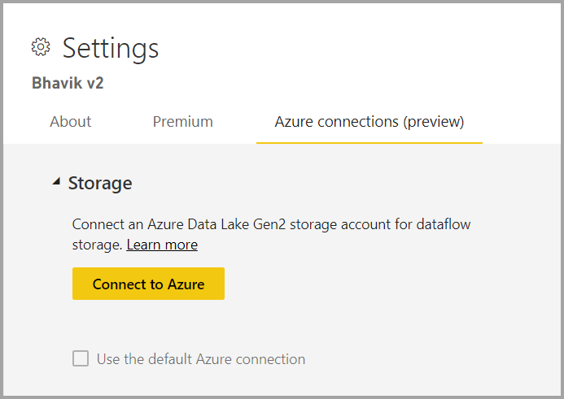
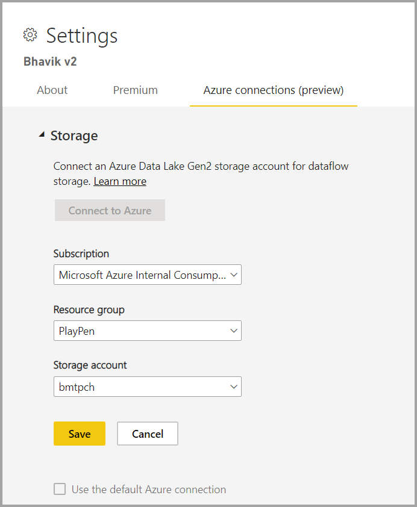

# การกำหนดค่าที่จัดเก็บกระแสข้อมูลเพื่อใช้ Azure Data Lake Gen 2 

ข้อมูลที่ใช้กับ Power BI จะถูกเก็บไว้ในที่เก็บข้อมูลภายในโดย Power BI ตามค่าเริ่มต้น ด้วยการรวมกันของกระแสข้อมูลและ Azure Data Lake Storage Gen 2 (ADLS Gen2) คุณสามารถจัดเก็บกระแสข้อมูลของคุณในบัญชี Azure Data Lake Storage Gen2 ภายในองค์กรของคุณได้

มีวิธีการกำหนดค่าที่เก็บ ADLS Gen 2 ที่จะใช้สองวิธี: คุณสามารถใช้บัญชี ADLS gen 2 ที่กำหนดให้ผู้เช่า หรือคุณสามารถนำที่เก็บ ADLS Gen 2 ของคุณเองมาใช้ในระดับพื้นที่ทำงาน 

## การเตรียมปัจจัยที่จำเป็น

หากต้องการนำบัญชี ADLS Gen 2 ของคุณเองมาใช้ คุณต้องมีสิทธิ์ระดับเจ้าของสำหรับบัญชีที่เก็บข้อมูล กลุ่มทรัพยากร หรือชั้นการสมัครสมาชิก หากคุณเป็นผู้ดูแลระบบ คุณยังต้องกำหนดสิทธิ์เจ้าของด้วยตัวคุณเอง 

คุณต้องสร้างบัญชีที่เก็บข้อมูลด้วยการเปิดใช้งาน[เนมสเปซแบบลำดับชั้น (HNS)](/azure/storage/blobs/create-data-lake-storage-account) 

นอกจากนี้ คุณต้องปรับใช้งานบัญชี ADLS Gen 2 ในภูมิภาคเดียวกันกับผู้เช่า Power BI ของคุณ มีข้อผิดพลาดเกิดขึ้นถ้าตำแหน่งที่ตั้งของทรัพยากรไม่ได้อยู่ในภูมิภาคเดียวกัน

สุดท้ายคุณสามารถเชื่อมต่อกับ ADLS gen 2 จากพอร์ทัลผู้ดูแลระบบ แต่ถ้าคุณเชื่อมต่อโดยตรงกับพื้นที่ทำงาน ก่อนอื่นคุณต้องตรวจสอบให้แน่ใจว่าไม่มีกระแสข้อมูลในพื้นที่ทำงานก่อนที่จะเชื่อมต่อ

## การเชื่อมต่อกับ Azure Data Lake Gen 2 ในพื้นที่ทำงาน
นำทางไปยังพื้นที่ทำงานที่ไม่มีกระแสข้อมูล เลือก **การตั้งค่าพื้นที่ทำงาน** ไปที่แท็บใหม่ชื่อ **การเชื่อมต่อ Azure** เลือกแท็บ **การเชื่อมต่อ Azure** จากนั้นเลือกส่วน **ที่จัดเก็บ**

 
ตัวเลือก **ใช้การเชื่อมต่อ Azure ค่าเริ่มต้น** จะปรากฏให้เห็นหากผู้เช่าได้กำหนดค่า ADLS Gen 2 แล้ว คุณมีสองทางเลือก: ใช้ผู้เช่าที่กำหนดค่า ADLS gen 2 โดยเลือกช่องที่เรียกว่า **ใช้การเชื่อมต่อ Azure ค่าเริ่มต้น** หรือเลือก **เชื่อมต่อกับ Azure** เพื่อชี้ไปที่บัญชี Azure Storage ใหม่ 

เมื่อคุณเลือก **เชื่อมต่อกับ Azure** Power BI จะดึงรายการการสมัครใช้งาน Azure ที่คุณสามารถเข้าถึงได้ กรอกข้อมูลในดรอปดาวน์และเลือกการสมัครใช้งาน Azure กลุ่มทรัพยากร และบัญชีหน่วยเก็บข้อมูลที่ถูกต้องซึ่งเปิดใช้งานตัวเลือกเนมสเปซแบบลำดับชั้นซึ่งเป็นแฟล็กหรือตัวแสดงสถานะ ADLS Gen2

 
เมื่อเลือกแล้ว ให้เลือก **บันทึก** และตอนนี้คุณได้เชื่อมต่อพื้นที่ทำงานกับบัญชี ADLS Gen2 ของคุณเองเรียบร้อยแล้ว Power BI จะกำหนดค่าบัญชีที่จัดเก็บโดยอัตโนมัติด้วยสิทธิ์ที่จำเป็นและตั้งค่าระบบไฟล์ Power BI ที่จะเขียนข้อมูล ณ จุดนี้ข้อมูลทั้งหมดของกระแสข้อมูลภายในพื้นที่ทำงานนี้จะเขียนลงในระบบไฟล์นี้โดยตรง ซึ่งสามารถใช้กับบริการ Azure อื่น ๆ ได้โดยสร้างแหล่งข้อมูลเดียวสำหรับข้อมูลองค์กรหรือแผนกทั้งหมดของคุณ

## การแยก Azure Data Lake Gen 2 ออกจากพื้นที่ทำงานหรือผู้เช่า

หากต้องการลบการเชื่อมต่อในระดับพื้นที่ทำงาน ก่อนอื่นคุณต้องแน่ใจว่าคุณได้ลบกระแสข้อมูลทั้งหมดในพื้นที่ทำงานแล้ว เมื่อลบกระแสข้อมูลทั้งหมดแล้ว ให้เลือก **ยกเลิกการเชื่อมต่อ** ในการตั้งค่าพื้นที่ทำงาน เช่นเดียวกันกับผู้เช่า แต่ก่อนอื่นคุณต้องแน่ใจว่าคุณได้ยกเลิกการเชื่อมต่อพื้นที่ทำงานทั้งหมดจากบัญชีที่เก็บข้อมูลของผู้เช่าแล้ว ก่อนที่คุณจะสามารถยกเลิกการเชื่อมต่อในระดับผู้เช่าได้

## การปิดใช้งาน Azure Data Lake Gen 2

ใน **พอร์ทัลผู้ดูแลระบบ** ภายใต้ **กระแสข้อมูล** คุณสามารถปิดใช้งานการเข้าถึงสำหรับผู้ใช้เพื่อใช้คุณลักษณะนี้และสามารถไม่อนุญาตให้ผู้ดูแลระบบพื้นที่ทำงานนำ Azure Storage ของตนเองมาใช้ได้

## ขั้นตอนถัดไป
บทความต่อไปนี้ให้ข้อมูลเพิ่มเติมเกี่ยวกับกระแสข้อมูลและ Power BI:

* [ข้อมูลเบื้องต้นเกี่ยวกับกระแสข้อมูลและการเตรียมข้อมูลด้วยตนเอง](dataflows-introduction-self-service.md)
* [การสร้างกระแสข้อมูล](dataflows-create.md)
* [กำหนดค่าและใช้กระแสข้อมูล](dataflows-configure-consume.md)
* [ฟีเจอร์พรีเมียมของกระแสข้อมูล](dataflows-premium-features.md)
* [AI กับกระแสข้อมูล](dataflows-machine-learning-integration.md)
* [ข้อจำกัดและข้อควรพิจารณาของกระแสข้อมูล](dataflows-features-limitations.md)
* [แนวทางปฏิบัติที่ดีที่สุดสำหรับกระแสข้อมูล](dataflows-best-practices.md)