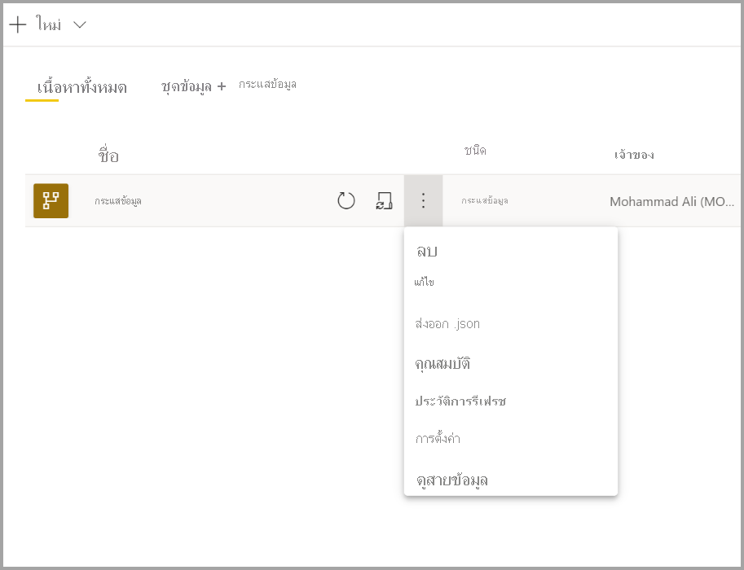
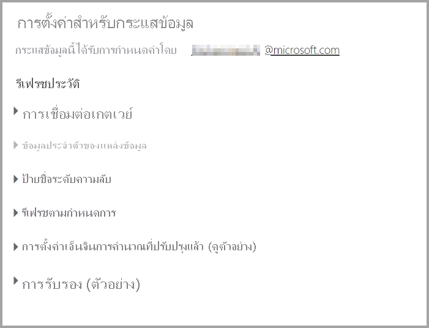
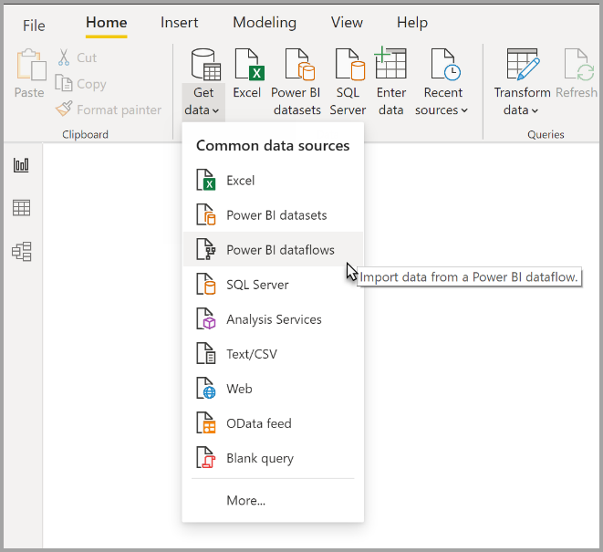

# กำหนดค่าและใช้กระแสข้อมูล

ด้วยกระแสข้อมูล คุณสามารถรวมข้อมูลจากหลายแหล่งและเตรียมข้อมูลที่เป็นหนึ่งเดียวสำหรับการสร้างแบบจำลอง เมื่อใดก็ตามที่คุณสร้างกระแสข้อมูล คุณจะได้รับแจ้งให้รีเฟรชข้อมูลสำหรับกระแสข้อมูล จำเป็นต้องมีการรีเฟรชกระแสข้อมูลก่อนจึงจะสามารถใช้งานในชุดข้อมูลภายใน Power BI Desktop หรืออ้างอิงเป็นเอนทิตีที่เชื่อมโยงหรือคำนวณ

## การกำหนดค่ากระแสข้อมูล

หากต้องการกำหนดค่าการรีเฟรชกระแสข้อมูล ให้เลือกเมนู **เพิ่มเติม** (จุดไข่ปลา) และเลือก **การตั้งค่า**

ตัวเลือก **การตั้งค่า** มีตัวเลือกมากมายสำหรับกระแสข้อมูลของคุณ ดังที่อธิบายในส่วนต่อไปนี้

* **มีความเป็นเจ้าของ:** หากคุณไม่ใช่เจ้าของกระแสข้อมูล การตั้งค่าเหล่านี้จำนวนมากจะถูกปิดใช้งาน หากต้องการเป็นเจ้าของกระแสข้อมูล ให้เลือก **เข้าครอง** เพื่อใช้การควบคุม คุณจะได้รับแจ้งให้ระบุข้อมูลประจำตัวเพื่อให้แน่ใจว่าคุณมีระดับการเข้าถึงที่จำเป็น

* **การเชื่อมต่อเกตเวย์:** ในส่วนนี้ คุณสามารถเลือกได้ว่าจะให้กระแสข้อมูลใช้เกตเวย์หรือไม่ และเลือกว่าจะใช้เกตเวย์ใด 

* **ข้อมูลประจำตัวของแหล่งข้อมูล:** ในส่วนนี้คุณสามารถเลือกได้ว่าจะใช้ข้อมูลประจำตัวใด และสามารถเปลี่ยนวิธีการพิสูจน์ตัวตนกับแหล่งข้อมูลได้

* **ป้ายชื่อระดับความลับ:** ที่นี่คุณสามารถกำหนดความอ่อนไหวของข้อมูลในกระแสข้อมูลได้ หากต้องการเรียนรู้เพิ่มเติมเกี่ยวกับป้ายชื่อระดับความลับ โปรดดู [วิธีการใช้ป้ายชื่อระดับความลับใน Power BI](../../admin/service-security-apply-data-sensitivity-labels.md)

* **รีเฟรชตามกำหนดการ:** ที่นี่คุณสามารถกำหนดช่วงเวลาของวันที่การรีเฟรชกระแสข้อมูลที่เลือกได้ คุณสามารถรีเฟรชกระแสข้อมูลที่ความถี่เดียวกับชุดข้อมูลได้

* **การตั้งค่ากลไกการคำนวณขั้นสูง:** ที่นี่คุณสามารถกำหนดได้ว่าจะจัดเก็บกระแสข้อมูลไว้ในกลไกการคำนวณหรือไม่ กลไกการคำนวณช่วยให้กระแสข้อมูลที่ตามมา ซึ่งอ้างอิงกระแสข้อมูลนี้ ทำการผสานและรวมและการแปลงอื่น ๆ ได้เร็วกว่าที่คุณเคยทำ นอกจากนี้ยังอนุญาตให้ DirectQuery ดำเนินการผ่านกระแสข้อมูล การเลือก **เปิด** ทำให้แน่ใจว่าระบบรองรับกระแสข้อมูลในโหมด DirectQuery เสมอและการอ้างอิงใดก็ตามจะได้รับประโยชน์จากกลไกดังกล่าว การเลือก **แบบปรับให้เหมาะสม** หมายความว่ากลไกจะถูกใช้ก็ต่อเมื่อมีการอ้างอิงถึงกระแสข้อมูลนี้ การเลือก **ปิด** จะปิดใช้งานกลไกการคำนวณและความสามารถของ DirectQuery สำหรับกระแสข้อมูลนี้

* **การรับรอง:** คุณสามารถกำหนดว่าคุณจะรับรองหรือเลื่อนระดับกระแสข้อมูลหรือไม่ 

## รีเฟรชกระแสข้อมูล
กระแสข้อมูลทำหน้าที่เป็นบล็อกการสร้างอยู่ด้านบนของกันและกัน สมมติว่าคุณมีกระแสข้อมูลที่เรียกว่า *ข้อมูลดิบ* และเอนทิตีที่เชื่อมโยงชื่อ *ข้อมูลที่แปลงแล้ว* ซึ่งประกอบด้วยเอนทิตีที่เชื่อมโยงกับกระแสข้อมูล *ข้อมูลดิบ* เมื่อรีเฟรชตามกำหนดการสำหรับกระแสข้อมูล *ข้อมูลดิบ* ทริกเกอร์ ระบบจะทริกเกอร์กระแสข้อมูลใดก็ตามที่อ้างถึงเมื่อเสร็จสิ้น ฟังก์ชันการทำงานนี้จะสร้างเอฟเฟกต์ลูกโซ่ของการรีเฟรชซึ่งช่วยให้คุณไม่ต้องกำหนดเวลากระแสข้อมูลด้วยตนเอง มีความแตกต่างบางประการที่ต้องระวังเมื่อจัดการกับการรีเฟรชเอนทิตีที่มีการเชื่อมโยง:

* เอนทิตีที่มีการเชื่อมโยงจะถูกทริกเกอร์โดยการรีเฟรชเฉพาะในกรณีที่มีอยู่ในพื้นที่ทำงานเดียวกัน

* เอนทิตีที่มีการเชื่อมโยงจะถูกล็อกสำหรับการแก้ไขหากมีการรีเฟรชเอนทิตีต้นทาง หากการรีเฟรชกระแสข้อมูลใดก็ตามในห่วงโซ่อ้างอิงล้มเหลว กระแสข้อมูลทั้งหมดจะย้อนกลับไปเป็นข้อมูลเก่า (การรีเฟรชกระแสข้อมูลเป็นการทำธุรกรรมภายในพื้นที่ทำงาน)

* มีการรีเฟรชเอนทิตีที่อ้างอิงเฉพาะเมื่อการรีเฟรชต้นทางทริกเกอร์เสร็จสมบูรณ์แล้ว หากต้องการกำหนดเวลาเอนทิตีทั้งหมด คุณควรตั้งค่าการรีเฟรชตามกำหนดการในเอนทิตีที่เชื่อมโยงด้วย หลีกเลี่ยงการตั้งค่ากำหนดการรีเฟรชบนกระแสข้อมูลที่เชื่อมโยงเพื่อหลีกเลี่ยงการรีเฟรชสองครั้ง

กระแสข้อมูล **ยกเลิกการรีเฟรช** รองรับความสามารถในการยกเลิกการรีเฟรช ซึ่งแตกต่างจากชุดข้อมูล หากการรีเฟรชทำงานเป็นเวลานาน คุณสามารถเลือกตัวเลือกกระแสข้อมูล (จุดไข่ปลาที่อยู่ถัดจากกระแสข้อมูล) จากนั้นเลือก **ยกเลิกการรีเฟรช**

**การรีเฟรชแบบเพิ่มหน่วย (Premium เท่านั้น)** คุณสามารถตั้งค่าให้รีเฟรชกระแสข้อมูลทีละน้อยได้ เมื่อต้องการทำเช่นนั้น ให้เลือกกระแสข้อมูลที่คุณต้องการตั้งค่าสำหรับการรีเฟรชแบบเพิ่มหน่วย จากนั้นเลือกไอคอนการรีเฟรชแบบเพิ่มหน่วย

การตั้งค่าการรีเฟรชแบบเพิ่มหน่วยจะเพิ่มพารามิเตอร์ให้กับกระแสข้อมูลเพื่อระบุช่วงวันที่ สำหรับข้อมูลโดยละเอียดเกี่ยวกับวิธีตั้งค่าการรีเฟรชแบบเพิ่มหน่วย โปรดดูบทความ [การรีเฟรชแบบเพิ่มหน่วยใน Power Query](/power-query/dataflows/incremental-refresh)

มีบางสถานการณ์ที่คุณไม่ควรตั้งค่าการรีเฟรชแบบเพิ่มหน่วย:

* เอนทิตีที่เชื่อมโยงไม่ควรใช้การรีเฟรชแบบเพิ่มหน่วยหากอ้างอิงกระแสข้อมูล กระแสข้อมูลไม่สนับสนุนการพับคิวรี (แม้ว่าเอนทิตีจะเปิดใช้งาน Direct Query) 

* ชุดข้อมูลที่อ้างอิงกระแสข้อมูลไม่ควรใช้การรีเฟรชแบบเพิ่มหน่วย โดยทั่วไปการรีเฟรชกระแสข้อมูลจะมีประสิทธิภาพ ดังนั้นจึงไม่จำเป็นต้องมีการรีเฟรชแบบเพิ่มหน่วย ถ้าการรีเฟรชใช้เวลานานเกินไป ให้พิจารณาการใช้กลไกการคำนวณหรือโหมด DirectQuery

## การใช้กระแสข้อมูล

คุณสามารถใช้งานกระแสข้อมูลได้ในสามวิธีต่อไปนี้:

* สร้างเอนทิตีที่เชื่อมโยงจากกระแสข้อมูลเพื่ออนุญาตให้ผู้เขียนกระแสข้อมูลรายอื่นใช้ข้อมูล

* สร้างชุดข้อมูลจากกระแสข้อมูลเพื่ออนุญาตให้ผู้ใช้สามารถใช้ประโยชน์ข้อมูลเพื่อสร้างรายงานได้

* สร้างการเชื่อมต่อจากเครื่องมือภายนอกที่สามารถอ่านจากรูปแบบ CDM ได้

**การใช้งานจาก Power BI Desktop** เมื่อต้องการใช้กระแสข้อมูล ให้เรียกใช้ Power BI Desktop และเลือก **ตัวเชื่อมต่อกระแสข้อมูล Power BI** ในกล่องโต้ตอบ **รับข้อมูล**

> [!NOTE]
> ตัวเชื่อมต่อกระแสข้อมูล Power BI ใช้ชุดข้อมูลประจำตัวที่แตกต่างจากผู้ใช้ที่เข้าสู่ระบบปัจจุบัน นี่คือการออกแบบ เพื่อรองรับผู้ใช้หลายผู้เช่า

เลือกว่ากระแสข้อมูลใดและเอนทิตีใดที่คุณต้องการเชื่อมต่อ 

> [!NOTE]
> คุณสามารถเชื่อมต่อกับกระแสข้อมูลหรือเอนทิตีใดก็ตามไม่ว่าจะอยู่ในพื้นที่ทำงานใดและไม่ว่าจะกำหนดไว้ในพื้นที่ทำงานระดับพรีเมียมหรือไม่ใช่ระดับพรีเมียมก็ตาม

ถ้า DirectQuery พร้อมใช้งาน คุณจะได้รับพร้อมท์แจ้งให้เลือกว่าคุณต้องการเชื่อมต่อกับเอนทิตีผ่าน DirectQuery หรือ Import (นำเข้า) 

ในโหมด DirectQuery คุณสามารถสอบถามชุดข้อมูลขนาดใหญ่ภายในเครื่องได้อย่างรวดเร็ว อย่างไรก็ตาม คุณไม่สามารถดำเนินการแปลงเพิ่มเติมใดก็ตามได้ 

การใช้โหมด นำเข้า จะนำข้อมูลเข้าไปยัง Power BI และจำเป็นต้องมีชุดข้อมูลเพื่อรีเฟรชอย่างอิสระจากกระแสข้อมูล

## ขั้นตอนถัดไป
บทความต่อไปนี้ให้ข้อมูลเพิ่มเติมเกี่ยวกับกระแสข้อมูลและ Power BI:

* [ข้อมูลเบื้องต้นเกี่ยวกับกระแสข้อมูลและการเตรียมข้อมูลด้วยตนเอง](dataflows-introduction-self-service.md)
* [การสร้างกระแสข้อมูล](dataflows-create.md)
* [การกำหนดค่าที่จัดเก็บกระแสข้อมูลเพื่อใช้ Azure Data Lake Gen 2](dataflows-azure-data-lake-storage-integration.md)
* [ฟีเจอร์พรีเมียมของกระแสข้อมูล](dataflows-premium-features.md)
* [AI กับกระแสข้อมูล](dataflows-machine-learning-integration.md)
* [ข้อจำกัดและข้อควรพิจารณาของกระแสข้อมูล](dataflows-features-limitations.md)
* [แนวทางปฏิบัติที่ดีที่สุดสำหรับกระแสข้อมูล](dataflows-best-practices.md)