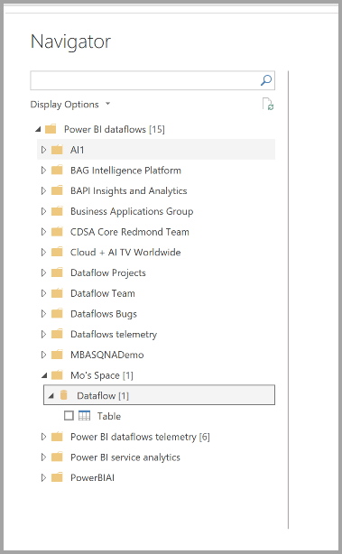

# กำหนดค่าและใช้กระแสข้อมูลConfigure and consume a dataflow

ด้วยกระแสข้อมูล คุณสามารถรวมข้อมูลจากหลายแหล่งและเตรียมข้อมูลที่เป็นหนึ่งเดียวสำหรับการสร้างแบบจำลองWith dataflows, you can unify data from multiple sources and prepare that unified data for modeling. เมื่อใดก็ตามที่คุณสร้างกระแสข้อมูล คุณจะได้รับแจ้งให้รีเฟรชข้อมูลสำหรับกระแสข้อมูลWhenever you create a dataflow, you're prompted to refresh the data for the dataflow. จำเป็นต้องมีการรีเฟรชกระแสข้อมูลก่อนจึงจะสามารถใช้งานในชุดข้อมูลภายใน Power BI Desktop หรืออ้างอิงเป็นเอนทิตีที่เชื่อมโยงหรือคำนวณRefreshing a dataflow is required before it can be consumed in a dataset inside Power BI Desktop, or referenced as a linked or computed entity.

## การกำหนดค่ากระแสข้อมูลConfiguring a dataflow

หากต้องการกำหนดค่าการรีเฟรชกระแสข้อมูล ให้เลือกเมนู **เพิ่มเติม** (จุดไข่ปลา) และเลือก **การตั้งค่า**To configure the refresh of a dataflow, select the **More** menu (the ellipsis) and select **Settings**.

ตัวเลือก **การตั้งค่า** มีตัวเลือกมากมายสำหรับกระแสข้อมูลของคุณ ดังที่อธิบายในส่วนต่อไปนี้The **Settings** options provide many options for your dataflow, as the following sections describe.

* **มีความเป็นเจ้าของ:** หากคุณไม่ใช่เจ้าของกระแสข้อมูล การตั้งค่าเหล่านี้จำนวนมากจะถูกปิดใช้งาน**Take ownership:** If you're not the owner of the dataflow, many of these settings are disabled. หากต้องการเป็นเจ้าของกระแสข้อมูล ให้เลือก **เข้าครอง** เพื่อใช้การควบคุมTo take ownership of the dataflow, select **Take over** to take control. คุณจะได้รับแจ้งให้ระบุข้อมูลประจำตัวเพื่อให้แน่ใจว่าคุณมีระดับการเข้าถึงที่จำเป็นYou are prompted to provide credentials to ensure you have the necessary access level.

* **การเชื่อมต่อเกตเวย์:** ในส่วนนี้ คุณสามารถเลือกได้ว่าจะให้กระแสข้อมูลใช้เกตเวย์หรือไม่ และเลือกว่าจะใช้เกตเวย์ใด**Gateway Connection:** In this section, you can choose whether the dataflow uses a gateway, and select which gateway is used. 

* **ข้อมูลประจำตัวของแหล่งข้อมูล:** ในส่วนนี้คุณสามารถเลือกได้ว่าจะใช้ข้อมูลประจำตัวใด และสามารถเปลี่ยนวิธีการพิสูจน์ตัวตนกับแหล่งข้อมูลได้**Data Source Credentials:** In this section you choose which credentials are being used, and can change how you authenticate to the data source.

* **ป้ายชื่อระดับความลับ:** ที่นี่คุณสามารถกำหนดความอ่อนไหวของข้อมูลในกระแสข้อมูลได้**Sensitivity Label:** Here you can define the sensitivity of the data in the dataflow. หากต้องการเรียนรู้เพิ่มเติมเกี่ยวกับป้ายชื่อระดับความลับ โปรดดู [วิธีการใช้ป้ายชื่อระดับความลับใน Power BI](../../admin/service-security-apply-data-sensitivity-labels.md)To learn more about sensitivity labels, see [how to apply sensitivity labels in Power BI](../../admin/service-security-apply-data-sensitivity-labels.md).

* **รีเฟรชตามกำหนดการ:** ที่นี่คุณสามารถกำหนดช่วงเวลาของวันที่การรีเฟรชกระแสข้อมูลที่เลือกได้**Scheduled Refresh:** Here you can define the times of day the selected dataflow refreshes. คุณสามารถรีเฟรชกระแสข้อมูลที่ความถี่เดียวกับชุดข้อมูลได้A dataflow can be refreshed at the same frequency as a dataset.

* **การตั้งค่ากลไกการคำนวณขั้นสูง:** ที่นี่คุณสามารถกำหนดได้ว่าจะจัดเก็บกระแสข้อมูลไว้ในกลไกการคำนวณหรือไม่**Enhanced Compute Engine settings:** Here you can define whether the dataflow is stored inside the compute engine. กลไกการคำนวณช่วยให้กระแสข้อมูลที่ตามมา ซึ่งอ้างอิงกระแสข้อมูลนี้ ทำการผสานและรวมและการแปลงอื่น ๆ ได้เร็วกว่าที่คุณเคยทำThe compute engine allows subsequent dataflows, which reference this dataflow, to perform merges and joins and other transformations much faster than you would otherwise. นอกจากนี้ยังอนุญาตให้ DirectQuery ดำเนินการผ่านกระแสข้อมูลIt also allows DirectQuery to be performed over the dataflow. การเลือก **เปิด** ทำให้แน่ใจว่าระบบรองรับกระแสข้อมูลในโหมด DirectQuery เสมอและการอ้างอิงใดก็ตามจะได้รับประโยชน์จากกลไกดังกล่าวSelecting **On** ensures the dataflow is always supported in DirectQuery mode, and any references benefit from the engine. การเลือก **แบบปรับให้เหมาะสม** หมายความว่ากลไกจะถูกใช้ก็ต่อเมื่อมีการอ้างอิงถึงกระแสข้อมูลนี้Selecting **Optimized** means the engine is only used if there is a reference to this dataflow. การเลือก **ปิด** จะปิดใช้งานกลไกการคำนวณและความสามารถของ DirectQuery สำหรับกระแสข้อมูลนี้Selecting **Off** disables the compute engine and DirectQuery capability for this dataflow.

* **การรับรอง:** คุณสามารถกำหนดว่าคุณจะรับรองหรือเลื่อนระดับกระแสข้อมูลหรือไม่**Endorsements:** You can define whether the dataflow is certified or promoted. 

## รีเฟรชกระแสข้อมูลRefreshing a dataflow
กระแสข้อมูลทำหน้าที่เป็นบล็อกการสร้างอยู่ด้านบนของกันและกันDataflows act as building blocks on top of one another. สมมติว่าคุณมีกระแสข้อมูลที่เรียกว่า *ข้อมูลดิบ* และเอนทิตีที่เชื่อมโยงชื่อ *ข้อมูลที่แปลงแล้ว* ซึ่งประกอบด้วยเอนทิตีที่เชื่อมโยงกับกระแสข้อมูล *ข้อมูลดิบ*Suppose you have a dataflow called *Raw Data* and a linked entity called *Transformed Data* which contains a linked entity to the *Raw Data* dataflow. เมื่อรีเฟรชตามกำหนดการสำหรับกระแสข้อมูล *ข้อมูลดิบ* ทริกเกอร์ ระบบจะทริกเกอร์กระแสข้อมูลใดก็ตามที่อ้างถึงเมื่อเสร็จสิ้นWhen the schedule refresh for the dataflow *Raw Data* triggers, it will trigger any dataflow that references it upon completion. ฟังก์ชันการทำงานนี้จะสร้างเอฟเฟกต์ลูกโซ่ของการรีเฟรชซึ่งช่วยให้คุณไม่ต้องกำหนดเวลากระแสข้อมูลด้วยตนเองThis functionality creates a chain effect of refreshes, allowing you to avoid having to schedule dataflows manually. มีความแตกต่างบางประการที่ต้องระวังเมื่อจัดการกับการรีเฟรชเอนทิตีที่มีการเชื่อมโยง:There are a few nuances to be aware of when dealing with linked entities refreshes:

* เอนทิตีที่มีการเชื่อมโยงจะถูกทริกเกอร์โดยการรีเฟรชเฉพาะในกรณีที่มีอยู่ในพื้นที่ทำงานเดียวกันA linked entity will be triggered by a refresh only if it exists in the same workspace

* เอนทิตีที่มีการเชื่อมโยงจะถูกล็อกสำหรับการแก้ไขหากมีการรีเฟรชเอนทิตีต้นทางA linked entity will be locked for editing if a source entity is being refreshed. หากการรีเฟรชกระแสข้อมูลใดก็ตามในห่วงโซ่อ้างอิงล้มเหลว กระแสข้อมูลทั้งหมดจะย้อนกลับไปเป็นข้อมูลเก่า (การรีเฟรชกระแสข้อมูลเป็นการทำธุรกรรมภายในพื้นที่ทำงาน)If any of the dataflows in a reference chain fail to refresh, all the dataflows will roll back to the old data (dataflow refreshes are transactional within a workspace).

* มีการรีเฟรชเอนทิตีที่อ้างอิงเฉพาะเมื่อการรีเฟรชต้นทางทริกเกอร์เสร็จสมบูรณ์แล้วOnly referenced entities are refreshed when triggered by a source refresh completion. หากต้องการกำหนดเวลาเอนทิตีทั้งหมด คุณควรตั้งค่าการรีเฟรชตามกำหนดการในเอนทิตีที่เชื่อมโยงด้วยTo schedule all the entities, you should set a schedule refresh on the linked entity as well. หลีกเลี่ยงการตั้งค่ากำหนดการรีเฟรชบนกระแสข้อมูลที่เชื่อมโยงเพื่อหลีกเลี่ยงการรีเฟรชสองครั้งAvoid setting a refresh schedule on linked dataflows to avoid double refresh.

กระแสข้อมูล **ยกเลิกการรีเฟรช** รองรับความสามารถในการยกเลิกการรีเฟรช ซึ่งแตกต่างจากชุดข้อมูล**Cancel Refresh** Dataflows support the ability to cancel a refresh, unlike datasets. หากการรีเฟรชทำงานเป็นเวลานาน คุณสามารถเลือกตัวเลือกกระแสข้อมูล (จุดไข่ปลาที่อยู่ถัดจากกระแสข้อมูล) จากนั้นเลือก **ยกเลิกการรีเฟรช**If a refresh is running a long time, you can select the dataflow options (the ellipses next to the dataflow) and then select **Cancel refresh**.

**การรีเฟรชแบบเพิ่มหน่วย (Premium เท่านั้น)** คุณสามารถตั้งค่าให้รีเฟรชกระแสข้อมูลทีละน้อยได้**Incremental Refresh (Premium only)** Dataflows can be also set to refresh incrementally. เมื่อต้องการทำเช่นนั้น ให้เลือกกระแสข้อมูลที่คุณต้องการตั้งค่าสำหรับการรีเฟรชแบบเพิ่มหน่วย จากนั้นเลือกไอคอนการรีเฟรชแบบเพิ่มหน่วยTo do so, select the dataflow you wish to set up for incremental refresh, and then select the incremental refresh icon.

การตั้งค่าการรีเฟรชแบบเพิ่มหน่วยจะเพิ่มพารามิเตอร์ให้กับกระแสข้อมูลเพื่อระบุช่วงวันที่Setting incremental refresh adds parameters to the dataflow to specify the date range. สำหรับข้อมูลโดยละเอียดเกี่ยวกับวิธีตั้งค่าการรีเฟรชแบบเพิ่มหน่วย โปรดดูบทความ [การรีเฟรชแบบเพิ่มหน่วยใน Power Query](/power-query/dataflows/incremental-refresh)For detailed information on how to set up incremental refresh, see the [incremental refresh in Power Query](/power-query/dataflows/incremental-refresh) article.

มีบางสถานการณ์ที่คุณไม่ควรตั้งค่าการรีเฟรชแบบเพิ่มหน่วย:There are some circumstances under which you should not set incremental refresh:

* เอนทิตีที่เชื่อมโยงไม่ควรใช้การรีเฟรชแบบเพิ่มหน่วยหากอ้างอิงกระแสข้อมูลLinked entities should not use incremental refresh if they reference a dataflow. กระแสข้อมูลไม่สนับสนุนการพับคิวรี (แม้ว่าเอนทิตีจะเปิดใช้งาน Direct Query)Dataflows do not support query folding (even if the entity is Direct Query enabled). 

* ชุดข้อมูลที่อ้างอิงกระแสข้อมูลไม่ควรใช้การรีเฟรชแบบเพิ่มหน่วยDatasets referencing dataflows should not use incremental refresh. โดยทั่วไปการรีเฟรชกระแสข้อมูลจะมีประสิทธิภาพ ดังนั้นจึงไม่จำเป็นต้องมีการรีเฟรชแบบเพิ่มหน่วยRefreshes to dataflows are  generally performant, so incremental refreshes shouldn't be necessary. ถ้าการรีเฟรชใช้เวลานานเกินไป ให้พิจารณาการใช้กลไกการคำนวณหรือโหมด DirectQueryIf refreshes take too long, consider using the compute engine, or DirectQuery mode.

## การใช้กระแสข้อมูลConsuming a dataflow

คุณสามารถใช้งานกระแสข้อมูลได้ในสามวิธีต่อไปนี้:A dataflow can be consumed in the following three ways:

* สร้างเอนทิตีที่เชื่อมโยงจากกระแสข้อมูลเพื่ออนุญาตให้ผู้เขียนกระแสข้อมูลรายอื่นใช้ข้อมูลCreate a linked entity from the dataflow to allow another dataflow author to use the data

* สร้างชุดข้อมูลจากกระแสข้อมูลเพื่ออนุญาตให้ผู้ใช้สามารถใช้ประโยชน์ข้อมูลเพื่อสร้างรายงานได้Create a dataset from the dataflow to allow a user to utilize the data to create reports

* สร้างการเชื่อมต่อจากเครื่องมือภายนอกที่สามารถอ่านจากรูปแบบ CDM ได้Create a connection from external tools that can read from the CDM format

**การใช้งานจาก Power BI Desktop** เมื่อต้องการใช้กระแสข้อมูล ให้เรียกใช้ Power BI Desktop และเลือก **ตัวเชื่อมต่อกระแสข้อมูล Power BI** ในกล่องโต้ตอบ **รับข้อมูล****Consuming from Power BI Desktop** To consume a dataflow, run Power BI Desktop and select the **Power BI dataflows connector** in the **Get Data** dialog.

> [!NOTE]
> ตัวเชื่อมต่อกระแสข้อมูล Power BI ใช้ชุดข้อมูลประจำตัวที่แตกต่างจากผู้ใช้ที่เข้าสู่ระบบปัจจุบันThe Power BI dataflows connector uses a different set of credentials than the current logged in user. นี่คือการออกแบบ เพื่อรองรับผู้ใช้หลายผู้เช่าThis is by design, to support multi-tenant users.

เลือกว่ากระแสข้อมูลใดและเอนทิตีใดที่คุณต้องการเชื่อมต่อSelect which dataflow and which entities to which you want to connect. 

> [!NOTE]
> คุณสามารถเชื่อมต่อกับกระแสข้อมูลหรือเอนทิตีใดก็ตามไม่ว่าจะอยู่ในพื้นที่ทำงานใดและไม่ว่าจะกำหนดไว้ในพื้นที่ทำงานระดับพรีเมียมหรือไม่ใช่ระดับพรีเมียมก็ตามYou can connect to any dataflow or entity regardless of which workspace it resides in, and whether or not it was defined in a Premium or non-Premium workspace.

ถ้า DirectQuery พร้อมใช้งาน คุณจะได้รับพร้อมท์แจ้งให้เลือกว่าคุณต้องการเชื่อมต่อกับเอนทิตีผ่าน DirectQuery หรือ Import (นำเข้า)If DirectQuery is available, you're prompted to choose whether you want to connect to the entities through DirectQuery or Import. 

ในโหมด DirectQuery คุณสามารถสอบถามชุดข้อมูลขนาดใหญ่ภายในเครื่องได้อย่างรวดเร็วIn DirectQuery mode, you can quickly interrogate large-scale datasets locally. อย่างไรก็ตาม คุณไม่สามารถดำเนินการแปลงเพิ่มเติมใดก็ตามได้However, you cannot perform any additional transformations. 

การใช้โหมด นำเข้า จะนำข้อมูลเข้าไปยัง Power BI และจำเป็นต้องมีชุดข้อมูลเพื่อรีเฟรชอย่างอิสระจากกระแสข้อมูลUsing Import bring the data into Power BI, and requires the dataset to be refreshed independently of the dataflow.

## ขั้นตอนถัดไปNext steps
บทความต่อไปนี้ให้ข้อมูลเพิ่มเติมเกี่ยวกับกระแสข้อมูลและ Power BI:The following articles provide more information about dataflows and Power BI:

* [ข้อมูลเบื้องต้นเกี่ยวกับกระแสข้อมูลและการเตรียมข้อมูลด้วยตนเองIntroduction to dataflows and self-service data prep](dataflows-introduction-self-service.md)
* [การสร้างกระแสข้อมูลCreating a dataflow](dataflows-create.md)
* [การกำหนดค่าที่จัดเก็บกระแสข้อมูลเพื่อใช้ Azure Data Lake Gen 2Configuring Dataflow storage to use Azure Data Lake Gen 2](dataflows-azure-data-lake-storage-integration.md)
* [ฟีเจอร์พรีเมียมของกระแสข้อมูลPremium features of dataflows](dataflows-premium-features.md)
* [AI กับกระแสข้อมูลAI with dataflows](dataflows-machine-learning-integration.md)
* [ข้อจำกัดและข้อควรพิจารณาของกระแสข้อมูลDataflows limitations and considerations](dataflows-features-limitations.md)
* [แนวทางปฏิบัติที่ดีที่สุดสำหรับกระแสข้อมูลDataflows best practices](dataflows-best-practices.md)